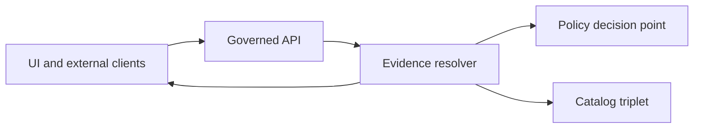

<!-- [KFM_META_BLOCK_V2]
doc_id: kfm://doc/2b3c1b28-4d5a-4c0d-a60c-0b1e9c9330e3
title: packages/evidence/src — Evidence primitives and contracts
type: standard
version: v1
status: draft
owners: TBD
created: 2026-02-25
updated: 2026-02-25
policy_label: public
related:
  - TODO: kfm://doc/<add-related-doc-ids>
tags: [kfm, evidence, contracts]
notes:
  - Source-level README for the evidence package. Defines EvidenceRef/EvidenceBundle and invariants.
[/KFM_META_BLOCK_V2] -->

<a id="top"></a>

# Evidence primitives and contracts (src)

Deterministic, policy-aware **evidence references** and **evidence bundles** used by governed APIs, the evidence drawer, and cite-or-abstain Focus Mode.


## Navigate

- [Purpose](#purpose)
- [Where this fits](#where-this-fits)
- [Directory contract](#directory-contract)
- [Core concepts](#core-concepts)
  - [EvidenceRef](#evidenceref)
  - [EvidenceBundle](#evidencebundle)
- [EvidenceRef schemes](#evidenceref-schemes)
- [EvidenceBundle template](#evidencebundle-template)
- [Resolver interface](#resolver-interface)
- [Deterministic identity and hashing](#deterministic-identity-and-hashing)
- [Policy-safe errors](#policy-safe-errors)
- [Testing and CI gates](#testing-and-ci-gates)
- [Proposed source layout](#proposed-source-layout)
- [Assumptions, risks, tradeoffs, verification](#assumptions-risks-tradeoffs-verification)
- [Appendix: glossary](#appendix-glossary)

---

## Purpose

This `src/` directory is the home for the *core* evidence vocabulary and helper logic that enables KFM’s “trust surfaces”:

- **Evidence-first UX**: every map layer, story claim, and AI answer is explainable via a resolvable evidence view.
- **Cite-or-abstain**: if evidence cannot be verified and resolved under policy, the system must reduce scope or abstain.

In practice, this module should make it *easy to do the right thing* (resolve evidence, show policy, show rights, show provenance), and *hard to do the wrong thing* (free-floating claims, unresolvable citations, leaky errors, nondeterministic IDs).

[Back to top](#top)

## Where this fits

The evidence package sits on the **trust membrane** boundary: UI and external clients can *parse* evidence references, but **only governed APIs** may *resolve* them into bundles after applying policy and obligations.



Typical call-paths that depend on this module:

- **Evidence drawer** (map feature inspect, story claim drawer)
- **Story Node linting** (CI validates citations resolve)
- **Focus Mode** (build evidence bundles, then run the citation verification hard gate)

[Back to top](#top)

## Directory contract

This is a *source folder* README: it describes what **belongs in `packages/evidence/src`** and what **must not** live here.

### Acceptable inputs

- EvidenceRefs (strings) that use explicit schemes (e.g., `dcat://…`, `stac://…`, `doc://…`).
- Structured references (when used): dataset version + record id + span/page anchors.
- Policy outcomes (allow/deny + obligations) and rights metadata *as data objects* (not as a policy engine).

### Exclusions

- No network calls during **parsing/validation** of EvidenceRefs.
- No direct reads from object storage, databases, or search indexes.
- No policy decision implementation (OPA/Rego/ABAC logic belongs in policy subsystem).
- No UI rendering components (this package can shape “cards”, but must remain UI-framework-agnostic).

> **WARNING**  
> If `src/` starts talking to storage or making policy decisions, the trust membrane becomes unenforceable.

[Back to top](#top)

---

## Core concepts

### EvidenceRef

An **EvidenceRef** is a stable, parseable reference to evidence. It is not “just a URL”; it must remain resolvable across rehosting because it uses canonical IDs and anchors (dataset versions, digests, page spans).

Key properties:

- **Parseable without network calls**
- **Scheme-based** (no guessing)
- **Composable** (can reference dataset-level metadata, an asset, a provenance activity, a doc span, etc.)

### EvidenceBundle

An **EvidenceBundle** is the resolved evidence view returned by an evidence resolver. It must include:

- **Human-readable** fields (title, renderable cards)
- **Machine metadata** (dataset version id, artifact digests, provenance links)
- **Policy decision** result + obligations applied
- **Rights metadata** (license, attribution, restrictions)
- **Audit reference** to support reproducibility

Bundles are **immutable by digest** to support caching and replay.

[Back to top](#top)

---

## EvidenceRef schemes

This package should support, at minimum, the following scheme families:

- `dcat://…` — dataset metadata and distributions
- `stac://…` — collections, items, assets
- `prov://…` — provenance activities/entities/agents (run receipts, transforms)
- `doc://…` — scanned docs/OCR citations with page + span anchors
- `graph://…` — graph entities/edges used for entity resolution and relationship traversal

### Document citations: page + span

For scanned documents / OCR, EvidenceRefs should anchor to a **page** and a **span** in the OCR text artifact. Prefer **character offsets** for stable text highlighting; optionally include a bounding box when available.

Example (doc span):

- `doc://sha256:abcd...#page=12&span=1832:1935`

<details>
  <summary>Recommended parsing contract (normative)</summary>

- Parsing MUST be deterministic and offline (no I/O).
- Parsers MUST provide a structured form suitable for:
  - UI rendering (scheme, page/span, stable IDs)
  - Server-side resolution (dataset version lookup + rights/policy checks)
- Parsers MUST reject ambiguous references (fail closed).

</details>

[Back to top](#top)

---

## EvidenceBundle template

Below is an **illustrative template** for a resolved bundle. Keep the shape stable; extend by adding fields rather than mutating semantics.

```json
{
  "bundle_id": "sha256:bundle...",
  "dataset_version_id": "2026-02.abcd1234",
  "title": "Storm event record: 2026-02-19",
  "policy": {
    "decision": "allow",
    "policy_label": "public",
    "obligations_applied": []
  },
  "license": { "spdx": "CC-BY-4.0", "attribution": "Source org" },
  "provenance": { "run_id": "kfm://run/2026-02-20T12:00:00Z.abcd" },
  "artifacts": [
    {
      "href": "processed/events.parquet",
      "digest": "sha256:2222",
      "media_type": "application/x-parquet"
    }
  ],
  "checks": { "catalog_valid": true, "links_ok": true },
  "audit_ref": "kfm://audit/entry/123"
}
```

> **NOTE**  
> A bundle MUST NOT include restricted artifacts for unauthorized roles. If policy denies, return a policy-safe deny response without leaking restricted metadata.

[Back to top](#top)

---

## Resolver interface

This source folder should define a resolver contract that can be implemented in the server and used consistently by:

- evidence drawer resolution
- Story Node citation verification
- Focus Mode evidence bundling + hard citation verification gate

### Required behavior

- Accept either:
  - an `EvidenceRef` string, or
  - a structured reference (dataset version + record id + span)
- Validate syntax (fail closed).
- Apply policy evaluation and obligations.
- Return an EvidenceBundle or a **policy-safe** deny response.

### UI ergonomics requirement

Resolution must be usable in **≤ 2 calls** from the UI, otherwise evidence will be ignored by users.

### Illustrative pseudo-API

```ts
type ResolveInput =
  | { ref: string }
  | { dataset_version_id: string; record_id?: string; page?: number; span?: [number, number] };

type ActorContext = {
  role: string;
  policy_context: Record<string, unknown>;
};

type ResolveResult =
  | { ok: true; bundle: EvidenceBundle }
  | { ok: false; decision: "deny"; reason_code: string };

async function resolveEvidence(input: ResolveInput, actor: ActorContext): Promise<ResolveResult> {
  // 1) parse + validate input
  // 2) policy check
  // 3) gather admissible artifacts + rights metadata + provenance links
  // 4) apply obligations (redact/generalize)
  // 5) emit immutable bundle by digest
}
```

[Back to top](#top)

---

## Deterministic identity and hashing

KFM relies on deterministic identity (e.g., `spec_hash`) to prevent “hash drift” and support caching and signature verification.

This package is the right place for:

- canonical JSON serialization (e.g., RFC 8785 JCS-style canonicalization)
- stable digest computation (`sha256:`-prefixed identifiers)
- “bundle digest” computation for EvidenceBundles

> **TIP**  
> Treat digest computation as part of the contract surface: changes require golden tests and migration notes.

[Back to top](#top)

---

## Policy-safe errors

Evidence resolution must **fail closed**:

- Invalid EvidenceRef syntax → reject with safe error.
- Unresolvable reference → safe “not found” without disclosing restricted details.
- Policy-denied access → safe “denied” without disclosing restricted metadata.
- Rights unclear → treat as deny or “metadata-only reference” (depending on governance).

Minimum error shape guidance:

- a stable `reason_code` for auditing and UX
- no hidden hints about restricted datasets, artifacts, or coordinates

[Back to top](#top)

---

## Testing and CI gates

This module is security and governance-critical. Treat contract changes as “breaking until proven safe”.

### Recommended test matrix

| Invariant | Why it matters | Minimum test |
|---|---|---|
| EvidenceRefs parse offline and deterministically | UI can validate without I/O; prevents ambiguity | unit tests + fuzz |
| Resolver rejects invalid syntax (fail closed) | blocks malformed citations early | unit tests |
| Bundles are immutable by digest | caching + reproducibility | golden digest tests |
| Policy-safe errors never leak restricted metadata | prevents sensitivity leakage | snapshot tests for 403/404 |
| Doc refs highlight stable spans | evidence drawer accuracy | fixture-based tests with sample OCR |
| At least one EvidenceRef per promoted dataset resolves in CI | promotion contract | integration test harness |

### CI gates that should fail closed (repo-level)

- EvidenceRef syntax linting for Story Nodes
- Resolver contract tests in a test environment
- Policy fixtures (allow/deny/obligations)
- Rights metadata presence for included media

[Back to top](#top)

---

## Proposed source layout

> **NOTE**  
> This is a proposed layout. Update it to match the actual code once files exist.

```text
packages/evidence/src/
  README.md

  contracts/           # EvidenceRef, EvidenceBundle, PolicyDecision (types + schemas)
  parse/               # scheme parsers + validators (offline)
  digest/              # canonicalization + hashing helpers (deterministic)
  errors/              # policy-safe error helpers (no leakage)
  __tests__/           # unit + golden tests
```

[Back to top](#top)

---

## Assumptions, risks, tradeoffs, verification

### Assumptions

- This repo uses a governed evidence resolver pattern (server-side) and an evidence drawer (client-side).
- EvidenceRefs are treated as stable identifiers, not transient URLs.
- Bundles are addressed by digest (sha256…) and are immutable.

### Risks

- Changing EvidenceRef parsing rules can invalidate existing Story Nodes and Focus Mode citations.
- Error messages can accidentally leak restricted metadata if not standardized and tested.
- Digest drift breaks caching, signatures, and reproducibility guarantees.

### Tradeoffs

- Strict parsing + fail-closed behavior increases upfront friction but protects governance invariants.
- “Metadata-only reference” mode supports rights constraints but may reduce UX richness.

### Minimum verification steps (to convert unknowns → confirmed)

- Confirm actual package exports and language (TS/JS/etc.).
- Confirm which EvidenceRef schemes are currently in use (if any).
- Add one end-to-end fixture: a public EvidenceRef that resolves to a bundle in CI.
- Add one deny fixture: a restricted EvidenceRef that returns 403 with no metadata leakage.

[Back to top](#top)

---

## Appendix: glossary

- **EvidenceRef**: stable, scheme-based reference to evidence.
- **EvidenceBundle**: resolved evidence view including policy + rights + provenance + digests.
- **Obligation**: required redaction/generalization step returned by policy evaluation.
- **Trust membrane**: rule that all access flows through governed APIs; clients never hit storage directly.
- **Cite-or-abstain**: if citations cannot be verified and resolved, the system must reduce scope or abstain.

[Back to top](#top)
