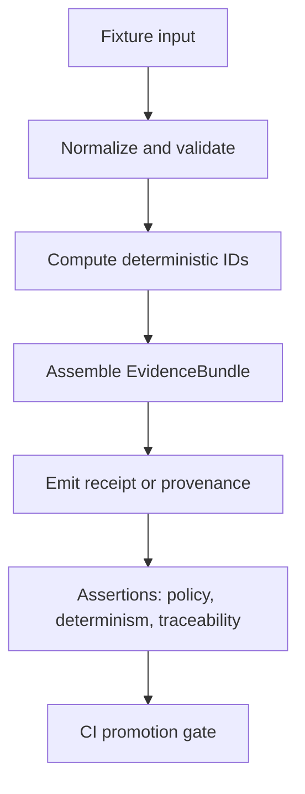

<!-- [KFM_META_BLOCK_V2]
doc_id: kfm://doc/6c8b49f9-4aab-4b2f-9e2e-8dc0b20f88e2
title: packages/evidence/test — Evidence package test suite
type: standard
version: v1
status: draft
owners: TBD
created: 2026-02-25
updated: 2026-02-25
policy_label: internal
related:
  - packages/evidence/README.md
  - packages/evidence/src/
  - packages/evidence/test/
tags: [kfm, evidence, tests]
notes:
  - This README documents the intended structure and operating rules for tests under packages/evidence.
  - Some tooling specifics are intentionally left as TODO until validated against repo scripts.
[/KFM_META_BLOCK_V2] -->

# `packages/evidence/test`

**Purpose:** tests + fixtures that enforce the Evidence-first / Cite-or-abstain “trust membrane” for the Evidence package.

**Status:** `draft` • **Owners:** `TBD`

   

- Quick links: [Overview](#overview) · [Directory layout](#directory-layout) · [What belongs here](#what-belongs-here) · [What-must-not-go-here](#what-must-not-go-here) · [Run tests](#run-tests) · [Test taxonomy](#test-taxonomy) · [Fixtures and golden artifacts](#fixtures-and-golden-artifacts) · [Promotion gates](#promotion-gates) · [Troubleshooting](#troubleshooting)

---

## Overview

This directory is the **home of automated tests** for the Evidence package (located at `packages/evidence`). The intent is to make the system’s Evidence layer:

- **Deterministic** (e.g., stable hashing/IDs, stable sorting, stable serialization)
- **Policy-aware** (e.g., redaction obligations and policy labels are preserved)
- **Traceable** (e.g., evidence objects can point to concrete artifacts)
- **Fail-closed** (tests enforce invariants; ambiguous behavior is treated as an error)

> NOTE
> This README is written to be **repo-safe**: it does **not** assume a specific test runner (Jest/Vitest/pytest/etc.) unless explicitly verified.

---

## Directory layout

**Expected** layout (example; **not confirmed in repo**):

```text
packages/evidence/test/
  README.md
  __fixtures__/
    … small deterministic fixtures (json, md, geojson, etc.)
  __snapshots__/
    … snapshots produced by the test runner (if used)
  helpers/
    … reusable test helpers (builders, factories, deterministic clocks)
  contract/
    … “contract tests” for the public Evidence API surface
  unit/
    … pure unit tests (schema validation, hashing, normalization)
  integration/
    … integration tests (bundle assembly, receipt emission, adapters)
  regression/
    … bug repros turned into permanent tests
```

### Directory registry

| Path | Purpose | Allowed contents | Notes |
|---|---|---|---|
| `unit/` | Fast deterministic tests | pure functions, schema checks | No I/O (preferred) |
| `contract/` | API behavior checks | public API expectations | Ensures safe refactors |
| `integration/` | Multi-module tests | bundle assembly, adapters | Still no network |
| `regression/` | “Never again” tests | minimal repro cases | Links to issue/ADR if available |
| `helpers/` | Shared test utilities | deterministic clocks, factories | Avoid duplicating patterns |
| `__fixtures__/` | Test data | small files only | Prefer text formats + checksums |

---

## What belongs here

✅ **Good fits**

- Tests for Evidence primitives (e.g., `EvidenceRef`, `EvidenceBundle`, IDs, hashing, normalization).
- Tests for “receipt-like” artifacts (audit/provenance outputs) if the Evidence package emits them.
- Fixtures that model:
  - minimal valid objects
  - boundary cases
  - intentionally invalid objects
  - redaction/sensitivity cases
- Property-based tests for determinism (if your test stack supports it).

### What to optimize for

- **Determinism:** tests should pass regardless of locale, time zone, OS, or CPU architecture.
- **Small fixtures:** prefer tiny fixtures that isolate the invariant.
- **No ambient dependencies:** no network calls; no reliance on developer-specific machine state.

---

## What must not go here

❌ **Don’t put these in `packages/evidence/test/`**

- Production code (belongs in `packages/evidence/src/`).
- Large datasets (especially anything that belongs in RAW/WORK lifecycle zones).
- Secrets, tokens, credentials, or private keys.
- Any sensitive or restricted data (PII, culturally sensitive locations, exact coordinates for vulnerable sites).

> WARNING
> If a fixture contains real-world coordinates or site identifiers, treat it as **sensitive by default** unless it is explicitly cleared for publication.

---

## Run tests

Because the monorepo tooling is **not confirmed here**, use the closest matching command below:

### If the repo uses `pnpm`

```bash
pnpm -C packages/evidence test
```

### If the repo uses `npm`

```bash
npm --prefix packages/evidence test
```

### If the repo uses `yarn`

```bash
yarn --cwd packages/evidence test
```

### Recommended deterministic env (portable)

```bash
# Stabilize time + locale in CI when relevant to snapshots/serialization
export TZ=UTC
export LC_ALL=C
export LANG=C
```

> TIP
> If tests compare serialized output, enforce **stable key ordering** and **stable floating point formatting** inside the Evidence package or the test helper.

---

## Test taxonomy

Use test types intentionally:

1. **Unit tests**: validate small functions (pure transforms, schema validation, deterministic IDs)
2. **Contract tests**: lock down the public API surface (input/output shape, error model)
3. **Integration tests**: multiple modules together (e.g., create an EvidenceBundle from inputs)
4. **Regression tests**: bug repros that must stay fixed

### “Trust membrane” test flow



---

## Fixtures and golden artifacts

### Fixture rules

- Keep fixtures **small** and **human readable** when possible.
- Prefer **synthetic** data over real data.
- If you must include real samples, redact and annotate the provenance and policy label.

### Golden artifact rules

If your tests snapshot outputs (JSON, NDJSON, Markdown, etc.), treat those outputs as governed artifacts:

- Include a short header comment in the fixture describing:
  - why it exists
  - what invariant it covers
  - any policy/redaction assumptions
- Do not auto-update snapshots in CI without human review.

---

## Promotion gates

This folder exists to support promotion gates by ensuring Evidence objects are safe to “ship” across lifecycle boundaries.

**Minimum gate expectations (align to system governance):**

- [ ] Identity: deterministic IDs/hashes do not change across runs for the same input
- [ ] Provenance: evidence can point to its source artifact(s)
- [ ] Schema: strict validation with useful error messages
- [ ] Policy: policy labels propagate; redaction rules are enforced
- [ ] Auditability: “who/what/when/why” fields present when required

> NOTE
> Exact gate definitions are owned by the governance docs and CI configuration; treat this section as a checklist, not the authoritative source.

---

## Troubleshooting

### Tests fail only in CI

- Check time zone / locale differences (`TZ`, `LC_ALL`).
- Check Node/Python version mismatch.
- Ensure snapshots do not embed absolute paths or timestamps.

### Flaky tests

- Remove randomness or seed it.
- Remove reliance on current time.
- Avoid unordered iteration (object keys, hash maps) unless stabilized.

### “It passes locally but fails on Windows/macOS”

- Normalize newlines (`\n`), path separators, and UTF-8 encoding.

---

## References

- Governance and system invariants: see the KFM design/governance guide.
- Repo collaboration basics (branching, staging, clean commits): Beej’s Guide to Git.
