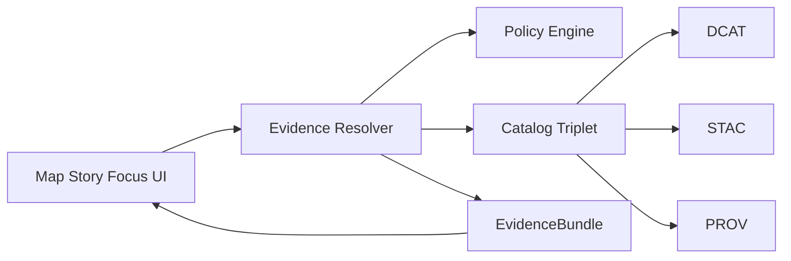

<!-- [KFM_META_BLOCK_V2]
doc_id: kfm://doc/921d126e-231c-4185-b035-4c870002a8ab
title: Evidence contract tests
type: standard
version: v1
status: draft
owners: TODO
created: 2026-02-25
updated: 2026-02-25
policy_label: public
related:
  - TODO: packages/evidence/README.md
  - TODO: contracts/openapi/kfm-api-v1.yaml
  - TODO: contracts/schemas/evidence_bundle_v1.schema.json
tags: [kfm, evidence, contract-tests, promotion-gate]
notes:
  - Contract tests that enforce Gate F for the Evidence Resolver.
[/KFM_META_BLOCK_V2] -->

<a id="top"></a>

# Evidence contract tests

Contract-first, fixtures-driven tests that enforce the Evidence Resolver API and schema surface so **policy-safe evidence** is always resolvable, deterministic, and non-leaking.

[](#)
[](#)
[](#)
[](#)

## Navigation

- [Purpose](#purpose)
- [Where this fits](#where-this-fits)
- [What belongs here](#what-belongs-here)
- [Contract surfaces](#contract-surfaces)
- [Required test cases](#required-test-cases)
- [Suggested directory layout](#suggested-directory-layout)
- [Running locally](#running-locally)
- [Adding a contract test](#adding-a-contract-test)
- [CI integration](#ci-integration)
- [Troubleshooting](#troubleshooting)
- [Glossary](#glossary)

---

## Purpose

This folder contains **contract tests** for the `evidence` package, focused on the Evidence Resolver.

These tests are intended to be *merge-blocking* because they implement **Promotion Contract Gate F**:

- policy tests pass for the dataset version
- evidence resolution works for at least one `EvidenceRef` in CI
- API contracts and schemas validate

> [!IMPORTANT]
> Contract tests are a governance control, not “nice-to-have QA”.
> If these tests fail, we fail closed: no promotion, no publish, no story.

[Back to top](#top)

---

## Where this fits

KFM treats catalogs and provenance as **contract surfaces**. The Evidence Resolver sits at the boundary between:

- catalogs and lineage (DCAT, STAC, PROV)
- policy enforcement
- UI surfaces that must present evidence in one click

The contract tests here make sure the boundary remains safe and stable.



Design constraint: UI should be able to resolve evidence in **two calls or fewer**.

[Back to top](#top)

---

## What belongs here

### Acceptable inputs

- **Fixtures** representing promoted dataset versions
  - minimal DCAT, STAC, and PROV examples with valid cross-links
  - sample artifacts with **digests** and media types
- **Policy fixtures** for allow and deny scenarios
  - public user
  - steward user
  - restricted dataset
- **Golden outputs**
  - expected `EvidenceBundle` JSON
  - canonical ordering and stable hashing expectations
- **Contract validators**
  - OpenAPI request and response validation
  - JSON Schema validation for bundles and catalogs

### Exclusions

- No live network calls
- No real restricted data or precise sensitive coordinates
- No long-running end-to-end UI tests
- No performance benchmarks

> [!WARNING]
> If a fixture might be sensitive, it does not belong here.
> Use synthetic data and validate the *policy behavior*, not the real-world secret.

[Back to top](#top)

---

## Contract surfaces

The contract tests should cover these surfaces.

| Surface | What must stay true | What we validate here |
|---|---|---|
| Evidence resolution input | Accepts `EvidenceRef` schemes like `dcat://`, `stac://`, `prov://`, `doc://` and structured refs | Parser coverage and resolver routing |
| Evidence resolution output | Returns an `EvidenceBundle` with human card, machine metadata, digests, dataset version ids, and audit references | JSON Schema validation and golden snapshots |
| Policy posture | Applies policy and returns allow or deny plus obligations | Allow and deny fixtures, non-leak checks |
| Cross-link integrity | DCAT, STAC, and PROV cross-links are present and resolvable | Link checker runs on fixtures |
| Deterministic identity | Stable bundle ids and stable hashing output | Golden hashes and canonical JSON ordering |

### EvidenceBundle shape

The bundle shape is intentionally compact so it can render as a UI card and also be machine-consumed.

```json
{
  "bundle_id": "sha256:bundle...",
  "dataset_version_id": "2026-02.abcd1234",
  "title": "Storm event record: 2026-02-19",
  "policy": {
    "decision": "allow",
    "policy_label": "public",
    "obligations_applied": []
  },
  "license": { "spdx": "CC-BY-4.0", "attribution": "Source org" },
  "provenance": { "run_id": "kfm://run/2026-02-20T12:00:00Z.abcd" },
  "artifacts": [
    { "href": "processed/events.parquet", "digest": "sha256:2222", "media_type": "application/x-parquet" }
  ],
  "checks": { "catalog_valid": true, "links_ok": true },
  "audit_ref": "kfm://audit/entry/123"
}
```

[Back to top](#top)

---

## Required test cases

The minimum credible set, aligned to KFM CI expectations:

### Resolver behavior

- [ ] Resolves `dcat://…` reference to a bundle
- [ ] Resolves `stac://…` reference to a bundle
- [ ] Resolves `prov://…` reference to a bundle
- [ ] Resolves `doc://…` reference to a bundle
- [ ] Returns **stable ids** and a **bundle digest** for the same input

### Policy behavior

- [ ] A public user can resolve public evidence and receives allowed artifact links
- [ ] A public user resolving restricted evidence receives **403** with **no sensitive metadata leakage**
- [ ] Obligations are returned and can be rendered by UI

### Schema and contract validation

- [ ] Request and response payloads validate against OpenAPI
- [ ] `EvidenceBundle` validates against JSON Schema
- [ ] Catalog fixtures validate against DCAT, STAC, PROV profiles
- [ ] Cross-links are present and resolvable

### Determinism

- [ ] `spec_hash` stability tests block drift
- [ ] Golden tests enforce canonicalization and deterministic outputs

[Back to top](#top)

---

## Suggested directory layout

This is a suggested shape for this folder. Align names with your repo conventions.

```text
packages/evidence/test/contract/
  README.md
  fixtures/
    users/
      public.json
      steward.json
    datasets/
      public_minimal/
        dcat.json
        stac_collection.json
        stac_items/
        prov.jsonld
        artifacts/
      restricted_minimal/
        dcat.json
        stac_collection.json
        prov.jsonld
  golden/
    bundles/
      public__dcat_ref.json
      restricted__dcat_ref.json
    hashes/
      spec_hash_golden.json
  helpers/
    start_server.ts
    validate_openapi.ts
    validate_schema.ts
  tests/
    evidence_resolve.contract.test.ts
    policy_leakage.contract.test.ts
    openapi.contract.test.ts
    catalog_linkcheck.contract.test.ts
```

[Back to top](#top)

---

## Running locally

Because contract tests are meant to run in CI, they should be runnable from a clean checkout.

### Common commands

Pick the commands that match your package manager and test runner.

```bash
# From repo root
pnpm -C packages/evidence test:contract

# Or
npm run --workspace=@kfm/evidence test:contract

# Or
yarn workspace @kfm/evidence test:contract
```

### If the tests need a local API

Prefer an in-process server or ephemeral port. Do not depend on external services.

```bash
# Example pattern
KFM_TEST_PORT=0 pnpm -C packages/evidence test:contract
```

[Back to top](#top)

---

## Adding a contract test

1. **Add fixtures**
   - Add a minimal dataset version fixture under `fixtures/datasets/...`
   - Ensure DCAT, STAC, and PROV files cross-link correctly

2. **Add at least one EvidenceRef**
   - Put it in the test file or a `fixtures/refs.json` file

3. **Add goldens**
   - Add expected `EvidenceBundle` output under `golden/bundles/…`
   - If you introduce hashing, add golden values under `golden/hashes/…`

4. **Write the test**
   - Validate OpenAPI and JSON Schema
   - Assert allow and deny behavior
   - Assert deterministic output

5. **Run and lock**
   - Run tests twice to confirm determinism
   - Update goldens only as part of an explicit contract change

> [!NOTE]
> If you are changing the contract, change the schema or OpenAPI first.
> Implementation changes come second.

[Back to top](#top)

---

## CI integration

These tests should be part of a merge-blocking gate.

### Minimal GitHub Actions sketch

```yaml
name: evidence-contract-tests
on: [pull_request]
jobs:
  contract:
    runs-on: ubuntu-latest
    steps:
      - uses: actions/checkout@v4
      - uses: pnpm/action-setup@v4
      - run: pnpm -C packages/evidence test:contract
```

Recommended extras:

- run schema and link validation on changed catalogs
- run policy fixture tests in the same job
- store contract goldens as reviewed artifacts

[Back to top](#top)

---

## Troubleshooting

### Failure: restricted leakage detected

- Check 403 and 404 responses
- Ensure the error shape does not include hidden titles, coordinates, or artifact hrefs

### Failure: nondeterministic output

- Ensure canonical JSON key ordering
- Remove random ids or timestamps
- Pin time and seed in tests

### Failure: link check

- Validate that DCAT distributions point to artifact digests
- Validate that STAC describedby links point to DCAT
- Validate that STAC items link to PROV run receipts

[Back to top](#top)

---

## Glossary

- **EvidenceRef**: a stable reference like `dcat://…`, `stac://…`, `prov://…`, `doc://…` that can be resolved without guessing.
- **EvidenceBundle**: a policy-filtered package of evidence for UI and machines, including digests and audit references.
- **Policy label**: classification such as `public`, `restricted`, or `public_generalized` used for enforcement and UI badges.
- **Obligations**: required UI notices or behavior constraints returned by policy evaluation.
- **spec_hash**: deterministic hash of a dataset spec used to produce stable dataset version ids.
- **Gate F**: the promotion gate that requires policy tests and contract tests to pass.

[Back to top](#top)
