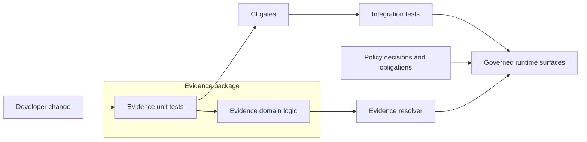

<!-- [KFM_META_BLOCK_V2]
doc_id: kfm://doc/b47e9e04-691a-46ed-ab5f-9d9cf87cc849
title: Evidence unit tests
type: standard
version: v1
status: draft
owners: TODO
created: 2026-02-25
updated: 2026-02-25
policy_label: public
related:
  - TODO: link to evidence package docs
  - TODO: link to EvidenceBundle schema / contract
tags: [kfm, evidence, tests, unit]
notes:
  - Unit tests for evidence-domain logic. Keep deterministic and fail closed.
[/KFM_META_BLOCK_V2] -->

# Evidence unit tests

Fast, deterministic unit tests for the **evidence** package. These tests protect KFM’s evidence-first contract by keeping EvidenceRefs, evidence bundles, and redaction behavior stable and policy-safe.


## Navigation

- [Purpose](#purpose)
- [Where this fits](#where-this-fits)
- [Test taxonomy](#test-taxonomy)
- [How to run](#how-to-run)
- [Folder layout](#folder-layout)
- [What belongs here](#what-belongs-here)
- [Rules](#rules)
- [Test checklist](#test-checklist)
- [Definition of done](#definition-of-done)
- [Troubleshooting](#troubleshooting)
- [Appendix](#appendix)

---

## Purpose

This directory contains **unit tests** for the evidence package, located at:

- `packages/evidence/test/unit`

Unit tests here are meant to be:

- **Fast**: run locally during development and in CI.
- **Deterministic**: no dependence on network, wall-clock time, random sources, or machine-specific behavior.
- **Fail-closed**: if evidence parsing/validation/redaction is uncertain, the expected behavior is to **reject**, **abstain**, or **require explicit policy**.

> NOTE  
> Unit tests are the “tight loop.” Anything requiring databases, HTTP, filesystem mounts, or policy engines running out-of-process belongs in **integration / contract / policy** test suites, not here.

[Back to top](#navigation)

---

## Where this fits

KFM treats tests as governance enforcement: invariants are only real if they are encoded as checks that block regressions.

Conceptual flow (implementation details vary by repo):



[Back to top](#navigation)

---

## Test taxonomy

KFM’s minimum test categories (across the whole repo) are typically:

- **Unit tests**: domain logic, deterministic hashing/canonicalization, controlled vocabulary validation.
- **Schema tests**: DCAT/STAC/PROV profile validation.
- **Policy tests**: fixture-driven allow/deny/obligation outcomes (for example OPA/Rego).
- **Contract tests**: API schema diffs and DTO validation.
- **Integration tests**: evidence resolver resolves representative EvidenceRefs without leaking restricted fields.
- **E2E UI tests**: “layer toggle → evidence drawer attribution,” “story citations resolve,” etc.

This folder is **unit tests only** — keep anything that requires external systems or full-stack wiring out of this directory.

[Back to top](#navigation)

---

## How to run

**Repo-specific:** the exact command depends on the repo’s tooling (package manager + test runner).

Minimum steps to find the right command:

1. Open the evidence package manifest (for example: `packages/evidence/package.json`, `pyproject.toml`, `go.mod`) and locate the relevant test commands (often `test`, `test:unit`, or similar).
2. Run the unit suite from the repo root or the package directory, depending on workspace tooling.

Examples (choose the one that matches the repo):

```bash
# from repo root
# (examples only — verify the actual scripts in package.json)
npm test -w packages/evidence
pnpm -C packages/evidence test
yarn workspace evidence test
```

> TIP  
> If your test runner supports it, prefer running only this unit directory first (fast feedback), then run the full test matrix before opening a PR.

[Back to top](#navigation)

---

## Folder layout

This README documents **this** directory.

Suggested minimal layout:

```text
packages/evidence/test/unit/
  README.md                 # this file
  *.test.*                  # unit tests (naming depends on runner)
  fixtures/                 # optional: small, synthetic fixtures only
```

If you add a `fixtures/` folder, keep it **small** and **synthetic**:
- no secrets
- no licensed or restricted raw data
- no “real” datasets unless explicitly cleared for public inclusion

[Back to top](#navigation)

---

## What belongs here

| Put it here | Keep it elsewhere |
|---|---|
| Pure functions (parsers, normalizers, canonicalizers) | Anything that hits a real DB/object store |
| EvidenceRef syntax validation and normalization | End-to-end UI tests |
| Evidence bundle assembly logic (in-memory) | Policy pack tests (Rego/OPA) |
| Golden tests for stable digests / IDs | OpenAPI contract tests |
| Redaction and obligations logic that is purely functional | Network calls (HTTP), cloud SDKs, live services |

[Back to top](#navigation)

---

## Rules

### Hard rules

- Tests **MUST** run offline.
- Tests **MUST** not depend on current time.
  - If code uses time, inject a clock or freeze time in the test runner (if supported).
- Tests **MUST** not depend on randomness.
  - If code uses randomness, inject a seeded RNG or replace with deterministic values in tests.
- Fixtures **MUST** be policy-safe:
  - never include precise sensitive locations
  - never include PII or secrets

### Quality rules

- Prefer **Arrange → Act → Assert** structure.
- Prefer **small fixtures** and explicit expected outputs (avoid huge snapshots).
- Test both **happy paths** and **guard rails** (invalid refs, denied policy, missing metadata).

### Naming rules

- Use the repo’s existing conventions (example patterns: `*.test.ts`, `*.spec.ts`, `*.test.js`).
- Name tests by behavior, not implementation (e.g., `rejects_invalid_ref` vs `parses_with_regex`).

[Back to top](#navigation)

---

## Test checklist

Use this as a practical checklist when changing evidence-domain code.

### EvidenceRef and identifiers

- [ ] Reject malformed refs (bad scheme, missing version, invalid characters).
- [ ] Normalize canonical forms (case/encoding/whitespace rules).
- [ ] Ensure deterministic IDs and digests across platforms (golden tests).

### Evidence bundles

- [ ] Bundle includes stable identifiers and digests (golden tests for known inputs).
- [ ] Bundle contains the minimum renderable “card” metadata needed by UI consumers.
- [ ] Bundle does **not** include restricted artifacts when the role is not authorized (fail closed).

### Redaction and obligations

- [ ] When policy requires redaction/generalization, ensure the output contains only allowed fields.
- [ ] Ensure obligations are carried through as machine-readable objects (so UI can display required notices).
- [ ] Include explicit tests for “no coordinate fields” / “no restricted bbox leakage” patterns when applicable.

[Back to top](#navigation)

---

## Definition of done

A change that touches evidence-domain logic is “done” when:

- [ ] New/changed behavior is covered by unit tests in this folder.
- [ ] Tests are deterministic (repeatable locally and in CI).
- [ ] Golden fixtures are updated intentionally (with a clear reason in the PR description).
- [ ] If the change alters any public contract (bundle shape, ref syntax), corresponding **contract tests** are updated (outside this folder).
- [ ] If the change could affect restricted/public behavior, corresponding **policy or integration tests** are updated (outside this folder).

[Back to top](#navigation)

---

## Troubleshooting

### Flaky tests

Common causes:
- wall-clock time
- implicit randomness
- reliance on filesystem ordering
- locale/timezone differences

Fixes:
- inject clock/RNG
- sort inputs before hashing/serializing
- pin locale/timezone in test setup (if the runner supports it)

### Golden digest changes

If a digest or stable ID changes:
1. Confirm it’s an intended semantic change (not serialization drift).
2. Update golden files **only after** verifying determinism across platforms/runtimes that CI covers.
3. Record why the change is acceptable (links to spec/ADR/issues).

[Back to top](#navigation)

---

## Appendix

<details>
<summary>Example test skeleton (pseudo-code)</summary>

```text
describe("EvidenceRef parsing", () => {
  it("rejects malformed refs", () => {
    expect(parseEvidenceRef("stac:/bad")).toThrow()
  })

  it("normalizes canonical forms", () => {
    const ref = parseEvidenceRef("DCAT://Example@v1")
    expect(ref.toString()).toEqual("dcat://example@v1")
  })
})
```

</details>

<details>
<summary>Example EvidenceBundle fixture (illustrative)</summary>

```json
{
  "bundle_id": "sha256:bundle...",
  "dataset_version_id": "YYYY-MM.xxxxxxxx",
  "title": "Example evidence card title",
  "policy": {
    "decision": "allow",
    "policy_label": "public",
    "obligations_applied": []
  },
  "license": {
    "spdx": "CC-BY-4.0",
    "attribution": "Example publisher"
  },
  "provenance": { "run_id": "kfm://run/YYYY-MM-DDThh:mm:ssZ.example" },
  "artifacts": [
    {
      "href": "processed/example.parquet",
      "digest": "sha256:...",
      "media_type": "application/x-parquet"
    }
  ],
  "checks": { "catalog_valid": true, "links_ok": true },
  "audit_ref": "kfm://audit/entry/..."
}
```

</details>

<details>
<summary>PR review questions</summary>

- Does this change increase the chance of uncited or unresolvable evidence?
- Could a public role accidentally receive restricted fields?
- Are identifiers and digests still deterministic?
- Are we failing closed when something is unclear?

</details>
