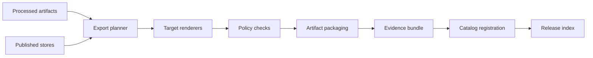

<!-- [KFM_META_BLOCK_V2]
doc_id: kfm://doc/9b4c77dd-7fdd-4b18-9c8b-efb2ce2c2e9a
title: packages/exports
type: standard
version: vNext
status: draft
owners: TBD
created: 2026-02-22
updated: 2026-02-22
policy_label: public
related:
  - ../../README.md
  - ../README.md
  - ../policy/README.md
  - ../evidence/README.md
  - ../catalog/README.md
  - ../observability/README.md
tags: [kfm, exports, publish]
notes:
  - Defines the governed “last-mile” export system: from Processed/Published artifacts to consumer deliverables (tiles, packages, story bundles).
[/KFM_META_BLOCK_V2] -->

# `packages/exports` — governed export pipelines and artifact packaging

> **Purpose:** Build **policy-enforced**, **reproducible** export artifacts (tiles, bundles, snapshots) from KFM’s **Processed/Published** zones—never from Raw.


---

## Quick navigation

- [Overview](#overview)
- [Responsibilities](#responsibilities)
- [Non-goals](#non-goals)
- [Architecture](#architecture)
- [Export targets](#export-targets)
- [Contracts and receipts](#contracts-and-receipts)
- [Directory layout](#directory-layout)
- [Policy and safety](#policy-and-safety)
- [Testing](#testing)
- [Runbooks](#runbooks)
- [Related packages](#related-packages)

---

## Overview

Exports are the **last-mile** steps that turn governed KFM artifacts into **consumer-ready deliverables**:
- map tiles / vector packages for Map UI
- story bundles for Story UI
- snapshots for downstream systems
- “release” artifacts suitable for distribution (append-only, checksum-addressed)

This package exists to ensure exports are:
- **policy-enforced** (default-deny; redaction rules applied)
- **reproducible** (inputs and outputs pinned by digest)
- **audited** (who/what/when/why recorded with checksums + policy decisions)
- **non-bypass** (no direct DB/storage access from UI/clients)

> [!IMPORTANT]
> **Exports MUST NOT invent facts or transform data in a way that changes meaning** without producing new provenance + evidence. Exports are *rendering/packaging*, not “research.”

---

## Responsibilities

### What belongs here

- **Export planning and orchestration**
  - resolve an `ExportSpec` into deterministic steps
  - pin all inputs by digest / version IDs
  - materialize outputs in a controlled output root (Published/Release)

- **Target renderers**
  - e.g., vector tiles, raster pyramids, GeoPackage/GeoJSON bundles, search snapshots, story bundles
  - deterministic build parameters (tile scheme, simplification tolerances, projection)

- **Governed output packaging**
  - write `artifact_manifest.json`, `checksums.txt`, and `export_receipt.json`
  - call policy checks before write
  - emit audit events for every run

- **Registrations**
  - register exported artifacts into catalog/index registries via governed interfaces

### What does not belong here

- ingestion, scraping, or raw acquisition (see `packages/ingest`)
- core domain rules and definitions (see `packages/domain`)
- policy authoring itself (see `packages/policy`)
- UI rendering (see `packages/ui-components` / app)
- direct writes to databases or object stores bypassing repositories/adapters

---

## Architecture

Exports sits behind the trust membrane: it only reads from **governed sources** and writes **governed outputs**.



### Trust membrane invariants

- **UI/clients never hit storage directly.**
- Exports uses **repositories/adapters** only.
- **Policy must run before outputs are written** and before publication/registration.
- Every run produces an **audit record** and **reproducible manifests**.

---

## Export targets

> [!NOTE]
> The exact target list below is a **baseline proposal** *(not confirmed in repo)*. Keep the list short initially; add targets only when there’s a consumer and a contract.

| Target ID | Inputs (must be governed) | Outputs | Primary consumer | Determinism notes |
|---|---|---|---|---|
| `vector_tiles` | Published features (PostGIS/GeoParquet) | `.pmtiles` / `.mbtiles` | Map UI (MapLibre) | pin zoom range, simplification, attribution |
| `raster_tiles` | Published rasters (COG/GeoTIFF) | tile pyramid / COG set | Map UI / analysis | pin resampling, nodata rules |
| `geopackage_bundle` | Processed/Published layers | `.gpkg` + metadata | offline analysts | stable layer naming + schema |
| `geojson_bundle` | Published layers | `.geojson` + metadata | lightweight downstream | stable CRS + field ordering |
| `search_snapshot` | Published entities + evidence refs | search index snapshot | search/indexers | snapshot versioned; no partial writes |
| `story_bundle` | Story Node + Evidence bundles | static bundle (JSON/MD) | Story UI | cite-or-abstain links verified |

---

## Contracts and receipts

Exports must be **self-describing** and **verifiable**.

### Required per export run (minimum)

| Artifact | Purpose | Required |
|---|---|---|
| `export_spec.json` | declarative spec that produced outputs | ✅ |
| `export_receipt.json` | run metadata: who/what/when/why, inputs/outputs, policy decisions | ✅ |
| `artifact_manifest.json` | list of produced files + logical roles | ✅ |
| `checksums.txt` | sha256 for every file in artifact set | ✅ |
| `provenance.json` (or PROV) | linkage from inputs to outputs | ✅ (format may vary) |
| `sbom.*` | supply-chain bill of materials (containers/tools) | 🔶 (recommended; depends on build packaging) |

### Spec hashing

All export specs SHOULD be hashed using canonical JSON serialization and sha256:
- `spec_hash = sha256(jcs(export_spec.json))` *(hash method not confirmed in repo; align with KFM canonical hashing policy if present)*

---

## Directory layout

> [!NOTE]
> This layout is a **recommended baseline** *(not confirmed in repo)*. If the repo already differs, update this README to match reality rather than forcing code to match docs.

```text
packages/exports/
├─ README.md                      # this document
├─ package.json                   # workspace package definition (if JS/TS) (not confirmed in repo)
├─ src/
│  ├─ index.ts                    # package entrypoint (not confirmed in repo)
│  ├─ cli/                        # export CLI wiring (optional) (not confirmed in repo)
│  ├─ planner/                    # resolves ExportSpec -> execution plan
│  ├─ runners/                    # local runner, k8s job runner, etc.
│  ├─ targets/                    # target renderers (tiles, bundles, snapshots)
│  ├─ contracts/                  # JSON schemas + validators for specs/receipts/manifests
│  ├─ policy/                     # policy boundary adapters (calls into packages/policy)
│  ├─ catalog/                    # registration adapters (calls into packages/catalog)
│  └─ observability/              # logging/metrics/audit helpers
├─ schemas/
│  ├─ export_spec.schema.json
│  ├─ export_receipt.schema.json
│  └─ artifact_manifest.schema.json
├─ test/
│  ├─ unit/
│  ├─ integration/
│  └─ fixtures/
└─ docs/
   ├─ targets.md                  # target-specific details, constraints, examples
   └─ runbooks.md                 # operational procedures and failure modes
```

---

## Policy and safety

Exports is **not** “just formatting.” It is where accidental leakage often happens.

### Default-deny expectations

Exports MUST:
- reject exporting **restricted/sensitive** datasets unless explicitly allowed
- apply **redaction/generalization** rules (e.g., sensitive locations)
- preserve **license and attribution** metadata
- prevent “policy downgrade” (cannot export restricted inputs into public outputs)

### Sensitive location handling

If an export would produce precise locations for:
- vulnerable sites, private addresses, culturally restricted locations, etc.

Then exports MUST:
- generalize or omit coordinates
- tag outputs with a restrictive policy label
- record the decision in `export_receipt.json`

> [!WARNING]
> If sensitivity is unclear, **fail closed**. Export produces no output.

---

## Testing

Minimum test expectations for each export target:

- **Schema validation tests**
  - `export_spec.schema.json` accepts valid specs and rejects invalid ones
- **Golden output tests**
  - small fixture inputs produce deterministic, byte-stable outputs (or stable checksums)
- **Policy-deny tests**
  - restricted inputs cause export to fail closed
- **Round-trip smoke tests**
  - outputs can be opened/consumed by the intended toolchain

Suggested CI gates *(not confirmed in repo)*:
- `lint` + `typecheck`
- `unit` tests
- `integration` tests for at least one target
- `policy` tests (conftest/OPA) for export allow/deny rules
- artifact manifest + checksums verification

---

## Runbooks

### When an export fails

1. Inspect `export_receipt.json` for:
   - failing step
   - policy decision logs
   - missing input digests
2. Validate manifests:
   - `artifact_manifest.json` vs actual files
   - `checksums.txt` matches filesystem
3. Re-run in “dry-run” mode if supported *(not confirmed in repo)*:
   - produce plan without writing outputs
4. If policy failed:
   - fix the policy label at the source (Processed/Published), not by bypassing exports

### Backfills and rebuilds

Exports SHOULD be rebuildable from:
- input dataset version IDs + digests
- export spec + spec_hash
- pinned toolchain version (container digest if applicable)

---

## Related packages

- `packages/policy` — authorization, redaction, default-deny enforcement
- `packages/evidence` — EvidenceBundle creation/packing and citation surfaces
- `packages/catalog` — registration of dataset versions and exported artifacts
- `packages/indexers` — search/index build stages (may consume export snapshots)
- `packages/observability` — audit ledger, structured logs, metrics
- `packages/adapters` — storage/db/object-store connectors behind interfaces
- `packages/usecases` — orchestration patterns (if exports are invoked from usecases)

---

## Back to top

[↑ Back to top](#packagesexports--governed-export-pipelines-and-artifact-packaging)
