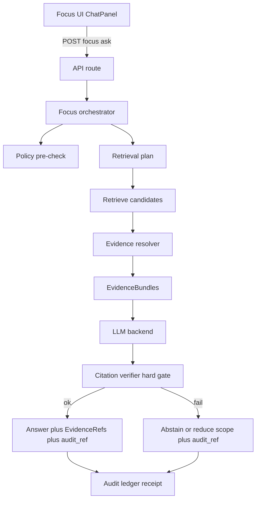

<!-- [KFM_META_BLOCK_V2]
doc_id: kfm://doc/3fffbacd-f8f1-4691-8010-3719d8d5d01f
title: packages/focus — Focus Mode (cite-or-abstain) README
type: standard
version: v1
status: draft
owners: TBD
created: 2026-02-22
updated: 2026-02-22
policy_label: restricted
related:
  - docs/MASTER_GUIDE_v13.md
  - contracts/schemas/focus_response_v1.schema.json
  - docs/standards/KFM_DCAT_PROFILE.md
  - docs/standards/KFM_STAC_PROFILE.md
  - docs/policy/opa/
tags: [kfm, focus, cite-or-abstain, governance, evidence]
notes:
  - Spec-aligned with KFM GDG vNext (2026-02-20). Update “TBD/Proposed” items after repo wiring is confirmed.
[/KFM_META_BLOCK_V2] -->

# Focus Mode (packages/focus)
Governed, evidence-led Q&A orchestration for KFM — **must cite or abstain**.


> [!IMPORTANT]
> This package sits inside the **trust membrane**. It must never enable policy bypass (no direct DB/object-store reads on UI-facing code paths).

## Quick navigation
- [What this package is](#what-this-package-is)
- [Non-negotiable invariants](#non-negotiable-invariants)
- [End-to-end flow](#end-to-end-flow)
- [API and contracts](#api-and-contracts)
- [EvidenceRefs and EvidenceBundles](#evidencerefs-and-evidencebundles)
- [Evaluation harness](#evaluation-harness)
- [Security and governance](#security-and-governance)
- [Local development](#local-development)
- [Contributing](#contributing)
- [Glossary](#glossary)

---

## What this package is
Focus Mode is the “analysis assistant” inside KFM, but **not a general chatbot**.

It takes:
- a natural language question
- optional **view_state** (map bounding box, time window, active layers, filters) so answers stay in-context
- a caller identity and policy context (role/labels)

…and returns:
- answer text (or a policy-safe abstention)
- **citations (EvidenceRefs)** that resolve to inspectable evidence bundles
- an **audit_ref** for follow-up and review

### What this package is not
- A freeform generative assistant without citations
- A shortcut around dataset policy labels / sensitive location constraints
- A place to add “helpful” narrative that is not provenance-linked

> [!NOTE]
> Focus Mode must use **only provenance-linked content**. Any AI-generated suggestion must be clearly indicated and constrained by evidence; no freeform “hallucinations”. (See project governance docs.)

---

## Non-negotiable invariants
Legend: ✅ confirmed requirement · 🧩 proposed implementation detail · ❓ needs repo verification

1. ✅ **Every factual claim must be citation-backed**, or the system must **abstain or narrow scope**.
2. ✅ **Citation verification is a hard gate**: if citations don’t resolve and pass policy for the caller, the response cannot ship.
3. ✅ **Retrieval outputs must map to EvidenceRefs**. “Raw text from search” is not admissible without a resolvable EvidenceRef.
4. ✅ **Policy is default-deny**. If you can’t prove a thing is allowed, treat it as not allowed.
5. ✅ **Treat each request as a governed run**: store a receipt (inputs, evidence bundle digests, policy decisions, model version, output hash).
6. ✅ **No direct privileged data access in UI paths**: clients call governed APIs; orchestration calls resolvers/repositories that enforce policy.
7. ✅ **Abstention is a feature**: tell the user (in policy-safe terms) what’s missing, what’s allowed, and how to request access. Always include audit_ref.

> [!WARNING]
> If you’re tempted to “just return the snippet” from a search index: **don’t**. Always go through EvidenceRefs → EvidenceBundles.

---

## End-to-end flow


### Control loop (implementation checklist)
1. Policy pre-check
2. Retrieval plan based on query + view_state
3. Retrieve candidate evidence (catalog/search/graph/spatial)
4. Build evidence bundles via evidence resolver (apply obligations/redactions)
5. Synthesize answer grounded on bundle IDs
6. **Verify**: every citation resolves + allowed for caller (hard gate)
7. Emit audit receipt (hashes, versions, policy, timing)

---

## API and contracts
This package should be **contract-first**. If the schema says “citations required”, code must enforce it.

### Primary endpoint
- `POST /api/v1/focus/ask`

> [!NOTE]
> The HTTP route may live outside this package (e.g., a server/API workspace). This package owns the orchestration + contract compliance.

### Request (illustrative)
```json
{
  "request_id": "uuid",
  "query": "What changed in land ownership between 1860 and 1870 here?",
  "view_state": {
    "bbox": [-98.0, 38.0, -96.0, 39.0],
    "time_window": ["1860-01-01", "1870-12-31"],
    "active_layers": ["kansas_parcels_1860", "kansas_parcels_1870"],
    "filters": {
      "county": "Ellis"
    }
  },
  "actor": {
    "principal": "user:alice",
    "role": "public"
  }
}
```

### Response (illustrative)
```json
{
  "answer_markdown": "…",
  "citations": [
    {
      "ref": "stac://kansas_parcels@2026-02.abcd1234#item=…",
      "bundle_id": "sha256:bundle…"
    }
  ],
  "audit_ref": "kfm://audit/focus/2026-02-22T18:12:00Z.1234",
  "policy": {
    "decision": "allow",
    "obligations_applied": []
  },
  "meta": {
    "model_id": "llm://…",
    "latency_ms": 842
  }
}
```

### Contract checks (minimum)
- JSON Schema validation for request + response
- Citation lint: every `citations[*].ref` resolves via evidence resolver for the caller
- Response must include `audit_ref` (even for abstentions)

---

## EvidenceRefs and EvidenceBundles
Focus Mode citations are not “pretty footnotes”. They are **resolvable references**.

### EvidenceRef
An EvidenceRef is a stable pointer into one of KFM’s governed projections:
- `dcat://…` dataset/distribution metadata
- `stac://…` asset/feature metadata
- `prov://…` lineage receipt / run activity
- `doc://…` documents, story nodes, OCR spans
- `graph://…` entity relations (optional)

### EvidenceBundle
The evidence resolver turns an EvidenceRef into an EvidenceBundle:
- stable IDs and digests
- policy decision + obligations applied
- license + attribution payload
- provenance run ID
- artifact links (only if allowed)

Focus orchestration must treat EvidenceBundles as the only admissible “ground truth” inputs.

---

## Evaluation harness
Focus Mode must ship with an evaluation harness that runs in CI and **blocks merges on regressions**.

Minimum test categories:
- Citation coverage (% of factual claims supported by citations)
- Citation resolvability (100% of citations resolve for an allowed user)
- Refusal correctness (restricted questions get policy-safe refusals)
- Sensitivity leakage tests (no restricted coordinates or metadata in outputs)
- Golden queries across dataset versions (regression guard)

---

## Security and governance
### Threats we explicitly defend against
- Prompt injection embedded in retrieved documents
- Data exfiltration attempts (“list restricted datasets”, “show hidden coordinates”, etc.)
- Policy-bypass via direct storage/database calls
- Side-channel leaks via error messages or timing

### Defenses (must be in place)
- Tool allowlist (model cannot call arbitrary tools)
- Evidence resolver as the only source of truth for citations
- Apply filtering/redaction obligations before model sees restricted content
- Policy-safe error model (do not reveal existence of restricted datasets to public roles)
- Audit logs are access-controlled and redacted (treat as sensitive data)

### Abstention UX contract (what the caller should display)
When abstaining, return:
- what is missing (policy-safe)
- what is allowed (public alternatives)
- how to request access (steward workflow)
- audit_ref for follow-up

---

## Local development
🧩 The exact commands depend on monorepo tooling (pnpm/yarn/npm) — update once scripts are confirmed.

### Environment (proposed)
- `EVIDENCE_RESOLVER_URL` — base URL for `/api/v1/evidence/resolve`
- `POLICY_ENGINE_URL` — policy decision endpoint (OPA/Rego or equivalent)
- `FOCUS_MODEL_PROVIDER` — model adapter identifier
- `AUDIT_LEDGER_URL` — append-only audit sink

### Typical workflows (examples)
```bash
# install from repo root
pnpm install

# run unit tests for focus package
pnpm -C packages/focus test

# run evaluation harness (golden queries)
pnpm -C packages/focus test:eval
```

---

## Contributing
### PR checklist (Focus Mode)
- [ ] No direct DB/object-store reads added to UI-facing paths
- [ ] All new retrieval adapters return EvidenceRefs (not raw text)
- [ ] Citations are verified (resolver + policy) and failing cases abstain
- [ ] JSON Schemas updated + versioned (no breaking change without bump)
- [ ] Evaluation harness updated with new golden queries where needed
- [ ] Security review: prompt injection + exfiltration scenarios covered
- [ ] Audit receipt fields reviewed for PII and redaction

---

## Glossary
- **audit_ref**: stable identifier for the Focus Mode run receipt
- **EvidenceRef**: resolvable pointer into KFM catalogs/docs/graph
- **EvidenceBundle**: resolver output containing evidence + policy + license + provenance
- **obligation**: redaction/generalization step mandated by policy (applied before display/model)
- **view_state**: map/timeline context (bbox, time window, layers, filters) used to scope retrieval

---

<details>
<summary>Appendix: Suggested package layout (🧩 proposed)</summary>

```text
packages/focus/
├─ README.md
├─ package.json
├─ src/
│  ├─ orchestrator/            # core control loop (pre-check → retrieve → resolve → verify → receipt)
│  ├─ retrieval/               # adapters: catalog, search, graph, spatial, vector
│  ├─ policy/                  # policy client + decision helpers (default deny)
│  ├─ evidence/                # evidence resolver client + bundle normalization
│  ├─ citations/               # citation verifier + lint rules
│  ├─ audit/                   # receipt writer (hashing, minimal PII)
│  ├─ contracts/               # runtime schema validators
│  └─ index.ts
├─ contracts/
│  └─ schemas/
│     └─ focus_response_v1.schema.json
└─ tests/
   ├─ unit/
   ├─ integration/
   └─ eval/
      └─ focus_harness/        # golden queries, regression thresholds
```

</details>
