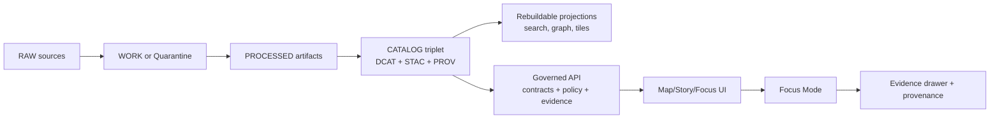
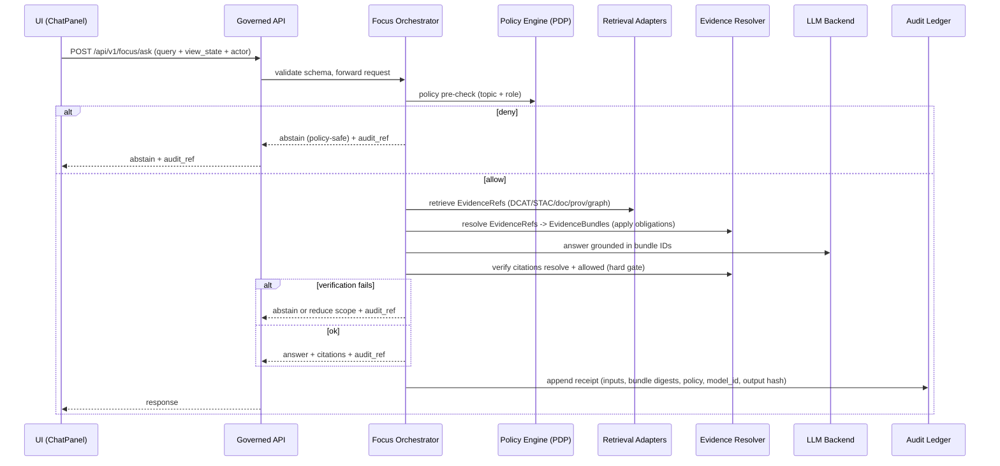

<!-- [KFM_META_BLOCK_V2]
doc_id: kfm://doc/3fffbacd-f8f1-4691-8010-3719d8d5d01f
title: packages/focus — Focus Mode cite-or-abstain README
type: standard
version: v1
status: draft
owners: TBD
created: 2026-02-22
updated: 2026-02-26
policy_label: restricted
related:
  - docs/MASTER_GUIDE_v13.md
  - contracts/schemas/focus_response_v1.schema.json
  - docs/standards/KFM_DCAT_PROFILE.md
  - docs/standards/KFM_STAC_PROFILE.md
  - docs/policy/opa/
tags: [kfm, focus, cite-or-abstain, governance, evidence]
notes:
  - Spec-aligned with KFM vNext (2026-02-20). Update “TBD/Proposed” items after repo wiring is confirmed.
[/KFM_META_BLOCK_V2] -->

# Focus Mode
Governed, evidence-led Q&A orchestration for KFM — **must cite or abstain**.

**Package:** `packages/focus`


<!-- TODO badges once wired:


-->

> [!IMPORTANT]
> Focus Mode sits inside the **trust membrane**. It must never enable policy bypass (no direct DB/object-store reads on UI-facing code paths).
>
> Focus Mode behaves like a research assistant that always shows its sources, **not** a general conversational agent.

## Quick navigation
- [Where this package fits](#where-this-package-fits)
- [What this package is](#what-this-package-is)
- [Non-negotiable invariants](#non-negotiable-invariants)
- [End-to-end flow](#end-to-end-flow)
- [Interfaces and contracts](#interfaces-and-contracts)
- [EvidenceRefs and EvidenceBundles](#evidencerefs-and-evidencebundles)
- [Policy, obligations, and governance](#policy-obligations-and-governance)
- [Evaluation harness](#evaluation-harness)
- [Security model](#security-model)
- [Local development](#local-development)
- [Contributing](#contributing)
- [Glossary](#glossary)
- [Appendix: suggested package layout](#appendix-suggested-package-layout)

---

## Where this package fits
Focus Mode is the governed Q&A surface in the KFM “truth path”. It is downstream of the catalog triplet (DCAT/STAC/PROV) and uses rebuildable projections (search/graph/tiles) only through EvidenceRefs.



> [!NOTE]
> Focus Mode does not “know things.” It composes answers only from evidence that is already governed and resolvable via the Evidence Resolver.

---

## What this package is
Focus Mode is the “analysis assistant” inside KFM, but **not a general chatbot**.

A Focus Mode request is treated as a **governed run with a receipt**.

Inputs:
- natural-language **query**
- optional **view_state** (map bbox, time window, active layers, filters) so answers stay in-context
- caller identity and **policy context** (role/labels)

Outputs:
- answer text *or* a policy-safe abstention
- **citations (EvidenceRefs)** that resolve to inspectable EvidenceBundles
- an **audit_ref** that can be reviewed by stewards/operators

### What this package is not
- A freeform assistant without citations
- A shortcut around dataset policy labels or sensitive location constraints
- A place to add narrative that is not provenance-linked

---

## Non-negotiable invariants
Legend: ✅ requirement (normative) · 🧩 suggested implementation · ❓ needs repo verification

1. ✅ **Every factual claim must be citation-backed**, or the system must **abstain or narrow scope**.
2. ✅ **Citation verification is a hard gate**: if citations don’t resolve and pass policy for the caller, the response cannot ship.
3. ✅ **Retrieval outputs must map to EvidenceRefs**. No “raw text from index” is admissible unless it links to a resolvable EvidenceRef.
4. ✅ **Policy is default-deny**. If you can’t prove a thing is allowed, treat it as not allowed.
5. ✅ **Treat each request as a governed run**: store a receipt (inputs, evidence bundle digests, policy decisions, model version, output hash).
6. ✅ **No direct privileged data access in UI paths**: clients call governed APIs; orchestration calls resolvers/repositories that enforce policy.
7. ✅ **Abstention is a feature**: return what’s missing (policy-safe), what’s allowed, how to request access, and always include `audit_ref`.
8. ✅ **Avoid ghost metadata leaks**: do not reveal restricted dataset existence via error differences or messages.
9. ✅ **Rights and licensing are policy inputs**: exports and displays must respect rights/attribution; “online available” does not imply reusable.

> [!WARNING]
> If you’re tempted to “just return the snippet” from a search index: **don’t**. Always go through EvidenceRefs → EvidenceBundles.

---

## End-to-end flow
### Control loop
The orchestration loop is fail-closed and citation-led:

1. Policy pre-check
2. Retrieval plan based on query + view_state
3. Retrieve candidate evidence (catalog/search/graph/spatial) **as EvidenceRefs**
4. Build EvidenceBundles via evidence resolver (apply obligations/redactions)
5. Synthesize answer grounded on bundle IDs
6. **Verify**: every citation resolves + is allowed for caller (**hard gate**)
7. Emit audit receipt (hashes, versions, policy, timing)

### Sequence diagram


---

## Interfaces and contracts
Focus Mode is **contract-first**. If the schema says “citations required,” code enforces it.

### Governed API boundary
Focus Mode should be exposed only through the governed API (the enforcement boundary for policy, redactions, versioning, and evidence resolution).

Minimum endpoint set (illustrative, verify repo wiring):
- `POST /api/v1/focus/ask` — Focus Mode Q&A (must cite or abstain)
- `POST /api/v1/evidence/resolve` — resolve EvidenceRefs to EvidenceBundles
- `GET /api/v1/datasets` and `GET /api/v1/stac/*` — discovery and spatiotemporal query (policy-filtered)

### API contract requirements
- Every governed operation response includes an `audit_ref`.
- When applicable, include `dataset_version_id`, policy label, and artifact digests.
- Errors must use a stable error model and be policy-safe (avoid existence leaks).

### Request shape (illustrative)
```json
{
  "request_id": "uuid",
  "query": "What changed in land ownership between 1860 and 1870 here?",
  "view_state": {
    "bbox": [-98.0, 38.0, -96.0, 39.0],
    "time_window": ["1860-01-01", "1870-12-31"],
    "active_layers": ["kansas_parcels_1860", "kansas_parcels_1870"],
    "filters": { "county": "Ellis" }
  },
  "actor": { "principal": "user:alice", "role": "public" }
}
```

### Response shape (illustrative)
```json
{
  "answer_markdown": "…",
  "citations": [
    { "ref": "stac://kansas_parcels@2026-02.abcd1234#item=…", "bundle_id": "sha256:bundle…" }
  ],
  "audit_ref": "kfm://audit/focus/2026-02-22T18:12:00Z.1234",
  "policy": { "decision": "allow", "obligations_applied": [] },
  "meta": { "model_id": "llm://…", "latency_ms": 842 }
}
```

### Contract checks
Minimum gates for this package:
- JSON Schema validation for request + response
- Citation lint: every `citations[*].ref` resolves via evidence resolver for the caller
- “Hard gate” behavior test: failing resolvability/policy → abstain or reduce scope
- Audit receipt required (even on abstention)

---

## EvidenceRefs and EvidenceBundles
Focus Mode citations are not “pretty footnotes.” They are **resolvable references**.

### EvidenceRef
An EvidenceRef is a stable pointer into governed projections:
- `dcat://…` dataset/distribution metadata
- `stac://…` asset/feature metadata
- `prov://…` lineage receipt / run activity
- `doc://…` documents, story nodes, OCR spans
- `graph://…` entity relations (optional)

### EvidenceBundle
The evidence resolver turns EvidenceRefs into EvidenceBundles by:
- applying policy (allow/deny) and recording obligations
- attaching license + attribution payload
- returning stable digests + bundle IDs
- linking provenance (run_id) and checks

Illustrative bundle DTO:
```json
{
  "bundle_id": "sha256:bundle...",
  "dataset_version_id": "2026-02.abcd1234",
  "title": "Storm event record: 2026-02-19",
  "policy": { "decision": "allow", "policy_label": "public", "obligations_applied": [] },
  "license": { "spdx": "CC-BY-4.0", "attribution": "Source org" },
  "provenance": { "run_id": "kfm://run/2026-02-20T12:00:00Z.abcd" },
  "artifacts": [
    { "href": "processed/events.parquet", "digest": "sha256:2222", "media_type": "application/x-parquet" }
  ],
  "checks": { "catalog_valid": true, "links_ok": true },
  "audit_ref": "kfm://audit/entry/123"
}
```

> [!NOTE]
> Focus orchestration must treat EvidenceBundles as the only admissible “ground truth” inputs.

---

## Policy, obligations, and governance
### Policy-as-code posture
Policy must have **shared semantics in CI and runtime**. Otherwise CI guarantees are meaningless.

Recommended pattern:
- Policy Decision Point (PDP): OPA running in-process or as a sidecar
- Policy Enforcement Points (PEP):
  - CI: schema validation + policy tests block merges
  - Runtime API: policy checks before serving data
  - Evidence resolver: policy checks before resolving evidence and rendering bundles
  - UI: shows policy badges/notices but never makes policy decisions

### Sensitivity default rules
- Default deny for restricted / sensitive-location datasets
- Prefer public-safe derivatives (e.g., `public_generalized`) when allowed
- Do not embed precise coordinates in Story Nodes or Focus outputs unless policy explicitly allows
- Treat redaction/generalization as a first-class transform recorded in PROV

### Licensing and rights
- Rights metadata is required for promotion and for any export/render pipeline
- Metadata-only reference is allowed when mirroring is not permitted
- Exports must include attribution + license text automatically

### Audit and observability
Every governed Focus operation should emit an audit record including:
- who (principal, role), what (endpoint, params), when, why (if declared)
- evidence inputs/outputs by digest
- policy decisions (allow/deny + obligations + reason codes)
- model_id + output hash

Audit logs/receipts are sensitive: restrict access and redact appropriately.

---

## Evaluation harness
Focus Mode must ship with an evaluation harness that runs in CI and **blocks merges on regressions**.

Minimum test categories:
- Citation coverage (% of factual claims supported by citations)
- Citation resolvability (100% of citations resolve for allowed users)
- Refusal correctness (restricted questions get policy-safe refusals)
- Sensitivity leakage tests (no restricted coordinates or restricted metadata in outputs)
- Golden queries across dataset versions (regression guard)

---

## Security model
### Threats we explicitly defend against
- Prompt injection embedded in retrieved documents
- Data exfiltration attempts (“show me restricted dataset list”, etc.)
- Policy-bypass via direct storage/database calls
- Side-channel leaks via error messages or timing

### Defenses
- Tool allowlist (model cannot call arbitrary tools)
- Evidence resolver as the only source of truth for citations
- Apply filtering/redaction obligations before model sees restricted text
- Policy-safe error model (avoid ghost metadata)
- Audit logs access-controlled and redacted

### Abstention UX contract
When abstaining (or partially answering), return:
- what is missing (policy-safe)
- what is allowed (public alternatives)
- how to request access (steward workflow)
- audit_ref for follow-up

---

## Local development
🧩 Exact commands depend on monorepo tooling — update once scripts are confirmed.

### Environment variables
- `EVIDENCE_RESOLVER_URL` — base URL for `/api/v1/evidence/resolve`
- `POLICY_ENGINE_URL` — policy decision endpoint (OPA/Rego or equivalent)
- `FOCUS_MODEL_PROVIDER` — model adapter identifier
- `AUDIT_LEDGER_URL` — append-only audit sink

### Typical workflows
```bash
# install from repo root
pnpm install

# run unit tests for focus package
pnpm -C packages/focus test

# run evaluation harness (golden queries)
pnpm -C packages/focus test:eval
```

---

## Contributing
### Directory contract
Where this package fits:
- `packages/focus/` contains orchestration logic and contract enforcement for Focus Mode.

Acceptable inputs:
- orchestration + adapters that produce EvidenceRefs
- resolver/policy/audit clients (no privileged secrets)
- schema validators and citation linting
- evaluation harness + golden query fixtures

Exclusions:
- UI components (belong in frontend packages)
- direct DB/object-store access that bypasses governed repositories/resolvers
- policy rules (belong in policy bundle; this package calls PDP/PEP)
- ad-hoc “helpful text” not backed by EvidenceRefs

### PR checklist
- [ ] No direct DB/object-store reads added to UI-facing paths
- [ ] All new retrieval adapters return EvidenceRefs (not raw text)
- [ ] Citations verified (resolver + policy); failing cases abstain or reduce scope
- [ ] JSON Schemas updated + versioned (no breaking change without bump)
- [ ] Evaluation harness updated (new golden queries where needed)
- [ ] Policy tests + contract tests pass in CI (default deny)
- [ ] Audit receipt fields reviewed for PII and redaction
- [ ] Prompt injection + exfiltration scenarios covered

---

## Glossary
- **audit_ref**: stable identifier for the Focus Mode run receipt (governed operation)
- **EvidenceRef**: resolvable pointer into KFM catalogs/docs/graph
- **EvidenceBundle**: resolver output containing evidence + policy + license + provenance + digests
- **obligation**: redaction/generalization step mandated by policy
- **view_state**: map/timeline context (bbox, time window, layers, filters) used to scope retrieval

---

## Appendix: suggested package layout
<details>
<summary>Proposed layout (verify against repo)</summary>

```text
packages/focus/
├─ README.md
├─ package.json
├─ src/
│  ├─ orchestrator/            # core control loop (pre-check → retrieve → resolve → verify → receipt)
│  ├─ retrieval/               # adapters: catalog, search, graph, spatial, vector
│  ├─ policy/                  # policy client + decision helpers (default deny)
│  ├─ evidence/                # evidence resolver client + bundle normalization
│  ├─ citations/               # citation verifier + lint rules
│  ├─ audit/                   # receipt writer (hashing, minimal PII)
│  ├─ contracts/               # runtime schema validators
│  └─ index.ts
├─ contracts/
│  └─ schemas/
│     └─ focus_response_v1.schema.json
└─ tests/
   ├─ unit/
   ├─ integration/
   └─ eval/
      └─ focus_harness/        # golden queries, regression thresholds
```

</details>

---

[↑ Back to top](#focus-mode)