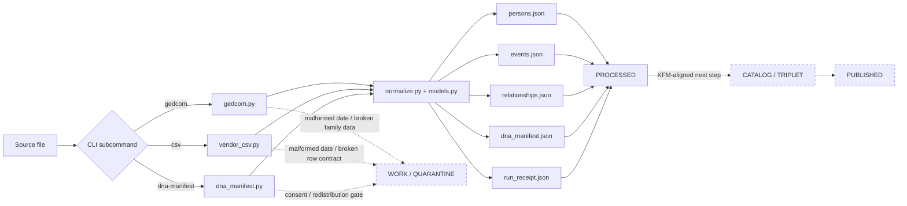

<!-- [KFM_META_BLOCK_V2]
doc_id: <TODO: kfm://doc/<uuid>>
title: Genealogy Ingest
type: standard
version: v1
status: draft
owners: <TODO: owners>
created: <TODO: created-date>
updated: 2026-04-05
policy_label: <TODO: policy-label>
related: [../README.md, ../../README.md, ../../contracts/README.md, ../../policy/README.md, ../../schemas/README.md, ../../tests/README.md, ./pyproject.toml, ./schemas/canonical.person.schema.json, ./schemas/canonical.event.schema.json, ./schemas/canonical.relationship.schema.json, ./schemas/canonical.dna_kit.schema.json, ./schemas/canonical.provenance.schema.json, ./src/genealogy_ingest/cli.py]
tags: [kfm, genealogy, ingest, gedcom, dna]
notes: [Path presence on current public main, doc_id, owners, created date, and policy_label remain to be verified. This README is intentionally starter-lane-grounded rather than public-main-assumptive.]
[/KFM_META_BLOCK_V2] -->

# Genealogy Ingest

Evidence-first ingestion of GEDCOM, vendor CSV, and DNA manifests into a canonical, KFM-aligned genealogy model.

**Status:** experimental  
**Owners:** `<TODO: owners>`  
      
**Repo fit:** Starter lane under [`../README.md`](../README.md) · Path: `pipelines/genealogy_ingest/README.md` *(NEEDS VERIFICATION on current public-main tree)* · Upstream: [`../../README.md`](../../README.md), [`../../contracts/README.md`](../../contracts/README.md), [`../../policy/README.md`](../../policy/README.md), [`../../schemas/README.md`](../../schemas/README.md), [`../../tests/README.md`](../../tests/README.md) · Downstream: local canonical JSON now; governed catalog / triplet / published surfaces later  
**Quick jumps:** [Scope](#scope) · [Repo fit](#repo-fit) · [Inputs](#inputs) · [Quickstart](#quickstart) · [Usage](#usage) · [Diagram](#diagram) · [Contracts & canonical model](#contracts--canonical-model) · [Task list / hardening gates](#task-list--hardening-gates) · [FAQ](#faq)

> [!NOTE]
> This README is intentionally written as a **starter-lane README**. It preserves the strongest material from the current draft while making the evidence boundary more explicit, so reviewers can distinguish starter behavior from KFM-aligned next-step hardening.

> [!IMPORTANT]
> Treat this file as documentation for a lane that still needs direct tree verification. KFM doctrine informs the hardening backlog below, but it does **not** convert branch-local or not-yet-surfaced files into checked-in public-main fact.

## Scope

This README documents a starter ingest lane for genealogy-shaped inputs. The documented starter flow proves three concrete ideas:

1. plain-text GEDCOM parsing into `Person`, `Event`, and `Relationship` objects
2. fixed-column vendor CSV parsing into the same canonical person / event / relationship shape
3. raw DNA **manifest** generation that records a checksum and an HMAC-protected kit hash without publishing the raw vendor kit ID

It does **not** yet prove full KFM promotion, catalog closure, signed receipts, consent-aware release, or quarantine workflows.

### Evidence boundary used here

| Evidence layer | How this README treats it |
|---|---|
| Starter-lane evidence | The command surface, file names, schema names, test names, and output shapes below are documented as **starter-slice behavior** and should be re-opened against code before merge. |
| Adjacent repo doctrine | `pipelines/`, contracts, policy, schemas, and tests define the guardrails this lane should obey if it is surfaced. |
| KFM doctrine | Truth path, evidence-first posture, fail-closed behavior, and governed promotion shape the hardening backlog rather than backfilling missing implementation proof. |
| **UNKNOWN / NEEDS VERIFICATION** | Current checked-in path presence, narrower ownership, workflow coverage, schema enforcement, receipt signing, and release wiring. |

### Status markers used in this README

| Marker | Meaning here |
|---|---|
| **CONFIRMED** | Directly supported by the shown starter slice or by adjacent checked-in KFM doctrine |
| **INFERRED** | Conservative interpretation of starter evidence or repo-adjacent doctrine |
| **NEEDS VERIFICATION** | Plausible, but not directly re-opened against checked-in lane files in the current session |
| **PROPOSED** | KFM-aligned hardening or graduation work, not documented starter behavior |
| **UNKNOWN** | Not visible strongly enough to present as current reality |

## Repo fit

| Fit | Current reading |
|---|---|
| **Path** | `pipelines/genealogy_ingest/` *(starter path; NEEDS VERIFICATION on current public main)* |
| **Upstream guardrails** | [`../README.md`](../README.md), [`../../contracts/README.md`](../../contracts/README.md), [`../../policy/README.md`](../../policy/README.md), [`../../schemas/README.md`](../../schemas/README.md), [`../../tests/README.md`](../../tests/README.md) |
| **Core starter surfaces** | [`models.py`][models], [`normalize.py`][normalize], [`cli.py`][cli], [`schemas/`][schemas] |
| **Starter outputs** | [`cli.py`][cli] is documented as writing canonical JSON plus `run_receipt.json`; [`receipts.py`][receipts] is documented as providing `spec_hash()` and receipt writing |
| **Intended next layers** | Catalog, graph projection, search, and governed publication surfaces are **INFERRED** from KFM doctrine and the starter brief; they are not proven here as surfaced lane reality |
| **Neighbor doc follow-up** | If this lane is committed, add it to the current lane map in [`../README.md`](../README.md) in the same PR |

## Inputs

### Accepted inputs

| Input family | Current path | Status | What the starter evidence describes |
|---|---|---:|---|
| Plain-text GEDCOM (`.ged`) | [`gedcom.py`][gedcom] | **CONFIRMED** | Line-oriented parse of `INDI` and `FAM` records with `NAME`, `SEX`, `BIRT`, `DEAT`, `RESI`, `CENS`, `IMMI`, `HUSB`, `WIFE`, and `CHIL` handling |
| GEDCOM 5.5.1 core-style tags | [`gedcom.py`][gedcom] | **CONFIRMED** | The parser recognizes a small, common GEDCOM tag subset; it is not a full spec implementation |
| GEDCOM 7 text exports | [`gedcom.py`][gedcom] | **NEEDS VERIFICATION** | Simple files using the same tags may work, but no GEDCOM 7-specific structures are documented as tested here |
| GEDZip archives | _none shown_ | **PROPOSED** | No archive unpacking or `.gedzip` handling is documented in the starter slice |
| Vendor CSV with `Name,BirthDate,BirthPlace,DeathDate,Spouse` | [`vendor_csv.py`][vendor_csv] | **CONFIRMED** | Column names are hard-coded; this is the only vendor tabular contract evidenced here |
| Vendor JSON exports | _none shown_ | **PROPOSED** | Not documented as implemented |
| Consumer raw DNA text export | [`dna_manifest.py`][dna_manifest] | **CONFIRMED** | The file is checksummed and linked to a vendor plus an HMACed kit hash; genotype rows are not normalized |

### Exclusions

This starter intentionally does **not** own the following work:

- **Raw SNP / genotype normalization or interpretation**  
  Keep that in a restricted genomics workflow; this starter only emits a manifest.

- **Cross-source entity resolution or inferred kinship**  
  That belongs in a later reconciliation / ER layer, not in the raw ingest adapters.

- **Direct STAC / DCAT / PROV publication**  
  This lane ends at canonical JSON plus a local run receipt, not release-grade catalog closure.

- **Consent adjudication, redistribution review, or public-safe DNA release**  
  `Consent` is documented as a model, but no review / policy workflow is wired into the starter CLI evidence shown here.

- **Archive unpacking and format brokering**  
  GEDZip and vendor JSON would need separate adapters or a packaging layer.

## Directory tree

### Starter tree shown in current evidence

```text
pipelines/
└── genealogy_ingest/
    ├── README.md
    ├── pyproject.toml                    # package metadata + CLI entry point
    ├── schemas/
    │   ├── canonical.person.schema.json
    │   ├── canonical.event.schema.json
    │   ├── canonical.relationship.schema.json
    │   ├── canonical.dna_kit.schema.json
    │   └── canonical.provenance.schema.json
    ├── src/
    │   └── genealogy_ingest/
    │       ├── __init__.py
    │       ├── cli.py                    # subcommands: gedcom | csv | dna-manifest
    │       ├── models.py                 # canonical object families
    │       ├── normalize.py              # hashing, name cleanup, date normalization
    │       ├── gedcom.py                 # GEDCOM parser
    │       ├── vendor_csv.py             # fixed-column CSV parser
    │       ├── dna_manifest.py           # checksum + HMAC manifest builder
    │       └── receipts.py               # spec_hash + run_receipt writer
    └── tests/
        ├── test_dates.py                 # normalize_date() behaviors
        ├── test_gedcom_minimal.py        # minimal GEDCOM parse path
        ├── test_vendor_csv.py            # CSV parse path
        └── test_dna_manifest.py          # DNA manifest path
```

## Quickstart

1. Create an environment and install the package.

```bash
cd pipelines/genealogy_ingest
python -m venv .venv
source .venv/bin/activate
pip install -e .
```

2. Run one of the documented starter paths.

```bash
# GEDCOM
kfm-ingest-genealogy gedcom ./fixtures/family.ged --out ./out/gedcom_run

# Vendor CSV
kfm-ingest-genealogy csv ./fixtures/vendor.csv --out ./out/csv_run

# DNA manifest only
kfm-ingest-genealogy dna-manifest ./fixtures/23andme.txt \
  --vendor 23andMe \
  --vendor-kit-id KIT123 \
  --salt-file ./secrets/kit_salt.bin \
  --genome-build GRCh37 \
  --out ./out/dna_run
```

3. Optional: run the starter tests.

```bash
# pytest is assumed in the dev environment; it is not declared in the shown pyproject.toml
python -m pytest tests
```

> [!IMPORTANT]
> The starter ships a `schemas/` directory and documents `jsonschema` as a dependency, but the shown CLI is **not** documented here as validating emitted JSON against those schema files before writing outputs.

## Usage

### Command surface

| Subcommand | Input | Output files | Status |
|---|---|---|---:|
| `gedcom` | plain-text GEDCOM file | `persons.json`, `events.json`, `relationships.json`, `run_receipt.json` | **CONFIRMED** |
| `csv` | fixed-column vendor CSV | `persons.json`, `events.json`, `relationships.json`, `run_receipt.json` | **CONFIRMED** |
| `dna-manifest` | raw DNA text file + vendor metadata + salt file | `dna_manifest.json`, `run_receipt.json` | **CONFIRMED** |

### GEDCOM ingest

```bash
kfm-ingest-genealogy gedcom ./fixtures/family.ged --out ./out/gedcom_run
```

Documented starter behavior:

- `Person.id_hash` from `sha256(xref)`
- individual events for `BIRT`, `DEAT`, `RESI`, `CENS`, and `IMMI`
- `spouse` and `parent` relationships from `FAM` records
- `EvidenceRef` on every emitted event and relationship

What is **not** documented here as emitted:

- a materialized `marriage` event, even though `MARR` is modeled and partially parsed
- explicit `child` relationships, even though `child` is included in the `RelationshipType` literal
- quarantine artifacts for malformed dates or broken relationships

### Vendor CSV ingest

```bash
kfm-ingest-genealogy csv ./fixtures/vendor.csv --out ./out/csv_run
```

Expected header contract:

```csv
Name,BirthDate,BirthPlace,DeathDate,Spouse
John Smith,1882,Ohio,1954,Mary Jones
```

Documented starter behavior:

- rows missing `Name` are skipped
- `Person.id_hash` is `sha256(name)`
- birth and death events are emitted only when the relevant fields are populated
- spouse relationships are emitted only when `Spouse` is populated

Current caveat:

- this path is row-oriented and does **not** deduplicate repeated people across rows or across sources

### DNA manifest

```bash
kfm-ingest-genealogy dna-manifest ./fixtures/23andme.txt \
  --vendor 23andMe \
  --vendor-kit-id KIT123 \
  --salt-file ./secrets/kit_salt.bin \
  --genome-build GRCh37 \
  --out ./out/dna_run
```

Documented starter behavior:

- computes `file_checksum` as a SHA-256 over the raw file
- computes `kit_hash` as `HMAC-SHA256(vendor_kit_id, salt)`
- writes `vendor`, optional `genome_build`, and checksum/hash metadata to `dna_manifest.json`

Current safety posture:

- raw `vendor_kit_id` is **not** written to the emitted manifest
- raw genotype rows are **not** parsed or promoted by this starter
- consent and redistribution checks are **not** yet enforced by the shown CLI

## Diagram



## Contracts & canonical model

### Canonical object families

| Object family | Defined in | Used by starter CLI? | Notes |
|---|---|---:|---|
| `Person` | [`models.py`][models] | **Yes** | Carries `id_hash`, optional normalized name, sex, and optional birth / death event IDs |
| `Event` | [`models.py`][models], [`canonical.event.schema.json`][event_schema] | **Yes** | Documented starter parsers emit `birth`, `death`, `residence`, `census`, `immigration`, and `unknown`; `marriage` and `DNA_SAMPLE` are modeled but not documented here as emitted |
| `Relationship` | [`models.py`][models] | **Yes** | Literal types include `parent`, `spouse`, `child`; starter behavior documents `parent` and `spouse` only |
| `DNAKit` | [`models.py`][models] | **Yes** | Used only by `dna-manifest`; `person_id` remains optional and is not documented here as set by the shown builder |
| `EvidenceRef` | [`models.py`][models] | **Yes** | Documented for GEDCOM / CSV events and relationships |
| `Place` | [`models.py`][models] | **Yes** | Starter emitters only populate `place_name`; `lat`, `lon`, and `gnis_id` remain optional |
| `Provenance` | [`models.py`][models], [`canonical.provenance.schema.json`][prov_schema] | **No** | Model exists, but the shown CLI writes `run_receipt.json` instead of serialized `Provenance` objects |
| `Consent` | [`models.py`][models] | **No** | Present in code according to the starter slice, not yet wired into command execution or outputs |

### Deterministic identity, hashing, and provenance behavior

| Surface | Starter strategy | Caveat |
|---|---|---|
| GEDCOM person ID | `sha256(xref)` | Stable within a GEDCOM file, but not cross-source identity-safe |
| GEDCOM event ID | `sha256(f"{xref}:{tag}:{idx}")` | Deterministic for current parse order |
| GEDCOM relationship ID | `sha256(f"{fam_xref}:{type}:{subject}:{object}")` | Deterministic for emitted family edges |
| CSV person ID | `sha256(name)` | Cross-row collision risk for repeated names; no disambiguation fields are included |
| CSV event / relationship IDs | Derived from `name` plus event or relationship role | Inherits the same collision caveat as CSV person IDs |
| DNA manifest kit hash | `HMAC-SHA256(vendor_kit_id, salt)` | Good for non-public kit identity, but salt handling remains operationally external |
| Run receipt `spec_hash` | `sha256("genealogy-ingest|<kind>|v0.1.0")` via [`receipts.py`][receipts] | This is a pipeline / version hash, not an input payload digest |

> [!WARNING]
> Cross-source identity is **not unified** in the documented starter flow. GEDCOM uses local xrefs; CSV uses names; DNA manifests currently carry no linked `person_id`.

### Date normalization documented as tested

| Raw input | Output | Status |
|---|---|---:|
| `12 MAR 1882` | `1882-03-12` | **CONFIRMED** |
| `MAR 1882` | `1882-03` | **CONFIRMED** |
| `1882` | `1882` | **CONFIRMED** |
| `ABT 1880` / `ABOUT 1880` / `EST 1880` / `ESTIMATED 1880` | `1880` | **CONFIRMED** |
| Unhandled forms such as `SPRING 1880` | `None` | **CONFIRMED** |

Current implication: unsupported dates degrade to `null` / `None`; they are **not** documented here as automatically quarantined by the starter CLI.

### Output contract by subcommand

| Command | Files written | Receipt payload core |
|---|---|---|
| `gedcom` | `persons.json`, `events.json`, `relationships.json`, `run_receipt.json` | `kind`, `input`, `spec_hash`, `counts`, `created_at` |
| `csv` | `persons.json`, `events.json`, `relationships.json`, `run_receipt.json` | `kind`, `input`, `spec_hash`, `counts`, `created_at` |
| `dna-manifest` | `dna_manifest.json`, `run_receipt.json` | `kind`, `input`, `vendor`, `spec_hash`, `created_at` |

## Task list / hardening gates

### Definition of done for the next KFM-ready increment

- [x] Starter parse paths emit deterministic IDs
- [x] GEDCOM and CSV events / relationships include `EvidenceRef` with `source_file` and `pointer`
- [x] DNA manifest output excludes the raw vendor kit ID
- [x] Minimal tests exist for dates, GEDCOM, vendor CSV, and DNA manifest paths
- [ ] JSON Schema validation is enforced against the files in [`schemas/`][schemas]
- [ ] Unsupported dates and broken relationship structures route to `WORK / QUARANTINE` instead of silently returning `null` or being skipped
- [ ] `Provenance` and / or KFM-style source / ingest / validation artifacts are emitted explicitly
- [ ] `run_receipt.json` is signed
- [ ] Consent and redistribution review are enforced before any DNA-derived release beyond manifest-only handling
- [ ] Catalog closure (`STAC` / `DCAT` / `PROV`) is wired for promotion-ready downstream use
- [ ] Cross-source identity reconciliation is handled outside adapter-local hashes
- [ ] This lane is added to [`../README.md`](../README.md) when the directory is surfaced

### KFM-specific gate review

| Gate | Current starter state | Read it as |
|---|---|---|
| Require `evidence_ref.pointer` on every event and relationship | **CONFIRMED** for documented GEDCOM / CSV emitters | Implemented in starter behavior as described |
| Quarantine any date that does not normalize cleanly | **NEEDS VERIFICATION** | Starter behavior returns `None`; no quarantine artifact is shown here |
| Reject DNA ingest when `vendor_kit_id` is missing | **CONFIRMED at CLI boundary** | `argparse` requires `--vendor-kit-id`; the library function itself is not separately re-opened here |
| Forbid raw vendor kit ID from appearing in published artifacts | **CONFIRMED** for documented manifest / receipt writes | Only `kit_hash` is emitted |
| Sign `run_receipt.json` | **PROPOSED** | Not documented as implemented |
| Store raw DNA only in restricted storage; catalog manifest only | **PROPOSED** | No storage-class or release-scope controls are shown here |

### Review checks before merge

1. Confirm the README does **not** promise GEDZip support, vendor JSON support, marriage-event emission, signed receipts, or catalog closure as current behavior.
2. Confirm upstream CSV exports match the exact header names expected by [`vendor_csv.py`][vendor_csv].
3. Confirm salt handling for `--salt-file` stays outside source control and outside example outputs.
4. Re-open the actual lane files and update any `CONFIRMED` claims that were only documented in the starter draft rather than reverified in code.

[Back to top](#genealogy-ingest)

## FAQ

### Is this lane already surfaced in the checked-in public `pipelines/` tree?

**NEEDS VERIFICATION.** This README is written as a starter-lane document. If the directory is being added or restored, update [`../README.md`](../README.md) in the same PR so the lane map stays truthful.

### Does this starter support GEDCOM 7 or GEDZip?

**GEDCOM 7 text compatibility is not directly proven.** The current parser is described as a simple line-oriented GEDCOM reader and may work for files that still use the tags it recognizes. **GEDZip archive handling is not documented as implemented**.

### Does it emit marriage events?

Not currently in the documented starter behavior. `MARR` is modeled and partially collected inside `FamRecord`, but the shown `parse_gedcom()` implementation is not documented here as materializing a marriage `Event` into `events.json`.

### Does it validate outputs against the schema files in `schemas/`?

Not in the documented starter CLI. The schema directory exists in the starter tree and `jsonschema` is described as a dependency, but no schema-validation call is shown before outputs are written.

### Does DNA ingest parse or publish genotype rows?

No. The current DNA path is **manifest-only**: checksum the file, HMAC the vendor kit ID, optionally record the genome build, and emit `dna_manifest.json`.

### Can the same person resolve across GEDCOM, CSV, and DNA runs?

Not yet. The documented starter flow uses adapter-local hash inputs (`xref` for GEDCOM, `name` for CSV, optional `person_id` left unset for `DNAKit`). Cross-source reconciliation is a later concern.

### Are signed receipts, review workflows, and public-safe publication already present here?

No. The documented starter flow ends at local JSON outputs plus `run_receipt.json`. Promotion-grade review, proof-pack, and publication layers are not evidenced here as current starter behavior.

## Appendix

<details>
<summary>Illustrative starter output shapes</summary>

### `run_receipt.json` for `gedcom` or `csv`

```json
{
  "kind": "<gedcom-or-csv>",
  "input": "./fixtures/<input-file>",
  "spec_hash": "<sha256>",
  "counts": {
    "persons": 1,
    "events": 1,
    "relationships": 0
  },
  "created_at": "<ISO-8601>"
}
```

### `dna_manifest.json`

```json
{
  "kit_hash": "<hmac-sha256>",
  "person_id": null,
  "vendor": "23andMe",
  "genome_build": "GRCh37",
  "file_checksum": "<sha256>"
}
```

### Test inventory

| Test file | What it proves |
|---|---|
| [`test_dates.py`][test_dates] | date normalization patterns and unsupported-date fallback |
| [`test_gedcom_minimal.py`][test_gedcom] | one-person GEDCOM parse with normalized name and birth event |
| [`test_vendor_csv.py`][test_csv] | one-row CSV parse with two events and one spouse relationship |
| [`test_dna_manifest.py`][test_dna] | file checksum + HMACed manifest generation |

</details>

[Back to top](#genealogy-ingest)

[schemas]: ./schemas/
[event_schema]: ./schemas/canonical.event.schema.json
[prov_schema]: ./schemas/canonical.provenance.schema.json
[cli]: ./src/genealogy_ingest/cli.py
[models]: ./src/genealogy_ingest/models.py
[normalize]: ./src/genealogy_ingest/normalize.py
[gedcom]: ./src/genealogy_ingest/gedcom.py
[vendor_csv]: ./src/genealogy_ingest/vendor_csv.py
[dna_manifest]: ./src/genealogy_ingest/dna_manifest.py
[receipts]: ./src/genealogy_ingest/receipts.py
[test_dates]: ./tests/test_dates.py
[test_gedcom]: ./tests/test_gedcom_minimal.py
[test_csv]: ./tests/test_vendor_csv.py
[test_dna]: ./tests/test_dna_manifest.py
