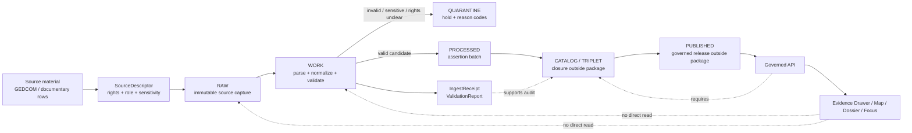

<!-- [KFM_META_BLOCK_V2]
doc_id: kfm://doc/TODO-uuid-genealogy-ingest-readme
title: Genealogy Ingest
type: standard
version: v1
status: draft
owners: TODO(package owner), TODO(genealogy domain steward), TODO(policy reviewer)
created: 2026-04-23
updated: 2026-04-23
policy_label: TODO(public|restricted) - document label needs steward review
related: [packages/genealogy_ingest/, TODO: docs/domains/genealogy/README.md, TODO: schemas/contracts/v1/people_dna_land/, TODO: policy/genealogy/]
tags: [kfm, genealogy, ingest, evidence, assertions, restricted-by-default]
notes: [Drafted from attached KFM doctrine without mounted repo proof; verify owners, schema home, package entrypoints, CI, and adjacent paths before merge.]
[/KFM_META_BLOCK_V2] -->

<a id="top"></a>

# Genealogy Ingest

Parse genealogy source material into evidence-bound assertion candidates without publishing, merging, or bypassing KFM policy.

> [!IMPORTANT]
> This README is a **draft package contract** for `packages/genealogy_ingest/`. Current implementation details, package manager, command names, tests, CI, and adjacent repo paths are **NEEDS VERIFICATION** before merge.

<div align="center">


</div>

| Impact field | Value |
|---|---|
| **Status** | **experimental / NEEDS VERIFICATION** |
| **Owners** | `TODO(package owner)`, `TODO(genealogy domain steward)`, `TODO(policy reviewer)` |
| **Primary path** | `packages/genealogy_ingest/README.md` |
| **Package posture** | Produces governed ingest artifacts and assertion candidates; does **not** publish or create canonical truth. |
| **Quick jumps** | [Scope](#scope) · [Repo fit](#repo-fit) · [Inputs](#inputs) · [Exclusions](#exclusions) · [Flow](#governed-ingest-flow) · [Quickstart](#quickstart-needs-verification) · [Gates](#definition-of-done) · [FAQ](#faq) |

---

## Scope

`packages/genealogy_ingest/` is the ingestion boundary for documentary genealogy material such as redacted GEDCOM fixtures, tree-export manifests, source-linked life-event rows, and relationship assertions.

Its job is narrow:

1. accept only source material that has an explicit source/admission context;
2. parse source-reported people, names, life events, households, and relationship assertions;
3. preserve evidence references, source role, time scope, place scope, confidence, and review state;
4. emit deterministic receipts and validation reports;
5. quarantine unsafe, malformed, rights-unclear, living-person-sensitive, or unsupported material.

It must **not** become a person registry, DNA processor, title system, public API, graph authority, Focus Mode backend, or publication shortcut.

---

## Repo fit

| Direction | Relationship | Status |
|---|---|---|
| **This package** | `packages/genealogy_ingest/` | **TARGET PATH PROVIDED** |
| **Upstream controls** | `TODO: docs/registers/SOURCE_FAMILY_INDEX.md`, `TODO: docs/domains/genealogy/README.md`, `TODO: data/registry/sources/genealogy/` | **NEEDS VERIFICATION** |
| **Upstream schemas** | `TODO: schemas/contracts/v1/people_dna_land/` or repo-native contract home | **CONFLICTED / NEEDS VERIFICATION** |
| **Upstream policy** | `TODO: policy/genealogy/`, `TODO: policy/evidence/` | **NEEDS VERIFICATION** |
| **Downstream validators** | `TODO: tools/validators/genealogy/`, `TODO: tools/validators/evidence/` | **PROPOSED / NEEDS VERIFICATION** |
| **Downstream lifecycle zones** | `data/raw/`, `data/work/`, `data/quarantine/`, `data/processed/`, `data/catalog/`, `data/triplet/`, `data/published/` | **DOCTRINAL / PATHS NEED VERIFICATION** |
| **Downstream user surfaces** | Governed API, Evidence Drawer, Focus Mode, map/dossier/story/export surfaces | **DOCTRINAL / IMPLEMENTATION UNKNOWN** |

> [!NOTE]
> Links are intentionally left as `TODO` path references until the real checkout confirms actual documentation, schema, policy, validator, and lifecycle homes. Do not turn these into markdown links until the paths resolve from `packages/genealogy_ingest/`.

[Back to top](#top)

---

## Inputs

Accepted inputs must arrive with source context, rights posture, and lifecycle placement. A parser-successful file is not automatically publishable.

| Input family | Belongs here? | Required posture |
|---|---:|---|
| Redacted historical GEDCOM fixture | ✅ Yes | Synthetic or reviewed fixture; no living-person exposure. |
| Source-linked documentary tree export | ✅ Yes | SourceDescriptor, rights snapshot, evidence refs, and living-person handling. |
| Name / life-event / relationship rows from documentary sources | ✅ Yes | Source role, confidence, time/place scope, and evidence refs. |
| Household or organization assertions from public historical records | ✅ Yes | Evidence-bound and reviewable; no unsupported canonical merge. |
| Malformed GEDCOM or incomplete manifest | ✅ In quarantine path | Emit `ValidationReport`; do not continue to processed output. |
| Living-person records | ⚠️ Restricted only | Fail closed for public output unless policy, consent, and review allow. |
| DNA match summaries | ❌ Not directly | Use a restricted DNA lane; this package may only receive consent-bound, already-reduced relationship-hypothesis references. |
| Raw DNA kit IDs, vendor match IDs, segments, VCF/genotype files | ❌ No | Forbidden from public-safe genealogy ingest. |
| Land instruments, assessor rows, parcel geometry | ❌ No | Use the land ownership lane; genealogy may link only through evidence-bound downstream relations. |

---

## Exclusions

This package does **not** own:

- canonical person records or identity merges;
- public person profiles;
- relationship truth decisions;
- raw DNA, DNA segment, VCF, genotype, or vendor kit processing;
- consent authority or revocation policy;
- land ownership, assessor, parcel, or title interpretation;
- MapLibre layer generation;
- Evidence Drawer rendering;
- Focus Mode synthesis;
- catalog closure, promotion, release signing, or publication.

Send those concerns to the appropriate governed contract, policy, catalog, graph, API, UI, or release surface after repo homes are verified.

[Back to top](#top)

---

## Directory tree

Current tree status: **NEEDS VERIFICATION**. The target checkout was not available during this drafting pass.

Expected package shape:

```text
packages/genealogy_ingest/
├── README.md                         # this file
├── TODO: package manifest            # pyproject.toml, package.json, Cargo.toml, etc. — verify repo stack
├── TODO: source module               # parser / normalizer / receipt writer — verify language convention
├── TODO: fixtures/                   # synthetic or redacted local fixtures only, if package-local fixtures are allowed
├── TODO: tests/                      # package tests, if local tests are repo convention
└── TODO: CHANGELOG.md                # optional package-local evolution log if repo convention supports it
```

Preferred fixture homes may instead be under a shared `tests/fixtures/genealogy/` subtree. Do not duplicate fixtures across package-local and shared homes without an ADR.

---

## Governed ingest flow

The package participates in KFM’s truth path. It does not replace it.



**Package boundary:** `genealogy_ingest` may parse, normalize, validate, and emit candidate artifacts. Catalog closure, graph projection, API exposure, and publication happen downstream through governed gates.

[Back to top](#top)

---

## Artifact contract

Generated artifact names are **PROPOSED** until schemas and package entrypoints are verified.

| Artifact | Purpose | Minimum posture |
|---|---|---|
| `IngestReceipt` | Process memory for source capture or parse run. | Include input refs, hashes, tool version, actor/run context, lifecycle state, and outcome. |
| `ValidationReport` | Deterministic validation result. | Emit `PASS`, `FAIL`, `WARN`, or `ERROR`; include reason codes and obligations. |
| `PersonAssertionBatch` | Parsed source-reported person assertions. | Keep separate from `PersonCanonical`. |
| `NameAssertion` | Source-reported and normalized names. | Preserve source form; do not collapse variants silently. |
| `LifeEvent` | Birth, death, residence, marriage, migration, burial, military, census, or similar event assertion. | Include time/place scope, evidence refs, and confidence. |
| `RelationshipAssertion` | Documentary relationship claim or candidate relationship. | Keep hypothesis status visible; no unsupported truth upgrade. |
| `QuarantineRecord` | Hold object for denied, malformed, unsafe, or ambiguous material. | Include reason codes, evidence refs when available, and review obligations. |

Illustrative output envelope:

```json
{
  "status": "PASS",
  "run_ref": "kfm://run/TODO",
  "ingest_receipt_ref": "kfm://receipt/TODO",
  "validation_report_ref": "kfm://validation/TODO",
  "assertion_batch_ref": "kfm://processed/genealogy/TODO",
  "evidence_refs": ["kfm://evidence/TODO"],
  "policy_posture": "restricted_by_default",
  "public_release_allowed": false
}
```

This example is **PROPOSED** and illustrative. Replace it with the repo-native schema once confirmed.

---

## Quickstart — NEEDS VERIFICATION

The real package command is unknown. Keep this pattern as a local smoke-test shape, not as an implementation claim.

```bash
# PSEUDOCODE — run only after package entrypoints and fixture paths are verified.
# Expected from repo root.

python -m packages.genealogy_ingest.cli validate \
  --source-descriptor TODO:data/registry/sources/genealogy/redacted_demo.source.json \
  --input TODO:tests/fixtures/genealogy/redacted_historical_tree.ged \
  --work-dir TODO:data/work/genealogy/demo-run \
  --out TODO:data/work/genealogy/demo-run/validation_report.json
```

Expected behavior after implementation:

```text
PASS  redacted_historical_tree.ged
EMIT  IngestReceipt
EMIT  ValidationReport
EMIT  assertion candidates
BLOCK public publication
```

Failure behavior must be just as deliberate:

```text
ERROR malformed GEDCOM        -> quarantine
DENY  living person exposure  -> restricted/quarantine
DENY  missing source terms    -> quarantine
DENY  unresolved EvidenceRef  -> no promotion
```

[Back to top](#top)

---

## Usage rules

### 1. Preserve assertion-first modeling

A source-reported person is a `PersonAssertion`, not a canonical person. A parser must not merge people into a canonical identity without evidence refs, review state, and downstream entity-resolution policy.

### 2. Keep living-person handling fail closed

Living, plausibly living, or unknown-recent records must default to restricted handling. Public output requires policy support, consent when applicable, and review state.

### 3. Keep DNA out of this package

Raw DNA identifiers, segment coordinates, vendor match IDs, and genotype data do not belong here. If a relationship hint comes from DNA, it must arrive as a restricted, consent-bound, evidence-referenced relationship hypothesis from the DNA lane.

### 4. Never treat source popularity as truth

Imported family trees, user-contributed records, and documentary sources have different source roles. The package must preserve that distinction so downstream policy and review can make informed decisions.

### 5. Emit machine-readable failure

Malformed input, parser ambiguity, missing evidence, rights uncertainty, source-role ambiguity, and living-person risk should produce structured reports, not silent drops.

---

## Validation matrix

| Check | Required behavior | Failure outcome |
|---|---|---|
| SourceDescriptor present | Every input batch names its source family, source role, rights, sensitivity, and citation posture. | `DENY` admission or quarantine. |
| Evidence refs present | Every outward candidate claim carries resolvable evidence refs. | `DENY` promotion. |
| GEDCOM parse validity | Parser reports malformed structure, unsupported extensions, and unresolved pointers. | `ERROR` or quarantine. |
| Living-person exposure | Recent or living records are detected and restricted. | Public `DENY`. |
| Relationship certainty | Weak or conflicting relationship support remains candidate/hypothesis. | `ABSTAIN`, not truth upgrade. |
| Consent and revocation hooks | Consent-bound outputs check revocation state before use. | `DENY` and cleanup obligations. |
| Deterministic identity | Stable IDs and hashes remain stable for the same canonical input. | `FAIL` on hash drift. |
| Catalog readiness | Candidate artifacts are linkable to receipts and evidence. | No downstream promotion. |

---

## Definition of done

Before this package can be treated as an active ingest package:

- [ ] Package owner, domain steward, and policy reviewer are confirmed.
- [ ] Actual package language, manifest, test runner, and entrypoint are verified.
- [ ] Schema home is resolved through repo evidence or ADR.
- [ ] SourceDescriptor contract exists for every admitted genealogy source family.
- [ ] Valid redacted historical GEDCOM fixture passes.
- [ ] Malformed GEDCOM fixture fails or quarantines with a machine-readable reason.
- [ ] Living-person fixture produces public `DENY`.
- [ ] Missing-evidence fixture produces `DENY` or `FAIL`.
- [ ] Revocation fixture blocks downstream use where consent-bound output is involved.
- [ ] `IngestReceipt` and `ValidationReport` are emitted and linkable.
- [ ] No raw DNA, raw vendor IDs, or DNA segments are accepted by this package.
- [ ] No package output is directly published without catalog, policy, proof, and review gates.
- [ ] README placeholders are resolved or explicitly accepted as tracked TODOs.

[Back to top](#top)

---

## FAQ

### Why does genealogy ingest produce assertions instead of people?

Because KFM treats historical and genealogical material as evidence-bound claims. A source can report a person, name, life event, or relationship, but canonical identity requires separate evidence, merge lineage, review state, and policy-aware handling.

### Why can a successful ingest still be non-publishable?

Validation means the package could parse and normalize the material. Publication requires source rights, sensitivity handling, EvidenceBundle resolution, catalog closure, policy decision, proof objects, review state, and release state.

### Why is DNA excluded from this package?

DNA data has consent, revocation, living-person, and raw-identifier risks that require restricted handling by default. Genealogy ingest may reference a reviewed, consent-bound relationship hypothesis, but it must not parse or expose raw DNA material.

### Why mention land ownership in a genealogy package?

People, genealogy, DNA, and land ownership are adjacent in KFM, but they are not the same bounded context. This package may emit evidence-bound people and relationship assertions that downstream lanes can link to land events. It does not decide title, parcel boundary truth, or ownership authority.

---

## Appendix

<details>
<summary><strong>Appendix A — Starter field register, PROPOSED</strong></summary>

| Field | Purpose | Status |
|---|---|---|
| `source_descriptor_ref` | Links the input to admitted source family, role, rights, and sensitivity. | **PROPOSED** |
| `source_document_ref` | Identifies the concrete GEDCOM, record page, export batch, or document item. | **PROPOSED** |
| `ingest_receipt_ref` | Links process memory and input hashes. | **PROPOSED** |
| `validation_report_ref` | Links deterministic validation result. | **PROPOSED** |
| `person_assertion_id` | Stable identifier for source-reported person assertion. | **PROPOSED** |
| `source_reported_identity` | Name/identity form as reported by source. | **PROPOSED** |
| `living_status_hint` | `living`, `deceased`, `unknown`, or repo-native equivalent. | **PROPOSED** |
| `event_type` | Source-reported life event type. | **PROPOSED** |
| `time_scope` | Date, interval, approximate date, or unknown time scope. | **PROPOSED** |
| `place_scope` | Place string, resolved place ref, generalized bucket, or unresolved place. | **PROPOSED** |
| `relationship_basis` | Documentary, imported-tree, inferred, DNA-derived reference, or combined. | **PROPOSED** |
| `confidence` | Parser or reviewer confidence, not final truth. | **PROPOSED** |
| `review_state` | Draft, quarantined, reviewed, promoted, superseded, withdrawn, or repo-native equivalent. | **PROPOSED** |
| `evidence_refs` | Evidence references that must resolve before any consequential output. | **DOCTRINAL / PROPOSED FIELD** |
| `public_visibility` | Public-safe, restricted, internal, redacted, generalized, or repo-native equivalent. | **PROPOSED** |
| `spec_hash` | Deterministic comparison hash for stable candidate batches. | **PROPOSED** |

</details>

<details>
<summary><strong>Appendix B — Review placeholders before merge</strong></summary>

- `doc_id` must be replaced with a real KFM document identifier.
- `owners` must be replaced with actual package, domain, and policy owners.
- `policy_label` must be decided for this README.
- Repo-native schema home must be verified.
- Repo-native package manager and test runner must be verified.
- Actual upstream/downstream paths must be converted into valid relative markdown links.
- Any quickstart command must be replaced with a real, tested command.
- Directory tree must be updated from the mounted repo, not from this proposed structure.
- CI badge targets must be replaced with real workflow badges only after workflow names are confirmed.

</details>

[Back to top](#top)
