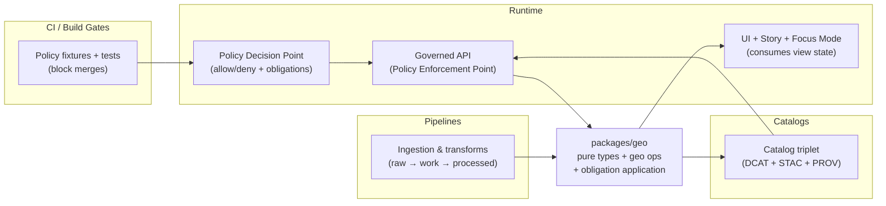

<!-- [KFM_META_BLOCK_V2]
doc_id: kfm://doc/478750e4-4eb6-4dd5-a294-d6aa1ad972c0
title: packages/geo — Geospatial primitives & policy-aware generalization
type: standard
version: v2
status: draft
owners: KFM Engineering (TBD)
created: 2026-02-22
updated: 2026-02-26
policy_label: public
related:
  - kfm://doc/KFM-GDG-2026
  - kfm://doc/KFM-IB5-2026
tags: [kfm, geo, packages, contract-first]
notes:
  - Contract-first README for the geo package; verify exports/build tooling against the repo.
  - Updated to align with KFM vNext vocabulary (DatasetVersion, EvidenceRef, policy labels/obligations, time axes).
[/KFM_META_BLOCK_V2] -->

<a id="top"></a>

# packages/geo
Geospatial primitives, extents, and **policy-aware generalization** for Kansas Frontier Matrix (KFM).

**Status:** `draft` · **Owners:** `KFM Engineering (TBD)` · **Policy label:** `public`


> [!WARNING]
> This README is **contract-first**. Actual exports, build commands, and dependency choices are **not confirmed in repo**.
> Treat the “Public API” section as a target interface until `packages/geo/package.json` and `packages/geo/src/` are verified.

---

## Quick navigation
- [Purpose](#purpose)
- [Where this fits](#where-this-fits)
- [Scope](#scope)
- [KFM-aligned vocabulary](#kfm-aligned-vocabulary)
- [Non-negotiable invariants](#non-negotiable-invariants)
- [Public API](#public-api)
- [Integration patterns](#integration-patterns)
- [Testing and gates](#testing-and-gates)
- [Package layout](#package-layout)
- [Change management](#change-management)
- [Verification checklist](#verification-checklist)
- [FAQ](#faq)

---

## Purpose
KFM is intentionally a **pipeline → catalogs/provenance → governed API → UI → Focus Mode** system.
`packages/geo` exists to make **geo correctness + governance correctness** reusable and testable across that whole chain.

This package should provide:
- **Geospatial types** (bbox, CRS, time extents, geometry) consistent across pipelines, APIs, and UI.
- **Deterministic helpers** (normalization/canonicalization) for reproducible artifacts and replayable map state.
- **Policy-aware obligation application** (generalize geometry, strip sensitive props) without embedding policy evaluation itself.
- **Format literacy** helpers (GeoParquet / PMTiles / COG / H3) so other packages don’t reinvent parsing/typing rules.

([↑ back to top](#top))

---

## Where this fits
`packages/geo` is a shared *pure* dependency for code that needs geospatial invariants but must not import infrastructure.



**Key boundary:** this package may *apply* obligations (generalize/redact), but it must not *decide* policy.

([↑ back to top](#top))

---

## Scope

### In scope
Pure utilities + types for:
- Spatial extents (`bbox`) and intersection/containment checks
- CRS representation (metadata surfaced, not guessed)
- Time modeling helpers (event/transaction/valid time where needed)
- Geometry safety transforms (clip/simplify/generalize) that are:
  - deterministic
  - auditable-friendly
  - compatible with policy obligations
- Obligation application:
  - generalize geometry / coarsen precision
  - remove sensitive attributes

### Out of scope
- Network I/O (tile fetching, API calls)
- Database queries (PostGIS/Neo4j)
- Catalog writing/validation (DCAT/STAC/PROV generation lives elsewhere)
- Rendering (MapLibre/Cesium)
- Secrets or privileged policy evaluation (must stay behind governed boundary)

> [!NOTE]
> Keeping this package **I/O-free** preserves layering: domain/use-case code depends on stable contracts, not infrastructure wiring.

([↑ back to top](#top))

---

## KFM-aligned vocabulary
This section intentionally mirrors KFM’s shared language so contributors don’t reinvent terms.

### Dataset artifacts and evidence
- **DatasetVersion**: immutable promoted output set for a dataset.
- **Artifact**: concrete file/object (GeoParquet, PMTiles, COG, JSONL, PDF) referenced by catalogs/provenance.
- **EvidenceRef**: stable reference scheme (`dcat://`, `stac://`, `prov://`, `doc://`, `graph://`) resolvable in bounded calls.

### Policy labels and obligations
- **policy_label** is the primary sensitivity/access-control classification.
- Policy evaluation produces:
  - allow/deny decision
  - obligations (generalization/redaction steps required)
  - reason codes (for audit + UX)

### Time axes
KFM uses multiple time axes when needed:
- **event time**: when something happened
- **valid time**: when a statement is considered true
- **transaction time**: when KFM recorded/published it

This package should support all three shapes at the type level, even if many datasets only use event + transaction.

### Map state as an artifact
Map state is not UI-only; it is a replayable artifact (for Stories and Focus Mode context). At minimum:
- bbox/zoom/camera
- layers with `dataset_version_id`
- time window

([↑ back to top](#top))

---

## Non-negotiable invariants
These rules protect the **trust membrane** and prevent silent geo drift.

### Geometry + CRS
- CRS must be explicit whenever we ingest/transform/emit geometry.
- Never assume CRS. If unknown, **fail closed** (typed error).
- Coordinate order must be unambiguous in types (GeoJSON is `[lon, lat]`).

### Policy + redaction
- This package does **not** make policy decisions.
- It must apply obligations deterministically and:
  - prevent “ghost metadata” leaks (e.g., bounding boxes or centroids that reveal restricted sites)
  - produce outputs that are safe against simple reverse engineering (no hidden precise points)
- When a public representation is allowed only via generalization, treat that as a first-class transform (recorded elsewhere in provenance).

### Determinism and reproducibility
- Same inputs ⇒ same outputs (including stable serialization/hashes where used).
- Normalization/canonicalization is idempotent: `normalize(normalize(x)) == normalize(x)`.

([↑ back to top](#top))

---

## Public API
> **Proposed** (not confirmed in repo). Update once `packages/geo/package.json` + actual exports are verified.

### Exported types (target)

| Type | Shape | Notes |
|---|---|---|
| `Bbox` | `[west, south, east, north]` | Standard bbox; dateline handling must be explicit |
| `LngLat` | `{ lng: number; lat: number }` | Avoid `(x,y)` ambiguity |
| `TimeInterval` | `{ start: string; end: string }` | ISO 8601 / RFC3339 |
| `TimeAxes` | `{ event?: TimeInterval; transaction?: TimeInterval; valid?: TimeInterval }` | Event + transaction first; valid time optional |
| `Crs` | `{ epsg?: number; wkt?: string; axis?: 'lonlat'|'latlon' }` | CRS explicit; axis order explicit |
| `PolicyLabel` | `'public' | 'public_generalized' | 'restricted' | 'restricted_sensitive_location' | 'internal' | 'embargoed' | 'quarantine' | string` | Allow extensions; treat starter list as controlled vocabulary |
| `PolicyObligation` | `{ type: string; [k: string]: unknown }` | e.g. `generalize_geometry`, `remove_attributes`, `show_notice` |
| `PolicyDecision` | `{ decision: 'allow'|'deny'; policy_label: PolicyLabel; obligations: PolicyObligation[]; reason_codes?: string[] }` | Mirrors governed API policy fields |

### Exported functions (target)

| Function | Purpose | Fail-closed behavior |
|---|---|---|
| `validateBbox(b: Bbox): Result<void, GeoError>` | bounds + ordering sanity | return `GeoError` |
| `normalizeBbox(b: Bbox): Result<Bbox, GeoError>` | canonical bbox | return `GeoError` |
| `bboxIntersects(a: Bbox, b: Bbox): boolean` | quick spatial filter | safe boolean |
| `bboxToPolygon(b: Bbox): Result<GeoJSON.Polygon, GeoError>` | clip/STAC extent derivation | return `GeoError` |
| `applyObligationsToGeometry(geom, obligations): Result<geom', GeoError>` | generalize/redact geometry | error if unsupported obligation |
| `stripSensitiveProps(props, obligations): props'` | enforce remove_attributes | deterministic deletion |
| `computeH3(geom, res): Result<string[], GeoError>` | spatial indexing | error if CRS unsupported |
| `stacExtentFromFeatures(features): Result<{ bbox: Bbox; interval: TimeInterval }, GeoError>` | deterministic STAC extents | must be stable and policy-aware |

> [!TIP]
> Prefer returning typed errors over silently “fixing” geometry; silent fixes create governance risk.

([↑ back to top](#top))

---

## Integration patterns

### 1) Pipelines: normalize and validate early
Common pipeline usage:
- validate CRS and geometry before promotion
- compute deterministic extents (bbox + time interval) for catalogs
- optionally enrich with H3 for diffing/rollups

**Pattern:** fail early in WORK/QUARANTINE; never “autofix” into PROCESSED.

### 2) Catalog triplet: deterministic extents
Catalog tooling should call into `packages/geo` to compute:
- STAC spatial bbox and temporal interval
- derived extents that match the actual promoted artifacts

> [!NOTE]
> `packages/geo` supports catalogs; it does not write or validate catalog records.

### 3) Runtime: apply obligations, don’t decide policy
The governed API (or evidence resolver) evaluates policy and returns obligations.
This package applies obligations so UI and Focus Mode only see policy-consistent geometry.

### 4) UI/Story/Focus: shared view state shape
Define a shared view-state type aligned to Story Node `map_state`.

**Example (shape target):**
```json
{
  "bbox": [-102.0, 36.9, -94.6, 40.0],
  "zoom": 6,
  "layers": [
    { "layer_id": "noaa_storm_events", "dataset_version_id": "2026-02.abcd1234" }
  ],
  "time_window": { "start": "1950-01-01", "end": "2024-12-31" }
}
```

([↑ back to top](#top))

---

## Testing and gates

### Unit tests (minimum)
- **BBox validity**
  - bounds (`-180..180`, `-90..90`) enforced
  - dateline behavior explicit and deterministic
- **CRS correctness**
  - cannot run transforms without explicit CRS
- **Obligation application**
  - `generalize_geometry` changes geometry deterministically
  - `remove_attributes` strips fields deterministically
- **Round-trip invariants**
  - normalization idempotence
  - stable serialization (if used)

### CI gates (expected consumers)
- policy fixture tests (allow/deny + obligations) must block merges
- schema validation gates elsewhere may depend on deterministic extents from this package

> [!WARNING]
> If CI policy semantics diverge from runtime policy semantics, CI guarantees are meaningless.

([↑ back to top](#top))

---

## Package layout
> Example layout (**not confirmed in repo**):

```text
packages/geo/
├─ README.md
├─ package.json
├─ src/
│  ├─ bbox.ts
│  ├─ crs.ts
│  ├─ time.ts
│  ├─ policy.ts
│  ├─ viewState.ts
│  ├─ geometry/
│  │  ├─ validate.ts
│  │  ├─ generalize.ts
│  │  └─ h3.ts
│  └─ index.ts
├─ test/
│  ├─ bbox.test.ts
│  ├─ policy.test.ts
│  ├─ time.test.ts
│  └─ geometry.test.ts
└─ tsconfig.json
```

([↑ back to top](#top))

---

## Change management
- **Contract-first:** exported types are shared contracts for pipelines/API/UI.
- **Versioning:** additive changes preferred; breaking changes require deliberate major bump.
- **Fail closed:** if policy application is ambiguous, return stable errors.

([↑ back to top](#top))

---

## Verification checklist
Use this list to convert “contract-first” into “confirmed.”

### Repo verification (minimum)
- [ ] Confirm package name, entrypoint(s), and export surface (`package.json`, `src/index.ts`)
- [ ] Confirm build tooling (`tsconfig`, bundler, test runner) and update README commands
- [ ] Confirm geometry library choices (or confirm “no heavy geo deps” policy)
- [ ] Confirm runtime targets (Node? Browser? Both?) and validate determinism across targets

### Governance verification (minimum)
- [ ] Confirm the canonical `policy_label` vocabulary in the repo and link it here
- [ ] Confirm obligation type names used by the policy engine (so `applyObligationsToGeometry` matches reality)
- [ ] Confirm Story Node `map_state` schema and align `ViewState` type

([↑ back to top](#top))

---

## FAQ

### Why not keep geo logic only in the API or UI?
Because geo correctness is cross-cutting: pipelines compute extents and artifacts; catalogs describe them; APIs enforce policy; UI/Focus Mode consume view state. Shared invariants belong in a shared package.

### Does this package “do policy”?
No. It applies obligations already computed by the policy engine. Policy evaluation stays behind the governed boundary.

### Where do catalog/provenance writers live?
Not here. This package supports them by producing deterministic extents and safe geometry outputs, but DCAT/STAC/PROV creation and validation live elsewhere.

([↑ back to top](#top))