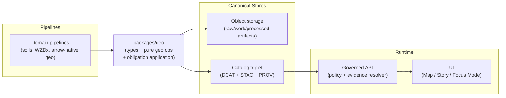

<!-- [KFM_META_BLOCK_V2]
doc_id: kfm://doc/478750e4-4eb6-4dd5-a294-d6aa1ad972c0
title: "packages/geo — Geospatial primitives & policy-aware generalization"
type: standard
version: v1
status: draft
owners: KFM Engineering (TBD)
created: 2026-02-22
updated: 2026-02-22
policy_label: public
related:
  - kfm://doc/KFM-GDG-2026
  - kfm://doc/KFM-IB5-2026
tags: [kfm, geo, packages]
notes:
  - "Contract-first README for the geo package; validate exports/build tooling against the repo."
[/KFM_META_BLOCK_V2] -->

# packages/geo
Geospatial primitives, extents, and **policy-aware generalization** for Kansas Frontier Matrix (KFM).

**Status:** `draft` · **Owners:** `KFM Engineering (TBD)` · **Policy label:** `public`


> [!WARNING]
> This README is **contract-first**. Actual exports, build commands, and dependency choices are **not confirmed in repo**.
> Treat the “Public API” section as a target interface and update once `package.json` + `src/` are verified.

---

## Quick navigation
- [Why this package exists](#why-this-package-exists)
- [Scope](#scope)
- [Non-negotiable invariants](#non-negotiable-invariants)
- [Core concepts](#core-concepts)
- [Public API](#public-api)
- [Integration patterns](#integration-patterns)
- [Testing and gates](#testing-and-gates)
- [Change management](#change-management)
- [FAQ](#faq)

---

## Why this package exists
KFM is intentionally a **pipeline → catalogs/provenance → governed API → UI → Focus Mode** system. `packages/geo` exists to make “geo correctness + governance correctness” reusable across that whole chain.

This package should provide:
- **Geospatial types** (bbox, CRS, time extents, geometry) that are consistent across pipelines, APIs, and UI.
- **Deterministic** helpers (normalization/canonicalization) so artifacts and map state are reproducible.
- **Policy-aware** geometry generalization/redaction helpers to satisfy obligations without leaking restricted detail.
- **Format literacy** (GeoParquet / PMTiles / COG / H3) so code can reason about common artifact classes without ad-hoc logic.

([↑ back to top](#packagesgeo))

---

## Scope

### In scope
- Pure utilities + types for:
  - `bbox` + spatial extent handling (intersection, normalization, validation)
  - CRS representation (EPSG/WKT metadata surfaced, not guessed)
  - Time modeling helpers for event/transaction/valid time (where needed)
  - Geometry validation + safe transformations (clipping, simplification, generalization)
  - Policy obligation application (generalize geometry, drop sensitive props)

### Out of scope
- Network I/O (fetching tiles, calling APIs)
- Database queries (PostGIS/Neo4j)
- Catalog generation (DCAT/STAC/PROV writing)
- Rendering (MapLibre/Cesium)
- Secrets or privileged policy evaluation (that belongs behind policy boundary)

> [!NOTE]
> Keeping this package **I/O-free** supports clean layering: domain/use-case code depends on stable contracts, not infrastructure wiring.

([↑ back to top](#packagesgeo))

---

## Non-negotiable invariants
These are the rules we enforce to protect the **trust membrane** and prevent “silent geo drift”.

### Geometry + CRS
- **CRS must be explicit** whenever we ingest/transform/emit geometry.
- Never “assume CRS”; if unknown, **fail closed** (return typed error or throw).
- Coordinate order must be **unambiguous** in the types (e.g., GeoJSON `[lon, lat]`).

### Time
- Support at least:
  - **event time** (when it happened)
  - **transaction time** (when KFM acquired/published it)
- Introduce **valid time** only where administrative history/boundary change demands it.

### Policy + redaction
- Policy decisions may require **obligations** (not just allow/deny).
- Geometry returned to UI/Focus Mode must be **policy-consistent**:
  - generalized if required
  - never reveal “ghost metadata” (e.g., a bbox that proves a restricted site exists)

### Determinism
- Functions must be deterministic:
  - same inputs ⇒ same outputs (and ideally same hashes)
- Normalization/canonicalization should be stable across runtimes.

([↑ back to top](#packagesgeo))

---

## Core concepts

### BBox
KFM frequently filters by bbox/time at multiple layers (catalog queries, PostGIS slices, UI view state, Focus Mode context).

- **Recommended bbox representation:** `[west, south, east, north]` in degrees (WGS84/EPSG:4326) **unless explicitly stated otherwise**.

### Map state is an artifact
Map state should be storable/replayable (stories) and usable as context (Focus Mode).
At minimum: camera/bbox/zoom, active layers, time window, filters.

### Policy decision obligations
Policy can return obligations like:
- `generalize_geometry` (minimum cell size / coarser resolution)
- `remove_attributes` (drop fields like exact location, owner name, etc.)

### Artifact formats (terminology)
- **GeoParquet**: analytics-friendly geospatial Parquet
- **PMTiles**: single-file vector tile container
- **COG**: Cloud-Optimized GeoTIFF
- **H3**: hierarchical hex indexing (tiling/diffing/aggregation)

([↑ back to top](#packagesgeo))

---

## Architecture fit



([↑ back to top](#packagesgeo))

---

## Public API
> **Proposed** (not confirmed in repo). Update once `packages/geo/package.json` + actual exports are verified.

### Types

| Type | Shape | Notes |
|---|---|---|
| `Bbox` | `[west, south, east, north]` | Normalize dateline crossing explicitly |
| `LngLat` | `{ lng: number; lat: number }` | Avoid `(x,y)` ambiguity |
| `TimeInterval` | `{ start: string; end: string }` | ISO 8601 / RFC3339 |
| `TimeAxes` | `{ event?: TimeInterval; transaction?: TimeInterval; valid?: TimeInterval }` | Event + transaction first |
| `Crs` | `{ epsg?: number; wkt?: string; axis?: 'lonlat'|'latlon' }` | CRS explicit; axis order explicit |
| `PolicyLabel` | `'public' \| 'restricted' \| string` | Keep extensible |
| `PolicyObligation` | `{ type: string; [k: string]: unknown }` | e.g. `generalize_geometry` |
| `PolicyDecision` | `{ decision: 'allow'|'deny'; policy_label: PolicyLabel; obligations?: PolicyObligation[]; reason_codes?: string[] }` | Carried into audit receipts |

### Functions

| Function | Purpose | Fail-closed behavior |
|---|---|---|
| `validateBbox(b: Bbox): Result<void>` | bounds + ordering sanity | error if invalid |
| `normalizeBbox(b: Bbox): Bbox` | canonical bbox | throws / returns error if invalid |
| `bboxIntersects(a: Bbox, b: Bbox): boolean` | quick spatial filter | safe boolean |
| `bboxToPolygon(b: Bbox): GeoJSON.Polygon` | for clipping / STAC | error if invalid |
| `applyObligationsToGeometry(geom, obligations): geom'` | generalize/redact geometry | error if unsupported obligation |
| `stripSensitiveProps(props, obligations): props'` | remove_attributes enforcement | deterministic deletion |
| `computeH3(geom, res): string[]` | spatial indexing | error if CRS not supported |
| `stacExtentFromFeatures(features): {bbox, interval}` | compute STAC extents | deterministic, policy-aware |

> [!TIP]
> Prefer returning **typed errors** over silently “fixing” geometry; silent fixes create governance risk.

([↑ back to top](#packagesgeo))

---

## Integration patterns

### 1) GeoParquet → PMTiles / COG (artifact production)
This is the standard geospatial artifact pathway:
- vectors: normalize → GeoParquet → vector tiles → PMTiles
- rasters: translate → tiled GeoTIFF + overviews → COG

`packages/geo` should support:
- geometry validity checks
- CRS/axis sanity
- deterministic bbox/time extent derivation for catalogs
- optional H3 enrichment for diffing and rollups

### 2) Arrow-native geo (GeoArrow → GeoParquet → IPC/Flight)
If you’re building high-throughput geospatial pipelines, an Arrow-native approach keeps geometry columnar in memory and reduces serialization.
`packages/geo` should not block this; it should:
- represent CRS in a way compatible with Arrow/GeoParquet metadata
- provide validation/canonicalization primitives used by pipeline tests

### 3) Governed tile delivery (PMTiles)
If tiles are served as PMTiles bundles, the common contract is:
- `/assets/pmtiles/{dataset_version_id}/{layer}.pmtiles` (static hosting + policy gating, or public-only)

`packages/geo` can help by standardizing:
- layer naming
- bbox/time metadata attached to tilesets
- policy label propagation to UI badges

### 4) Focus Mode context via `view_state`
Focus Mode can accept optional view context:
- map bbox
- time window
- active layers

`packages/geo` should define (or align to) the shared “view state” shape so:
- stories replay the same view
- Focus Mode answers stay grounded in spatial/temporal context

([↑ back to top](#packagesgeo))

---

## Testing and gates

### Required tests (minimum)
- **BBox validity**
  - bounds (`-180..180`, `-90..90`) enforced
  - dateline behavior explicit and deterministic
- **CRS correctness**
  - cannot run transforms without explicit CRS
- **Obligation application**
  - `generalize_geometry` changes geometry *and* emits a “redactions applied” record (return value or side channel)
  - `remove_attributes` deterministically strips fields
- **Round-trip invariants**
  - normalization functions are idempotent (`normalize(normalize(x)) == normalize(x)`)

### CI gates that should consume this package
- schema + contract validation (STAC/DCAT/PROV) happens elsewhere, but `packages/geo` provides:
  - deterministic extents
  - policy-consistent geometry
  - geometry validity checks

([↑ back to top](#packagesgeo))

---

## Package layout
> Example layout (**not confirmed in repo**):

```text
packages/geo/
├─ README.md
├─ package.json
├─ src/
│  ├─ bbox.ts
│  ├─ crs.ts
│  ├─ time.ts
│  ├─ policy.ts
│  ├─ geometry/
│  │  ├─ validate.ts
│  │  ├─ generalize.ts
│  │  └─ h3.ts
│  └─ index.ts
├─ test/
│  ├─ bbox.test.ts
│  ├─ policy.test.ts
│  └─ geometry.test.ts
└─ tsconfig.json
```

([↑ back to top](#packagesgeo))

---

## Change management
- **Contract-first:** treat exported types as a public contract for pipelines/API/UI.
- **Versioning:** add fields in a backward-compatible way; avoid breaking changes without a deliberate major bump.
- **Fail closed:** if a change makes policy application ambiguous, reject at compile time or at runtime with a stable error.

([↑ back to top](#packagesgeo))

---

## FAQ

### Why not keep this logic in the API or UI?
Because geo correctness is cross-cutting: pipelines generate extents and artifacts, APIs enforce policy and return slices, UI and Focus Mode consume view state. Shared invariants belong in a shared package.

### Does this package “do policy”?
No. It should **apply obligations** that were already computed by the policy engine. The policy decision itself stays behind the governed boundary.

### Where do catalogs/provenance live?
Not here. This package supports them by producing deterministic extents and safe geometry outputs, but DCAT/STAC/PROV creation and validation live in pipeline/catalog tooling.

([↑ back to top](#packagesgeo))
