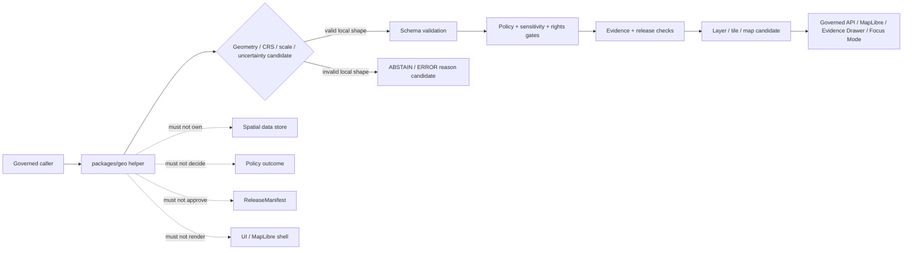

<!-- [KFM_META_BLOCK_V2]
doc_id: kfm://doc/NEEDS-VERIFICATION/packages-geo-readme
title: Geo Package README
type: readme
version: v1
status: draft
owners: OWNER_TBD
created: NEEDS VERIFICATION — target file existed before this revision as a short stub
updated: 2026-06-14
policy_label: public
related: [packages/README.md, docs/doctrine/directory-rules.md, docs/doctrine/map-first.md, docs/architecture/evidence-identity.md, docs/architecture/governed-api/ENVELOPES.md, docs/architecture/map-architecture.md, docs/architecture/evidence-drawer.md, contracts/, schemas/contracts/v1/, schemas/contracts/v1/map_context_envelope.schema.json, schemas/contracts/v1/layer_manifest.schema.json, schemas/contracts/v1/tile_artifact_manifest.schema.json, policy/, data/proofs/, data/receipts/, release/]
tags: [kfm, packages, geo, geometry, crs, scale, uncertainty, validation, map-first, public-safe-geometry, shared-library]
notes: ["README-like package entrypoint for shared geospatial primitive helper code.", "This package may contain CRS, scale, uncertainty, coordinate, extent, topology, public-safe geometry, and geometry validation helpers; it must not become a data store, schema home, contract home, policy home, source registry, lifecycle-data home, tile/layer release authority, public API route, UI surface, proof/receipt home, or AI truth source.", "Implementation files, package metadata, import namespace, tests, CI workflows, and runtime bindings remain NEEDS VERIFICATION until recursively inspected."]
[/KFM_META_BLOCK_V2] -->

<a id="top"></a>

# Geo Package

Shared helper-code package for KFM geospatial primitives: CRS handling, coordinate and extent helpers, scale and resolution metadata, geometry validation, uncertainty carriers, topology checks, and public-safe geometry preparation.

<p>
  
  
  
  
  
  
</p>

> [!IMPORTANT]
> **Status:** PROPOSED package README  
> **Path:** `packages/geo/README.md`  
> **Owning responsibility root:** `packages/` — shared reusable implementation libraries  
> **Package purpose:** CRS, scale, uncertainty, public-safe geometry, and geometry validation primitives  
> **Schema authority:** `schemas/contracts/v1/` and spatial contract schemas, not this package  
> **Policy authority:** `policy/` and domain/map policy homes, not this package  
> **Release authority:** `release/` and map/layer release manifests, not this package  
> **Repo implementation depth:** UNKNOWN for package metadata, import style, source files, tests, CI workflows, API bindings, emitted receipts, proof packs, release manifests, branch protections, and runtime behavior.

## Quick links

- [Scope](#scope)
- [Repo fit](#repo-fit)
- [Accepted inputs](#accepted-inputs)
- [Exclusions](#exclusions)
- [Geo helper responsibilities](#geo-helper-responsibilities)
- [Public-safe geometry rules](#public-safe-geometry-rules)
- [Trust-boundary flow](#trust-boundary-flow)
- [Expected package layout](#expected-package-layout)
- [Development rules](#development-rules)
- [Validation checklist](#validation-checklist)
- [Rollback](#rollback)
- [Evidence boundary](#evidence-boundary)

---

## Scope

`packages/geo/` is the shared implementation package lane for geospatial primitive helpers used across KFM domains, pipelines, validators, APIs, map preparation, Evidence Drawer support, and tests.

This package may contain deterministic utilities for:

- CRS identifiers and coordinate-axis handling;
- geometry type checks for point, line, polygon, multipoint, multiline, multipolygon, bbox, and extent candidates;
- coordinate precision, rounding, and normalization helpers when schema/policy allows them;
- scale, resolution, zoom, source-scale, and representation-scale metadata helpers;
- geometry validity checks, bbox checks, ring orientation checks, topology sanity checks, and dimensionality checks;
- uncertainty carriers for source scale, coordinate uncertainty, temporal/spatial scope mismatch, generalized geometry, and derived geometry;
- public-safe geometry candidate preparation, such as generalized, redacted, withheld, or centroided outputs when supplied with policy decisions and reason codes;
- MapContextEnvelope, LayerManifest, TileArtifactManifest, Evidence Drawer, and Focus Mode support fragments when they remain downstream candidates;
- synthetic and public-safe fixtures for spatial tests.

This package must not own source truth, evidence truth, geometry truth, source authority, policy outcome, lifecycle state, release state, public map publication, sensitive-coordinate disclosure, or generated spatial interpretation.

```text
RAW -> WORK / QUARANTINE -> PROCESSED -> CATALOG / TRIPLET -> PUBLISHED
```

Geo helper code may help validate, transform, or package spatial candidates inside that lifecycle. It does not approve promotion, publish layers, or replace canonical evidence.

[⬆ Back to top](#top)

---

## Repo fit

```text
packages/geo/
```

This path is appropriate for shared reusable geospatial helper code because `packages/` is the responsibility root for shared libraries used by apps, workers, pipelines, and tools.

| Relationship | Expected home | Boundary rule |
| --- | --- | --- |
| Shared geospatial helper code | `packages/geo/` | CRS, geometry, scale, uncertainty, public-safe geometry, and validation helpers only. |
| Domain-specific geospatial helpers | `packages/domains/<domain>/` or repo-confirmed domain package lane | Keep generic primitives here and domain semantics in domain packages. |
| Map runtime | `packages/maplibre-runtime/` or repo-confirmed map runtime package | Renderer/governed shell behavior does not belong in this package. |
| Map and spatial doctrine | `docs/doctrine/map-first.md`, `docs/architecture/map-architecture.md` | Explains map-first and trust-surface rules. |
| Semantic contracts | `contracts/` | Defines meaning; package code references, not redefines. |
| Machine schemas | `schemas/contracts/v1/` | Defines machine-checkable shape for map, geometry, layer, tile, runtime, and domain objects. |
| Policy rules | `policy/` | Owns allow/deny/restrict/hold/abstain, sensitivity, rights, and public-safe disclosure decisions. |
| Lifecycle spatial data | `data/<phase>/` | Stores source and derived spatial data by lifecycle phase. |
| Tiles, layer outputs, and map releases | `data/published/`, `release/`, and repo-confirmed map artifact homes | Publication and map release are governed state transitions. |
| Receipts and proofs | `data/receipts/`, `data/proofs/` | Stores process memory, geometry validation reports, and proof artifacts. |
| Public API and UI | `apps/`, `ui/`, `web/`, or repo-confirmed equivalents | Public clients must use governed APIs and released artifacts. |
| Tests and fixtures | `tests/packages/geo/`, `fixtures/packages/geo/`, or repo-confirmed equivalents | Proves helper behavior with deterministic no-network fixtures. |

> [!WARNING]
> Do not use `packages/geo/` as a convenience root for map layers, tiles, source datasets, geometry proofs, schemas, policies, source registries, release manifests, or UI components.

[⬆ Back to top](#top)

---

## Accepted inputs

Package helpers should accept explicit, inspectable values from governed callers. They should not fetch missing facts from source systems, raw stores, UI state, hidden globals, operator memory, or generated language.

| Input family | Accepted examples | Required handling |
| --- | --- | --- |
| CRS context | EPSG code, CRS URI, axis order, coordinate epoch, transformation metadata, source CRS, target CRS | Preserve CRS identity and transformation provenance; never assume WGS84 when absent. |
| Geometry candidate | GeoJSON-like geometry, WKT/WKB adapter output, bbox, extent, centroid, tile bounds, geometry ref | Validate shape and dimensions; keep source geometry and public geometry distinct. |
| Scale and resolution | source scale, representation scale, map zoom, grid resolution, pixel size, tile matrix set | Preserve scale metadata; do not imply more precision than the source supports. |
| Uncertainty context | coordinate uncertainty, source-scale caveat, generalized geometry reason, topology confidence, temporal/spatial scope mismatch | Carry uncertainty forward; do not smooth it away. |
| Policy/sensitivity context | public-safe class, redaction decision, generalization obligation, withheld reason, audience class | Use as input to output preparation; do not decide policy inside this package. |
| Evidence context | EvidenceRef, EvidenceBundle ref, validation report ref, source descriptor ref | Preserve refs; do not fabricate evidence for geometry. |
| Release/map context | LayerManifest ref, TileArtifactManifest ref, MapReleaseManifest ref, rollback ref | Carry refs; do not approve or publish release. |
| Fixture context | synthetic geometries, public-safe examples, known invalid geometries | Keep fixtures synthetic/sanitized and mark fixture-only records clearly. |

[⬆ Back to top](#top)

---

## Exclusions

| Do not put here | Correct home or owner | Reason |
| --- | --- | --- |
| RAW, WORK, QUARANTINE, PROCESSED, CATALOG, TRIPLET, or PUBLISHED spatial data | `data/<phase>/` | Lifecycle state must remain phase-visible. |
| Source descriptors and source registries | `data/registry/` or repo-confirmed registry homes | Source authority, rights, cadence, and limitations are governance data. |
| Semantic contracts | `contracts/` | Contracts own meaning. |
| JSON Schemas | `schemas/contracts/v1/` | Schemas own machine shape. |
| Spatial, map, sensitivity, rights, or release policy | `policy/` | Policy owns allow/deny/restrict/hold/abstain decisions. |
| Tiles, PMTiles, COGs, GeoParquet, vector tiles, raster tiles, layer artifacts | lifecycle/release artifact homes | Spatial artifacts require governed manifests and release state. |
| LayerManifest, StyleManifest, TileArtifactManifest, MapReleaseManifest instances | `release/`, control-plane/register, or lifecycle/release homes | Publication is a governed state transition. |
| EvidenceBundle stores, geometry proofs, validation reports, receipts | `data/proofs/`, `data/receipts/` | Trust artifacts must remain separately auditable. |
| Connectors, scrapers, source fetchers, credentials | `connectors/`, `pipelines/`, `configs/`, secret-management infrastructure | Source activation is governed and source-specific. |
| Public API routes or serializers | `apps/` or repo-confirmed API app | Public clients must not call package internals as authority. |
| UI components, MapLibre styles, Evidence Drawer views | `apps/`, `ui/`, `web/`, `styles/`, or repo-confirmed UI/style roots | Rendering is downstream from governed geometry and release. |
| AI-generated spatial claims or guessed geometry | governed AI runtime + evidence/citation validation | AI output is interpretive and evidence-subordinate. |
| Sensitive exact coordinates in fixtures | Nowhere in package fixtures | Rare species, archaeology, infrastructure, private-property, and protected-site locations may require redaction/generalization. |

[⬆ Back to top](#top)

---

## Geo helper responsibilities

| Responsibility | Expected behavior |
| --- | --- |
| Preserve CRS | Keep source CRS, target CRS, axis order, transformation method, and any coordinate-epoch metadata explicit. |
| Preserve scale | Carry source scale, representation scale, zoom/resolution, grid cell size, and precision limits. |
| Preserve uncertainty | Keep coordinate, geometry, topology, temporal, and source-scale uncertainty visible to downstream systems. |
| Validate geometry candidates | Return typed valid/invalid results for geometry shape, dimensions, bounds, rings, bbox, topology, and emptiness. |
| Separate exact and public geometry | Never overwrite internal/source geometry with generalized public geometry. |
| Support redaction/generalization candidates | Produce public-safe candidates only when supplied with policy posture and reason codes. |
| Prepare manifest fragments | Produce candidate fragments for layer/tile/map manifests without owning release. |
| Fail closed | Missing CRS, ambiguous axis order, invalid geometry, unknown sensitivity, or exact sensitive location should produce finite invalid/denied/abstain-ready states. |

[⬆ Back to top](#top)

---

## Public-safe geometry rules

| Case | Helper posture |
| --- | --- |
| CRS missing or ambiguous | Return invalid candidate or abstain-ready reason; do not assume. |
| Geometry is invalid | Return typed invalid state; do not silently repair unless caller explicitly requests a repair candidate with provenance. |
| Geometry precision exceeds source support | Preserve caveat or generalize; do not imply false precision. |
| Exact location is policy-sensitive | Require supplied policy decision and output generalized, redacted, withheld, or denied candidate. |
| Public layer candidate has no release refs | Return candidate as not publishable; package must not release it. |
| Derived geometry is produced | Mark it derived and preserve source geometry/evidence refs. |
| Map/UI asks for geometry directly | Return refs/candidates for governed API; do not bypass release, policy, or Evidence Drawer paths. |

[⬆ Back to top](#top)

---

## Trust-boundary flow


```mermaid
flowchart LR
    A[Governed caller] --> B[packages/geo helper]
    B --> C{Geometry / CRS / scale / uncertainty candidate}
    C -->|valid local shape| D[Schema validation]
    C -->|invalid local shape| E[ABSTAIN / ERROR reason candidate]
    D --> F[Policy + sensitivity + rights gates]
    F --> G[Evidence + release checks]
    G --> H[Layer / tile / map candidate]
    H --> I[Governed API / MapLibre / Evidence Drawer / Focus Mode]

    B -. must not own .-> J[Spatial data store]
    B -. must not decide .-> K[Policy outcome]
    B -. must not approve .-> L[ReleaseManifest]
    B -. must not render .-> M[UI / MapLibre shell]
```

[⬆ Back to top](#top)

---

## Expected package layout

> [!NOTE]
> The tree below is PROPOSED. Confirm package metadata, language conventions, import namespace, test layout, and CI before committing code beyond README files.

```text
packages/geo/
├── README.md                       # This file: package boundary and trust rules
├── pyproject.toml / package.json    # NEEDS VERIFICATION
├── src/                             # NEEDS VERIFICATION
│   └── geo/                         # PROPOSED namespace; confirm against repo convention
│       ├── README.md                # PROPOSED namespace guide
│       ├── __init__.py              # PROPOSED export boundary if Python convention is confirmed
│       ├── crs.py                   # PROPOSED CRS and axis-order helpers
│       ├── geometry.py              # PROPOSED geometry primitive checks
│       ├── bbox.py                  # PROPOSED extent and bounding-box helpers
│       ├── scale.py                 # PROPOSED scale/resolution helpers
│       ├── uncertainty.py           # PROPOSED spatial uncertainty carriers
│       ├── public_safe.py           # PROPOSED redaction/generalization candidates
│       ├── validation.py            # PROPOSED local geometry validation helpers
│       ├── manifests.py             # PROPOSED layer/tile/map manifest candidate helpers
│       ├── fixtures.py              # PROPOSED synthetic/sanitized spatial fixtures
│       └── py.typed                 # PROPOSED if typed Python package convention is confirmed
└── CHANGELOG.md                     # OPTIONAL / NEEDS VERIFICATION
```

Potential imports, subject to package verification:

```python
from geo.crs import CrsRef, normalize_crs_ref
from geo.geometry import validate_geometry_candidate
from geo.public_safe import make_public_safe_geometry_candidate
```

[⬆ Back to top](#top)

---

## Development rules

1. Treat this package as a helper layer, not an authority layer.
2. Prefer pure functions with explicit input objects.
3. Preserve CRS, source scale, representation scale, uncertainty, evidence refs, policy refs, and release refs supplied by callers.
4. Keep source/internal geometry and public-safe geometry separate.
5. Do not make network calls from this package.
6. Do not read directly from RAW, WORK, QUARANTINE, unpublished candidates, source systems, source credentials, canonical stores, or model runtimes.
7. Do not write lifecycle data, proofs, receipts, release manifests, tiles, layers, map styles, API responses, or UI components.
8. Do not decide policy; consume policy posture and return bounded helper outcomes.
9. Do not create schemas, contracts, policy rules, source registries, API routes, UI components, public answers, or release decisions from this package.
10. Do not store chain-of-thought, raw provider payloads, secrets, private source records, or unrestricted sensitive context.
11. Return typed invalid states instead of silent geometry repair, CRS guessing, or precision inflation.
12. Add deterministic tests for every behavior-changing helper and every negative path.
13. Keep fixtures synthetic, sanitized, and public-safe.
14. Preserve rollback and correction metadata supplied by callers when geo helper output can affect downstream publication candidates.

[⬆ Back to top](#top)

---

## Validation checklist

- [ ] Confirm `packages/geo/` package metadata and language/runtime convention.
- [ ] Confirm import namespace and whether it conflicts with external package names.
- [ ] Confirm owners and CODEOWNERS path coverage.
- [ ] Confirm schema homes for spatial/map context, layer, tile, and runtime envelopes.
- [ ] Confirm policy homes for public-safe geometry, sensitivity, rights, and map release behavior.
- [ ] Confirm tests for CRS missing/ambiguous, invalid geometry, empty geometry, bbox mismatch, scale mismatch, precision inflation, sensitive exact geometry, redaction/generalization, and valid public-safe candidates.
- [ ] Confirm helpers do not access RAW/WORK/QUARANTINE or unpublished candidate stores.
- [ ] Confirm helpers do not write proofs, receipts, release manifests, tiles, layer artifacts, catalog records, or API responses.
- [ ] Confirm public API routes wrap geo-derived outcomes in governed envelopes and released map artifacts.

Suggested inspection commands:

```bash
find packages/geo -maxdepth 5 -type f | sort
git grep -n "CRS\|bbox\|geometry\|uncertainty\|public-safe\|MapContextEnvelope\|LayerManifest\|TileArtifactManifest" -- packages docs contracts schemas policy tests fixtures apps 2>/dev/null || true
git grep -n "from geo\|import geo\|packages/geo" -- . 2>/dev/null || true
```

[⬆ Back to top](#top)

---

## Rollback

Rollback is required if this package:

- becomes a parallel schema, contract, policy, source-registry, lifecycle-data, evidence/proof, receipt, release, API, UI, tile, layer, map-style, or renderer authority;
- silently repairs or invents geometry without provenance;
- assumes CRS, axis order, precision, source scale, or public-safe status without supplied support;
- exposes exact sensitive geometry or stores sensitive coordinates in fixtures;
- permits public map output without evidence, policy, release, correction, and rollback support;
- lets public clients call package internals directly instead of governed APIs.

Rollback target: revert the package README or package-source PR, preserve audit notes, and file any authority drift in `docs/registers/DRIFT_REGISTER.md` or the repo-confirmed drift register.

[⬆ Back to top](#top)

---

## Evidence boundary

| Source | Status | Supports | Limits |
| --- | --- | --- | --- |
| Current target file | CONFIRMED | `packages/geo/README.md` existed as a short stub naming CRS, scale, uncertainty, and geometry validation primitives. | Stub did not prove package implementation maturity. |
| `packages/README.md` | CONFIRMED repo doc | `packages/` is for shared libraries used by apps, workers, pipelines, and tools. | Does not define geo package behavior. |
| `docs/doctrine/directory-rules.md` | CONFIRMED repo doctrine | Placement is responsibility-rooted; `packages/` is a shared-library root and lifecycle/trust roots remain separate. | Some path claims remain PROPOSED/NEEDS VERIFICATION in that doc. |
| `docs/doctrine/map-first.md` | CONFIRMED repo doctrine | Map is a governed carrier; public map interactions must expose evidence, time, source role, release, freshness, correction, and sensitive geometry must fail closed. | Does not prove this package is implemented. |
| Current file-generation pass | CONFIRMED request | User-requested target path and README expansion. | Does not inspect package metadata, tests, CI logs, dashboards, deployment posture, runtime behavior, or branch protection. |

[⬆ Back to top](#top)
