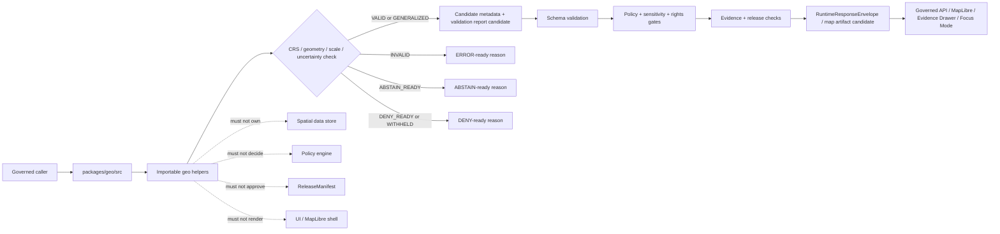

<!-- [KFM_META_BLOCK_V2]
doc_id: kfm://doc/NEEDS-VERIFICATION/packages-geo-src-readme
title: Geo Package Source README
type: readme
version: v1
status: draft
owners: OWNER_TBD
created: NEEDS VERIFICATION — target file existed before this repair but contained only placeholder text
updated: 2026-06-14
policy_label: public
related: [packages/geo/README.md, packages/README.md, docs/doctrine/directory-rules.md, docs/doctrine/map-first.md, docs/architecture/evidence-identity.md, docs/architecture/governed-api/ENVELOPES.md, docs/architecture/evidence-drawer.md, contracts/, schemas/contracts/v1/, schemas/contracts/v1/map_context_envelope.schema.json, schemas/contracts/v1/layer_manifest.schema.json, schemas/contracts/v1/tile_artifact_manifest.schema.json, policy/, data/proofs/, data/receipts/, release/]
tags: [kfm, packages, geo, src, geometry, crs, scale, uncertainty, validation, public-safe-geometry, map-first]
notes: ["README-like source-directory guide for shared geospatial primitive helper code.", "This directory may contain source code for CRS, scale, uncertainty, geometry validation, and public-safe geometry helpers only; it must not own schemas, contracts, policy, source registries, lifecycle data, proofs, receipts, release decisions, API routes, UI surfaces, tile/layer artifacts, renderer code, or AI truth claims.", "Import layout, package metadata, tests, CI workflows, and runtime bindings remain NEEDS VERIFICATION until the live repo is recursively inspected."]
[/KFM_META_BLOCK_V2] -->

<a id="top"></a>

# Geo Package Source

Source-code envelope for KFM geospatial primitives: deterministic helpers for CRS handling, coordinate and extent checks, scale and resolution metadata, spatial uncertainty carriers, geometry validation, topology sanity checks, and public-safe geometry candidate preparation.

<p>
  
  
  
  
  
  
  
</p>

> [!IMPORTANT]
> **Status:** PROPOSED source-directory README  
> **Path:** `packages/geo/src/README.md`  
> **Owning responsibility root:** `packages/`  
> **Package lane:** `packages/geo/`  
> **Import/package layout:** NEEDS VERIFICATION  
> **Repo implementation depth:** UNKNOWN for package metadata, import style, tests, CI workflows, API bindings, emitted receipts, proof packs, release manifests, branch protections, and runtime behavior.

## Quick links

- [Scope](#scope)
- [Repo fit](#repo-fit)
- [Accepted inputs](#accepted-inputs)
- [Exclusions](#exclusions)
- [Expected source layout](#expected-source-layout)
- [Geo helper outcomes](#geo-helper-outcomes)
- [Trust-boundary flow](#trust-boundary-flow)
- [Source anti-collapse rules](#source-anti-collapse-rules)
- [Development rules](#development-rules)
- [Validation checklist](#validation-checklist)
- [Rollback](#rollback)
- [Evidence boundary](#evidence-boundary)

---

## Scope

`packages/geo/src/` is the proposed source-code root for the Geo package.

This directory is for importable, deterministic helper code used by domain packages, pipelines, validators, governed API assemblers, Evidence Drawer support, Focus Mode support, map artifact preparation, and tests when they need shared spatial primitives.

This source tree may support helpers for:

- CRS references, CRS normalization, axis-order checks, coordinate epoch fields, and transformation metadata;
- geometry candidate checks for GeoJSON-like objects, WKT/WKB adapter output, bboxes, extents, centroids, and tile bounds;
- scale, map zoom, grid resolution, source scale, representation scale, and precision-limit helpers;
- spatial uncertainty carriers for coordinate uncertainty, source scale, derived geometry, generalized geometry, and temporal/spatial scope mismatch;
- validation results for invalid rings, empty geometry, bbox mismatch, topology warnings, dimensionality issues, and out-of-bounds candidates;
- public-safe geometry candidate preparation when supplied with policy posture, audience class, redaction/generalization obligations, and reason codes;
- candidate fragments for LayerManifest, TileArtifactManifest, MapContextEnvelope, Evidence Drawer payloads, and Focus Mode requests when schema-aligned;
- synthetic and public-safe fixtures for spatial tests.

This source tree must not fetch source data, store lifecycle artifacts, publish tiles/layers, decide policy, approve release, render UI, expose public API routes, call model providers, or generate spatial truth claims.

```text
RAW -> WORK / QUARANTINE -> PROCESSED -> CATALOG / TRIPLET -> PUBLISHED
```

Geo source code may validate, normalize, or package spatial candidates inside that lifecycle. It does not own lifecycle state, proof state, review state, release state, or public map authority.

[⬆ Back to top](#top)

---

## Repo fit

```text
packages/geo/src/
```

`packages/` is the responsibility root for shared reusable code. `geo/` is the package segment. `src/` is the source-code envelope.

| Relationship | Expected home | Boundary rule |
| --- | --- | --- |
| Geo source code | `packages/geo/src/` | Reusable geospatial primitive implementation helpers only. |
| Importable module | `packages/geo/src/geo/` or repo-confirmed namespace | Package namespace, subject to repo package convention verification. |
| Package entry README | `packages/geo/README.md` | Explains the package as a whole. |
| Domain-specific spatial semantics | `packages/domains/<domain>/` and `docs/domains/<domain>/` | Generic primitives stay here; domain meaning stays in domain lanes. |
| Map runtime / governed shell | `packages/maplibre-runtime/` or repo-confirmed map runtime package | Renderer and shell behavior do not belong in this package. |
| Spatial/map doctrine | `docs/doctrine/map-first.md`, `docs/architecture/map-architecture.md` | Explains map-first and trust-surface posture. |
| Semantic contracts | `contracts/` | Defines meaning; source code references, not redefines. |
| Machine schemas | `schemas/contracts/v1/` | Defines machine-checkable shape for map, geometry, layer, tile, runtime, and domain objects. |
| Policy rules | `policy/` | Owns sensitivity, rights, public-safe disclosure, and release decisions. |
| Lifecycle spatial data | `data/<phase>/` | Stores source and derived spatial data by lifecycle phase. |
| Receipts and proofs | `data/receipts/`, `data/proofs/` | Stores process memory and proof artifacts. |
| Release decisions | `release/` | Owns promotion, publication, correction, supersession, and rollback. |
| Public API and UI | `apps/`, `ui/`, `web/`, or repo-confirmed equivalents | May call geo helpers; must not be replaced by package internals. |
| Tests and fixtures | `tests/packages/geo/`, `fixtures/packages/geo/`, or repo-confirmed equivalents | Proves helper behavior with deterministic no-network fixtures. |

> [!WARNING]
> A source-code directory is not a trust-object home. Keep schemas, contracts, policy rules, lifecycle data, receipts, proofs, release decisions, map layer artifacts, and UI surfaces in their owning roots.

[⬆ Back to top](#top)

---

## Accepted inputs

Functions in this source tree should accept explicit values from governed callers. They should not fetch missing facts from raw stores, source systems, hidden globals, UI state, operator memory, or generated language.

| Input family | Accepted examples | Required handling |
| --- | --- | --- |
| CRS context | EPSG code, CRS URI, source CRS, target CRS, axis order, coordinate epoch, transformation method | Preserve CRS identity and provenance; never assume WGS84 when absent. |
| Geometry candidate | point, line, polygon, multipolygon, bbox, extent, centroid, tile bounds, geometry ref | Validate shape, dimensions, coordinate ranges, emptiness, bbox, and ring/topology posture. |
| Scale and resolution | source scale, representation scale, grid resolution, pixel size, tile matrix set, map zoom | Preserve source and representation scale; do not imply false precision. |
| Uncertainty context | coordinate uncertainty, generalized geometry reason, derived geometry note, topology confidence, scope mismatch | Carry uncertainty forward; do not smooth it away. |
| Policy/sensitivity context | audience class, redaction decision, generalization obligation, withheld reason, public-safe class | Use as input to candidate preparation; do not decide policy. |
| Evidence context | EvidenceRef, EvidenceBundle ref, source descriptor ref, validation report ref | Preserve refs; do not fabricate evidence for geometry. |
| Release/map context | LayerManifest ref, TileArtifactManifest ref, MapReleaseManifest ref, rollback ref | Carry refs; do not approve or publish release. |
| Fixture context | synthetic geometries, public-safe examples, known invalid geometries | Keep fixtures synthetic/sanitized and clearly marked. |

[⬆ Back to top](#top)

---

## Exclusions

| Do not put here | Correct home or owner | Reason |
| --- | --- | --- |
| RAW, WORK, QUARANTINE, PROCESSED, CATALOG, TRIPLET, or PUBLISHED spatial data | `data/<phase>/` | Lifecycle state must remain phase-visible. |
| Source descriptors and source registries | `data/registry/` or repo-confirmed registry homes | Source authority, rights, cadence, and limitations are governance data. |
| Semantic contracts | `contracts/` | Contracts own meaning. |
| JSON Schemas | `schemas/contracts/v1/` | Schemas own machine shape. |
| Spatial, map, sensitivity, rights, or release policy | `policy/` | Policy owns allow/deny/restrict/hold/abstain decisions. |
| Tiles, PMTiles, COGs, GeoParquet, vector tiles, raster tiles, layer artifacts | lifecycle/release artifact homes | Spatial artifacts require governed manifests and release state. |
| LayerManifest, StyleManifest, TileArtifactManifest, MapReleaseManifest instances | `release/`, control-plane/register, or lifecycle/release homes | Publication is a governed state transition. |
| EvidenceBundle stores, geometry proofs, validation reports, receipts | `data/proofs/`, `data/receipts/` | Trust artifacts must remain separately auditable. |
| Connectors, scrapers, source fetchers, credentials | `connectors/`, `pipelines/`, `configs/`, secret-management infrastructure | Source activation is governed and source-specific. |
| Public API routes or serializers | `apps/` or repo-confirmed API app | Public clients must not call package internals as authority. |
| UI components, MapLibre styles, Evidence Drawer views | `apps/`, `ui/`, `web/`, `styles/`, or repo-confirmed UI/style roots | Rendering is downstream from governed geometry and release. |
| Renderer shell behavior | `packages/maplibre-runtime/` or repo-confirmed map runtime package | MapLibre runtime governance is a separate package lane. |
| AI-generated spatial claims or guessed geometry | governed AI runtime + evidence/citation validation | AI output is interpretive and evidence-subordinate. |
| Sensitive exact coordinates in fixtures | Nowhere in package fixtures | Rare species, archaeology, infrastructure, private-property, and protected-site locations may require redaction/generalization. |

[⬆ Back to top](#top)

---

## Expected source layout

> [!NOTE]
> The tree below is PROPOSED. Confirm package metadata, language conventions, import namespace, test layout, and CI before committing code beyond README files.

```text
packages/geo/src/
├── README.md                # This file: source-code boundary and trust rules
└── geo/
    ├── README.md            # PROPOSED: importable namespace guide
    ├── __init__.py          # PROPOSED: export boundary if Python convention is confirmed
    ├── crs.py               # PROPOSED: CRS and axis-order helpers
    ├── geometry.py          # PROPOSED: geometry primitive checks
    ├── bbox.py              # PROPOSED: extent and bounding-box helpers
    ├── scale.py             # PROPOSED: scale/resolution helpers
    ├── uncertainty.py       # PROPOSED: spatial uncertainty carriers
    ├── public_safe.py       # PROPOSED: redaction/generalization candidates
    ├── validation.py        # PROPOSED: local geometry validation helpers
    ├── manifests.py         # PROPOSED: layer/tile/map manifest candidate helpers
    ├── fixtures.py          # PROPOSED: synthetic/sanitized spatial fixtures
    └── py.typed             # PROPOSED: include only if typed Python package convention is confirmed
```

Preferred import posture, subject to package verification:

```python
from geo.crs import CrsRef, normalize_crs_ref
from geo.geometry import validate_geometry_candidate
from geo.public_safe import make_public_safe_geometry_candidate
```

[⬆ Back to top](#top)

---

## Geo helper outcomes

Geo source helpers should return explicit, inspectable outcomes that callers can map into validation reports or runtime envelopes.

| Helper outcome | Use when | Runtime posture |
| --- | --- | --- |
| `VALID` | CRS, geometry, scale, uncertainty, and supplied policy context are locally consistent. | Candidate for downstream schema, evidence, policy, citation, and release checks. |
| `INVALID` | Geometry shape, CRS, bbox, scale, topology, precision, or required metadata fails local checks. | `ERROR` or invalid validation report depending on caller. |
| `ABSTAIN_READY` | Missing support, ambiguous CRS, unresolved evidence, unknown scale, or insufficient public-safe posture prevents a trusted answer. | `ABSTAIN` with stable reason code. |
| `DENY_READY` | Supplied policy/sensitivity posture blocks disclosure or exact geometry output. | `DENY` with stable policy/sensitivity reason code. |
| `GENERALIZED` | Public-safe geometry candidate was produced from supplied policy obligation and source geometry. | Candidate only; release and evidence gates still required. |
| `WITHHELD` | Geometry cannot be disclosed for the requested audience. | `DENY` or redacted `ANSWER` only through governed API and policy envelope. |

`VALID` or `GENERALIZED` is not the same as published truth. It only means the helper found locally sufficient geospatial shape support for the next governed gate.

[⬆ Back to top](#top)

---

## Trust-boundary flow



[⬆ Back to top](#top)

---

## Source anti-collapse rules

| Boundary | Preserve as | Never collapse into |
| --- | --- | --- |
| Source geometry | Internal/source spatial candidate with provenance and evidence refs | Public-safe geometry by overwrite |
| Public-safe geometry | Derived/generalized/redacted candidate with reason and policy refs | Canonical geometry truth |
| CRS | Explicit source/target CRS and transform metadata | Assumed WGS84 or silent axis swap |
| Scale and precision | Source and representation limits | False precision in UI/API output |
| Uncertainty | Coordinate, geometry, topology, scale, and temporal/spatial caveats | Clean-looking map with hidden caveats |
| Geometry validation | Local helper result | Schema authority, policy decision, release approval, or public answer |
| Map layer candidate | Downstream candidate fragment | Published layer or release manifest |
| Fixture geometry | Synthetic/sanitized test material | Real sensitive coordinate sample |

[⬆ Back to top](#top)

---

## Development rules

1. Prefer pure functions with explicit input objects.
2. Preserve CRS, axis order, source scale, representation scale, uncertainty, evidence refs, policy refs, release refs, and rollback refs supplied by callers.
3. Keep source/internal geometry and public-safe geometry separate.
4. Do not make network calls from `src/` helpers.
5. Do not read directly from RAW, WORK, QUARANTINE, unpublished candidates, source systems, source credentials, canonical stores, or model runtimes.
6. Do not write lifecycle data, proofs, receipts, release manifests, tiles, layer artifacts, map styles, API responses, or UI components.
7. Do not decide policy; consume policy posture and return bounded helper outcomes.
8. Do not create schemas, contracts, policy rules, source registries, API routes, UI components, public answers, release decisions, or renderer logic from this source tree.
9. Do not store chain-of-thought, raw provider payloads, secrets, private source records, or unrestricted sensitive context.
10. Return typed invalid states instead of silent geometry repair, CRS guessing, axis-order guessing, or precision inflation.
11. Add deterministic tests for every behavior-changing helper and every negative path.
12. Keep fixtures synthetic, sanitized, and public-safe.
13. Preserve rollback and correction metadata supplied by callers when geo helper output can affect downstream publication candidates.

[⬆ Back to top](#top)

---

## Validation checklist

- [ ] Confirm `packages/geo/src/` exists in the mounted repo with this README as its source-directory guide.
- [ ] Confirm package manager and import convention (`pyproject.toml`, workspace config, or equivalent).
- [ ] Confirm whether this source tree is Python-only, TypeScript-only, or mixed-language.
- [ ] Confirm owners and CODEOWNERS path coverage.
- [ ] Confirm schema homes for spatial/map context, layer, tile, and runtime envelopes.
- [ ] Confirm policy homes for public-safe geometry, sensitivity, rights, and map release behavior.
- [ ] Confirm validators and tests that exercise this namespace.
- [ ] Confirm tests for CRS missing/ambiguous, invalid geometry, empty geometry, bbox mismatch, scale mismatch, precision inflation, sensitive exact geometry, redaction/generalization, and valid public-safe candidates.
- [ ] Confirm helpers do not access RAW/WORK/QUARANTINE or unpublished candidate stores.
- [ ] Confirm helpers do not write proofs, receipts, release manifests, tiles, layer artifacts, catalog records, or API responses.
- [ ] Confirm public API routes wrap geo-derived outcomes in governed envelopes and released map artifacts.

Suggested inspection commands:

```bash
find packages/geo/src -maxdepth 5 -type f | sort
git grep -n "CRS\|bbox\|geometry\|uncertainty\|public_safe\|public-safe\|MapContextEnvelope\|LayerManifest\|TileArtifactManifest" -- packages docs contracts schemas policy tests fixtures apps 2>/dev/null || true
git grep -n "from geo\|import geo\|packages/geo/src" -- . 2>/dev/null || true
```

[⬆ Back to top](#top)

---

## Rollback

Rollback is required if this source tree:

- creates a parallel authority home for schemas, contracts, policy, registries, lifecycle data, receipts, proofs, releases, API routes, UI surfaces, tile/layer artifacts, map styles, renderer logic, model runtimes, or source data;
- silently repairs or invents geometry without provenance;
- assumes CRS, axis order, precision, source scale, or public-safe status without supplied support;
- exposes exact sensitive geometry or stores sensitive coordinates in fixtures;
- permits public map output without evidence, policy, release, correction, and rollback support;
- lets public clients call package internals directly instead of governed APIs.

Rollback target: revert the geo-source PR, keep any generated audit notes as review evidence, and file the affected behavior in `docs/registers/DRIFT_REGISTER.md` or `docs/registers/VERIFICATION_BACKLOG.md` if the mounted repo uses those registers.

[⬆ Back to top](#top)

---

## Evidence boundary

| Source | Status | Supports | Limits |
| --- | --- | --- | --- |
| Current target file | CONFIRMED | `packages/geo/src/README.md` existed and required replacement from placeholder content. | Did not prove source implementation maturity. |
| Parent package README | CONFIRMED repo doc | `packages/geo/` is a shared helper-code package for CRS, scale, uncertainty, public-safe geometry, and geometry validation primitives. | Does not prove source files, package metadata, tests, or CI. |
| `packages/README.md` | CONFIRMED repo doc | `packages/` is for shared libraries used by apps, workers, pipelines, and tools. | Does not define this source namespace. |
| `docs/doctrine/directory-rules.md` | CONFIRMED repo doctrine | Placement is responsibility-rooted; `packages/` is a shared-library root and lifecycle/trust roots remain separate. | Some path claims remain PROPOSED/NEEDS VERIFICATION in that doc. |
| `docs/doctrine/map-first.md` | CONFIRMED repo doctrine | Map is a governed carrier; public map interactions must expose evidence, time, source role, release, freshness, correction, and sensitive geometry must fail closed. | Does not prove this source tree is implemented. |
| Current file-generation pass | CONFIRMED request | User-requested target path and README repair/replacement. | Does not inspect package metadata, tests, CI logs, dashboards, deployment posture, runtime behavior, or branch protection. |

[⬆ Back to top](#top)
