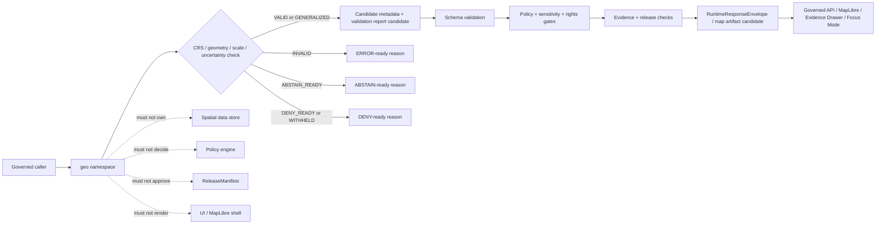

<!-- [KFM_META_BLOCK_V2]
doc_id: kfm://doc/NEEDS-VERIFICATION/packages-geo-src-geo-readme
title: Geo Import Namespace README
type: readme
version: v1
status: draft
owners: OWNER_TBD
created: NEEDS VERIFICATION — target file existed before this repair but contained only placeholder text
updated: 2026-06-14
policy_label: public
related: [packages/geo/README.md, packages/geo/src/README.md, packages/README.md, docs/doctrine/directory-rules.md, docs/doctrine/map-first.md, contracts/, schemas/contracts/v1/, policy/, data/proofs/, data/receipts/, release/]
tags: [kfm, packages, geo, import-namespace, geometry, crs, scale, uncertainty, validation, public-safe-geometry, map-first]
notes: ["Namespace guide for importable geospatial primitive helpers.", "This namespace may expose deterministic CRS, geometry, scale, uncertainty, validation, and public-safe geometry helpers only.", "It must not own schemas, contracts, policy, source registries, lifecycle data, proofs, receipts, release decisions, API routes, UI surfaces, tile/layer artifacts, renderer code, model runtimes, or AI truth claims."]
[/KFM_META_BLOCK_V2] -->

<a id="top"></a>

# `geo` Import Namespace

Importable helper namespace for KFM geospatial primitives: deterministic CRS, coordinate, extent, scale, uncertainty, geometry-validation, and public-safe geometry utilities.

<p>
  
  
  
  
  
</p>

> [!IMPORTANT]
> **Status:** PROPOSED import-namespace README  
> **Path:** `packages/geo/src/geo/README.md`  
> **Owning responsibility root:** `packages/`  
> **Package lane:** `packages/geo/`  
> **Source envelope:** `packages/geo/src/`  
> **Import namespace:** `geo` — NEEDS VERIFICATION against package metadata  
> **Repo implementation depth:** UNKNOWN for module files, exports, tests, package manager, CI workflows, API bindings, receipts, proof packs, release manifests, branch protections, and runtime behavior.

## Scope

`packages/geo/src/geo/` is the proposed importable namespace for reusable geospatial primitive helper code.

It may contain pure, deterministic helpers for:

- CRS references, CRS normalization, axis-order checks, coordinate epochs, and transformation metadata;
- geometry candidate validation for points, lines, polygons, bboxes, extents, centroids, and tile bounds;
- scale, resolution, precision, map zoom, tile matrix set, and source-scale helper values;
- spatial uncertainty carriers for coordinate uncertainty, generalized geometry, derived geometry, topology confidence, and temporal/spatial scope mismatch;
- public-safe geometry candidates when supplied with policy posture, audience class, redaction/generalization obligations, and reason codes;
- local validation result objects that downstream systems can turn into validation reports, runtime envelopes, layer manifests, or Evidence Drawer payload candidates;
- synthetic and public-safe fixtures for positive and negative spatial tests.

This namespace must not decide spatial truth, source authority, policy outcome, sensitivity posture, evidence closure, release state, review state, correction state, public map publication, or renderer behavior.

## Namespace contract

The namespace is a helper boundary, not an authority boundary.

| Namespace concern | Expected behavior | Authority home |
| --- | --- | --- |
| CRS handling | Preserve explicit source/target CRS, axis order, and transformation metadata. | Spatial schemas, source descriptors, and map/layer contracts |
| Geometry validation | Check local geometry shape, dimensions, bbox, rings, topology, and emptiness. | Schemas, validation reports, and governed validators |
| Scale and precision | Preserve source scale, representation scale, resolution, and precision limits. | Source descriptors, tile/layer manifests, and map release docs |
| Uncertainty | Carry coordinate, topology, scale, and derived-geometry uncertainty forward. | Evidence/proof records, schemas, and downstream UI/API envelopes |
| Public-safe geometry | Produce redacted, generalized, or withheld candidates only from supplied policy posture. | Policy homes and release/publication gates |
| Manifest fragments | Build candidate fragments for downstream manifests. | `release/`, control-plane/registers, and schema homes |
| Fixtures | Produce synthetic/sanitized examples for tests only. | `tests/` and `fixtures/`, not production evidence or release homes |

## Expected modules

> [!NOTE]
> The tree below is PROPOSED. Confirm actual language, module names, package manager, and tests before treating these as implementation facts.

```text
packages/geo/src/geo/
├── README.md                 # This file: namespace guide
├── __init__.py               # PROPOSED: export boundary if Python convention is confirmed
├── crs.py                    # PROPOSED: CRS references, axis order, and transform metadata helpers
├── geometry.py               # PROPOSED: geometry primitive checks
├── bbox.py                   # PROPOSED: extent and bounding-box helpers
├── scale.py                  # PROPOSED: source scale, representation scale, and resolution helpers
├── uncertainty.py            # PROPOSED: spatial uncertainty carriers
├── public_safe.py            # PROPOSED: redaction/generalization/withheld geometry candidates
├── validation.py             # PROPOSED: local geometry validation result helpers
├── manifests.py              # PROPOSED: layer/tile/map manifest candidate fragments
├── fixtures.py               # PROPOSED: synthetic/sanitized spatial fixtures
└── py.typed                  # PROPOSED: include only if typed Python package convention is confirmed
```

## Allowed exports

| Export family | Examples | Rule |
| --- | --- | --- |
| CRS helpers | `CrsRef`, `normalize_crs_ref`, `check_axis_order` | Preserve explicit CRS values; never assume missing CRS. |
| Geometry checks | `validate_geometry_candidate`, `check_geometry_type`, `check_ring_validity` | Local validation only; schema validation remains separate. |
| Bbox/extent helpers | `bbox_from_geometry`, `check_bbox_contains_geometry` | Return bounded helper results and caveats. |
| Scale helpers | `ScaleRef`, `check_precision_supported`, `normalize_resolution` | Prevent false precision and preserve scale metadata. |
| Uncertainty carriers | `SpatialUncertainty`, `attach_uncertainty` | Preserve uncertainty; do not hide it in clean output. |
| Public-safe helpers | `make_public_safe_geometry_candidate`, `withheld_geometry_candidate` | Require supplied policy posture and reason codes. |
| Manifest fragments | `make_layer_geometry_fragment`, `make_tile_extent_fragment` | Candidate fragments only; no release approval. |
| Fixture helpers | `valid_point_fixture`, `invalid_polygon_fixture`, `withheld_fixture` | Synthetic/sanitized only. |

## Disallowed exports

Do not export functions or constants that make this namespace an authority surface.

| Disallowed export | Why |
| --- | --- |
| `publish_layer`, `approve_map_release`, `write_tile_manifest` | Release and publication authority belongs outside package source. |
| `evaluate_policy`, `decide_sensitivity`, `allow_exact_geometry` | Policy decisions belong to policy systems. |
| `fetch_source_geometry`, `read_raw_geometry`, `scan_source_dataset` | Source activation and lifecycle access belong to connectors/pipelines/data roots. |
| `store_geometry`, `write_proof`, `write_receipt`, `write_catalog_record` | Data, proof, receipt, and catalog storage are separate trust homes. |
| `render_map`, `maplibre_layer`, `evidence_drawer_component` | Renderer/UI behavior belongs to map runtime and UI/app roots. |
| `guess_crs`, `force_valid`, `repair_silently`, `inflate_precision` | These names violate spatial trust posture. |
| `generate_geometry`, `summarize_place_truth`, `make_claim` | Geo helpers are not claim generators or truth sources. |
| `call_model`, `embed_place`, `chat_about_geometry` | Model provider calls belong behind governed AI adapter placement. |

## Import posture

Preferred imports, subject to package metadata verification:

```python
from geo.crs import CrsRef, normalize_crs_ref
from geo.geometry import validate_geometry_candidate
from geo.public_safe import make_public_safe_geometry_candidate
from geo.uncertainty import SpatialUncertainty
```

Callers should treat geo output as a candidate for schema validation, policy gates, evidence checks, release review, and runtime-envelope wrapping. A locally valid geometry is not public truth by itself.

## Geo helper outcomes

| Helper outcome | Use when | Runtime posture |
| --- | --- | --- |
| `VALID` | CRS, geometry, scale, uncertainty, and supplied policy context are locally consistent. | Candidate for downstream schema, evidence, policy, citation, and release checks. |
| `INVALID` | Geometry shape, CRS, bbox, scale, topology, precision, or required metadata fails local checks. | `ERROR` or invalid validation report depending on caller. |
| `ABSTAIN_READY` | Missing support, ambiguous CRS, unresolved evidence, unknown scale, or insufficient public-safe posture prevents a trusted answer. | `ABSTAIN` with stable reason code. |
| `DENY_READY` | Supplied policy/sensitivity posture blocks disclosure or exact geometry output. | `DENY` with stable policy/sensitivity reason code. |
| `GENERALIZED` | Public-safe geometry candidate was produced from supplied policy obligation and source geometry. | Candidate only; release and evidence gates still required. |
| `WITHHELD` | Geometry cannot be disclosed for the requested audience. | `DENY` or redacted `ANSWER` only through governed API and policy envelope. |

`VALID` and `GENERALIZED` are not the same as published truth. They only mean the helper found locally sufficient geospatial shape support for the next governed gate.

## Trust-boundary flow



## Development rules

1. Keep the namespace no-network by default.
2. Prefer pure functions with explicit input objects.
3. Preserve CRS, axis order, source scale, representation scale, uncertainty, evidence refs, policy refs, release refs, and rollback refs supplied by callers.
4. Keep source/internal geometry and public-safe geometry separate.
5. Do not read from RAW, WORK, QUARANTINE, unpublished candidates, source systems, source credentials, canonical stores, or model runtimes.
6. Do not write lifecycle data, proofs, receipts, release manifests, tiles, layer artifacts, map styles, catalog records, API responses, or UI components.
7. Do not evaluate policy; consume policy posture and return bounded helper outcomes.
8. Do not create schemas, contracts, policy rules, source registries, API routes, UI components, public answers, release decisions, or renderer logic from this namespace.
9. Do not store raw provider payloads, secrets, private source records, or unrestricted sensitive context.
10. Return typed invalid states instead of silent geometry repair, CRS guessing, axis-order guessing, or precision inflation.
11. Add deterministic tests for every export and every negative path.
12. Keep fixtures synthetic, sanitized, and public-safe.
13. Preserve rollback and correction metadata supplied by callers when geo helper output can affect downstream publication candidates.

## Validation checklist

- [ ] Confirm this namespace exists in package metadata.
- [ ] Confirm the package import name is actually `geo`.
- [ ] Confirm `__init__` exports are intentional and minimal.
- [ ] Confirm tests cover `VALID`, `INVALID`, `ABSTAIN_READY`, `DENY_READY`, `GENERALIZED`, and `WITHHELD` helper states if implemented.
- [ ] Confirm tests cover CRS missing/ambiguous, invalid geometry, empty geometry, bbox mismatch, scale mismatch, precision inflation, redaction/generalization, and valid public-safe candidates.
- [ ] Confirm helpers do not import connectors, data stores, policy engines, release writers, model providers, API routers, UI components, renderer shells, or receipt/proof stores.
- [ ] Confirm helpers do not access RAW/WORK/QUARANTINE or unpublished candidate stores.
- [ ] Confirm public-facing API routes serialize geo-derived results through schema-valid `RuntimeResponseEnvelope` objects and released map artifacts.

Suggested inspection commands:

```bash
find packages/geo/src/geo -maxdepth 3 -type f | sort
git grep -n "from geo\|import geo" -- . 2>/dev/null || true
git grep -n "CRS\|bbox\|geometry\|uncertainty\|public_safe\|GENERALIZED\|WITHHELD" -- packages/geo tests fixtures docs schemas contracts policy 2>/dev/null || true
```

## Rollback

Rollback is required if this namespace:

- becomes a parallel schema, contract, policy, source-registry, lifecycle-data, evidence/proof, receipt, release, API, UI, tile, layer, map-style, renderer, model-runtime, or source-data authority;
- silently repairs or invents geometry without provenance;
- assumes CRS, axis order, precision, source scale, or public-safe status without supplied support;
- stores precise protected-location examples in fixtures;
- permits public map output without evidence, policy, release, correction, and rollback support;
- lets public clients call geo internals directly instead of governed APIs.

Rollback target: revert the namespace-source PR, keep generated audit notes as review evidence, and file any authority drift in `docs/registers/DRIFT_REGISTER.md` or `docs/registers/VERIFICATION_BACKLOG.md` if the mounted repo uses those registers.

## Evidence boundary

| Source | Status | Supports | Limits |
| --- | --- | --- | --- |
| Current target file | CONFIRMED | `packages/geo/src/geo/README.md` existed and required replacement from placeholder content. | Did not prove namespace implementation maturity. |
| Parent source README | CONFIRMED repo doc | `packages/geo/src/` is bounded to geospatial primitive helper source code. | Does not prove package metadata, imports, tests, or CI. |
| Parent package README | CONFIRMED repo doc | `packages/geo/` is a shared helper-code package for CRS, scale, uncertainty, public-safe geometry, and geometry validation primitives. | Does not prove source files or runtime bindings. |
| `packages/README.md` | CONFIRMED repo doc | `packages/` is for shared libraries used by apps, workers, pipelines, and tools. | Does not define this namespace. |
| `docs/doctrine/directory-rules.md` | CONFIRMED repo doctrine | Placement is responsibility-rooted; `packages/` is a shared-library root and lifecycle/trust roots remain separate. | Some path claims remain PROPOSED/NEEDS VERIFICATION in that doc. |
| `docs/doctrine/map-first.md` | CONFIRMED repo doctrine | Map is a governed carrier; public map interactions must expose evidence, time, source role, release, freshness, correction, and protected geometry must fail closed. | Does not prove this namespace is implemented. |
| Current file-generation pass | CONFIRMED request | User-requested target path and README repair/replacement. | Does not inspect package metadata, tests, CI logs, dashboards, deployment posture, runtime behavior, or branch protection. |
