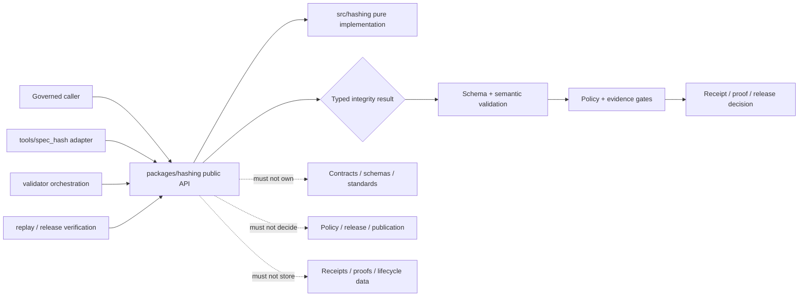

<!-- [KFM_META_BLOCK_V2]
doc_id: kfm://doc/packages-hashing-readme
title: packages/hashing/ — Deterministic Hashing Package, Distribution, and Compatibility Boundary
type: readme
version: v1.1
status: draft
owners: OWNER_TBD — Package steward · Integrity/canonicalization steward · Contract steward · Schema steward · Security steward · Dependency steward · Validation steward · Release steward · Migration steward · CI steward · Docs steward
created: NEEDS VERIFICATION — target existed before the current evidence-grounded revision
updated: 2026-07-15
policy_label: "public-doctrine; package-boundary; deterministic-hashing; implementation-empty; distribution-unratified; api-unratified; canonicalization-conflicted; spec-hash-shape-conflicted; tools-package-ownership-conflicted; supply-chain-aware; no-network; pure-functions; fail-closed; no-authority; no-secrets; migration-required; rollback-aware"
current_path: packages/hashing/README.md
truth_posture: CONFIRMED target README v1, merged source-envelope and import-namespace READMEs v1.1, empty hashing package initializer, kfm-hashing 0.0.0 placeholder metadata, packages root and Directory Rules placement, draft identity/canonicalization doctrine, draft common spec_hash contract and schema, schema fixtures and generic schema test harness, placeholder dedicated validator, README-only tools/spec_hash lane, generated-receipt digest vocabulary, EvidenceBundle checksum vocabulary, and bounded absence of proposed implementation modules, package-specific tests/workflows, and direct import consumers / PROPOSED package metadata contract, dependency and supply-chain controls, minimal public API, source/tool/validator delegation, distribution and versioning rules, typed result families, resource limits, consumer migration, CI gates, correction, deprecation, and rollback / CONFLICTED jcs:sha256 string doctrine versus object-wrapped sha256 schema and contract, packages/hashing versus tools/spec_hash implementation ownership, canonicalization-profile representation, SHA-256 authority baseline versus BLAKE3-permitted provenance/content fields, package name versus unratified import namespace, and documentation richness versus empty implementation / UNKNOWN accepted Python runtime, build backend, dependency set, pinned JCS implementation, package discovery, export surface, consumer inventory beyond bounded search, installability, artifact reproducibility, cross-language parity, package publishing posture, runtime behavior, CI enforcement, deployment use, and operational health / NEEDS VERIFICATION owners, ADR or migration decision, canonical hash vocabulary, schema/contract reconciliation, package ownership, dependency approval, package metadata, source layout, API shape, resource limits, test vectors, consumer migration, CI gates, distribution policy, correction path, compatibility period, deprecation, and rollback automation
evidence_snapshot:
  repository: bartytime4life/Kansas-Frontier-Matrix
  repository_id: "1059091169"
  visibility: public
  base_ref: main
  base_commit: f55fe7937ee122e47b6c274630192504ecde9f8f
  prior_blob: c9440697c02f71a8c83f0293d72364bb89930c01
  source_readme_blob: e54dc45019f0df1761e03abf02bfa909a05621b5
  namespace_readme_blob: 05a1320e395ad3b1e64ff72f16c844a5e43c3441
  package_metadata_blob: 94a3799821298b4e99ea7bc638d8ab3c4bd7eea2
  namespace_initializer_blob: e69de29bb2d1d6434b8b29ae775ad8c2e48c5391
  packages_root_blob: fc18fb3334fefe992a551fe12aa98c812232cd17
  directory_rules_blob: 2affb080e6f0043867c64c7f06c1ca52030fbd55
  identity_architecture_blob: d8b3836bae160ac0f2027407989d383fa016a49b
  canonicalization_standard_blob: 393a4450f64993c26b20d727656a1e6b6494db4e
  spec_hash_contract_blob: 0c2c1161ddb565d4f9f17ef81080b27b8d951937
  spec_hash_schema_blob: 80b496b01b8de8c0e8ba67bf020977e6b1f3c652
  spec_hash_fixture_readme_blob: bc787595d5869c7bd212b0c7909c3eb0b980daf9
  common_contract_test_blob: b04342cc034d7f1cc554e155fdd02d6e972976e6
  spec_hash_validator_blob: de69c6c7001082af29827a4b287a80b7c6a05af3
  tools_spec_hash_readme_blob: 69beb3e00d0c9c59e42348a918da0d11faa82850
  generated_receipt_schema_blob: fba21ed27ebccf1362fe397fe0c3ebd85e072685
  evidence_bundle_schema_blob: cf5256831b63dca46a5f68b168441adcf68b8751
  bounded_path_checks:
    - packages/hashing/README.md existed at version v1 before this revision
    - packages/hashing/src/README.md exists at version v1.1
    - packages/hashing/src/hashing/README.md exists at version v1.1
    - packages/hashing/src/hashing/__init__.py exists and is empty
    - packages/hashing/pyproject.toml contains only project name kfm-hashing and version 0.0.0
    - packages/hashing/package.json was not found
    - packages/hashing/src/hashing.py was not found
    - canonical_json.py, digests.py, spec_hash.py, content_hash.py, geometry_hash.py, merkle.py, run_id.py, compare.py, and fixtures.py were not found under packages/hashing/src/hashing/
    - packages/hashing/tests/README.md and tests/packages/hashing/README.md were not found
    - .github/workflows/hashing.yml, package-hashing.yml, and spec-hash.yml were not found
    - tools/spec_hash/jcs_hash.py and tools/spec_hash/spec_hash.py were not found
    - tools/validators/validate_spec_hash.py raises NotImplementedError
    - bounded code search returned no direct from hashing, import hashing, or kfm-hashing matches
related:
  - src/README.md
  - src/hashing/README.md
  - src/hashing/__init__.py
  - pyproject.toml
  - ../README.md
  - ../../docs/doctrine/directory-rules.md
  - ../../docs/architecture/identity-and-spec-hash.md
  - ../../docs/standards/CANONICALIZATION.md
  - ../../contracts/common/spec_hash.md
  - ../../schemas/contracts/v1/common/spec_hash.schema.json
  - ../../schemas/contracts/v1/evidence/evidence_bundle.schema.json
  - ../../schemas/contracts/v1/receipts/generated_receipt.schema.json
  - ../../fixtures/contracts/v1/common/spec_hash/README.md
  - ../../tests/schemas/test_common_contracts.py
  - ../../tools/validators/validate_spec_hash.py
  - ../../tools/spec_hash/README.md
  - ../../contracts/
  - ../../schemas/
  - ../../policy/
  - ../../data/receipts/
  - ../../data/proofs/
  - ../../release/
tags: [kfm, packages, hashing, deterministic-identity, canonicalization, distribution, packaging, dependencies, supply-chain, jcs, urdna2015, sha256, blake3, spec-hash, content-hash, geometry-hash, artifact-hash, merkle-root, run-id, replay, compatibility, migration, fail-closed]
notes:
  - "This revision changes only packages/hashing/README.md."
  - "The package currently contains documentation, 0.0.0 placeholder metadata, and an empty import initializer; proposed helper modules were not found at the checked paths."
  - "This README does not activate an API, select a canonical spec_hash representation, ratify package/tool implementation ownership, approve dependencies, or authorize package publication."
  - "The current docs and machine contracts disagree about spec_hash representation; package code and distribution adapters must not silently translate between them."
  - "Hash equality is integrity evidence about declared bytes/profile only. It is not truth, evidence closure, policy approval, release approval, or public safety."
[/KFM_META_BLOCK_V2] -->

<a id="top"></a>

# Deterministic Hashing Package, Distribution, and Compatibility Boundary

`packages/hashing/`

> Repository-present package lane for a future reusable deterministic hashing library. Current evidence establishes documentation, `0.0.0` placeholder metadata, and an empty import initializer—not an installable, exported, tested, published, or CI-enforced integrity package.


**Quick links:** [Purpose](#purpose) · [Evidence](#status-and-evidence) · [Placement](#directory-rules-and-authority) · [Responsibilities](#package-responsibilities) · [Conflicts](#compatibility-conflicts) · [Tree](#confirmed-package-tree) · [Invariants](#keystone-invariants) · [Metadata](#package-metadata-and-distribution) · [Dependencies](#dependency-and-supply-chain-boundary) · [API](#public-api-and-versioning) · [Callers](#caller-and-consumer-contract) · [Hashes](#hash-family-boundaries) · [Delegation](#package-source-tool-validator-and-release-delegation) · [Security](#security-and-resource-bounds) · [Testing](#testing-build-and-ci) · [Migration](#compatibility-consumer-migration-and-deprecation) · [Implementation](#smallest-sound-implementation-sequence) · [Done](#definition-of-done) · [Open](#verification-register) · [Rollback](#rollback-correction-and-package-release)

> [!IMPORTANT]
> **This README is not an implementation, API, dependency, distribution, or migration decision.** It does not establish exports, a build backend, a pinned JCS dependency, supported profiles, a canonical `spec_hash` shape, package ownership over `tools/spec_hash/`, CI enforcement, package publication, or operational consumers.

> [!CAUTION]
> **A matching digest is not a truth decision.** It establishes only that declared inputs produce the same digest under the same declared algorithm and canonicalization profile. Schema validity, semantic correctness, provenance, evidence sufficiency, rights, sensitivity, policy, review, release, and public safety remain separate gates.

---

<a id="purpose"></a>

## Purpose

This README defines the package-level boundary for `packages/hashing/`.

A conforming package may eventually provide one reusable, deterministic implementation for governed KFM callers that need:

- canonical byte production under accepted, versioned profiles;
- digest computation over explicit bytes or canonical content;
- digest-reference parsing, formatting, and comparison;
- deterministic file-set roots from explicit entries;
- deterministic run identifiers from explicit run context;
- replay and cross-boundary parity checks;
- stable typed results and reason codes;
- a small, versioned import API that tools and validators can reuse.

The package root additionally owns **package mechanics** once approved:

- package identity and version metadata;
- build backend and source discovery;
- dependency declaration and supply-chain review;
- package-level compatibility policy;
- public export and deprecation rules;
- build, wheel/sdist, isolated-install, import, and test gates;
- consumer inventory and migration support;
- package-distribution rollback.

It must not become:

- a second schema, contract, canonicalization-standard, or policy home;
- a receipt, proof, EvidenceBundle, release, rollback, or lifecycle-data store;
- a source connector, pipeline orchestrator, validator of record, or public service;
- a public API, UI, map, or AI answer surface;
- signing, HMAC, encryption, password-hashing, key-management, or secret-storage authority;
- a compatibility shortcut that silently converts conflicting hash representations;
- an ambient filesystem scanner, network client, or dependency downloader at runtime.

[Back to top](#top)

---

<a id="status-and-evidence"></a>

## Status and evidence

| Surface | Status | Safe conclusion |
|---|---:|---|
| This README | **CONFIRMED v1 before revision** | A package boundary exists. |
| `src/README.md` | **CONFIRMED v1.1** | Source placement and implementation delegation are documented. |
| `src/hashing/README.md` | **CONFIRMED v1.1** | The proposed import namespace has an evidence-grounded compatibility boundary. |
| `src/hashing/__init__.py` | **CONFIRMED empty** | No exports, import behavior, or side effects are established. |
| `pyproject.toml` | **CONFIRMED `kfm-hashing` `0.0.0` placeholder** | No build backend, dependency, source-discovery, Python-version, entry-point, or publishing behavior is established. |
| `package.json` | **NOT FOUND** | No Node/TypeScript package surface is established. |
| Proposed implementation modules | **NOT FOUND at bounded paths** | No canonicalizer, digest, comparison, Merkle, geometry, run-id, or fixture implementation is established. |
| Package-specific tests | **NOT FOUND at checked README paths** | No dedicated hashing-package test boundary is established. |
| Package-specific workflows | **NOT FOUND at checked paths** | No dedicated hashing CI behavior is established. |
| Direct imports or package consumers | **NOT FOUND by bounded search** | No operational consumer is established; search completeness is not guaranteed. |
| Identity architecture | **CONFIRMED draft doctrine** | States JCS + SHA-256 and recompute-on-gate behavior. |
| Canonicalization standard | **CONFIRMED draft standard** | JCS default; URDNA2015 reserved; pinned implementation remains unresolved. |
| Common `spec_hash` contract/schema | **CONFIRMED draft/PROPOSED machine surface** | Requires an object with `value: sha256:<hex>`. |
| `spec_hash` fixtures | **CONFIRMED minimal schema fixtures** | Test shape acceptance/rejection only. |
| Generic contract test harness | **CONFIRMED executable test code** | Discovers and validates JSON Schema fixtures; it does not compute hashes. |
| Dedicated `spec_hash` validator | **CONFIRMED placeholder** | Raises `NotImplementedError`. |
| `tools/spec_hash/` | **CONFIRMED README-only lane at checked executable paths** | Tool-versus-package implementation ownership remains unresolved. |
| Generated-receipt digest fields | **CONFIRMED schema vocabulary** | Permit `sha256:` or `blake3:` for specified provenance/content fields. |
| EvidenceBundle checksums | **CONFIRMED schema vocabulary** | Use `sha256:` checksums and reference the common `spec_hash` object. |

### Truth posture

**CONFIRMED**

- The package has no verified hashing implementation.
- Package metadata is a greenfield `0.0.0` placeholder.
- The source and namespace boundaries are documentation-backed but implementation-empty.
- Repository doctrine and machine contracts disagree about `spec_hash` representation.
- Existing fixtures prove only the current schema wrapper and pattern.
- No checked executable implements RFC 8785 JCS in the package or tool lane.
- The dedicated validator is not implemented.
- No direct package consumer was found in the bounded import search.

**PROPOSED**

- The package metadata contract, dependency rules, public API, distribution controls, package/tool delegation, typed results, resource limits, tests, consumer migration, implementation sequence, correction, deprecation, and rollback procedures below.

**CONFLICTED**

- `jcs:sha256:<hex>` strings in architecture/standards versus `{"value":"sha256:<hex>"}` in the common contract/schema.
- Reusable implementation under `packages/hashing/` versus the proposed `tools/spec_hash/` helper home.
- SHA-256 as the baseline for trust-bearing identity versus BLAKE3 being accepted for some content/provenance fields.
- Canonicalization profile being semantically necessary while the current common schema does not carry one.
- Distribution name `kfm-hashing` versus the unratified import name `hashing`.
- Rich package documentation versus no verified implementation.

**UNKNOWN**

- Supported Python version, build backend, dependency policy, pinned JCS implementation, package discovery, exports, consumers beyond bounded search, performance, cross-language parity, reproducible-build behavior, package publishing posture, release use, and operational health.

**NEEDS VERIFICATION**

- Owners, accepted hash vocabulary, schema/contract reconciliation, implementation ownership, dependency approval, package metadata, API, resource limits, fixtures, package tests, CI, consumer migration, compatibility period, distribution policy, correction, deprecation, and rollback automation.

[Back to top](#top)

---

<a id="directory-rules-and-authority"></a>

## Directory Rules and authority

Directory Rules place reusable shared libraries under `packages/`. That makes `packages/hashing/` a sound **proposed** home for a reusable pure implementation.

The root is selected by responsibility:

```text
packages/hashing/
  package mechanics + reusable library boundary

packages/hashing/src/
  source placement + dependency direction

packages/hashing/src/hashing/
  proposed import namespace + API behavior

tools/spec_hash/
  proposed operator/CLI/report adapter

tools/validators/
  validation orchestration and gate outcomes

contracts/
  semantic meaning

schemas/
  machine shape

docs/standards/
  canonicalization and algorithm profile

policy/
  admissibility and exposure decisions

data/receipts/ + data/proofs/
  trust-bearing records and proof artifacts

release/
  promotion, publication, correction, supersession, and rollback authority
```

This README does not create a new root, compatibility root, schema home, crypto-policy home, receipt family, release lane, or public interface.

> [!WARNING]
> The presence of `packages/hashing/` does not establish that it is already the sole implementation. A package-versus-tool ownership decision requires an ADR or explicit migration record before code is duplicated, moved, deprecated, or treated as canonical.

[Back to top](#top)

---

<a id="package-responsibilities"></a>

## Package responsibilities

| Responsibility | Package posture |
|---|---|
| Package identity | Declare one reviewed distribution name and one reviewed import namespace. |
| Versioning | Version behavior and compatibility; do not use prose dates as API versions. |
| Build | Produce reproducible package artifacts only after build backend and source discovery are accepted. |
| Dependencies | Declare, pin, review, and scan runtime/build/test dependencies. |
| Source delegation | Keep implementation under the accepted source envelope and import namespace. |
| API | Export a minimal, typed, deterministic surface; avoid broad root exports by default. |
| Compatibility | Parse legacy forms only through explicit, versioned adapters with visible provenance. |
| Consumers | Maintain an inventory of imports, versions, migration state, and compatibility obligations. |
| Testing | Prove canonicalization, digest, error, resource, import-safety, build, and parity behavior. |
| Distribution | Do not publish wheels, sdists, containers, or external packages without an approved release path. |
| Documentation | Keep package, source, namespace, API, dependency, migration, and rollback docs aligned. |
| Rollback | Preserve the prior installable version and consumer rollback path before behavioral release. |

A package release is not a KFM data publication. Building or installing a Python package does not authorize a dataset, claim, map layer, EvidenceBundle, or public response.

[Back to top](#top)

---

<a id="compatibility-conflicts"></a>

## Compatibility conflicts

### 1. `spec_hash` representation

Repository doctrine describes:

```text
jcs:sha256:<64 lowercase hex>
urdna2015:sha256:<64 lowercase hex>
```

The current common contract/schema describes:

```json
{
  "value": "sha256:<64 lowercase hex>"
}
```

The package must not silently:

- strip `jcs:` or `urdna2015:`;
- add a wrapper object;
- unwrap an object;
- infer a canonicalization profile;
- relabel a raw checksum as `spec_hash`;
- accept both forms as equivalent without a migration decision.

### 2. Package versus tool ownership

Both `packages/hashing/` and `tools/spec_hash/` describe hashing responsibilities, but neither contains a verified implementation.

A **PROPOSED**, not ratified, split is:

```text
packages/hashing = one pure reusable implementation
tools/spec_hash  = thin CLI/report adapter that imports the package
validators       = gate orchestration that imports the package
```

No code should be duplicated between these homes while ownership is unresolved.

### 3. Algorithm scope

SHA-256 is the stated baseline for trust-bearing identity. Some generated-receipt fields allow BLAKE3 or SHA-256 for field-specific content/provenance hashes.

The package must preserve:

- hash family;
- algorithm;
- canonicalization profile where relevant;
- encoding;
- digest text;
- source representation;
- schema/contract version;
- caller intent.

It must not convert a BLAKE3 content hash into a SHA-256 `spec_hash` or treat all digest strings as interchangeable.

### 4. Distribution and import names

The current metadata names the project `kfm-hashing`; the source tree proposes import namespace `hashing`.

Before distribution, verify:

- collision risk with external packages;
- workspace/install behavior;
- import name;
- distribution name;
- editable-install behavior;
- wheel contents;
- migration implications if either name changes.

[Back to top](#top)

---

<a id="confirmed-package-tree"></a>

## Confirmed package tree

Current bounded evidence supports:

```text
packages/hashing/
├── README.md
├── pyproject.toml
└── src/
    ├── README.md
    └── hashing/
        ├── README.md
        └── __init__.py
```

The initializer is empty. The metadata contains only project name and version.

A future decomposition may include modules such as canonicalization, digests, references, comparisons, Merkle roots, run IDs, and compatibility adapters, but no proposed module name is implementation fact until created, tested, reviewed, and exported intentionally.

[Back to top](#top)

---

<a id="keystone-invariants"></a>

## Keystone invariants

1. **Hash equality is not truth.**
2. **Canonicalization precedes trust-bearing hashing.**
3. **The canonicalization profile must be explicit or governed by an accepted artifact contract.**
4. **A raw byte checksum is not automatically a `spec_hash`.**
5. **Algorithm, profile, encoding, and representation must remain visible.**
6. **Conflicting repository representations must not be silently normalized.**
7. **One reusable implementation should serve package, tool, validator, and replay callers after ownership is resolved.**
8. **Package import must be no-network and side-effect-free.**
9. **No package import may read credentials, lifecycle stores, environment-dependent source data, or model output.**
10. **No helper may write receipts, proofs, release records, signatures, or published artifacts.**
11. **Inputs must be explicit; ambient directory scanning is prohibited by default.**
12. **Mismatches, invalid values, and unsupported profiles fail closed with typed outcomes.**
13. **Resource limits must be explicit for input size, nesting, collection size, and file-set cardinality.**
14. **Dependency behavior must not vary silently across environments.**
15. **Package artifacts must be reproducible enough for digest comparison and review.**
16. **Public exports must be minimal, intentional, typed, and versioned.**
17. **Breaking changes require migration, compatibility, consumer inventory, and rollback plans.**
18. **Tool and validator adapters must not fork canonicalization behavior.**
19. **Fixtures must be synthetic, sanitized, stable, and non-authoritative.**
20. **Package distribution is separate from KFM publication authority.**
21. **Password hashing, HMAC, signatures, encryption, and key management remain outside scope.**
22. **Stored digests must be recomputed at governed verification boundaries.**
23. **Corrections preserve prior identity and migration evidence; they do not rewrite history.**
24. **AI-generated language cannot choose the canonical representation or substitute for test vectors.**

[Back to top](#top)

---

<a id="package-metadata-and-distribution"></a>

## Package metadata and distribution

The current `pyproject.toml` is a placeholder. Before the package can be treated as installable, governance must approve and verify at least:

| Metadata area | Required decision |
|---|---|
| Build system | Backend and pinned build requirements. |
| Python runtime | Supported version range and compatibility policy. |
| Package discovery | Explicit `src/` discovery and wheel contents. |
| Distribution name | Whether `kfm-hashing` is accepted. |
| Import namespace | Whether `hashing` is accepted and collision-safe. |
| Version | Semantic versioning and pre-1.0 compatibility rules. |
| Dependencies | Runtime, optional, build, and test dependency sets. |
| Typing | `py.typed`, stubs, or documented untyped posture. |
| License/rights | Repository and dependency licensing posture. |
| Readme/metadata | Correct package description and source links. |
| Entry points | None by default; CLI entry points belong only after ownership resolution. |
| Publishing | Internal-only, repository-only, private index, or public index decision. |

### Distribution posture

Until those decisions are approved:

- `0.0.0` is scaffold metadata, not a released API;
- no PyPI or external index publication is authorized;
- no package artifact should be treated as a governed release dependency;
- no consumer should pin the package as production infrastructure;
- no compatibility guarantee is implied.

A future package build should be reproducible, isolated, scanned, and traceable to source commit, dependency lock, build environment, tests, and artifact digest.

[Back to top](#top)

---

<a id="dependency-and-supply-chain-boundary"></a>

## Dependency and supply-chain boundary

A canonicalization dependency is trust-significant. Convenience is not enough.

Before adding a runtime dependency, verify:

- exact package and project identity;
- upstream repository and maintainer posture;
- license compatibility;
- supported runtime versions;
- release cadence and maintenance health;
- known vulnerabilities;
- transitive dependencies;
- deterministic behavior and conformance vectors;
- Unicode and numeric behavior;
- platform-specific behavior;
- pure-Python versus native-extension implications;
- offline installation and build behavior;
- dependency pinning and update process;
- rollback to the prior dependency version.

Rules:

1. Prefer the smallest dependency set.
2. Use standard-library digest primitives where they satisfy the accepted contract.
3. Do not implement an approximate JCS canonicalizer as authority.
4. Do not download code, schemas, profiles, or test vectors at runtime.
5. Do not use optional dependency absence to select a different hash silently.
6. Do not permit dependency version drift to change canonical bytes without a failing test.
7. Record dependency and profile changes as compatibility-significant.
8. Require supply-chain and license review before package distribution.
9. Keep secrets and private content out of build logs, test fixtures, and failure messages.
10. Produce an SBOM or equivalent dependency inventory when package maturity justifies distribution.

[Back to top](#top)

---

<a id="public-api-and-versioning"></a>

## Public API and versioning

The public API is **PROPOSED** and unratified.

A future API should expose behavior categories, not authority:

- canonicalize under an explicit accepted profile;
- hash exact bytes;
- format and parse declared digest references;
- compare expected and recomputed values;
- compute deterministic file-set roots from explicit entries;
- compute deterministic run IDs from explicit context;
- return typed results and stable reason codes.

API rules:

- root-level exports must be intentional and minimal;
- wildcard exports are prohibited;
- internal helpers stay internal;
- result types carry algorithm/profile/representation context;
- exceptions and finite outcomes have documented boundaries;
- compatibility adapters are visibly named and versioned;
- deprecated exports warn or fail according to an approved schedule;
- output types do not imply policy, evidence, or release decisions;
- package version changes reflect behavior and representation changes;
- cross-language implementations must share accepted vectors.

The package must not expose `approve_release`, `publish`, `trust_if_match`, `write_receipt`, `store_evidence`, `sign_record`, `manage_keys`, or equivalent authority-shaped functions.

[Back to top](#top)

---

<a id="caller-and-consumer-contract"></a>

## Caller and consumer contract

Callers must provide explicit context.

| Caller input | Required posture |
|---|---|
| Bytes | Exact immutable bytes and declared algorithm. |
| JSON-like value | Accepted canonicalization profile and artifact contract. |
| Stored digest | Exact representation, algorithm/profile, and schema version. |
| Geometry | Already normalized geometry plus CRS and precision profile. |
| File set | Explicit ordered entries; no ambient directory walk. |
| Run context | Explicit fields and ordering rules; no unrecorded randomness. |
| Limits | Maximum input size, nesting, entries, and output behavior. |
| Migration mode | Explicit source and target representations plus receipt/audit context. |

Callers retain responsibility for:

- schema validation;
- semantic contract compliance;
- source authority;
- rights and sensitivity;
- policy decisions;
- evidence sufficiency;
- receipt and proof persistence;
- release and rollback decisions;
- public API and UI behavior.

The package returns integrity results. It does not decide what those results authorize.

### Consumer inventory

Before the first behavioral release, maintain an inspectable consumer register containing:

- repository path or external consumer identity;
- package version;
- imported exports;
- hash families used;
- representation/profile expected;
- compatibility adapter used;
- migration owner;
- test coverage;
- rollback version.

No consumer was established by the bounded import search in this update.

[Back to top](#top)

---

<a id="hash-family-boundaries"></a>

## Hash-family boundaries

| Family | Package helper role | Must preserve | Must not claim |
|---|---|---|---|
| `spec_hash` | Canonicalize an accepted trust-bearing body and compute/compare its declared identity. | Profile, algorithm, representation, schema/contract version, exclusions. | Correctness, authority, evidence closure, release. |
| `content_hash` | Hash exact bytes or explicitly canonicalized content. | Algorithm, encoding, byte identity. | Semantic equivalence or admissibility. |
| `geometry_hash` | Hash caller-normalized geometry. | CRS, precision, normalization profile. | Spatial correctness or publication safety. |
| `style_hash` | Hash supplied style and dependency references under an accepted profile. | Dependency set and representation. | Renderer approval or visual correctness. |
| `artifact_hash` | Hash exact artifact bytes. | Algorithm, size, byte identity. | Artifact validity, rights, or release. |
| `merkle_root` | Compute a root from explicit ordered entries. | Entry paths/ids, child digests, ordering/profile. | File-set completeness unless caller proves inventory. |
| `run_id` | Derive deterministic identity from explicit run context. | Field set, ordering, versions, seed/time policy. | Run success, receipt authority, reproducibility by itself. |

Out of scope:

- password hashes;
- credential derivation;
- HMAC or MAC services;
- digital signatures;
- encryption;
- key generation, storage, rotation, or custody;
- transparency-log authority;
- secret comparison APIs.

[Back to top](#top)

---

<a id="package-source-tool-validator-and-release-delegation"></a>

## Package, source, tool, validator, and release delegation



This delegation is **PROPOSED** until ownership is resolved.

Required principle: tool, validator, replay, and release callers should delegate to one accepted implementation instead of maintaining separate canonicalizers or digest parsers.

[Back to top](#top)

---

<a id="security-and-resource-bounds"></a>

## Security and resource bounds

Even a pure hashing package can become an availability or disclosure risk.

A future implementation must bound:

- maximum input bytes;
- maximum JSON nesting;
- maximum object members and array elements;
- maximum string length;
- maximum file-set entries;
- maximum path/reference length;
- recursion depth;
- canonicalization output size;
- processing time where enforceable by caller;
- diagnostic size.

It must reject or explicitly handle:

- duplicate JSON object keys before semantic canonicalization;
- non-finite numbers;
- unsupported numeric representations;
- invalid Unicode or encoding;
- malformed digest references;
- unsupported algorithms or profiles;
- mismatched wrapper/profile combinations;
- dependency absence;
- oversized inputs;
- ambiguous file-set ordering;
- path traversal in logical file-set identifiers;
- inconsistent digest case or length.

Logging must not include full sensitive payloads, credentials, private source records, unrestricted locations, or model prompts. Diagnostics should use bounded references, sizes, algorithms, profiles, outcomes, and reason codes.

Importing the package must not:

- make network calls;
- read environment secrets;
- read lifecycle stores;
- write files;
- mutate global process state;
- register hidden plugins;
- execute caller data;
- emit telemetry.

[Back to top](#top)

---

<a id="testing-build-and-ci"></a>

## Testing, build, and CI

Existing common-contract tests validate JSON Schema fixtures. They do **not** prove hashing behavior.

A package test program must include:

| Test group | Required evidence |
|---|---|
| Import safety | Import has no network, file, secret, telemetry, or global-state side effects. |
| Build | Isolated wheel and sdist builds succeed from declared metadata. |
| Install | Wheel installs in a clean environment and exposes only intended modules. |
| Artifact reproducibility | Equivalent builds are compared under a documented reproducibility posture. |
| RFC 8785 | Official or accepted JCS vectors, including numeric and Unicode edges. |
| URDNA2015 | Only if the profile is accepted; use authoritative vectors and explicit dependency. |
| Raw bytes | Exact byte hashing and encoding boundaries. |
| Digest references | Valid, invalid, unsupported, wrong-case, wrong-length, and conflicting wrappers. |
| Comparison | Match, mismatch, invalid, unsupported profile/algorithm, and drift. |
| Duplicate keys | Rejected before ambiguous canonicalization. |
| Resources | Oversize, nesting, member count, string length, and file-set limits. |
| Merkle | Ordering, duplicate entry IDs, missing child digests, and deterministic root. |
| Run ID | Explicit field set, ordering, version, seed, and time policy. |
| Compatibility | Legacy and target representations remain distinct and auditable. |
| Cross-language parity | Same accepted vectors produce identical canonical bytes and digests. |
| Dependency drift | Dependency updates cannot alter vectors silently. |
| Consumer contract | Known consumers test their expected exports and representations. |
| Negative authority | No helper returns policy, evidence, or release decisions. |

Before a version above the scaffold state is consumed, CI should:

1. validate metadata;
2. build sdist and wheel in isolation;
3. inspect artifact contents;
4. install the wheel in a clean environment;
5. run import-safety and package tests;
6. run accepted conformance vectors;
7. run dependency, license, and vulnerability checks;
8. run type/lint checks where adopted;
9. verify no-network behavior;
10. produce traceable build/test results.

A green documentation, schema, or generic repository workflow does not prove RFC 8785 behavior, package installability, or API compatibility.

[Back to top](#top)

---

<a id="compatibility-consumer-migration-and-deprecation"></a>

## Compatibility, consumer migration, and deprecation

Any change to these surfaces is compatibility-significant:

- canonicalization profile;
- digest algorithm;
- digest representation;
- wrapper shape;
- field inclusion/exclusion;
- Unicode or numeric behavior;
- error/outcome type;
- resource limit;
- import namespace;
- export name;
- package/distribution name;
- dependency that affects canonical bytes;
- Merkle ordering;
- run-ID field set.

A governed migration should:

1. inventory current producers and consumers;
2. identify source and target representations;
3. add accepted vectors for both;
4. provide an explicit adapter where justified;
5. preserve original value and representation;
6. record conversion reason, tool version, and result;
7. run dual verification during a bounded compatibility period;
8. prohibit adapter output from claiming stronger authority;
9. publish deprecation timing and owner;
10. preserve rollback to the prior package version;
11. remove the adapter only after consumer evidence confirms migration.

Documentation must not rename, delete, or deprecate `tools/spec_hash/`, the `hashing` namespace, or any representation by implication.

[Back to top](#top)

---

<a id="smallest-sound-implementation-sequence"></a>

## Smallest sound implementation sequence

### Stage 0 — governance decisions

Resolve or explicitly defer:

- canonical `spec_hash` representation;
- canonicalization profile vocabulary;
- package versus tool ownership;
- distribution and import names;
- runtime and dependency policy;
- public/internal publishing posture.

**Stop** if code would have to guess.

### Stage 1 — package metadata

Add reviewed build metadata, runtime range, source discovery, dependency groups, license fields, and non-publishing default.

**Stop** if the wheel contents or import name are ambiguous.

### Stage 2 — conformance fixtures

Commit accepted canonical bytes and digest vectors, including negative numeric, Unicode, duplicate-key, and representation cases.

**Stop** if fixtures encode conflicting contracts without labels.

### Stage 3 — minimal pure core

Implement only:

- accepted canonicalization profile(s);
- exact byte hashing;
- digest-reference value types;
- typed comparison outcomes;
- explicit limits.

Keep `__init__.py` exports minimal.

### Stage 4 — package tests

Prove import safety, deterministic behavior, negative states, resource bounds, build/install behavior, and cross-environment parity.

### Stage 5 — adapters

Add explicit compatibility adapters only after migration approval. Never place silent conversion in normal parsing.

### Stage 6 — tool and validator delegation

Make the CLI/report lane and validator import the package. Remove or prohibit duplicate implementations through tests and documentation.

### Stage 7 — consumer pilots

Migrate one bounded non-public consumer, capture parity evidence, and retain rollback.

### Stage 8 — CI and controlled package release

Add package gates, reproducible artifact evidence, dependency review, versioning, and an approved internal or external distribution path.

### Stage 9 — broader adoption

Expand consumers only after compatibility, performance, resource, security, and rollback evidence is reviewed.

[Back to top](#top)

---

<a id="definition-of-done"></a>

## Definition of done

The package is not implementation-complete until all applicable items are satisfied:

- [ ] Owners and review duties are assigned.
- [ ] Package/tool ownership is decided by ADR or migration record.
- [ ] `spec_hash` representation and canonicalization profile are reconciled across doctrine, contract, schema, fixtures, validators, and consumers.
- [ ] Distribution and import names are approved and collision-checked.
- [ ] Runtime versions, build backend, source discovery, dependencies, and publishing posture are declared.
- [ ] A pinned, reviewed canonicalization implementation is selected.
- [ ] Accepted conformance vectors are committed.
- [ ] Public exports are minimal, typed, documented, and versioned.
- [ ] Import is no-network and side-effect-free.
- [ ] Inputs, limits, errors, and reason codes are explicit.
- [ ] Package, tool, validator, replay, and release callers delegate to one implementation.
- [ ] Package-specific tests cover positive, negative, edge, and resource cases.
- [ ] Wheel and sdist build and install in clean environments.
- [ ] Dependency, license, vulnerability, and artifact-content checks pass.
- [ ] Cross-language parity is proved where multiple implementations exist.
- [ ] Consumer inventory and migration state are maintained.
- [ ] No helper creates policy, evidence, release, signing, or publication authority.
- [ ] Correction, deprecation, package rollback, and consumer rollback procedures are tested.
- [ ] Documentation matches actual metadata, code, tests, CI, and distribution state.

[Back to top](#top)

---

<a id="verification-register"></a>

## Verification register

| ID | Verification item | Current state |
|---|---|---|
| HASH-PKG-001 | Confirm owners and CODEOWNERS coverage. | NEEDS VERIFICATION |
| HASH-PKG-002 | Decide package versus tool implementation ownership. | CONFLICTED |
| HASH-PKG-003 | Reconcile `jcs:sha256:` and object-wrapped `sha256:` forms. | CONFLICTED |
| HASH-PKG-004 | Decide canonicalization-profile representation. | CONFLICTED |
| HASH-PKG-005 | Define SHA-256 versus BLAKE3 family boundaries. | NEEDS VERIFICATION |
| HASH-PKG-006 | Confirm distribution name `kfm-hashing`. | NEEDS VERIFICATION |
| HASH-PKG-007 | Confirm import namespace `hashing`. | NEEDS VERIFICATION |
| HASH-PKG-008 | Check external package-name collisions. | NEEDS VERIFICATION |
| HASH-PKG-009 | Select Python runtime range. | UNKNOWN |
| HASH-PKG-010 | Select build backend. | UNKNOWN |
| HASH-PKG-011 | Configure source discovery. | NEEDS VERIFICATION |
| HASH-PKG-012 | Approve runtime dependencies. | NEEDS VERIFICATION |
| HASH-PKG-013 | Approve build/test dependency groups. | NEEDS VERIFICATION |
| HASH-PKG-014 | Select pinned JCS implementation. | UNKNOWN |
| HASH-PKG-015 | Decide whether URDNA2015 support belongs here. | NEEDS VERIFICATION |
| HASH-PKG-016 | Define package public API. | PROPOSED |
| HASH-PKG-017 | Define stable result and reason-code types. | PROPOSED |
| HASH-PKG-018 | Define duplicate-key behavior. | NEEDS VERIFICATION |
| HASH-PKG-019 | Define numeric and Unicode behavior from accepted standard. | NEEDS VERIFICATION |
| HASH-PKG-020 | Define input and resource limits. | PROPOSED |
| HASH-PKG-021 | Add accepted JCS vectors. | NOT IMPLEMENTED |
| HASH-PKG-022 | Add raw-byte digest vectors. | NOT IMPLEMENTED |
| HASH-PKG-023 | Add representation-conflict fixtures. | NOT IMPLEMENTED |
| HASH-PKG-024 | Add package-specific tests. | NOT IMPLEMENTED |
| HASH-PKG-025 | Add import-safety tests. | NOT IMPLEMENTED |
| HASH-PKG-026 | Add isolated build/install tests. | NOT IMPLEMENTED |
| HASH-PKG-027 | Add artifact-content inspection. | NOT IMPLEMENTED |
| HASH-PKG-028 | Add reproducible-build posture. | UNKNOWN |
| HASH-PKG-029 | Add dependency/license/vulnerability gates. | NOT IMPLEMENTED |
| HASH-PKG-030 | Add cross-language parity tests where applicable. | NOT IMPLEMENTED |
| HASH-PKG-031 | Implement dedicated `spec_hash` validator. | PLACEHOLDER |
| HASH-PKG-032 | Implement thin `tools/spec_hash` adapter. | NOT IMPLEMENTED |
| HASH-PKG-033 | Prove tool and validator delegate to package. | NOT IMPLEMENTED |
| HASH-PKG-034 | Inventory direct and indirect consumers. | NEEDS VERIFICATION |
| HASH-PKG-035 | Define versioning and compatibility policy. | PROPOSED |
| HASH-PKG-036 | Define package publishing posture. | UNKNOWN |
| HASH-PKG-037 | Define compatibility-adapter approval. | PROPOSED |
| HASH-PKG-038 | Define consumer migration receipt/audit fields. | PROPOSED |
| HASH-PKG-039 | Define deprecation schedule and owner. | PROPOSED |
| HASH-PKG-040 | Define package artifact retention. | NEEDS VERIFICATION |
| HASH-PKG-041 | Define package rollback procedure. | PROPOSED |
| HASH-PKG-042 | Define consumer rollback procedure. | PROPOSED |
| HASH-PKG-043 | Confirm no network/filesystem/secret side effects. | NEEDS VERIFICATION |
| HASH-PKG-044 | Confirm no authority-shaped exports. | NEEDS VERIFICATION |
| HASH-PKG-045 | Confirm package docs match implementation. | NEEDS VERIFICATION |
| HASH-PKG-046 | Establish CI gate and ownership. | NOT IMPLEMENTED |
| HASH-PKG-047 | Establish operational health or explicitly mark not deployed. | UNKNOWN |
| HASH-PKG-048 | Decide when `0.0.0` may advance. | NEEDS VERIFICATION |

[Back to top](#top)

---

<a id="rollback-correction-and-package-release"></a>

## Rollback, correction, and package release

### Documentation-only rollback

For this revision, rollback means restoring the prior README blob. No package behavior changes.

### Future behavioral rollback

Before a behavioral package release:

- preserve the prior source commit, package artifact, lock/dependency set, and test results;
- record affected consumers and imported exports;
- retain accepted vectors for both versions;
- verify consumers can pin or reinstall the prior version;
- define how tools and validators select the rollback version;
- ensure rollback does not silently reinterpret stored hashes.

### Correction

A correction must preserve:

- original digest value and representation;
- corrected value and representation;
- canonicalization profile;
- algorithm;
- source artifact reference;
- tool/package version;
- reason;
- affected consumers;
- review state;
- migration and rollback references.

Do not overwrite old hashes in place and present the new value as historical truth.

### Package release versus KFM publication

A Python package release is a software distribution event. It does not:

- promote lifecycle data;
- validate EvidenceBundles;
- approve policy;
- publish claims;
- authorize maps or APIs;
- close a correction;
- establish source authority.

Those remain governed by their respective KFM roots and records.

### Rollback triggers

Rollback or deny release if the package:

- silently changes canonical bytes or digest representation;
- diverges from accepted vectors;
- permits dependency drift to alter results;
- introduces network, file, secret, telemetry, or global-state side effects;
- treats hash equality as truth, evidence, policy, or release approval;
- duplicates tool/validator implementations;
- emits authority-shaped results;
- breaks consumers without migration and rollback;
- publishes externally without approval;
- leaks sensitive inputs in logs or fixtures.

[Back to top](#top)

---

## Maintainer summary

`packages/hashing/` is the correct responsibility root for a future reusable deterministic hashing library, but current evidence supports only a scaffold: documentation, `0.0.0` placeholder metadata, and an empty initializer.

The next smallest sound change is **not** to add arbitrary helper modules. It is to resolve the `spec_hash` representation and package/tool ownership conflicts, approve package metadata and a pinned canonicalization implementation, then add conformance vectors before executable behavior.
