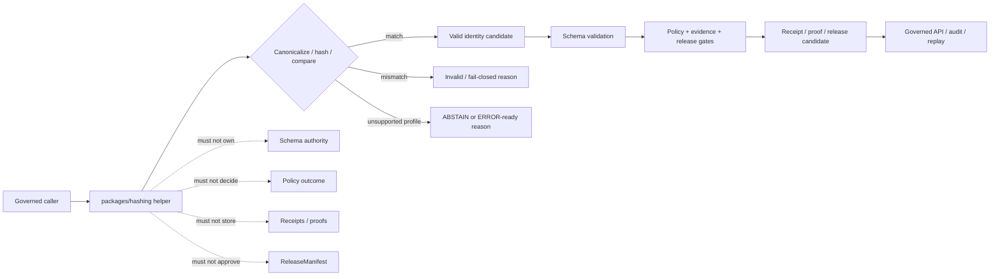

<!-- [KFM_META_BLOCK_V2]
doc_id: kfm://doc/NEEDS-VERIFICATION/packages-hashing-readme
title: Hashing Package README
type: readme
version: v1
status: draft
owners: OWNER_TBD
created: NEEDS VERIFICATION — target file existed before this revision as a short stub
updated: 2026-06-14
policy_label: public
related: [packages/README.md, docs/doctrine/directory-rules.md, docs/architecture/identity-and-spec-hash.md, docs/architecture/evidence-identity.md, docs/architecture/contract-schema-policy-split.md, docs/standards/PROV.md, contracts/, schemas/contracts/v1/, policy/, data/receipts/, data/proofs/, release/]
tags: [kfm, packages, hashing, deterministic-identity, spec-hash, content-hash, run-id, sha256, jcs, receipts, replay]
notes: ["README-like package entrypoint for deterministic hash and identity helper code.", "This package may contain reusable canonicalization, digest, spec_hash, content_hash, geometry_hash, artifact_hash, merkle_root, and run_id helpers; it must not become a schema home, contract home, policy home, receipt store, proof store, lifecycle-data home, release authority, source registry, API route, UI surface, or AI truth source.", "Implementation files, package metadata, import namespace, tests, CI workflows, and runtime bindings remain NEEDS VERIFICATION until recursively inspected."]
[/KFM_META_BLOCK_V2] -->

<a id="top"></a>

# Hashing Package

Shared helper-code package for deterministic KFM identity primitives: canonical bytes, SHA-256 digests, `spec_hash`, `content_hash`, `geometry_hash`, `artifact_hash`, `merkle_root`, `run_id`, replay comparison helpers, and receipt-ready hash metadata.

<p>
  
  
  
  
  
  
</p>

> [!IMPORTANT]
> **Status:** PROPOSED package README  
> **Path:** `packages/hashing/README.md`  
> **Owning responsibility root:** `packages/` — shared reusable implementation libraries  
> **Package purpose:** deterministic canonicalization and hash helper code  
> **Architecture basis:** `docs/architecture/identity-and-spec-hash.md`  
> **Schema authority:** `schemas/contracts/v1/`, not this package  
> **Contract authority:** `contracts/`, not this package  
> **Receipt/proof authority:** `data/receipts/` and `data/proofs/`, not this package  
> **Release authority:** `release/`, not this package  
> **Repo implementation depth:** UNKNOWN for package metadata, import style, source files, tests, CI workflows, API bindings, emitted receipts, proof packs, release manifests, branch protections, and runtime behavior.

## Quick links

- [Scope](#scope)
- [Repo fit](#repo-fit)
- [Accepted inputs](#accepted-inputs)
- [Exclusions](#exclusions)
- [Hash family responsibilities](#hash-family-responsibilities)
- [Deterministic identity rules](#deterministic-identity-rules)
- [Trust-boundary flow](#trust-boundary-flow)
- [Expected package layout](#expected-package-layout)
- [Development rules](#development-rules)
- [Validation checklist](#validation-checklist)
- [Rollback](#rollback)
- [Evidence boundary](#evidence-boundary)

---

## Scope

`packages/hashing/` is the shared implementation package lane for deterministic identity and digest helper code used by KFM packages, validators, pipelines, receipts, proofs, release gates, replay tools, and governed APIs.

This package may contain deterministic utilities for:

- RFC 8785-style JSON canonicalization adapters when the project standard is pinned;
- canonical byte production for supported record families;
- SHA-256 digest helpers with explicit algorithm prefixes;
- `spec_hash` construction and comparison helpers;
- `content_hash` construction for byte payloads and canonical JSON bodies;
- `geometry_hash` support when supplied with normalized geometry, CRS, and precision rules;
- `style_hash`, `artifact_hash`, and file-set `merkle_root` helper functions;
- deterministic `run_id` helpers based on explicit inputs, not ambient runtime state;
- replay comparison helpers that recompute and compare stored digests;
- synthetic fixtures for valid and invalid hash cases.

This package must not decide what a record means, what shape a record must have, whether a record is policy-safe, whether evidence is sufficient, whether a receipt is authoritative, or whether a release may publish. It computes and compares identity primitives for systems that own those decisions.

```text
RAW -> WORK / QUARANTINE -> PROCESSED -> CATALOG / TRIPLET -> PUBLISHED
```

Hashing helper code may support validation and promotion gates across that lifecycle. It does not own lifecycle state, proof state, receipt state, review state, release state, or public truth.

[⬆ Back to top](#top)

---

## Repo fit

```text
packages/hashing/
```

This path is appropriate for reusable hashing implementation code because `packages/` is the responsibility root for shared libraries used by apps, workers, pipelines, and tools.

| Relationship | Expected home | Boundary rule |
| --- | --- | --- |
| Shared hash helper code | `packages/hashing/` | Canonicalization, digest, comparison, replay, and fixture helpers only. |
| Identity architecture | `docs/architecture/identity-and-spec-hash.md` | Explains KFM identity and hash-family doctrine. |
| Evidence identity docs | `docs/architecture/evidence-identity.md` | Explains EvidenceRef/EvidenceBundle identity and spec-hash posture. |
| Semantic contracts | `contracts/` | Defines object meaning; package code references, not redefines. |
| Machine schemas | `schemas/contracts/v1/` | Defines machine-checkable shape and field requirements. |
| Policy rules | `policy/` | Owns allow/deny/restrict/hold/abstain decisions. |
| Receipts and proofs | `data/receipts/`, `data/proofs/` | Stores hash-bearing trust artifacts and validation results. |
| Release decisions | `release/` | Owns promotion, publication, correction, supersession, rollback, and merkle-root use. |
| Tools and CLIs | `tools/` or repo-confirmed tool roots | May wrap this package; must not move package authority into scripts. |
| Public API and UI | `apps/`, `ui/`, `web/`, or repo-confirmed equivalents | May call validators using hash helpers; must not expose package internals as trust authority. |
| Tests and fixtures | `tests/packages/hashing/`, `fixtures/packages/hashing/`, or repo-confirmed equivalents | Proves deterministic behavior with stable fixtures. |

> [!WARNING]
> Do not use `packages/hashing/` as a storage location for receipts, proofs, release manifests, source records, schemas, policies, or generated outputs. Hash helpers compute identity; they do not store authority.

[⬆ Back to top](#top)

---

## Accepted inputs

Package helpers should accept explicit, inspectable values from governed callers. They should not fetch missing facts from source systems, raw stores, UI state, hidden globals, operator memory, or generated language.

| Input family | Accepted examples | Required handling |
| --- | --- | --- |
| Canonicalization context | canonicalization method, schema version, profile name, stable exclusion list | Require explicit method; do not infer a stronger identity profile. |
| JSON-like record body | receipt body, EvidenceBundle body, schema body, contract metadata, manifest body | Canonicalize according to pinned rules before hashing. |
| Byte payload | file bytes, artifact bytes, report bytes, tile artifact bytes | Hash bytes exactly as supplied; preserve algorithm prefix. |
| Geometry context | normalized geometry, CRS, precision rules, geometry profile id | Hash only after caller supplies normalization context. |
| File-set context | ordered file entries, path refs, byte digests, manifest refs | Build merkle candidates deterministically; do not scan ambient folders. |
| Run context | tool id, version, inputs, config, seed, timestamp policy, prior run refs | Produce run ids only from explicit fields; avoid ambient randomness unless recorded. |
| Comparison context | stored digest, recomputed digest, algorithm, canonicalization profile | Return match/mismatch/invalid state with reason. |
| Fixture context | synthetic records, expected canonical bytes, expected digests | Keep fixtures deterministic and public-safe. |

[⬆ Back to top](#top)

---

## Exclusions

| Do not put here | Correct home or owner | Reason |
| --- | --- | --- |
| JSON Schemas | `schemas/contracts/v1/` | Schemas own machine shape. |
| Semantic contracts | `contracts/` | Contracts own meaning. |
| Policy rules | `policy/` | Policy owns decisions and obligations. |
| Receipts, proof packs, validation reports | `data/receipts/`, `data/proofs/` | Trust artifacts must remain separately auditable. |
| Release manifests, rollback cards, correction notices | `release/` | Publication is a governed state transition. |
| RAW, WORK, QUARANTINE, PROCESSED, CATALOG, TRIPLET, or PUBLISHED data | `data/<phase>/` | Lifecycle state must remain phase-visible. |
| Source descriptors and source registries | `data/registry/` or repo-confirmed registry homes | Source authority, rights, and cadence are governance data. |
| Artifact files, tiles, reports, exports, snapshots | Lifecycle/release artifact homes | Hash package may hash them; it must not store them. |
| Signature keys, signing authority, transparency logs | security/key-management and release/proof homes | Hashing is not signing or attestation authority. |
| API routes or public serializers | `apps/` or repo-confirmed API app | Public clients must use governed APIs. |
| UI components or map rendering | `apps/`, `ui/`, `web/`, `packages/maplibre-runtime/`, or repo-confirmed UI roots | Rendering is downstream from governed hash-bearing objects. |
| AI-generated truth or generated citations | governed AI runtime + receipts + evidence validation | AI output is interpretive and evidence-subordinate. |
| Secrets or private raw source content in fixtures | Nowhere in package fixtures | Fixtures must remain synthetic or public-safe. |

[⬆ Back to top](#top)

---

## Hash family responsibilities

| Hash family | Package helper role | Authority limit |
| --- | --- | --- |
| `spec_hash` | Canonicalize supported record body and compute `jcs:sha256:<hex>`. | Does not define record schema or meaning. |
| `content_hash` | Hash bytes or canonical JSON bodies. | Does not make content trusted or admissible. |
| `geometry_hash` | Hash normalized geometry when CRS and precision profile are supplied. | Does not normalize sensitive geometry or decide public safety. |
| `style_hash` | Hash style JSON and dependent resource refs where supplied. | Does not approve style release or renderer behavior. |
| `artifact_hash` | Hash PMTiles, COG, GeoParquet, report, export, or sidecar bytes supplied by caller. | Does not store or publish artifacts. |
| `merkle_root` | Compute deterministic file-set root from explicit entries. | Does not approve release or rollback. |
| `run_id` | Compute deterministic run identity from explicit run context. | Does not create receipt authority or runtime truth. |

[⬆ Back to top](#top)

---

## Deterministic identity rules

1. Identity is computed from canonical content, not assigned by file path or prose label.
2. JSON trust records should use a pinned canonicalization profile before SHA-256.
3. Store digest strings with explicit algorithm/profile prefixes such as `jcs:sha256:<hex>`.
4. Hash developer-formatted JSON only as raw content, never as `spec_hash` authority.
5. Exclude signatures, storage paths, retrieval timestamps, and post-hoc attestations from canonical bodies unless the governing schema says otherwise.
6. Recompute and compare hashes at promotion, replay, resolver, and runtime validation boundaries.
7. Mismatch must fail closed with a typed invalid state, not warning-only prose.
8. Do not silently change canonicalization profiles; profile changes are migration/ADR-class.
9. Do not adopt new cryptographic algorithms for authority fields without policy and ADR review.
10. Keep fixtures stable enough that a hash drift is visible in tests.

[⬆ Back to top](#top)

---

## Trust-boundary flow



[⬆ Back to top](#top)

---

## Expected package layout

> [!NOTE]
> The tree below is PROPOSED. Confirm package metadata, language conventions, import namespace, test layout, and CI before committing code beyond README files.

```text
packages/hashing/
├── README.md                       # This file: package boundary and trust rules
├── pyproject.toml / package.json    # NEEDS VERIFICATION
├── src/                             # NEEDS VERIFICATION
│   └── hashing/                     # PROPOSED namespace; confirm against repo convention
│       ├── README.md                # PROPOSED namespace guide
│       ├── __init__.py              # PROPOSED export boundary if Python convention is confirmed
│       ├── canonical_json.py        # PROPOSED JCS/profile helpers
│       ├── digests.py               # PROPOSED SHA-256 and algorithm-prefix helpers
│       ├── spec_hash.py             # PROPOSED spec_hash helpers
│       ├── content_hash.py          # PROPOSED content-hash helpers
│       ├── geometry_hash.py         # PROPOSED geometry-hash helpers
│       ├── merkle.py                # PROPOSED file-set root helpers
│       ├── run_id.py                # PROPOSED deterministic run id helpers
│       ├── compare.py               # PROPOSED recompute/compare helpers
│       ├── fixtures.py              # PROPOSED synthetic fixtures
│       └── py.typed                 # PROPOSED if typed Python package convention is confirmed
└── CHANGELOG.md                     # OPTIONAL / NEEDS VERIFICATION
```

Potential imports, subject to package verification:

```python
from hashing.spec_hash import compute_spec_hash
from hashing.content_hash import compute_content_hash
from hashing.compare import compare_digest_values
```

[⬆ Back to top](#top)

---

## Development rules

1. Treat this package as a deterministic helper layer, not an authority layer.
2. Prefer pure functions with explicit inputs and outputs.
3. Preserve algorithm prefix, canonicalization profile, schema version, and exclusion rules supplied by callers.
4. Never infer missing schema, policy, evidence, release, or receipt authority from a hash match.
5. Do not make network calls from this package.
6. Do not read directly from RAW, WORK, QUARANTINE, unpublished candidates, source systems, source credentials, canonical stores, or model runtimes.
7. Do not write lifecycle data, receipts, proofs, release manifests, catalog records, API responses, or UI components.
8. Do not sign records, manage keys, or claim attestation authority.
9. Do not create schemas, contracts, policy rules, source registries, API routes, public answers, or release decisions from this package.
10. Do not store chain-of-thought, raw provider payloads, secrets, private source records, or unrestricted sensitive context.
11. Return typed invalid states instead of silent canonicalization changes, algorithm fallback, or mismatch warnings.
12. Add deterministic tests for every behavior-changing helper and every negative path.
13. Keep fixtures synthetic, sanitized, and stable.
14. Preserve rollback and correction metadata supplied by callers when hash output can affect downstream publication candidates.

[⬆ Back to top](#top)

---

## Validation checklist

- [ ] Confirm `packages/hashing/` package metadata and language/runtime convention.
- [ ] Confirm import namespace and whether it conflicts with external package names.
- [ ] Confirm owners and CODEOWNERS path coverage.
- [ ] Confirm canonicalization profile and whether RFC 8785 JCS is implemented directly or through a dependency.
- [ ] Confirm schema homes for records that carry `spec_hash`, `content_hash`, `geometry_hash`, `artifact_hash`, `merkle_root`, and `run_id`.
- [ ] Confirm tests for canonical key ordering, whitespace removal, number handling, string escaping, digest prefix validation, mismatch failure, unsupported algorithms, and stable fixtures.
- [ ] Confirm helpers do not access lifecycle stores or unpublished candidate stores.
- [ ] Confirm helpers do not write receipts, proofs, release manifests, catalog records, API responses, signatures, or transparency logs.
- [ ] Confirm promotion/replay validators recompute hashes rather than trusting stored values.

Suggested inspection commands:

```bash
find packages/hashing -maxdepth 5 -type f | sort
git grep -n "spec_hash\|content_hash\|geometry_hash\|artifact_hash\|merkle_root\|run_id\|jcs:sha256\|canonical" -- packages docs contracts schemas policy tests fixtures tools apps 2>/dev/null || true
git grep -n "from hashing\|import hashing\|packages/hashing" -- . 2>/dev/null || true
```

[⬆ Back to top](#top)

---

## Rollback

Rollback is required if this package:

- becomes a parallel schema, contract, policy, source-registry, lifecycle-data, evidence/proof, receipt, release, API, UI, signing, key-management, or source-data authority;
- hashes non-canonical developer-formatted JSON as `spec_hash` authority;
- silently changes canonicalization profiles, algorithm prefixes, exclusion rules, or mismatch handling;
- treats hash match as proof of truth, admissibility, release, or public safety;
- stores secrets, private source records, or unrestricted sensitive context in package fixtures;
- permits promotion, replay, or runtime gates to trust stored digests without recomputation.

Rollback target: revert the package README or hashing-source PR, preserve audit notes, and file any authority drift in `docs/registers/DRIFT_REGISTER.md` or the repo-confirmed drift register.

[⬆ Back to top](#top)

---

## Evidence boundary

| Source | Status | Supports | Limits |
| --- | --- | --- | --- |
| Current target file | CONFIRMED | `packages/hashing/README.md` existed as a short stub naming deterministic `spec_hash`, `run_id`, and content-hash families. | Stub did not prove package implementation maturity. |
| `packages/README.md` | CONFIRMED repo doc | `packages/` is for shared libraries used by apps, workers, pipelines, and tools. | Does not define hashing package behavior. |
| `docs/architecture/identity-and-spec-hash.md` | CONFIRMED repo doc | KFM identity posture, JCS + SHA-256 `spec_hash`, hash family names, recompute-and-compare gates, and implementation maturity limits. | Some paths and package/tool placements remain PROPOSED or NEEDS VERIFICATION in that doc. |
| `docs/architecture/evidence-identity.md` | CONFIRMED repo doc | EvidenceBundle/EvidenceRef identity posture and deterministic identity relationship to evidence closure. | Does not prove this package is implemented. |
| Current file-generation pass | CONFIRMED request | User-requested target path and README expansion. | Does not inspect package metadata, tests, CI logs, dashboards, deployment posture, runtime behavior, or branch protection. |

[⬆ Back to top](#top)
