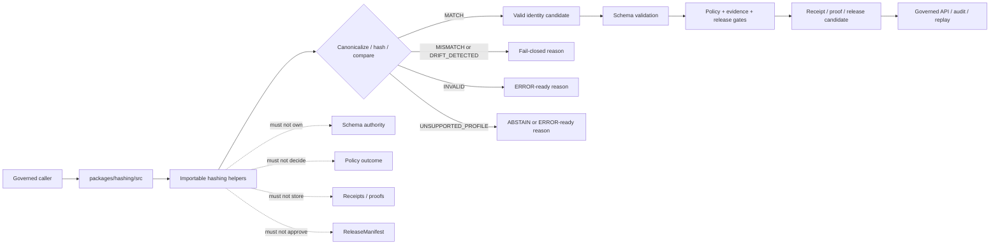

<!-- [KFM_META_BLOCK_V2]
doc_id: kfm://doc/NEEDS-VERIFICATION/packages-hashing-src-readme
title: Hashing Package Source README
type: readme
version: v1
status: draft
owners: OWNER_TBD
created: NEEDS VERIFICATION — target file existed before this repair but contained only placeholder text
updated: 2026-06-14
policy_label: public
related: [packages/hashing/README.md, packages/README.md, docs/doctrine/directory-rules.md, docs/architecture/identity-and-spec-hash.md, docs/architecture/evidence-identity.md, docs/architecture/contract-schema-policy-split.md, contracts/, schemas/contracts/v1/, policy/, data/receipts/, data/proofs/, release/]
tags: [kfm, packages, hashing, src, deterministic-identity, spec-hash, content-hash, run-id, sha256, jcs, receipts, replay]
notes: ["README-like source-directory guide for deterministic hash and identity helper code.", "This directory may contain source code for canonicalization, digest, spec_hash, content_hash, geometry_hash, artifact_hash, merkle_root, run_id, and comparison helpers only; it must not own schemas, contracts, policy, lifecycle data, receipts, proofs, release decisions, API routes, UI surfaces, signing authority, or AI truth claims.", "Import layout, package metadata, tests, CI workflows, and runtime bindings remain NEEDS VERIFICATION until the live repo is recursively inspected."]
[/KFM_META_BLOCK_V2] -->

<a id="top"></a>

# Hashing Package Source

Source-code envelope for KFM deterministic identity primitives: canonicalization helpers, digest helpers, `spec_hash`, `content_hash`, `geometry_hash`, `artifact_hash`, `merkle_root`, `run_id`, replay comparison helpers, and receipt-ready hash metadata.

<p>
  
  
  
  
  
  
  
</p>

> [!IMPORTANT]
> **Status:** PROPOSED source-directory README  
> **Path:** `packages/hashing/src/README.md`  
> **Owning responsibility root:** `packages/`  
> **Package lane:** `packages/hashing/`  
> **Import/package layout:** NEEDS VERIFICATION  
> **Repo implementation depth:** UNKNOWN for package metadata, import style, tests, CI workflows, API bindings, emitted receipts, proof packs, release manifests, branch protections, and runtime behavior.

## Quick links

- [Scope](#scope)
- [Repo fit](#repo-fit)
- [Accepted inputs](#accepted-inputs)
- [Exclusions](#exclusions)
- [Expected source layout](#expected-source-layout)
- [Hash helper outcomes](#hash-helper-outcomes)
- [Trust-boundary flow](#trust-boundary-flow)
- [Source anti-collapse rules](#source-anti-collapse-rules)
- [Development rules](#development-rules)
- [Validation checklist](#validation-checklist)
- [Rollback](#rollback)
- [Evidence boundary](#evidence-boundary)

---

## Scope

`packages/hashing/src/` is the proposed source-code root for the Hashing package.

This directory is for importable, deterministic helper code used by packages, validators, pipelines, replay tools, governed API assemblers, receipt builders, proof builders, release gates, and tests when they need stable identity and digest primitives.

This source tree may support helpers for:

- RFC 8785-style JSON canonicalization adapters when the project standard is pinned;
- canonical byte production for supported trust-bearing record families;
- SHA-256 digest helpers with explicit algorithm/profile prefixes;
- `spec_hash` construction and comparison helpers;
- `content_hash` construction for bytes and canonical JSON bodies;
- `geometry_hash` helpers when supplied with normalized geometry, CRS, and precision rules;
- `style_hash`, `artifact_hash`, and file-set `merkle_root` helpers from explicit inputs;
- deterministic `run_id` helpers based on supplied run context;
- replay comparison helpers that recompute and compare stored digests;
- synthetic fixtures for valid, invalid, mismatch, unsupported-profile, and drift cases.

This source tree must not define object meaning, define schema shape, decide policy, store receipts, store proofs, approve release, sign records, manage keys, expose API routes, render UI, call model providers, or generate truth claims.

```text
RAW -> WORK / QUARANTINE -> PROCESSED -> CATALOG / TRIPLET -> PUBLISHED
```

Hashing source code may support validation and promotion gates across that lifecycle. It does not own lifecycle state, proof state, receipt state, review state, release state, or public truth.

[⬆ Back to top](#top)

---

## Repo fit

```text
packages/hashing/src/
```

`packages/` is the responsibility root for shared reusable code. `hashing/` is the package segment. `src/` is the source-code envelope.

| Relationship | Expected home | Boundary rule |
| --- | --- | --- |
| Hashing source code | `packages/hashing/src/` | Deterministic canonicalization, digest, comparison, replay, and fixture helpers only. |
| Importable module | `packages/hashing/src/hashing/` or repo-confirmed namespace | Package namespace, subject to repo package convention verification. |
| Package entry README | `packages/hashing/README.md` | Explains the package as a whole. |
| Identity architecture | `docs/architecture/identity-and-spec-hash.md` | Explains KFM identity and hash-family doctrine. |
| Semantic contracts | `contracts/` | Defines meaning; source code references, not redefines. |
| Machine schemas | `schemas/contracts/v1/` | Defines shape and field requirements. |
| Policy rules | `policy/` | Owns allow/deny/restrict/hold/abstain decisions. |
| Receipts and proofs | `data/receipts/`, `data/proofs/` | Stores hash-bearing trust artifacts and validation results. |
| Release decisions | `release/` | Owns promotion, publication, correction, supersession, rollback, and merkle-root use. |
| Tools and CLIs | `tools/` or repo-confirmed tool roots | May wrap this source tree; must not become authority by script placement. |
| Public API and UI | `apps/`, `ui/`, `web/`, or repo-confirmed equivalents | May use validators that call hash helpers; package internals are not public authority. |
| Tests and fixtures | `tests/packages/hashing/`, `fixtures/packages/hashing/`, or repo-confirmed equivalents | Proves deterministic behavior with stable fixtures. |

> [!WARNING]
> A source-code directory is not a trust-object home. Keep schemas, contracts, policy rules, lifecycle data, receipts, proofs, release decisions, signatures, transparency logs, and public API behavior in their owning roots.

[⬆ Back to top](#top)

---

## Accepted inputs

Functions in this source tree should accept explicit values from governed callers. They should not fetch missing facts from raw stores, source systems, hidden globals, UI state, operator memory, or generated language.

| Input family | Accepted examples | Required handling |
| --- | --- | --- |
| Canonicalization context | canonicalization method, schema version, profile name, stable exclusion list | Require explicit method; do not infer a stronger identity profile. |
| JSON-like record body | RunReceipt body, EvidenceBundle body, schema body, contract metadata, manifest body | Canonicalize according to pinned rules before hashing. |
| Byte payload | file bytes, artifact bytes, report bytes, tile artifact bytes | Hash bytes exactly as supplied; preserve algorithm prefix. |
| Geometry context | normalized geometry, CRS, precision rules, geometry profile id | Hash only after caller supplies normalization context. |
| File-set context | ordered file entries, path refs, byte digests, manifest refs | Build merkle candidates deterministically; do not scan ambient folders. |
| Run context | tool id, version, inputs, config, seed, timestamp policy, prior run refs | Produce run ids only from explicit fields; avoid ambient randomness unless recorded. |
| Comparison context | stored digest, recomputed digest, algorithm, canonicalization profile | Return match, mismatch, invalid, or unsupported-profile state with reason. |
| Fixture context | synthetic records, expected canonical bytes, expected digests | Keep fixtures deterministic and public-safe. |

[⬆ Back to top](#top)

---

## Exclusions

| Do not put here | Correct home or owner | Reason |
| --- | --- | --- |
| JSON Schemas | `schemas/contracts/v1/` | Schemas own machine shape. |
| Semantic contracts | `contracts/` | Contracts own meaning. |
| Policy rules | `policy/` | Policy owns decisions and obligations. |
| Receipts, proof packs, validation reports | `data/receipts/`, `data/proofs/` | Trust artifacts must remain separately auditable. |
| Release manifests, rollback cards, correction notices | `release/` | Publication is a governed state transition. |
| RAW, WORK, QUARANTINE, PROCESSED, CATALOG, TRIPLET, or PUBLISHED data | `data/<phase>/` | Lifecycle state must remain phase-visible. |
| Source descriptors and source registries | `data/registry/` or repo-confirmed registry homes | Source authority, rights, and cadence are governance data. |
| Artifact files, tiles, reports, exports, snapshots | Lifecycle/release artifact homes | Hash source may hash them; it must not store them. |
| Signature keys, signing authority, transparency logs | security/key-management and release/proof homes | Hashing is not signing or attestation authority. |
| API routes or public serializers | `apps/` or repo-confirmed API app | Public clients must use governed APIs. |
| UI components or map rendering | `apps/`, `ui/`, `web/`, `packages/maplibre-runtime/`, or repo-confirmed UI roots | Rendering is downstream from governed hash-bearing objects. |
| AI-generated truth or generated citations | governed AI runtime plus receipts and evidence validation | AI output is interpretive and evidence-subordinate. |
| Secrets or private raw source content in fixtures | Nowhere in package fixtures | Fixtures must remain synthetic or public-safe. |

[⬆ Back to top](#top)

---

## Expected source layout

> [!NOTE]
> The tree below is PROPOSED. Confirm package metadata, language conventions, import namespace, test layout, and CI before committing code beyond README files.

```text
packages/hashing/src/
├── README.md                # This file: source-code boundary and trust rules
└── hashing/
    ├── README.md            # PROPOSED: importable namespace guide
    ├── __init__.py          # PROPOSED: export boundary if Python convention is confirmed
    ├── canonical_json.py    # PROPOSED: JCS/profile helpers
    ├── digests.py           # PROPOSED: SHA-256 and algorithm-prefix helpers
    ├── spec_hash.py         # PROPOSED: spec_hash helpers
    ├── content_hash.py      # PROPOSED: content-hash helpers
    ├── geometry_hash.py     # PROPOSED: geometry-hash helpers
    ├── merkle.py            # PROPOSED: file-set root helpers
    ├── run_id.py            # PROPOSED: deterministic run id helpers
    ├── compare.py           # PROPOSED: recompute/compare helpers
    ├── fixtures.py          # PROPOSED: synthetic fixtures
    └── py.typed             # PROPOSED: include only if typed Python package convention is confirmed
```

Preferred import posture, subject to package verification:

```python
from hashing.spec_hash import compute_spec_hash
from hashing.content_hash import compute_content_hash
from hashing.compare import compare_digest_values
```

[⬆ Back to top](#top)

---

## Hash helper outcomes

Hashing source helpers should return explicit, inspectable outcomes that callers can map into validation reports, receipts, release gates, or runtime envelopes.

| Helper outcome | Use when | Runtime posture |
| --- | --- | --- |
| `MATCH` | Stored digest and recomputed digest match under the same declared profile. | Candidate for downstream schema, policy, evidence, receipt, and release checks. |
| `MISMATCH` | Stored digest and recomputed digest differ. | Fail closed; no promotion or trusted runtime use. |
| `INVALID` | Digest syntax, algorithm prefix, input type, or canonicalization input is invalid. | `ERROR` or invalid validation report depending on caller. |
| `UNSUPPORTED_PROFILE` | Canonicalization profile or algorithm is not accepted by the caller's contract. | `ABSTAIN` or `ERROR` with stable reason code. |
| `DRIFT_DETECTED` | Recomputed identity differs from prior receipt, manifest, or replay expectation. | Block promotion and require review/correction path. |

`MATCH` is not proof of truth, admissibility, release, or public safety. It only proves that the compared bytes and declared profile produce the expected digest.

[⬆ Back to top](#top)

---

## Trust-boundary flow



[⬆ Back to top](#top)

---

## Source anti-collapse rules

| Boundary | Preserve as | Never collapse into |
| --- | --- | --- |
| Canonicalization profile | Explicit profile supplied by schema/contract/tooling | Silent inferred format |
| `spec_hash` | Identity of canonical trust-bearing record body | Generic file checksum or display label |
| `content_hash` | Digest of bytes or canonical content | Evidence admissibility or release approval |
| `run_id` | Deterministic run identity from explicit fields | Ambient timestamp-only or random id without receipt support |
| Hash comparison | Match/mismatch under declared algorithm/profile | Truth validation, policy decision, or release approval |
| Merkle root | Deterministic file-set root from explicit entries | Publication approval or rollback record |
| Fixture digest | Stable synthetic test expectation | Production receipt/proof object |

[⬆ Back to top](#top)

---

## Development rules

1. Prefer pure functions with explicit input objects.
2. Preserve algorithm prefix, canonicalization profile, schema version, and exclusion rules supplied by callers.
3. Never infer missing schema, policy, evidence, release, or receipt authority from a hash match.
4. Do not make network calls from `src/` helpers.
5. Do not read directly from RAW, WORK, QUARANTINE, unpublished candidates, source systems, source credentials, canonical stores, or model runtimes.
6. Do not write lifecycle data, receipts, proofs, release manifests, catalog records, API responses, signatures, or UI components.
7. Do not sign records, manage keys, or claim attestation authority.
8. Do not create schemas, contracts, policy rules, source registries, API routes, public answers, or release decisions from this source tree.
9. Do not store chain-of-thought, raw provider payloads, secrets, private source records, or unrestricted sensitive context.
10. Return typed invalid states instead of silent canonicalization changes, algorithm fallback, or mismatch warnings.
11. Add deterministic tests for every behavior-changing helper and every negative path.
12. Keep fixtures synthetic, sanitized, and stable.
13. Preserve rollback and correction metadata supplied by callers when hash output can affect downstream publication candidates.

[⬆ Back to top](#top)

---

## Validation checklist

- [ ] Confirm `packages/hashing/src/` exists in the mounted repo with this README as its source-directory guide.
- [ ] Confirm package manager and import convention (`pyproject.toml`, workspace config, or equivalent).
- [ ] Confirm whether this source tree is Python-only, TypeScript-only, or mixed-language.
- [ ] Confirm owners and CODEOWNERS path coverage.
- [ ] Confirm canonicalization profile and whether RFC 8785 JCS is implemented directly or through a dependency.
- [ ] Confirm schema homes for records that carry `spec_hash`, `content_hash`, `geometry_hash`, `artifact_hash`, `merkle_root`, and `run_id`.
- [ ] Confirm validators and tests that exercise this namespace.
- [ ] Confirm tests for canonical key ordering, whitespace removal, number handling, string escaping, digest prefix validation, mismatch failure, unsupported algorithms, and stable fixtures.
- [ ] Confirm helpers do not access lifecycle stores or unpublished candidate stores.
- [ ] Confirm helpers do not write receipts, proofs, release manifests, catalog records, API responses, signatures, or transparency logs.
- [ ] Confirm promotion/replay validators recompute hashes rather than trusting stored values.

Suggested inspection commands:

```bash
find packages/hashing/src -maxdepth 5 -type f | sort
git grep -n "spec_hash\|content_hash\|geometry_hash\|artifact_hash\|merkle_root\|run_id\|jcs:sha256\|canonical" -- packages docs contracts schemas policy tests fixtures tools apps 2>/dev/null || true
git grep -n "from hashing\|import hashing\|packages/hashing/src" -- . 2>/dev/null || true
```

[⬆ Back to top](#top)

---

## Rollback

Rollback is required if this source tree:

- creates a parallel authority home for schemas, contracts, policy, registries, lifecycle data, receipts, proofs, releases, API routes, UI surfaces, signing, key-management, model runtimes, or source data;
- hashes non-canonical developer-formatted JSON as `spec_hash` authority;
- silently changes canonicalization profiles, algorithm prefixes, exclusion rules, or mismatch handling;
- treats hash match as proof of truth, admissibility, release, or public safety;
- stores secrets, private source records, or unrestricted sensitive context in package fixtures;
- permits promotion, replay, or runtime gates to trust stored digests without recomputation.

Rollback target: revert the hashing-source PR, keep any generated audit notes as review evidence, and file the affected behavior in `docs/registers/DRIFT_REGISTER.md` or `docs/registers/VERIFICATION_BACKLOG.md` if the mounted repo uses those registers.

[⬆ Back to top](#top)

---

## Evidence boundary

| Source | Status | Supports | Limits |
| --- | --- | --- | --- |
| Current target file | CONFIRMED | `packages/hashing/src/README.md` existed and required replacement from placeholder content. | Did not prove source implementation maturity. |
| Parent package README | CONFIRMED repo doc | `packages/hashing/` is a shared helper-code package for deterministic identity, hash-family, canonicalization, and replay-comparison helpers. | Does not prove source files, package metadata, tests, or CI. |
| `packages/README.md` | CONFIRMED repo doc | `packages/` is for shared libraries used by apps, workers, pipelines, and tools. | Does not define this source namespace. |
| `docs/architecture/identity-and-spec-hash.md` | CONFIRMED repo doc | KFM identity posture, JCS + SHA-256 `spec_hash`, hash-family names, recompute-and-compare gates, and implementation maturity limits. | Some paths and package/tool placements remain PROPOSED or NEEDS VERIFICATION in that doc. |
| Current file-generation pass | CONFIRMED request | User-requested target path and README repair/replacement. | Does not inspect package metadata, tests, CI logs, dashboards, deployment posture, runtime behavior, or branch protection. |

[⬆ Back to top](#top)
