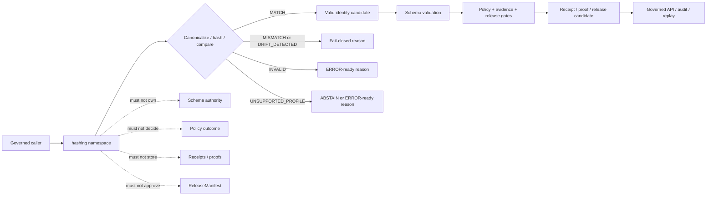

<!-- [KFM_META_BLOCK_V2]
doc_id: kfm://doc/NEEDS-VERIFICATION/packages-hashing-src-hashing-readme
title: Hashing Import Namespace README
type: readme
version: v1
status: draft
owners: OWNER_TBD
created: NEEDS VERIFICATION — target file existed before this repair but contained only placeholder text
updated: 2026-06-14
policy_label: public
related: [packages/hashing/README.md, packages/hashing/src/README.md, packages/README.md, docs/doctrine/directory-rules.md, docs/architecture/identity-and-spec-hash.md, docs/architecture/evidence-identity.md, contracts/, schemas/contracts/v1/, policy/, data/receipts/, data/proofs/, release/]
tags: [kfm, packages, hashing, import-namespace, deterministic-identity, spec-hash, content-hash, run-id, sha256, jcs, replay]
notes: ["Namespace guide for importable deterministic hashing helpers.", "This namespace may expose canonicalization, digest, spec_hash, content_hash, geometry_hash, artifact_hash, merkle_root, run_id, and comparison helpers only.", "It must not own schemas, contracts, policy, lifecycle data, receipts, proofs, release decisions, API routes, UI surfaces, signing authority, model runtimes, or AI truth claims."]
[/KFM_META_BLOCK_V2] -->

<a id="top"></a>

# `hashing` Import Namespace

Importable helper namespace for KFM deterministic identity primitives: canonical bytes, SHA-256 digests, `spec_hash`, `content_hash`, `geometry_hash`, `artifact_hash`, `merkle_root`, `run_id`, replay comparison helpers, and receipt-ready hash metadata.

<p>
  
  
  
  
  
</p>

> [!IMPORTANT]
> **Status:** PROPOSED import-namespace README  
> **Path:** `packages/hashing/src/hashing/README.md`  
> **Owning responsibility root:** `packages/`  
> **Package lane:** `packages/hashing/`  
> **Source envelope:** `packages/hashing/src/`  
> **Import namespace:** `hashing` — NEEDS VERIFICATION against package metadata  
> **Repo implementation depth:** UNKNOWN for module files, exports, tests, package manager, CI workflows, API bindings, receipts, proof packs, release manifests, branch protections, and runtime behavior.

## Scope

`packages/hashing/src/hashing/` is the proposed importable namespace for reusable deterministic hashing helper code.

It may contain pure, deterministic helpers for:

- canonical JSON/profile adapters when the project standard is pinned;
- canonical byte production for supported trust-bearing record families;
- SHA-256 digest helpers with explicit algorithm/profile prefixes;
- `spec_hash` construction and comparison helpers;
- `content_hash` construction for bytes and canonical JSON bodies;
- `geometry_hash` helpers when supplied with normalized geometry, CRS, and precision rules;
- `style_hash`, `artifact_hash`, and file-set `merkle_root` helpers from explicit inputs;
- deterministic `run_id` helpers based on supplied run context;
- replay comparison helpers that recompute and compare stored digests;
- synthetic fixtures for valid, invalid, mismatch, unsupported-profile, and drift cases.

This namespace must not define object meaning, schema shape, policy outcome, evidence sufficiency, receipt authority, release state, public truth, signing authority, or key-management behavior.

## Namespace contract

The namespace is a helper boundary, not an authority boundary.

| Namespace concern | Expected behavior | Authority home |
| --- | --- | --- |
| Canonicalization | Produce canonical bytes under an explicit profile. | Standards, contracts, schemas, and ADRs |
| Digest creation | Compute declared digest strings from explicit inputs. | This helper namespace only |
| Hash comparison | Return match, mismatch, invalid, unsupported-profile, or drift states. | Callers decide gate consequences through validators/policy/release workflows |
| `spec_hash` | Compute identity for a canonical trust-bearing record body. | Record schemas/contracts define bodies and exclusions |
| `content_hash` | Hash bytes or canonical content. | Content owner remains outside this package |
| `run_id` | Compute deterministic run identity from explicit fields. | Receipt systems own run receipts |
| `merkle_root` | Compute deterministic file-set root from explicit entries. | Release systems own promotion and rollback |
| Fixtures | Produce synthetic, stable examples for tests only. | `tests/` and `fixtures/`, not production receipts or proofs |

## Expected modules

> [!NOTE]
> The tree below is PROPOSED. Confirm actual language, module names, package manager, and tests before treating these as implementation facts.

```text
packages/hashing/src/hashing/
├── README.md                 # This file: namespace guide
├── __init__.py               # PROPOSED: export boundary if Python convention is confirmed
├── canonical_json.py         # PROPOSED: JCS/profile helpers
├── digests.py                # PROPOSED: SHA-256 and algorithm-prefix helpers
├── spec_hash.py              # PROPOSED: spec_hash helpers
├── content_hash.py           # PROPOSED: content-hash helpers
├── geometry_hash.py          # PROPOSED: geometry-hash helpers
├── merkle.py                 # PROPOSED: file-set root helpers
├── run_id.py                 # PROPOSED: deterministic run id helpers
├── compare.py                # PROPOSED: recompute/compare helpers
├── fixtures.py               # PROPOSED: synthetic fixtures
└── py.typed                  # PROPOSED: include only if typed Python package convention is confirmed
```

Keep implementation smaller than this until schemas, tests, and callers prove the need.

## Allowed exports

| Export family | Examples | Rule |
| --- | --- | --- |
| Canonicalization helpers | `canonicalize_json`, `canonical_bytes_for_profile` | Require explicit profile and stable inputs. |
| Digest helpers | `sha256_digest`, `format_digest`, `parse_digest_ref` | Preserve algorithm prefixes. |
| `spec_hash` helpers | `compute_spec_hash`, `compare_spec_hash` | Do not hash developer-formatted JSON as authority. |
| `content_hash` helpers | `compute_content_hash`, `hash_bytes` | Hash exactly supplied bytes or canonical content. |
| Geometry hash helpers | `compute_geometry_hash` | Require normalized geometry, CRS, and precision profile. |
| Merkle helpers | `compute_merkle_root` | Use explicit file entries only; do not scan ambient folders. |
| Run id helpers | `compute_run_id` | Use explicit run context fields only. |
| Comparison helpers | `compare_digest_values`, `detect_hash_drift` | Return typed outcomes and reason codes. |
| Fixture helpers | `spec_hash_fixture`, `mismatch_fixture` | Synthetic/stable only. |

## Disallowed exports

Do not export functions or constants that make this namespace an authority surface.

| Disallowed export | Why |
| --- | --- |
| `approve_release`, `publish`, `promote`, `rollback_release` | Release authority belongs under `release/` and governed workflows. |
| `evaluate_policy`, `allow_public`, `deny_public` | Policy decisions belong to policy systems. |
| `write_receipt`, `write_proof`, `store_evidence_bundle` | Receipts/proofs/evidence storage are separate trust homes. |
| `read_raw`, `scan_source`, `poll_connector` | Source/lifecycle access belongs to connectors, pipelines, and data roots. |
| `sign_record`, `manage_keys`, `append_transparency_log` | Signing and attestation are not hash helper authority. |
| `trust_if_match`, `assert_truth`, `bypass_validation` | A digest match is not proof of truth, admissibility, or release. |
| `call_model`, `generate_answer`, `summarize_truth` | Model calls and generated claims belong behind governed AI placement. |

## Import posture

Preferred imports, subject to package metadata verification:

```python
from hashing.spec_hash import compute_spec_hash
from hashing.content_hash import compute_content_hash
from hashing.compare import compare_digest_values
from hashing.run_id import compute_run_id
```

Callers should treat hash output as a candidate for schema validation, policy gates, evidence checks, receipt/proof persistence, release review, and replay comparison. A hash match is not public truth by itself.

## Hash helper outcomes

| Helper outcome | Use when | Runtime posture |
| --- | --- | --- |
| `MATCH` | Stored digest and recomputed digest match under the same declared profile. | Candidate for downstream schema, policy, evidence, receipt, and release checks. |
| `MISMATCH` | Stored digest and recomputed digest differ. | Fail closed; no promotion or trusted runtime use. |
| `INVALID` | Digest syntax, algorithm prefix, input type, or canonicalization input is invalid. | `ERROR` or invalid validation report depending on caller. |
| `UNSUPPORTED_PROFILE` | Canonicalization profile or algorithm is not accepted by the caller's contract. | `ABSTAIN` or `ERROR` with stable reason code. |
| `DRIFT_DETECTED` | Recomputed identity differs from prior receipt, manifest, or replay expectation. | Block promotion and require review/correction path. |

`MATCH` is not proof of truth, admissibility, release, or public safety. It only proves that the compared bytes and declared profile produce the expected digest.

## Trust-boundary flow



## Development rules

1. Keep the namespace no-network by default.
2. Prefer pure functions with explicit inputs and outputs.
3. Preserve algorithm prefix, canonicalization profile, schema version, and exclusion rules supplied by callers.
4. Never infer schema, policy, evidence, release, receipt, or truth authority from a hash match.
5. Do not read from RAW, WORK, QUARANTINE, unpublished candidates, source systems, source credentials, canonical stores, or model runtimes.
6. Do not write lifecycle data, receipts, proofs, release manifests, catalog records, API responses, signatures, or UI components.
7. Do not sign records, manage keys, or claim attestation authority.
8. Do not create schemas, contracts, policy rules, source registries, API routes, public answers, or release decisions from this namespace.
9. Do not store raw provider payloads, secrets, private source records, or unrestricted sensitive context.
10. Return typed invalid states instead of silent canonicalization changes, algorithm fallback, or mismatch warnings.
11. Add deterministic tests for every export and every negative path.
12. Keep fixtures synthetic, sanitized, and stable.
13. Preserve rollback and correction metadata supplied by callers when hash output can affect downstream publication candidates.

## Validation checklist

- [ ] Confirm this namespace exists in package metadata.
- [ ] Confirm the package import name is actually `hashing`.
- [ ] Confirm `__init__` exports are intentional and minimal.
- [ ] Confirm tests cover `MATCH`, `MISMATCH`, `INVALID`, `UNSUPPORTED_PROFILE`, and `DRIFT_DETECTED` helper states if implemented.
- [ ] Confirm tests cover canonical key ordering, whitespace removal, number handling, string escaping, digest prefix validation, mismatch failure, unsupported algorithms, and stable fixtures.
- [ ] Confirm helpers do not import connectors, data stores, policy engines, release writers, model providers, API routers, UI components, signing/key-management code, or receipt/proof stores.
- [ ] Confirm helpers do not access RAW/WORK/QUARANTINE or unpublished candidate stores.
- [ ] Confirm promotion/replay validators recompute hashes rather than trusting stored values.

Suggested inspection commands:

```bash
find packages/hashing/src/hashing -maxdepth 3 -type f | sort
git grep -n "from hashing\|import hashing" -- . 2>/dev/null || true
git grep -n "spec_hash\|content_hash\|geometry_hash\|artifact_hash\|merkle_root\|run_id\|jcs:sha256\|canonical" -- packages/hashing tests fixtures docs schemas contracts policy tools 2>/dev/null || true
```

## Rollback

Rollback is required if this namespace:

- becomes a parallel schema, contract, policy, source-registry, lifecycle-data, evidence/proof, receipt, release, API, UI, signing, key-management, model-runtime, or source-data authority;
- hashes non-canonical developer-formatted JSON as `spec_hash` authority;
- silently changes canonicalization profiles, algorithm prefixes, exclusion rules, or mismatch handling;
- treats hash match as proof of truth, admissibility, release, or public safety;
- stores secrets, private source records, or unrestricted sensitive context in package fixtures;
- permits promotion, replay, or runtime gates to trust stored digests without recomputation.

Rollback target: revert the namespace-source PR, keep generated audit notes as review evidence, and file any authority drift in `docs/registers/DRIFT_REGISTER.md` or `docs/registers/VERIFICATION_BACKLOG.md` if the mounted repo uses those registers.

## Evidence boundary

| Source | Status | Supports | Limits |
| --- | --- | --- | --- |
| Current target file | CONFIRMED | `packages/hashing/src/hashing/README.md` existed and required replacement from placeholder content. | Did not prove namespace implementation maturity. |
| Parent source README | CONFIRMED repo doc | `packages/hashing/src/` is bounded to deterministic hashing helper source code. | Does not prove package metadata, imports, tests, or CI. |
| Parent package README | CONFIRMED repo doc | `packages/hashing/` is a shared helper-code package for deterministic identity, hash-family, canonicalization, and replay-comparison helpers. | Does not prove source files or runtime bindings. |
| `packages/README.md` | CONFIRMED repo doc | `packages/` is for shared libraries used by apps, workers, pipelines, and tools. | Does not define this namespace. |
| `docs/architecture/identity-and-spec-hash.md` | CONFIRMED repo doc | KFM identity posture, JCS + SHA-256 `spec_hash`, hash-family names, recompute-and-compare gates, and implementation maturity limits. | Some paths and package/tool placements remain PROPOSED or NEEDS VERIFICATION in that doc. |
| Current file-generation pass | CONFIRMED request | User-requested target path and README repair/replacement. | Does not inspect package metadata, tests, CI logs, dashboards, deployment posture, runtime behavior, or branch protection. |
