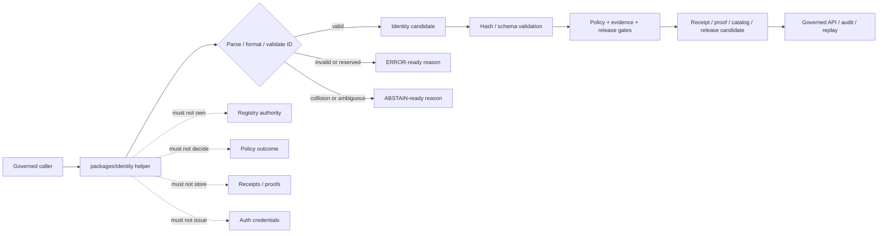

<!-- [KFM_META_BLOCK_V2]
doc_id: kfm://doc/NEEDS-VERIFICATION/packages-identity-readme
title: Identity Package README
type: readme
version: v1
status: draft
owners: OWNER_TBD
created: NEEDS VERIFICATION — target file existed before this revision as a short stub
updated: 2026-06-14
policy_label: public
related: [packages/README.md, packages/hashing/README.md, docs/doctrine/directory-rules.md, docs/architecture/identity-and-spec-hash.md, docs/architecture/evidence-identity.md, docs/architecture/contract-schema-policy-split.md, contracts/, schemas/contracts/v1/, policy/, data/receipts/, data/proofs/, release/]
tags: [kfm, packages, identity, id-grammar, deterministic-identity, stable-id, token-string, spec-hash, object-identity]
notes: ["README-like package entrypoint for deterministic object identity and ID grammar helper code.", "This package may contain reusable ID grammar, stable-id, namespace, object-key, deterministic identity, and non-secret token-string helper code; it must not become an authentication system, secret issuer, schema home, contract home, policy home, source registry, lifecycle-data home, receipt store, proof store, release authority, API route, UI surface, or AI truth source.", "Implementation files, package metadata, import namespace, tests, CI workflows, and runtime bindings remain NEEDS VERIFICATION until recursively inspected."]
[/KFM_META_BLOCK_V2] -->

<a id="top"></a>

# Identity Package

Shared helper-code package for KFM deterministic identity primitives: ID grammar, stable object identifiers, namespace tokens, object keys, run/object naming helpers, and deterministic identity helpers that coordinate with hash-bearing records without becoming schema, policy, evidence, release, authentication, or truth authority.

<p>
  
  
  
  
  
  
</p>

> [!IMPORTANT]
> **Status:** PROPOSED package README  
> **Path:** `packages/identity/README.md`  
> **Owning responsibility root:** `packages/` — shared reusable implementation libraries  
> **Package purpose:** ID grammar, stable object identity, deterministic namespace/token-string helpers  
> **Hash dependency boundary:** use `packages/hashing/` for digest computation; do not duplicate cryptographic hash authority here  
> **Schema authority:** `schemas/contracts/v1/`, not this package  
> **Contract authority:** `contracts/`, not this package  
> **Policy authority:** `policy/`, not this package  
> **Repo implementation depth:** UNKNOWN for package metadata, import style, source files, tests, CI workflows, API bindings, emitted receipts, proof packs, release manifests, branch protections, and runtime behavior.

## Quick links

- [Scope](#scope)
- [Repo fit](#repo-fit)
- [Accepted inputs](#accepted-inputs)
- [Exclusions](#exclusions)
- [Identity helper responsibilities](#identity-helper-responsibilities)
- [Deterministic identity rules](#deterministic-identity-rules)
- [Trust-boundary flow](#trust-boundary-flow)
- [Expected package layout](#expected-package-layout)
- [Development rules](#development-rules)
- [Validation checklist](#validation-checklist)
- [Rollback](#rollback)
- [Evidence boundary](#evidence-boundary)

---

## Scope

`packages/identity/` is the shared implementation package lane for deterministic identity helper code used by KFM packages, validators, pipelines, catalog/triplet builders, evidence resolvers, receipts, proofs, release gates, governed APIs, and tests.

This package may contain deterministic utilities for:

- KFM URI and ID grammar parsing/formatting, such as `kfm://...` style identifiers;
- namespace, prefix, slug, and object-key helpers;
- stable ID construction from explicit source id, object role, temporal scope, spatial scope, normalized digest, and schema/profile context;
- deterministic token-string issuance for non-secret object ids, cursor ids, run labels, or local correlation ids;
- collision checks and reserved-prefix checks;
- identity-carrier helpers for EvidenceRef, SourceDescriptor refs, receipt refs, release refs, rollback refs, catalog ids, triplet ids, and domain object ids;
- adapters that coordinate with `packages/hashing/` for digest-based identity without reimplementing hash authority;
- synthetic fixtures for valid, invalid, reserved, collision, and migration cases.

This package must not issue authentication credentials, bearer tokens, API keys, secrets, session tokens, identity-provider credentials, or access-control decisions. In this README, “token” means a non-secret deterministic string token used inside KFM identifiers, not a security credential.

```text
RAW -> WORK / QUARANTINE -> PROCESSED -> CATALOG / TRIPLET -> PUBLISHED
```

Identity helpers may support stable naming across that lifecycle. They do not own lifecycle state, proof state, receipt state, policy state, review state, release state, or public truth.

[⬆ Back to top](#top)

---

## Repo fit

```text
packages/identity/
```

This path is appropriate for reusable identity implementation code because `packages/` is the responsibility root for shared libraries used by apps, workers, pipelines, and tools.

| Relationship | Expected home | Boundary rule |
| --- | --- | --- |
| Shared identity helper code | `packages/identity/` | ID grammar, deterministic object-id, namespace, token-string, and validation helpers only. |
| Hash computation | `packages/hashing/` | Computes canonical hashes and digest comparisons. |
| Identity architecture | `docs/architecture/identity-and-spec-hash.md` | Explains identity and hash doctrine. |
| Evidence identity docs | `docs/architecture/evidence-identity.md` | Explains EvidenceRef/EvidenceBundle identity posture. |
| Semantic contracts | `contracts/` | Defines object meaning; package code references, not redefines. |
| Machine schemas | `schemas/contracts/v1/` | Defines machine-checkable shape and field requirements. |
| Policy rules | `policy/` | Owns allow/deny/restrict/hold/abstain decisions and sensitive identity handling. |
| Receipts and proofs | `data/receipts/`, `data/proofs/` | Stores trust artifacts carrying identifiers. |
| Source registries | `data/registry/` or repo-confirmed registry homes | Owns source descriptor identifiers and rights/cadence metadata. |
| Release decisions | `release/` | Owns promotion, publication, correction, supersession, and rollback. |
| Authentication / authorization | auth service, infra, policy, or repo-confirmed security root | This package does not issue credentials or decide access. |
| Public API and UI | `apps/`, `ui/`, `web/`, or repo-confirmed equivalents | May call validators using identity helpers; package internals are not public authority. |
| Tests and fixtures | `tests/packages/identity/`, `fixtures/packages/identity/`, or repo-confirmed equivalents | Proves deterministic behavior with stable fixtures. |

> [!WARNING]
> Do not use `packages/identity/` as a storage location for identity registries, person records, DNA/genomic identifiers, private-property records, source descriptors, receipts, proofs, access credentials, or release manifests.

[⬆ Back to top](#top)

---

## Accepted inputs

Package helpers should accept explicit, inspectable values from governed callers. They should not fetch missing facts from source systems, raw stores, UI state, hidden globals, operator memory, or generated language.

| Input family | Accepted examples | Required handling |
| --- | --- | --- |
| Namespace context | object family, domain, phase, source role, schema version, registry prefix | Validate against supplied allowed prefixes; do not invent registry authority. |
| Object context | source id, object role, temporal scope, spatial scope, normalized digest, field path | Produce deterministic candidate ids and preserve scope. |
| Digest context | `spec_hash`, `content_hash`, `geometry_hash`, normalized digest | Treat hashes as inputs from `packages/hashing/`; do not silently recompute unless delegated. |
| Ref context | EvidenceRef, SourceDescriptor ref, receipt ref, release ref, rollback ref, catalog id, triplet id | Parse/format without retargeting. |
| Token-string context | prefix, entropy policy, deterministic seed fields, collision scope | Produce non-secret tokens only; never create credentials. |
| Migration context | prior id, superseding id, correction id, tombstone id, alias rule | Preserve lineage and require audit path. |
| Validation context | allowed grammar, reserved words, length limits, forbidden characters | Return typed valid/invalid/collision/reserved states. |
| Fixture context | synthetic ids, invalid ids, reserved prefixes, collision cases | Keep fixtures synthetic and public-safe. |

[⬆ Back to top](#top)

---

## Exclusions

| Do not put here | Correct home or owner | Reason |
| --- | --- | --- |
| JSON Schemas | `schemas/contracts/v1/` | Schemas own machine shape. |
| Semantic contracts | `contracts/` | Contracts own meaning. |
| Policy rules | `policy/` | Policy owns decisions and obligations. |
| Source descriptors and registries | `data/registry/` or repo-confirmed registry homes | Registry authority and source identity are governance data. |
| Receipts, proof packs, validation reports | `data/receipts/`, `data/proofs/` | Trust artifacts must remain separately auditable. |
| Release manifests, rollback cards, correction notices | `release/` | Publication and correction are governed state transitions. |
| RAW, WORK, QUARANTINE, PROCESSED, CATALOG, TRIPLET, or PUBLISHED data | `data/<phase>/` | Lifecycle state must remain phase-visible. |
| Authentication tokens, API keys, sessions, secrets, credentials | auth/security/infra roots and secret management | This package only handles non-secret identifier tokens. |
| Living-person identity records, DNA/genomic identifiers, private property records | governed domain/data homes with stricter policy | Sensitive identity data requires fail-closed governance. |
| API routes or public serializers | `apps/` or repo-confirmed API app | Public clients must use governed APIs. |
| UI components or rendering | `apps/`, `ui/`, `web/`, or repo-confirmed UI roots | Rendering is downstream from governed identities. |
| AI-generated identity claims or guessed matches | governed AI runtime plus evidence validation | AI output is interpretive and evidence-subordinate. |
| Secrets or private raw source content in fixtures | Nowhere in package fixtures | Fixtures must remain synthetic or public-safe. |

[⬆ Back to top](#top)

---

## Identity helper responsibilities

| Responsibility | Expected behavior |
| --- | --- |
| Parse IDs | Return typed parse results; preserve original text and normalized form separately. |
| Format IDs | Use explicit namespace, object family, version, and digest/scope inputs. |
| Validate grammar | Check prefix, segment count, length, allowed characters, reserved words, and version markers. |
| Preserve scope | Keep source role, temporal scope, spatial scope, field path, domain, and object family visible. |
| Coordinate with hashing | Consume digest values from `packages/hashing/` or explicit caller input; do not create competing hash semantics. |
| Detect collisions | Return collision/reserved states; do not silently suffix or retarget. |
| Preserve lineage | Carry prior id, supersession id, tombstone id, and rollback/correction refs supplied by callers. |
| Fail closed | Missing namespace, ambiguous prefix, invalid grammar, reserved id, collision, or sensitive identity context should not become a public id by default. |

[⬆ Back to top](#top)

---

## Deterministic identity rules

1. Identity is computed or derived from explicit governed inputs, not from prose labels or memory.
2. Stable ids must preserve enough namespace and scope to avoid cross-domain collision.
3. Hash-bearing identifiers should carry explicit digest/profile values produced by the hashing package or schema-approved tooling.
4. Identifier tokens are non-secret strings unless a separate auth/security system says otherwise.
5. Never treat identifier existence as proof of truth, evidence closure, admissibility, review, or release.
6. Never silently repair an invalid id into a different id.
7. Never silently map one id to another without alias, supersession, correction, or migration metadata.
8. Collision, reserved-prefix, or ambiguous-scope cases fail closed.
9. Sensitive identity contexts require policy-aware disclosure controls and public-safe projections.
10. Identifier grammar changes are compatibility/migration class and should include tests, changelog, and rollback plan.

[⬆ Back to top](#top)

---

## Trust-boundary flow



[⬆ Back to top](#top)

---

## Expected package layout

> [!NOTE]
> The tree below is PROPOSED. Confirm package metadata, language conventions, import namespace, test layout, and CI before committing code beyond README files.

```text
packages/identity/
├── README.md                       # This file: package boundary and trust rules
├── pyproject.toml / package.json    # NEEDS VERIFICATION
├── src/                             # NEEDS VERIFICATION
│   └── identity/                    # PROPOSED namespace; confirm against repo convention
│       ├── README.md                # PROPOSED namespace guide
│       ├── __init__.py              # PROPOSED export boundary if Python convention is confirmed
│       ├── grammar.py               # PROPOSED ID grammar helpers
│       ├── namespaces.py            # PROPOSED namespace and prefix helpers
│       ├── object_id.py             # PROPOSED deterministic object id helpers
│       ├── token_string.py          # PROPOSED non-secret token-string helpers
│       ├── refs.py                  # PROPOSED ref parse/format helpers
│       ├── lineage.py               # PROPOSED alias/supersession/tombstone helpers
│       ├── validation.py            # PROPOSED grammar/collision validation results
│       ├── fixtures.py              # PROPOSED synthetic fixtures
│       └── py.typed                 # PROPOSED if typed Python package convention is confirmed
└── CHANGELOG.md                     # OPTIONAL / NEEDS VERIFICATION
```

Potential imports, subject to package verification:

```python
from identity.grammar import parse_kfm_id
from identity.object_id import build_object_id
from identity.validation import validate_identity_token
```

[⬆ Back to top](#top)

---

## Development rules

1. Treat this package as a deterministic helper layer, not an authority layer.
2. Prefer pure functions with explicit inputs and outputs.
3. Keep identifier grammar, normalized form, original form, and validation result separate.
4. Preserve namespace, domain, object family, source role, temporal scope, spatial scope, digest/profile, and version fields supplied by callers.
5. Do not make network calls from this package.
6. Do not read directly from RAW, WORK, QUARANTINE, unpublished candidates, source systems, source credentials, canonical stores, identity registries, or model runtimes.
7. Do not write lifecycle data, receipts, proofs, release manifests, source registries, catalog records, API responses, or UI components.
8. Do not issue authentication credentials, bearer tokens, sessions, secrets, permissions, or access-control decisions.
9. Do not create schemas, contracts, policy rules, source registries, API routes, public answers, or release decisions from this package.
10. Do not store chain-of-thought, raw provider payloads, secrets, private source records, living-person identity data, DNA/genomic data, or unrestricted sensitive context.
11. Return typed invalid states instead of silent grammar repair, random suffixing, collision overwrite, or alias hiding.
12. Add deterministic tests for every behavior-changing helper and every negative path.
13. Keep fixtures synthetic, sanitized, and stable.
14. Preserve rollback and correction metadata supplied by callers when identity output can affect downstream publication candidates.

[⬆ Back to top](#top)

---

## Validation checklist

- [ ] Confirm `packages/identity/` package metadata and language/runtime convention.
- [ ] Confirm import namespace and whether it conflicts with external package names.
- [ ] Confirm owners and CODEOWNERS path coverage.
- [ ] Confirm grammar homes in schemas/contracts for ids and refs.
- [ ] Confirm relationship with `packages/hashing/` for digest-bearing identity.
- [ ] Confirm tests for valid ids, invalid grammar, reserved prefixes, collisions, alias/supersession, tombstones, deterministic object ids, and non-secret token strings.
- [ ] Confirm helpers do not access lifecycle stores, registries, identity-provider systems, secrets, or unpublished candidate stores.
- [ ] Confirm helpers do not write receipts, proofs, release manifests, catalog records, API responses, credentials, or permissions.
- [ ] Confirm public API routes wrap identity-derived outcomes in governed envelopes and do not expose sensitive identity internals.

Suggested inspection commands:

```bash
find packages/identity -maxdepth 5 -type f | sort
git grep -n "kfm://\|stable_id\|object_id\|source_id\|spec_hash\|identity\|token" -- packages docs contracts schemas policy tests fixtures tools apps 2>/dev/null || true
git grep -n "from identity\|import identity\|packages/identity" -- . 2>/dev/null || true
```

[⬆ Back to top](#top)

---

## Rollback

Rollback is required if this package:

- becomes a parallel schema, contract, policy, source-registry, lifecycle-data, evidence/proof, receipt, release, API, UI, auth, credential, identity-provider, model-runtime, or source-data authority;
- issues or stores authentication credentials, secrets, sessions, bearer tokens, or access permissions;
- treats identifier existence as proof of truth, evidence closure, admissibility, or release;
- silently changes grammar, namespaces, aliases, collision behavior, or token-string rules;
- stores sensitive identity data, living-person identifiers, DNA/genomic context, private source records, or unrestricted sensitive context in package fixtures;
- permits public surfaces to use package internals as authority instead of governed APIs.

Rollback target: revert the package README or identity-source PR, preserve audit notes, and file any authority drift in `docs/registers/DRIFT_REGISTER.md` or the repo-confirmed drift register.

[⬆ Back to top](#top)

---

## Evidence boundary

| Source | Status | Supports | Limits |
| --- | --- | --- | --- |
| Current target file | CONFIRMED | `packages/identity/README.md` existed as a short stub naming ID grammar, token issuance, and deterministic identity for objects. | Stub did not prove package implementation maturity. |
| `packages/README.md` | CONFIRMED repo doc | `packages/` is for shared libraries used by apps, workers, pipelines, and tools. | Does not define identity package behavior. |
| `packages/hashing/README.md` | CONFIRMED sibling package doc | Hashing helper package is the digest/canonicalization lane that identity helpers should not duplicate. | Does not prove identity implementation. |
| `docs/architecture/identity-and-spec-hash.md` | CONFIRMED repo doc | KFM identity posture, deterministic identity, `spec_hash`, and recompute-and-compare gates. | Some paths and package/tool placements remain PROPOSED or NEEDS VERIFICATION in that doc. |
| `docs/architecture/evidence-identity.md` | CONFIRMED repo doc | EvidenceBundle/EvidenceRef identity posture and source-role-aware deterministic identity relationship. | Does not prove this package is implemented. |
| Current file-generation pass | CONFIRMED request | User-requested target path and README expansion. | Does not inspect package metadata, tests, CI logs, dashboards, deployment posture, runtime behavior, or branch protection. |

[⬆ Back to top](#top)
