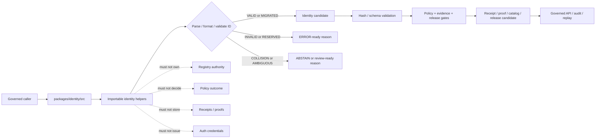

<!-- [KFM_META_BLOCK_V2]
doc_id: kfm://doc/NEEDS-VERIFICATION/packages-identity-src-readme
title: Identity Package Source README
type: readme
version: v1
status: draft
owners: OWNER_TBD
created: NEEDS VERIFICATION — target file existed before this repair but contained only placeholder text
updated: 2026-06-14
policy_label: public
related: [packages/identity/README.md, packages/hashing/README.md, packages/README.md, docs/doctrine/directory-rules.md, docs/architecture/identity-and-spec-hash.md, docs/architecture/evidence-identity.md, contracts/, schemas/contracts/v1/, policy/, data/receipts/, data/proofs/, release/]
tags: [kfm, packages, identity, src, id-grammar, deterministic-identity, stable-id, object-identity, refs]
notes: ["Source-directory guide for deterministic identity helper code.", "This directory may contain ID grammar, stable-id, namespace, object-key, deterministic identity, lineage, and non-secret token-string helper code only.", "It must not own schemas, contracts, policy, registries, lifecycle data, receipts, proofs, release decisions, API routes, UI surfaces, authentication credentials, secrets, or AI truth claims."]
[/KFM_META_BLOCK_V2] -->

<a id="top"></a>

# Identity Package Source

Source-code envelope for KFM deterministic identity primitives: ID grammar helpers, stable object identifiers, namespace tokens, object keys, reference parsing/formatting, lineage helpers, and non-secret token-string utilities.

<p>
  
  
  
  
  
</p>

> [!IMPORTANT]
> **Status:** PROPOSED source-directory README  
> **Path:** `packages/identity/src/README.md`  
> **Owning responsibility root:** `packages/`  
> **Package lane:** `packages/identity/`  
> **Import/package layout:** NEEDS VERIFICATION  
> **Repo implementation depth:** UNKNOWN for package metadata, import style, tests, CI workflows, API bindings, emitted receipts, proof packs, release manifests, branch protections, and runtime behavior.

## Scope

`packages/identity/src/` is the proposed source-code root for the Identity package.

This directory is for importable, deterministic helper code used by packages, validators, pipelines, catalog/triplet builders, evidence resolvers, receipts, proofs, release gates, governed API assemblers, and tests when they need stable KFM identifier handling.

This source tree may support helpers for:

- KFM URI and ID grammar parsing and formatting;
- namespace, prefix, slug, object-family, and object-key helpers;
- stable ID construction from explicit source id, object role, temporal scope, spatial scope, digest value, schema version, and profile context;
- deterministic non-secret token strings for object ids, local correlation ids, cursor ids, run labels, and test fixtures;
- collision, reserved-prefix, length, segment-count, and forbidden-character checks;
- EvidenceRef, SourceDescriptor ref, receipt ref, release ref, rollback ref, catalog id, triplet id, and domain object id adapters;
- alias, supersession, tombstone, correction, and migration-lineage helpers;
- coordination with `packages/hashing/` for digest-bearing identity without duplicating hash semantics;
- synthetic fixtures for valid, invalid, reserved, collision, supersession, and migration cases.

This source tree must not issue authentication credentials, API keys, sessions, secrets, permissions, or access-control decisions. Here, “token” means a non-secret identifier token, not a security credential.

```text
RAW -> WORK / QUARANTINE -> PROCESSED -> CATALOG / TRIPLET -> PUBLISHED
```

Identity source code may help create and validate stable names across that lifecycle. It does not own lifecycle state, proof state, receipt state, review state, release state, source-registry authority, policy authority, or public truth.

[⬆ Back to top](#top)

---

## Repo fit

```text
packages/identity/src/
```

`packages/` is the responsibility root for shared reusable code. `identity/` is the package segment. `src/` is the source-code envelope.

| Relationship | Expected home | Boundary rule |
| --- | --- | --- |
| Identity source code | `packages/identity/src/` | Deterministic ID grammar, object-id, namespace, ref, lineage, and validation helpers only. |
| Importable module | `packages/identity/src/identity/` or repo-confirmed namespace | Package namespace, subject to repo package convention verification. |
| Package entry README | `packages/identity/README.md` | Explains the package as a whole. |
| Hash computation | `packages/hashing/` | Computes canonical hashes and digest comparisons. |
| Identity architecture | `docs/architecture/identity-and-spec-hash.md` | Explains KFM identity and hash doctrine. |
| Semantic contracts | `contracts/` | Defines meaning; source code references, not redefines. |
| Machine schemas | `schemas/contracts/v1/` | Defines field shapes and grammar constraints. |
| Policy rules | `policy/` | Owns disclosure, sensitivity, and access decisions. |
| Source registries | `data/registry/` or repo-confirmed registry homes | Owns source descriptor identifiers and authority metadata. |
| Receipts and proofs | `data/receipts/`, `data/proofs/` | Stores trust artifacts carrying identifiers. |
| Release decisions | `release/` | Owns promotion, publication, correction, supersession, and rollback. |
| Tests and fixtures | `tests/packages/identity/`, `fixtures/packages/identity/`, or repo-confirmed equivalents | Proves deterministic behavior with stable fixtures. |

> [!WARNING]
> A source-code directory is not a registry, proof store, receipt store, release home, or security credential system. Keep trust-bearing records and authority decisions in their owning roots.

[⬆ Back to top](#top)

---

## Accepted inputs

Functions in this source tree should accept explicit values from governed callers. They should not fetch missing facts from source systems, raw stores, hidden globals, UI state, operator memory, or generated language.

| Input family | Accepted examples | Required handling |
| --- | --- | --- |
| Namespace context | object family, domain, phase, source role, schema version, registry prefix | Validate against supplied allowed prefixes; do not invent registry authority. |
| Object context | source id, object role, temporal scope, spatial scope, normalized digest, field path | Produce deterministic candidate ids and preserve scope. |
| Digest context | `spec_hash`, `content_hash`, `geometry_hash`, normalized digest | Treat hashes as explicit inputs from `packages/hashing/` or caller. |
| Ref context | EvidenceRef, SourceDescriptor ref, receipt ref, release ref, rollback ref, catalog id, triplet id | Parse/format without retargeting. |
| Token-string context | prefix, deterministic seed fields, collision scope, length limit | Produce non-secret tokens only; never create credentials. |
| Migration context | prior id, superseding id, correction id, tombstone id, alias rule | Preserve lineage and require audit path. |
| Validation context | allowed grammar, reserved words, length limits, forbidden characters | Return typed valid, invalid, collision, reserved, or ambiguous states. |
| Fixture context | synthetic ids, invalid ids, reserved prefixes, collision cases | Keep fixtures synthetic and public-safe. |

[⬆ Back to top](#top)

---

## Exclusions

| Do not put here | Correct home or owner | Reason |
| --- | --- | --- |
| JSON Schemas | `schemas/contracts/v1/` | Schemas own machine shape. |
| Semantic contracts | `contracts/` | Contracts own meaning. |
| Policy rules | `policy/` | Policy owns decisions and obligations. |
| Source descriptors and registries | `data/registry/` or repo-confirmed registry homes | Registry authority and source identity are governance data. |
| Receipts, proof packs, validation reports | `data/receipts/`, `data/proofs/` | Trust artifacts must remain separately auditable. |
| Release manifests, rollback cards, correction notices | `release/` | Publication and correction are governed state transitions. |
| RAW, WORK, QUARANTINE, PROCESSED, CATALOG, TRIPLET, or PUBLISHED data | `data/<phase>/` | Lifecycle state must remain phase-visible. |
| Authentication credentials, API keys, sessions, secrets, permissions | auth/security/infra roots and secret management | This source tree only handles non-secret identifier tokens. |
| Living-person identity records, DNA/genomic identifiers, private property records | governed domain/data homes with stricter policy | Sensitive identity data requires fail-closed governance. |
| API routes or public serializers | `apps/` or repo-confirmed API app | Public clients must use governed APIs. |
| UI components or rendering | `apps/`, `ui/`, `web/`, or repo-confirmed UI roots | Rendering is downstream from governed identities. |
| AI-generated identity claims or guessed matches | governed AI runtime plus evidence validation | AI output is interpretive and evidence-subordinate. |
| Secrets or private raw source content in fixtures | Nowhere in package fixtures | Fixtures must remain synthetic or public-safe. |

[⬆ Back to top](#top)

---

## Expected source layout

> [!NOTE]
> The tree below is PROPOSED. Confirm package metadata, language conventions, import namespace, test layout, and CI before committing code beyond README files.

```text
packages/identity/src/
├── README.md                # This file: source-code boundary and trust rules
└── identity/
    ├── README.md            # PROPOSED: importable namespace guide
    ├── __init__.py          # PROPOSED: export boundary if Python convention is confirmed
    ├── grammar.py           # PROPOSED: ID grammar helpers
    ├── namespaces.py        # PROPOSED: namespace and prefix helpers
    ├── object_id.py         # PROPOSED: deterministic object id helpers
    ├── token_string.py      # PROPOSED: non-secret token-string helpers
    ├── refs.py              # PROPOSED: ref parse/format helpers
    ├── lineage.py           # PROPOSED: alias/supersession/tombstone helpers
    ├── validation.py        # PROPOSED: grammar/collision validation results
    ├── fixtures.py          # PROPOSED: synthetic fixtures
    └── py.typed             # PROPOSED: include only if typed Python package convention is confirmed
```

Preferred import posture, subject to package verification:

```python
from identity.grammar import parse_kfm_id
from identity.object_id import build_object_id
from identity.validation import validate_identity_token
```

[⬆ Back to top](#top)

---

## Identity helper outcomes

Identity source helpers should return explicit, inspectable outcomes that callers can map into validation reports, envelopes, receipts, or release gates.

| Helper outcome | Use when | Runtime posture |
| --- | --- | --- |
| `VALID` | ID grammar, namespace, scope, and supplied digest/profile are locally consistent. | Candidate for downstream schema, policy, evidence, receipt, and release checks. |
| `INVALID` | Grammar, prefix, length, segment count, or forbidden characters fail local checks. | `ERROR` or invalid validation report depending on caller. |
| `RESERVED` | Prefix, namespace, or token is reserved for another authority. | Fail closed; no silent retargeting. |
| `COLLISION` | Candidate id collides within the supplied collision scope. | Block write/promotion and require review. |
| `AMBIGUOUS` | Source, scope, alias, or object family is not precise enough. | `ABSTAIN` or review-required state. |
| `MIGRATED` | Superseding id or alias relation is explicit and audit-backed. | Candidate only; downstream gates still required. |

`VALID` is not proof of truth, evidence closure, admissibility, or release. It only means the identifier candidate is locally well-formed under supplied rules.

[⬆ Back to top](#top)

---

## Trust-boundary flow



[⬆ Back to top](#top)

---

## Source anti-collapse rules

| Boundary | Preserve as | Never collapse into |
| --- | --- | --- |
| Identifier grammar | Explicit parse/format/validation rules | Hidden assumptions in string concatenation |
| Non-secret token string | Stable identifier segment | Credential, API key, session, or authorization decision |
| Object id | Candidate identity for an object under supplied scope | Evidence proof, policy decision, or release approval |
| Digest-bearing id | Identifier carrying explicit hash/profile input | Duplicate hash semantics outside `packages/hashing/` |
| Alias/supersession | Auditable lineage relation | Silent retargeting |
| Collision result | Review-required failure state | Auto suffix without receipt/correction path |
| Fixture id | Synthetic public-safe example | Real sensitive/person/private-property identifier |

[⬆ Back to top](#top)

---

## Development rules

1. Prefer pure functions with explicit input objects.
2. Keep identifier grammar, normalized form, original form, and validation result separate.
3. Preserve namespace, domain, object family, source role, temporal scope, spatial scope, digest/profile, and version fields supplied by callers.
4. Do not make network calls from `src/` helpers.
5. Do not read directly from RAW, WORK, QUARANTINE, unpublished candidates, source systems, source credentials, canonical stores, identity registries, or model runtimes.
6. Do not write lifecycle data, receipts, proofs, release manifests, source registries, catalog records, API responses, credentials, permissions, or UI components.
7. Do not issue authentication credentials, bearer tokens, sessions, secrets, permissions, or access-control decisions.
8. Do not create schemas, contracts, policy rules, source registries, API routes, public answers, or release decisions from this source tree.
9. Do not store chain-of-thought, raw provider payloads, secrets, private source records, living-person identity data, DNA/genomic data, or unrestricted sensitive context.
10. Return typed invalid states instead of silent grammar repair, random suffixing, collision overwrite, or alias hiding.
11. Add deterministic tests for every behavior-changing helper and every negative path.
12. Keep fixtures synthetic, sanitized, and stable.
13. Preserve rollback and correction metadata supplied by callers when identity output can affect downstream publication candidates.

[⬆ Back to top](#top)

---

## Validation checklist

- [ ] Confirm `packages/identity/src/` exists in the mounted repo with this README as its source-directory guide.
- [ ] Confirm package manager and import convention (`pyproject.toml`, workspace config, or equivalent).
- [ ] Confirm whether this source tree is Python-only, TypeScript-only, or mixed-language.
- [ ] Confirm owners and CODEOWNERS path coverage.
- [ ] Confirm grammar homes in schemas/contracts for ids and refs.
- [ ] Confirm relationship with `packages/hashing/` for digest-bearing identity.
- [ ] Confirm validators and tests that exercise this namespace.
- [ ] Confirm tests for valid ids, invalid grammar, reserved prefixes, collisions, alias/supersession, tombstones, deterministic object ids, and non-secret token strings.
- [ ] Confirm helpers do not access lifecycle stores, registries, identity-provider systems, secrets, or unpublished candidate stores.
- [ ] Confirm helpers do not write receipts, proofs, release manifests, catalog records, API responses, credentials, or permissions.
- [ ] Confirm public API routes wrap identity-derived outcomes in governed envelopes and do not expose sensitive identity internals.

Suggested inspection commands:

```bash
find packages/identity/src -maxdepth 5 -type f | sort
git grep -n "kfm://\|stable_id\|object_id\|source_id\|spec_hash\|identity\|token_string" -- packages docs contracts schemas policy tests fixtures tools apps 2>/dev/null || true
git grep -n "from identity\|import identity\|packages/identity/src" -- . 2>/dev/null || true
```

[⬆ Back to top](#top)

---

## Rollback

Rollback is required if this source tree:

- creates a parallel authority home for schemas, contracts, policy, registries, lifecycle data, receipts, proofs, releases, API routes, UI surfaces, authentication credentials, identity-provider behavior, model runtimes, or source data;
- issues or stores credentials, secrets, sessions, bearer tokens, or access permissions;
- treats identifier existence as proof of truth, evidence closure, admissibility, or release;
- silently changes grammar, namespaces, aliases, collision behavior, or token-string rules;
- stores sensitive identity data, living-person identifiers, DNA/genomic context, private source records, or unrestricted sensitive context in package fixtures;
- permits public surfaces to use package internals as authority instead of governed APIs.

Rollback target: revert the identity-source PR, keep any generated audit notes as review evidence, and file the affected behavior in `docs/registers/DRIFT_REGISTER.md` or `docs/registers/VERIFICATION_BACKLOG.md` if the mounted repo uses those registers.

[⬆ Back to top](#top)

---

## Evidence boundary

| Source | Status | Supports | Limits |
| --- | --- | --- | --- |
| Current target file | CONFIRMED | `packages/identity/src/README.md` existed and required replacement from placeholder content. | Did not prove source implementation maturity. |
| Parent package README | CONFIRMED repo doc | `packages/identity/` is a shared helper-code package for ID grammar, stable object identifiers, deterministic identity, and non-secret token-string helpers. | Does not prove source files, package metadata, tests, or CI. |
| `packages/README.md` | CONFIRMED repo doc | `packages/` is for shared libraries used by apps, workers, pipelines, and tools. | Does not define this source namespace. |
| `packages/hashing/README.md` | CONFIRMED sibling package doc | `packages/hashing/` is the digest/canonicalization lane that identity helpers should not duplicate. | Does not prove identity implementation. |
| `docs/architecture/identity-and-spec-hash.md` | CONFIRMED repo doc | KFM identity posture, deterministic identity, `spec_hash`, and recompute-and-compare gates. | Some paths and package/tool placements remain PROPOSED or NEEDS VERIFICATION in that doc. |
| Current file-generation pass | CONFIRMED request | User-requested target path and README repair/replacement. | Does not inspect package metadata, tests, CI logs, dashboards, deployment posture, runtime behavior, or branch protection. |

[⬆ Back to top](#top)
