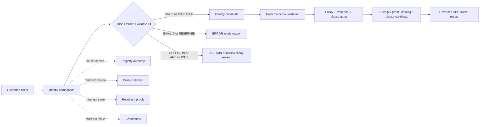

<!-- [KFM_META_BLOCK_V2]
doc_id: kfm://doc/NEEDS-VERIFICATION/packages-identity-src-identity-readme
title: Identity Import Namespace README
type: readme
version: v1
status: draft
owners: OWNER_TBD
created: NEEDS VERIFICATION — target file existed before this repair but contained only placeholder text
updated: 2026-06-14
policy_label: public
related: [packages/identity/README.md, packages/identity/src/README.md, packages/hashing/README.md, packages/README.md, docs/doctrine/directory-rules.md, docs/architecture/identity-and-spec-hash.md, docs/architecture/evidence-identity.md, contracts/, schemas/contracts/v1/, policy/, data/receipts/, data/proofs/, release/]
tags: [kfm, packages, identity, import-namespace, id-grammar, deterministic-identity, stable-id, object-identity, refs, lineage]
notes: ["Namespace guide for importable deterministic identity helpers.", "This namespace may expose ID grammar, namespace, object-id, reference, lineage, validation, and non-secret identifier-token helpers only.", "It must not own schemas, contracts, policy, registries, lifecycle data, receipts, proofs, release decisions, API routes, UI surfaces, credentials, secrets, or AI truth claims."]
[/KFM_META_BLOCK_V2] -->

<a id="top"></a>

# `identity` Import Namespace

Importable helper namespace for KFM deterministic identity primitives: ID grammar, stable object identifiers, namespace segments, reference parsing and formatting, lineage helpers, validation results, and non-secret identifier-token utilities.

<p>
  
  
  
  
  
</p>

> [!IMPORTANT]
> **Status:** PROPOSED import-namespace README  
> **Path:** `packages/identity/src/identity/README.md`  
> **Owning responsibility root:** `packages/`  
> **Package lane:** `packages/identity/`  
> **Source envelope:** `packages/identity/src/`  
> **Import namespace:** `identity` — NEEDS VERIFICATION against package metadata  
> **Repo implementation depth:** UNKNOWN for module files, exports, tests, package manager, CI workflows, API bindings, receipts, proof packs, release manifests, branch protections, and runtime behavior.

## Scope

`packages/identity/src/identity/` is the proposed importable namespace for reusable deterministic identity helper code.

It may contain pure, deterministic helpers for:

- KFM URI and ID grammar parsing and formatting;
- namespace, prefix, slug, object-family, and object-key helpers;
- stable ID construction from explicit source id, object role, temporal scope, spatial scope, digest value, schema version, and profile context;
- deterministic non-secret identifier tokens for object ids, local correlation ids, cursor ids, run labels, and test fixtures;
- collision, reserved-prefix, length, segment-count, and forbidden-character checks;
- EvidenceRef, SourceDescriptor ref, receipt ref, release ref, rollback ref, catalog id, triplet id, and domain object id adapters;
- alias, supersession, tombstone, correction, and migration-lineage helpers;
- coordination with `packages/hashing/` for digest-bearing identity without duplicating hash semantics;
- synthetic fixtures for valid, invalid, reserved, collision, supersession, and migration cases.

This namespace must not issue authentication credentials, API keys, sessions, secrets, permissions, or access-control decisions. Here, “token” means a non-secret identifier segment, not a security credential.

## Namespace contract

The namespace is a helper boundary, not an authority boundary.

| Namespace concern | Expected behavior | Authority home |
| --- | --- | --- |
| ID grammar | Parse, format, and validate identifiers from explicit grammar inputs. | Contracts and schemas |
| Namespaces | Preserve explicit namespace, object family, domain, version, and prefix. | Registry, contract, and schema homes |
| Object identity | Build candidate object ids from governed inputs. | Calling package plus schema/contract gates |
| Digest-bearing IDs | Consume digest values from `packages/hashing/` or explicit caller input. | `packages/hashing/` for digest semantics |
| References | Parse and format EvidenceRef, SourceDescriptor, receipt, release, rollback, catalog, and triplet refs. | Owning object homes and schemas |
| Lineage | Preserve aliases, supersession, tombstones, correction refs, and migration notes. | Receipts, release, and correction homes |
| Validation results | Return valid, invalid, reserved, collision, ambiguous, or migrated states. | Callers decide gate consequences |
| Fixtures | Produce synthetic stable examples for tests only. | `tests/` and `fixtures/`, not production registries |

## Expected modules

> [!NOTE]
> The tree below is PROPOSED. Confirm actual language, module names, package manager, and tests before treating these as implementation facts.

```text
packages/identity/src/identity/
├── README.md              # This file: namespace guide
├── __init__.py            # PROPOSED: export boundary if Python convention is confirmed
├── grammar.py             # PROPOSED: ID grammar helpers
├── namespaces.py          # PROPOSED: namespace and prefix helpers
├── object_id.py           # PROPOSED: deterministic object id helpers
├── token_string.py        # PROPOSED: non-secret identifier-token helpers
├── refs.py                # PROPOSED: ref parse/format helpers
├── lineage.py             # PROPOSED: alias/supersession/tombstone helpers
├── validation.py          # PROPOSED: grammar/collision validation results
├── fixtures.py            # PROPOSED: synthetic fixtures
└── py.typed               # PROPOSED if typed Python package convention is confirmed
```

Keep implementation smaller than this until schemas, tests, and callers prove the need.

## Allowed exports

| Export family | Examples | Rule |
| --- | --- | --- |
| Grammar helpers | `parse_kfm_id`, `format_kfm_id`, `normalize_id_text` | Preserve original and normalized forms separately. |
| Namespace helpers | `NamespaceRef`, `validate_namespace`, `reserved_prefixes` | Do not invent registry authority. |
| Object id helpers | `build_object_id`, `object_id_from_parts` | Use explicit source, scope, digest, and schema/profile inputs. |
| Identifier-token helpers | `make_identifier_token`, `validate_identifier_token` | Non-secret identifier strings only. |
| Reference helpers | `parse_evidence_ref`, `format_release_ref`, `parse_receipt_ref` | Parse/format only; do not retarget refs. |
| Lineage helpers | `make_alias_ref`, `make_supersession_ref`, `make_tombstone_ref` | Preserve audit-backed relation metadata. |
| Validation helpers | `validate_identity_candidate`, `detect_collision` | Return typed outcomes and reason codes. |
| Fixture helpers | `valid_id_fixture`, `reserved_prefix_fixture`, `collision_fixture` | Synthetic and public-safe only. |

## Disallowed exports

Do not export functions or constants that make this namespace an authority surface.

| Disallowed export | Why |
| --- | --- |
| `issue_credential`, `create_api_key`, `create_session`, `grant_permission` | Credentials and access decisions belong outside this helper namespace. |
| `write_registry`, `store_source_descriptor`, `write_catalog_record` | Registries and catalog stores are separate trust homes. |
| `write_receipt`, `write_proof`, `store_evidence_bundle` | Receipts/proofs/evidence storage are separate trust homes. |
| `approve_release`, `publish`, `promote`, `rollback_release` | Release authority belongs under `release/` and governed workflows. |
| `evaluate_policy`, `allow_public`, `deny_public` | Policy decisions belong to policy systems. |
| `read_raw`, `scan_source`, `poll_connector` | Source and lifecycle access belongs to connectors, pipelines, and data roots. |
| `assert_truth`, `match_person`, `infer_owner`, `make_claim` | Identity helpers are not truth, genealogy, ownership, or person-matching authority. |
| `call_model`, `generate_answer`, `summarize_truth` | Model calls and generated claims belong behind governed AI placement. |

## Import posture

Preferred imports, subject to package metadata verification:

```python
from identity.grammar import parse_kfm_id
from identity.object_id import build_object_id
from identity.validation import validate_identity_token
from identity.lineage import make_supersession_ref
```

Callers should treat identity output as a candidate for schema validation, policy gates, evidence checks, receipt/proof persistence, release review, and replay comparison. A well-formed identifier is not public truth by itself.

## Identity helper outcomes

| Helper outcome | Use when | Runtime posture |
| --- | --- | --- |
| `VALID` | ID grammar, namespace, scope, and supplied digest/profile are locally consistent. | Candidate for downstream schema, policy, evidence, receipt, and release checks. |
| `INVALID` | Grammar, prefix, length, segment count, or forbidden characters fail local checks. | `ERROR` or invalid validation report depending on caller. |
| `RESERVED` | Prefix, namespace, or token is reserved for another authority. | Fail closed; no silent retargeting. |
| `COLLISION` | Candidate id collides within the supplied collision scope. | Block write/promotion and require review. |
| `AMBIGUOUS` | Source, scope, alias, or object family is not precise enough. | `ABSTAIN` or review-required state. |
| `MIGRATED` | Superseding id or alias relation is explicit and audit-backed. | Candidate only; downstream gates still required. |

`VALID` is not proof of truth, evidence closure, admissibility, or release. It only means the identifier candidate is locally well-formed under supplied rules.

## Trust-boundary flow



## Development rules

1. Keep the namespace no-network by default.
2. Prefer pure functions with explicit inputs and outputs.
3. Keep identifier grammar, normalized form, original form, and validation result separate.
4. Preserve namespace, domain, object family, source role, temporal scope, spatial scope, digest/profile, and version fields supplied by callers.
5. Do not read from RAW, WORK, QUARANTINE, unpublished candidates, source systems, source credentials, canonical stores, identity registries, or model runtimes.
6. Do not write lifecycle data, receipts, proofs, release manifests, source registries, catalog records, API responses, credentials, permissions, or UI components.
7. Do not issue authentication credentials, sessions, secrets, permissions, or access-control decisions.
8. Do not create schemas, contracts, policy rules, source registries, API routes, public answers, or release decisions from this namespace.
9. Do not store raw provider payloads, secrets, private source records, living-person identity data, DNA/genomic data, or unrestricted sensitive context.
10. Return typed invalid states instead of silent grammar repair, random suffixing, collision overwrite, or alias hiding.
11. Add deterministic tests for every export and every negative path.
12. Keep fixtures synthetic, sanitized, and stable.
13. Preserve rollback and correction metadata supplied by callers when identity output can affect downstream publication candidates.

## Validation checklist

- [ ] Confirm this namespace exists in package metadata.
- [ ] Confirm the package import name is actually `identity`.
- [ ] Confirm `__init__` exports are intentional and minimal.
- [ ] Confirm tests cover `VALID`, `INVALID`, `RESERVED`, `COLLISION`, `AMBIGUOUS`, and `MIGRATED` helper states if implemented.
- [ ] Confirm tests cover valid ids, invalid grammar, reserved prefixes, collisions, alias/supersession, tombstones, deterministic object ids, and non-secret identifier strings.
- [ ] Confirm helpers do not import connectors, data stores, policy engines, release writers, model providers, API routers, UI components, credential systems, or receipt/proof stores.
- [ ] Confirm helpers do not access RAW/WORK/QUARANTINE, identity-provider systems, source registries, secrets, or unpublished candidate stores.
- [ ] Confirm public-facing API routes serialize identity-derived results through governed envelopes and do not expose sensitive identity internals.

Suggested inspection commands:

```bash
find packages/identity/src/identity -maxdepth 3 -type f | sort
git grep -n "from identity\|import identity" -- . 2>/dev/null || true
git grep -n "kfm://\|stable_id\|object_id\|source_id\|spec_hash\|identity\|token_string" -- packages/identity tests fixtures docs schemas contracts policy tools 2>/dev/null || true
```

## Rollback

Rollback is required if this namespace:

- becomes a parallel schema, contract, policy, source-registry, lifecycle-data, evidence/proof, receipt, release, API, UI, credential, identity-provider, model-runtime, or source-data authority;
- issues or stores credentials, secrets, sessions, bearer tokens, or access permissions;
- treats identifier existence as proof of truth, evidence closure, admissibility, or release;
- silently changes grammar, namespaces, aliases, collision behavior, or identifier-token rules;
- stores sensitive identity data, living-person identifiers, DNA/genomic context, private source records, or unrestricted sensitive context in package fixtures;
- lets public surfaces use package internals as authority instead of governed APIs.

Rollback target: revert the namespace-source PR, keep generated audit notes as review evidence, and file any authority drift in `docs/registers/DRIFT_REGISTER.md` or `docs/registers/VERIFICATION_BACKLOG.md` if the mounted repo uses those registers.

## Evidence boundary

| Source | Status | Supports | Limits |
| --- | --- | --- | --- |
| Current target file | CONFIRMED | `packages/identity/src/identity/README.md` existed and required replacement from placeholder content. | Did not prove namespace implementation maturity. |
| Parent source README | CONFIRMED repo doc | `packages/identity/src/` is bounded to deterministic identity helper source code. | Does not prove package metadata, imports, tests, or CI. |
| Parent package README | CONFIRMED repo doc | `packages/identity/` is a shared helper-code package for ID grammar, stable object identifiers, deterministic identity, and non-secret identifier-token helpers. | Does not prove source files or runtime bindings. |
| `packages/hashing/README.md` | CONFIRMED sibling package doc | `packages/hashing/` is the digest/canonicalization lane that identity helpers should not duplicate. | Does not prove identity implementation. |
| `docs/architecture/identity-and-spec-hash.md` | CONFIRMED repo doc | KFM identity posture, deterministic identity, `spec_hash`, and recompute-and-compare gates. | Some paths and package/tool placements remain PROPOSED or NEEDS VERIFICATION in that doc. |
| Current file-generation pass | CONFIRMED request | User-requested target path and README repair/replacement. | Does not inspect package metadata, tests, CI logs, dashboards, deployment posture, runtime behavior, or branch protection. |
