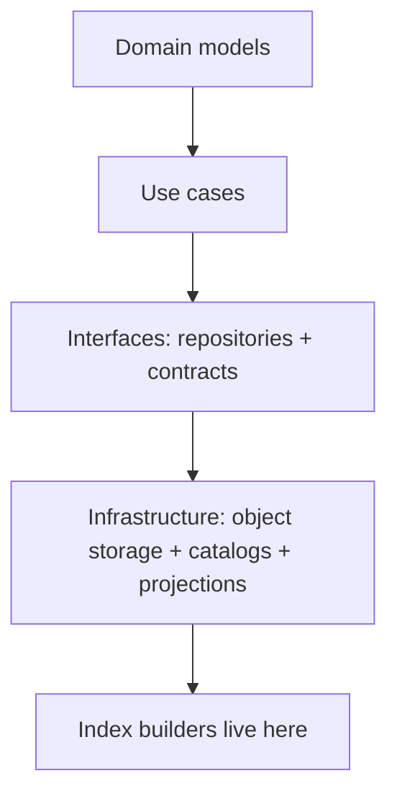
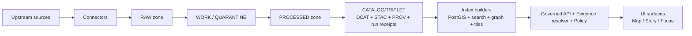
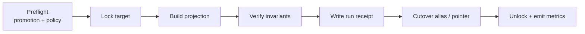

<!-- [KFM_META_BLOCK_V2]
doc_id: kfm://doc/966a97f1-1c1f-4d3d-b2cf-c7aaf00c11d6
title: packages/indexers
type: standard
version: v1
status: draft
owners: KFM Platform / Indexing
created: 2026-02-22
updated: 2026-02-26
policy_label: public
related:
  - ../../README.md
tags:
  - kfm
  - indexers
  - projections
  - provenance
  - governance
notes:
  - Indexers build rebuildable runtime projections from promoted artifacts + validated catalogs.
  - Repo commands, package manager, and exact layout are not confirmed here; verify and replace TODOs.
[/KFM_META_BLOCK_V2] -->

# packages/indexers
Rebuildable **runtime projections** (PostGIS/search/graph/tiles) derived from **promoted** KFM artifacts + validated catalogs.

**Status:** Draft • **Owners:** KFM Platform / Indexing


## Quick links
- [What belongs here](#what-belongs-here)
- [Architecture position](#architecture-position)
- [Truth path and trust membrane](#truth-path-and-trust-membrane)
- [Inputs, outputs, and preconditions](#inputs-outputs-and-preconditions)
- [Index families](#index-families)
- [Contracts](#contracts)
- [Run receipts and manifests](#run-receipts-and-manifests)
- [Running index builds](#running-index-builds)
- [Testing and gates](#testing-and-gates)
- [Governance and safety](#governance-and-safety)
- [Suggested package structure](#suggested-package-structure)
- [Minimum verification steps](#minimum-verification-steps)

---

## What belongs here
### ✅ Acceptable inputs (conceptual)
- Index builders / projection builders that **consume**:
  - **PROCESSED** artifacts (e.g., GeoParquet, PMTiles, COG, text corpora).
  - **CATALOG/TRIPLET** metadata (DCAT + STAC + PROV) that is validated and cross-linked.
  - Policy label + policy decision outputs (allow/deny + obligations).

### ✅ Acceptable outputs
- Rebuildable runtime projections:
  - PostGIS tables / indexes
  - search index (keyword / metadata, vector if enabled)
  - graph nodes/edges
  - tile bundles / caches
- **Index manifest** (describes produced targets)
- **Run receipt** (auditable, reproducible record of the build)

### ❌ Exclusions (must not go here)
- Canonical source truth (RAW/WORK/PROCESSED artifacts, catalogs, audit ledger).
- Any code path that enables **bypassing policy** (e.g., direct client access to DB/search/tiles).
- “Shadow datasets” (projections that become the only place a dataset “exists” operationally).

> **WARNING**
> Indexers are not sources of truth. If a projection is wrong, the fix is: repair upstream artifacts/catalogs/policy and rebuild.

---

## Architecture position
### Clean layering (posture)
Indexers are **infrastructure**, not domain logic. They should be invoked by orchestration (pipeline runner / job runner),
and should interact with storage/projections via repository/adapters (not ad-hoc direct wiring).



> **NOT CONFIRMED IN REPO**
> Whether indexers are packaged as `packages/indexers`, a backend module, or a service must be verified against repo layout.

---

## Truth path and trust membrane
### Canonical vs rebuildable stores
- **Canonical (must be preserved)**:
  - object storage (raw/work/processed artifacts)
  - catalogs (DCAT/STAC/PROV)
  - audit ledger (append-only)
- **Rebuildable projections (safe to drop + rebuild)**:
  - PostGIS tables derived from processed GeoParquet
  - search indexes derived from processed texts + metadata
  - graph edges derived from catalogs + entity resolution
  - tile bundles (PMTiles) derived from processed features

### Conceptual system flow


### Trust membrane reminder
- Clients never access storage/DB/search directly.
- All access to projections that matter for users must be mediated by the governed API (policy + evidence + auditing).
- Index jobs are internal, but still must record policy decisions + obligations applied.

---

## Inputs, outputs, and preconditions
### Inputs
Indexers SHOULD consume:
- PROCESSED artifacts (with checksums/digests)
- DCAT/STAC/PROV records (validated + cross-linked)
- policy label + policy decision result (allow/deny + obligations)

### Outputs
Indexers MUST produce:
- projection artifacts (DB/index/tiles)
- index manifest describing the produced projection
- run receipt suitable for audit ledger inclusion

### Preconditions (Promotion Contract alignment)
Indexers MUST NOT build from dataset versions that are not “promoted”.

**Fail-closed preflight checklist (minimum):**
- [ ] DatasetVersion identity exists and is immutable (stable spec hash)
- [ ] License + rights metadata are present (or dataset is quarantined)
- [ ] Policy label assigned; redaction/generalization plan exists when required
- [ ] DCAT/STAC/PROV validate + cross-links resolve
- [ ] Run receipts + checksums exist for producing runs
- [ ] Policy tests + contract tests pass for this dataset version

> **NOTE**
> If any precondition is missing, index build must fail closed and emit a receipt explaining why (policy-safe).

---

## Index families
> Names are illustrative. Actual indexers may differ.

| Family | Purpose | Typical inputs | Typical outputs | Canonical truth stays in |
|---|---|---|---|---|
| PostGIS | spatial queries, joins, bbox/time filters | processed GeoParquet + STAC extents | tables + spatial indexes | object store + catalogs |
| Search | keyword + metadata discovery | processed text + DCAT | search index | object store + catalogs |
| Graph | lineage + entity traversal | PROV + entity resolution | nodes/edges | catalogs + audit ledger |
| Tiles | map rendering | processed features | PMTiles / tile cache | processed artifacts |

> **TIP**
> Treat every index as disposable: design **safe rebuild**, **safe cutover**, **safe rollback**.

---

## Contracts
This section defines **minimum contract surfaces** for indexers. Adjust to your implementation language/runtime.

### Indexer identity rules (required)
- Each indexer has a **stable ID** used in receipts/manifests.
- IDs are part of auditability; rename only with a migration plan.

### Minimal indexer interface (template)
```ts
/**
 * NOT CONFIRMED IN REPO — template only.
 * You may implement in TS/Go/Python/etc.
 */
export interface Indexer {
  /** Stable ID used in receipts and logs (do not rename lightly). */
  id: string;

  /** Human-friendly description for operators and stewards. */
  description: string;

  /** Declare required artifacts/catalog facets up-front for preflight. */
  requiredInputs(): Array<{
    kind: "artifact" | "catalog";
    mediaType?: string;          // e.g., application/x-parquet
    catalogKind?: "dcat" | "stac" | "prov";
  }>;

  /**
   * Build the projection for one dataset version.
   * MUST emit a run receipt and return its run_id + output targets.
   */
  build(ctx: {
    datasetVersionId: string;
    policyContext: unknown;
    dryRun?: boolean;
  }): Promise<{
    runId: string;
    outputs: Array<{ target: string; digest: string }>;
  }>;

  /** Optional post-condition checks; MUST fail closed on invariant violations. */
  verify?(ctx: { datasetVersionId: string }): Promise<void>;
}
```

### Runner responsibilities (required behavior)
The runner/orchestrator SHOULD:
1. **Preflight**: confirm dataset version is promoted + policy-approved for indexing.
2. **Locking**: prevent concurrent writers to the same projection target.
3. **Execute**: run the indexer.
4. **Verify**: enforce post-conditions (health checks).
5. **Receipt + ledger**: persist run receipt and update audit pointers.

> **NOT CONFIRMED IN REPO**
> The runner could be CI, a workflow engine, or a Kubernetes Job operator. Document the actual mechanism once verified.

---

## Run receipts and manifests
### Run receipt (aligned shape)
Index builds MUST emit a run receipt. Treat it as a **governed record**: redact where required.

```json
{
  "kfm_run_receipt_version": "v1",
  "run_id": "kfm://run/2026-02-26T18:00:00Z.index_build.postgis.abcd1234",
  "run_type": "index_build",
  "dataset_slug": "example_dataset",
  "dataset_version_id": "2026-02.abcd1234",
  "spec_hash": "sha256:abcd1234...",

  "inputs": [
    {
      "artifact_id": "kfm://artifact/sha256:2222...",
      "zone": "processed",
      "uri": "s3://kfm-processed/example_dataset/2026-02.abcd1234/events.parquet",
      "digest": "sha256:2222..."
    },
    {
      "artifact_id": "kfm://artifact/sha256:stac...",
      "zone": "catalog",
      "uri": "s3://kfm-catalog/stac/collections/example_dataset.json",
      "digest": "sha256:stac..."
    }
  ],
  "outputs": [
    {
      "artifact_id": "kfm://artifact/sha256:pgdump...",
      "zone": "published",
      "path": "postgis://kfm/events?dataset_version_id=2026-02.abcd1234",
      "digest": "sha256:pgdump...",
      "media_type": "application/x-kfm-postgis-projection"
    }
  ],

  "validation": {
    "status": "pass",
    "reports": [
      { "name": "row_count_nonzero", "status": "pass" },
      { "name": "bbox_sane", "status": "pass" }
    ]
  },

  "policy": {
    "policy_label": "public",
    "decision_id": "kfm://policy_decision/xyz",
    "obligations": []
  },

  "environment": {
    "git_commit": "<commit>",
    "container_image": "sha256:<image_digest>",
    "runtime": "kubernetes",
    "parameters": {
      "indexer_id": "postgis/v1",
      "target_schema": "public"
    }
  },

  "timestamps": {
    "started_at": "2026-02-26T18:00:00Z",
    "ended_at": "2026-02-26T18:07:10Z"
  }
}
```

### Index manifest (PROPOSED)
A manifest makes rebuild + rollback safer by declaring exactly what targets were produced.

```json
{
  "kfm_index_manifest_version": "v1",
  "dataset_version_id": "2026-02.abcd1234",
  "indexer_id": "postgis/v1",
  "built_at": "2026-02-26T18:07:10Z",
  "inputs": [
    { "uri": "processed/events.parquet", "digest": "sha256:2222" }
  ],
  "outputs": [
    {
      "target": "postgis:kfm.events",
      "digest": "sha256:pgdump...",
      "health": { "rows": 12345, "indexes_ok": true }
    }
  ],
  "receipt_run_id": "kfm://run/2026-02-26T18:00:00Z.index_build.postgis.abcd1234"
}
```

> **NOT CONFIRMED IN REPO**
> Confirm whether manifests live in object storage, DB metadata tables, or catalogs as additional distributions.

---

## Running index builds
### Operational lifecycle (recommended)


### Safety rules (required)
- Builds MUST be idempotent **or** explain non-determinism in the receipt.
- Use **blue/green** or alias-based cutover when the projection is user-facing.
- Rollback MUST be possible without touching canonical artifacts.

> **NOT CONFIRMED IN REPO**
> Replace with real CLI/Make targets once toolchain is known (e.g., `pnpm`, `nx`, `make`, `just`, `go run`, etc.).

---

## Testing and gates
### Minimum local checks
- Unit tests for transforms/parsers/mappers.
- Determinism tests on fixed fixtures.
- Policy fixture tests (allow/deny + obligations).
- Smoke test per index family:
  - builds from a tiny processed dataset version,
  - verifies expected outputs exist,
  - emits a receipt.

### CI gates (fail-closed baseline)
- Contract validation: required inputs exist (artifacts + catalogs).
- Catalog validation: DCAT/STAC/PROV profiles validate + cross-links resolve.
- Policy checks: default deny if label/rights/obligations missing or unclear.
- Rebuild check: drop + rebuild projection from canonical sources.
- Receipt schema validation: receipts validate and are policy-safe.

---

## Governance and safety
### Policy labels + obligations
Indexers must respect policy decisions:
- If policy denies, do not build a public-facing projection.
- If obligations require generalization/redaction, either:
  - build a separate **policy-safe** projection/dataset version, or
  - fail closed (and explain why in the receipt).

### Logs and receipts are sensitive
- Treat receipts/logs as governed artifacts.
- Redact sensitive fields (e.g., precise coordinates, PII, credential-like URIs) per policy.
- Avoid leaking restricted existence through “helpful” error differences.

> **WARNING**
> Index projections can become “shadow datasets.” Ensure policy is enforced at the governed API boundary, and projection backends are not directly accessible.

---

## Suggested package structure
> **PROPOSED** layout (verify and adapt).

```text
packages/
  indexers/
    README.md
    src/
      index.ts
      registry.ts
      runner/
      indexers/
        postgis/
        search/
        graph/
        tiles/
    tests/
    package.json
```

---

## Minimum verification steps
Do the smallest checks needed to convert “NOT CONFIRMED IN REPO” → “CONFIRMED”:

1. **Repo layout**: confirm whether `packages/indexers` exists and what build system is used.
2. **Datastores**: list actual projection targets (PostGIS? OpenSearch? DuckDB? PMTiles?).
3. **Promotion predicate**: identify the concrete “dataset version promoted” signal used by pipelines.
4. **Receipt location**: confirm where run receipts live and how they are linked (catalog vs ledger).
5. **Policy enforcement**: confirm how obligations are delivered to index jobs (OPA sidecar? SDK? fixture files?).
6. **Cutover + rollback**: confirm the mechanism (aliases, views, versioned indices, object-store pointers).
7. **CI gates**: identify which checks are required status checks on main.

---

<p align="right"><a href="#packagesindexers">Back to top</a></p>