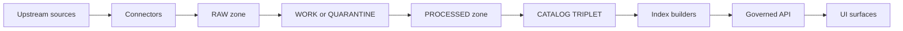

<!-- [KFM_META_BLOCK_V2]
doc_id: kfm://doc/966a97f1-1c1f-4d3d-b2cf-c7aaf00c11d6
title: packages/indexers
type: standard
version: v1
status: draft
owners: KFM Platform / Indexing
created: 2026-02-22
updated: 2026-02-22
policy_label: public
related:
  - ../../README.md
tags:
  - kfm
  - indexers
  - provenance
  - governance
notes:
  - Indexers build rebuildable runtime projections from promoted artifacts + catalogs.
  - Commands and exact repo layout must be verified; sections flagged “not confirmed in repo” are templates.
[/KFM_META_BLOCK_V2] -->

# packages/indexers
Rebuildable runtime projections built from **promoted** KFM artifacts and catalogs.

**Status:** Draft • **Owners:** KFM Platform / Indexing


## Navigation
- [Overview](#overview)
- [Data flow](#data-flow)
- [Responsibilities](#responsibilities)
- [Index families](#index-families)
- [Inputs and outputs](#inputs-and-outputs)
- [Indexer contract](#indexer-contract)
- [Running index builds](#running-index-builds)
- [Testing and gates](#testing-and-gates)
- [Governance and safety](#governance-and-safety)
- [Suggested structure](#suggested-structure)

---

## Overview
Indexers are **projection builders**:

- They transform **canonical, promoted** artifacts (and their catalogs/lineage) into **runtime-optimized projections**
  (e.g., spatial tables, text search, graph edges, tile caches).
- They are **rebuildable** by design. Dropping and rebuilding an index must not destroy source truth.

> **WARNING**
> Indexers are *not* sources of truth. The canonical truth is in the promoted artifacts + catalogs + audit ledger.
> If an index is wrong, the fix is: repair upstream artifacts/catalogs and rebuild the projection.

> **NOTE**
> The refined blueprint describes indexers as a module (`indexers`) in a modular monolith layout.
> This `packages/indexers` location implies a monorepo packaging choice, which must be verified against the repo.

---

## Data flow
This package sits between **CATALOG/TRIPLET** and the governed runtime surfaces.



---

## Responsibilities
### Must do
- **Build projections only from promoted artifacts** (processed + validated catalogs + run receipts + policy label).
- **Be idempotent**: the same inputs should yield the same outputs, or the run must record why.
- **Emit a run receipt** (inputs, outputs, digests, checks, and policy decisions).
- **Fail closed** when:
  - policy denies access or requires an obligation you can’t apply,
  - required artifacts/catalog links are missing,
  - validation or determinism checks fail.

### Must not do
- Must not mutate RAW/WORK/PROCESSED artifacts in-place.
- Must not invent metadata that should live in DCAT/STAC/PROV.
- Must not become a backdoor around the policy engine.

---

## Index families
The blueprint references these common index/projection families. Your actual implementation may add or rename them.

| Index family | Typical purpose | Typical inputs | Typical outputs | Canonical truth lives in |
|---|---|---|---|---|
| PostGIS | spatial queries, joins, bbox filters | processed GeoParquet + STAC extents | spatial tables + indexes | object store + catalogs |
| Search | keyword + metadata search | processed text corpora + DCAT | search index | object store + catalogs |
| Graph | entity & lineage traversal | PROV + entity resolution outputs | graph nodes/edges | catalogs + audit ledger |
| Tiles | fast map rendering | processed features | PMTiles or tile caches | processed artifacts |

> **TIP**
> When in doubt, treat *every* index as disposable: design safe rebuild, safe cutover, and safe rollback.

---

## Inputs and outputs
### Inputs
Indexers are expected to consume:
- **PROCESSED artifacts** in KFM-approved formats (e.g., GeoParquet, PMTiles, COG, text corpora).
- **CATALOG/TRIPLET** metadata (DCAT + STAC + PROV) that is validated and cross-linked.
- **Policy labels and obligations** for the dataset version and/or artifacts.

### Outputs
Indexers produce:
- runtime projections (tables, indexes, edges, tiles),
- an **index manifest** that describes what was created,
- a **run receipt** suitable for audit and reproducibility.

---

## Indexer contract
This section is a **template** for a minimal plugin contract and runner API.

### Contract goals
- Stable indexer identifiers for auditability
- Clear declared inputs/outputs
- Deterministic execution (or explicit recorded non-determinism)
- Policy-aware by construction

### Pseudocode interface
```ts
/**
 * Not confirmed in repo.
 * Language and module system are implementation choices.
 */
export interface Indexer {
  /** Stable ID used in receipts and logs (do not rename lightly). */
  id: string;

  /** Human-friendly description for operators and stewards. */
  description: string;

  /**
   * Declare what you need (artifact media types, catalog facets, etc).
   * Used to fail fast before any writes.
   */
  requiredInputs(): string[];

  /**
   * Build the projection for a single dataset version.
   * MUST emit a run receipt and return its ID or digest.
   */
  build(ctx: {
    datasetVersionId: string;
    policyContext: unknown;
    dryRun?: boolean;
  }): Promise<{ runId: string; outputs: Array<{ target: string; digest: string }> }>;

  /**
   * Optional: verify post-conditions (row counts, bbox sanity, index health).
   * Fail closed if invariants are violated.
   */
  verify?(ctx: { datasetVersionId: string }): Promise<void>;
}
```

### Minimal run receipt payload
```json
{
  "run_id": "kfm://run/2026-02-22T12:34:56Z.abcd",
  "component": "indexers/search",
  "dataset_version_id": "2026-02.abcd1234",
  "started_at": "2026-02-22T12:34:56Z",
  "ended_at": "2026-02-22T12:40:12Z",
  "policy": {
    "decision": "allow",
    "policy_label": "public",
    "obligations_applied": []
  },
  "inputs": [
    { "href": "processed/events.parquet", "digest": "sha256:..." },
    { "href": "catalog/stac/collection.json", "digest": "sha256:..." }
  ],
  "outputs": [
    { "target": "search:index/events", "digest": "sha256:..." }
  ],
  "checks": {
    "catalog_links_ok": true,
    "deterministic": true
  },
  "errors": []
}
```

---

## Running index builds
Index builds should be run by the platform’s pipeline runner or an equivalent orchestration layer.

Runner responsibilities:
1. **Preflight**: confirm dataset version is promoted and policy-approved for indexing.
2. **Locking**: prevent two writers from racing on the same projection target.
3. **Execute**: run the indexer; collect metrics.
4. **Verify**: post-conditions and health checks.
5. **Receipt**: write run receipt and update audit ledger pointers.

> **NOTE**
> CLI commands are not listed here because build tooling is not confirmed in repo.

---

## Testing and gates
### Minimum local checks
- Unit tests for transforms, parsers, and mapping logic.
- Determinism tests on stable fixtures.
- Policy fixtures tests for allow/deny and obligations.
- A smoke test for each index family that:
  - builds from a tiny processed dataset version,
  - verifies expected outputs exist,
  - emits a receipt.

### CI gates
A reasonable “fail closed” baseline:
- Contract validation: inputs exist; catalogs validate and cross-link.
- Policy checks: default-deny when policy label/rights are missing.
- Link checks: no dangling catalog references.
- Rebuild check: drop and rebuild projection from canonical sources.

---

## Governance and safety
Indexers must uphold the platform’s governance posture:
- Respect **policy labels** and **obligations**.
- Avoid leaking restricted geometry/attributes into public indexes.
- Treat logs as potentially sensitive; redact or minimize where required.

> **WARNING**
> Index projections can accidentally become “shadow datasets.”
> Ensure governed APIs enforce policy, and index contents cannot be accessed directly.

---

## Suggested structure
This is a **proposed** package layout. Verify against the actual repo.

```text
packages/
  indexers/
    README.md
    src/
      index.ts
      registry.ts
      runner/
      indexers/
        postgis/
        search/
        graph/
        tiles/
    tests/
    package.json
```

---

<p align="right"><a href="#packagesindexers">Back to top</a></p>
