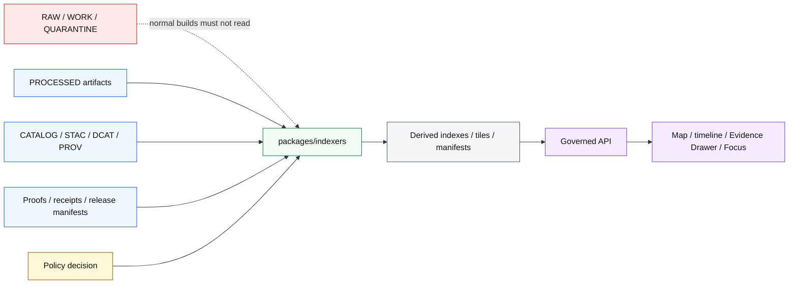

<!-- [KFM_META_BLOCK_V2]
doc_id: kfm://doc/TODO-packages-indexers-readme
title: packages/indexers
type: standard
version: v1
status: draft
owners: TODO(indexers package owner/steward)
created: 2026-04-23
updated: 2026-04-23
policy_label: TODO(verify public/restricted repository policy label)
related: [TODO(verify ../ingest/README.md), TODO(verify ../catalog/README.md), TODO(verify ../evidence/README.md), TODO(verify ../../apps/api/README.md), TODO(verify ../../ui/README.md), TODO(verify ../../web/README.md), TODO(verify ../../data/catalog/README.md), TODO(verify ../../data/proofs/README.md), TODO(verify ../../schemas/contracts/README.md), TODO(verify ../../policy/README.md)]
tags: [kfm, indexers, derived-artifacts, search, tiles, spatial-indexes, evidence]
notes: [Drafted from attached KFM doctrine and current-session no-mounted-repo scan; verify owners, scripts, package manager, CI, and actual subtree before publishing.]
[/KFM_META_BLOCK_V2] -->

# packages/indexers

Build rebuildable search, spatial, temporal, and tile indexes from governed KFM artifacts without letting derivatives become canonical truth.

<p align="left">
  
  
  
  
</p>

> [!IMPORTANT]
> **Status:** experimental  
> **Owners:** `TODO(indexers package owner/steward)`  
> **Path:** `packages/indexers/`  
> **Current implementation evidence:** **NEEDS VERIFICATION** — this README was prepared from KFM source doctrine and a session where the target Git repository was not mounted.

## Quick jumps

- [Scope](#scope)
- [Repo fit](#repo-fit)
- [Inputs](#inputs)
- [Exclusions](#exclusions)
- [Directory tree](#directory-tree)
- [Quickstart](#quickstart)
- [Index families](#index-families)
- [Governed flow](#governed-flow)
- [Operating contract](#operating-contract)
- [Definition of done](#definition-of-done)
- [Verification backlog](#verification-backlog)
- [Appendix](#appendix)

---

## Scope

`packages/indexers/` owns **rebuildable derivative surfaces** that make KFM faster and more navigable:

- search indexes for released datasets, places, claims, catalog records, and evidence references;
- spatial database indexes and materialized query accelerators where the repo adopts them;
- vector tile, PMTiles, or equivalent map delivery outputs;
- time-aware map indexes for event and observation surfaces;
- optional retrieval indexes for Focus Mode or other evidence-bounded lookup flows, if formally adopted.

The package does **not** decide what is true, public, sensitive, authoritative, or sufficiently reviewed. It builds acceleration and delivery surfaces from artifacts that have already passed the relevant KFM gates.

> [!NOTE]
> KFM treats indexes, tiles, search views, caches, graph projections, summaries, embeddings, and scenes as **derived** unless a future ADR explicitly promotes a specific artifact family with its own proof burden.

[Back to top](#packagesindexers)

---

## Repo fit

### Local role

| Field | Value |
|---|---|
| Local path | `packages/indexers/` |
| Package role | Derived index and tile builders |
| Primary truth label | **PROPOSED / NEEDS VERIFICATION** until the real subtree is inspected |
| Canonical data authority | Not here |
| Public client access | Not direct; public clients should use governed APIs and released artifacts |
| Release posture | Index outputs are publishable only when tied to release manifests, catalog closure, policy state, and receipts |

### Upstream and downstream path references

The paths below are **repo-fit references**, not confirmed links in this session. Convert them to final relative links after the mounted checkout confirms the actual tree.

| Direction | Candidate path | Why it matters | Status |
|---|---|---|---|
| Upstream | [`../ingest/README.md`](../ingest/README.md) | Ingest connectors and normalization jobs may produce processed artifacts that indexers consume. | NEEDS VERIFICATION |
| Upstream | [`../catalog/README.md`](../catalog/README.md) | Catalog builders produce STAC/DCAT/PROV records and catalog closure signals. | NEEDS VERIFICATION |
| Upstream | [`../evidence/README.md`](../evidence/README.md) | EvidenceRef and EvidenceBundle resolution must remain upstream of outward claims. | NEEDS VERIFICATION |
| Upstream | [`../../data/catalog/README.md`](../../data/catalog/README.md) | Catalog records are discovery/provenance inputs for many index builds. | NEEDS VERIFICATION |
| Upstream | [`../../data/proofs/README.md`](../../data/proofs/README.md) | Proofs, release manifests, validation reports, and receipts bind index outputs to governed release scope. | NEEDS VERIFICATION |
| Upstream | [`../../schemas/contracts/README.md`](../../schemas/contracts/README.md) | Schema contracts should define index manifests, layer manifests, runtime envelopes, and receipt shapes. | NEEDS VERIFICATION |
| Upstream | [`../../policy/README.md`](../../policy/README.md) | Policy determines whether an artifact may be indexed, generalized, withheld, or published. | NEEDS VERIFICATION |
| Downstream | [`../../apps/api/README.md`](../../apps/api/README.md) | Governed API should expose index-backed queries without leaking raw or canonical internals. | NEEDS VERIFICATION |
| Downstream | [`../../ui/README.md`](../../ui/README.md) / [`../../web/README.md`](../../web/README.md) | Map and shell surfaces may consume released layer manifests and tiles. | NEEDS VERIFICATION |
| Downstream | [`../governed-ai/README.md`](../governed-ai/README.md) or repo-native AI path | Retrieval indexes may support bounded AI only through governed evidence flow. | NEEDS VERIFICATION |

[Back to top](#packagesindexers)

---

## Inputs

Only governed, reviewable inputs belong here.

| Accepted input | What belongs here | Minimum evidence expected |
|---|---|---|
| Processed artifacts | GeoParquet, COG, PMTiles source material, normalized feature tables, time-series products, or repo-native processed formats. | Content digest, `spec_hash`, source refs, schema version. |
| Catalog records | STAC items/collections, DCAT datasets/distributions, PROV lineage records. | Cross-linked IDs and validation report. |
| Release artifacts | Release manifests, layer manifests, promoted dataset versions, proof packs. | Release ID, policy label, review state, artifact digests. |
| Evidence references | `EvidenceRef`, `EvidenceBundle` refs, claim envelope refs, correction refs. | Resolvable support path and no orphan evidence refs. |
| Index job specs | Declarative build instructions for search, spatial, tile, temporal, or retrieval indexes. | Input list, output family, rebuild strategy, failure policy. |
| Receipts and validation reports | Run receipts, validation reports, diff summaries, freshness reports. | Stable ID, timestamp, tool version, inputs, outputs, warnings. |
| Fixtures | Small valid/invalid offline examples for index builds and validators. | No network dependency; deterministic expected result. |

> [!WARNING]
> Any index build that reads from `RAW`, `WORK`, or `QUARANTINE` without an explicit, reviewed dry-run/testing exception should fail closed.

[Back to top](#packagesindexers)

---

## Exclusions

This package gets weaker if it tries to own upstream authority.

| Exclusion | Why it does not belong here | Where it should go instead |
|---|---|---|
| Source fetching and connector logic | Indexers should not reach out to source APIs or external files as a normal public path. | `packages/ingest/` or repo-native ingest lane |
| Canonical data modeling | Indexes accelerate; they do not define canonical entities, assertions, observations, or dataset versions. | `packages/domain/`, `contracts/`, `schemas/` |
| Source descriptors | Rights, cadence, source role, sensitivity, and update expectations must be declared before indexing. | `data/registry/` and source descriptor schemas |
| Policy authorship | Indexers should call or consume policy decisions, not invent them. | `policy/` and policy test fixtures |
| EvidenceBundle construction | Indexers may reference evidence but should not synthesize support objects as truth. | `packages/evidence/` or governed evidence resolver |
| Runtime route definitions | APIs may use indexes, but route behavior belongs to the API layer. | `apps/api/` or governed API package |
| UI styling and map interaction logic | Indexers may emit layer manifests or tiles, not renderer behavior. | `ui/`, `web/`, or app-shell packages |
| Secrets, credentials, tokens | Indexing must not depend on checked-in secrets. | Secret manager / deployment config |
| Public release decisions | A valid index does not mean an artifact is publishable. | Promotion gate, proof pack, release manifest |

[Back to top](#packagesindexers)

---

## Directory tree

### Expected shape

```text
packages/indexers/
├── README.md
├── search/
│   ├── README.md
│   └── TODO(repo-native search index builders)
├── spatial/
│   ├── README.md
│   └── TODO(PostGIS / spatial materialization helpers)
├── tiles/
│   ├── README.md
│   └── TODO(tile / PMTiles / layer-manifest builders)
├── temporal/
│   ├── README.md
│   └── TODO(time-aware event and observation indexers)
├── manifests/
│   └── TODO(index build specs and output manifests)
└── tests/
    └── TODO(valid and invalid offline fixtures)
```

### Current verified snapshot

**NEEDS VERIFICATION.** The target repository was not mounted in the session that produced this README. Before accepting this tree, run the inspection commands in [Quickstart](#quickstart) and replace the expected shape with the actual subtree.

[Back to top](#packagesindexers)

---

## Quickstart

Run these from the repository root after the real checkout is mounted.

### 1) Confirm the branch and local subtree

```bash
git status --short
git branch --show-current
find packages/indexers -maxdepth 4 -type f | sort
```

### 2) Inspect adjacent owner docs

```bash
for path in \
  packages/README.md \
  packages/ingest/README.md \
  packages/catalog/README.md \
  packages/evidence/README.md \
  data/catalog/README.md \
  data/proofs/README.md \
  schemas/contracts/README.md \
  policy/README.md
do
  [ -f "$path" ] && printf '\n--- %s ---\n' "$path" && sed -n '1,220p' "$path"
done
```

### 3) Check for index-specific contracts and fixtures

```bash
find contracts schemas policy tests data -maxdepth 5 -type f \
  | grep -Ei 'index|tile|layer_manifest|release_manifest|evidence_bundle|source_descriptor|receipt|runtime_response' \
  | sort
```

### 4) Identify repo-native build commands

```bash
find . -maxdepth 3 \
  \( -name package.json -o -name pyproject.toml -o -name Makefile -o -name go.mod -o -name Cargo.toml \) \
  -print
```

> [!TIP]
> Do not add package-manager-specific commands to this README until the mounted repo proves the package manager and test runner.

[Back to top](#packagesindexers)

---

## Index families

| Family | Derived output | Typical consumer | Required guardrail |
|---|---|---|---|
| Search index | Keyword, facet, place, claim, catalog, or evidence lookup index. | Governed API, review console, Focus retrieval path. | Must return resolvable IDs and evidence refs, not unsupported prose. |
| Spatial index | Database index, materialized spatial view, clipped feature projection, or bounding-box accelerator. | Governed API, analytics, map query endpoints. | Must not mutate canonical records or hide geometry validity failures. |
| Tile index | Vector tiles, PMTiles, tile metadata, layer manifests. | MapLibre shell, exports, story surfaces. | Must disclose derivative status and link to release/evidence objects. |
| Temporal index | Valid-time/event-time lookup structures and map-time layers. | Timeline, map-time filters, dossier views. | Must preserve time precision, uncertainty, and source role. |
| Retrieval index | Optional evidence-bounded retrieval accelerator for Focus Mode. | Governed AI adapter through API. | Must not expose raw model context or replace EvidenceBundle resolution. |
| Diff / rebuild index | Build deltas, stale-object maps, affected-output lists. | Promotion gate, correction workflow, rollback planning. | Must preserve previous release lineage and rebuild targets. |

[Back to top](#packagesindexers)

---

## Governed flow


```mermaid
flowchart LR
  raw[RAW / WORK / QUARANTINE]:::blocked
  processed[PROCESSED artifacts]:::source
  catalog[CATALOG / STAC / DCAT / PROV]:::source
  proofs[Proofs / receipts / release manifests]:::source
  policy[Policy decision]:::gate
  indexers[packages/indexers]:::work
  outputs[Derived indexes / tiles / manifests]:::derived
  api[Governed API]:::surface
  ui[Map / timeline / Evidence Drawer / Focus]:::surface

  raw -. "normal builds must not read" .-> indexers
  processed --> indexers
  catalog --> indexers
  proofs --> indexers
  policy --> indexers
  indexers --> outputs
  outputs --> api
  api --> ui

  classDef blocked fill:#ffe8e8,stroke:#b42318,color:#111;
  classDef source fill:#eef6ff,stroke:#175cd3,color:#111;
  classDef gate fill:#fff7d6,stroke:#b54708,color:#111;
  classDef work fill:#f0fdf4,stroke:#067647,color:#111;
  classDef derived fill:#f5f5f5,stroke:#475467,color:#111;
  classDef surface fill:#f4ebff,stroke:#6941c6,color:#111;
```

The important boundary is not the tool choice. It is the rule that **indexers build from governed artifacts and emit inspectable derivatives**.

[Back to top](#packagesindexers)

---

## Operating contract

### Index build job

Illustrative only. Replace with the repo-native schema once verified.

```yaml
job_id: kfm.index.tiles.hydrology-huc12.v1
status: proposed
index_family: tiles
derivative_class: released_derivative
inputs:
  release_manifest_ref: kfm://release/TODO
  catalog_refs:
    - kfm://stac/TODO
    - kfm://dcat/TODO
    - kfm://prov/TODO
  artifact_digests:
    - sha256:TODO
  evidence_refs:
    - kfm://evidence/TODO
policy:
  decision_ref: kfm://policy-decision/TODO
  public_release_allowed: false
  notes:
    - "TODO: update after policy gate is verified"
build:
  tool: TODO(repo-native builder)
  tool_version: TODO
  build_spec_hash: sha256:TODO
  deterministic: true
outputs:
  layer_manifest_ref: kfm://layer-manifest/TODO
  index_manifest_ref: kfm://index-manifest/TODO
  output_digests:
    - sha256:TODO
receipts:
  run_receipt_ref: kfm://run-receipt/TODO
  validation_report_ref: kfm://validation-report/TODO
failure_mode: fail_closed
```

### Non-negotiable rules

| Rule | Meaning |
|---|---|
| Derivatives are labeled | Every index output declares whether it is canonical, released derivative, operational cache, experimental projection, or discarded work state. |
| Inputs are governed | Normal builds read from processed/catalog/proof/published scope, not raw or quarantined stores. |
| Rebuildability is testable | A reviewer can rebuild or verify the output from declared inputs, specs, and manifests. |
| Evidence remains upstream | Search or retrieval can locate support, but EvidenceBundle resolution remains the stronger trust object. |
| Policy is not inferred | Missing policy decision, rights, sensitivity, review, or freshness state blocks publication-facing outputs. |
| Failures are retained | Bad rows, low-confidence joins, stale outputs, and invalid geometry are visible through receipts, validation reports, or quarantine references. |
| Clients stay thin | UI and Focus consumers receive prepared descriptors, tiles, indexes, and evidence refs through governed APIs. |

[Back to top](#packagesindexers)

---

## Validation expectations

| Check | Purpose | Minimum pass condition |
|---|---|---|
| Input manifest check | Ensure all inputs are declared and digest-addressed. | No undeclared artifacts; all digests resolve. |
| Schema check | Validate job specs, index manifests, layer manifests, receipts, and evidence refs. | Valid fixtures pass; invalid fixtures fail. |
| Policy check | Prevent public release of missing, stale, sensitive, or rights-unknown outputs. | Deny-by-default behavior is tested. |
| Geometry check | Prevent invalid or misleading spatial outputs. | Invalid geometries are repaired, rejected, or quarantined with reason. |
| CRS / support check | Preserve spatial support and coordinate-reference meaning. | Output CRS/support is explicit and compatible with consumer contract. |
| Temporal check | Preserve valid time, event time, freshness, and uncertainty. | Time precision and uncertainty are not flattened. |
| Rebuild check | Confirm deterministic or tolerance-bounded rebuilds. | Rebuilt digest matches or accepted tolerance report is emitted. |
| No-bypass check | Prevent indexers from becoming a public data path. | No direct raw/work/quarantine or source API reads in publication jobs. |

[Back to top](#packagesindexers)

---

## Definition of done

A change under `packages/indexers/` is ready for review when the following are true:

- [ ] The local subtree has been inspected and this README no longer contains stale path assumptions.
- [ ] The change declares whether it affects search, spatial, tile, temporal, retrieval, or rebuild/diff outputs.
- [ ] Every publication-facing output has an index manifest or layer manifest with derivative status.
- [ ] Every input artifact is digest-addressed and linked to catalog/proof/release state.
- [ ] No normal build reads from `RAW`, `WORK`, `QUARANTINE`, live source APIs, or unreviewed local files.
- [ ] Missing source role, rights, sensitivity, release state, or policy decision fails closed.
- [ ] Valid and invalid fixtures exist for the changed build path.
- [ ] Rebuild behavior is deterministic or tolerance-bounded and documented.
- [ ] The downstream API/UI consumer path is governed and does not treat index output as canonical truth.
- [ ] Rollback steps identify which derived outputs to remove, rebuild, or mark superseded.

[Back to top](#packagesindexers)

---

## Verification backlog

| Item | Why it matters | Status |
|---|---|---|
| Confirm this package exists in the target repo. | Avoid documenting a non-existent subtree as implemented. | NEEDS VERIFICATION |
| Confirm package manager and test runner. | Avoid false `npm`, `pnpm`, `pytest`, `go test`, or `make` commands. | NEEDS VERIFICATION |
| Confirm schema home for index manifests. | KFM materials repeatedly flag `contracts/` vs `schemas/` authority as unresolved. | NEEDS VERIFICATION |
| Confirm existing output families. | Search, tile, spatial, temporal, and retrieval outputs may have different homes. | NEEDS VERIFICATION |
| Confirm governed API consumer path. | Indexes should serve governed routes, not public direct reads. | NEEDS VERIFICATION |
| Confirm layer manifest shape. | Map surfaces need derivative status, source refs, evidence refs, policy state, and freshness. | NEEDS VERIFICATION |
| Confirm generated receipts/proofs exist. | Without emitted examples, proof-object implementation remains proposed. | NEEDS VERIFICATION |
| Confirm CI gates. | A README cannot claim enforcement until workflow/tests are inspected. | NEEDS VERIFICATION |

[Back to top](#packagesindexers)

---

## FAQ

### Can an indexer improve or correct canonical data?

No. Indexers can report invalid geometry, stale artifacts, mismatched digests, missing evidence refs, or suspicious joins. Correction belongs upstream through the governed lifecycle and release/correction path.

### Can the UI read tile files directly?

Not as the normal trust path. The UI may render released tiles or PMTiles, but public interaction should still resolve through governed API contracts, layer manifests, evidence refs, freshness state, and policy-visible payloads.

### Can Focus Mode use a retrieval index?

Yes, if formally adopted. The retrieval index must stay a rebuildable accelerator and must not replace EvidenceBundle resolution, citation validation, policy checks, or finite `ANSWER` / `ABSTAIN` / `DENY` / `ERROR` outcomes.

### Are indexes release artifacts?

Sometimes. Some indexes are operational caches; some are released derivatives. The output manifest must say which one it is.

[Back to top](#packagesindexers)

---

## Appendix

<details>
<summary>Truth-label legend</summary>

| Label | Meaning in this README |
|---|---|
| CONFIRMED | Verified in the mounted repo or directly supported by current-session evidence. |
| INFERRED | Strongly suggested by KFM doctrine or adjacent evidence, but not directly verified here. |
| PROPOSED | Recommended design or documentation shape not yet proven in implementation. |
| UNKNOWN | Not verified strongly enough to state as fact. |
| NEEDS VERIFICATION | Specific check required before publishing or relying on the claim. |

</details>

<details>
<summary>Pre-publish checklist for maintainers</summary>

- [ ] `packages/indexers/` exists in the checkout.
- [ ] The owner line is replaced with the actual steward or team.
- [ ] The metadata block has a real `doc_id`, policy label, and verified related paths.
- [ ] Broken or speculative relative links are fixed.
- [ ] Directory tree matches the real subtree.
- [ ] Package-manager commands are added only after verification.
- [ ] Any referenced schemas, policies, and fixtures exist or are marked as proposed.
- [ ] README badges reflect the actual repo status.
- [ ] Mermaid diagram still reflects real responsibility boundaries.
- [ ] No claim says “implemented,” “enforced,” “published,” or “CI-checked” without evidence.

</details>

[Back to top](#packagesindexers)
