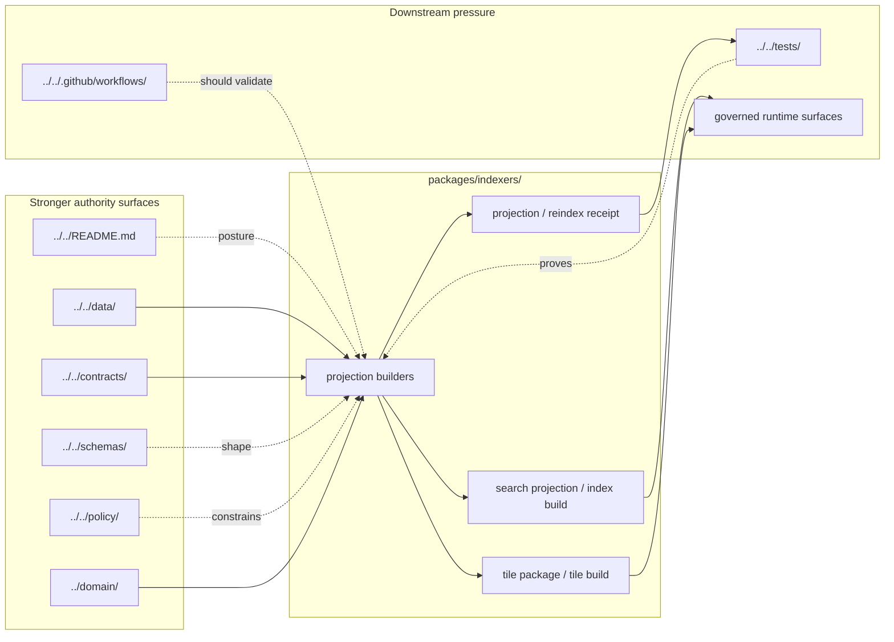

<!-- [KFM_META_BLOCK_V2]
doc_id: kfm://doc/<NEEDS-VERIFICATION-UUID>
title: packages/indexers
type: standard
version: v1
status: review
owners: @bartytime4life
created: YYYY-MM-DD
updated: YYYY-MM-DD
policy_label: <NEEDS-VERIFICATION>
related: [../README.md, ../../README.md, ../../contracts/README.md, ../../schemas/README.md, ../../policy/README.md, ../../data/README.md, ../../tests/README.md, ../../.github/workflows/README.md]
tags: [kfm, packages, indexers]
notes: [current public main shows a README-only subtree here, owner reflects current /packages/ fallback in .github/CODEOWNERS, top-level schema authority remains upstream, doc_id and dates need verification]
[/KFM_META_BLOCK_V2] -->

# packages/indexers

Shared internal builders for rebuildable search, tile, and other release-linked runtime projections in Kansas Frontier Matrix.

> **Status:** experimental  
> **Doc state:** review  
> **Owners:** `@bartytime4life` *(current `/packages/` fallback in `.github/CODEOWNERS`)*  
> **Path:** `packages/indexers/README.md`  
> **Repo fit:** child package guide beneath [`../README.md`](../README.md); upstream authority from [`../../README.md`](../../README.md), [`../../contracts/README.md`](../../contracts/README.md), [`../../schemas/README.md`](../../schemas/README.md), [`../../policy/README.md`](../../policy/README.md), and [`../../data/README.md`](../../data/README.md); downstream verification pressure from [`../../tests/README.md`](../../tests/README.md) and [`../../.github/workflows/README.md`](../../.github/workflows/README.md)  
> **Current public snapshot used for this revision:** `packages/indexers/` was visible on `main` and rendered as `README.md` only  
>         
> **Quick jumps:** [Scope](#scope) · [Repo fit](#repo-fit) · [Accepted inputs](#accepted-inputs) · [Exclusions](#exclusions) · [Current verified snapshot](#current-verified-snapshot) · [Directory tree](#directory-tree) · [Quickstart](#quickstart) · [Usage](#usage) · [Diagram](#diagram) · [Operating tables](#operating-tables) · [Task list / definition of done](#task-list--definition-of-done) · [FAQ](#faq) · [Appendix](#appendix)

> [!IMPORTANT]
> Current public repo evidence confirms the **directory surface** and this README path.
> It does **not** yet confirm package-local code, manifests, tests, engines, or runtime wiring beneath `packages/indexers/`.

> [!NOTE]
> This README keeps **current visible state** separate from **doctrine-led intended role**.
> The public tree that anchored this revision proved the package boundary more strongly than the implementation underneath it.

## Scope

`packages/indexers/` is the shared internal package boundary for **derived, rebuildable indexing work**: search projections, spatial index builders, vector-tile or tile-package builders, and related freshness or reindex support logic.

In KFM terms, this package exists to help keep projection work reusable **without** letting it drift into sovereign truth, hidden runtime ownership, or public-facing API behavior.

This package should help preserve:

- authoritative-versus-derived separation
- release linkage and freshness visibility
- fail-closed behavior when release or policy context is missing
- no quiet client-to-store or client-to-truth shortcut
- reusable internal logic instead of app-local duplication

### Evidence posture used here

| Label | Meaning in this README |
|---|---|
| **CONFIRMED** | Supported by live repo surfaces inspected for this revision or by stable KFM doctrine carried into adjacent repo docs |
| **INFERRED** | Strongly suggested by neighboring repo docs and current package-boundary language, but not re-proven from deeper package files in this task |
| **PROPOSED** | Recommended package-local structure or behavior that fits KFM doctrine but is not stated as current branch fact |
| **UNKNOWN / NEEDS VERIFICATION** | Not established strongly enough from the inspected repo state to present as mounted implementation reality |

## Repo fit

**Path:** `packages/indexers/README.md`

### Upstream, sibling, and downstream surfaces

| Direction | Surface | Why it matters here |
|---|---|---|
| Upstream | [`../../README.md`](../../README.md) | Root project posture: governed truth path, trust membrane, and repo-wide verification framing |
| Upstream | [`../README.md`](../README.md) | Parent package contract; this is the strongest live README baseline for what `indexers` is allowed to own |
| Upstream | [`../../contracts/README.md`](../../contracts/README.md) | Indexers must consume stronger contract definitions rather than inventing their own canonical shapes |
| Upstream | [`../../schemas/README.md`](../../schemas/README.md) | If projection builders need machine-readable receipt or derivative metadata shapes, canonical schema authority still belongs upstream rather than in this package |
| Upstream | [`../../policy/README.md`](../../policy/README.md) | Repo-authoritative policy stays at top level; indexers must remain policy-constrained, not policy-sovereign |
| Upstream | [`../../data/README.md`](../../data/README.md) | Derived projections should stay linked to released authoritative scope rather than detached internal convenience state |
| Sibling | [`../domain/README.md`](../domain/README.md) | Stable domain vocabulary and invariants belong there, not here |
| Sibling | [`../catalog/README.md`](../catalog/README.md) | Catalog / triplet closure logic belongs there, even when indexers consume release-linked catalog state |
| Sibling | [`../evidence/README.md`](../evidence/README.md) | Evidence resolution is a separate package seam |
| Sibling | [`../ingest/README.md`](../ingest/README.md) | Source admission, normalization, and receipt-bearing intake belong there |
| Sibling | [`../policy/README.md`](../policy/README.md) | Shared internal policy-support code belongs there, not in indexers |
| Downstream | [`../../tests/README.md`](../../tests/README.md) | Indexer behavior should eventually be pressured by fixtures, stale-path checks, and negative-path verification |
| Downstream | [`../../.github/workflows/README.md`](../../.github/workflows/README.md) | Merge and promotion automation should later validate indexer behavior, even though the public workflow lane was still README-only when this revision was anchored |

### Working boundary

Use `packages/indexers/` when the logic is:

1. shared across more than one governed runtime or projection path
2. non-deployable on its own
3. clearly about **derived projection construction**, not source admission, evidence resolution, catalog closure, or deployable API/UI behavior
4. easier to review as a named internal boundary than as app-local glue

## Accepted inputs

Content belongs in `packages/indexers/` when it is shared internal logic for:

- rebuilding search projections from promoted or otherwise release-linked scope
- building or refreshing map / tile projection products from governed release inputs
- spatial indexing helpers, query-preparation helpers, or projection-build orchestration that serve governed runtime surfaces **indirectly**
- freshness, reindex, or projection-receipt support logic
- engine adapters that wrap concrete index backends without making those backends the source of truth
- package-local tests and fixtures that prove derived-projection behavior

> [!TIP]
> Examples seen in source-mediated inventories include **occurrence index writers / compaction jobs**, **spatial search indexes**, and **map tile generation**.
> Treat those as placement guidance, not as proof that the checked-out branch already contains a specific backend mix.

## Exclusions

| This does **not** belong in `packages/indexers/` | Put it here instead |
|---|---|
| Canonical dataset truth, release manifests, or authoritative outward metadata | [`../../data/README.md`](../../data/README.md) and the owning release-bearing surface |
| Shared OpenAPI, schema, or vocabulary authority | [`../../contracts/README.md`](../../contracts/README.md) and [`../../schemas/README.md`](../../schemas/README.md) |
| Repo-authoritative policy bundles, fixtures, and deny-by-default gates | [`../../policy/README.md`](../../policy/README.md) |
| Source connectors, raw admission logic, normalization pipelines | [`../ingest/README.md`](../ingest/README.md) |
| Evidence resolution, evidence redaction, bundle shaping | [`../evidence/README.md`](../evidence/README.md) |
| Stable semantic core, domain vocabulary, invariants | [`../domain/README.md`](../domain/README.md) |
| Catalog closure generation and outward catalog validation as authority | [`../catalog/README.md`](../catalog/README.md) |
| Deployable HTTP routes, workers, CLIs, or UI entrypoints | deployable app/runtime surfaces, not `packages/indexers/` |
| Ad hoc caches or summaries detached from release linkage | nowhere; rebuild from stronger released scope or do not publish |

> [!WARNING]
> `packages/indexers/` must never become a hidden second source of truth.
> If a change makes this package authoritative over facts, rights, policy, or public release state, the boundary is drifting.

## Current verified snapshot

| Evidence used for this revision | Status | Reading rule |
|---|---|---|
| `packages/indexers/` exists on public `main` | **CONFIRMED** | Safe to document the package boundary |
| The public directory view used for this revision showed `README.md` only | **CONFIRMED** | Do not imply deeper files unless the checked-out branch proves them |
| Parent `packages/README.md` carries the strongest live package-boundary contract | **CONFIRMED** | Treat it as the baseline for this child README |
| `/packages/` owner fallback is `@bartytime4life` | **CONFIRMED** | Use until narrower path ownership is introduced |
| Package-local code, manifests, tests, or runtime adoption | **UNKNOWN** | Keep implementation depth visibly bounded |
| Exact backend engines on the checked-out branch | **NEEDS VERIFICATION** | Keep examples generic or explicitly labeled as examples |

## Directory tree

### Current confirmed snapshot

```text
packages/indexers/
└── README.md
```

> [!NOTE]
> The tree above is intentionally strict.
> It documents the package surface used to anchor this revision, not a hoped-for subtree.

### Reading rule

Use the tree above for **current surface truth**.
Do not silently convert “package exists” into “package is implemented.”

## Quickstart

### 1) Inspect the package surface first

```bash
find packages/indexers -maxdepth 4 -type f | sort
sed -n '1,240p' packages/indexers/README.md
```

### 2) Recheck the stronger package and repo contracts

```bash
sed -n '1,260p' packages/README.md
sed -n '1,220p' README.md
sed -n '1,220p' contracts/README.md
sed -n '1,220p' schemas/README.md
sed -n '1,220p' policy/README.md
sed -n '1,220p' data/README.md
sed -n '1,220p' tests/README.md
sed -n '1,220p' .github/workflows/README.md
```

### 3) Look for deeper package-local implementation before upgrading claims

```bash
find packages/indexers -maxdepth 5 \
  \( -name package.json -o -name pyproject.toml -o -name Cargo.toml -o -name go.mod -o -name tsconfig.json \) \
  | sort

find packages/indexers -maxdepth 5 -type d | sort
```

### 4) Sanity-check vocabulary that often touches indexers

```bash
grep -RInE \
  "search projection|occurrence_index|compaction|tile package|ProjectionBuildReceipt|reindex|freshness|vector tile|PMTiles|MBTiles" \
  packages docs contracts schemas policy data tests 2>/dev/null || true
```

### 5) Before adding code here, answer this

```text
Is this shared internal logic?
Is it non-deployable on its own?
Will it build only derived outputs?
Can every outward artifact stay release-linked and rebuildable?
Would this be misleading if a reviewer assumed it was authoritative truth?
```

## Usage

### Build outward from stronger released scope

Indexer logic should consume stronger authority surfaces and build **derived** outputs outward.
If release linkage is missing, unclear, stale, or policy-ineligible, the safer outcome is to stop, mark stale, rebuild, or refuse publication—not to guess.

### Keep outputs rebuildable

Search indexes, graph or vector indexes, and tile packages should stay disposable and reproducible from stronger scope.
A derived projection that cannot explain what release it came from is a trust problem, not a convenience.

### Keep backend choice behind a boundary

If this package later wraps SQL DDL, vector-tile builders, PMTiles tooling, search backends, or other projection engines, keep the engine choice behind a narrow internal interface.
The package should own **projection behavior and boundary discipline**, not platform mythology.

### Keep schema authority upstream

If a projection builder needs machine-readable receipt, event, or derivative metadata shapes, import or reference the stronger top-level contract / schema lanes.
Do not fork canonical schema text into this package just because a backend helper happens to need it.

### Keep deployable concerns out

Do not accumulate:

- route handlers
- app startup or environment ownership
- direct user-facing runtime entrypoints
- source admission behavior
- authoritative policy bundles
- public release authority

### Update both layers when the boundary changes

If `packages/indexers/` gains real code, tests, fixtures, or subdirectories, update this file **and** [`../README.md`](../README.md) in the same governed change.

## Diagram


```mermaid
flowchart LR
  subgraph Authority["Stronger authority surfaces"]
    ROOT["../../README.md"]
    DATA["../../data/"]
    CONTRACTS["../../contracts/"]
    SCHEMAS["../../schemas/"]
    POLICY["../../policy/"]
    DOMAIN["../domain/"]
  end

  subgraph IDX["packages/indexers/"]
    BUILD["projection builders"]
    SEARCH["search projection / index build"]
    TILE["tile package / tile build"]
    RECEIPT["projection / reindex receipt"]
  end

  subgraph Downstream["Downstream pressure"]
    TESTS["../../tests/"]
    GATES["../../.github/workflows/"]
    RUNTIME["governed runtime surfaces"]
  end

  ROOT -. posture .-> BUILD
  DATA --> BUILD
  CONTRACTS --> BUILD
  SCHEMAS -. shape .-> BUILD
  POLICY -. constrains .-> BUILD
  DOMAIN --> BUILD

  BUILD --> SEARCH
  BUILD --> TILE
  BUILD --> RECEIPT

  SEARCH --> RUNTIME
  TILE --> RUNTIME
  RECEIPT --> TESTS
  TESTS -. proves .-> BUILD
  GATES -. should validate .-> BUILD
```

> [!NOTE]
> The diagram shows **boundary direction and responsibility**, not a scraped import graph from a mounted checkout.

## Operating tables

### Package contract at a glance

| Concern | Working rule |
|---|---|
| Inputs | Use stronger released or release-linked scope, not ad hoc unpublished convenience state |
| Outputs | Emit derived, rebuildable projections only |
| Public access | Stay behind governed runtime surfaces; this package is not a public API |
| Freshness | Prefer rebuild, mark stale, or withdraw over bluffing that a projection is current |
| Schema authority | Reference top-level contracts / schemas instead of forking local canonical schema truth |
| Authority | Never become the source-of-record for truth, rights, policy, or outward release state |
| Current public tree used for revision | README-only |
| Exact engine mix | `NEEDS VERIFICATION` |

### Doctrine-led object map *(placement guidance, not current file inventory)*

| Object family | How indexers may relate to it | Governing rule |
|---|---|---|
| search projection / graph / vector index | build or refresh a derived projection | keep release linkage and reindex receipt visible |
| tile package (`PMTiles`, `MBTiles`, raster pyramid, vector tiles) | build, rebuild, or republish derived map delivery artifacts | keep release linkage, freshness basis, and projection receipt visible |
| projection / reindex receipt | record operational proof of what build ran | explain the derived build without rewriting authoritative truth |
| stale / superseded projection state | expose or honor it in downstream behavior | do not silently serve withdrawn or superseded state as current |

## Task list / definition of done

- [ ] This README still matches the actual package surface on the checked-out branch
- [ ] Any new code here builds only **derived** outputs
- [ ] Every outward projection is linked to stronger released scope or clearly blocked from publication
- [ ] No canonical contract, schema, policy bundle, or governed data artifact was forked into this package
- [ ] Missing release linkage, policy context, or freshness basis fails closed rather than falling back to guesswork
- [ ] Tests or fixtures were added when indexer behavior changed
- [ ] `packages/README.md` was updated if this package’s boundary, name, or role changed
- [ ] This file stops calling the package README-only once deeper files actually exist

### Review gates worth applying

- [ ] Can a reviewer tell why this belongs in `packages/indexers/` instead of `ingest`, `catalog`, `evidence`, `domain`, or a deployable surface?
- [ ] Does the change keep projection work clearly **derived**?
- [ ] Would a stale, missing, withdrawn, or superseded release be handled visibly?
- [ ] Does this package avoid becoming a shadow API, shadow policy layer, or shadow source of truth?

## FAQ

### Is `packages/indexers/` authoritative truth?

No.
Its role is derived projection work only.
If something becomes the authoritative source of record, it has crossed the boundary.

### Can indexers build directly from RAW or WORK data?

Not as the package’s outward contract.
The stronger KFM rule is that projection builders should rebuild from promoted or otherwise release-linked scope, not from unpublished candidate material or request-time improvisation.

### Do tiles or search indexes become sovereign truth once they are fast and useful?

No.
Speed does not change authority.
Derived projections remain rebuildable helpers unless explicitly promoted through stronger governance.

### Should this package own canonical schemas for receipts or runtime responses?

No.
If a build helper needs those shapes, point to the stronger top-level contract / schema lanes and keep package-local code subordinate to them.

### Where should code go if it is really about source admission, evidence resolution, or catalog closure?

Use the sibling package whose boundary already names that job:

- source admission and normalization → [`../ingest/README.md`](../ingest/README.md)
- evidence resolution and redaction-safe bundle shaping → [`../evidence/README.md`](../evidence/README.md)
- catalog / triplet build and validation logic → [`../catalog/README.md`](../catalog/README.md)
- stable semantic vocabulary and invariants → [`../domain/README.md`](../domain/README.md)

### Why is this README more detailed than the current public subtree?

Because the public package surface that anchored this revision was still README-first.
The point of this file is to make the boundary legible **without** pretending that deeper implementation has already been proven.

## Appendix

<details>
<summary><strong>Examples, target shape, and naming cautions</strong></summary>

### Examples mentioned in source-mediated inventories

Examples that fit this package boundary include:

- occurrence index writers / compaction jobs
- spatial search indexes
- vector-tile or tile-package generation helpers

Treat those as **placement guidance** for the package, not as branch-proven implementation fact.

### PROPOSED future shape once this package stops being README-only

```text
packages/indexers/
├── README.md
├── search/          # occurrence index writers, search / vector / graph index builders
├── tiles/           # tile package and vector-tile build helpers
├── adapters/        # engine adapters kept behind narrow internal interfaces
├── receipts/        # projection / reindex receipt helpers
└── tests/           # package-local fixtures and negative-path checks
```

Use this only after actual files land.
Until then, keep current-state claims conservative.

### Naming rule

Prefer crisp sub-boundaries such as `search/`, `tiles/`, `adapters/`, or `receipts/`.
Avoid vague buckets such as `common/`, `misc/`, or `utils/`.

</details>

[Back to top](#packagesindexers)
