<!-- [KFM_META_BLOCK_V2]
doc_id: kfm://doc/b47fa337-9fd3-4f84-ac86-37a0b6c80d01
title: packages/ingest
type: standard
version: v1
status: draft
owners: kfm-platform (TBD)
created: 2026-02-22
updated: 2026-02-22
policy_label: restricted
related:
  - packages/catalog/README.md (TBD)
  - packages/policy/README.md (TBD)
  - docs/governance/promotion-contract.md (TBD)
tags: [kfm, ingest, pipelines, provenance, policy, promotion-contract]
notes:
  - This README is a contract surface. If implementation diverges, either update code or bump schemas + revise this doc.
  - Commands/paths marked “TBD / not confirmed in repo” must be verified before relying on them.
[/KFM_META_BLOCK_V2] -->

# `packages/ingest`

> Ingestion runner + connectors for KFM’s **truth path**: **Upstream → RAW → WORK/QUARANTINE → PROCESSED → CATALOG/TRIPLET** (DCAT + STAC + PROV + run receipts).  
> Everything is **fail-closed**, **audit-backed**, and **policy-aware**.

**Status:** draft • **Owners:** `kfm-platform` (TBD)


---

## Quick navigation

- [Package layout](#package-layout)
- [What this package does](#what-this-package-does)
- [Architecture and trust membrane](#architecture-and-trust-membrane)
- [Truth-path zones and artifacts](#truth-path-zones-and-artifacts)
- [Promotion Contract gates](#promotion-contract-gates)
- [How to run ingestion](#how-to-run-ingestion)
- [Add a new connector](#add-a-new-connector)
- [Testing and CI gates](#testing-and-ci-gates)
- [Security, licensing, and sensitivity](#security-licensing-and-sensitivity)
- [Troubleshooting](#troubleshooting)
- [Glossary](#glossary)
- [Appendix: contract templates](#appendix-contract-templates)

---

## Package layout

> **TBD / not confirmed in repo:** Update this tree by running `tree packages/ingest -L 3` (or equivalent) and reflecting the actual paths.

```text
packages/ingest/
├─ README.md
├─ package.json                  # (TBD)
├─ src/                          # (TBD)
│  ├─ cli/                       # CLI entrypoint(s) (TBD)
│  ├─ runner/                    # Orchestration: zone writes + gating (TBD)
│  ├─ connectors/                # Source-specific fetchers/watchers (TBD)
│  ├─ normalization/             # Deterministic transforms (TBD)
│  ├─ qa/                        # Validation + QA report emitters (TBD)
│  ├─ manifests/                 # Receipt/manifest emitters (TBD)
│  ├─ catalogs/                  # DCAT/STAC/PROV emitters or adapters (TBD)
│  ├─ policy/                    # Policy adapters + obligation appliers (TBD)
│  └─ hashing/                   # Canonicalization + spec_hash utilities (TBD)
├─ schemas/                      # JSON Schemas + profiles (TBD)
├─ fixtures/                     # Deterministic fixtures for CI (TBD)
└─ test/                         # Unit/contract/integration tests (TBD)
```

### Related components

This package typically depends on (or is depended on by) the following KFM components:

- **Catalog generator** (DCAT/STAC/PROV emit + validators)
- **Policy engine** (OPA/Rego bundles + fixtures-driven tests)
- **Evidence resolver** (resolves EvidenceRefs to EvidenceBundles)
- **Index builders** (rebuild projections from promoted artifacts)

Update these links once package names/paths are confirmed in-repo.

---

## What this package does

### Responsibilities (contract-level)

This package is responsible for **getting data into KFM’s canonical truth path** and producing the artifacts required to safely serve it downstream:

1. **Acquire** from upstream sources via connectors/watchers
   - Snapshot **exact upstream responses/files**
   - Capture **license/terms at time of fetch**
   - Produce **signed/logged acquisition evidence** (when enabled)

2. **Write immutable RAW**
   - Store raw artifacts **append-only**
   - Compute and store **digests for every artifact**

3. **Normalize + QA in WORK / QUARANTINE**
   - Convert to normalized representations (e.g., GeoParquet / JSONL / COG)
   - Emit **QA reports** (schema, geometry, completeness, drift thresholds)
   - Emit **candidate redactions/generalizations** when policy requires

4. **Write publishable PROCESSED artifacts**
   - Only KFM-approved formats
   - Digests + derived runtime metadata (bbox, temporal extent, counts)

5. **Emit and validate the catalog triplet**
   - **DCAT** (dataset-level)
   - **STAC** (asset-level for spatiotemporal datasets)
   - **PROV** (lineage)
   - Plus **run receipts** and (optionally) supply-chain attestations

6. **Enforce the Promotion Contract (fail-closed)**
   - Promotion to runtime surfaces is blocked unless required gates pass.

### Non-goals

- Serving data to external clients (that happens via the Governed API)
- UI concerns beyond developer ergonomics (e.g., producing receipts that a UI can render)
- Long-term query/index performance (index builders handle rebuildable projections)

---

## Architecture and trust membrane

KFM treats ingestion outputs (artifacts + catalogs + provenance) as canonical. Databases/indexes are rebuildable projections derived from promoted artifacts.

```mermaid
flowchart LR
  U[Upstream sources] --> C[Connectors / Watchers]
  C --> R[RAW zone\nimmutable artifacts + checksums]
  R --> W[WORK / QUARANTINE\nnormalize + QA + redaction candidates]
  W --> P[PROCESSED zone\npublishable artifacts + checksums]
  P --> T[CATALOG/TRIPLET\nDCAT + STAC + PROV + run receipts]
  T --> X[Index builders\nPostGIS / Search / Graph / Tiles]
  X --> A[Governed API\npolicy + evidence resolver]
  A --> UI[UI Surfaces\nMap / Story / Focus]
```



### Trust membrane (non-negotiable)

- **Frontend/external clients never access** databases or object storage directly.
- **Core logic never bypasses repository interfaces** to talk directly to storage.
- **All client access flows through governed APIs** that enforce policy, apply redactions, and log consistently.

> If the trust membrane is broken, policy cannot be enforced and provenance cannot be trusted.

---

## Truth-path zones and artifacts

> **RAW is append-only.** You do not edit RAW; you supersede it with a new acquisition.  
> **QUARANTINE is not promoted.** Any failed validation, unclear licensing, or sensitivity concerns keep data out of runtime surfaces.

### Zones at a glance

| Zone | Purpose | Typical contents | Promotion allowed? |
|---|---|---|---|
| **RAW** | Immutable acquisition | acquisition manifest, upstream artifacts, checksums, license/terms snapshot | ✅ (to WORK only) |
| **WORK** | Intermediate transforms | normalized representations, QA reports, candidate redactions, provisional entity resolution | ✅ (to PROCESSED if gates pass) |
| **QUARANTINE** | Fail-closed holding | failed validations, unclear rights, non-reproducible acquisitions | ❌ |
| **PROCESSED** | Publishable artifacts | approved formats, checksums, derived runtime metadata | ✅ (to CATALOG) |
| **CATALOG/TRIPLET** | Canonical interface surface | DCAT + STAC + PROV + run receipts | ✅ (to runtime via index builders/API) |

### Required artifacts (minimum set)

| Artifact | Why it exists | Produced in |
|---|---|---|
| **Acquisition manifest** | What was fetched, from where, when, under what terms | RAW |
| **Artifact digests** | Content-addressed truth; reproducibility | RAW/WORK/PROCESSED |
| **QA report** | Evidence that data meets minimum quality/shape | WORK |
| **Policy decision + obligations** | Allow/deny + required redactions/generalizations | WORK/PROCESSED (recorded in PROV) |
| **Run receipt** | Audit record of a run: inputs/outputs/env/validation/policy | CATALOG/PROV |
| **Promotion manifest** | Release rollup (promotion-oriented) | Release step (PR/CI) |
| **Catalog triplet** | Interop + evidence surface (DCAT/STAC/PROV cross-linked) | CATALOG |

---

## Promotion Contract gates

Promotion is the act of moving from **RAW/WORK → PROCESSED + CATALOG/TRIPLET**, and thereby into runtime surfaces.

A dataset version promotion **MUST be blocked** unless required artifacts exist and validate.

### Gate checklist (minimum credible set)

| Gate | Fail-closed check | What to look for |
|---|---|---|
| **A — Identity & versioning** | Stable Dataset ID; immutable DatasetVersion ID derived from deterministic `spec_hash` | deterministic canonicalization + hashing; promotion manifest exists |
| **B — Licensing & rights** | License explicit/compatible; rights-holder + attribution captured | unknown/unclear rights ⇒ QUARANTINE |
| **C — Sensitivity & redaction plan** | `policy_label` assigned; redaction/generalization plan exists for restricted/sensitive layers and recorded in PROV | obligations captured + applied |
| **D — Catalog triplet validation** | DCAT/STAC/PROV exist, validate against profiles, and cross-link | all links resolve; EvidenceRefs resolvable |
| **E — Run receipts & checksums** | receipts exist for producing runs; inputs/outputs enumerated with digests; environment recorded | container digest + params digest recorded |
| **F — Policy + contract tests** | OPA/Rego policy tests pass; schemas validate; evidence resolver can resolve at least one EvidenceRef in CI | fixtures-driven |
| **G — Optional (recommended for prod)** | SBOM + build provenance; performance + a11y smoke checks | cosign/attest verification, basic render latency |

### Promotion workflow (PR-based, recommended)

1. Contributor opens PR adding pipeline spec + schemas + fixtures + expected catalogs/receipts.
2. CI runs schema validation + policy tests + `spec_hash` stability tests + catalog link checks.
3. Steward reviews licensing/sensitivity and approves `policy_label`.
4. Operator merges and triggers controlled pipeline run.
5. Outputs written to PROCESSED + CATALOG; release/promotion manifest created and tagged.

---

## How to run ingestion

> This section is **TBD / not confirmed in repo**. Keep it accurate by updating once the CLI/API surface is verified.

### Proposed entrypoints

- **CLI**: `kfm-ingest` (or similar) to run a dataset pipeline end-to-end
- **Library**: importable runner (useful for CI, tests, and orchestration)

### Example commands (placeholders)

```bash
# (TBD / not confirmed in repo) list available datasets/connectors
kfm-ingest list

# (TBD / not confirmed in repo) dry run: fetch + normalize + validate without writing PROCESSED
kfm-ingest run --dataset <dataset_slug> --dry-run

# (TBD / not confirmed in repo) full run: writes RAW/WORK/PROCESSED + catalogs + receipts
kfm-ingest run --dataset <dataset_slug> --promote
```

### Configuration (expected)

At minimum, ingestion typically needs:

- Object storage locations for RAW/WORK/PROCESSED + by-digest staging
- Policy engine endpoint/bundle (OPA/Rego)
- Signing/attestation configuration (optional, but recommended)
- Network egress allowlist (for zero-trust fetch)

> **Default-deny:** If any required config is missing (e.g., policy bundle, license rules), the runner must fail closed.

---

## Add a new connector

### Required artifacts for a new dataset source

1. **Dataset slug** (stable naming; no dates in slug)
2. **Pipeline spec** (typed + validated)
3. **Connector implementation** (fetch/snapshot)
4. **Normalization + QA rules**
5. **Policy label and sensitivity notes**
6. **Catalog outputs** (DCAT/STAC/PROV) + cross-links
7. **Fixtures** (small, rights-safe samples) for deterministic tests

### Step-by-step (recommended)

1. Create a dataset scaffold (TBD location), including:
   - `pipeline.yaml` (typed)
   - schema(s) for normalized outputs
   - QA checks configuration
   - catalog templates or generators (STAC/DCAT/PROV)

2. Implement the connector:
   - **Fetch must be reproducible**
   - Capture license/terms snapshot at time of fetch
   - Emit digests for artifacts and canonicalized specs

3. Add policy fixtures:
   - allow/deny + obligations cases for the new dataset’s `policy_label`

4. Add CI fixtures:
   - known-good catalogs + receipts that validate
   - known-bad cases that must fail (missing license, broken digest, broken cross-link)

5. Wire a watcher (optional but recommended):
   - Use ETag/Last-Modified where possible
   - Canonicalize → digest → diff → PR

### Definition of Done for a connector PR

- [ ] RAW acquisition is reproducible and documented
- [ ] WORK transforms are deterministic (same inputs ⇒ same outputs; same spec ⇒ same hash)
- [ ] PROCESSED artifacts exist in approved formats and are digest-addressed
- [ ] Catalog triplet validates and is cross-linked
- [ ] EvidenceRefs resolve (at least one end-to-end CI check)
- [ ] `policy_label` assigned and reviewed
- [ ] Changelog explains what changed and why
- [ ] Rollback path is documented (rebuild projections from canonical artifacts)

---

## Testing and CI gates

### CI must fail-closed on

- Schema validation failures (receipts, catalogs, pipeline specs)
- Policy test failures (OPA/Rego fixtures)
- Catalog triplet link integrity failures (DCAT ↔ STAC ↔ PROV)
- Missing license/rights-holder metadata where required
- Digest mismatches (artifact content != recorded digest)
- `spec_hash` drift for identical canonical specs

### Recommended test layers

- **Unit**: canonicalization + hashing; connector parsers; schema validators
- **Contract**: run receipt schema; promotion manifest schema; catalog profiles
- **Integration**: fixture pipeline run → receipts + catalogs validate → evidence resolve smoke test

> Tip: include one intentionally broken fixture (e.g., missing `artifact_digest`) and ensure CI blocks promotion.

---

## Security, licensing, and sensitivity

### Zero-trust ingest (recommended posture)

For any external data access (web/APIs/file drops):

- Short-lived credentials (OIDC) — no long-lived secrets
- Sidecar/container isolation for fetch with strict egress controls
- Signed request/response logs (and/or attestations)
- Content-addressed staging before transformation
- License-first gates (unknown/forbidden ⇒ fail closed)
- Deterministic canonicalize → hash → diff behavior

### Licensing and rights enforcement

Key rule: **online availability is not permission to reuse**.

Operational requirements:

- Promotion requires **license + rights-holder** captured for every distribution
- Metadata-only cataloging is allowed when mirroring is not permitted
- Exports must automatically include attribution + license text
- Story publishing must block when rights are unclear for included media

### Sensitivity defaults

- Default deny for sensitive-location and restricted datasets
- If a public representation is allowed, publish a **separate generalized dataset version**
- Do **not** leak restricted metadata in error responses
- Do not embed precise coordinates in Story Nodes or Focus Mode outputs unless policy explicitly allows
- Treat redaction/generalization as a first-class transform recorded in PROV

---

## Troubleshooting

### “Promotion blocked” quick triage

1. **Gate B (license)**: is license missing/unclear? → QUARANTINE
2. **Gate D (catalogs)**: do DCAT/STAC/PROV validate? Are cross-links resolvable?
3. **Gate E (receipts)**: do receipts enumerate inputs/outputs with correct digests? Is env captured?
4. **Gate F (policy tests)**: do policy fixtures cover this dataset version and pass?

### Common failure modes

- Upstream changed format without version bump → normalization schema fails (expected)
- Digest drift due to non-canonical JSON/YAML ordering → canonicalize before hashing
- “Works on my machine” paths → promotion expects predictable artifact paths
- Sensitive coordinates present in PROCESSED → redaction obligations not applied

---

## Glossary

- **RAW / WORK / QUARANTINE / PROCESSED / CATALOG**: lifecycle zones of the truth path
- **Promotion Contract**: enforceable gates that block promotion unless artifacts + governance checks pass
- **Run receipt**: per-run audit record (inputs/outputs/env/validation/policy)
- **`spec_hash`**: deterministic hash of canonicalized pipeline spec to prevent “hash drift”
- **Catalog triplet**: DCAT + STAC + PROV, cross-linked as canonical interface surfaces
- **Policy label**: primary access-control + sensitivity classification input; produces obligations + reason codes

---

## Appendix: contract templates

> Templates are examples; treat schemas as the source of truth.

<details>
  <summary><strong>Run receipt (example shape)</strong></summary>

```json
{
  "run_id": "kfm://run/2026-02-20T12:00:00Z.abcd",
  "actor": { "principal": "svc:pipeline", "role": "pipeline" },
  "operation": "ingest+publish",
  "dataset_version_id": "2026-02.abcd1234",
  "inputs": [{ "uri": "raw/source.csv", "digest": "sha256:..." }],
  "outputs": [{ "uri": "processed/events.parquet", "digest": "sha256:..." }],
  "environment": {
    "container_digest": "sha256:img...",
    "git_commit": "deadbeef",
    "params_digest": "sha256:..."
  },
  "validation": { "status": "pass", "report_digest": "sha256:..." },
  "policy": { "decision_id": "kfm://policy_decision/xyz" },
  "created_at": "2026-02-20T12:05:00Z"
}
```

</details>

<details>
  <summary><strong>Promotion manifest (example shape)</strong></summary>

```json
{
  "kfm_promotion_manifest_version": "v1",
  "dataset_slug": "example_dataset",
  "dataset_version_id": "2026-02.abcd1234",
  "spec_hash": "sha256:...",
  "released_at": "2026-02-20T13:00:00Z",
  "artifacts": [
    { "path": "events.parquet", "digest": "sha256:...", "media_type": "application/x-parquet" }
  ],
  "catalogs": [
    { "path": "dcat.jsonld", "digest": "sha256:..." },
    { "path": "stac/collection.json", "digest": "sha256:..." }
  ],
  "qa": { "status": "pass", "report_digest": "sha256:..." },
  "policy": { "policy_label": "public", "decision_id": "kfm://policy_decision/xyz" },
  "approvals": [
    { "role": "steward", "principal": "<id>", "approved_at": "2026-02-20T12:59:00Z" }
  ]
}
```

</details>

---

<a id="back-to-top"></a>
**Back to top:** [Quick navigation](#quick-navigation)
