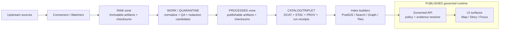

<!-- [KFM_META_BLOCK_V2]
doc_id: kfm://doc/b47fa337-9fd3-4f84-ac86-37a0b6c80d01
title: packages/ingest
type: standard
version: v1
status: draft
owners: kfm-platform (TBD)
created: 2026-02-22
updated: 2026-02-26
policy_label: restricted
related:
  - packages/catalog/README.md (TBD)
  - packages/policy/README.md (TBD)
  - docs/governance/promotion-contract.md (TBD)
tags: [kfm, ingest, pipelines, provenance, policy, promotion-contract]
notes:
  - This README is a contract surface. If implementation diverges, either update code or bump schemas + revise this doc.
  - Commands/paths marked “TBD / not confirmed in repo” must be verified before relying on them.
  - Aligned to KFM Definitive Design & Governance Guide (vNext draft, 2026-02-20): clarified PUBLISHED surfaces + Promotion Contract v1 gate naming.
[/KFM_META_BLOCK_V2] -->

# `packages/ingest`

> Ingestion runner + connectors for KFM’s **truth path**:  
> **Upstream → RAW → WORK/QUARANTINE → PROCESSED → CATALOG/TRIPLET → PUBLISHED**  
> Everything is **fail-closed**, **audit-backed**, and **policy-aware**.

**Status:** draft • **Owners:** `kfm-platform` (TBD) • **Policy label:** `restricted`


 <!-- TODO: wire to real CI status badge path -->

> **Tagging used in this doc**
>
> - **MUST / SHOULD / MAY**: normative requirements.
> - **TBD / not confirmed in repo**: repo reality check required before relying on commands/paths.
> - **PROPOSED**: recommended default posture; acceptable to change with an ADR + updated contracts.

---

## Quick navigation

- [Where this package fits](#where-this-package-fits)
- [Package layout](#package-layout)
- [What this package does](#what-this-package-does)
- [Architecture and trust membrane](#architecture-and-trust-membrane)
- [Truth-path zones and required artifacts](#truth-path-zones-and-required-artifacts)
- [Promotion Contract v1 gates](#promotion-contract-v1-gates)
- [How to run ingestion](#how-to-run-ingestion)
- [Add a new connector](#add-a-new-connector)
- [Testing and CI gates](#testing-and-ci-gates)
- [Security, licensing, and sensitivity](#security-licensing-and-sensitivity)
- [Troubleshooting](#troubleshooting)
- [Glossary](#glossary)
- [Appendix: contract templates](#appendix-contract-templates)

---

## Where this package fits

### Purpose (one line)

`packages/ingest` turns upstream inputs into **promotable, policy-consistent artifacts** plus the **receipts** needed for downstream publishing.

### Relationship to the system

KFM’s baseline architecture separates:

- **Canonical stores** (the “source truth”): object storage artifacts + catalogs + audit ledger
- **Rebuildable projections**: PostGIS/search/graph/tiles built from promoted artifacts

`packages/ingest` is part of the canonical pipeline side of the system: it writes truth-path artifacts and produces evidence/provenance artifacts that downstream components depend on.

### Acceptable inputs (what belongs here)

- Connector implementations (fetch/snapshot, change detection/watching)
- Deterministic normalization and QA logic
- Artifact writers for RAW/WORK/PROCESSED
- Schema + fixture assets that define and test:
  - pipeline spec(s)
  - run receipt(s)
  - promotion manifest(s)
  - (if colocated) catalog emit/validation adapters

### Exclusions (what must NOT go here)

- Large dataset payloads (RAW/WORK/PROCESSED artifacts belong in object storage, not git)
- Secrets, long-lived credentials, private keys
- Ad hoc one-off scripts without schemas/tests
- Any code that serves data directly to clients (that belongs behind governed APIs)

> WARNING: If this package starts “serving” data, you will break the trust membrane.

---

## Package layout

> **TBD / not confirmed in repo:** update this tree by running `tree packages/ingest -L 3` (or equivalent) and reflecting actual paths.

```text
packages/ingest/
├─ README.md
├─ package.json                  # (TBD)
├─ src/                          # (TBD)
│  ├─ cli/                       # CLI entrypoint(s) (TBD)
│  ├─ runner/                    # Orchestration: zone writes + gating (TBD)
│  ├─ connectors/                # Source-specific fetchers/watchers (TBD)
│  ├─ normalization/             # Deterministic transforms (TBD)
│  ├─ qa/                        # Validation + QA report emitters (TBD)
│  ├─ manifests/                 # Receipt/manifest emitters (TBD)
│  ├─ catalogs/                  # (Optional) emit/validate adapters (TBD)
│  ├─ policy/                    # Policy adapters + obligation appliers (TBD)
│  └─ hashing/                   # Canonicalization + spec_hash utilities (TBD)
├─ schemas/                      # JSON Schemas + profiles (TBD)
├─ fixtures/                     # Deterministic fixtures for CI (TBD)
└─ test/                         # Unit/contract/integration tests (TBD)
```

### Related components (expected)

This package typically coordinates with:

- **Catalog generator**: emits/validates DCAT + STAC + PROV + run receipts (may be separate package)
- **Policy engine**: allow/deny + obligations (fixtures-driven tests)
- **Evidence resolver**: resolves EvidenceRefs → EvidenceBundles; applies redaction
- **Index builders**: build rebuildable projections from promoted artifacts
- **Governed API**: serves only promoted dataset versions; enforces policy at query time

> NOTE: Exact package boundaries are **TBD / not confirmed in repo**. Treat this list as architectural roles, not concrete paths.

---

## What this package does

### Responsibilities (contract-level)

This package is responsible for producing the artifacts required for safe publishing:

1. **Acquire** (Upstream → RAW)
   - Snapshot exact upstream responses/files
   - Capture license/terms at time of fetch
   - Compute digests for every fetched artifact

2. **Write immutable RAW**
   - Append-only storage discipline (new acquisitions supersede; RAW is not edited)
   - Acquisition manifest + checksums

3. **Normalize + QA (WORK / QUARANTINE)**
   - Deterministic normalization into KFM-approved intermediate forms
   - Emit QA reports (schema + geospatial + completeness + drift thresholds)
   - Generate redaction/generalization candidates where policy requires
   - Route failures/uncertainties to QUARANTINE (non-promotable)

4. **Write publishable PROCESSED**
   - KFM-approved publish formats (e.g., GeoParquet, PMTiles, COG, text corpora)
   - Derived runtime metadata (bbox, temporal extent, counts) + digests

5. **Produce lineage + evidence surfaces (CATALOG/TRIPLET)**
   - DCAT (dataset-level metadata)
   - STAC (asset-level metadata, if applicable)
   - PROV (lineage)
   - Run receipts (per producing run), linked from catalogs/PROV

6. **Enforce Promotion Contract v1 (fail-closed)**
   - Promotion MUST be blocked unless required gates pass.

### Non-goals

- Serving data to external clients (that happens via the Governed API)
- UI concerns beyond producing artifacts a UI can render (receipts, catalogs, lineage)
- Long-term query/index performance (index builders handle rebuildable projections)

---

## Architecture and trust membrane

KFM treats **ingestion outputs** (artifacts + catalogs + provenance + receipts) as canonical.  
Databases/indexes are rebuildable projections derived from promoted artifacts.



### Trust membrane (non-negotiable)

- Frontend/external clients MUST NOT access databases or object storage directly.
- Domain logic MUST NOT talk directly to infrastructure; it MUST go through repository/adapters.
- All client access MUST flow through governed APIs that enforce policy and log consistently.

> If the trust membrane is broken, policy cannot be enforced and provenance cannot be trusted.

---

## Truth-path zones and required artifacts

> RAW is append-only: supersede with a new acquisition; never edit in place.  
> QUARANTINE is non-promotable: failed validation/unclear rights/sensitivity concerns block publishing.

### Zones at a glance

| Zone | Purpose | Typical contents | Promotion allowed? |
|---|---|---|---|
| **RAW** | Immutable acquisition | acquisition manifest, upstream artifacts, checksums, license/terms snapshot | ✅ (to WORK only) |
| **WORK** | Intermediate transforms | normalized representations, QA reports, candidate redactions, provisional entity resolution | ✅ (to PROCESSED if gates pass) |
| **QUARANTINE** | Fail-closed holding | failed validations, unclear rights, sensitivity concerns, irreproducible acquisitions | ❌ |
| **PROCESSED** | Publishable artifacts | approved formats, checksums, derived runtime metadata | ✅ (to CATALOG/TRIPLET) |
| **CATALOG/TRIPLET** | Canonical interface surface | DCAT + STAC + PROV + run receipts (cross-linked) | ✅ (to PUBLISHED) |
| **PUBLISHED** | Governed runtime surfaces | API/UI serve only promoted dataset versions; policy applied at query time | N/A (runtime surface) |

### Required artifacts (minimum set)

| Artifact | Why it exists | Typically produced in |
|---|---|---|
| Acquisition manifest | What was fetched, from where, when, under what terms | RAW |
| Artifact digests | Content-addressed truth; reproducibility | RAW/WORK/PROCESSED |
| QA report | Evidence that data meets minimum quality/shape | WORK |
| Policy decision + obligations | Allow/deny + required redactions/generalizations | WORK/PROCESSED (recorded in PROV) |
| Run receipt | Audit record: inputs/outputs/env/validation/policy | CATALOG/TRIPLET (and/or audit ledger) |
| Promotion manifest | Release rollup for a dataset version | Release step (PR/CI) |
| Catalog triplet | Interop + evidence surface (DCAT/STAC/PROV cross-linked) | CATALOG/TRIPLET |

---

## Promotion Contract v1 gates

Promotion is the act of moving from **RAW/WORK → PROCESSED + CATALOG/TRIPLET**, and thereby into **PUBLISHED** runtime surfaces.

A dataset version promotion **MUST be blocked** unless required artifacts exist and validate.

### Gate checklist (minimum credible set)

| Gate | Fail-closed check | Notes |
|---|---|---|
| **Gate A — Identity & versioning** | Stable Dataset ID; immutable DatasetVersion derived from deterministic `spec_hash` | Hash drift is a release blocker. |
| **Gate B — Licensing & rights metadata** | License explicit/compatible; rights-holder + attribution captured | Unclear license ⇒ QUARANTINE. |
| **Gate C — Sensitivity + redaction plan** | `policy_label` assigned; redaction/generalization plan exists for restricted/sensitive layers and recorded in PROV | Obligations must be applied before publish. |
| **Gate D — Catalog triplet validation** | DCAT/STAC/PROV exist, validate against profiles, and cross-link | All cross-links must resolve. |
| **Gate E — Run receipt + checksums** | `run_receipt` exists for producing runs; inputs/outputs enumerated with checksums; environment recorded | Include container digest + params digest. |
| **Gate F — Policy tests + contract tests** | OPA/Rego tests pass; schemas validate; evidence resolver can resolve at least one EvidenceRef in CI | Fixtures-driven; fail closed. |
| **Gate G — Optional (recommended for prod)** | SBOM + build provenance; performance smoke checks; a11y smoke checks | Treat as “production posture,” not dev blocker. |

### Promotion workflow (PR-based, recommended)

1. Contributor opens PR adding pipeline spec + schemas + fixtures + expected catalogs/receipts.
2. CI runs schema validation + policy tests + `spec_hash` stability tests + catalog link checks.
3. Steward reviews licensing/sensitivity and approves `policy_label`.
4. Operator merges and triggers controlled pipeline run.
5. Outputs written to PROCESSED + CATALOG/TRIPLET; promotion manifest created and tagged.

---

## How to run ingestion

> **TBD / not confirmed in repo:** keep this accurate by updating once the CLI/API surface is verified.

### Proposed entrypoints (PROPOSED)

- **CLI**: `kfm-ingest` (or similar) to run a dataset pipeline end-to-end
- **Library**: importable runner for CI/tests/orchestration

### Example commands (placeholders)

```bash
# (TBD / not confirmed in repo) list available datasets/connectors
kfm-ingest list

# (TBD / not confirmed in repo) dry run: fetch + normalize + validate without writing PROCESSED
kfm-ingest run --dataset <dataset_slug> --dry-run

# (TBD / not confirmed in repo) full run: writes RAW/WORK/PROCESSED + catalogs + receipts
kfm-ingest run --dataset <dataset_slug> --promote
```

### Configuration (expected)

At minimum, ingestion typically needs:

- Object storage locations for RAW/WORK/PROCESSED (by-digest staging)
- Policy engine bundle/adapter configuration (default-deny)
- Network egress allowlist (for zero-trust fetch)
- Optional: signing/attestation configuration (recommended for production posture)

> Default-deny: if required config is missing (policy bundle, license rules, etc.), the runner must fail closed.

---

## Add a new connector

### Required artifacts for a new dataset source

1. Dataset slug (stable naming; no dates in slug)
2. Pipeline spec (typed + validated)
3. Connector implementation (fetch/snapshot)
4. Normalization + QA rules
5. Policy label and sensitivity notes
6. Catalog outputs (DCAT/STAC/PROV) + cross-links
7. Fixtures (small, rights-safe samples) for deterministic tests

### Definition of Done for a connector PR

- [ ] RAW acquisition is reproducible and documented
- [ ] WORK transforms are deterministic (same inputs ⇒ same outputs; same spec ⇒ same hash)
- [ ] QUARANTINE routing works (missing rights/sensitivity/validation failures block promotion)
- [ ] PROCESSED artifacts exist in approved formats and are digest-addressed
- [ ] Catalog triplet validates and is cross-linked
- [ ] EvidenceRefs resolve (at least one end-to-end CI check)
- [ ] `policy_label` assigned and reviewed
- [ ] Changelog explains what changed and why
- [ ] Rollback path is documented (rebuild projections from canonical artifacts)

---

## Testing and CI gates

### CI must fail-closed on

- Schema validation failures (receipts, catalogs, pipeline specs)
- Policy test failures (OPA/Rego fixtures)
- Catalog link integrity failures (DCAT ↔ STAC ↔ PROV)
- Missing license/rights-holder metadata where required
- Digest mismatches (artifact content != recorded digest)
- `spec_hash` drift for identical canonical specs
- Evidence resolver cannot resolve representative EvidenceRefs for an allowed user role

### Recommended test layers

- Unit: canonicalization + hashing; connector parsers; schema validators
- Contract: run receipt schema; promotion manifest schema; catalog profiles
- Integration: fixture pipeline run → receipts + catalogs validate → evidence resolves smoke test

> TIP: include intentionally broken fixtures (missing `policy_label`, missing digest, broken cross-link) and ensure CI blocks promotion.

---

## Security, licensing, and sensitivity

### Zero-trust ingest posture (recommended)

For external sources (web/APIs/file drops):

- Short-lived credentials (OIDC) — no long-lived secrets
- Isolation for fetch with strict egress controls
- Content-addressed staging before transformation
- License-first gates (unknown/forbidden ⇒ fail closed)
- Deterministic canonicalize → hash → diff behavior
- Optional: supply-chain attestations (SBOM + provenance) before promotion

### Licensing and rights enforcement

Key rule: online availability is not permission to reuse.

Operational requirements:

- Promotion requires license + rights-holder captured for every distribution
- Metadata-only cataloging is allowed when mirroring is not permitted
- Exports should include attribution + license text
- Story publishing should block when rights are unclear for included media

### Sensitivity defaults

- Default deny for sensitive-location and restricted datasets
- If a public representation is allowed, publish a separate generalized dataset version
- Do not leak restricted metadata in error responses
- Do not embed precise coordinates in Story Nodes or Focus Mode outputs unless policy explicitly allows
- Treat redaction/generalization as a first-class transform recorded in PROV

---

## Troubleshooting

### “Promotion blocked” quick triage

1. Gate B (license): missing/unclear license? → QUARANTINE
2. Gate D (catalogs): do DCAT/STAC/PROV validate and cross-link?
3. Gate E (receipts): do receipts enumerate inputs/outputs with digests and capture environment?
4. Gate F (policy/contract): do policy fixtures cover this dataset version and pass? does evidence resolve in CI?

### Common failure modes

- Upstream changed format without version bump → normalization schema fails (expected)
- Digest drift due to non-canonical JSON/YAML ordering → canonicalize before hashing
- “Works on my machine” paths → promotion expects predictable artifact paths
- Sensitive coordinates present in PROCESSED → obligations not applied or validation missing

---

## Glossary

- RAW / WORK / QUARANTINE / PROCESSED / CATALOG/TRIPLET: lifecycle zones of the truth path
- PUBLISHED: governed runtime surfaces that serve only promoted dataset versions
- Promotion Contract: enforceable gates that block promotion unless artifacts + governance checks pass
- Run receipt: per-run audit record (inputs/outputs/env/validation/policy)
- `spec_hash`: deterministic hash of canonicalized pipeline spec to prevent hash drift
- Catalog triplet: DCAT + STAC + PROV, cross-linked as canonical interface surfaces
- Policy label: access-control + sensitivity classification input; produces obligations + reason codes

---

## Appendix: contract templates

> Templates are examples; treat schemas as the source of truth.

<details>
  <summary><strong>Run receipt (example shape)</strong></summary>

```json
{
  "run_id": "kfm://run/2026-02-20T12:00:00Z.abcd",
  "actor": { "principal": "svc:pipeline", "role": "pipeline" },
  "operation": "ingest+publish",
  "dataset_version_id": "2026-02.abcd1234",
  "inputs": [{ "uri": "raw/source.csv", "digest": "sha256:..." }],
  "outputs": [{ "uri": "processed/events.parquet", "digest": "sha256:..." }],
  "environment": {
    "container_digest": "sha256:img...",
    "git_commit": "deadbeef",
    "params_digest": "sha256:..."
  },
  "validation": { "status": "pass", "report_digest": "sha256:..." },
  "policy": { "decision_id": "kfm://policy_decision/xyz" },
  "created_at": "2026-02-20T12:05:00Z"
}
```

</details>

<details>
  <summary><strong>Promotion manifest (example shape)</strong></summary>

```json
{
  "kfm_promotion_manifest_version": "v1",
  "dataset_slug": "example_dataset",
  "dataset_version_id": "2026-02.abcd1234",
  "spec_hash": "sha256:...",
  "released_at": "2026-02-20T13:00:00Z",
  "artifacts": [
    { "path": "events.parquet", "digest": "sha256:...", "media_type": "application/x-parquet" }
  ],
  "catalogs": [
    { "path": "dcat.jsonld", "digest": "sha256:..." },
    { "path": "stac/collection.json", "digest": "sha256:..." },
    { "path": "prov/bundle.jsonld", "digest": "sha256:..." }
  ],
  "qa": { "status": "pass", "report_digest": "sha256:..." },
  "policy": { "policy_label": "public", "decision_id": "kfm://policy_decision/xyz" },
  "approvals": [
    { "role": "steward", "principal": "<id>", "approved_at": "2026-02-20T12:59:00Z" }
  ]
}
```

</details>

---

<a id="back-to-top"></a>
**Back to top:** [Quick navigation](#quick-navigation)