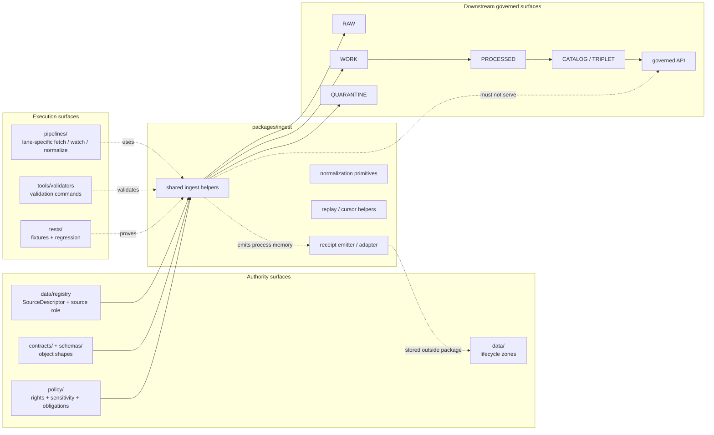

<!-- [KFM_META_BLOCK_V2]
doc_id: kfm://doc/NEEDS_VERIFICATION__packages_ingest_readme
title: packages/ingest
type: standard
version: v1
status: draft
owners: @bartytime4life (fallback via ../../.github/CODEOWNERS; child-specific owner NEEDS VERIFICATION)
created: NEEDS_VERIFICATION__YYYY-MM-DD
updated: NEEDS_VERIFICATION__YYYY-MM-DD
policy_label: NEEDS_VERIFICATION__public_or_internal
related: [../README.md, ../../README.md, ../../.github/CODEOWNERS, ../../data/README.md, ../../data/registry/README.md, ../../data/receipts/README.md, ../../pipelines/README.md, ../../contracts/README.md, ../../schemas/README.md, ../../policy/README.md, ../../tests/README.md, ../../tools/README.md]
tags: [kfm, packages, ingest, source-intake, lifecycle, receipts, validation]
notes: [Current public-main evidence showed packages/ingest as a README-only placeholder. This replacement is a boundary README for shared internal ingest helpers; package-local code, manifests, fixtures, tests, workflow enforcement, policy label, and child-specific ownership remain NEEDS VERIFICATION.]
[/KFM_META_BLOCK_V2] -->

<a id="top"></a>

# packages/ingest

Shared internal helpers for governed source intake, normalization, validation, and receipt-aware handoff into KFM’s truth path.

> [!IMPORTANT]
> **Status:** `experimental`  
> **Document status:** `draft`  
> **Owners:** `@bartytime4life` via broad `/packages/` fallback; child-specific ownership is **NEEDS VERIFICATION**  
> **Path:** `packages/ingest/README.md`  
> **Repo fit:** child package under [`../README.md`](../README.md), downstream of [`../../data/registry/README.md`](../../data/registry/README.md), [`../../contracts/README.md`](../../contracts/README.md), [`../../schemas/README.md`](../../schemas/README.md), and [`../../policy/README.md`](../../policy/README.md); adjacent to lane execution in [`../../pipelines/README.md`](../../pipelines/README.md); upstream of reusable pipeline, validator, catalog, and governed-runtime support code.  
> **Truth posture:** `CONFIRMED` path and README-only public-main placeholder from current inspection · `PROPOSED` package boundary contract · `UNKNOWN / NEEDS VERIFICATION` package-local source files, manifests, fixtures, tests, CI wiring, import graph, and runtime adoption.  
> **Quick jumps:** [Scope](#scope) · [Repo fit](#repo-fit) · [Accepted inputs](#accepted-inputs) · [Exclusions](#exclusions) · [Current surface](#current-surface) · [Directory tree](#directory-tree) · [Quickstart](#quickstart) · [Usage](#usage) · [Diagram](#diagram) · [Operating tables](#operating-tables) · [Definition of done](#definition-of-done) · [FAQ](#faq) · [Appendix](#appendix)


> [!WARNING]
> `packages/ingest/` is **not** a public runtime entrypoint, a source registry, a policy engine, a raw-data store, or a release lane. It may help ingest code behave consistently, but it must not create a side door around source admission, lifecycle gates, quarantine, proof review, or governed APIs.

---

## Scope

`packages/ingest/` is the shared internal package boundary for reusable intake mechanics that support KFM’s governed movement from source edge into the lifecycle:

```text
SourceDescriptor -> RAW -> WORK / QUARANTINE -> PROCESSED -> CATALOG / TRIPLET -> PUBLISHED
```

Use this package for helpers that are reusable, deterministic, testable, and subordinate to stronger authority surfaces. Good candidates include source-request normalization, snapshot identity helpers, checksum and content-digest helpers, common validation scaffolding, receipt emitters, replay support, and safe handoff utilities.

This package should answer a narrow question:

> “Which source-intake behavior is stable and shared enough to be implemented once, tested once, and reused by multiple lanes without becoming authority itself?”

### Evidence posture used here

| Claim | Label | Maintainer reading |
|---|---:|---|
| `packages/ingest/README.md` exists as a public-main path | **CONFIRMED** | Current public evidence shows the path, but not implementation depth. |
| Current public-main target was placeholder-level before this replacement | **CONFIRMED** | This README upgrades orientation and boundary guidance without claiming code exists. |
| `packages/ingest/` is for source intake, normalization, validation, and receipt helpers | **CONFIRMED / INFERRED** | Parent package docs name the role; this child README makes it operational. |
| Package-local implementation, tests, fixtures, manifests, and CI gates exist | **UNKNOWN** | Verify in the active checkout before documenting commands beyond inspection. |
| Deeper target shape with `src/`, `tests/`, `fixtures/`, and examples | **PROPOSED** | Use only after package-manager and repo conventions are confirmed. |

[Back to top](#top)

---

## Repo fit

`packages/ingest/` sits between governed source admission and lane execution. It should make shared mechanics easier to review without relocating meaning away from registry, schema, policy, lifecycle, or release surfaces.

| Relationship | Path | Role for this package | Status |
|---|---|---|---:|
| Root orientation | [`../../README.md`](../../README.md) | KFM identity, truth posture, lifecycle law, and trust membrane | **CONFIRMED path / doctrine** |
| Parent package boundary | [`../README.md`](../README.md) | Defines what belongs in `packages/` and what must stay elsewhere | **CONFIRMED** |
| Ownership fallback | [`../../.github/CODEOWNERS`](../../.github/CODEOWNERS) | Broad owner fallback until narrower ownership is verified | **CONFIRMED fallback / leaf owner unknown** |
| Source admission | [`../../data/registry/README.md`](../../data/registry/README.md) | SourceDescriptor, source role, rights, sensitivity, cadence, activation state | **CONFIRMED adjacent surface** |
| Process memory | [`../../data/receipts/README.md`](../../data/receipts/README.md) | Receipt-shaped replay and audit memory emitted or validated by helpers | **CONFIRMED adjacent surface** |
| Lifecycle zones | [`../../data/README.md`](../../data/README.md) | RAW, WORK, QUARANTINE, PROCESSED, CATALOG/TRIPLET, PUBLISHED boundaries | **NEEDS VERIFICATION in active checkout** |
| Lane execution | [`../../pipelines/README.md`](../../pipelines/README.md) | Source-family fetch, watch, normalize, and transform lanes | **CONFIRMED adjacent surface** |
| Contracts | [`../../contracts/README.md`](../../contracts/README.md) | Object meaning and interface commitments | **CONFIRMED adjacent surface** |
| Schemas | [`../../schemas/README.md`](../../schemas/README.md) | Machine-checkable shapes and examples | **CONFIRMED adjacent surface** |
| Policy | [`../../policy/README.md`](../../policy/README.md) | Rights, sensitivity, obligations, deny/allow/abstain posture | **CONFIRMED adjacent surface** |
| Tests | [`../../tests/README.md`](../../tests/README.md) | Valid/invalid fixtures, regression drills, negative-path proof | **CONFIRMED adjacent surface** |
| Tools | [`../../tools/README.md`](../../tools/README.md) | Validators, probes, CLIs, and support utilities | **CONFIRMED adjacent surface** |
| Runtime consumers | `../../apps/`, `../../web/` | Governed services and UI surfaces that must remain downstream | **Path likely present / imports UNKNOWN** |

### Placement rule

Put shared ingest logic here only when all four are true:

1. It is reused by more than one ingest lane, worker, validator, or package.
2. It is internal and non-deployable.
3. It consumes top-level contracts, schemas, policy, registry records, or lifecycle state instead of redefining them.
4. It preserves visible handoff to receipts, quarantine, validation reports, or downstream catalog/release surfaces.

[Back to top](#top)

---

## Accepted inputs

Use `packages/ingest/` for small, reusable mechanics that help source intake stay deterministic and inspectable.

| Accepted input | Belongs here when… | Must stay linked to… |
|---|---|---|
| Source request builders | They normalize request parameters across multiple source families | `SourceDescriptor`, registry records, source-role policy |
| Deterministic acquisition helpers | They compute stable request identity, content digests, snapshot keys, or replay hints | RAW manifests, checksums, run receipts |
| Integrity helpers | They verify hashes, content length, media type, schema hints, or immutable object refs | contracts, schemas, validation reports |
| Normalization primitives | They transform source-native values without hiding provenance or source semantics | WORK artifacts, transform receipts, validation output |
| Validation adapters | They call shared validators or shape validation results consistently | `../../tools/validators/`, `../../tests/`, contracts/schemas |
| Receipt emitters | They create or validate process-memory records without becoming release proofs | `../../data/receipts/README.md` |
| Quarantine routing helpers | They preserve reason codes and blocked-state context for invalid, sensitive, or rights-unclear material | `../../data/README.md`, policy decisions |
| Replay and cursor helpers | They support deterministic resume, high-water marks, pagination, or source drift checks | registry cadence, receipts, watch reports |
| Package-local docs for real helpers | The active branch exposes code or fixtures that need local review guidance | this README, parent README, CODEOWNERS |

> [!TIP]
> Lane-local first, shared second. A source-family fetcher should usually prove itself in `pipelines/` or a starter lane before a reusable helper graduates into `packages/ingest/`.

[Back to top](#top)

---

## Exclusions

This package gets weaker when it tries to own everything near ingest.

| Does **not** belong here | Put it here instead | Why |
|---|---|---|
| Raw API payloads, source zips, shapefiles, rasters, CSVs, or object-store captures | governed data lifecycle lanes under `../../data/` | Package source code is not RAW storage. |
| Lane-specific fetchers, watcher schedules, recipe configs, or one-off parsers | [`../../pipelines/README.md`](../../pipelines/README.md), `../../scripts/`, or the owning domain lane | First-slice execution should stay close to the source family and review burden. |
| Canonical JSON Schemas, OpenAPI contracts, vocabularies, or object law | [`../../contracts/README.md`](../../contracts/README.md) and [`../../schemas/README.md`](../../schemas/README.md) | Prevents parallel contract universes. |
| Executable policy bundles, Rego rules, obligation registries, or policy decisions as authority | [`../../policy/README.md`](../../policy/README.md) and policy tests | Package helpers may consume policy; they do not define it. |
| Ingest receipts, proof packs, release manifests, attestations, or catalog closure as primary records | `../../data/receipts/`, `../../data/proofs/`, `../../data/catalog/`, `../../release/` as verified by repo convention | Packages may emit or validate records; they do not own release memory. |
| Public API endpoints, UI routes, browser clients, model endpoints, or direct service entrypoints | `../../apps/`, `../../web/`, governed API runtime docs | `packages/ingest/` is non-deployable. |
| Secrets, tokens, provider credentials, signed URLs, or machine-local dumps | secret manager or deployment environment outside committed source | Auditability is not permission to leak sensitive operational detail. |
| AI summaries or generated public claims | governed API, EvidenceBundle resolution, runtime envelopes | AI is interpretive and must remain downstream of evidence and policy. |
| Catch-all `utils` code with no clear boundary | a named package or owning lane after ADR/review | Vague shared code becomes shadow authority. |

> [!CAUTION]
> If this package becomes the only place where a source can be understood, a policy can be interpreted, or publication can be decided, the boundary has slipped.

[Back to top](#top)

---

## Current surface

Current branch reality must be proved by inspection, not by architectural desire.

| Surface | Status | Current meaning |
|---|---:|---|
| `packages/ingest/README.md` | **CONFIRMED** | Public-main path exists. |
| Prior README content | **CONFIRMED placeholder** | The visible file was skeletal and needed scoped ownership, contracts, and usage guidance. |
| Package-local source files | **UNKNOWN / NEEDS VERIFICATION** | No implementation should be claimed until the active checkout exposes it. |
| Package-local test or fixture files | **UNKNOWN / NEEDS VERIFICATION** | Do not claim runnable tests from README intent alone. |
| Package manifest / build tool | **UNKNOWN** | Inspect lockfiles and package manifests before documenting install or build commands. |
| Broad package ownership | **CONFIRMED fallback** | `@bartytime4life` is the broad fallback; narrower leaf ownership remains open. |
| Workflow enforcement | **UNKNOWN** | README presence does not prove CI gates. |
| Lane-local execution surface | **CONFIRMED adjacent surface** | `pipelines/` is the better first home for lane-specific fetch and watch work. |

[Back to top](#top)

---

## Directory tree

### Current verified public-main shape

```text
packages/
├── README.md
└── ingest/
    └── README.md
```

### Doctrine-aligned growth shape

`PROPOSED` after repo conventions, package manager, and test runner are verified:

```text
packages/ingest/
├── README.md
├── src/                 # shared internal implementation only
├── tests/               # package-local tests for package-local code
├── fixtures/            # small valid/invalid examples, if useful
├── examples/            # non-production examples, clearly labeled
└── package manifest     # package.json / pyproject.toml / go.mod / Cargo.toml as repo convention requires
```

> [!NOTE]
> Do not create empty folders just to satisfy this tree. Add a folder only when there is real, reviewed content and a test or documentation reason to keep it.

[Back to top](#top)

---

## Quickstart

Use read-only inspection before strengthening any implementation claim.

### 1) Confirm repository and branch context

```bash
git status --short
git branch --show-current
git rev-parse --show-toplevel
```

### 2) Inventory the local package surface

```bash
find packages/ingest -maxdepth 4 -type f | sort
find packages/ingest -maxdepth 4 \
  \( -name package.json -o -name pyproject.toml -o -name Cargo.toml -o -name go.mod -o -name Makefile -o -name tsconfig.json \) \
  -print | sort
```

### 3) Re-read the adjacent authority surfaces

```bash
sed -n '1,260p' packages/README.md
sed -n '1,220p' data/registry/README.md
sed -n '1,220p' data/receipts/README.md
sed -n '1,220p' pipelines/README.md
sed -n '1,220p' contracts/README.md
sed -n '1,220p' schemas/README.md
sed -n '1,220p' policy/README.md
sed -n '1,220p' tests/README.md
sed -n '1,220p' tools/README.md
```

### 4) Search for trust-path coupling before adding prose

```bash
grep -RInE \
  'SourceDescriptor|IngestReceipt|ValidationReport|RunReceipt|TransformReceipt|PolicyDecision|spec_hash|EvidenceBundle|DecisionEnvelope|RAW|WORK|QUARANTINE|PROCESSED|CATALOG|PUBLISHED|ABSTAIN|DENY|ERROR|ANSWER' \
  packages/ingest packages pipelines data contracts schemas policy tests tools docs .github 2>/dev/null || true
```

### 5) Record what was actually proven

Before a PR upgrades this README beyond boundary guidance, capture:

```text
- active branch and commit
- package-local files present
- package manager / test runner evidence
- package owner evidence
- adjacent docs read
- validators or tests run
- unknowns intentionally left open
```

[Back to top](#top)

---

## Usage

### Prefer lane-local proof before shared helpers

A helper should not start here merely because it is ingest-shaped. Put lane-specific fetch or watch logic in the owning lane first. Promote into `packages/ingest/` only after it is demonstrably reusable.

### Keep dependency direction clean

Shared ingest helpers may depend on stable semantics and top-level contracts. They should not depend outward on app-local routing, UI components, deployment secrets, one-off notebook state, or unreviewed source-specific assumptions.

### Emit memory; do not become memory

Helpers may emit or validate receipt-shaped process memory. The durable receipt record belongs in the receipt lane, not inside package source.

### Fail closed where risk matters

When source role, rights, sensitivity, identity, geometry, time, schema compatibility, or evidence support is unclear, helpers should return bounded failure information and route to validation/quarantine/review rather than silently continuing.

### Preserve the evidence chain

A successful ingest helper should leave reviewers with enough information to reconstruct:

```text
source intent -> request / snapshot basis -> raw linkage -> validation result -> receipt -> next lifecycle state
```

[Back to top](#top)

---

## Diagram


```mermaid
flowchart LR
    subgraph Authority["Authority surfaces"]
        REG["data/registry<br/>SourceDescriptor + source role"]
        CONTRACTS["contracts/ + schemas/<br/>object shapes"]
        POLICY["policy/<br/>rights + sensitivity + obligations"]
        DATA["data/<br/>lifecycle zones"]
    end

    subgraph Execution["Execution surfaces"]
        PIPE["pipelines/<br/>lane-specific fetch / watch / normalize"]
        TOOLS["tools/validators<br/>validation commands"]
        TESTS["tests/<br/>fixtures + regression"]
    end

    subgraph Package["packages/ingest"]
        HELPERS["shared ingest helpers"]
        RECEIPT["receipt emitter / adapter"]
        NORMALIZE["normalization primitives"]
        REPLAY["replay / cursor helpers"]
    end

    subgraph Downstream["Downstream governed surfaces"]
        RAW["RAW"]
        WORK["WORK"]
        HOLD["QUARANTINE"]
        PROC["PROCESSED"]
        CATALOG["CATALOG / TRIPLET"]
        API["governed API"]
    end

    REG --> HELPERS
    CONTRACTS --> HELPERS
    POLICY --> HELPERS
    PIPE -. uses .-> HELPERS
    HELPERS --> RAW
    HELPERS --> WORK
    HELPERS --> HOLD
    HELPERS -. emits process memory .-> RECEIPT
    RECEIPT -. stored outside package .-> DATA
    TOOLS -. validates .-> HELPERS
    TESTS -. proves .-> HELPERS

    WORK --> PROC --> CATALOG --> API
    HELPERS -. must not serve .-> API
```

The dashed edge to the governed API is intentionally negative: this package can support downstream trust, but it must not serve clients directly.

[Back to top](#top)

---

## Operating tables

### Boundary matrix

| Work item | First home | Move here when… | Do not move here when… |
|---|---|---|---|
| New source-family connector | `pipelines/<lane>/` or domain lane | multiple lanes need the same primitive | it is still one-off, experimental, or source-specific |
| Request parameter normalizer | `pipelines/` first, then `packages/ingest/` | format and semantics are stable across sources | upstream API drift is still unresolved |
| SourceDescriptor authoring | `data/registry/`, `contracts/`, `schemas/` | never as authority | package code merely consumes descriptors |
| Receipt schema | `contracts/`, `schemas/`, `data/receipts/` | never as authority | package code can emit conforming records |
| Policy rule | `policy/` | never as authority | package code can pass through decisions |
| Validation CLI | `tools/validators/` | only shared library internals belong here | the CLI is the primary user-facing command |
| Runtime route | `apps/` / governed API | never | package code is non-deployable |
| Release proof | `release/`, `data/proofs/` | never | this package may link or emit inputs to proof generation |

### Shared helper contract

| Helper family | Minimum behavior | Required negative path |
|---|---|---|
| Fetch/snapshot identity | deterministic request identity, source ref, timestamp basis, digest-ready output | unsupported source role, missing descriptor, or unsafe URL returns bounded failure |
| Pagination/replay | explicit cursor or next-link handling, replay notes, completion status | incomplete page traversal routes to validation failure or quarantine |
| Normalization | source-native value preserved or linked, transform reason recorded | unmapped field is retained for review or quarantined; never silently dropped |
| Validation adapter | schema/policy result is structured and inspectable | invalid, stale, or rights-unknown state is visible and non-promoting |
| Receipt emitter | emits process memory with refs, hashes, outcome, and next-state hint | receipt creation failure does not imply success; caller gets `ERROR` or equivalent |
| Quarantine router | records why material is held and what review is needed | unknown reason codes are denied until registered |

### Object placement

| Object family | Stronger home | `packages/ingest/` relationship |
|---|---|---|
| `SourceDescriptor` | `data/registry/`, `contracts/`, `schemas/` | consume source identity, role, cadence, rights, and sensitivity. |
| `IngestReceipt` | `data/receipts/`, `contracts`, `schemas` | emit or validate process memory; do not store as package source. |
| `ValidationReport` | `tools/validators/`, `data/receipts/` or `data/proofs/` by significance | normalize result shape and preserve failure reasons. |
| `PolicyDecision` / `DecisionEnvelope` | `policy/`, `contracts`, `schemas` | consume or carry policy outcomes; never redefine policy. |
| `DatasetVersion` | `data/processed/`, contracts/schemas | prepare candidate handoff; do not publish. |
| `ReleaseManifest` / proof pack | `release/`, `data/proofs/` | link forward only; release remains governed elsewhere. |
| `EvidenceBundle` | evidence/runtime contract surfaces | downstream consumer; not created from raw package assumptions alone. |

[Back to top](#top)

---

## Definition of done

A change touching `packages/ingest/` is done only when it improves shared intake behavior without weakening KFM governance.

- [ ] The active checkout proves the package files being described.
- [ ] Parent [`../README.md`](../README.md) and this child README remain consistent.
- [ ] CODEOWNERS coverage is checked; leaf-specific owner gaps are documented.
- [ ] Any package manifest, build command, or test command is grounded in inspected files.
- [ ] New helpers consume `SourceDescriptor`, contract/schema, and policy inputs rather than inventing local authority.
- [ ] RAW, WORK, QUARANTINE, PROCESSED, CATALOG/TRIPLET, and PUBLISHED artifacts stay in governed data/release lanes.
- [ ] Receipts, validation reports, proofs, manifests, and catalog closure records stay in their owning surfaces.
- [ ] Valid and invalid fixtures exist for package-local behavior when implementation exists.
- [ ] Unknown rights, unknown sensitivity, malformed input, missing descriptor, incomplete pagination, and schema mismatch fail closed.
- [ ] No helper creates a direct client path, direct model path, or direct public route to raw/canonical/internal stores.
- [ ] Rollback or migration notes exist for any changed helper that downstream lanes import.
- [ ] Documentation explicitly marks `CONFIRMED`, `INFERRED`, `PROPOSED`, `UNKNOWN`, and `NEEDS VERIFICATION` where maturity matters.

[Back to top](#top)

---

## FAQ

### Is `packages/ingest/` where source truth lives?

No. Source truth begins with source admission, source role, rights, sensitivity, and registry state. `packages/ingest/` may consume that truth and help preserve it; it does not author it.

### Can this package fetch live data?

Only through reviewed internal use by pipelines, workers, tools, or tests after source descriptors, rights, sensitivity posture, and execution conventions are verified. This README alone does not authorize live connectors.

### Can package tests publish a dataset?

No. Package tests can prove helper behavior. Publication requires lifecycle validation, policy checks, review state, catalog/proof closure, release manifest, rollback path, and governed promotion.

### Where should a one-off connector go?

Start in the owning domain lane or `pipelines/`. Promote only the stable shared primitive into `packages/ingest/` after reuse is real.

### Are receipts the same as proofs?

No. Receipts are process memory: what ran, what was checked, and what happened. Proofs are release-significant evidence. A helper may emit a receipt-shaped record, but release proof belongs in proof/release surfaces.

### Why so many `UNKNOWN` labels?

Because a README-visible path is not implementation proof. Package code, manifests, tests, workflows, import graphs, and runtime adoption must be inspected directly.

[Back to top](#top)

---

## Appendix

<details>
<summary>Reviewer prompts</summary>

Use these questions during review:

1. Does this change keep `packages/ingest/` internal and non-deployable?
2. Does every source-facing helper consume a registry-backed source identity?
3. Does the change preserve a visible path to receipts, validation, quarantine, or downstream lifecycle state?
4. Does it avoid duplicating schema, policy, release, or registry authority?
5. Does it fail closed when rights, sensitivity, schema, pagination, identity, or source role are unclear?
6. Does it keep lane-local execution in `pipelines/` until shared reuse is proven?
7. Does the README describe only what the branch proves?

</details>

<details>
<summary>Open verification backlog</summary>

| Item | Why it matters | Suggested evidence |
|---|---|---|
| Leaf owner | Avoids relying forever on broad fallback ownership | `.github/CODEOWNERS` plus branch/ruleset review |
| Package manager | Needed before build/install commands are documented | lockfiles, package manifests, CI workflow |
| Package-local code | Needed before claiming implementation | `find packages/ingest -maxdepth 4 -type f` |
| Package-local tests | Needed before claiming behavior | test files and passing local/CI output |
| Schema home | Prevents `contracts/` vs `schemas/` drift | ADR and validator fixtures |
| Receipt contract | Needed before receipt emitter claims | schema, example, validator, invalid fixture |
| Source descriptor contract | Needed before live connector claims | registry example, schema, source-role policy |
| CI enforcement | Needed before saying gates block merges | workflow YAML, run logs, branch rules |
| Runtime adoption | Needed before saying apps use this package | import graph, route tests, e2e proof |
| Release interaction | Needed before saying outputs promote | release dry-run, proof pack, rollback reference |

</details>

<details>
<summary>Glossary</summary>

| Term | Meaning in this README |
|---|---|
| SourceDescriptor | Source identity and governance record covering role, rights, sensitivity, cadence, and activation posture. |
| IngestReceipt | Process-memory record for a source-edge fetch, skip, landing, validation, or hold event. |
| spec_hash | Deterministic identity for a source or processing specification; not a correctness claim by itself. |
| RAW | Immutable source-native capture or immutable reference, with digest and intake memory. |
| WORK | Temporary normalization, QA, and transform state; not public. |
| QUARANTINE | Hold state for invalid, sensitive, rights-unclear, malformed, or otherwise blocked material. |
| PROCESSED | Validated normalized candidate ready for cataloging; not public until promotion. |
| CATALOG / TRIPLET | Linked metadata and lineage closure such as DCAT, STAC, PROV, and internal relation records. |
| PUBLISHED | Governed, public-safe release state after validation, policy, review, proof, and rollback memory. |
| Trust membrane | Boundary that prevents public clients, UI surfaces, and model runtimes from bypassing governed evidence and policy flow. |
| Shadow authority | Duplicate source, policy, schema, release, or evidence meaning hidden inside a lower-level implementation path. |

</details>

[Back to top](#top)
