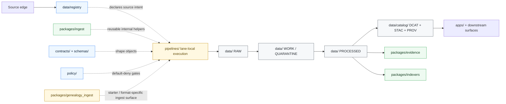

<!-- [KFM_META_BLOCK_V2]
doc_id: kfm://doc/NEEDS-VERIFICATION-UUID
title: ingest
type: standard
version: v1
status: review
owners: @bartytime4life (fallback owner; child-specific ownership needs verification)
created: YYYY-MM-DD
updated: YYYY-MM-DD
policy_label: public
related: [../../README.md, ../README.md, ../../data/README.md, ../../data/registry/README.md, ../../contracts/README.md, ../../schemas/README.md, ../../policy/README.md, ../../pipelines/README.md, ../genealogy_ingest/README.md]
tags: [kfm, packages, ingest, truth-path, receipts]
notes: [doc_id and dates need verification; status is an inferred review placeholder until a repo-local document record is surfaced]
[/KFM_META_BLOCK_V2] -->

# ingest

Governed source intake, normalization, validation, and receipt helpers for KFM’s truth path.

> **Status:** experimental  
> **Owners:** `@bartytime4life` *(fallback via [`../../.github/CODEOWNERS`](../../.github/CODEOWNERS); child-specific ownership still needs verification)*  
>       
> **Path:** `packages/ingest/README.md`  
> **Repo fit:** child package beneath [`../README.md`](../README.md); rooted in [`../../README.md`](../../README.md); adjacent to lane-level execution in [`../../pipelines/README.md`](../../pipelines/README.md); constrained by [`../../data/registry/README.md`](../../data/registry/README.md), [`../../data/README.md`](../../data/README.md), [`../../contracts/README.md`](../../contracts/README.md), [`../../schemas/README.md`](../../schemas/README.md), [`../../policy/README.md`](../../policy/README.md), and [`../../.github/workflows/README.md`](../../.github/workflows/README.md)  
> **Current public snapshot:** `packages/ingest/` currently resolves and exposes `README.md` only on public `main`  
> **Truth posture:** `CONFIRMED` current path, README-only surface, and `/packages/` owner fallback · `INFERRED` lane-local execution belongs first in `pipelines/` or a starter lane before it graduates here · `PROPOSED` deeper shared-helper growth shape · `UNKNOWN / NEEDS VERIFICATION` package-local code, manifests, tests, and workflow enforcement  
> **Quick jumps:** [Scope](#scope) · [Repo fit](#repo-fit) · [Current public deltas](#current-public-deltas) · [Boundary matrix](#boundary-matrix) · [Accepted inputs](#accepted-inputs) · [Exclusions](#exclusions) · [Current package surface](#current-package-surface) · [Directory tree](#directory-tree) · [Quickstart](#quickstart) · [Usage](#usage) · [Diagram](#diagram) · [Object placement](#object-placement) · [Task list / definition of done](#task-list--definition-of-done) · [FAQ](#faq) · [Appendix](#appendix)

> [!IMPORTANT]
> Current repo-visible state should be read conservatively: `packages/ingest/` is present on public `main`, but the visible child-package surface is still **README-only**.
>
> This file therefore does two jobs at once:
> 1. record the package boundary truthfully
> 2. define the directory contract this path should satisfy as implementation hardens

> [!WARNING]
> `packages/ingest/` is a **shared internal boundary**, not a direct runtime entrypoint.  
> It must not serve clients directly, bypass lifecycle gates, replace top-level contract or policy authority, or quietly become a second truth path.

> [!NOTE]
> In KFM, ingest is not “just fetching files.”  
> It is the shared seam where source admission, deterministic acquisition, normalization, validation, and receipt-bearing intake stay inspectable before anything can move downstream.

> [!TIP]
> A lane should prove its source, checks, and receipt story **before** its helpers are promoted here.  
> `packages/ingest/` is where ingest logic stabilizes once it is genuinely shared.

* * *

## Scope

`packages/ingest/` exists to hold **shared, non-deployable ingest helpers and boundary logic** that support KFM’s governed movement from source edge into lifecycle zones such as `RAW`, `WORK / QUARANTINE`, and `PROCESSED`.

This package is the right home for code that needs to be reused across more than one ingest lane or worker **without** taking over the stronger authority held elsewhere in the repository.

### Evidence posture used in this README

| Statement type | Posture | Meaning here |
|---|---|---|
| Current package path exists | **CONFIRMED** | Public `main` shows `packages/ingest/README.md` |
| Package role as “source intake, normalization, validation, and receipt helpers” | **CONFIRMED** | Parent `packages/README.md` names that role directly |
| Package-local code, manifests, tests, or fixtures already exist | **UNKNOWN / NEEDS VERIFICATION** | Not visible in the package path inspected during this rewrite |
| Lane-local execution belongs first elsewhere | **INFERRED** | Current public `pipelines/` surfaces and starter-lane docs give lane work a clearer first home than this shared package |
| Shared helper responsibilities described below | **PROPOSED** | Directory contract aligned to current KFM doctrine and repo boundaries |
| Any direct runtime ownership or publication authority in this package | **EXCLUDED** | Would violate current parent-package and trust-path guidance |

### Working rule

If logic is:

- reusable across ingest lanes,
- internal rather than client-facing,
- clearly subordinate to top-level contracts, policy, and lifecycle surfaces,
- and naturally tied to deterministic intake, normalization, validation, or receipts,

then it probably belongs here.

If it changes public API behavior, owns canonical schemas, publishes directly, or hides policy decisions inside package-local convenience code, it probably belongs somewhere else.

[Back to top](#ingest)

## Repo fit

| Relationship | Path | Why it matters here | Current posture |
|---|---|---|---|
| Root operating frame | [`../../README.md`](../../README.md) | Sets the repo-wide evidence-first, map-first, time-aware posture this package must remain subordinate to | **CONFIRMED** |
| Repo gatehouse | [`../../.github/README.md`](../../.github/README.md) | Establishes review-routing, ownership, and repo-side control posture that this package must not bypass | **CONFIRMED** |
| Parent boundary | [`../README.md`](../README.md) | Defines what `packages/` is for and what each child package must not do | **CONFIRMED** |
| Upstream source registration | [`../../data/registry/README.md`](../../data/registry/README.md) | Governs dataset/source identity, onboarding, cadence, rights, and handoff intent | **CONFIRMED** |
| Upstream lifecycle zones | [`../../data/README.md`](../../data/README.md) | Owns the truth path and storage-zone semantics | **CONFIRMED** |
| Upstream contract surface | [`../../contracts/README.md`](../../contracts/README.md) | Owns machine-readable contract families and shared object grammar | **CONFIRMED** |
| Upstream schema surface | [`../../schemas/README.md`](../../schemas/README.md) | Holds schema authority questions that ingest must not duplicate casually | **CONFIRMED** |
| Upstream policy surface | [`../../policy/README.md`](../../policy/README.md) | Owns deny-by-default policy posture and policy-as-code boundary | **CONFIRMED** |
| Adjacent lane-local execution | [`../../pipelines/README.md`](../../pipelines/README.md) | Gives lane-specific fetch/transform/watch work a clearer first home before helpers are promoted here | **CONFIRMED** |
| Adjacent verification | [`../../tests/README.md`](../../tests/README.md) | Negative paths, fixtures, and proof drills should stay explicit | **CONFIRMED** |
| Adjacent operator tooling | [`../../tools/README.md`](../../tools/README.md) | Validators and support tooling belong here rather than inside hidden ingest logic | **CONFIRMED** |
| Adjacent operator scripts | [`../../scripts/README.md`](../../scripts/README.md) | Entry-point scripts may call ingest helpers, but should not own domain law | **CONFIRMED** |
| Adjacent workflow surface | [`../../.github/workflows/README.md`](../../.github/workflows/README.md) | CI/promotion gates are part of ingest truth, even when YAML inventory remains to be verified | **CONFIRMED** |
| Lateral sibling packages | [`../catalog/README.md`](../catalog/README.md) · [`../domain/README.md`](../domain/README.md) · [`../evidence/README.md`](../evidence/README.md) · [`../genealogy_ingest/README.md`](../genealogy_ingest/README.md) · [`../indexers/README.md`](../indexers/README.md) · [`../policy/README.md`](../policy/README.md) | Ingest should hand off cleanly without collapsing catalog, evidence, policy, indexer, semantic-core, or starter-lane boundaries | **CONFIRMED / INFERRED** |
| Downstream catalog/runtime consumers | [`../../data/catalog/stac/README.md`](../../data/catalog/stac/README.md) · [`../../apps/README.md`](../../apps/README.md) | Ingest prepares material for later catalog and runtime use; it does not replace them | **CONFIRMED / INFERRED** |

### Repo-fit summary

`packages/ingest/` sits **between** source registration and lifecycle movement:

- it should begin from governed source intent,
- obey top-level contracts and policy,
- prepare deterministic intake artifacts,
- and hand off cleanly into lifecycle zones and later catalog/runtime surfaces.

It should **not** become a shadow registry, shadow policy engine, shadow execution lane, or shadow publication layer.

[Back to top](#ingest)

## Current public deltas

These are the public-tree conditions that make this README stricter than a generic package guide.

| Delta | Why it matters here | Status |
|---|---|---|
| `packages/ingest/` remains README-only on public `main` | This README is still documenting a boundary and target shape more than mounted implementation detail | **CONFIRMED** |
| `pipelines/` now exposes a directory README plus visible child lane READMEs | Lane-local execution has a clearer current public home than when earlier repo views were thinner | **CONFIRMED** |
| `packages/` public tree includes `genealogy_ingest/` as a sibling package | Not every ingest-shaped concern should be collapsed into shared ingest; some work is still starter- or lane-specific | **CONFIRMED** |
| `packages/README.md` current child-package summary does not yet list `genealogy_ingest/` | Treat the tree/doc mismatch as a real public delta instead of smoothing it away | **CONFIRMED** |
| `.github/workflows/` still resolves as README-only on public `main` | Package-specific workflow enforcement remains unproven in the checked-in tree | **CONFIRMED / UNKNOWN** |

> [!CAUTION]
> Current public `main` shows both **shared-boundary prose** and **lane-specific starter surfaces**.
> Read that as evidence of active boundary reconciliation, not as permission to blur those boundaries.

[Back to top](#ingest)

## Boundary matrix

Use this section when you are deciding **where ingest-shaped work should live first**.

| Surface | Primary job | Use it first when… | Keep it out when… |
|---|---|---|---|
| [`packages/ingest/`](./README.md) | Shared internal ingest helpers | the logic is reusable across more than one lane and is not itself a deployable entrypoint | the work is lane-specific, source-family-specific, or still proving its first slice |
| [`../../pipelines/`](../../pipelines/README.md) | Lane-specific execution work | the source family, review story, or publish burden is specific to one lane | the logic has already proven reuse and now belongs in a shared internal module |
| [`../../scripts/`](../../scripts/README.md) | Operator-safe entrypoints | you need a repo-local command surface, orchestration shim, or maintenance wrapper | the behavior is canonical shared ingest law rather than an entrypoint |
| [`../../apps/`](../../apps/README.md) | Runtime-facing product and worker surfaces | the code is directly deployable or client-facing | the code is a shared internal primitive with no business as a runtime surface |
| [`../genealogy_ingest/`](../genealogy_ingest/README.md) | Visible ingest-adjacent starter lane | the work is currently bound to one domain/format slice and still documenting or proving that slice | the helper has matured into a general-purpose intake primitive that should serve multiple lanes |

### Fast decision rule

- **Lane-local first**: put it in `pipelines/` or the owning starter lane when the work is still proving one source family.
- **Shared second**: promote it into `packages/ingest/` once the helper is actually reusable.
- **Runtime last**: wire it into `apps/` or operator entrypoints only after the shared and governed seams are clear.

[Back to top](#ingest)

## Accepted inputs

The following material belongs here when it is **shared, reusable, and internal**.

| Input / content type | Belongs here? | Notes |
|---|---|---|
| Shared acquisition helpers | Yes | **PROPOSED** when reused across lanes and kept subordinate to descriptors and policy |
| Deterministic fetch/snapshot helpers | Yes | **PROPOSED**; should preserve source-native payloads and integrity metadata |
| Normalization and harmonization helpers | Yes | **PROPOSED**; explicit downstream transforms, not hidden inline mutations |
| Validation helpers used before promotion | Yes | **PROPOSED**; should consume top-level contracts/policy rather than redefine them |
| Receipt / manifest / checksum emitters | Yes | **PROPOSED**; high-value fit for this package when shared |
| Incremental-state helpers (cursor / high-water-mark / replay support) | Yes | **PROPOSED**; only when deterministic and reviewable |
| Helpers promoted out of a lane or starter package | Yes, selectively | Only after the lane proves the shape and the helper is clearly broader than that lane |
| Package-local documentation for real helpers | Yes | **PROPOSED**; update this README as implementation becomes visible |
| Lane-specific one-off scripts | Usually no | Prefer `../../pipelines/` or `../../scripts/` for execution entrypoints; promote reusable logic back here only when justified |
| Client-facing HTTP handlers or UI code | No | Those belong in `../../apps/` |
| Canonical schema ownership | No | Stronger home is `../../contracts/` and/or `../../schemas/` |
| Canonical policy bundle ownership | No | Stronger home is `../../policy/` |
| Raw, work, processed, or published artifacts | No | Stronger home is `../../data/` |

### Typical accepted inputs, once implementation exists

- source-mode adapters shared across connectors,
- fetch parameter builders,
- acquisition metadata assemblers,
- integrity verification helpers,
- normalization pipelines that can replay from immutable inputs,
- receipt and validation emitters,
- safe retry / resume helpers,
- package-local utilities that reduce duplication **without** blurring authority.

## Exclusions

The following content does **not** belong in `packages/ingest/`.

| Excluded content | Why it does not belong here | Where it goes instead |
|---|---|---|
| Public API endpoints, route handlers, or direct UI entrypoints | This package is internal and non-deployable | `../../apps/` |
| Canonical JSON Schemas, OpenAPI contracts, shared vocabularies | Contract authority must stay top-level and reviewable | `../../contracts/` and `../../schemas/` |
| Executable policy bundles or policy decision logs | Policy authority must remain explicit and independently versioned | `../../policy/` |
| RAW / WORK / QUARANTINE / PROCESSED / CATALOG / PUBLISHED artifacts | Lifecycle zones are storage and release surfaces, not package internals | `../../data/` |
| Lane-local watcher configs, recipe files, and one-off parsers still proving a single slice | They should stay closest to the lane that owns the source family and review story | `../../pipelines/` or the owning starter lane |
| Release manifests, proof packs, or promotion records | Promotion and release state must stay externally visible | designated top-level release / proof surfaces |
| Secrets, tokens, or provider credentials | Secrets must never live in package source | runtime secret management / environment wiring |
| “misc/common/utils” drift | KFM explicitly rejects vague authority mixing | keep boundaries sharp and promote only justified shared helpers |

### Red flags

If a proposed change would make this package:

- callable directly by clients,
- responsible for deciding publication visibility on its own,
- the sole place where rights/sensitivity logic lives,
- the first and only home of a lane-specific fetcher,
- or the only place where a source can be understood,

stop and redesign the change before merging.

[Back to top](#ingest)

## Current package surface

This section describes **what is visible now**, not what the package may eventually contain.

| Surface | Status | Notes |
|---|---|---|
| `packages/ingest/README.md` exists | **CONFIRMED** | Current public tree shows the file |
| Package-local code under `packages/ingest/` | **UNKNOWN / NEEDS VERIFICATION** | Not visible in the inspected package path during this rewrite |
| Package-local tests / fixtures under this path | **UNKNOWN / NEEDS VERIFICATION** | No package-local inventory was visible here |
| Parent-package role statement | **CONFIRMED** | Parent docs name ingest as source intake, normalization, validation, and receipt helpers |
| Broad `/packages/` owner fallback | **CONFIRMED** | `.github/CODEOWNERS` assigns `/packages/` to `@bartytime4life` on public `main` |
| Child-specific owner narrower than `/packages/` fallback | **UNKNOWN / NEEDS VERIFICATION** | No public `CODEOWNERS` rule more specific than `/packages/` was verified for this path |
| Workflow enforcement specific to this package | **UNKNOWN / NEEDS VERIFICATION** | Current public workflow surface is README-first |
| Adjacent lane-local execution surface | **CONFIRMED** | `pipelines/` is visible on public `main`; use it to avoid overloading this package with first-wave lane glue |
| Visible ingest-adjacent starter sibling | **CONFIRMED / INFERRED** | `packages/genealogy_ingest/` exists, but its domain-specific work should not be silently merged into shared ingest without proof of reuse |

## Directory tree

### Current verified snapshot

```text
packages/ingest/
└── README.md
```

### Update rule

Keep this tree **strictly truthful**.

When real files land under this package:

1. update the tree in the same PR,
2. add only paths that are actually present,
3. keep generated artifacts out of this listing unless they are committed and intentionally owned here.

## Quickstart

Start by inspecting the package **in context**, not in isolation.

```bash
# 1) Read the package family contract first
sed -n '1,260p' packages/README.md

# 2) Read the immediate package contract
sed -n '1,320p' packages/ingest/README.md

# 3) Read the adjacent boundary docs that clarify where ingest-shaped work belongs
sed -n '1,260p' pipelines/README.md
sed -n '1,240p' scripts/README.md
sed -n '1,240p' apps/README.md

# 4) Review the stronger authority surfaces this package must obey
sed -n '1,260p' README.md
sed -n '1,240p' .github/README.md
sed -n '1,260p' data/registry/README.md
sed -n '1,260p' data/README.md
sed -n '1,240p' contracts/README.md
sed -n '1,260p' schemas/README.md
sed -n '1,220p' policy/README.md
sed -n '1,240p' tests/README.md
sed -n '1,260p' .github/workflows/README.md

# 5) Confirm current owner fallback and current package-family inventory
sed -n '1,120p' .github/CODEOWNERS
find packages -maxdepth 2 -print | sort
```

Then inventory what is actually present under this path:

```bash
find packages/ingest -maxdepth 3 -print | sort
```

Search for the highest-value object families that ingest is expected to consume or emit:

```bash
grep -RInE 'SourceDescriptor|IngestReceipt|ValidationReport|DatasetVersion|CatalogClosure|run_receipt|spec_hash' \
  packages pipelines contracts schemas data tests docs . 2>/dev/null
```

Check whether any package-local manifests or module entrypoints already exist:

```bash
find packages/ingest -maxdepth 2 \
  \( -name 'package.json' -o -name 'pyproject.toml' -o -name 'Cargo.toml' -o -name '*.ts' -o -name '*.py' \) \
  -print | sort
```

> [!TIP]
> Do the inventory before promising structure changes.  
> In KFM, a tidy guess is worse than an untidy truth.

[Back to top](#ingest)

## Usage

### When logic belongs here

Add shared ingest logic here when all of the following are true:

- it is reused or is clearly headed toward reuse,
- it is internal rather than directly deployable,
- it improves deterministic intake, normalization, validation, or receipt emission,
- it does **not** weaken the stronger authority of `data/registry`, `contracts`, `schemas`, `policy`, or `data/`,
- and it can be tested without inventing a second governance model.

### When logic does **not** belong here

Keep it out of this package when it is:

- route or controller code,
- public-facing contract ownership,
- policy-bundle ownership,
- a one-off migration script,
- lane-specific operational glue with no reusable value,
- an early-stage parser that is still proving one format or one source family,
- or a convenience shortcut that jumps past lifecycle stages.

### Promote a helper from a lane

Use this sequence when lane-local logic is ready to graduate into shared ingest:

1. Prove the behavior in the owning lane or starter package first.
2. Strip out source-family assumptions until the primitive is genuinely reusable.
3. Move only the reusable internal piece here.
4. Leave lane-specific CLI surfaces, watcher configs, and publish rules where they already make sense.
5. Update this README, [`../README.md`](../README.md), and the owning lane/package README in the same PR.

### Add the first real ingest helper safely

1. Start from a governed source-registration or intake object, not a hard-coded fetch.
2. Preserve source-native capture and integrity metadata before normalization.
3. Keep normalization as an explicit downstream step that can replay from immutable input.
4. Emit or verify receipt-bearing artifacts rather than relying on logs alone.
5. Put tests and fixtures where reviewers expect them: top-level `tests/`, `contracts/`, and companion surfaces as appropriate.
6. Update this README and [`../README.md`](../README.md) when the visible package role changes.

### Working intake stages

| Stage | What helpers here may do | What helpers here must not do |
|---|---|---|
| Discover | Resolve source mode, parameters, and capability metadata | Redefine registry authority |
| Acquire | Fetch deterministically, snapshot, checksum, and record acquisition context | Mutate source-native payloads inline without trace |
| Normalize | Convert encoding, geometry, and temporal shape explicitly | Quietly replace canonical contract meaning |
| Validate | Run structural, temporal, geometry, and integrity checks | Act as the sole policy authority |
| Handoff | Prepare reviewable outputs for `RAW`, `WORK / QUARANTINE`, or `PROCESSED` flows | Publish directly to outward runtime surfaces |

## Diagram


```mermaid
flowchart LR
    SRC[Source edge] --> REG[data/registry]
    REG -. declares source intent .-> LANE[pipelines/ lane-local execution]

    ING[packages/ingest] -. reusable internal helpers .-> LANE
    CON[contracts/ + schemas/] -. shape objects .-> LANE
    POL[policy/] -. default-deny gates .-> LANE

    LANE --> RAW[data/ RAW]
    RAW --> WQ[data/ WORK / QUARANTINE]
    WQ --> PROC[data/ PROCESSED]
    PROC --> CAT[data/catalog/ DCAT + STAC + PROV]

    PROC --> EVID[packages/evidence]
    PROC --> IDX[packages/indexers]
    CAT --> APPS[apps/ + downstream surfaces]

    STARTER[packages/genealogy_ingest] -. starter / format-specific ingest surface .-> LANE

    classDef strong fill:#eef7ff,stroke:#2f81f7,color:#0b1f33;
    classDef stage fill:#f6f8fa,stroke:#57606a,color:#24292f;
    classDef package fill:#eefaf1,stroke:#2da44e,color:#123b1d;
    classDef lane fill:#fff8e1,stroke:#bf8700,color:#5c4500;

    class REG,CON,POL strong;
    class RAW,WQ,PROC,CAT stage;
    class ING,EVID,IDX package;
    class LANE,STARTER lane;
```

## Object placement

This section exists to prevent authority drift.

> [!NOTE]
> The object-family names below are **doctrine-aligned reference names**, not a claim that matching package-local files already exist under `packages/ingest/` today.
>
> In public-main starter lanes, concrete early forms may still appear as `run_receipt.json` or lane-local validation outputs before their stronger canonical homes are fully reconciled.

| Object family | Stronger home | `packages/ingest/` relationship |
|---|---|---|
| `SourceDescriptor` | `data/registry` + contract/schema surfaces | Consume, honor, and help apply; do not quietly redefine |
| `IngestReceipt` | shared contract / proof surfaces | Likely emitter or emitter helper once implementation exists |
| `ValidationReport` | contract + verification surfaces | Likely emit or enrich; must stay compatible with top-level review expectations |
| `DatasetVersion` | data / contract / release surfaces | Contribute inputs; do not become the sole owner of version law |
| `CatalogClosure` | catalog / contract surfaces | Handoff target, not package-local substitute |
| `DecisionEnvelope` / review objects | policy + review surfaces | Consume or reference; do not replace steward decision paths |
| `EvidenceBundle` / runtime envelopes | evidence + runtime surfaces | Downstream consumers of ingest consequences, not objects this package should own in isolation |

### Placement principle

`packages/ingest/` should make intake **possible and consistent**.  
It should not make every trust-bearing object **belong** here.

[Back to top](#ingest)

## Task list / definition of done

A meaningful change to this package is done when:

- [ ] the actual tree under `packages/ingest/` is reflected truthfully in this README,
- [ ] the change clearly belongs to a shared internal ingest boundary,
- [ ] source registration / source intent remains explicit rather than hard-coded,
- [ ] lane-local execution remains in the owning lane or starter surface until reuse is proven,
- [ ] deterministic acquisition or replay semantics are visible,
- [ ] checksum, manifest, receipt, or validation behavior is explicit where relevant,
- [ ] no-op, quarantine, and failure states are not silently collapsed,
- [ ] top-level contract, schema, policy, and lifecycle authority remains intact,
- [ ] tests and fixtures land in predictable review surfaces,
- [ ] parent-package documentation still reads correctly after the change.

> [!IMPORTANT]
> “The code works” is not enough.  
> In KFM, ingest is done when the path is still inspectable after the code works.

## FAQ

### Is this where connectors live?

Shared connector logic may live here.  
Deployable workers, CLI entrypoints, or service-specific orchestration should stay in `../../apps/`, `../../scripts/`, `../../pipelines/`, or other explicit runtime surfaces.

### How is this different from `/pipelines/`?

`../../pipelines/` is where lane-specific execution work proves one source slice end to end.  
`packages/ingest/` is where the genuinely reusable internal pieces belong once the lane has shown they are shared and worth stabilizing.

### What about `packages/genealogy_ingest/`?

Treat it as a visible ingest-adjacent starter lane.  
Its presence does **not** turn `packages/ingest/` into a catch-all for domain-specific adapters; it raises the bar for proving what is truly shared before promotion into this package.

### Should `SourceDescriptor` or `IngestReceipt` schemas live here?

No.  
This package may consume or emit those object families, but the stronger authority for their public shape is top-level contract/schema space.

### Can this package write directly to `PUBLISHED` or to client-facing surfaces?

No.  
This package supports intake and handoff. Publication remains a governed downstream state, not a package shortcut.

### Why not keep this logic in `scripts/`?

Because scripts are operator entrypoints, not a durable home for shared ingest law.  
If behavior is reusable and important, it should be promoted into a package with tests and documentation.

[Back to top](#ingest)

## Appendix

<details>
<summary><strong>Review questions before adding code here</strong></summary>

1. Does this helper start from a governed source description or other explicit intake contract?
2. Can the flow replay from immutable source capture without hand editing?
3. Are checksum, manifest, receipt, and validation seams explicit?
4. Does the helper preserve source-native packaging before normalization?
5. Are rights, sensitivity, and generalization burdens still visible from outside this package?
6. Does the code keep no-op, quarantine, and failure outcomes legible?
7. Could this logic stay clearer and safer in `pipelines/` until reuse is proven?
8. Can a new contributor tell, quickly, whether this code is shared ingest law or just incidental glue?

</details>

<details>
<summary><strong>Open unknowns to retire before claiming maturity</strong></summary>

- Whether package-local code, manifests, or tests already exist outside the currently visible public tree.
- Whether workflow YAML already enforces package-specific schema, policy, or receipt checks.
- Whether a first-wave contract set for ingest objects is already mounted elsewhere in the repo.
- Whether sibling packages already consume ingest-facing helpers or only document the intended split.
- Whether child-specific ownership should narrow beyond the current broad `/packages/` fallback in `CODEOWNERS`.
- Whether the visible `genealogy_ingest/` sibling is temporary starter placement or a durable package-family choice.

</details>
