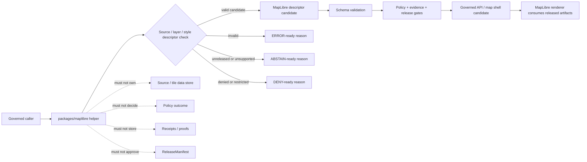

<!-- [KFM_META_BLOCK_V2]
doc_id: kfm://doc/NEEDS-VERIFICATION/packages-maplibre-readme
title: MapLibre Package README
type: readme
version: v1
status: draft
owners: OWNER_TBD
created: NEEDS VERIFICATION — target file existed before this revision as a short stub
updated: 2026-06-14
policy_label: public
related: [packages/README.md, packages/geo/README.md, packages/hashing/README.md, packages/evidence/README.md, packages/envelopes/README.md, docs/doctrine/directory-rules.md, docs/doctrine/map-first.md, docs/architecture/maplibre.md, docs/architecture/maplibre-master.md, docs/architecture/map-shell.md, docs/architecture/governed-api/ENVELOPES.md, schemas/contracts/v1/, policy/, data/receipts/, data/proofs/, release/]
tags: [kfm, packages, maplibre, map, renderer, adapter, layer-descriptor, source-descriptor, map-first, trust-membrane]
notes: ["README-like package entrypoint for MapLibre adapter and validated source/layer descriptor helper code.", "This package may contain helper code that prepares MapLibre source/layer/style candidates after governed validation; it must not become the source of truth, data store, schema home, contract home, policy engine, receipt/proof store, release authority, public API, UI shell, or AI authority.", "Implementation files, package metadata, import namespace, tests, CI workflows, and runtime bindings remain NEEDS VERIFICATION until recursively inspected."]
[/KFM_META_BLOCK_V2] -->

<a id="top"></a>

# MapLibre Package

Shared helper-code package for KFM MapLibre adapter utilities and validated source/layer descriptor preparation. MapLibre draws released artifacts; it does not decide what is true.

<p>
  
  
  
  
  
</p>

> [!IMPORTANT]
> **Status:** PROPOSED package README  
> **Path:** `packages/maplibre/README.md`  
> **Owning responsibility root:** `packages/` — shared reusable implementation libraries  
> **Package purpose:** MapLibre source/layer/style adapter helpers and validated descriptor utilities  
> **Renderer posture:** downstream carrier only; MapLibre is never truth, source, policy, citation, review, publication, or AI authority  
> **Schema authority:** `schemas/contracts/v1/`, not this package  
> **Policy authority:** `policy/`, not this package  
> **Release authority:** `release/`, not this package  
> **Repo implementation depth:** UNKNOWN for package metadata, import style, source files, tests, CI workflows, API bindings, receipts, proof packs, release manifests, branch protections, and runtime behavior.

## Scope

`packages/maplibre/` is the shared implementation package lane for MapLibre adapter helpers used by governed APIs, map artifact builders, validators, Evidence Drawer support, Focus Mode support, tests, and app shells that need MapLibre-compatible descriptors.

This package may contain deterministic utilities for:

- converting governed layer/source/style candidates into MapLibre-compatible source and layer descriptor candidates;
- validating source and layer descriptor fragments before a renderer surface consumes them;
- checking required refs such as `LayerManifest`, `StyleManifest`, `TileArtifactManifest`, `MapReleaseManifest`, EvidenceRef, policy decision ref, release ref, rollback ref, and citation-validation ref;
- preparing bounded MapContextEnvelope fragments for click, camera, selected-feature, selected-layer, and temporal-state interactions;
- supporting verify-before-add-source flows by carrying sidecar refs, artifact hashes, release refs, and validation states supplied by upstream gates;
- keeping renderer-ready negative states visible, such as abstain, deny, invalid, stale, unreleased, unsigned, or rollback-mismatch candidates;
- building synthetic no-network fixtures for public-safe source/layer/style tests.

This package must not fetch source data, read RAW/WORK/QUARANTINE, publish tiles, create releases, decide policy, resolve evidence, generate claims, render UI as authority, or bypass governed APIs.

```text
RAW -> WORK / QUARANTINE -> PROCESSED -> CATALOG / TRIPLET -> PUBLISHED
```

MapLibre helper code may prepare renderer candidates for artifacts that have already passed the required upstream gates. It does not own lifecycle state, proof state, receipt state, review state, release state, source authority, or public truth.

## Repo fit

```text
packages/maplibre/
```

This path is appropriate for reusable MapLibre helper code because `packages/` is the responsibility root for shared libraries used by apps, workers, pipelines, and tools.

| Relationship | Expected home | Boundary rule |
| --- | --- | --- |
| MapLibre helper code | `packages/maplibre/` | Adapter, source/layer descriptor, validation, and fixture helpers only. |
| Geo primitives | `packages/geo/` | CRS, geometry, scale, uncertainty, and public-safe geometry helpers. |
| Hash helpers | `packages/hashing/` | Digest, artifact hash, spec hash, and comparison helpers. |
| Evidence helpers | `packages/evidence/` and `packages/evidence-resolver/` | Evidence refs and resolver closure remain separate. |
| Runtime envelopes | `packages/envelopes/` | RuntimeResponseEnvelope and finite outcome helpers. |
| Map architecture | `docs/doctrine/map-first.md`, `docs/architecture/maplibre.md`, `docs/architecture/maplibre-master.md`, `docs/architecture/map-shell.md` | Defines map-first and MapLibre lane doctrine. |
| Semantic contracts | `contracts/` | Defines meaning; package code references, not redefines. |
| Machine schemas | `schemas/contracts/v1/` | Defines source/layer/style/tile/map/context/envelope shapes. |
| Policy rules | `policy/` | Owns renderer admission, sensitivity, rights, and release decisions. |
| Receipts and proofs | `data/receipts/`, `data/proofs/` | Stores representation/render validation and proof artifacts. |
| Release decisions | `release/` | Owns promotion, publication, correction, supersession, and rollback. |
| Public API and UI | `apps/`, `ui/`, `web/`, or repo-confirmed equivalents | May call package helpers; package internals are not public authority. |
| Tests and fixtures | `tests/packages/maplibre/`, `fixtures/packages/maplibre/`, or repo-confirmed equivalents | Proves deterministic behavior with no-network fixtures. |

> [!WARNING]
> Do not use `packages/maplibre/` as a convenience home for map data, tiles, PMTiles, COGs, source descriptors, schema files, policy rules, release manifests, map UI components, or public runtime routes.

## Accepted inputs

Package helpers should accept explicit, inspectable values from governed callers. They should not fetch missing facts from source systems, raw stores, UI state, hidden globals, operator memory, or generated language.

| Input family | Accepted examples | Required handling |
| --- | --- | --- |
| Layer context | LayerManifest ref, layer id, source id, style layer id, min/max zoom, time scope | Preserve refs and release posture; do not publish. |
| Source context | tilejson ref, PMTiles/COG/vector/raster source ref, attribution, bounds, tiling scheme, artifact hash | Validate descriptor fragments; do not fetch untrusted sources. |
| Style context | StyleManifest ref, style hash, sprite/glyph refs, expression fragments, legend hints | Carry style refs and constraints; do not approve styles. |
| Evidence context | EvidenceRef, EvidenceBundle ref, citation validation ref, source role | Preserve evidence refs; do not fabricate citations. |
| Policy context | policy decision ref, audience class, sensitivity posture, obligations, denied/restricted reason | Enforce supplied posture in candidates; do not evaluate policy. |
| Release context | MapReleaseManifest ref, release state, rollback ref, correction ref, supersession ref | Carry release refs; do not approve release. |
| Map context | camera, selected features, selected layers, time cursor, bbox, query point | Build bounded MapContextEnvelope candidates. |
| Fixture context | synthetic source/layer/style descriptors, invalid descriptors, negative states | Keep fixtures deterministic and public-safe. |

## Exclusions

| Do not put here | Correct home or owner | Reason |
| --- | --- | --- |
| RAW, WORK, QUARANTINE, PROCESSED, CATALOG, TRIPLET, or PUBLISHED data | `data/<phase>/` | Lifecycle state must remain phase-visible. |
| Tiles, PMTiles, COGs, GeoParquet, MVT/MLT bundles, sprites, glyphs, screenshots, exports | Lifecycle/release artifact homes | Artifacts require manifests, receipts, and release state. |
| Source descriptors and source registries | `data/registry/` or repo-confirmed registry homes | Source authority, rights, cadence, and limitations are governance data. |
| JSON Schemas | `schemas/contracts/v1/` | Schemas own machine shape. |
| Semantic contracts | `contracts/` | Contracts own meaning. |
| Policy rules | `policy/` | Policy owns renderer admission and public/sensitive disclosure decisions. |
| Receipts, proof packs, validation reports | `data/receipts/`, `data/proofs/` | Trust artifacts must remain separately auditable. |
| Release manifests, rollback cards, correction notices | `release/` | Publication is a governed state transition. |
| Public API routes or serializers | `apps/` or repo-confirmed API app | Public clients must use governed APIs. |
| UI components, app shell, panels, controls, Evidence Drawer views | `apps/`, `ui/`, `web/`, or repo-confirmed UI roots | Rendering shell is downstream from governed descriptors. |
| AI-generated map claims or guessed layer metadata | governed AI runtime plus evidence validation | AI output is interpretive and evidence-subordinate. |
| Secrets, source credentials, private source content, or protected-location examples | Nowhere in package fixtures | Fixtures must remain synthetic or public-safe. |

## MapLibre helper responsibilities

| Responsibility | Expected behavior |
| --- | --- |
| Preserve release refs | Carry MapReleaseManifest, LayerManifest, StyleManifest, TileArtifactManifest, rollback, and correction refs through descriptors. |
| Validate descriptors | Return typed valid/invalid state for source/layer/style fragments. |
| Preserve evidence refs | Carry EvidenceRef and citation-validation refs; do not fabricate evidence. |
| Preserve policy posture | Carry deny/restrict/abstain obligations supplied by policy gates. |
| Support negative states | Make unreleased, unsigned, invalid, denied, stale, rollback-mismatch, and unavailable states visible to callers. |
| Avoid direct source activation | Do not fetch RAW, connector, or source-system URLs as helper authority. |
| Keep renderer downstream | Produce renderer candidates; do not decide truth, release, policy, or publication. |

## Trust-boundary flow



## Expected package layout

> [!NOTE]
> The tree below is PROPOSED. Confirm package metadata, language conventions, import namespace, test layout, and CI before committing code beyond README files.

```text
packages/maplibre/
├── README.md                       # This file: package boundary and trust rules
├── pyproject.toml / package.json    # NEEDS VERIFICATION
├── src/                             # NEEDS VERIFICATION
│   └── maplibre/                    # PROPOSED namespace; confirm against repo convention
│       ├── README.md                # PROPOSED namespace guide
│       ├── __init__.py              # PROPOSED export boundary
│       ├── sources.py               # PROPOSED source descriptor helpers
│       ├── layers.py                # PROPOSED layer descriptor helpers
│       ├── styles.py                # PROPOSED style descriptor helpers
│       ├── manifests.py             # PROPOSED manifest ref carriers
│       ├── map_context.py           # PROPOSED MapContextEnvelope candidate helpers
│       ├── validation.py            # PROPOSED descriptor validation results
│       ├── negative_states.py       # PROPOSED denied/abstain/error renderer states
│       ├── fixtures.py              # PROPOSED synthetic fixtures
│       └── py.typed                 # PROPOSED if typed package convention is confirmed
└── CHANGELOG.md                     # OPTIONAL / NEEDS VERIFICATION
```

Potential imports, subject to package verification:

```python
from maplibre.sources import build_source_candidate
from maplibre.layers import build_layer_candidate
from maplibre.validation import validate_layer_descriptor
```

## Development rules

1. Treat this package as a helper layer, not an authority layer.
2. Prefer pure functions with explicit inputs and outputs.
3. Preserve evidence refs, policy refs, release refs, rollback refs, source role, attribution, CRS, bounds, zoom range, time scope, and artifact hash supplied by callers.
4. Do not make network calls from this package.
5. Do not read directly from RAW, WORK, QUARANTINE, unpublished candidates, source systems, source credentials, canonical stores, or model runtimes.
6. Do not write lifecycle data, receipts, proofs, release manifests, tiles, layer artifacts, map styles, catalog records, API responses, or UI components.
7. Do not decide policy, sensitivity, evidence closure, or release state.
8. Do not create schemas, contracts, policy rules, source registries, API routes, public answers, or release decisions from this package.
9. Do not store raw provider payloads, secrets, private source records, protected-location examples, or unrestricted sensitive context.
10. Return typed invalid/negative states instead of silently adding sources, hiding denial in style filters, or rendering unreleased artifacts.
11. Add deterministic tests for every behavior-changing helper and every negative path.
12. Keep fixtures synthetic, sanitized, and public-safe.
13. Preserve rollback and correction metadata supplied by callers when descriptor output can affect downstream publication candidates.

## Validation checklist

- [ ] Confirm `packages/maplibre/` package metadata and language/runtime convention.
- [ ] Confirm whether this package is the active runtime lane or an adapter/helper lane beside a repo-confirmed runtime package.
- [ ] Confirm owners and CODEOWNERS path coverage.
- [ ] Confirm schema homes for LayerManifest, StyleManifest, TileArtifactManifest, MapReleaseManifest, MapContextEnvelope, and runtime envelopes.
- [ ] Confirm policy homes for renderer admission, source allowlists, public-safe geometry, sensitivity, rights, and release behavior.
- [ ] Confirm tests for valid descriptors, missing release refs, missing evidence refs, invalid source type, unsupported tile format, rollback mismatch, denied layer, stale source, and public RAW/WORK/QUARANTINE rejection.
- [ ] Confirm helpers do not access lifecycle stores, source systems, credentials, or unpublished candidate stores.
- [ ] Confirm helpers do not write receipts, proofs, release manifests, tiles, layer artifacts, API responses, or UI components.
- [ ] Confirm public map routes consume governed APIs and released artifacts, not package internals.

Suggested inspection commands:

```bash
find packages/maplibre -maxdepth 5 -type f | sort
git grep -n "LayerManifest\|StyleManifest\|TileArtifactManifest\|MapReleaseManifest\|MapContextEnvelope\|addSource\|maplibre" -- packages docs contracts schemas policy tests fixtures apps 2>/dev/null || true
git grep -n "from maplibre\|import maplibre\|packages/maplibre" -- . 2>/dev/null || true
```

## Rollback

Rollback is required if this package:

- becomes a parallel schema, contract, policy, source-registry, lifecycle-data, evidence/proof, receipt, release, API, UI, renderer-decision, model-runtime, or source-data authority;
- lets public clients read RAW, WORK, QUARANTINE, unpublished candidates, source-system URLs, or direct model output;
- renders or prepares public descriptors without evidence refs, policy posture, release refs, rollback refs, and correction posture;
- hides sensitive disclosure in client-side style filters instead of upstream redaction/generalization/denial;
- silently adds unverified sources or treats MapLibre output as proof of truth;
- stores secrets, source credentials, private source records, or protected-location examples in fixtures.

Rollback target: revert the package README or maplibre-source PR, preserve audit notes, and file any authority drift in `docs/registers/DRIFT_REGISTER.md` or the repo-confirmed drift register.

## Evidence boundary

| Source | Status | Supports | Limits |
| --- | --- | --- | --- |
| Current target file | CONFIRMED | `packages/maplibre/README.md` existed as a short stub naming MapLibre adapter and validated source/layer descriptor utilities. | Stub did not prove package implementation maturity. |
| `packages/README.md` | CONFIRMED repo doc | `packages/` is for shared libraries used by apps, workers, pipelines, and tools. | Does not define MapLibre package behavior. |
| `docs/doctrine/map-first.md` | CONFIRMED repo doctrine | The map is a governed shell/carrier; layers and clicks must expose evidence, policy, release, freshness, correction, and finite negative states. | Does not prove this package is implemented. |
| `docs/architecture/maplibre.md` | CONFIRMED repo doc | MapLibre is downstream; released artifacts only; verify before source activation; no renderer truth authority. | Several runtime paths in that doc remain PROPOSED/NEEDS VERIFICATION. |
| Current file-generation pass | CONFIRMED request | User-requested target path and README expansion. | Does not inspect package metadata, tests, CI logs, dashboards, deployment posture, runtime behavior, or branch protection. |

[⬆ Back to top](#top)
