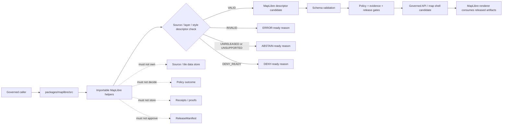

<!-- [KFM_META_BLOCK_V2]
doc_id: kfm://doc/NEEDS-VERIFICATION/packages-maplibre-src-readme
title: MapLibre Package Source README
type: readme
version: v1
status: draft
owners: OWNER_TBD
created: NEEDS VERIFICATION — target file existed before this repair but contained only placeholder text
updated: 2026-06-14
policy_label: public
related: [packages/maplibre/README.md, packages/geo/README.md, packages/hashing/README.md, packages/evidence/README.md, packages/envelopes/README.md, packages/README.md, docs/doctrine/directory-rules.md, docs/doctrine/map-first.md, docs/architecture/maplibre.md, docs/architecture/maplibre-master.md, docs/architecture/map-shell.md, docs/architecture/governed-api/ENVELOPES.md, schemas/contracts/v1/, policy/, data/receipts/, data/proofs/, release/]
tags: [kfm, packages, maplibre, src, map, renderer, adapter, source-descriptor, layer-descriptor, map-first, trust-membrane]
notes: ["Source-directory guide for MapLibre adapter and validated source/layer descriptor helper code.", "This directory may contain source code for source, layer, style, manifest-ref, MapContextEnvelope, descriptor-validation, and negative-state helpers only.", "It must not own data, schemas, contracts, policy, receipts, proofs, release decisions, API routes, UI shells, renderer-decision authority, source credentials, lifecycle data, or AI truth claims."]
[/KFM_META_BLOCK_V2] -->

<a id="top"></a>

# MapLibre Package Source

Source-code envelope for KFM MapLibre adapter helpers and validated source/layer descriptor utilities. Code here prepares bounded renderer candidates for governed callers; it does not decide truth, policy, evidence closure, review, publication, or release.

<p>
  
  
  
  
  
</p>

> [!IMPORTANT]
> **Status:** PROPOSED source-directory README  
> **Path:** `packages/maplibre/src/README.md`  
> **Owning responsibility root:** `packages/`  
> **Package lane:** `packages/maplibre/`  
> **Import/package layout:** NEEDS VERIFICATION  
> **Repo implementation depth:** UNKNOWN for package metadata, import style, tests, CI workflows, API bindings, receipts, proof packs, release manifests, branch protections, and runtime behavior.

## Scope

`packages/maplibre/src/` is the proposed source-code root for the MapLibre package.

This directory is for importable helper code used by governed APIs, map artifact builders, validators, Evidence Drawer support, Focus Mode support, tests, and app shells that need MapLibre-compatible descriptor candidates.

This source tree may support helpers for:

- constructing MapLibre source descriptor candidates from governed source/layer inputs;
- constructing MapLibre layer descriptor candidates from validated layer metadata;
- carrying StyleManifest, LayerManifest, TileArtifactManifest, MapReleaseManifest, release, rollback, correction, evidence, and policy refs;
- preparing MapContextEnvelope fragments for camera, click, selected-feature, selected-layer, bbox, and temporal state;
- validating renderer descriptor fragments before an app shell consumes them;
- preserving negative states such as invalid, unreleased, unsupported, denied, abstain-ready, stale, unsigned, or rollback-mismatch candidates;
- building synthetic no-network fixtures for public-safe source/layer/style tests.

This source tree must not fetch source data, read lifecycle stores, publish tiles or layers, decide policy, resolve evidence, generate claims, render UI as authority, expose public API routes, or bypass governed APIs.

```text
RAW -> WORK / QUARANTINE -> PROCESSED -> CATALOG / TRIPLET -> PUBLISHED
```

MapLibre source code may prepare renderer candidates for artifacts that have already passed required upstream gates. It does not own lifecycle state, proof state, receipt state, review state, release state, source authority, or public truth.

## Repo fit

```text
packages/maplibre/src/
```

`packages/` is the responsibility root for shared reusable code. `maplibre/` is the package segment. `src/` is the source-code envelope.

| Relationship | Expected home | Boundary rule |
| --- | --- | --- |
| MapLibre source code | `packages/maplibre/src/` | Source/layer/style adapter and descriptor-validation helpers only. |
| Importable module | `packages/maplibre/src/maplibre/` or repo-confirmed namespace | Package namespace, subject to repo package convention verification. |
| Package entry README | `packages/maplibre/README.md` | Explains the package as a whole. |
| Geo primitives | `packages/geo/` | CRS, geometry, scale, uncertainty, and public-safe geometry helpers. |
| Hash helpers | `packages/hashing/` | Digest, artifact hash, spec hash, and comparison helpers. |
| Evidence helpers | `packages/evidence/` and `packages/evidence-resolver/` | Evidence refs and resolver closure remain separate. |
| Runtime envelopes | `packages/envelopes/` | RuntimeResponseEnvelope and finite outcome helpers. |
| Map architecture | `docs/doctrine/map-first.md`, `docs/architecture/maplibre.md`, `docs/architecture/maplibre-master.md`, `docs/architecture/map-shell.md` | Defines map-first and MapLibre lane doctrine. |
| Semantic contracts | `contracts/` | Defines meaning; source code references, not redefines. |
| Machine schemas | `schemas/contracts/v1/` | Defines map, layer, style, tile, source, context, and runtime shapes. |
| Policy rules | `policy/` | Owns renderer admission, sensitivity, rights, and release decisions. |
| Receipts and proofs | `data/receipts/`, `data/proofs/` | Stores representation/render validation and proof artifacts. |
| Release decisions | `release/` | Owns promotion, publication, correction, supersession, and rollback. |
| Public API and UI | `apps/`, `ui/`, `web/`, or repo-confirmed equivalents | May call package helpers; package internals are not public authority. |
| Tests and fixtures | `tests/packages/maplibre/`, `fixtures/packages/maplibre/`, or repo-confirmed equivalents | Proves deterministic behavior with no-network fixtures. |

> [!WARNING]
> A source-code directory is not a data, schema, contract, policy, receipt, proof, release, public API, UI, or source-registry home.

## Accepted inputs

Functions in this source tree should accept explicit values from governed callers. They should not fetch missing facts from source systems, raw stores, UI state, hidden globals, operator memory, or generated language.

| Input family | Accepted examples | Required handling |
| --- | --- | --- |
| Layer context | LayerManifest ref, layer id, source id, style layer id, min/max zoom, time scope | Preserve refs and release posture; do not publish. |
| Source context | tilejson ref, PMTiles/COG/vector/raster source ref, attribution, bounds, tiling scheme, artifact hash | Validate descriptor fragments; do not fetch untrusted sources. |
| Style context | StyleManifest ref, style hash, sprite/glyph refs, expression fragments, legend hints | Carry style refs and constraints; do not approve styles. |
| Evidence context | EvidenceRef, EvidenceBundle ref, citation validation ref, source role | Preserve evidence refs; do not fabricate citations. |
| Policy context | policy decision ref, audience class, sensitivity posture, obligations, denied/restricted reason | Consume supplied posture; do not evaluate policy. |
| Release context | MapReleaseManifest ref, release state, rollback ref, correction ref, supersession ref | Carry release refs; do not approve release. |
| Map context | camera, selected features, selected layers, time cursor, bbox, query point | Build bounded MapContextEnvelope candidates. |
| Fixture context | synthetic source/layer/style descriptors, invalid descriptors, negative states | Keep fixtures deterministic and public-safe. |

## Exclusions

| Do not put here | Correct home or owner | Reason |
| --- | --- | --- |
| RAW, WORK, QUARANTINE, PROCESSED, CATALOG, TRIPLET, or PUBLISHED data | `data/<phase>/` | Lifecycle state must remain phase-visible. |
| Tiles, PMTiles, COGs, GeoParquet, MVT/MLT bundles, sprites, glyphs, screenshots, exports | Lifecycle/release artifact homes | Artifacts require manifests, receipts, and release state. |
| Source descriptors and source registries | `data/registry/` or repo-confirmed registry homes | Source authority, rights, cadence, and limitations are governance data. |
| JSON Schemas | `schemas/contracts/v1/` | Schemas own machine shape. |
| Semantic contracts | `contracts/` | Contracts own meaning. |
| Policy rules | `policy/` | Policy owns renderer admission and public/sensitive disclosure decisions. |
| Receipts, proof packs, validation reports | `data/receipts/`, `data/proofs/` | Trust artifacts must remain separately auditable. |
| Release manifests, rollback cards, correction notices | `release/` | Publication is a governed state transition. |
| Public API routes or serializers | `apps/` or repo-confirmed API app | Public clients must use governed APIs. |
| UI components, app shell, panels, controls, Evidence Drawer views | `apps/`, `ui/`, `web/`, or repo-confirmed UI roots | Rendering shell is downstream from governed descriptors. |
| AI-generated map claims or guessed layer metadata | governed AI runtime plus evidence validation | AI output is interpretive and evidence-subordinate. |
| Secrets, source credentials, private source content, or protected-location examples | Nowhere in package fixtures | Fixtures must remain synthetic or public-safe. |

## Expected source layout

> [!NOTE]
> The tree below is PROPOSED. Confirm package metadata, language conventions, import namespace, test layout, and CI before committing code beyond README files.

```text
packages/maplibre/src/
├── README.md                # This file: source-code boundary and trust rules
└── maplibre/
    ├── README.md            # PROPOSED: importable namespace guide
    ├── __init__.py          # PROPOSED export boundary
    ├── sources.py           # PROPOSED source descriptor helpers
    ├── layers.py            # PROPOSED layer descriptor helpers
    ├── styles.py            # PROPOSED style descriptor helpers
    ├── manifests.py         # PROPOSED manifest ref carriers
    ├── map_context.py       # PROPOSED MapContextEnvelope candidate helpers
    ├── validation.py        # PROPOSED descriptor validation results
    ├── negative_states.py   # PROPOSED denied/abstain/error renderer states
    ├── fixtures.py          # PROPOSED synthetic fixtures
    └── py.typed             # PROPOSED if typed package convention is confirmed
```

Preferred import posture, subject to package verification:

```python
from maplibre.sources import build_source_candidate
from maplibre.layers import build_layer_candidate
from maplibre.validation import validate_layer_descriptor
```

## Descriptor helper outcomes

| Helper outcome | Use when | Runtime posture |
| --- | --- | --- |
| `VALID` | Descriptor candidate is locally consistent and carries required refs. | Candidate for schema, policy, evidence, and release checks. |
| `INVALID` | Source, layer, style, bounds, zoom, ref, or type check fails. | `ERROR` or invalid validation report depending on caller. |
| `UNRELEASED` | Descriptor lacks release support or release state is not public-ready. | `ABSTAIN` or blocked publication state. |
| `DENY_READY` | Supplied policy posture blocks display or exact rendering. | `DENY` with stable reason code. |
| `UNSUPPORTED` | Source type, tile format, expression, or plugin surface is not admitted. | `ABSTAIN` or `ERROR` with stable reason code. |
| `ROLLBACK_MISMATCH` | Candidate references a release/rollback state that does not match caller context. | Block render candidate and require review. |

`VALID` is not proof of truth, evidence closure, policy approval, or release. It only means the descriptor candidate is locally well-formed for the next governed gate.

## Trust-boundary flow



## Source anti-collapse rules

| Boundary | Preserve as | Never collapse into |
| --- | --- | --- |
| Source descriptor candidate | Renderer-ready candidate with explicit refs | Source registry or data store |
| Layer descriptor candidate | MapLibre-compatible layer candidate | Published layer or release approval |
| Style descriptor candidate | Candidate style fragment | StyleManifest authority |
| MapContextEnvelope fragment | Bounded interaction context | Public answer or evidence claim |
| Negative renderer state | Explicit abstain/deny/error/unreleased status | Hidden client-side style behavior |
| Artifact hash/ref | Integrity input from governed source | Proof of truth or release state |
| Fixture descriptor | Synthetic public-safe test example | Production tile/layer/source object |

## Development rules

1. Prefer pure functions with explicit input objects.
2. Preserve evidence refs, policy refs, release refs, rollback refs, source role, attribution, CRS, bounds, zoom range, time scope, and artifact hash supplied by callers.
3. Do not make network calls from `src/` helpers.
4. Do not read directly from RAW, WORK, QUARANTINE, unpublished candidates, source systems, source credentials, canonical stores, or model runtimes.
5. Do not write lifecycle data, receipts, proofs, release manifests, tiles, layer artifacts, map styles, catalog records, API responses, or UI components.
6. Do not decide policy, sensitivity, evidence closure, or release state.
7. Do not create schemas, contracts, policy rules, source registries, API routes, public answers, release decisions, or renderer-decision doctrine from this source tree.
8. Do not store raw provider payloads, secrets, private source records, protected-location examples, or unrestricted sensitive context.
9. Return typed invalid/negative states instead of silently adding sources, hiding denial in style filters, or rendering unreleased artifacts.
10. Add deterministic tests for every behavior-changing helper and every negative path.
11. Keep fixtures synthetic, sanitized, and public-safe.
12. Preserve rollback and correction metadata supplied by callers when descriptor output can affect downstream publication candidates.

## Validation checklist

- [ ] Confirm `packages/maplibre/src/` exists in the mounted repo with this README as its source-directory guide.
- [ ] Confirm package manager and import convention (`pyproject.toml`, package.json, workspace config, or equivalent).
- [ ] Confirm whether this source tree is Python-only, TypeScript-only, or mixed-language.
- [ ] Confirm whether this package is the active runtime lane or an adapter/helper lane beside a repo-confirmed runtime package.
- [ ] Confirm owners and CODEOWNERS path coverage.
- [ ] Confirm schema homes for LayerManifest, StyleManifest, TileArtifactManifest, MapReleaseManifest, MapContextEnvelope, and runtime envelopes.
- [ ] Confirm policy homes for renderer admission, source allowlists, public-safe geometry, sensitivity, rights, and release behavior.
- [ ] Confirm tests for valid descriptors, missing release refs, missing evidence refs, invalid source type, unsupported tile format, rollback mismatch, denied layer, stale source, and public RAW/WORK/QUARANTINE rejection.
- [ ] Confirm helpers do not access lifecycle stores, source systems, credentials, or unpublished candidate stores.
- [ ] Confirm helpers do not write receipts, proofs, release manifests, tiles, layer artifacts, API responses, or UI components.
- [ ] Confirm public map routes consume governed APIs and released artifacts, not package internals.

Suggested inspection commands:

```bash
find packages/maplibre/src -maxdepth 5 -type f | sort
git grep -n "LayerManifest\|StyleManifest\|TileArtifactManifest\|MapReleaseManifest\|MapContextEnvelope\|addSource\|maplibre" -- packages docs contracts schemas policy tests fixtures apps 2>/dev/null || true
git grep -n "from maplibre\|import maplibre\|packages/maplibre/src" -- . 2>/dev/null || true
```

## Rollback

Rollback is required if this source tree:

- creates a parallel authority home for schemas, contracts, policy, registries, lifecycle data, receipts, proofs, releases, API routes, UI surfaces, tile/layer artifacts, map styles, renderer-decision doctrine, model runtimes, or source data;
- lets public clients read RAW, WORK, QUARANTINE, unpublished candidates, source-system URLs, or direct model output;
- renders or prepares public descriptors without evidence refs, policy posture, release refs, rollback refs, and correction posture;
- hides sensitive disclosure in client-side style filters instead of upstream redaction/generalization/denial;
- silently adds unverified sources or treats MapLibre output as proof of truth;
- stores secrets, source credentials, private source records, or protected-location examples in fixtures.

Rollback target: revert the maplibre-source PR, keep generated audit notes as review evidence, and file any authority drift in `docs/registers/DRIFT_REGISTER.md` or `docs/registers/VERIFICATION_BACKLOG.md` if the mounted repo uses those registers.

## Evidence boundary

| Source | Status | Supports | Limits |
| --- | --- | --- | --- |
| Current target file | CONFIRMED | `packages/maplibre/src/README.md` existed and required replacement from placeholder content. | Did not prove source implementation maturity. |
| Parent package README | CONFIRMED repo doc | `packages/maplibre/` is a shared helper-code package for MapLibre adapter and validated source/layer descriptor utilities. | Does not prove source files, package metadata, tests, or CI. |
| `packages/README.md` | CONFIRMED repo doc | `packages/` is for shared libraries used by apps, workers, pipelines, and tools. | Does not define this source namespace. |
| `docs/doctrine/map-first.md` | CONFIRMED repo doctrine | The map is a governed shell/carrier; layers and clicks must expose evidence, policy, release, freshness, correction, and finite negative states. | Does not prove this source tree is implemented. |
| `docs/architecture/maplibre.md` | CONFIRMED repo doc | MapLibre is downstream; released artifacts only; verify before source activation; no renderer truth authority. | Several runtime paths in that doc remain PROPOSED/NEEDS VERIFICATION. |
| Current file-generation pass | CONFIRMED request | User-requested target path and README repair/replacement. | Does not inspect package metadata, tests, CI logs, dashboards, deployment posture, runtime behavior, or branch protection. |
