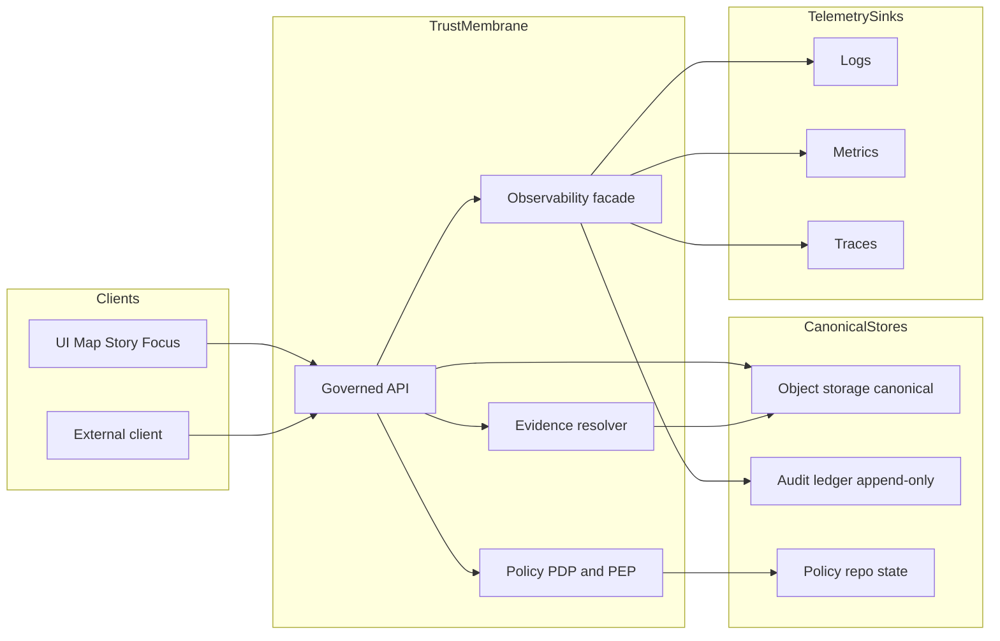

<!-- [KFM_META_BLOCK_V2]
doc_id: kfm://doc/6b6e3c6b-5a3e-4a73-9c88-9a8b7c0a3d6d
title: packages/observability — Governed telemetry + audit helpers
type: standard
version: v1
status: draft
owners: KFM Engineering
created: 2026-02-22
updated: 2026-02-26
policy_label: restricted
related:
  - packages/observability
  - kfm://doc/kfm-definitive-design-governance-vnext
tags: [kfm, observability, audit, receipts, logging, metrics, tracing, policy]
notes:
  - This package is a trust-membrane component: it MUST support auditability, redaction, and run receipts.
  - Keep vendor/back-end choices pluggable; fail-closed on missing context for governed ops.
[/KFM_META_BLOCK_V2] -->

# packages/observability
Governed telemetry + audit primitives for Kansas Frontier Matrix (KFM): **structured logs, metrics, traces, run receipts, and policy-safe audit events**.

**Status:** draft • **Owners:** KFM Engineering • **Policy:** restricted  


> **WARNING (governed data):** Audit logs and run receipts may contain sensitive context (even when redacted). Treat them as **governed datasets** with access control, retention, and redaction rules.

## Navigation
- [Why this package exists](#why-this-package-exists)
- [Where it fits in the repo](#where-it-fits-in-the-repo)
- [Non-negotiables](#non-negotiables)
- [Contract surfaces and join keys](#contract-surfaces-and-join-keys)
- [Concepts](#concepts)
- [What this package provides](#what-this-package-provides)
- [Data contracts](#data-contracts)
- [Policy safety: redaction and “no ghost metadata”](#policy-safety-redaction-and-no-ghost-metadata)
- [Interfaces](#interfaces)
- [Usage patterns](#usage-patterns)
- [Configuration](#configuration)
- [Testing and CI gates](#testing-and-ci-gates)
- [Ops alignment](#ops-alignment)
- [Appendix](#appendix)

---

## Why this package exists

KFM is “evidence-first” and “governed”: if we can’t **audit what happened**, **reproduce the decision path**, and **prove which evidence + policy were applied**, we cannot ship safely.

This package exists to make the **safe path the easy path** for every KFM component (pipelines, catalogs, governed APIs, evidence resolver, map/story backends, Focus Mode) to emit:

- **Operational telemetry**: logs/metrics/traces for reliability and debugging.
- **Governance telemetry (audit)**: **run receipts** + **governed operation audit events** that bind *who/what/when/why* to *inputs/outputs/policy decisions*.

[Back to top](#packagesobservability)

---

## Where it fits in the repo

This package is part of the **trust membrane**. It is the **shared instrumentation layer** used by:

- pipelines (ingest/normalize/validate/publish)
- evidence resolver + governed APIs
- story publishing workflows
- Focus Mode (evidence-led Q&A, cite-or-abstain)

### Acceptable inputs (what belongs here)
- Versioned **schemas** (JSON Schema) for receipts + audit events
- Context propagation utilities (request/run context)
- Redaction + summarization utilities
- Facades + interfaces for log/metrics/tracing/audit emission
- Lightweight adapters (exporters/sinks) that keep vendor choice pluggable

### Exclusions (what must *not* go here)
- A hard-coded vendor backend (choose via adapters/config)
- Storage/database implementations for ledgers (emit/append via sink interface)
- App/business logic for specific datasets, endpoints, or UI features
- Secrets management (consume secret refs, never store secrets)

[Back to top](#packagesobservability)

---

## Non-negotiables

KFM invariants that **observability MUST support**:

1) **Trust membrane joinability**
- Every governed operation MUST be joinable across logs/traces/audit via stable IDs (`audit_ref`, `run_id`, `request_id`).

2) **Run receipts + append-only audit ledger**
- Every pipeline run and every governed AI query MUST emit a run receipt.
- The audit ledger is append-only and must be treated as a governed dataset.

3) **Policy labels + obligations (captured safely)**
- Policy evaluation yields allow/deny plus obligations (redaction/generalization) and reason codes.
- Observability MUST capture policy decisions **without leaking restricted existence**.

4) **Fail-closed by default**
- If required context is missing for a governed operation, emit a deny-safe audit event and return a policy-safe error.

5) **Time awareness**
- Capture **transaction time** (when KFM recorded/published).
- Where relevant, capture **event time** and optional **valid time** (boundary/admin-history cases).

[Back to top](#packagesobservability)

---

## Contract surfaces and join keys

### Join keys (stable identifiers)
These keys MUST appear (when applicable) across logs, traces, receipts, and audit events:

| Key | Meaning | Notes |
|---|---|---|
| `audit_ref` | Stable pointer/handle for audit ledger entry | Returned to clients; supports appeals/corrections workflows |
| `run_id` | Stable ID for a pipeline run or governed run | Used in receipts, provenance links |
| `request_id` | Per-request correlation ID | Always set for HTTP/interactive requests |
| `trace_id` / `span_id` | Distributed tracing correlation | Optional early; recommended as adoption matures |
| `dataset_version_id` | Versioned dataset identity | Must not be logged in cleartext if it leaks restricted existence |
| `spec_hash` | Deterministic hash of the version spec | Used to detect drift and ensure reproducibility |
| `bundle_id` / `bundle_digest` | Evidence bundle identity | Used in Focus Mode + evidence resolver |
| `policy_decision_id` | Reference to policy decision record | Store reference; do not echo sensitive inputs |

### Contract registry (versioned)
These are **contract surfaces**. Breaking changes require a migration plan.

| Contract | Version | Shape | Stability |
|---|---:|---|---|
| Run receipt | v1 | `kfm.run_receipt.v1` JSON | Stable; additive changes only |
| Governed-op audit event | v1 | `kfm.audit.governed_op.v1` JSON | Stable; additive changes only |
| Policy decision reference | v1 | `kfm.policy_decision.v1` JSON | Stable; emitted by PDP/PEP |
| Policy-safe error response | v1 | `ErrorResponse` DTO | Stable; required `audit_ref` |
| Controlled vocabularies | v1 | `policy_label`, `artifact.zone`, … | Versioned lists |

[Back to top](#packagesobservability)

---

## Concepts

### Telemetry vs audit vs provenance
- **Telemetry** (logs/metrics/traces): operational signals for reliability and debugging.
- **Audit** (run receipts + governed operation events): who/what/when/why + policy + digests; used for review, incident reconstruction, and credibility.
- **Provenance** (DCAT/STAC/PROV): formal lineage describing how artifacts were created and connected.

This package focuses on **telemetry + audit**, but is designed to link to provenance identifiers (`run_id`, EvidenceRefs, artifact digests).

### Governed operation
A governed operation is anything that can affect:
- data visibility (promotion/publication/export)
- what an answer claims (Focus Mode)
- what evidence is resolved and shown
- what a user downloads/exports/views under policy

Governed operations MUST yield:
- `audit_ref` (stable handle)
- policy-safe errors (no restricted existence inference)
- policy decision reference + obligations applied (captured safely)

[Back to top](#packagesobservability)

---

## What this package provides

### 1) Context propagation (`KfmContext`)
A single context object (per request/per run) that carries:
- actor/principal + role (who)
- operation name + **policy-safe** parameters summary (what)
- timestamps (when: event/transaction/valid where relevant)
- declared purpose (why) — when provided
- dataset/evidence identifiers (where applicable, policy-safe)
- digests (inputs/outputs)
- policy decision reference (allow/deny, obligations, reason codes)
- correlation IDs (`request_id`, `trace_id`, `span_id`, `audit_ref`, `run_id`)

> **Design goal:** every log line and audit event can be joined by `audit_ref` and/or `run_id`.

### 2) Structured logging (policy-safe)
- JSON logs with stable field names
- redaction helpers and “never log” deny lists
- consistent inclusion of correlation IDs
- configurable “restricted existence” handling (hash/opaque tokens)

### 3) Metrics primitives (pluggable)
- counters/histograms for governed ops (latency, deny counts, obligation application counts)
- pipeline health and freshness indicators

### 4) Tracing primitives (pluggable)
- spans around governed operations and pipeline steps
- propagation across async boundaries
- trace ↔ audit linking via `audit_ref` / `run_id`

### 5) Audit event + run receipt builders
- builders that produce receipts matching KFM schemas
- helpers to produce governed-op audit events
- sink adapter interface for append-only audit ledger (transport/storage outside this package)

[Back to top](#packagesobservability)

---

## Data contracts

> Treat these as **contract surfaces**. Changing them is a breaking change and requires a migration plan.

### Run receipt (v1)
A run receipt captures inputs/outputs/environment/validation + policy decision reference.

```json
{
  "run_id": "kfm://run/2026-02-20T12:00:00Z.abcd",
  "actor": { "principal": "svc:pipeline", "role": "pipeline" },
  "operation": "ingest+publish",
  "dataset_version_id": "2026-02.abcd1234",
  "spec_hash": "sha256:abcd1234",
  "inputs": [{ "uri": "raw/source.csv", "digest": "sha256:1111" }],
  "outputs": [{ "uri": "processed/events.parquet", "digest": "sha256:2222" }],
  "environment": {
    "container_digest": "sha256:img...",
    "git_commit": "deadbeef",
    "params_digest": "sha256:3333"
  },
  "validation": { "status": "pass", "report_digest": "sha256:7777" },
  "policy": { "decision_id": "kfm://policy_decision/xyz", "policy_label": "public" },
  "created_at": "2026-02-20T12:05:00Z"
}
```

**Minimum expectations**
- `run_id` is stable and unique.
- Inputs/outputs MUST be referenced by **digest** (content-addressed).
- Environment capture MUST include what’s needed to reproduce (container digest, commit, params digest).
- Policy decision reference MUST exist for governed runs.
- `spec_hash` SHOULD be present for dataset-bearing runs (deterministic, canonicalized).

### Policy decision (v1 template)
Policy decisions must be recorded in a policy-safe way and include obligations + reason codes.

```json
{
  "decision_id": "kfm://policy_decision/xyz",
  "policy_label": "restricted",
  "decision": "deny",
  "reason_codes": ["SENSITIVE_SITE", "RIGHTS_UNCLEAR"],
  "obligations": [
    { "type": "generalize_geometry", "min_cell_size_m": 5000 },
    { "type": "remove_attributes", "fields": ["exact_location", "owner_name"] }
  ],
  "evaluated_at": "2026-02-20T12:00:00Z",
  "rule_id": "deny.restricted_dataset.default"
}
```

### Governed operation audit event (v1)
Every governed operation MUST emit an append-only audit record.

```json
{
  "event_type": "kfm.audit.governed_op.v1",
  "audit_ref": "kfm://audit/entry/123",
  "at": "2026-02-22T18:04:05Z",
  "actor": { "principal": "user:abc", "role": "public" },
  "op": {
    "name": "GET /api/v1/stac/items",
    "params_summary": { "bbox": "[redacted]", "time": "1861-01-01/1865-12-31" }
  },
  "purpose": "research",
  "inputs": [{ "uri": "stac://collection/ks_storm_events", "digest": "sha256:..." }],
  "outputs": [{ "uri": "response", "digest": "sha256:..." }],
  "policy": {
    "decision_id": "kfm://policy_decision/xyz",
    "decision": "allow",
    "policy_label": "public",
    "reason_codes": [],
    "obligations_applied": []
  },
  "correlation": {
    "request_id": "req_...",
    "trace_id": "trace_...",
    "span_id": "span_..."
  }
}
```

### Policy-safe error response (v1)
All governed surfaces SHOULD return `audit_ref`, including errors.

```json
{
  "error_code": "POLICY_DENY",
  "message": "Access denied.",
  "audit_ref": "kfm://audit/entry/123"
}
```

[Back to top](#packagesobservability)

---

## Policy safety: redaction and “no ghost metadata”

### Default posture
- **Default deny** for restricted/sensitive surfaces unless explicitly allowed.
- Do **not** leak restricted existence through differences in error behavior or logs.
- Do **not** embed precise coordinates in logs/audit unless policy explicitly allows.

### What must never be logged (examples)
- raw restricted coordinates (precise geometry)
- raw document text from restricted sources
- secrets/tokens
- full query params when they contain sensitive selectors
- any value that enables “restricted existence inference” for unauthorized roles

### Redaction + summarization utilities
This package SHOULD expose utilities such as:
- `redact.object(value, policyContext)`
- `summarize.params(params, allowlist, denylist, policyContext)`
- `hash.pseudonymize(value, saltRef)` (only when policy allows analytics use)

**Rule of thumb:** if you wouldn’t show it to a **public user**, do not emit it into logs that might be broadly accessible.

### Controlled vocabulary alignment
Treat these as versioned, validated vocabularies:
- `policy_label`: `public`, `public_generalized`, `restricted`, `restricted_sensitive_location`, `internal`, `embargoed`, `quarantine`
- `artifact.zone`: `raw`, `work`, `processed`, `catalog`, `published`
- `citation.kind`: `dcat`, `stac`, `prov`, `doc`, `graph` (avoid raw `url` when possible)

[Back to top](#packagesobservability)

---

## Interfaces

> The goal is **pluggability**: this package defines the *contracts* and provides safe helpers; sinks/exporters are swapped by adapter.

### Proposed module boundaries
- `context/` — build + propagate `KfmContext`
- `logging/` — policy-safe logger facade
- `metrics/` — metric instruments (counter/histogram) + adapter
- `tracing/` — tracer facade + adapter
- `audit/` — run receipt builder + audit event builder + audit sink adapter
- `schemas/` — JSON schemas for receipts/events/vocab

### Proposed TypeScript-style interfaces (illustrative)
```ts
export type PolicyLabel =
  | "public"
  | "public_generalized"
  | "restricted"
  | "restricted_sensitive_location"
  | "internal"
  | "embargoed"
  | "quarantine";

export interface KfmActor {
  principal: string;
  role: string;
}

export interface KfmCorrelation {
  request_id?: string;
  trace_id?: string;
  span_id?: string;
  audit_ref?: string;
  run_id?: string;
}

export interface KfmContext {
  actor: KfmActor;
  op_name: string;
  purpose?: string;
  policy_label?: PolicyLabel;
  policy_decision_id?: string;
  correlation: KfmCorrelation;

  // time axes
  event_time?: string;
  transaction_time: string;
  valid_time?: { start: string; end?: string };

  // policy-safe summaries + digests
  params_summary?: Record<string, unknown>;
  inputs?: Array<{ uri: string; digest: string }>;
  outputs?: Array<{ uri: string; digest: string }>;
}

export interface Logger {
  info(ctx: KfmContext, event: string, fields?: Record<string, unknown>): void;
  warn(ctx: KfmContext, event: string, fields?: Record<string, unknown>): void;
  error(ctx: KfmContext, event: string, fields?: Record<string, unknown>): void;
}

export interface AuditSink {
  append(event: unknown): Promise<{ audit_ref: string }>;
}

export interface RunReceiptSink {
  append(receipt: unknown): Promise<{ receipt_ref: string }>;
}
```

[Back to top](#packagesobservability)

---

## Usage patterns

> Examples are illustrative. Adapt to your runtime (Node, Python, etc.). The *contracts* are the important part.

### Pattern 1 — HTTP governed API request
1) Create/attach `KfmContext` at request start  
2) Evaluate policy (PDP/PEP)  
3) Emit audit event with `audit_ref` and policy decision  
4) Log structured event(s) with `audit_ref`  
5) Return `audit_ref` in responses (including errors)

```ts
// PSEUDOCODE
const ctx = kfmContext.fromHttp(req, { service: "api", op_name: "GET /api/v1/stac/items" });

const decision = policy.evaluate(ctx.actor, { op: "stac.items", params: req.query });

// always compute policy-safe params_summary (not raw params)
ctx.params_summary = summarize.params(req.query, /* allowlist/denylist */, decision);

if (decision.deny) {
  const audit_ref = await audit.emitDenied(ctx, { decision });
  logger.warn({ ...ctx, correlation: { ...ctx.correlation, audit_ref } }, "request.denied", {
    reason_codes: decision.reason_codes
  });
  return res.status(403).json({ error_code: "POLICY_DENY", message: "Access denied.", audit_ref });
}

const result = await stac.query(/*...*/);

const audit_ref = await audit.emitAllowed(ctx, {
  decision,
  inputs: result.inputs,
  outputs: result.outputs
});

logger.info({ ...ctx, correlation: { ...ctx.correlation, audit_ref } }, "request.ok", {
  count: result.count
});

return res.json({ data: result.items, audit_ref });
```

### Pattern 2 — Pipeline run (ingest → validate → publish)
A pipeline run MUST produce a run receipt and append to the audit ledger (via sink adapter).

```ts
// PSEUDOCODE
const run = audit.startRun({
  actor: { principal: "svc:pipeline", role: "pipeline" },
  operation: "ingest+publish",
  dataset_version_id: dvId,
  spec_hash: specHash
});

run.addInput({ uri: rawUri, digest: sha256(rawBytes) });

// ... normalize, validate ...
run.setValidation({ status: "pass", report_digest: qaDigest });

// ... publish artifacts ...
run.addOutput({ uri: processedUri, digest: processedDigest });

// capture environment
run.setEnvironment({
  container_digest: env.imageDigest,
  git_commit: env.gitSha,
  params_digest: env.paramsDigest
});

// include policy decision reference
run.setPolicy({ decision_id: decisionId, policy_label: policyLabel });

const receipt = run.finish();          // JSON matching schema
await runReceipts.append(receipt);     // receipt sink (storage/transport outside this package)
await auditLedger.append(receipt);     // append-only ledger sink (optional: store pointers only)
```

### Pattern 3 — Focus Mode request (governed run)
Treat Focus Mode as a governed run:
policy pre-check → evidence retrieval → bundle creation → answer synthesis → **citation verification (hard gate)** → receipt.

Observability responsibilities:
- record query metadata + view_state summary (policy-safe)
- record evidence bundle digests
- record citation verification outcome (pass/fail)
- record output hash + `audit_ref`

[Back to top](#packagesobservability)

---

## Configuration

> Keep exporter/back-end choices pluggable. This package should not hardcode vendors.

**Proposed config keys (update to match repo conventions):**
- `KFM_SERVICE_NAME`
- `KFM_ENV` (`dev|test|staging|prod`)
- `KFM_LOG_LEVEL`
- `KFM_AUDIT_SINK` (e.g., `stdout|file|http|queue`)
- `KFM_RUN_RECEIPT_SINK` (e.g., `stdout|file|object_store|oci_referrer`)
- `KFM_TRACING_ENABLED`
- `KFM_METRICS_ENABLED`
- `KFM_PII_SALT_REF` (reference only; never log the salt)

[Back to top](#packagesobservability)

---

## Testing and CI gates

Minimum Definition of Done for changes in this package:

- [ ] **Schema stability:** receipt + audit schemas are versioned; breaking changes require migration plan.
- [ ] **Schema validation:** example fixtures (valid + invalid) are validated in CI.
- [ ] **Policy-safe summarization:** tests ensure `params_summary` never emits restricted coordinates/identifiers.
- [ ] **No sensitive leakage:** tests confirm redaction rules on representative restricted fixtures.
- [ ] **Context propagation:** `audit_ref` / `request_id` present across logs and spans for governed ops.
- [ ] **Fail-closed:** missing required context yields deny-safe audit event + policy-safe error.
- [ ] **Hash stability:** `spec_hash` and receipt digest strategies are stable across OS/runtime (golden tests).
- [ ] **Docs updated:** README + schemas/examples updated together.

[Back to top](#packagesobservability)

---

## Ops alignment

### Minimum observability (baseline targets)
- Structured logs with correlation IDs and `audit_ref`
- Metrics:
  - request latency (P95) per endpoint
  - evidence resolver latency
  - tile response latency
  - pipeline run durations and failures
- Traces: optional early; recommended as maturity grows

### Dashboards by audience
- **Steward view:** policy denials, rights issues, quarantines
- **Operator view:** pipeline health, storage usage, deployment status
- **Product view:** UI performance and accessibility regression indicators

### Backup & restore implications
Treat the **audit ledger** as canonical and back it up alongside object storage and policy repository state.
Restore drills should be recorded as governed run receipts.

[Back to top](#packagesobservability)

---

## Appendix

### Proposed package layout (update once code exists)
```text
packages/observability/
├─ README.md
├─ src/
│  ├─ index.ts
│  ├─ context/
│  │  ├─ kfm-context.ts
│  │  └─ propagation.ts
│  ├─ logging/
│  │  ├─ logger.ts
│  │  └─ redaction.ts
│  ├─ metrics/
│  │  ├─ metrics.ts
│  │  └─ exporters/
│  ├─ tracing/
│  │  ├─ tracer.ts
│  │  └─ exporters/
│  └─ audit/
│     ├─ run-receipt.ts
│     ├─ audit-event.ts
│     ├─ vocab/
│     │  ├─ policy_label.v1.json
│     │  └─ artifact_zone.v1.json
│     └─ schemas/
│        ├─ run_receipt.v1.schema.json
│        ├─ governed_op.v1.schema.json
│        └─ error_response.v1.schema.json
└─ package.json
```

### Mermaid: Trust membrane + observability flow (conceptual)


[Back to top](#packagesobservability)