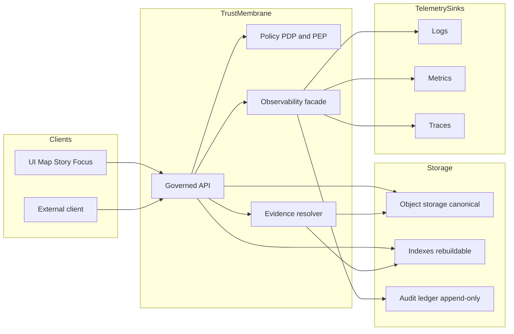

<!-- [KFM_META_BLOCK_V2]
doc_id: kfm://doc/6b6e3c6b-5a3e-4a73-9c88-9a8b7c0a3d6d
title: packages/observability — Governed telemetry + audit helpers
type: standard
version: v1
status: draft
owners: KFM Engineering
created: 2026-02-22
updated: 2026-02-22
policy_label: restricted
related:
  - packages/observability
  - kfm://doc/kfm-definitive-design-governance-vnext
tags: [kfm, observability, audit, receipts, logging, metrics, tracing, policy]
notes:
  - This package is a trust-membrane component: it MUST support auditability, redaction, and run receipts.
  - Keep vendor/back-end choices pluggable; fail-closed on missing context for governed ops.
[/KFM_META_BLOCK_V2] -->

# Observability
Governed telemetry + audit primitives for Kansas Frontier Matrix (KFM).

**Status:** draft • **Owners:** KFM Engineering  
  

## Navigation
- [Why this package exists](#why-this-package-exists)
- [Non-negotiables](#non-negotiables)
- [Concepts](#concepts)
- [What this package provides](#what-this-package-provides)
- [Data contracts](#data-contracts)
- [Redaction and sensitivity](#redaction-and-sensitivity)
- [Usage patterns](#usage-patterns)
- [Configuration](#configuration)
- [Testing and CI gates](#testing-and-ci-gates)
- [Appendix](#appendix)

---

## Why this package exists

KFM is “evidence-first” and “governed”: if we can’t *audit* what happened, *reproduce* the decision path, and *prove* what evidence and policy were applied, we cannot ship the system safely.

This package exists to make it **easy and consistent** for every KFM component (pipelines, catalog builders, governed API, evidence resolver, UI backends, Focus Mode) to emit:

- **Operational telemetry:** structured logs, metrics, traces (for debugging and SLOs).
- **Governance telemetry (audit):** run receipts + audit events that tie *who/what/when/why* to *inputs/outputs/policy decisions*.

> **Important:** Audit logs are themselves sensitive. Treat them as governed datasets (redaction + retention + access control), not as “just logs”.

[Back to top](#observability)

---

## Non-negotiables

KFM invariants that **observability MUST support**:

1) **Trust membrane**
- Clients never access storage/DB directly.  
- Core backend logic never bypasses repository interfaces.  
- Governed APIs must apply policy, redaction, and logging consistently.

2) **Run receipts + append-only audit ledger**
- Every pipeline run and every governed AI query should emit a run receipt.
- The audit ledger is append-only and governed (redactions applied as needed).

3) **Policy labels + obligations**
- Policy evaluation yields allow/deny plus obligations (redaction/generalization steps) and reason codes.
- Observability must capture policy decisions *without leaking restricted existence*.

4) **Time awareness**
- At minimum: record **transaction time** (when KFM recorded/published).
- Where relevant: record **event time** and optionally **valid time**.

> This package should make the safe path the easy path.

[Back to top](#observability)

---

## Concepts

### Telemetry vs audit vs provenance
- **Telemetry** (logs/metrics/traces): operational signals for reliability and debugging.
- **Audit** (run receipts + governed operation logs): who/what/when/why + policy + digests; used for review, compliance, and incident reconstruction.
- **Provenance** (PROV/DCAT/STAC): formal lineage describing how artifacts were created and connected.

This package focuses on **telemetry + audit**, but is designed to link to provenance identifiers.

### Governed operation
A “governed operation” is anything that can affect:
- What data becomes visible (promotion, publication, story publish),
- What an answer claims (Focus Mode),
- What evidence is resolved and shown,
- What a user downloads/exports/views under policy.

Governed operations MUST yield:
- `audit_ref` (stable pointer to audit ledger entry or run record)
- policy-safe error models

[Back to top](#observability)

---

## What this package provides

### 1) Context propagation
A single **KFM Context** object (per request / per run) that carries:
- principal + role (who)
- operation + parameters summary (what)
- timestamps (when)
- declared purpose (why) — when provided
- dataset + version identifiers (where applicable)
- digests (inputs/outputs)
- policy decision references (allow/deny, obligations, reason codes)
- correlation ids (request id, trace id/span id)

> **Design goal:** every log line and every audit event can be joined by `audit_ref` and/or `run_id` and trace context.

### 2) Structured logging (policy-safe)
- JSON logs with a stable field set
- redaction helpers and “never log” allow/deny lists
- consistent inclusion of `audit_ref` and `policy_label` where safe

### 3) Metrics primitives (pluggable)
- counters/histograms for governed ops (latency, deny counts, redaction counts)
- health/freshness indicators for pipelines (where applicable)

### 4) Tracing primitives (pluggable)
- span creation around governed operations and pipeline steps
- context propagation across async boundaries
- trace ↔ audit linking via `audit_ref` / `run_id`

### 5) Audit event & run receipt builders
- helpers to produce receipts matching KFM templates
- helpers to produce “governed operation audit events” matching KFM requirements

---

## Data contracts

> Treat these as **contract surfaces**. Changing them is a breaking change and requires a migration plan.

### Run receipt (v1 template)
A run receipt captures inputs/outputs/environment/validation + policy decision reference.

```json
{
  "run_id": "kfm://run/2026-02-20T12:00:00Z.abcd",
  "actor": { "principal": "svc:pipeline", "role": "pipeline" },
  "operation": "ingest+publish",
  "dataset_version_id": "2026-02.abcd1234",
  "inputs": [{ "uri": "raw/source.csv", "digest": "sha256:1111" }],
  "outputs": [{ "uri": "processed/events.parquet", "digest": "sha256:2222" }],
  "environment": {
    "container_digest": "sha256:img...",
    "git_commit": "deadbeef",
    "params_digest": "sha256:3333"
  },
  "validation": { "status": "pass", "report_digest": "sha256:7777" },
  "policy": { "decision_id": "kfm://policy_decision/xyz" },
  "created_at": "2026-02-20T12:05:00Z"
}
```

**Minimum expectations**
- `run_id` is stable and unique.
- Inputs/outputs MUST be referenced by **digest** (content-addressed).
- Environment capture MUST include what’s needed to reproduce (container digest, commit, params digest).
- `policy.decision_id` is required for governed runs.

### Policy decision (template)
Policy decisions should be logged/referenced in a policy-safe way and include obligations + reason codes.

```json
{
  "decision_id": "kfm://policy_decision/xyz",
  "policy_label": "restricted",
  "decision": "deny",
  "reason_codes": ["SENSITIVE_SITE", "RIGHTS_UNCLEAR"],
  "obligations": [
    { "type": "generalize_geometry", "min_cell_size_m": 5000 },
    { "type": "remove_attributes", "fields": ["exact_location", "owner_name"] }
  ],
  "evaluated_at": "2026-02-20T12:00:00Z",
  "rule_id": "deny.restricted_dataset.default"
}
```

### Governed operation audit event (v1)
Every governed operation MUST emit a log/audit record including:

- **who:** principal, role
- **what:** endpoint/operation, parameters summary
- **when:** timestamp(s)
- **why:** declared purpose (if provided)
- **inputs/outputs:** digests
- **policy:** decision + obligations + reason codes
- **audit_ref:** stable handle for review

Suggested shape:

```json
{
  "event_type": "kfm.audit.governed_op.v1",
  "audit_ref": "kfm://audit/entry/123",
  "at": "2026-02-22T18:04:05Z",
  "actor": { "principal": "user:abc", "role": "public" },
  "op": {
    "name": "GET /api/v1/stac/items",
    "params_summary": { "bbox": "[redacted]", "time": "1861-01-01/1865-12-31" }
  },
  "purpose": "research",
  "inputs": [{ "uri": "stac://collection/ks_storm_events", "digest": "sha256:..." }],
  "outputs": [{ "uri": "response", "digest": "sha256:..." }],
  "policy": {
    "decision_id": "kfm://policy_decision/xyz",
    "decision": "allow",
    "policy_label": "public",
    "reason_codes": [],
    "obligations_applied": []
  },
  "correlation": {
    "request_id": "req_...",
    "trace_id": "trace_...",
    "span_id": "span_..."
  }
}
```

> `params_summary` MUST be policy-safe (no restricted “ghost metadata”, no precise restricted coordinates).

[Back to top](#observability)

---

## Redaction and sensitivity

### Default posture
- **Default deny** for sensitive/restricted data surfaces unless explicitly allowed.
- Do **not** leak restricted existence through differences in error responses or logs.
- Do **not** embed precise coordinates in logs or outputs unless policy explicitly allows.

### What must never be logged (examples)
- Raw restricted coordinates
- Raw document text from restricted sources
- Secrets/tokens
- Full query parameters when they include sensitive selectors (use summaries / hashed forms)

### Redaction pattern
This package should expose a standard set of utilities, e.g.:

- `redact.object(value, policyContext)`
- `summarize.params(params, allowlist, denylist, policyContext)`
- `hash.pseudonymize(value, saltRef)` (for analytics where allowed)

### Treat logs as datasets
Audit logs and run receipts must have:
- policy label assignment
- retention rules
- controlled access
- redaction applied as needed

[Back to top](#observability)

---

## Usage patterns

> Examples are illustrative. Adapt to your runtime (Node, Python, etc.). The *contract* is the important part.

### Pattern 1 — HTTP governed API request
1) Create/attach `KfmContext` at request start  
2) Evaluate policy (PDP)  
3) Emit audit event with `audit_ref` and policy decision  
4) Log structured event(s) with `audit_ref`  
5) Return `audit_ref` in responses (including errors)

```ts
// PSEUDOCODE
const ctx = kfmContext.fromHttp(req, { service: "api" });

const decision = policy.evaluate(ctx.actor, { op: "stac.items", params: req.query });

if (decision.deny) {
  audit.emit(ctx, auditEvent.denied({ decision, params: req.query }));
  logger.warn(ctx, "request.denied", { decision });
  return res.status(403).json({ error_code: "POLICY_DENY", audit_ref: ctx.auditRef });
}

const result = await stac.query(/*...*/);

audit.emit(ctx, auditEvent.allowed({ decision, inputs: result.inputs, outputs: result.outputs }));
logger.info(ctx, "request.ok", { count: result.count });

return res.json({ data: result.items, audit_ref: ctx.auditRef });
```

### Pattern 2 — Pipeline run (ingest → validate → publish)
A pipeline run MUST produce a run receipt and append to the audit ledger (or equivalent).

```ts
// PSEUDOCODE
const run = audit.startRun({
  actor: { principal: "svc:pipeline", role: "pipeline" },
  operation: "ingest+publish",
  dataset_version_id: dvId
});

run.addInput({ uri: rawUri, digest: sha256(rawBytes) });

// ... normalize, validate ...
run.setValidation({ status: "pass", report_digest: qaDigest });

// ... publish artifacts ...
run.addOutput({ uri: processedUri, digest: processedDigest });

// include environment capture
run.setEnvironment({
  container_digest: env.imageDigest,
  git_commit: env.gitSha,
  params_digest: env.paramsDigest
});

// include policy decision reference
run.setPolicy({ decision_id: decisionId });

const receipt = run.finish(); // returns JSON object matching template
audit.appendReceipt(receipt); // storage/transport is outside this package
```

### Pattern 3 — Focus Mode request
A Focus Mode request is a governed run:
policy pre-check → evidence retrieval → bundle creation → answer synthesis → citation verification (hard gate) → receipt.

Observability responsibilities:
- record query metadata + view_state summary
- record evidence bundle digests
- record citation verification outcome
- record output hash
- emit run receipt + audit_ref

[Back to top](#observability)

---

## Configuration

> Keep exporter/back-end choices pluggable. This package should not hardcode vendors.

**Proposed config keys (update to match repo conventions):**
- `KFM_SERVICE_NAME`
- `KFM_ENV` (`dev|test|staging|prod`)
- `KFM_LOG_LEVEL`
- `KFM_AUDIT_SINK` (e.g., `stdout|file|http|queue`)
- `KFM_TRACING_ENABLED`
- `KFM_METRICS_ENABLED`

---

## Testing and CI gates

Minimum Definition of Done for changes in this package:

- [ ] **Schema stability:** run receipt + audit event schemas versioned; breaking changes require migration plan.
- [ ] **No sensitive leakage:** tests confirm redaction rules on representative “restricted” fixtures.
- [ ] **Context propagation:** request_id/audit_ref consistently present across logs and spans for governed ops.
- [ ] **Fail-closed:** if required context for a governed operation is missing, emit deny-safe event + return policy-safe error.
- [ ] **Docs updated:** README and any schemas/examples updated together.

---

## Appendix

### Proposed package layout (update once code exists)
```text
packages/observability/
├─ README.md
├─ src/
│  ├─ index.ts
│  ├─ context/
│  │  ├─ kfm-context.ts
│  │  └─ propagation.ts
│  ├─ logging/
│  │  ├─ logger.ts
│  │  └─ redaction.ts
│  ├─ metrics/
│  │  ├─ metrics.ts
│  │  └─ exporters/
│  ├─ tracing/
│  │  ├─ tracer.ts
│  │  └─ exporters/
│  └─ audit/
│     ├─ run-receipt.ts
│     ├─ audit-event.ts
│     └─ schemas/
│        ├─ run_receipt.v1.schema.json
│        └─ governed_op.v1.schema.json
└─ package.json
```

### Mermaid: Trust membrane + observability flow (conceptual)


[Back to top](#observability)
