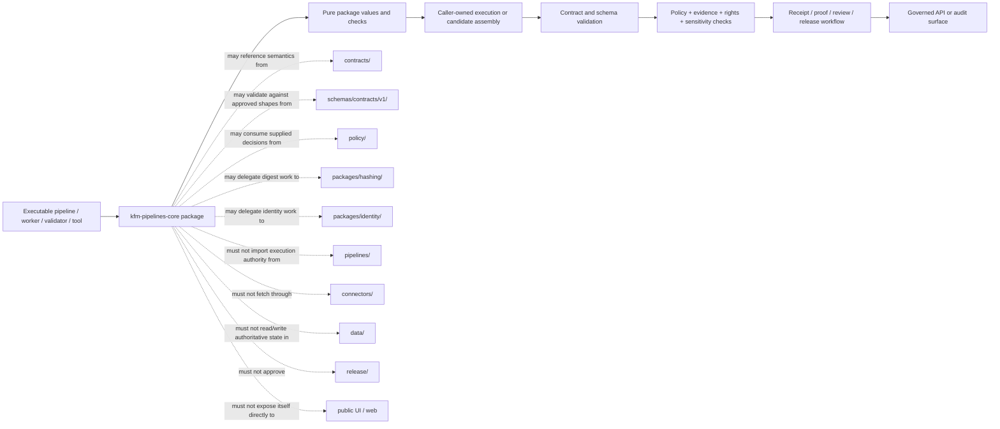

<!-- [KFM_META_BLOCK_V2]
doc_id: kfm://doc/packages-pipelines-core-readme
title: packages/pipelines-core/ — Package Boundary and Greenfield Pipeline-Control Scaffold
type: readme
version: v1.1
status: draft
owners: OWNER_TBD — Package steward · Pipeline steward · Runtime steward · Contract steward · Schema steward · Policy steward · Evidence/receipt steward · Validation steward · Security steward · Release steward · CI steward · Docs steward
created: NEEDS VERIFICATION — target existed before this evidence-grounded revision
updated: 2026-07-15
policy_label: "public-doctrine; package-boundary; python-package-scaffold; greenfield-placeholder; build-unconfigured; api-unratified; consumers-unverified; tests-unestablished; no-network-by-default; deterministic-helper-candidate; run-receipt-aware; lifecycle-subordinate; evidence-subordinate; policy-subordinate; release-subordinate; fail-closed; no-truth-authority; no-publication-authority; migration-required; rollback-aware"
current_path: packages/pipelines-core/README.md
truth_posture: >
  CONFIRMED target README v1, package metadata name kfm-pipelines-core and version 0.0.0,
  repository-present package README, minimal package pyproject, merged source-envelope README v1.1,
  merged pipelines_core namespace README v1.1, empty pipelines_core/__init__.py, comment-only
  pipelines_core/core.py greenfield placeholder, root Python scaffold, packages responsibility-root
  doctrine, runtime RunReceipt semantic contract, paired proposed schema, executable schema-validator
  wrapper, minimal valid/invalid schema fixtures, deny-by-default RunReceipt policy scaffold, common
  schema-fixture harness, and bounded absence of an established build backend, package discovery,
  functional source modules, public exports, repository consumers, package-local tests, package-specific
  CI, verified runtime/pipeline wiring, receipt persistence, release use, or deployment use / PROPOSED a
  small reusable Python distribution boundary for deterministic pipeline-control helpers, explicit
  dependency direction, pure/effectful separation, RunReceipt-candidate integration, package test matrix,
  staged adoption, compatibility controls, correction, deprecation, and rollback / CONFLICTED prior README
  claims that described the package as an implemented shared helper library, named absent modules and
  imports, treated broad consumers as present, and used helper outcomes not ratified by code or contract;
  distribution name kfm-pipelines-core versus unconfigured import-package discovery; proposed ADR-0001
  wording versus Directory Rules treating the schema home as canonical doctrine; prior helper-outcome
  vocabulary versus schema-confirmed RunReceipt outcome SUCCESS|PARTIAL|FAIL / UNKNOWN accepted package
  API, build system for this subpackage, package discovery mapping, Python support policy, dependency set,
  type-checking policy, semantic versioning, owners, CODEOWNERS coverage, consumer set, runtime integration,
  policy integration, CI enforcement, release use, deployment use, and operational health / NEEDS
  VERIFICATION maintainer approval, metadata completion, import-name decision, API contract,
  contract/schema bindings, test home, negative-state vocabulary, first consumer, CI path coverage,
  distribution policy, correction process, deprecation window, and rollback automation
evidence_snapshot:
  repository: bartytime4life/Kansas-Frontier-Matrix
  repository_id: "1059091169"
  visibility: public
  base_ref: main
  base_commit: df4a37b0a6779827baa02e6cc99d9315154bb831
  prior_blob: b3a290bc37960a5b4cc2b019596200d68df866a9
  source_readme_blob: b079a1823ab4b2ddd5d323ccc210d00f85be37ea
  namespace_readme_blob: f1b069c91289890f371a2bd640dba31d7432659e
  package_metadata_blob: 09bedd096422d22ae0cc187bfd2469dbe0bdab13
  namespace_init_blob: e69de29bb2d1d6434b8b29ae775ad8c2e48c5391
  namespace_core_blob: 610692013a4ef98bc48d14508ffdc7ad2b96205b
  root_pyproject_blob: e3bd40e8e6ce14dfcde78ff5c09608095c3eca76
  packages_root_blob: fc18fb3334fefe992a551fe12aa98c812232cd17
  directory_rules_blob: 2affb080e6f0043867c64c7f06c1ca52030fbd55
  drift_register_blob: 97a775522dcd058299f752ac7862d0fc56c13280
  schema_home_adr_blob: ab0010a278d766356845c23055f882f328abb418
  run_receipt_contract_blob: 5592aa5e22bbdd0c668189f79b50c18f7d1b2479
  run_receipt_schema_blob: 80d13bcb750d56c769da2f8871242388f7f50a69
  run_receipt_validator_blob: 9b59481e90c021f0f92b74511c43fcefbbe3a057
  run_receipt_policy_blob: 5fa096c9d65183b0b3333e05434bbf6f2ab9c0b7
  run_receipt_fixtures_readme_blob: 2937d4665e217017fb7b28ae3a6273b76d85f980
  common_schema_test_blob: b04342cc034d7f1cc554e155fdd02d6e972976e6
  docs_build_workflow_blob: 3841ed36c0af0a41621992aff1d932cfca9ac082
  link_check_workflow_blob: 9326c5dce2fd99c70293ac61886d289e2fc15a0c
  docs_control_plane_workflow_blob: e50351863cce87a00df03356832b8deada56b325
  merged_source_readme_pr: 1228
  merged_source_readme_commit: e2d046708356b334c7c3d4f45b82b9c73b06c49c
  bounded_path_checks:
    - packages/pipelines-core/README.md existed at version v1 before this revision
    - packages/pipelines-core/pyproject.toml exists with project name kfm-pipelines-core and version 0.0.0
    - the package pyproject contains no build-system, Python requirement, description, license, authors, dependencies, optional dependencies, scripts, entry points, package-discovery configuration, or tool configuration
    - packages/pipelines-core/src/README.md exists at version v1.1 on main
    - packages/pipelines-core/src/pipelines_core/README.md exists at version v1.1 on main
    - packages/pipelines-core/src/pipelines_core/__init__.py exists and is empty
    - packages/pipelines-core/src/pipelines_core/core.py exists and contains only a greenfield-placeholder comment
    - bounded repository search found no functional pipelines_core consumer import
    - packages/pipelines-core/tests/README.md was not found in the prior namespace inspection
    - tests/packages/pipelines-core/README.md was not found in the prior namespace inspection
    - tests/packages/pipelines_core/README.md was not found in the prior namespace inspection
    - bounded repository search found no package-specific workflow or pipelines-core implementation reference beyond documentation/scaffold files
    - contracts/runtime/run_receipt.md and schemas/contracts/v1/runtime/run_receipt.schema.json exist
    - tools/validators/validate_run_receipt.py exists as a thin schema-validator wrapper
    - fixtures/contracts/v1/runtime/run_receipt contains one documented valid fixture and one documented invalid missing-run-id fixture
    - policy/runtime/run_receipt.rego is a deny-by-default proposed scaffold
    - root pyproject uses Hatchling for the root kfm package but explicitly states that subpackages carry their own pyproject files
    - root package configuration does not prove that packages/pipelines-core is installable or discovered
    - docs-build, link-check, and docs-control-plane workflows trigger on ordinary pull requests but the inspected jobs currently run TODO echo stubs
related:
  - ../README.md
  - pyproject.toml
  - src/README.md
  - src/pipelines_core/README.md
  - src/pipelines_core/__init__.py
  - src/pipelines_core/core.py
  - ../../pyproject.toml
  - ../../docs/doctrine/directory-rules.md
  - ../../docs/adr/ADR-0001-schema-home--schemas-contracts-v1-is-canonical.md
  - ../../docs/registers/DRIFT_REGISTER.md
  - ../../pipelines/README.md
  - ../../pipeline_specs/README.md
  - ../../contracts/runtime/run_receipt.md
  - ../../schemas/contracts/v1/runtime/run_receipt.schema.json
  - ../../policy/runtime/run_receipt.rego
  - ../../fixtures/contracts/v1/runtime/run_receipt/README.md
  - ../../tools/validators/validate_run_receipt.py
  - ../../tests/schemas/test_common_contracts.py
tags: [kfm, packages, pipelines-core, python, package, scaffold, pipeline-control, run-receipt, lifecycle, replay, idempotency, negative-state, evidence, policy, validation, compatibility, migration, rollback]
notes:
  - "This revision changes only packages/pipelines-core/README.md."
  - "The package currently contains this README, a minimal pyproject.toml, and a src tree whose only Python namespace code is an empty __init__.py and a comment-only core.py placeholder."
  - "This README does not make the package installable, define an accepted API, create exports, approve dependencies, establish consumers, run pipelines, write receipts, accept an ADR, or prove CI/runtime behavior."
  - "Prior proposed module names, imports, consumers, and helper outcomes are retained only as superseded documentation lineage; they are not current implementation facts or compatibility commitments."
[/KFM_META_BLOCK_V2] -->

<a id="top"></a>

# Pipelines Core Package Boundary and Greenfield Pipeline-Control Scaffold

`packages/pipelines-core/`

> Package-level governance and implementation boundary for a future reusable Python pipeline-control library. Current evidence establishes a `0.0.0` metadata stub, two evidence-grounded READMEs, an empty package initializer, and a comment-only `core.py` placeholder—not an installable distribution, functional helper library, accepted API, pipeline engine, receipt writer, policy evaluator, evidence authority, or release component.


**Quick links:** [Purpose](#purpose) · [Impact](#impact-and-operating-posture) · [Evidence](#status-and-evidence) · [Placement](#directory-rules-and-authority) · [Inventory](#confirmed-package-inventory) · [Packaging](#packaging-build-import-and-api-status) · [Source](#source-envelope-and-namespace-boundaries) · [Responsibilities](#proposed-responsibility-envelope) · [Dependencies](#dependency-direction) · [Lifecycle](#lifecycle-and-trust-membrane) · [RunReceipt](#runreceipt-integration-boundary) · [Effects](#inputs-outputs-and-side-effects) · [Reliability](#determinism-identity-idempotency-and-replay) · [Errors](#errors-retry-resume-and-outcome-vocabularies) · [Security](#security-rights-sensitivity-and-privacy) · [Consumers](#consumer-versioning-and-compatibility-boundary) · [Testing](#testing-fixtures-and-ci) · [Implementation](#smallest-sound-implementation-sequence) · [Done](#definition-of-done) · [Open](#verification-register) · [Drift](#drift-and-conflicts) · [Rollback](#rollback-correction-and-deprecation)

> [!IMPORTANT]
> **This README is not implementation evidence for a pipeline-control package.** It does not establish installation, import success, package discovery, exports, dependency approval, consumer adoption, runtime wiring, receipt persistence, policy integration, pipeline execution, test coverage, CI enforcement, release use, deployment use, or operational health.

> [!CAUTION]
> **A successful package helper or pipeline run would not become KFM public truth.** Evidence resolution, policy, validation, review, promotion, release state, correction lineage, and rollback remain separate governed authorities.

---

<a id="purpose"></a>

## Purpose

This README defines the package-level responsibility, packaging, trust, compatibility, validation, and rollback boundary for:

```text
packages/pipelines-core/
```

The directory is a candidate home for a **small reusable library** of deterministic pipeline-control values and pure checks that are used by more than one executable workflow, worker, validator, or maintenance tool.

The current repository state is narrower:

- `pyproject.toml` declares only the distribution name `kfm-pipelines-core` and version `0.0.0`;
- the package manifest does not define a build backend, Python requirement, discovery mapping, dependencies, scripts, entry points, or test configuration;
- `src/` and `src/pipelines_core/` contain evidence-grounded boundary READMEs;
- `src/pipelines_core/__init__.py` is empty;
- `src/pipelines_core/core.py` is a comment-only greenfield placeholder;
- no functional package module, public export, consumer import, package-local test lane, or package-specific CI workflow has been established by the bounded checks recorded here.

This README therefore has three jobs:

1. record the **CONFIRMED placeholder state** without turning design intent into implementation fact;
2. define a **PROPOSED reusable package boundary** that future code must satisfy; and
3. make the evidence, review, compatibility, correction, and rollback burden explicit before the package can be adopted.

It must not substitute for source code, semantic contracts, machine schemas, policy, fixtures, tests, validation reports, receipts, proof artifacts, release records, or runtime evidence.

[Back to top](#top)

---

<a id="impact-and-operating-posture"></a>

## Impact and operating posture

| Surface | Current status | Package effect | Required posture |
|---|---:|---|---|
| Repository placement | **CONFIRMED** | Package exists under `packages/`. | Preserve shared-library responsibility; do not move casually. |
| Distribution metadata | **CONFIRMED placeholder** | Name and version exist. | Do not claim installability. |
| Source envelope | **CONFIRMED placeholder** | `src/` and one namespace exist. | Keep source admission narrow and evidence-backed. |
| Functional behavior | **NOT ESTABLISHED** | No helper behavior is implemented. | Treat examples as proposed only. |
| Public API | **NOT ESTABLISHED** | No exports or compatibility promise exists. | No consumer may rely on undocumented internals. |
| Consumers | **NOT FOUND by bounded search** | No migration burden is currently proved. | Re-run search before adoption. |
| Package tests | **NOT FOUND at checked paths** | No behavior is proved. | Add tests before first functional export. |
| Package-specific CI | **NOT ESTABLISHED** | No path-scoped enforcement is proved. | Add CI before broad reuse. |
| Runtime integration | **UNKNOWN** | No pipeline-control wiring is proved. | Require first-consumer evidence. |
| RunReceipt integration | **PROPOSED only** | Adjacent contract surfaces exist. | Validate against contract/schema before persistence. |
| Truth/publication authority | **NONE** | Package cannot publish or approve claims. | Preserve trust membrane and governed release. |
| Rights/sensitivity authority | **NONE** | Package cannot decide disclosure. | Consume supplied decisions; fail closed when absent. |

### Change impact of this README revision

This revision is documentation-only. It:

- corrects package maturity claims;
- aligns the package entrypoint with the merged `src/README.md` and `src/pipelines_core/README.md` v1.1 boundaries;
- records actual package metadata and inventory;
- distinguishes the distribution boundary from the Python import namespace;
- preserves lifecycle, evidence, policy, security, and publication separations;
- defines future package admission and validation gates;
- does not alter executable behavior, dependencies, package installation, test execution, workflow configuration, data, receipts, proofs, or release state.

[Back to top](#top)

---

<a id="status-and-evidence"></a>

## Status and evidence

### Evidence verdict

| Surface | Status | Safe conclusion |
|---|---:|---|
| Target README | **CONFIRMED v1 before revision** | A package-boundary document existed but over-described implementation. |
| Package directory | **CONFIRMED present** | `packages/pipelines-core/` is repository-present. |
| Package manifest | **CONFIRMED placeholder** | Distribution name is `kfm-pipelines-core`; version is `0.0.0`. |
| Build backend | **NOT DECLARED** | This subpackage does not establish a build backend. |
| Python requirement | **NOT DECLARED** | Root `>=3.11` does not automatically establish subpackage policy. |
| Package discovery | **NOT DECLARED** | No mapping from `src/pipelines_core` to an installable wheel is configured. |
| Dependencies | **NOT DECLARED** | No runtime or optional dependencies are approved here. |
| Source envelope | **CONFIRMED present** | `src/` exists and has a v1.1 boundary README. |
| Namespace | **CONFIRMED present** | `src/pipelines_core/` exists and has a v1.1 boundary README. |
| `__init__.py` | **CONFIRMED empty** | No public export surface is defined. |
| `core.py` | **CONFIRMED comment-only** | No runtime behavior is implemented. |
| Functional modules | **NOT FOUND by bounded checks** | Earlier names such as `run_modes.py` are not implementation facts. |
| Repository consumers | **NOT FOUND by bounded search** | No code import of `pipelines_core` was established. |
| Package-local tests | **NOT FOUND at checked paths** | No package behavior is proved. |
| Package-specific workflow | **NOT ESTABLISHED** | No path-scoped CI implementation was established. |
| RunReceipt contract surfaces | **CONFIRMED adjacent** | Contract, schema, validator wrapper, fixtures, and policy scaffold exist separately. |
| Package-to-RunReceipt integration | **NOT ESTABLISHED** | No package builder, serializer, validator call, or persistence path is proved. |
| Operational health | **UNKNOWN** | No runtime deployment or telemetry surface is established. |

### Truth-label application

- **CONFIRMED** identifies files, fields, values, commits, or bounded absence checks inspected in this work.
- **PROPOSED** identifies future package design, module responsibility, API, tests, or adoption sequence.
- **CONFLICTED** identifies documentation or authority statements that do not presently align.
- **UNKNOWN** identifies runtime, deployment, ownership, consumer, or operational facts not proved.
- **NEEDS VERIFICATION** identifies concrete checks required before implementation or adoption.

### Corrections from v1

The prior README safely preserved many governance boundaries but also presented proposed implementation detail too fluently. This revision corrects those points:

| Prior implication | Current evidence | Correction |
|---|---|---|
| Package is a shared helper-code implementation | Source contains only empty/comment placeholders | Treat as greenfield scaffold. |
| Package metadata was unknown | Minimal `pyproject.toml` was inspected | Record exact name/version and missing fields. |
| Source and namespace were uncertain | Both are repository-present with v1.1 READMEs | Record confirmed tree. |
| Named modules were expected current layout | Named modules are absent | Keep names only as non-binding design lineage. |
| Example imports could be used | No discovery or exports are configured | Remove as current usage guidance. |
| Broad consumers use the package | No functional imports were found | Mark consumers unverified. |
| Helper outcomes were package semantics | No code/contract ratifies them | Separate proposed local results from governed outcomes. |
| Tests/fixtures might exist in conventional homes | Checked package test README paths were absent | Define required test lane without claiming it exists. |
| Root Python configuration might imply subpackage behavior | Root says subpackages carry their own manifests | Do not inherit installability by implication. |

[Back to top](#top)

---

<a id="directory-rules-and-authority"></a>

## Directory Rules and authority

### Placement basis

`packages/` is the KFM responsibility root for reusable implementation libraries. The package placement is appropriate only while the code is genuinely shared, bounded, deterministic where promised, and subordinate to the authorities it serves.

Directory selection is by responsibility, not by the words “pipeline” or “core”:

- reusable helper values and pure checks may belong in `packages/pipelines-core/`;
- executable workflows belong in `pipelines/`;
- declarative workflow specifications belong in `pipeline_specs/`;
- source activation and fetch behavior belong in `connectors/`;
- contracts, schemas, policy, lifecycle data, receipts, proofs, release decisions, APIs, UIs, and tools remain in their governing roots.

A one-off workflow-specific helper does **not** qualify for this package merely because it controls a pipeline. It should remain with the owning pipeline or tool until reuse and abstraction are demonstrated.

### Package responsibility map

| Responsibility | Governing home | Relationship to this package |
|---|---|---|
| Distribution metadata | `packages/pipelines-core/pyproject.toml` | Package-level ownership; currently incomplete. |
| Source placement | `packages/pipelines-core/src/` | Package source envelope; currently placeholder. |
| Python namespace | `packages/pipelines-core/src/pipelines_core/` | Candidate import namespace; API unratified. |
| Executable workflows | `pipelines/` | May consume package later; never owned here. |
| Declarative pipeline specs | `pipeline_specs/` | May constrain callers; never redefined here. |
| Connectors and credentials | `connectors/` plus secret infrastructure | Package must not fetch or own credentials. |
| Semantic contracts | `contracts/` | Package may implement against them; may not redefine meaning. |
| Machine schemas | `schemas/contracts/v1/` | Package may validate candidates; may not create a parallel schema home. |
| Policy | `policy/` | Package consumes decisions/refs; does not decide authorization. |
| Lifecycle data | `data/<phase>/` | Package may carry refs; does not store or promote data. |
| Receipts and proofs | `data/receipts/`, `data/proofs/` | Package may build candidates; does not persist authority records. |
| Evidence | evidence packages and governed stores | Package preserves refs; does not resolve evidence sufficiency. |
| Release | `release/` | Package cannot approve, publish, supersede, or roll back releases. |
| Public API | `apps/` or repo-confirmed API root | Must expose governed outputs, not package internals. |
| UI and web | `ui/`, `web/`, or repo-confirmed surfaces | Must consume governed interfaces, not this package directly. |
| Validators/tools | `tools/` | May call package code later; remain separate executables. |
| Tests/fixtures | repo-approved test and fixture roots | Must prove behavior before adoption. |

### Authority statement

This package may eventually implement **mechanics**, not **authority**.

It may calculate or validate a locally bounded result. It may not decide that:

- a source is admissible;
- a right permits publication;
- a sensitive location is safe to expose;
- evidence is complete;
- a claim is true;
- a candidate is promoted;
- a release is published;
- a correction is closed;
- a rollback is authorized.

Those decisions require their governing contracts, schemas, policy, evidence, review, validation, and release surfaces.

### No parallel authority

Do not create package-local substitutes for:

- `RunReceipt` contracts or schemas;
- pipeline specifications;
- source descriptors;
- policy outcomes;
- evidence bundles;
- release manifests;
- correction notices;
- rollback records;
- runtime response envelopes;
- canonical lifecycle registries.

Adapters or typed projections may be proposed only when they preserve upstream semantics, name their authority source, validate round trips where applicable, and avoid becoming a second canonical definition.

[Back to top](#top)

---

<a id="confirmed-package-inventory"></a>

## Confirmed package inventory

### Repository-present tree

```text
packages/pipelines-core/
├── README.md
├── pyproject.toml
└── src/
    ├── README.md
    └── pipelines_core/
        ├── README.md
        ├── __init__.py
        └── core.py
```

### File verdicts

| Path | Status | Current meaning |
|---|---:|---|
| `README.md` | **CONFIRMED** | Package-level boundary; revised here. |
| `pyproject.toml` | **CONFIRMED placeholder** | Declares name/version only. |
| `src/README.md` | **CONFIRMED v1.1** | Source-envelope boundary and staged implementation gates. |
| `src/pipelines_core/README.md` | **CONFIRMED v1.1** | Namespace boundary and placeholder inventory. |
| `src/pipelines_core/__init__.py` | **CONFIRMED empty** | Package marker only; no exports. |
| `src/pipelines_core/core.py` | **CONFIRMED comment-only** | Greenfield placeholder; no behavior. |

### Not established

The bounded evidence does not establish any of the following:

- `LICENSE` or package-specific license declaration;
- `CHANGELOG.md`;
- build backend in the subpackage manifest;
- package discovery configuration;
- runtime dependency declaration;
- optional development/test dependencies;
- console scripts or entry points;
- generated version source;
- `py.typed` marker;
- public API module;
- typed value/result models;
- functional pipeline-control helpers;
- package-local tests;
- package-local fixtures;
- package-specific lint, type, build, or test workflow;
- artifact publication or package registry configuration;
- consumer imports;
- package ownership or CODEOWNERS mapping;
- release notes or deprecation policy implementation;
- runtime metrics, logs, or service health.

### Superseded design lineage

The prior README named candidate modules such as:

```text
run_modes.py
run_state.py
receipt_metadata.py
errors.py
retries.py
lifecycle.py
replay.py
validation.py
fixtures.py
py.typed
```

Those names remain potentially useful design prompts, but they are **not** present implementation, approved architecture, reserved API, or compatibility commitments. Future module names should follow an accepted contract and the smallest first-consumer need rather than reproducing an old illustrative tree by default.

[Back to top](#top)

---

<a id="packaging-build-import-and-api-status"></a>

## Packaging, build, import, and API status

### Confirmed subpackage metadata

```toml
[project]
name = "kfm-pipelines-core"
version = "0.0.0"
```

This proves only that a PEP 621-style project table was started.

It does not prove that the package can be built, installed, imported, tested, published, or consumed.

### Missing package metadata

The subpackage manifest does not currently declare:

| Field or section | Current status | Why it matters |
|---|---:|---|
| `[build-system]` | **Absent** | Build frontend cannot infer an approved backend from this file. |
| `requires-python` | **Absent** | Supported interpreter versions are not a package contract. |
| `description` | **Absent** | Distribution purpose is not machine metadata. |
| `readme` | **Absent** | Package build does not bind this README. |
| `license` | **Absent** | Distribution rights are unresolved. |
| `authors` / `maintainers` | **Absent** | Package stewardship is not encoded. |
| `dependencies` | **Absent** | Runtime dependency closure is not declared. |
| optional dependencies | **Absent** | Test/dev tooling is not declared. |
| scripts / entry points | **Absent** | No executable interface is defined. |
| package discovery | **Absent** | `src/pipelines_core` is not mapped to wheel contents. |
| typed marker policy | **Absent** | Static typing support is not promised. |
| version source | **Absent** | Version synchronization is not defined. |
| repository URLs | **Absent** | Distribution metadata is incomplete. |
| classifiers | **Absent** | Maturity and Python support are not declared. |
| test/tool configuration | **Absent** | No package-scoped test/lint/type behavior is configured. |

### Root project does not complete this subpackage

The repository root `pyproject.toml`:

- uses Hatchling;
- declares the root project `kfm` at `0.0.0`;
- declares Python `>=3.11` for the root project;
- explicitly states that subpackages carry their own `pyproject.toml` files;
- configures the root wheel to package `src/kfm`.

Therefore:

- the root build backend does not automatically prove a build backend for `packages/pipelines-core/`;
- the root Python requirement is informative context, not a confirmed subpackage compatibility promise;
- the root wheel discovery does not include `packages/pipelines-core/src/pipelines_core`;
- the root dependency list does not automatically become an approved dependency set for this subpackage.

### Distribution name versus import name

The distribution name is confirmed:

```text
kfm-pipelines-core
```

The repository-present namespace candidate is:

```text
pipelines_core
```

That relationship is conventional but not yet configured or tested.

Before anyone treats it as an install/import contract, the package must prove:

1. an accepted build backend;
2. explicit package discovery from `src/`;
3. a successful wheel build;
4. installation into a clean environment;
5. successful import of the intended namespace;
6. package metadata inspection matching the intended distribution;
7. no accidental inclusion of repository-internal files;
8. no undeclared dependencies.

### Public API status

**No public package API is established.**

Specifically:

- empty `__init__.py` exports nothing;
- `core.py` implements nothing;
- no symbols are documented as accepted;
- no versioning policy protects symbol stability;
- no tests assert import or behavior contracts;
- no consumer establishes a de facto interface.

Until an API is accepted:

- internal module paths are unstable;
- example imports must be labeled proposed;
- callers must not vendor assumptions from README prose;
- a first consumer should depend only on the smallest reviewed symbol set;
- package version remains pre-adoption and must not imply compatibility guarantees.

### Proposed import boundary

A future import boundary should:

- expose a deliberately small set of stable values and pure functions;
- keep effectful adapters separate from pure semantic checks;
- avoid wildcard exports;
- avoid importing connectors, apps, release, or data stores at package import time;
- avoid hidden environment reads;
- avoid network or filesystem effects during import;
- remain safe in offline validation and test contexts;
- provide explicit deprecation before removing accepted symbols.

[Back to top](#top)

---

<a id="source-envelope-and-namespace-boundaries"></a>

## Source envelope and namespace boundaries

### Package layer

`packages/pipelines-core/` owns package-level concerns:

- distribution metadata;
- build and discovery configuration;
- package versioning;
- package dependency policy;
- source/test layout decisions;
- package-wide documentation;
- compatibility and deprecation policy;
- package-specific CI expectations;
- artifact publication configuration, only if later approved.

### Source-envelope layer

`packages/pipelines-core/src/` owns source placement and admission rules:

- what source may enter the package;
- dependency direction;
- pure/effectful separation;
- no-network and no-authority boundaries;
- source-level test requirements;
- staged implementation order.

It does not own distribution metadata, release publication, or downstream workflow authority.

### Namespace layer

`packages/pipelines-core/src/pipelines_core/` owns the Python namespace candidate:

- package initializer and exports;
- implementation modules;
- type/value/result definitions;
- local validation functions;
- internal module organization;
- namespace-specific tests and API docs once established.

It does not own the package distribution contract by itself.

### Layer alignment rule

A behavior claim is valid only when the relevant layers agree:

| Claim | Required evidence |
|---|---|
| “File exists” | Repository path inspection. |
| “Symbol exists” | Source inspection. |
| “Symbol is exported” | `__init__.py` or approved API module plus import test. |
| “Package imports” | Build/discovery configuration plus clean-environment import test. |
| “Package supports Python X” | Package metadata plus CI matrix. |
| “Package API is stable” | Version policy, docs, tests, and accepted review state. |
| “Pipeline uses package” | Consumer import and runtime/test evidence. |
| “Package emits valid RunReceipt candidate” | Contract/schema mapping plus validator tests. |
| “Receipt is persisted” | Owning persistence workflow evidence—not package prose. |
| “Package is released” | Package artifact/release evidence and rights review. |

### Source admission test

Before a new source file is added, reviewers should answer:

1. Is the behavior reused by more than one governed caller, or is reuse imminent and evidenced?
2. Is it deterministic or are its effects explicit and injectable?
3. Does it preserve authority boundaries?
4. Is its semantic contract identified?
5. Are negative paths finite and testable?
6. Can it run with synthetic, public-safe fixtures?
7. Does it avoid direct lifecycle-store, connector, secret, model, release, and public-client access?
8. Does it have a rollback and compatibility story?

A “no” does not always prohibit implementation, but it usually means the code belongs with a pipeline/tool or needs a narrower design first.

[Back to top](#top)

---

<a id="proposed-responsibility-envelope"></a>

## Proposed responsibility envelope

Everything in this section is **PROPOSED** until implemented, tested, reviewed, and adopted.

### Candidate responsibilities

A mature package could provide a small set of reusable primitives for:

| Candidate area | Narrow package role | Excluded authority |
|---|---|---|
| Run context | Validate explicit run identifiers and immutable context values. | Does not create an authoritative run record. |
| Local execution mode | Represent finite caller-selected modes. | Does not authorize a workflow or promotion. |
| Local step transition | Check a supplied transition against an accepted finite-state contract. | Does not mutate pipeline state stores. |
| Receipt candidate | Assemble explicit fields into a candidate object. | Does not persist or approve a RunReceipt. |
| Stable error mapping | Map known local conditions to reviewed reason codes. | Does not decide policy or public response. |
| Retry calculation | Produce a deterministic retry plan from supplied policy. | Does not sleep, schedule, or silently retry. |
| Idempotency input | Canonicalize explicit fields for hashing. | Does not own the hashing algorithm unless delegated. |
| Replay comparison | Compare explicit expected and observed values. | Does not declare release integrity by itself. |
| Lifecycle-ref checks | Validate phase labels and obvious illegal public exposure candidates. | Does not promote or publish lifecycle data. |
| Result vocabulary | Return finite local evaluation states. | Does not replace policy, runtime, receipt, or release outcomes. |
| Test builders | Create synthetic value objects for package tests. | Does not copy production records or sensitive examples. |

### Candidate non-responsibilities

The package must not become:

- a pipeline engine;
- a DAG scheduler;
- a task queue;
- a connector framework;
- a source registry;
- a raw-data client;
- a lifecycle storage abstraction that hides phase ownership;
- a schema registry;
- a semantic-contract registry;
- a policy engine;
- an evidence resolver;
- a truth-claim generator;
- a receipt database;
- a proof store;
- a release manager;
- an API gateway;
- a UI state manager;
- an AI orchestration layer;
- a secrets manager;
- a telemetry backend.

### Reuse threshold

A helper belongs here only when at least one of these conditions is met and evidenced:

- two or more independent callers need identical semantics;
- a contract requires one shared implementation to prevent drift;
- a validator and runtime need the same pure conversion/check;
- a first consumer is imminent, reviewed, and the abstraction is smaller than duplicating a contract-sensitive behavior.

“Core” is not permission to generalize speculative functionality. Prefer one small, tested primitive over a broad framework built without consumers.

### Function design posture

Future functions should generally:

- accept explicit immutable values or frozen/validated models;
- return explicit finite results;
- avoid hidden global state;
- avoid current-time reads unless a clock is supplied;
- avoid random values unless a generator/seed is supplied;
- avoid environment reads unless configuration is passed by the caller;
- separate normalization from validation;
- preserve source references rather than dereferencing them silently;
- preserve unknown/negative states;
- expose stable reason codes alongside human-readable context;
- avoid raising generic exceptions for expected negative outcomes;
- never translate “missing evidence” into success.

[Back to top](#top)

---

<a id="dependency-direction"></a>

## Dependency direction

### Allowed conceptual direction



### Dependency rules

A future package should:

- depend on the standard library by default;
- add third-party dependencies only with explicit justification, pinning policy, license/security review, and CI coverage;
- prefer protocol/value boundaries over importing large application modules;
- avoid import-time side effects;
- avoid optional dependency behavior that silently changes semantics;
- keep schema loading explicit and versioned;
- keep policy evaluation in the policy layer;
- delegate hashing and identity when repository packages establish those responsibilities;
- avoid cyclic dependencies among shared packages;
- avoid importing executable pipeline modules;
- avoid package-to-app dependencies.

### Cycle prevention

Prohibited dependency cycles include:

```text
pipelines-core -> pipeline implementation -> pipelines-core
pipelines-core -> connector -> pipelines-core
pipelines-core -> app/API -> pipelines-core
pipelines-core -> release -> pipelines-core
pipelines-core -> evidence resolver -> runtime orchestration -> pipelines-core
```

To prevent cycles:

1. define small input/output protocols or value objects;
2. keep orchestration in callers;
3. inject effectful behavior;
4. avoid package imports from responsibility roots that consume the package;
5. add import-graph checks once functional modules appear.

### Contract/schema/policy split

The package may implement against all three surfaces, but must preserve their differences:

| Surface | Owns | Package relationship |
|---|---|---|
| Semantic contract | Meaning and obligations | Read and implement; do not redefine. |
| Machine schema | Shape and validation constraints | Validate candidates; do not treat shape as complete meaning. |
| Policy | Contextual allow/deny/restrict/hold obligations | Consume supplied decision or call approved evaluator through caller-owned integration. |

Passing a schema is not evidence closure. A policy allow is not proof of factual truth. A contract-complete candidate is not a published release.

[Back to top](#top)

---

<a id="lifecycle-and-trust-membrane"></a>

## Lifecycle and trust membrane

KFM’s default lifecycle remains:

```text
RAW -> WORK / QUARANTINE -> PROCESSED -> CATALOG / TRIPLET -> PUBLISHED
```

### Package role

A future package may help callers validate or carry lifecycle-aware values, but it does not own any lifecycle state transition.

It may return a local evaluation such as:

- phase label is recognized;
- proposed transition is locally compatible with an accepted transition table;
- public exposure candidate references a non-published phase;
- required lifecycle metadata is absent;
- replay comparison differs from expected metadata.

The caller and governing workflow remain responsible for:

- reading authoritative state;
- applying policy;
- writing state;
- emitting receipts;
- collecting proof;
- obtaining review;
- promoting or publishing;
- correcting or rolling back.

### Trust-membrane invariants

The package must never make these transformations silently:

| Unsafe collapse | Required behavior |
|---|---|
| RAW reference -> public URL | Reject or return explicit negative state. |
| WORK candidate -> validated result | Require caller-owned validation evidence. |
| QUARANTINE item -> normal output | Preserve quarantine and deny exposure. |
| PROCESSED artifact -> published claim | Require catalog/evidence/policy/release state. |
| Schema-valid receipt candidate -> authoritative receipt | Require owning persistence and review path. |
| Local success -> evidence closure | Preserve separate evidence state. |
| Policy allow -> truth | Preserve separate factual support. |
| Merge/commit -> KFM PUBLISHED | Preserve governed release state. |

### Cite-or-abstain support

The package may carry evidence references or detect missing required references. It must not fabricate citations, resolve evidence through generated language, or convert missing evidence into a positive result.

When a caller requires evidence and none is supplied, the package should return a reviewed negative/indeterminate local state. The caller then maps that state through policy and runtime contracts.

### Promotion is not a file move

No package helper may define promotion as moving or renaming a path alone.

A governed promotion requires the owning workflow to evaluate appropriate support, which may include:

- identity and hashes;
- source authority and rights;
- sensitivity posture;
- schema/contract validation;
- evidence closure;
- review state;
- receipts and proofs;
- release state;
- correction and rollback targets.

### Public client rule

Normal public clients and UI surfaces must not import or invoke package internals as a truth source. They consume governed API responses or published artifacts after upstream controls have completed.

[Back to top](#top)

---

<a id="runreceipt-integration-boundary"></a>

## RunReceipt integration boundary

The repository contains separate RunReceipt support surfaces:

- semantic contract: `contracts/runtime/run_receipt.md`;
- machine schema: `schemas/contracts/v1/runtime/run_receipt.schema.json`;
- validator wrapper: `tools/validators/validate_run_receipt.py`;
- fixtures: `fixtures/contracts/v1/runtime/run_receipt/`;
- policy scaffold: `policy/runtime/run_receipt.rego`;
- common schema fixture harness: `tests/schemas/test_common_contracts.py`.

These surfaces do not prove that `kfm-pipelines-core` currently integrates with RunReceipt.

### Schema-confirmed fields

The inspected schema requires:

```text
run_id
stage
inputs
outputs
code_ref
spec_hash
source_descriptor_refs
validation_refs
outcome
```

The schema-confirmed `outcome` values are:

```text
SUCCESS | PARTIAL | FAIL
```

Future package code must not silently extend, rename, or reinterpret those fields or enum values.

### Candidate-builder posture

A package-level helper may eventually assemble a **RunReceipt candidate** from explicit caller inputs.

A candidate builder should:

1. accept all required fields explicitly;
2. avoid filesystem, environment, network, or clock reads unless injected;
3. preserve ordered/unordered collection semantics defined by the contract;
4. serialize deterministically where hashing depends on serialization;
5. reject unsupported fields rather than silently dropping them;
6. return validation detail separately from the candidate;
7. permit schema validation before persistence;
8. avoid writing the receipt;
9. avoid declaring review, proof, or release completion.

### Persistence boundary

The package must not decide where receipts are stored or when they become authoritative.

Receipt persistence belongs to a governed workflow that can provide:

- authoritative run context;
- schema and semantic validation;
- source descriptor references;
- policy and sensitivity context;
- code/spec identity;
- integrity checks;
- review state;
- correction and rollback linkage.

### Outcome non-collapse

Keep these vocabularies separate:

| Vocabulary | Example | Owner |
|---|---|---|
| Local package evaluation | `VALID`, `INVALID`, `INDETERMINATE` — **PROPOSED** | Package contract, once accepted. |
| RunReceipt outcome | `SUCCESS`, `PARTIAL`, `FAIL` — **SCHEMA-CONFIRMED** | RunReceipt contract/schema. |
| Policy decision | allow, deny, restrict, hold, abstain — exact enum **NEEDS VERIFICATION** | Policy contract. |
| Runtime/public response | ANSWER, ABSTAIN, DENY, ERROR — exact contract **NEEDS VERIFICATION** | Runtime envelope. |
| Release state | candidate, reviewed, released, superseded, rolled back — exact enum **NEEDS VERIFICATION** | Release contract. |

Do not infer one vocabulary from another without an explicit adapter and tests.

### RunReceipt compatibility tests

Before package integration is accepted, tests should prove:

- required-field completeness;
- rejection of unknown fields when schema forbids them;
- exact outcome enum handling;
- stable ordering/canonicalization;
- no hidden field synthesis;
- preservation of source descriptor refs;
- preservation of validation refs;
- stable spec-hash input handling;
- valid fixture acceptance;
- invalid fixture rejection;
- semantic negative cases not expressible by schema alone;
- no persistence side effect.

[Back to top](#top)

---

<a id="inputs-outputs-and-side-effects"></a>

## Inputs, outputs, and side effects

### Accepted future input classes

Future package functions may accept explicit values such as:

| Input family | Examples | Rule |
|---|---|---|
| Run identity | run id, pipeline id, step id | Caller supplies; package validates only. |
| Mode/state | local mode, prior state, proposed state | Must bind to accepted finite contract. |
| Artifact refs | input/output refs with lifecycle phase | Preserve phase; do not dereference silently. |
| Source refs | SourceDescriptor refs, fetch-receipt refs | Preserve refs; do not activate connector. |
| Code/spec refs | code ref, spec hash, config ref | Preserve exact values; do not guess. |
| Validation refs | schema/semantic validation refs | Preserve provenance; do not claim completion. |
| Evidence refs | EvidenceRef or EvidenceBundle ref | Carry; do not fabricate or resolve through AI. |
| Policy context | supplied policy decision/ref | Consume; do not independently authorize. |
| Rights/sensitivity | supplied posture and obligations | Preserve; fail closed if required and absent. |
| Retry inputs | attempt count, maximum, deterministic schedule parameters | Return a plan; do not sleep/schedule. |
| Replay inputs | prior expected values/hashes and current observed values | Compare; do not approve release. |
| Clock/randomness | injected clock or seeded generator | Required when behavior depends on them. |

### Prohibited hidden inputs

Package behavior must not depend silently on:

- current working directory;
- ambient environment variables;
- user home contents;
- global mutable registries;
- process-local caches that alter semantics;
- current wall-clock time;
- unseeded randomness;
- network availability;
- connector credentials;
- implicit current branch or commit;
- model output;
- UI state;
- operator memory;
- undocumented filesystem paths.

When such context is required, the caller must supply an explicit interface or value and tests must control it.

### Output rules

Future outputs should:

- be finite and typed;
- distinguish success, negative, and indeterminate states;
- preserve stable reason codes;
- carry relevant input references rather than copied authority records;
- avoid embedding secrets or restricted payloads;
- avoid public URLs for non-published lifecycle phases;
- avoid mutable objects whose later changes alter receipt/hash meaning;
- serialize deterministically when used in identity or integrity calculations;
- identify contract/schema version where relevant;
- expose validation detail without turning logs into authority.

### Side-effect default

The package default is **pure and offline**.

A function in the core package should not:

- perform network requests;
- open connectors;
- read canonical stores;
- write lifecycle data;
- write receipts or proofs;
- mutate release state;
- send messages;
- schedule tasks;
- sleep for retries;
- create directories;
- modify permissions;
- read secrets;
- invoke AI models;
- emit public responses.

If an effectful adapter is later necessary, it must be separately named, injected, narrowly scoped, tested, and kept out of import-time behavior. Reviewers should first consider whether it belongs in the caller instead.

### Logging and diagnostics

Package code may return structured diagnostic data. Direct logging should be minimal and configurable because logs can:

- leak sensitive references;
- become mistaken for receipts;
- create nondeterministic tests;
- couple the package to runtime infrastructure.

Do not log raw provider payloads, credentials, private records, precise protected locations, DNA/genomic content, or unrestricted living-person data.

[Back to top](#top)

---

<a id="determinism-identity-idempotency-and-replay"></a>

## Determinism, identity, idempotency, and replay

### Determinism promise

A deterministic helper should produce the same output for the same explicit inputs, accepted contract/schema versions, and dependency versions.

The promise excludes hidden context because hidden context is prohibited.

Tests should control:

- ordering;
- Unicode normalization where relevant;
- timezone and timestamp representation;
- decimal/float treatment;
- path normalization;
- optional/missing/null distinctions;
- enum casing;
- canonical JSON rules;
- dependency versions;
- seeded randomness;
- injected clock values.

### Identity boundary

The package may carry or validate identifiers, but deterministic identity grammar should remain with the repository’s identity responsibility unless an accepted design assigns a narrow part here.

Do not generate IDs from:

- display names alone;
- unstable list order;
- current time alone;
- random UUIDs where deterministic identity is required;
- undocumented concatenation;
- generated prose;
- mutable paths that do not represent semantic identity.

### Hash boundary

The package may prepare canonical inputs or compare supplied hashes. It should delegate actual repository-standard hashing to `packages/hashing/` once that package’s API is established.

A local hash helper must not create a competing algorithm or serialization rule without an ADR/migration plan.

### Idempotency

A future idempotency helper should:

1. identify the operation semantics;
2. select explicit stable inputs;
3. canonicalize them under a versioned rule;
4. delegate or apply the accepted digest algorithm;
5. include contract/spec version when semantics differ;
6. avoid secrets and unrestricted payloads in keys;
7. return the key without executing the operation;
8. permit recompute-and-compare tests.

Idempotency does not prove that an operation is safe, authorized, or published.

### Replay

Replay support should compare:

- explicit input refs;
- code/config/spec refs;
- expected output refs/hashes;
- observed output refs/hashes;
- validation refs;
- relevant contract/schema versions.

A replay result should distinguish at least:

- exact match;
- expected difference under an approved migration;
- unexplained drift;
- missing support;
- comparison error.

Exact enum names remain **PROPOSED** until ratified.

### Drift posture

Unexplained drift must not be reduced to a warning-only log when outputs may affect publication. The caller should block promotion or route the result to review/correction according to governing policy.

[Back to top](#top)

---

<a id="errors-retry-resume-and-outcome-vocabularies"></a>

## Errors, retry, resume, and outcome vocabularies

### Stable errors

Expected negative conditions should have stable machine-readable reason codes and bounded context.

Candidate categories include:

- invalid input shape;
- unsupported contract/schema version;
- illegal local transition;
- missing required reference;
- lifecycle exposure violation;
- policy context required;
- evidence context required;
- rights/sensitivity context required;
- hash mismatch;
- replay drift;
- retry exhausted;
- resume mismatch;
- dependency/configuration error.

Exact names and hierarchy are **PROPOSED**.

### Exception posture

Use exceptions for programmer errors or unexpected infrastructure conditions. Use explicit result values for expected domain-negative states when that matches the accepted API.

Do not:

- swallow exceptions and return success;
- convert policy denial to a generic transient error;
- convert missing evidence to an empty success;
- retry schema or semantic invalidity without changed inputs;
- expose stack traces to public clients through this package.

### Retry ownership

The package may calculate a retry plan from explicit inputs. It must not own scheduling, sleeping, queues, or execution.

A retry plan should preserve:

- attempt number;
- maximum attempts;
- retryable reason code;
- deterministic delay calculation or explicit supplied jitter seed;
- terminal exhaustion state;
- caller correlation/run identifiers;
- receipt-ready metadata where the contract requires it.

### Resume ownership

A resume helper may validate supplied checkpoint metadata. It must not read checkpoints from authoritative stores by itself.

Resume validation should reject:

- mismatched run or pipeline identity;
- incompatible spec/config/code refs;
- missing required input/output refs;
- phase-invalid checkpoints;
- stale or superseded checkpoints when policy forbids use;
- unverifiable hash state.

### Vocabulary separation

The prior README used `READY`, `INVALID`, `DENIED`, `ABSTAIN`, `QUARANTINE`, `RETRY`, `FAILED`, and `DRIFT` as if they were current package outcomes.

That vocabulary is not implemented or ratified. Future design should separate:

- local package evaluation;
- policy decisions;
- lifecycle actions;
- RunReceipt outcomes;
- runtime response outcomes;
- release states.

An adapter must be explicit. For example, a local `INVALID` result might map to a RunReceipt `FAIL`, but only the caller with the governing contract can make that mapping.

### Finite negative states

Whatever vocabulary is accepted, it must preserve meaningful negative states rather than collapsing them into `False`, `None`, or a generic error. Review should cover:

- invalid;
- indeterminate/missing support;
- policy denial/restriction;
- quarantine requirement;
- retryable failure;
- terminal failure;
- drift/mismatch;
- stale/superseded context.

Exact package enum names remain open.

[Back to top](#top)

---

<a id="security-rights-sensitivity-and-privacy"></a>

## Security, rights, sensitivity, and privacy

### Threat posture

Even a pure helper package can weaken governance if it:

- drops policy or evidence refs;
- normalizes restricted and public states into one value;
- logs sensitive context;
- accepts unsigned/unverified values as authoritative;
- permits path traversal or unsafe file resolution;
- imports unreviewed dependencies;
- creates ambiguous fallback behavior;
- exposes internal candidates to public callers.

### Data minimization

Package inputs and outputs should contain only the fields required for the local function.

Prefer references and bounded metadata over copied records. Avoid carrying:

- raw source payloads;
- credentials or tokens;
- private keys;
- unrestricted living-person records;
- DNA/genomic records;
- exact protected cultural or archaeological locations;
- rare-species precise locations;
- sensitive infrastructure details;
- unpublished land/ownership data;
- internal reviewer notes not intended for package consumers.

### Secret handling

Secrets must not appear in:

- source code;
- fixtures;
- examples;
- error messages;
- logs;
- idempotency keys;
- hashes intended for broad disclosure;
- package metadata.

The package should receive already-authorized opaque handles only when necessary, and pure core helpers should usually not receive secrets at all.

### Rights and sensitivity

The package does not determine rights or sensitivity.

When a function depends on those decisions:

- require an explicit supplied posture/ref;
- preserve obligations and reason codes;
- fail closed when required context is absent;
- never generalize or redact silently without an approved transform contract;
- return transform metadata to the caller when a transform is performed by an approved lower-level helper.

### Supply chain

Before adding a dependency, review:

- necessity and narrower standard-library alternatives;
- license compatibility;
- maintenance and release health;
- vulnerability posture;
- transitive dependencies;
- reproducibility and pinning policy;
- offline behavior;
- import-time effects;
- package size and attack surface.

A package called “core” should have a particularly small dependency footprint.

### Serialization safety

When parsing or serializing caller-controlled data:

- use bounded schemas;
- reject unexpected fields where the contract requires it;
- avoid unsafe object deserialization;
- bound collection sizes when exposed to untrusted input;
- preserve Unicode and numeric rules explicitly;
- avoid path or URL dereference inside pure conversion functions.

### Telemetry

Package-level telemetry is not established. A future design should prefer caller-owned metrics with explicit low-cardinality labels.

Do not put sensitive identifiers, source payloads, exact protected locations, or evidence content into metric labels.

[Back to top](#top)

---

<a id="consumer-versioning-and-compatibility-boundary"></a>

## Consumer, versioning, and compatibility boundary

### Current consumer status

Bounded repository search did not establish a functional import of `pipelines_core`.

This means:

- no current consumer API is proved;
- no compatibility burden can be assumed absent forever;
- documentation/scaffold references do not count as runtime adoption;
- search must be repeated immediately before renaming, moving, exporting, or deleting symbols.

### First-consumer rule

The first consumer should be selected intentionally and should:

- have a narrow need shared or expected to be shared;
- use one small reviewed symbol set;
- include package unit tests and consumer integration tests;
- avoid making package internals public;
- preserve current behavior during migration;
- include rollback to the prior local implementation;
- document why the abstraction belongs in a package.

### Versioning

Version `0.0.0` communicates a scaffold but no formal policy is established.

Before functional adoption, maintainers should decide:

- whether semantic versioning applies;
- when `0.1.0` is appropriate;
- how contract/schema version support maps to package versions;
- how breaking changes are identified;
- how deprecations are announced and tested;
- whether package artifacts are published externally, internally, or not at all;
- who approves releases.

### Compatibility lanes

Future compatibility should distinguish:

| Lane | Example | Required evidence |
|---|---|---|
| Source compatibility | Existing imports still resolve. | Import tests. |
| Behavioral compatibility | Same inputs produce contract-equivalent outputs. | Golden/property tests. |
| Serialization compatibility | Stored/candidate data round trips. | Versioned fixtures. |
| Contract compatibility | Semantic obligations remain valid. | Contract review. |
| Schema compatibility | Shapes validate under supported versions. | Schema matrix. |
| Policy compatibility | Required decisions/obligations are preserved. | Policy tests. |
| Consumer compatibility | Callers migrate safely. | Integration tests and rollback. |

A successful import is not sufficient compatibility evidence.

### Deprecation posture

Once a symbol becomes accepted:

1. announce deprecation in docs and changelog;
2. retain behavior for an approved window;
3. emit a non-sensitive structured warning where appropriate;
4. provide a migration path;
5. test old and new lanes during the window;
6. inventory consumers before removal;
7. use a transparent migration/revert plan.

### Public compatibility

This package is not a public API surface for KFM users. Public compatibility belongs to governed APIs and released artifacts. Internal package stability supports those surfaces but does not replace their contracts.

[Back to top](#top)

---

<a id="testing-fixtures-and-ci"></a>

## Testing, fixtures, and CI

### Current status

No package-local test lane or package-specific CI workflow was established by the bounded checks recorded in the child READMEs.

Repository-level schema tests and workflows do not prove package behavior because functional package behavior does not yet exist.

### Minimum package test matrix

Before the first functional export, establish tests for:

| Test family | Minimum proof |
|---|---|
| Package build | Wheel/sdist or approved artifact builds from the subpackage manifest. |
| Clean install | Install in an isolated environment without repository path leakage. |
| Import | Intended namespace and accepted exports import successfully. |
| Metadata | Name/version/Python requirement/dependencies match policy. |
| Pure behavior | Same explicit inputs produce same outputs. |
| Negative states | Invalid, missing, restricted, drift, and failure paths remain finite. |
| No network | Core tests fail on unexpected network access. |
| No hidden filesystem | Pure helpers do not read/write ambient paths. |
| No secrets | Fixtures and outputs contain no credential patterns. |
| Contract mapping | Candidate objects preserve semantic requirements. |
| Schema mapping | RunReceipt candidates validate/reject as expected. |
| Outcome separation | Local, policy, receipt, runtime, and release outcomes do not collapse. |
| Lifecycle guard | RAW/WORK/QUARANTINE refs are not exposed as public output candidates. |
| Determinism | Ordering/time/randomness/canonicalization are controlled. |
| Idempotency | Keys recompute identically under the accepted versioned rule. |
| Replay | Match, drift, missing support, and approved migration cases are distinct. |
| Retry | Retryable, terminal, exhaustion, and deterministic schedule cases are covered. |
| Resume | Identity/spec/hash mismatches fail closed. |
| Security | Unexpected fields, unsafe paths, oversized inputs, and log leakage are tested. |
| Consumer integration | First caller proves safe adoption and rollback. |
| Backward compatibility | Accepted symbols/serializations remain supported across intended versions. |

### Fixture posture

Fixtures should be:

- synthetic;
- deterministic;
- public-safe;
- minimal;
- versioned when contract/schema behavior changes;
- paired as valid/invalid/edge cases;
- free of source credentials, private records, and sensitive locations;
- documented with the behavior they prove.

Do not copy production RunReceipts or source records into package fixtures without rights, sensitivity, redaction, and publication review.

### Property and mutation testing

For finite state, canonicalization, and retry/replay helpers, consider:

- property-based tests for invariants;
- mutation testing for negative-path strength;
- fuzz tests for parsers and bounded untrusted inputs;
- golden fixtures for canonical serialization;
- import-graph tests for forbidden dependencies.

These are **PROPOSED** quality gates, not current implementation.

### CI gate

A package-specific CI lane should eventually prove:

1. metadata/build validity;
2. clean install/import;
3. unit tests;
4. static type checks if typing is promised;
5. lint/format policy if adopted;
6. no-network tests;
7. contract/schema fixture compatibility;
8. dependency/license/security checks;
9. consumer integration tests;
10. documentation anchor/link checks;
11. package artifact inspection;
12. rollback or previous-version compatibility where significant.

Workflow presence alone is not enforcement proof. Required status checks and branch protection must be verified in GitHub settings.

### Documentation workflow limitation

The inspected documentation workflows currently execute TODO echo stubs. Their success must not be described as full documentation build, link, or control-plane validation until their implementation changes and is verified.

[Back to top](#top)

---

<a id="smallest-sound-implementation-sequence"></a>

## Smallest sound implementation sequence

Each gate is **PROPOSED**. Complete and review each gate before broadening scope.

### Gate 0 — ownership and architecture decision

- [ ] Assign package and code owners.
- [ ] Confirm `packages/` placement against current Directory Rules.
- [ ] Identify the first consumer and reused semantic need.
- [ ] Decide package build backend and Python support policy.
- [ ] Decide distribution versus import-name mapping.
- [ ] Identify governing contracts/schemas/policy surfaces.
- [ ] Resolve or explicitly carry relevant ADR/drift conflicts.
- [ ] Define rollback and migration boundaries.

**Exit evidence:** accepted decision record or review note, named owners, first-consumer scope, and no unresolved blocker hidden by README prose.

### Gate 1 — installable empty package

- [ ] Complete `pyproject.toml` metadata.
- [ ] Configure `src/` package discovery.
- [ ] Declare Python requirement.
- [ ] Declare dependency policy with no unnecessary dependencies.
- [ ] Add package build and clean-install tests.
- [ ] Add import test for `pipelines_core`.
- [ ] Keep `__init__.py` export surface empty or explicitly minimal.

**Exit evidence:** reproducible build/install/import in isolated CI with artifact inspection.

### Gate 2 — one pure value/result primitive

- [ ] Select one contract-backed, consumer-needed primitive.
- [ ] Define explicit inputs, outputs, negative states, and reason codes.
- [ ] Implement without network/filesystem/environment/time/random side effects.
- [ ] Add unit, property, negative, and security tests.
- [ ] Export only the accepted symbol.
- [ ] Document stability and version posture.

**Exit evidence:** package and consumer tests prove the smallest API.

### Gate 3 — first consumer migration

- [ ] Integrate one governed caller.
- [ ] Preserve prior behavior through comparison tests.
- [ ] Record import and runtime use.
- [ ] Add fallback/revert path.
- [ ] Confirm package does not gain caller authority.
- [ ] Confirm public clients remain behind governed interfaces.

**Exit evidence:** reviewed integration test, no hidden behavior change, and transparent rollback.

### Gate 4 — RunReceipt candidate support

- [ ] Identify exact contract/schema versions.
- [ ] Implement explicit candidate assembly only if required by a consumer.
- [ ] Validate required fields and exact outcome enum.
- [ ] Add valid/invalid/semantic-negative fixtures.
- [ ] Prove deterministic serialization where hashes depend on it.
- [ ] Prove no receipt persistence side effect.
- [ ] Keep policy/evidence/release outcomes separate.

**Exit evidence:** contract/schema tests and caller-owned persistence boundary.

### Gate 5 — reliability helpers

- [ ] Add idempotency/replay/retry/resume helper only when reused.
- [ ] Bind each helper to accepted semantics.
- [ ] Control clock/randomness/order explicitly.
- [ ] Add drift and exhaustion tests.
- [ ] Delegate hashing/identity under accepted package contracts.

**Exit evidence:** deterministic test matrix and no silent operational effects.

### Gate 6 — package CI and compatibility policy

- [ ] Add path-scoped build/test/type/security workflow.
- [ ] Verify required status-check settings separately.
- [ ] Add consumer compatibility matrix.
- [ ] Establish changelog/deprecation procedure.
- [ ] Define artifact publication policy or explicitly prohibit publication.
- [ ] Add dependency update and vulnerability response process.

**Exit evidence:** enforced checks, documented policy, and verified settings.

### Gate 7 — broader reuse

- [ ] Inventory additional consumers.
- [ ] Add only contract-backed shared primitives.
- [ ] Prevent framework creep.
- [ ] Measure dependency and API surface growth.
- [ ] Review authority boundaries after each expansion.
- [ ] Maintain correction and rollback readiness.

**Exit evidence:** each addition has at least one proved consumer, tests, and bounded authority.

[Back to top](#top)

---

<a id="definition-of-done"></a>

## Definition of done

The package is not “implemented” until the applicable items below are evidenced.

### Placement and ownership

- [ ] Package placement remains valid under current Directory Rules.
- [ ] Package steward and CODEOWNERS path are assigned.
- [ ] First and subsequent consumers are inventoried.
- [ ] One-off workflow code remains outside the package.
- [ ] No parallel contract/schema/policy/data/receipt/proof/release home exists.

### Packaging

- [ ] Subpackage build backend is declared.
- [ ] Supported Python versions are declared and tested.
- [ ] `src/` package discovery is explicit.
- [ ] Distribution/import mapping is tested.
- [ ] Dependencies and optional dependencies are declared.
- [ ] License and rights posture are resolved.
- [ ] Clean build/install/import succeeds.
- [ ] Artifact contents are inspected.
- [ ] Versioning and release policy are documented.

### API and behavior

- [ ] Public internal API is deliberately small and documented.
- [ ] `__init__.py` exports are intentional.
- [ ] Each symbol has explicit inputs, outputs, negative states, and side-effect posture.
- [ ] No import-time effects occur.
- [ ] Hidden globals/environment/time/randomness are absent or injected.
- [ ] Stable reason codes are documented.
- [ ] Compatibility and deprecation rules are tested.

### Governance

- [ ] Contracts and schemas are referenced, not duplicated.
- [ ] Policy decisions remain outside the package.
- [ ] Evidence sufficiency remains outside the package.
- [ ] Lifecycle writes and promotion remain outside the package.
- [ ] Receipt/proof persistence remains outside the package.
- [ ] Release/publication remains outside the package.
- [ ] Public clients use governed APIs.
- [ ] Rights and sensitivity obligations fail closed.

### Testing and operations

- [ ] Package-local unit/negative/property tests exist.
- [ ] Synthetic public-safe fixtures exist.
- [ ] No-network and no-hidden-filesystem tests exist.
- [ ] Contract/schema compatibility tests exist where applicable.
- [ ] First-consumer integration and rollback tests exist.
- [ ] Package-specific CI runs and is enforced as intended.
- [ ] Dependency security/license checks exist.
- [ ] Runtime health is documented only when actual runtime use exists.

### Documentation and correction

- [ ] Package/source/namespace READMEs agree.
- [ ] Evidence snapshots are refreshed after material changes.
- [ ] Unknowns are not silently upgraded.
- [ ] Changelog/deprecation records exist once API adoption begins.
- [ ] Correction and rollback paths are current.
- [ ] Superseded design lineage remains visibly non-authoritative.

[Back to top](#top)

---

<a id="verification-register"></a>

## Verification register

| ID | Verification item | Status | Evidence required to close |
|---|---|---:|---|
| PC-PKG-001 | Confirm package steward | **NEEDS VERIFICATION** | Maintainer assignment. |
| PC-PKG-002 | Confirm CODEOWNERS coverage | **NEEDS VERIFICATION** | Current CODEOWNERS inspection/settings. |
| PC-PKG-003 | Confirm package placement approval | **NEEDS VERIFICATION** | Maintainer/ADR review against Directory Rules. |
| PC-PKG-004 | Confirm build backend | **UNKNOWN** | Completed subpackage manifest. |
| PC-PKG-005 | Confirm supported Python versions | **UNKNOWN** | Metadata plus CI matrix. |
| PC-PKG-006 | Confirm package discovery | **UNKNOWN** | Build configuration and wheel inspection. |
| PC-PKG-007 | Confirm distribution/import mapping | **UNKNOWN** | Clean install/import test. |
| PC-PKG-008 | Confirm package license | **UNKNOWN** | Approved metadata/legal review. |
| PC-PKG-009 | Confirm runtime dependencies | **UNKNOWN** | Accepted dependency declaration. |
| PC-PKG-010 | Confirm optional test/dev dependencies | **UNKNOWN** | Accepted metadata. |
| PC-PKG-011 | Confirm package artifact publication policy | **UNKNOWN** | Release decision. |
| PC-PKG-012 | Confirm semantic version policy | **UNKNOWN** | Accepted versioning document/ADR. |
| PC-PKG-013 | Confirm accepted API | **UNKNOWN** | Source, docs, tests, review. |
| PC-PKG-014 | Confirm export surface | **UNKNOWN** | Non-empty reviewed `__init__.py` plus tests. |
| PC-PKG-015 | Confirm first consumer | **UNKNOWN** | Consumer code and integration test. |
| PC-PKG-016 | Re-run repository consumer search | **NEEDS VERIFICATION** | Commit-pinned code search before API changes. |
| PC-PKG-017 | Confirm package-local test home | **UNKNOWN** | Directory and test configuration. |
| PC-PKG-018 | Confirm fixture home | **UNKNOWN** | Accepted fixture layout. |
| PC-PKG-019 | Confirm package-specific CI | **UNKNOWN** | Workflow/job inspection. |
| PC-PKG-020 | Confirm required status checks | **UNKNOWN** | GitHub branch-protection/settings inspection. |
| PC-PKG-021 | Confirm lint/format policy | **UNKNOWN** | Tool configuration and CI. |
| PC-PKG-022 | Confirm static typing policy | **UNKNOWN** | Tool config, `py.typed` decision, CI. |
| PC-PKG-023 | Confirm dependency security process | **UNKNOWN** | Workflow/runbook evidence. |
| PC-PKG-024 | Confirm contract binding | **UNKNOWN** | Accepted semantic-contract mapping. |
| PC-PKG-025 | Confirm schema binding | **UNKNOWN** | Versioned validation tests. |
| PC-PKG-026 | Confirm policy integration boundary | **UNKNOWN** | Caller-owned integration and policy tests. |
| PC-PKG-027 | Confirm RunReceipt candidate builder | **UNKNOWN** | Source plus contract/schema tests. |
| PC-PKG-028 | Confirm receipt persistence owner | **UNKNOWN** | Workflow/architecture evidence. |
| PC-PKG-029 | Confirm local outcome vocabulary | **UNKNOWN** | Accepted API/contract. |
| PC-PKG-030 | Confirm mapping to RunReceipt outcome | **UNKNOWN** | Explicit adapter and tests. |
| PC-PKG-031 | Confirm runtime response mapping | **UNKNOWN** | Runtime contract and integration tests. |
| PC-PKG-032 | Confirm lifecycle transition contract | **UNKNOWN** | Accepted contract/schema/policy evidence. |
| PC-PKG-033 | Confirm no-network enforcement | **UNKNOWN** | Tests and CI. |
| PC-PKG-034 | Confirm deterministic serialization rule | **UNKNOWN** | Versioned canonicalization spec/tests. |
| PC-PKG-035 | Confirm identity delegation | **UNKNOWN** | Accepted identity package API. |
| PC-PKG-036 | Confirm hashing delegation | **UNKNOWN** | Accepted hashing package API. |
| PC-PKG-037 | Confirm idempotency contract | **UNKNOWN** | Contract, source, tests. |
| PC-PKG-038 | Confirm replay contract | **UNKNOWN** | Contract, source, drift tests. |
| PC-PKG-039 | Confirm retry/resume semantics | **UNKNOWN** | Accepted contract and exhaustive tests. |
| PC-PKG-040 | Confirm rights/sensitivity failure posture | **UNKNOWN** | Policy tests and negative fixtures. |
| PC-PKG-041 | Confirm security review | **UNKNOWN** | Threat model/review record. |
| PC-PKG-042 | Confirm telemetry posture | **UNKNOWN** | Runtime integration and privacy review. |
| PC-PKG-043 | Resolve ADR-0001 status conflict | **CONFLICTED** | Accepted ADR or documented governing resolution. |
| PC-PKG-044 | Confirm documentation workflow implementation | **NEEDS VERIFICATION** | Workflow changes and successful meaningful runs. |
| PC-PKG-045 | Confirm deprecation window | **UNKNOWN** | Accepted compatibility policy. |
| PC-PKG-046 | Confirm correction process | **UNKNOWN** | Runbook/maintainer ownership. |
| PC-PKG-047 | Confirm software rollback automation | **UNKNOWN** | Tested rollback procedure. |
| PC-PKG-048 | Confirm operational health | **UNKNOWN** | Actual deployment/runtime telemetry evidence. |

Open items must not be upgraded by README edits alone.

[Back to top](#top)

---

<a id="drift-and-conflicts"></a>

## Drift and conflicts

| Topic | Observed state | Risk | Required handling |
|---|---|---|---|
| Package maturity | v1 prose described helper behavior; code is placeholder | Consumers may infer working API | v1.1 states exact inventory and no API. |
| Package metadata | Prior README said unknown; manifest is known but incomplete | Both over- and under-claiming | Record exact fields and missing configuration. |
| Source/namespace state | Prior package README treated paths as proposed | Parent docs are now merged v1.1 | Align package entrypoint with main. |
| Module names | Prior illustrative tree looked implementation-ready | Speculative API ossification | Retain only as superseded lineage. |
| Consumer claims | Prior prose named many broad consumers | No imports established | Require consumer evidence before adoption. |
| Helper outcomes | Prior finite vocabulary was unratified | Outcome collapse and incompatibility | Separate local, policy, receipt, runtime, release vocabularies. |
| RunReceipt outcome | Schema confirms `SUCCESS|PARTIAL|FAIL` | README-local vocabulary may conflict | Treat schema enum as shape fact; semantic mapping still requires review. |
| Root vs subpackage build | Root uses Hatchling; subpackage lacks build system | False installability assumption | Require subpackage build configuration and clean tests. |
| Schema-home ADR | ADR file remains proposed while Directory Rules treat schema home as canonical | Authority ambiguity | Record conflict; do not resolve by package code. |
| Documentation workflows | Workflow names exist but inspected jobs are TODO stubs | Green checks may be overread | Do not claim full docs/link/control-plane validation. |
| Branch protection | Repo workflows do not prove required checks | Merge governance may be assumed | Verify GitHub settings separately. |

### Drift response rule

When docs, code, contract, schema, policy, tests, or runtime evidence disagree:

1. stop broad adoption;
2. identify each authority surface and commit/version;
3. preserve the conflict explicitly;
4. choose the governing resolution through the correct review/ADR/policy path;
5. update code, tests, and docs together;
6. provide migration and rollback;
7. do not silently make package behavior canonical.

[Back to top](#top)

---

<a id="maintenance-checklist"></a>

## Maintenance checklist

Use this checklist for every material change to `packages/pipelines-core/`.

### Before change

- [ ] Pin the base commit and target blobs.
- [ ] Inspect current package/source/namespace READMEs.
- [ ] Inspect package metadata and current tree.
- [ ] Search for consumers and duplicate implementations.
- [ ] Check Directory Rules, ADRs, Drift Register, and verification backlog.
- [ ] Identify affected contracts, schemas, policy, tests, workflows, and release surfaces.
- [ ] Confirm rights/sensitivity/security impact.
- [ ] Define rollback and compatibility lanes.

### During change

- [ ] Keep scope to the smallest sound behavior.
- [ ] Preserve explicit inputs and finite outputs.
- [ ] Avoid hidden effects and authority imports.
- [ ] Add or update tests with the code.
- [ ] Update metadata when package behavior/support changes.
- [ ] Keep package/source/namespace docs synchronized.
- [ ] Preserve unknowns and conflicts.
- [ ] Record generated-work receipt when required.

### Before review

- [ ] Build/install/import in a clean environment if package metadata changed.
- [ ] Run unit, negative, contract/schema, no-network, and consumer tests as applicable.
- [ ] Inspect wheel/artifact contents.
- [ ] Run dependency/security/license checks when dependencies change.
- [ ] Verify docs anchors/links/metadata.
- [ ] Confirm only intended files changed.
- [ ] Read back remote blobs.
- [ ] Record exact validation limitations.

### Before merge or release

- [ ] Confirm review ownership.
- [ ] Confirm required checks in GitHub settings where relevant.
- [ ] Resolve or explicitly accept remaining blockers.
- [ ] Confirm migration and deprecation plan.
- [ ] Confirm rollback target and responsible owner.
- [ ] Do not treat merge as KFM publication.
- [ ] If package artifacts are published, complete rights, security, provenance, integrity, and release review.

### After change

- [ ] Re-run consumer inventory.
- [ ] Update changelog/deprecation records when applicable.
- [ ] Monitor actual integration without inflating health claims.
- [ ] Record corrections and supersession visibly.
- [ ] Keep old supported lanes tested through the approved window.

[Back to top](#top)

---

<a id="evidence-ledger"></a>

## Evidence ledger

| Evidence | Status | Supports | Does not support |
|---|---:|---|---|
| Current `packages/pipelines-core/README.md` prior blob | **CONFIRMED** | v1 documentation lineage and boundaries. | Functional implementation. |
| `packages/pipelines-core/pyproject.toml` | **CONFIRMED placeholder** | Name `kfm-pipelines-core`, version `0.0.0`. | Build/install/import/dependency policy. |
| `packages/pipelines-core/src/README.md` v1.1 | **CONFIRMED on main** | Source-envelope inventory and boundary. | Accepted API or runtime use. |
| `packages/pipelines-core/src/pipelines_core/README.md` v1.1 | **CONFIRMED on main** | Namespace placeholder inventory and design gates. | Functional symbols or exports. |
| Empty `__init__.py` | **CONFIRMED** | Namespace marker with no exports. | Stable API. |
| Comment-only `core.py` | **CONFIRMED** | Greenfield placeholder. | Runtime behavior. |
| Root `pyproject.toml` | **CONFIRMED** | Root KFM uses Hatchling/Python >=3.11 and separate subpackage manifests. | Subpackage installability/support policy. |
| `packages/README.md` | **CONFIRMED repo doc** | `packages/` is shared-library responsibility root. | This package’s maturity. |
| Directory Rules | **CONFIRMED repo doctrine** | Placement and authority separation. | Package implementation. |
| Drift Register | **CONFIRMED inspected** | No package-specific blocker was recorded in prior bounded inspection. | Absence of all undocumented drift. |
| Schema-home ADR | **CONFIRMED proposed state** | Documents an unresolved authority-status conflict. | Accepted resolution. |
| RunReceipt semantic contract | **CONFIRMED present; draft/proposed** | Adjacent meaning/obligation surface. | Package integration. |
| RunReceipt schema | **CONFIRMED present; proposed** | Required shape and `SUCCESS|PARTIAL|FAIL`. | Full semantic sufficiency or persistence. |
| RunReceipt validator wrapper | **CONFIRMED present** | Executable schema validation path. | Package use or semantic validation. |
| RunReceipt fixtures | **CONFIRMED minimal family** | One documented valid and one invalid missing-run-id case. | Exhaustive behavior. |
| RunReceipt policy scaffold | **CONFIRMED default-deny proposed scaffold** | Separate policy surface. | Production policy completeness. |
| Common schema test harness | **CONFIRMED present** | Generic fixture validation. | Package tests. |
| Bounded consumer search | **CONFIRMED at inspected state** | No functional import found. | Permanent absence of consumers. |
| Checked package test paths | **CONFIRMED absent at inspected state** | No README at checked conventional homes. | Absence of every possible test file. |
| Docs/link/control-plane workflows | **CONFIRMED inspected stubs** | Trigger presence and TODO behavior. | Meaningful docs enforcement. |
| PR #1228 merge | **CONFIRMED** | Source README v1.1 is on main. | Package code maturity or KFM publication. |
| This revision | **CONFIRMED documentation scope** | One package README replacement. | Code, CI, runtime, or release change. |

### Evidence refresh triggers

Refresh this ledger when any of these change:

- package manifest;
- package source tree;
- exports;
- contracts or schemas used by package code;
- policy integration;
- first or additional consumers;
- test layout;
- CI enforcement;
- package artifact publication;
- release/version policy;
- Directory Rules or relevant ADRs;
- correction or rollback procedure.

[Back to top](#top)

---

<a id="rollback-correction-and-deprecation"></a>

## Rollback, correction, and deprecation

### Documentation rollback

For this README-only change, rollback is transparent and mechanical:

1. revert the documentation commit or merge commit;
2. restore prior blob `b3a290bc37960a5b4cc2b019596200d68df866a9` at `packages/pipelines-core/README.md` if necessary;
3. preserve the superseded revision and review discussion in Git history;
4. do not reset, force-push, or rewrite shared history;
5. record why the rollback occurred;
6. re-run relevant documentation validation.

### Software rollback expectations

Future package behavior changes should define:

- prior package version or commit;
- consumer versions affected;
- data/serialization compatibility;
- contract/schema versions affected;
- feature flag or adapter fallback where appropriate;
- safe restoration order;
- receipt/proof/release consequences;
- post-rollback validation;
- correction notice when public/released outputs were affected.

Rolling back source code does not automatically roll back lifecycle data, receipts, proofs, releases, or public claims. Those require their own governed correction paths.

### Correction

When this README overstates or understates evidence:

1. identify the incorrect claim;
2. label the corrected status;
3. cite the current evidence surface and commit/blob;
4. preserve significant prior wording in history or a visible supersession note;
5. update package/source/namespace docs together where needed;
6. update the Drift Register or verification backlog for unresolved implementation conflicts;
7. avoid using a documentation correction to canonize unreviewed code behavior.

### Deprecation

No package API is currently established, so no API deprecation is active.

After adoption, deprecation must include:

- affected symbol/version;
- replacement path;
- consumer inventory;
- warning behavior;
- supported window;
- tests for old and new lanes;
- removal approval;
- migration receipt or review record where governance significance warrants it;
- rollback path.

### Authority-drift rollback triggers

Immediate review and likely rollback are required if package code:

- becomes an executable pipeline or scheduler;
- fetches sources or reads credentials;
- writes lifecycle data, receipts, proofs, or release records;
- evaluates policy as final authority;
- declares evidence closure or truth;
- exposes RAW, WORK, QUARANTINE, or unpublished candidates to public clients;
- creates parallel schemas/contracts/policy vocabularies;
- hides denial, quarantine, drift, or missing support behind success;
- adds unreviewed dependencies with material supply-chain risk;
- logs restricted data or secrets;
- breaks accepted consumers without migration/deprecation evidence.

[Back to top](#top)

---

<a id="final-status"></a>

## Final status

**CONFIRMED:** `packages/pipelines-core/` is a repository-present package scaffold containing a minimal `0.0.0` project table, a source envelope, a `pipelines_core` namespace, two merged v1.1 boundary READMEs, an empty `__init__.py`, and a comment-only `core.py`.

**PROPOSED:** evolve it into a small, deterministic, contract-aware helper distribution only after packaging, ownership, API, test, consumer, CI, security, compatibility, and rollback gates are satisfied.

**UNKNOWN:** installability, supported Python versions, dependencies, accepted API, consumers, package tests, package-specific CI, runtime integration, RunReceipt integration, release use, deployment use, and operational health.

**CONFLICTED:** older README implementation implications, prior illustrative module/outcome vocabulary, distribution-versus-import mapping without discovery configuration, and unresolved schema-home authority wording.

**DO NOT CLAIM:** pipeline execution, receipt persistence, policy authority, evidence closure, publication authority, release completion, or production readiness.

[Back to top](#top)
