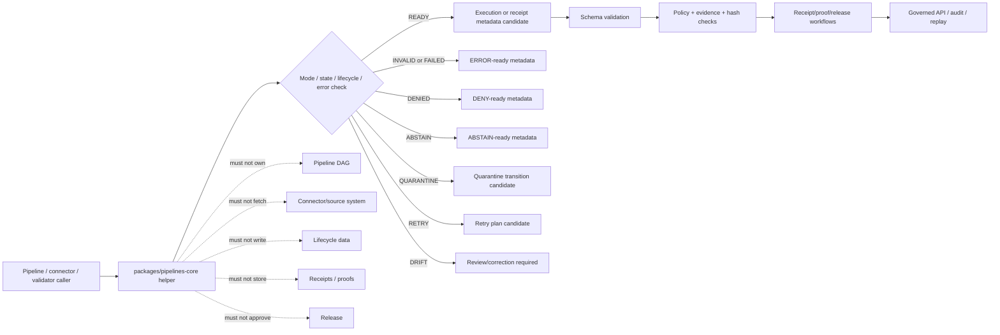

<!-- [KFM_META_BLOCK_V2]
doc_id: kfm://doc/NEEDS-VERIFICATION/packages-pipelines-core-readme
title: Pipelines Core Package README
type: readme
version: v1
status: draft
owners: OWNER_TBD
created: NEEDS VERIFICATION — target file existed before this revision as a short stub
updated: 2026-06-14
policy_label: public
related: [packages/README.md, packages/hashing/README.md, packages/identity/README.md, packages/envelopes/README.md, packages/evidence/README.md, docs/doctrine/directory-rules.md, docs/architecture/identity-and-spec-hash.md, docs/architecture/contract-schema-policy-split.md, contracts/, schemas/contracts/v1/, policy/, pipelines/, connectors/, data/receipts/, data/proofs/, release/]
tags: [kfm, packages, pipelines-core, pipeline, run-mode, run-receipt, error-semantics, lifecycle, receipts, replay]
notes: ["README-like package entrypoint for reusable pipeline execution primitives.", "This package may contain shared run-mode, run-state, receipt metadata, retry, error, finite-outcome, and replay helper code used by pipelines; it must not become a pipeline implementation home, connector home, lifecycle-data store, schema home, contract home, policy engine, receipt store, proof store, release authority, API route, UI surface, or AI truth source.", "Implementation files, package metadata, import namespace, tests, CI workflows, and runtime bindings remain NEEDS VERIFICATION until recursively inspected."]
[/KFM_META_BLOCK_V2] -->

<a id="top"></a>

# Pipelines Core Package

Shared helper-code package for KFM pipeline execution primitives: run modes, run-state transitions, receipt metadata, retry/error semantics, lifecycle boundary checks, replay support, and finite pipeline outcomes.

<p>
  
  
  
  
  
  
</p>

> [!IMPORTANT]
> **Status:** PROPOSED package README  
> **Path:** `packages/pipelines-core/README.md`  
> **Owning responsibility root:** `packages/` — shared reusable implementation libraries  
> **Package purpose:** pipeline run-mode, run-state, receipt metadata, retry/error, and replay helper code  
> **Pipeline implementation authority:** `pipelines/`, not this package  
> **Connector authority:** `connectors/`, not this package  
> **Lifecycle data authority:** `data/<phase>/`, not this package  
> **Receipt/proof authority:** `data/receipts/` and `data/proofs/`, not this package  
> **Release authority:** `release/`, not this package  
> **Repo implementation depth:** UNKNOWN for package metadata, import style, source files, tests, CI workflows, pipeline bindings, emitted receipts, proof packs, release manifests, branch protections, and runtime behavior.

## Scope

`packages/pipelines-core/` is the shared implementation package lane for deterministic pipeline control helpers used by KFM pipelines, connectors, validators, receipts, proof builders, replay tools, release gates, governed APIs, and tests.

This package may contain deterministic utilities for:

- run-mode declarations such as dry-run, plan, ingest, transform, validate, promote-candidate, replay, backfill, repair, and audit-only modes;
- run-state and step-state helpers for pending, running, succeeded, failed, skipped, quarantined, denied, abstained, retried, superseded, and rolled-back states;
- receipt metadata carriers for run id, spec hash, input refs, output refs, policy refs, evidence refs, validation refs, code version, config version, and replay refs;
- finite pipeline outcomes that can be mapped into RuntimeResponseEnvelope and receipt/proof workflows;
- typed error semantics for source failure, validation failure, policy denial, evidence unresolved, schema mismatch, hash mismatch, stale input, quarantine, timeout, retry exhaustion, and rollback mismatch;
- retry/backoff plans and idempotency keys from explicit inputs;
- lifecycle boundary checks that prevent RAW/WORK/QUARANTINE candidates from being exposed as public results;
- replay comparison helpers that coordinate with `packages/hashing/` and receipt/proof homes;
- synthetic fixtures for pipeline-state, run-mode, receipt-metadata, and error-path tests.

This package must not fetch sources, activate connectors, store data, run domain transformations as authority, decide policy, write receipts, write proofs, approve releases, publish artifacts, expose API routes, render UI, or generate truth claims.

```text
RAW -> WORK / QUARANTINE -> PROCESSED -> CATALOG / TRIPLET -> PUBLISHED
```

Pipelines-core helpers may support governed transitions across that lifecycle. They do not own lifecycle state, source authority, data stores, proof state, receipt state, review state, release state, or public truth.

[⬆ Back to top](#top)

---

## Repo fit

```text
packages/pipelines-core/
```

This path is appropriate for reusable pipeline helper code because `packages/` is the responsibility root for shared libraries used by apps, workers, pipelines, and tools.

| Relationship | Expected home | Boundary rule |
| --- | --- | --- |
| Shared pipeline control helpers | `packages/pipelines-core/` | Run modes, states, receipts metadata, retries, error semantics, replay helpers only. |
| Pipeline implementations | `pipelines/` | Owns executable domain/source workflows and lifecycle writes. |
| Source connectors | `connectors/` | Owns source activation, credentials, fetch behavior, and source-system boundaries. |
| Lifecycle data | `data/<phase>/` | Owns RAW/WORK/QUARANTINE/PROCESSED/CATALOG/TRIPLET/PUBLISHED state. |
| Hash helpers | `packages/hashing/` | Computes and compares digest/spec-hash values. |
| Identity helpers | `packages/identity/` | Handles id grammar and stable object identifiers. |
| Runtime envelopes | `packages/envelopes/` | Provides finite public/governed response envelopes. |
| Evidence helpers | `packages/evidence/`, `packages/evidence-resolver/` | Evidence refs and closure validation remain separate. |
| Semantic contracts | `contracts/` | Defines meaning; package code references, not redefines. |
| Machine schemas | `schemas/contracts/v1/` | Defines run receipt, pipeline state, source descriptor, manifest, and envelope shapes. |
| Policy rules | `policy/` | Owns allow/deny/restrict/hold/abstain decisions. |
| Receipts and proofs | `data/receipts/`, `data/proofs/` | Stores run receipts and proof artifacts. |
| Release decisions | `release/` | Owns promotion, publication, correction, supersession, rollback. |
| Public API and UI | `apps/`, `ui/`, `web/`, or repo-confirmed equivalents | May read governed status; must not use package internals as authority. |
| Tests and fixtures | `tests/packages/pipelines-core/`, `fixtures/packages/pipelines-core/`, or repo-confirmed equivalents | Proves deterministic behavior with synthetic no-network fixtures. |

> [!WARNING]
> Do not put pipeline implementations, connector fetchers, data writes, receipts, proofs, release manifests, or source credentials in this package. This package defines shared control helpers, not operating authority.

[⬆ Back to top](#top)

---

## Accepted inputs

Package helpers should accept explicit, inspectable values from governed callers. They should not fetch missing facts from source systems, raw stores, UI state, hidden globals, operator memory, or generated language.

| Input family | Accepted examples | Required handling |
| --- | --- | --- |
| Run context | run id, run mode, pipeline id, step id, code version, config version, operator/system actor, timestamp policy | Preserve explicit values and make replay possible. |
| Source context | SourceDescriptor ref, source role, rights posture, cadence, freshness, fetch receipt ref | Carry refs; do not fetch source data. |
| Input/output refs | RAW/WORK/QUARANTINE/PROCESSED/CATALOG/TRIPLET/PUBLISHED refs, artifact refs, candidate refs | Preserve lifecycle phase and block invalid public exposure. |
| Hash/identity context | spec hash, content hash, input hash, output hash, run id, object ids | Consume from hashing/identity helpers or explicit caller input. |
| Policy context | policy decision ref, sensitivity posture, rights posture, denied/restricted reason | Consume supplied policy posture; do not evaluate policy. |
| Evidence context | EvidenceRef, EvidenceBundle ref, citation-validation ref | Preserve refs; do not resolve or fabricate evidence. |
| Error context | exception class, stable reason code, step id, retry count, recovery hint | Return typed failure state and receipt-ready metadata. |
| Replay context | prior run receipt ref, expected outputs, expected hashes, drift policy | Compare explicit values; do not infer success from logs alone. |
| Fixture context | synthetic runs, invalid states, retry exhaustion, quarantine, denial, drift | Keep fixtures deterministic and public-safe. |

[⬆ Back to top](#top)

---

## Exclusions

| Do not put here | Correct home or owner | Reason |
| --- | --- | --- |
| Pipeline implementations and DAGs | `pipelines/` | Operational workflows belong under pipeline roots. |
| Connector fetchers and source credentials | `connectors/` plus secret-management infrastructure | Source activation and credentials are governed separately. |
| RAW, WORK, QUARANTINE, PROCESSED, CATALOG, TRIPLET, or PUBLISHED data | `data/<phase>/` | Lifecycle state must remain phase-visible. |
| Source descriptors and source registries | `data/registry/` or repo-confirmed registry homes | Source authority, rights, cadence, and limitations are governance data. |
| JSON Schemas | `schemas/contracts/v1/` | Schemas own machine shape. |
| Semantic contracts | `contracts/` | Contracts own meaning. |
| Policy rules | `policy/` | Policy owns decisions and obligations. |
| Receipts, proof packs, validation reports | `data/receipts/`, `data/proofs/` | Trust artifacts must remain separately auditable. |
| Release manifests, rollback cards, correction notices | `release/` | Publication is a governed state transition. |
| Public API routes or serializers | `apps/` or repo-confirmed API app | Public clients must use governed APIs. |
| UI components, dashboards, controls | `apps/`, `ui/`, `web/`, or observability roots | Presentation is downstream from governed status. |
| AI-generated claims or source interpretation | governed AI runtime plus evidence validation | AI output is interpretive and evidence-subordinate. |
| Secrets, source credentials, private source content, or sensitive fixtures | Nowhere in package fixtures | Fixtures must remain synthetic or public-safe. |

[⬆ Back to top](#top)

---

## Pipeline-core responsibilities

| Responsibility | Expected behavior |
| --- | --- |
| Run modes | Define finite run-mode values and mode compatibility checks. |
| Run states | Define finite run/step state values and legal transition helpers. |
| Receipt metadata | Prepare receipt-ready metadata without storing receipts. |
| Error semantics | Map exceptions/conditions into stable reason codes and retry posture. |
| Lifecycle guardrails | Preserve lifecycle phase and block invalid public exposure candidates. |
| Idempotency | Build deterministic idempotency keys from explicit inputs. |
| Replay support | Prepare recompute/compare metadata for replay workflows. |
| Negative states | Preserve denied, abstained, quarantined, invalid, stale, mismatch, rollback, timeout, and retry-exhausted outcomes. |
| Fixture support | Generate synthetic no-network fixtures for run-state and error-path tests. |

[⬆ Back to top](#top)

---

## Expected package layout

> [!NOTE]
> The tree below is PROPOSED. Confirm package metadata, language conventions, import namespace, test layout, and CI before committing code beyond README files.

```text
packages/pipelines-core/
├── README.md                       # This file: package boundary and trust rules
├── pyproject.toml / package.json    # NEEDS VERIFICATION
├── src/                             # NEEDS VERIFICATION
│   └── pipelines_core/              # PROPOSED namespace; confirm against repo convention
│       ├── README.md                # PROPOSED namespace guide
│       ├── __init__.py              # PROPOSED export boundary
│       ├── run_modes.py             # PROPOSED run-mode helpers
│       ├── run_state.py             # PROPOSED run/step-state helpers
│       ├── receipt_metadata.py      # PROPOSED receipt-ready metadata carriers
│       ├── errors.py                # PROPOSED typed error/reason-code helpers
│       ├── retries.py               # PROPOSED retry/backoff/idempotency helpers
│       ├── lifecycle.py             # PROPOSED lifecycle boundary checks
│       ├── replay.py                # PROPOSED replay metadata helpers
│       ├── validation.py            # PROPOSED transition validation helpers
│       ├── fixtures.py              # PROPOSED synthetic fixtures
│       └── py.typed                 # PROPOSED if typed package convention is confirmed
└── CHANGELOG.md                     # OPTIONAL / NEEDS VERIFICATION
```

Potential imports, subject to package verification:

```python
from pipelines_core.run_modes import RunMode
from pipelines_core.run_state import validate_step_transition
from pipelines_core.errors import pipeline_error_reason
```

[⬆ Back to top](#top)

---

## Pipeline helper outcomes

| Helper outcome | Use when | Runtime posture |
| --- | --- | --- |
| `READY` | Inputs, mode, and lifecycle state are locally consistent. | Candidate for execution, validation, or receipt generation. |
| `INVALID` | Mode, transition, input ref, output ref, or required metadata is malformed. | `ERROR` or invalid validation report depending on caller. |
| `DENIED` | Supplied policy posture blocks the action. | `DENY` with stable reason code. |
| `ABSTAIN` | Required evidence, policy, source, schema, or release support is missing. | `ABSTAIN` or hold/review state. |
| `QUARANTINE` | Input or output must be isolated for validation, rights, sensitivity, or integrity reasons. | Lifecycle transition to QUARANTINE through owning pipeline/data roots. |
| `RETRY` | Failure is retryable under explicit retry policy. | Retry plan candidate; no silent retry without receipt metadata. |
| `FAILED` | Failure is terminal under explicit policy. | Fail closed with receipt-ready error metadata. |
| `DRIFT` | Replay or recompute output differs from expected receipt/proof support. | Block promotion and require review/correction path. |

`READY` is not proof of truth, evidence closure, release, or public safety. It only means the local pipeline-control inputs are coherent enough for the next governed step.

[⬆ Back to top](#top)

---

## Trust-boundary flow



[⬆ Back to top](#top)

---

## Development rules

1. Treat this package as a deterministic helper layer, not an execution authority layer.
2. Prefer pure functions with explicit inputs and outputs.
3. Preserve run id, run mode, step id, source refs, input refs, output refs, evidence refs, policy refs, hash refs, release refs, rollback refs, and correction refs supplied by callers.
4. Do not make network calls from this package.
5. Do not read directly from RAW, WORK, QUARANTINE, unpublished candidates, source systems, source credentials, canonical stores, or model runtimes.
6. Do not write lifecycle data, receipts, proofs, release manifests, source registries, catalog records, API responses, or UI components.
7. Do not evaluate policy, decide evidence sufficiency, approve release, or publish artifacts.
8. Do not create schemas, contracts, policy rules, source registries, pipeline DAGs, API routes, public answers, or release decisions from this package.
9. Do not store raw provider payloads, secrets, private source records, protected-location examples, or unrestricted sensitive context.
10. Return typed invalid/negative states instead of silent retries, hidden quarantine, warning-only drift, or public exposure of unreleased outputs.
11. Add deterministic tests for every behavior-changing helper and every negative path.
12. Keep fixtures synthetic, sanitized, and stable.
13. Preserve rollback and correction metadata supplied by callers when pipeline output can affect downstream publication candidates.

[⬆ Back to top](#top)

---

## Validation checklist

- [ ] Confirm `packages/pipelines-core/` package metadata and language/runtime convention.
- [ ] Confirm import namespace and whether it is `pipelines_core`, `pipelinesCore`, or repo-specific.
- [ ] Confirm owners and CODEOWNERS path coverage.
- [ ] Confirm schema homes for run receipts, pipeline state, error reason codes, source descriptors, and runtime envelopes.
- [ ] Confirm relationship with `pipelines/`, `connectors/`, `packages/hashing/`, `packages/identity/`, `packages/envelopes/`, and receipt/proof homes.
- [ ] Confirm tests for run modes, legal/illegal state transitions, lifecycle phase guards, retry exhaustion, quarantine, denial, abstain, hash mismatch, replay drift, rollback mismatch, and no-public-RAW/WORK/QUARANTINE exposure.
- [ ] Confirm helpers do not access lifecycle stores, source systems, credentials, model runtimes, or unpublished candidate stores.
- [ ] Confirm helpers do not write receipts, proofs, release manifests, catalog records, API responses, credentials, or permissions.

Suggested inspection commands:

```bash
find packages/pipelines-core -maxdepth 5 -type f | sort
git grep -n "RunReceipt\|run_receipt\|run_mode\|pipeline_state\|QUARANTINE\|retry\|replay\|rollback\|spec_hash" -- packages docs contracts schemas policy tests fixtures pipelines connectors tools apps 2>/dev/null || true
git grep -n "from pipelines_core\|import pipelines_core\|packages/pipelines-core" -- . 2>/dev/null || true
```

[⬆ Back to top](#top)

---

## Rollback

Rollback is required if this package:

- becomes a parallel pipeline implementation, connector, schema, contract, policy, source-registry, lifecycle-data, evidence/proof, receipt, release, API, UI, credential, model-runtime, or source-data authority;
- fetches source data, reads lifecycle stores, writes outputs, writes receipts/proofs, or approves release as a package helper;
- lets public clients or normal UI surfaces access RAW, WORK, QUARANTINE, unpublished candidates, source systems, or direct model outputs;
- treats run success as proof of truth, evidence closure, admissibility, public safety, or release;
- hides quarantine, denial, abstain, retry exhaustion, or replay drift behind warning-only logs;
- stores secrets, source credentials, private source records, or protected-location examples in fixtures.

Rollback target: revert the package README or pipelines-core source PR, preserve audit notes, and file any authority drift in `docs/registers/DRIFT_REGISTER.md` or the repo-confirmed drift register.

[⬆ Back to top](#top)

---

## Evidence boundary

| Source | Status | Supports | Limits |
| --- | --- | --- | --- |
| Current target file | CONFIRMED | `packages/pipelines-core/README.md` existed as a short stub naming pipeline run modes, receipts, and error semantics. | Stub did not prove package implementation maturity. |
| `packages/README.md` | CONFIRMED repo doc | `packages/` is for shared libraries used by apps, workers, pipelines, and tools. | Does not define pipelines-core package behavior. |
| `docs/doctrine/directory-rules.md` | CONFIRMED repo doctrine | `packages/` is a shared-library root and lifecycle/trust roots remain separate. | Does not prove this package is implemented. |
| `docs/architecture/identity-and-spec-hash.md` | CONFIRMED repo doc | KFM trust records and run/receipt identity depend on deterministic hashes and recompute-and-compare gates. | Does not define this package implementation. |
| Current file-generation pass | CONFIRMED request | User-requested target path and README expansion. | Does not inspect package metadata, tests, CI logs, dashboards, deployment posture, runtime behavior, or branch protection. |

[⬆ Back to top](#top)
