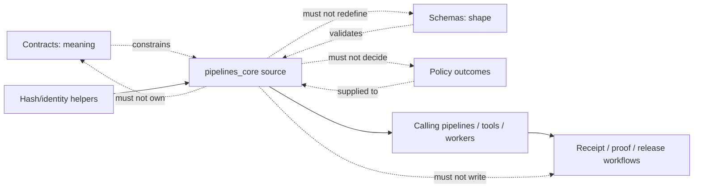
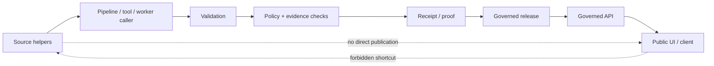

<!-- [KFM_META_BLOCK_V2]
doc_id: kfm://doc/packages-pipelines-core-src-readme
title: packages/pipelines-core/src/ — Python Source Envelope and Placeholder Boundary
type: readme
version: v1.1
status: draft
owners: OWNER_TBD — Package steward · Pipeline steward · Runtime steward · Contract steward · Schema steward · Policy steward · Evidence/receipt steward · Validation steward · Security steward · Release steward · CI steward · Docs steward
created: NEEDS VERIFICATION — target existed before this evidence-grounded revision
updated: 2026-07-15
policy_label: "public-doctrine; package-source-boundary; python-source-envelope; greenfield-placeholder; api-unratified; consumers-unverified; tests-unestablished; no-network-by-default; deterministic-helper-candidate; run-receipt-aware; lifecycle-subordinate; evidence-subordinate; policy-subordinate; release-subordinate; fail-closed; no-truth-authority; no-publication-authority; migration-required; rollback-aware"
current_path: packages/pipelines-core/src/README.md
truth_posture: >
  CONFIRMED target README v1, package metadata name kfm-pipelines-core and version 0.0.0,
  repository-present src directory and pipelines_core namespace, namespace README v1.1, empty
  pipelines_core/__init__.py, comment-only pipelines_core/core.py greenfield placeholder, root
  Python scaffold, packages responsibility-root doctrine, package README, runtime RunReceipt semantic
  contract, paired proposed schema, executable schema-validator wrapper, minimal valid/invalid schema
  fixtures, deny-by-default RunReceipt policy scaffold, common schema-fixture harness, and bounded
  absence of established functional source modules, public exports, repository consumers, package-local
  tests, package-specific CI, and verified runtime/pipeline wiring / PROPOSED a small Python source
  envelope containing only reusable deterministic pipeline-control helpers, explicit dependency direction,
  namespace admission rules, pure-function and side-effect boundaries, RunReceipt-candidate integration,
  package test matrix, staged implementation, correction, deprecation, and rollback / CONFLICTED prior
  source README examples that named modules, imports, helper outcomes, package-layout uncertainty, and
  broad consumers not established by implementation; adjacent package README that still labels package
  metadata and namespace implementation as unknown despite inspected placeholders; distribution name
  kfm-pipelines-core versus unconfigured import-package discovery; proposed ADR-0001 wording versus
  current Directory Rules treating the schema home as canonical doctrine; prior helper-outcome vocabulary
  versus schema-confirmed RunReceipt outcome SUCCESS|PARTIAL|FAIL / UNKNOWN accepted package API,
  build backend, package discovery, Python support policy for this subpackage, dependency set, type
  checking, semantic versioning, consumer set, runtime integration, receipt persistence, policy integration,
  CI enforcement, release use, deployment use, and operational health / NEEDS VERIFICATION owners,
  maintainer approval, package metadata completion, import-name decision, source-layout policy, API
  contract, contract/schema bindings, test home, negative-state vocabulary, consumer migration, CI path
  coverage, distribution policy, correction process, deprecation window, and rollback automation
evidence_snapshot:
  repository: bartytime4life/Kansas-Frontier-Matrix
  repository_id: "1059091169"
  visibility: public
  base_ref: main
  base_commit: c8ec164a228ee434a22d177fbe6a80673e1678a2
  prior_blob: 7b531f2d9f952679b1ac20a892d013a0098f04dc
  package_readme_blob: b3a290bc37960a5b4cc2b019596200d68df866a9
  namespace_readme_blob: f1b069c91289890f371a2bd640dba31d7432659e
  package_metadata_blob: 09bedd096422d22ae0cc187bfd2469dbe0bdab13
  namespace_init_blob: e69de29bb2d1d6434b8b29ae775ad8c2e48c5391
  namespace_core_blob: 610692013a4ef98bc48d14508ffdc7ad2b96205b
  root_pyproject_blob: e3bd40e8e6ce14dfcde78ff5c09608095c3eca76
  packages_root_blob: fc18fb3334fefe992a551fe12aa98c812232cd17
  directory_rules_blob: 2affb080e6f0043867c64c7f06c1ca52030fbd55
  drift_register_blob: 97a775522dcd058299f752ac7862d0fc56c13280
  schema_home_adr_blob: ab0010a278d766356845c23055f882f328abb418
  run_receipt_contract_blob: 5592aa5e22bbdd0c668189f79b50c18f7d1b2479
  run_receipt_schema_blob: 80d13bcb750d56c769da2f8871242388f7f50a69
  run_receipt_validator_blob: 9b59481e90c021f0f92b74511c43fcefbbe3a057
  run_receipt_policy_blob: 5fa096c9d65183b0b3333e05434bbf6f2ab9c0b7
  run_receipt_fixtures_readme_blob: 2937d4665e217017fb7b28ae3a6273b76d85f980
  common_schema_test_blob: b04342cc034d7f1cc554e155fdd02d6e972976e6
  docs_build_workflow_blob: 3841ed36c0af0a41621992aff1d932cfca9ac082
  link_check_workflow_blob: 9326c5dce2fd99c70293ac61886d289e2fc15a0c
  docs_control_plane_workflow_blob: e50351863cce87a00df03356832b8deada56b325
  bounded_path_checks:
    - packages/pipelines-core/src/README.md existed at version v1 before this revision
    - packages/pipelines-core/pyproject.toml exists with project name kfm-pipelines-core and version 0.0.0
    - package pyproject contains no build-system, Python requirement, dependencies, optional dependencies, scripts, entry points, or package-discovery configuration
    - packages/pipelines-core/src/pipelines_core/README.md exists at version v1.1
    - packages/pipelines-core/src/pipelines_core/__init__.py exists and is empty
    - packages/pipelines-core/src/pipelines_core/core.py exists and contains only a greenfield-placeholder comment
    - bounded repository search found no functional pipelines_core consumer import
    - packages/pipelines-core/tests/README.md was not found in the prior namespace inspection
    - tests/packages/pipelines-core/README.md was not found in the prior namespace inspection
    - tests/packages/pipelines_core/README.md was not found in the prior namespace inspection
    - bounded repository search found no package-specific workflow or pipelines-core implementation reference beyond documentation/scaffold files
    - contracts/runtime/run_receipt.md and schemas/contracts/v1/runtime/run_receipt.schema.json exist
    - tools/validators/validate_run_receipt.py exists as a thin schema-validator wrapper
    - fixtures/contracts/v1/runtime/run_receipt contains one documented valid fixture and one documented invalid missing-run-id fixture
    - policy/runtime/run_receipt.rego is a deny-by-default proposed scaffold
    - docs-build, link-check, and docs-control-plane workflows trigger on ordinary pull requests but currently run TODO echo stubs
related:
  - ../README.md
  - ../pyproject.toml
  - pipelines_core/README.md
  - pipelines_core/__init__.py
  - pipelines_core/core.py
  - ../../README.md
  - ../../../pyproject.toml
  - ../../../docs/doctrine/directory-rules.md
  - ../../../docs/adr/ADR-0001-schema-home--schemas-contracts-v1-is-canonical.md
  - ../../../docs/registers/DRIFT_REGISTER.md
  - ../../../pipelines/README.md
  - ../../../pipeline_specs/README.md
  - ../../../contracts/runtime/run_receipt.md
  - ../../../schemas/contracts/v1/runtime/run_receipt.schema.json
  - ../../../policy/runtime/run_receipt.rego
  - ../../../fixtures/contracts/v1/runtime/run_receipt/README.md
  - ../../../tools/validators/validate_run_receipt.py
  - ../../../tests/schemas/test_common_contracts.py
tags: [kfm, packages, pipelines-core, src, python, source-envelope, scaffold, pipeline-control, run-receipt, lifecycle, replay, idempotency, negative-state, evidence, policy, validation, migration, rollback]
notes:
  - "This revision changes only packages/pipelines-core/src/README.md."
  - "The source envelope currently contains this README and the pipelines_core namespace; the namespace has its own v1.1 README, an empty __init__.py, and a comment-only core.py placeholder."
  - "This README does not install the package, define an accepted API, create exports, approve dependencies, establish consumers, run pipelines, write receipts, accept an ADR, or prove CI/runtime behavior."
  - "Prior proposed module names and import examples are retained only as superseded documentation lineage; they are not current implementation facts or compatibility commitments."
[/KFM_META_BLOCK_V2] -->

<a id="top"></a>

# Pipelines Core Python Source Envelope and Placeholder Boundary

`packages/pipelines-core/src/`

> Repository-present Python source envelope for a future reusable pipeline-control package. Current evidence establishes the source README and one `pipelines_core` namespace containing its own README, an empty `__init__.py`, and a comment-only `core.py` placeholder—not a functional helper library, accepted package API, tested implementation, pipeline engine, receipt writer, policy evaluator, or release component.


**Quick links:** [Purpose](#purpose) · [Evidence](#status-and-evidence) · [Placement](#directory-rules-and-authority) · [Source contract](#source-envelope-contract) · [Inventory](#confirmed-source-inventory) · [Packaging](#packaging-import-and-api-status) · [Responsibilities](#proposed-responsibility-envelope) · [Dependencies](#dependency-direction) · [Trust membrane](#lifecycle-and-trust-membrane) · [RunReceipt](#runreceipt-integration-boundary) · [Effects](#side-effects-network-and-determinism) · [Security](#security-rights-sensitivity-and-privacy) · [Testing](#testing-fixtures-and-ci) · [Implementation](#smallest-sound-implementation-sequence) · [Done](#definition-of-done) · [Open](#verification-register) · [Rollback](#rollback-correction-and-deprecation)

> [!IMPORTANT]
> **This README is not implementation evidence for a pipeline-control library.** It establishes the source-directory boundary and records the current placeholder tree. It does not establish package installation, import success, exports, dependency approval, consumer adoption, runtime wiring, receipt persistence, policy integration, pipeline execution, test coverage, CI enforcement, release use, or operational health.

> [!CAUTION]
> **Source placement does not grant authority.** Code under `src/` may support governed work, but evidence, policy, validation, review, lifecycle state, receipts, proofs, publication decisions, correction, and rollback remain in their owning roots.

---

<a id="purpose"></a>

## Purpose

This README defines the responsibility and verification boundary for:

```text
packages/pipelines-core/src/
```

The source envelope is intended to hold importable Python implementation for the `kfm-pipelines-core` package after package metadata, public API, tests, consumers, and governance bindings are approved.

The current repository state is much narrower:

- `pipelines_core/README.md` defines the namespace boundary;
- `pipelines_core/__init__.py` is empty;
- `pipelines_core/core.py` contains only a greenfield-placeholder comment;
- no functional source module or public export is established;
- no consuming import was found by bounded repository search;
- no package-local test lane was found at the previously checked paths;
- the package manifest is a minimal `0.0.0` scaffold without build or package-discovery configuration.

This README therefore has two jobs:

1. record the **CONFIRMED source-envelope state** without inflating it into implementation; and
2. define a **PROPOSED source-placement contract** future code must satisfy before the package can be treated as reusable infrastructure.

This file does not define the package API. The namespace README, package metadata, contracts, schemas, policy, tests, and accepted implementation decisions must converge before API claims become authoritative.

[Back to top](#top)

---

<a id="status-and-evidence"></a>

## Status and evidence

### Evidence verdict

| Surface | Status | Safe conclusion |
|---|---:|---|
| Target README | **CONFIRMED v1 before revision** | A source-directory boundary document existed. |
| Package manifest | **CONFIRMED placeholder** | Distribution name is `kfm-pipelines-core`; version is `0.0.0`. |
| Package build metadata | **NOT ESTABLISHED** | No subpackage build backend, Python requirement, package discovery, dependencies, scripts, or entry points are declared. |
| Source directory | **CONFIRMED present** | `packages/pipelines-core/src/` exists. |
| Namespace directory | **CONFIRMED present** | `packages/pipelines-core/src/pipelines_core/` exists. |
| Namespace README | **CONFIRMED v1.1** | The namespace has an evidence-grounded placeholder-boundary document. |
| `__init__.py` | **CONFIRMED empty** | No public import surface is defined. |
| `core.py` | **CONFIRMED comment-only placeholder** | No runtime behavior is defined. |
| Functional modules | **NOT ESTABLISHED** | Prior names such as `run_modes.py`, `run_state.py`, and `replay.py` remain design lineage only. |
| Repository consumers | **NOT FOUND by bounded search** | No code import of `pipelines_core` was established. |
| Package-local tests | **NOT FOUND at prior checked paths** | No package test suite is established. |
| Package-specific CI | **NOT ESTABLISHED by bounded search** | No workflow was proven to install or test this package. |
| RunReceipt contract stack | **PARTIALLY CONFIRMED** | Contract, schema, thin validator wrapper, fixtures, test harness, and default-deny policy scaffold exist; package integration is not established. |
| Runtime behavior | **UNKNOWN** | No deployed service, worker, pipeline, log, dashboard, or execution trace proves use. |

### Truth-label application

- **CONFIRMED** describes files and contents inspected in the repository.
- **PROPOSED** describes future source organization or behavior that is not implemented.
- **CONFLICTED** identifies mismatched documentation, status, or authority language.
- **UNKNOWN** means the current evidence does not establish the claim.
- **NEEDS VERIFICATION** means a concrete check can resolve the gap.

### What changed in this revision

This v1.1 revision:

- replaces broad implementation language with the verified placeholder inventory;
- aligns the source README with the merged namespace README v1.1;
- distinguishes source-envelope placement from package metadata and namespace API;
- preserves strong helper-only and trust-boundary rules from v1;
- demotes prior proposed modules, imports, and helper outcomes to design lineage;
- documents package discovery, dependency, testing, CI, and consumer gaps;
- ties future work to the repository-present `RunReceipt` contract stack without claiming integration;
- adds implementation gates, verification items, drift notes, correction, deprecation, and rollback.

[Back to top](#top)

---

<a id="directory-rules-and-authority"></a>

## Directory Rules and authority

### Placement basis

`packages/` is the KFM responsibility root for shared reusable implementation libraries. `packages/pipelines-core/` is the package lane. `src/` is the source-code envelope. `pipelines_core/` is the repository-present Python namespace candidate.

```text
packages/
└── pipelines-core/
    ├── README.md
    ├── pyproject.toml
    └── src/
        ├── README.md
        └── pipelines_core/
            ├── README.md
            ├── __init__.py
            └── core.py
```

The tree above is a **bounded confirmed inventory**, not a statement that the package is installable or complete.

### Responsibility split

| Responsibility | Authority home | Source-envelope rule |
|---|---|---|
| Package identity, version, dependencies, build, distribution | `packages/pipelines-core/pyproject.toml` and accepted package tooling | `src/` must not invent package metadata. |
| Importable implementation | `packages/pipelines-core/src/pipelines_core/` | Code may live here after API and test gates are satisfied. |
| Executable workflows | `pipelines/` | `src/` must not become the pipeline DAG home. |
| Declarative workflow intent | `pipeline_specs/` | `src/` may consume validated specifications but must not redefine them. |
| Source acquisition | `connectors/` | `src/` must not fetch sources or own credentials. |
| Object meaning | `contracts/` | Source code implements or adapts meaning; it does not redefine it. |
| Machine-checkable shape | `schemas/contracts/v1/` | Source code may validate against schemas; it does not create a parallel schema home. |
| Admissibility | `policy/` | Source code consumes policy outcomes; it does not become the policy authority. |
| Lifecycle state | `data/<phase>/` | Source helpers do not own RAW, WORK, QUARANTINE, PROCESSED, CATALOG, TRIPLET, or PUBLISHED data. |
| Receipts and proofs | `data/receipts/`, `data/proofs/` | Helpers may assemble candidates; authoritative persistence remains elsewhere. |
| Release decisions and rollback | `release/` | Source code must not approve release or mutate publication state. |
| Public interfaces | `apps/` and governed API surfaces | Public clients must not import package internals as a trust shortcut. |
| Validators and repository CLIs | `tools/` | Reusable primitives may be imported only after the package API is accepted. |
| Tests and fixtures | `tests/`, `fixtures/`, or an accepted package-local test convention | Test placement remains NEEDS VERIFICATION; production source is not the fixture authority. |

### No parallel authority

This source envelope must not become a second home for:

- pipeline specifications;
- connector logic;
- SourceDescriptors or source registries;
- semantic contracts;
- JSON Schemas;
- policy rules;
- lifecycle records;
- RunReceipt records;
- proof packs;
- release manifests;
- promotion decisions;
- correction notices;
- rollback cards;
- public API serializers;
- UI components;
- AI-generated claims;
- credentials or key material.

[Back to top](#top)

---

<a id="source-envelope-contract"></a>

## Source-envelope contract

The source directory exists to make implementation placement visible and reviewable.

### It may eventually contain

Only after implementation gates pass, the envelope may contain:

- the accepted `pipelines_core` namespace;
- deterministic data classes or value objects for local pipeline-control inputs and results;
- pure validation helpers for run context and state transitions;
- reason-code mapping from explicit conditions;
- idempotency-key construction from canonical caller inputs;
- replay expectation and comparison helpers;
- RunReceipt candidate assembly from explicit refs and values;
- public-safe serialization helpers for package-local result types;
- type marker files such as `py.typed` if typing policy is accepted.

### It must not contain

- executable domain/source pipeline DAGs;
- source-system clients or credentials;
- filesystem crawlers over lifecycle stores;
- data movers that promote files by path alone;
- receipt/proof/release writers;
- policy engines or hard-coded public permissions;
- contract or schema source-of-truth definitions;
- app routes, UI components, or renderer code;
- arbitrary network clients;
- model-provider clients or generated truth;
- sensitive or production payload fixtures;
- package build artifacts committed as source;
- vendored dependencies without explicit approval.

### Source-layout rule

The current layout has one namespace candidate:

```text
src/
└── pipelines_core/
```

Do not add a peer namespace, duplicate implementation tree, generated mirror, or compatibility alias without:

1. an explicit package-layout decision;
2. migration and deprecation rules;
3. import-boundary tests;
4. consumer inventory;
5. rollback instructions.

[Back to top](#top)

---

<a id="confirmed-source-inventory"></a>

## Confirmed source inventory

### Repository-present files

| Path | Blob state | Meaning |
|---|---|---|
| `packages/pipelines-core/src/README.md` | Existing v1 before this revision | Parent source-envelope documentation. |
| `packages/pipelines-core/src/pipelines_core/README.md` | v1.1 | Namespace boundary and future implementation contract. |
| `packages/pipelines-core/src/pipelines_core/__init__.py` | Empty blob | Package marker only; no exports. |
| `packages/pipelines-core/src/pipelines_core/core.py` | Comment-only placeholder | No executable behavior. |

### Not established

The following are not current implementation facts:

```text
run_modes.py
run_state.py
receipt_metadata.py
errors.py
retries.py
lifecycle.py
replay.py
validation.py
fixtures.py
py.typed
```

They are possible decomposition ideas only. A future implementation may use different names or a smaller design.

### Superseded source-layout example

The v1 README showed a full proposed module tree and direct imports. That example is superseded as current-state documentation. It may be consulted as design lineage, but it does not reserve module names, symbols, or compatibility obligations.

[Back to top](#top)

---

<a id="packaging-import-and-api-status"></a>

## Packaging, import, and API status

### Distribution metadata

The package manifest currently confirms only:

```toml
[project]
name = "kfm-pipelines-core"
version = "0.0.0"
```

It does not currently establish:

- a build backend;
- Python version support;
- package discovery;
- source-layout mapping;
- dependencies or optional dependencies;
- scripts or entry points;
- typing metadata;
- wheel or sdist configuration;
- license metadata;
- README binding;
- classifiers;
- test configuration;
- lint or type-check configuration.

### Distribution name versus import name

The distribution name `kfm-pipelines-core` and directory name `pipelines_core` do not by themselves prove that:

```python
import pipelines_core
```

works in an installed environment.

Package discovery and build configuration must explicitly establish the relationship.

### Public API status

There is no accepted public API.

The empty `__init__.py` means the package currently exports nothing intentionally. `core.py` does not define a symbol.

Future source changes must not treat names from old README examples as compatibility commitments unless they are:

1. implemented;
2. reviewed;
3. tested;
4. documented;
5. versioned;
6. consumed through an approved import path.

### Import boundary

Until an API is accepted:

- no application, pipeline, tool, or connector should rely on undocumented internal paths;
- no wildcard exports should be added;
- no import-time side effects should be introduced;
- no alias modules should be added merely to preserve an unimplemented README example;
- no dependency cycle should be introduced between this package and its authority roots.

[Back to top](#top)

---

<a id="proposed-responsibility-envelope"></a>

## Proposed responsibility envelope

The smallest credible future package is a **deterministic pipeline-control helper library**, not a workflow engine.

### Candidate responsibilities

| Candidate concern | Local helper responsibility | Must remain outside |
|---|---|---|
| Run context | Validate explicit run identifiers, stage, mode, and refs. | Run scheduling and execution. |
| State transition | Check a supplied transition against an accepted transition table. | Lifecycle mutation and promotion authority. |
| Reason codes | Map explicit exceptions or conditions to stable internal reason codes. | Policy decisions and public disclosure rules. |
| RunReceipt candidate | Assemble a candidate object matching the contract/schema from explicit values. | Receipt persistence and truth claims. |
| Idempotency | Derive deterministic keys from canonical caller inputs. | Global job locking or orchestration. |
| Replay | Compare expected and observed canonical values or hashes. | Proof certification or release approval. |
| Retry metadata | Represent supplied retry policy and attempt state. | Sleeping, scheduling, or hidden automatic retries. |
| Serialization | Produce deterministic package-local structures. | Public API envelope authority. |

### Candidate non-responsibilities

The package must not:

- execute pipeline steps;
- open source-system connections;
- read environment credentials;
- scan data roots;
- move or publish artifacts;
- evaluate policy;
- resolve EvidenceBundles as truth;
- write RunReceipts;
- sign or attest outputs;
- approve promotion;
- update release aliases;
- return public answers;
- hide denied, abstained, quarantined, partial, or failed states.

### Reuse threshold

Code belongs here only when it is:

- reusable by more than one caller or justified as a stable shared boundary;
- deterministic from explicit inputs;
- independent of one domain/source workflow;
- small enough to test exhaustively;
- subordinate to contracts, schemas, policy, evidence, and release state;
- safe to call without network or lifecycle-store access.

One-off workflow logic belongs in `pipelines/`, `tools/`, or the owning app—not in this package.

[Back to top](#top)

---

<a id="dependency-direction"></a>

## Dependency direction

### Allowed conceptual direction



### Import rules

Future source may import:

- Python standard-library modules;
- explicitly approved package dependencies;
- stable KFM shared packages when dependency direction is documented and cycle-free;
- generated or handwritten types only from accepted authority-preserving locations.

Future source must not import:

- deployable app routes;
- domain pipeline implementations;
- connector clients;
- release writers;
- receipt/proof persistence;
- UI packages;
- model-provider runtimes;
- private configuration or secret loaders;
- internal stores as a hidden service locator.

### Cycle prevention

A mature package should have an import graph test that fails when:

- `pipelines_core` imports `pipelines/`;
- `pipelines_core` imports a connector implementation;
- `pipelines_core` imports an app;
- `pipelines_core` imports release mutation code;
- a foundational package and `pipelines_core` import each other;
- a runtime-only dependency leaks into import-time module initialization.

[Back to top](#top)

---

<a id="lifecycle-and-trust-membrane"></a>

## Lifecycle and trust membrane

KFM lifecycle law remains:

```text
RAW -> WORK / QUARANTINE -> PROCESSED -> CATALOG / TRIPLET -> PUBLISHED
```

Promotion is a governed state transition, not a file move.

### Source-envelope role

Source helpers may:

- carry explicit lifecycle phase labels;
- reject malformed phase transitions locally;
- preserve refs and hashes supplied by callers;
- produce candidate metadata for downstream validation;
- detect missing support and return a local negative result;
- compare replay expectations.

Source helpers may not:

- read lifecycle roots to infer authority;
- move data between lifecycle directories;
- publish outputs;
- set public aliases;
- bypass quarantine;
- convert local success into release approval;
- expose internal refs directly to normal public clients.

### Public-path rule

Normal UI and public clients must not call this package as a substitute for the governed API.



### Local result is not authority

A local helper result can mean only that local inputs were evaluated according to the helper’s accepted rules. It cannot prove:

- the source is authoritative;
- evidence is sufficient;
- policy allows use;
- validation passed elsewhere;
- review occurred;
- promotion is approved;
- release happened;
- public serving is safe;
- the claim is true.

[Back to top](#top)

---

<a id="runreceipt-integration-boundary"></a>

## RunReceipt integration boundary

The repository contains a draft/proposed `RunReceipt` trust stack:

- semantic contract at `contracts/runtime/run_receipt.md`;
- machine schema at `schemas/contracts/v1/runtime/run_receipt.schema.json`;
- validator wrapper at `tools/validators/validate_run_receipt.py`;
- valid and invalid fixtures under `fixtures/contracts/v1/runtime/run_receipt/`;
- common schema-fixture test harness;
- default-deny policy scaffold at `policy/runtime/run_receipt.rego`.

This package is not currently integrated with that stack.

### Schema-confirmed fields

The current runtime RunReceipt schema requires:

| Field | Shape |
|---|---|
| `run_id` | patterned string |
| `stage` | string |
| `inputs` | array of strings |
| `outputs` | array of strings |
| `code_ref` | string |
| `spec_hash` | `sha256:<64 lowercase hex>` |
| `source_descriptor_refs` | array of strings |
| `validation_refs` | array of strings |
| `outcome` | `SUCCESS`, `PARTIAL`, or `FAIL` |

Additional properties are disallowed.

### Candidate-builder rule

A future helper may assemble a **candidate mapping** from explicit caller values. It must not:

- generate fake refs to satisfy required fields;
- infer source descriptors from filenames;
- treat an empty validation-ref set as validation success;
- compute `SUCCESS` from the absence of an exception alone;
- write the candidate to `data/receipts/`;
- claim the candidate is an authoritative receipt;
- use the receipt as evidence of claim truth;
- turn `SUCCESS` into promotion or public serving.

### Outcome non-collapse

The schema-confirmed persisted receipt outcome is:

```text
SUCCESS | PARTIAL | FAIL
```

Package-local evaluation may need a richer internal result vocabulary, such as malformed input, missing support, retryable condition, or drift. That vocabulary must not silently replace the persisted contract enum.

A future mapping must be explicit and tested:

| Local condition | Possible RunReceipt outcome | Additional governed action |
|---|---|---|
| Local evaluation completed | `SUCCESS` candidate | Downstream validation, policy, evidence, and review still required. |
| Some outputs withheld or degraded | `PARTIAL` candidate | Record exact refs/reasons; fail closed for public use unless allowed. |
| Evaluation could not safely complete | `FAIL` candidate | No promotion; preserve diagnostic and validation refs. |
| Policy denial | Not owned by helper alone | Preserve supplied PolicyDecision; do not reinterpret it. |
| Evidence unresolved | Usually blocks authoritative receipt/promotion use | Return missing-support state to caller. |
| Replay mismatch | May produce `PARTIAL` or `FAIL` candidate by accepted policy | Block promotion and require review. |
| Retryable transport/runtime condition | Not a RunReceipt enum by itself | Caller controls retry scheduling and final receipt semantics. |

[Back to top](#top)

---

<a id="inputs-and-outputs"></a>

## Inputs and outputs

### Accepted future input classes

All helper inputs should be explicit and serializable.

| Input class | Examples | Required posture |
|---|---|---|
| Run identity | run id, pipeline id, step id, attempt | Stable and non-secret. |
| Execution identity | code ref, config ref, spec hash | Reproducible and canonicalized by accepted rules. |
| Lifecycle refs | input refs, output refs, phases | Phase-visible; no hidden public-path conversion. |
| Source refs | SourceDescriptor refs, source-role refs | References only; source resolution remains outside. |
| Evidence refs | EvidenceRef or EvidenceBundle refs | Preserve; do not fabricate or resolve as truth locally. |
| Policy refs | PolicyDecision refs and supplied finite outcome | Consume; do not evaluate policy. |
| Validation refs | ValidationReport refs | Preserve; do not infer pass from filename or presence alone. |
| Retry/replay context | attempt, prior receipt ref, expected hashes | Explicit; no hidden global state. |
| Time context | event, valid, observed, processed, run, release time where applicable | Named time kinds; no ambiguous `timestamp`. |

### Prohibited input sources

Helpers must not obtain required inputs from:

- network calls;
- environment secrets;
- implicit current working directory;
- direct lifecycle-store scans;
- UI state;
- model output;
- operator memory;
- hidden singletons;
- mutable module globals;
- unreviewed configuration fallback;
- free-form logs.

### Output rules

Outputs should:

- use immutable or effectively immutable structures where practical;
- contain stable reason codes;
- preserve supplied refs;
- expose missing support explicitly;
- avoid embedding source payloads;
- avoid secrets and sensitive geometry;
- serialize deterministically;
- distinguish local evaluation from persisted receipt and public runtime outcomes.

[Back to top](#top)

---

<a id="side-effects-network-and-determinism"></a>

## Side effects, network, and determinism

### Default posture

`packages/pipelines-core/src/` is **no-network by default**.

Future helpers should be pure functions wherever possible. They must not:

- perform HTTP requests;
- open database connections;
- read object stores;
- read lifecycle directories;
- write files as an implicit side effect;
- mutate process environment;
- schedule tasks;
- sleep for retries;
- initialize telemetry exporters at import time;
- load credentials;
- call model runtimes;
- publish messages.

### Explicit effect boundary

If a future requirement genuinely needs effects, the design must:

1. explain why the code is reusable package logic rather than pipeline/app/tool logic;
2. define an injected port or protocol;
3. keep the effect implementation outside the pure core;
4. add policy/security review;
5. add deterministic fakes;
6. add timeout, cancellation, retry, and error semantics;
7. document data classification and telemetry behavior;
8. obtain an ADR when the change bends the helper-only boundary.

### Deterministic serialization

Candidate values used for hashing, idempotency, replay, or receipts require an accepted canonicalization profile.

Do not:

- hash raw Python `repr`;
- depend on dictionary insertion accidents;
- include wall-clock time unless supplied explicitly;
- include random UUIDs unless generated by an accepted identity rule;
- include machine-local absolute paths;
- include unordered set iteration;
- normalize away meaningful source, time, policy, or lifecycle distinctions.

### Idempotency and replay

A future idempotency helper should derive a key from an explicit, versioned tuple such as:

```text
pipeline_spec_ref
+ stage
+ canonical input refs
+ code_ref
+ spec_hash
+ relevant config refs
+ accepted time bucket or run identity
```

The exact tuple is **PROPOSED** and must be fixed by contract/tests before use.

Replay comparison must return a visible mismatch state. It must not overwrite expected values or accept drift because a prior run was labeled successful.

[Back to top](#top)

---

<a id="error-retry-and-resume"></a>

## Error, retry, and resume semantics

### Stable errors

Future helpers should return typed local results or raise documented package exceptions. They must not rely on parsing free-form log text.

Possible reason-code families include:

- malformed run context;
- illegal state transition;
- missing required ref;
- invalid lifecycle phase;
- hash mismatch;
- replay drift;
- stale support;
- retry exhausted;
- rollback mismatch;
- unsupported version;
- dependency unavailable;
- serialization failure.

These names are **PROPOSED**, not an accepted enum.

### Retry ownership

The package may calculate or validate retry metadata from explicit policy. It must not:

- sleep;
- schedule itself;
- loop indefinitely;
- hide attempts;
- reset failure counts;
- retry policy denials;
- retry integrity failures without an accepted repair path;
- convert exhaustion into success.

### Resume ownership

Resume helpers may validate supplied checkpoints or prior receipt refs. They must not infer resume safety from file presence alone.

A safe resume requires, as applicable:

- matching code/config/spec identity;
- matching input refs and hashes;
- valid prior receipt/validation refs;
- accepted checkpoint version;
- explicit policy for partial outputs;
- no unresolved correction, withdrawal, or rollback state.

[Back to top](#top)

---

<a id="security-rights-sensitivity-and-privacy"></a>

## Security, rights, sensitivity, and privacy

### Data minimization

Package-local values and tests must not contain:

- credentials or tokens;
- private source payloads;
- living-person records;
- DNA/genomic data;
- exact archaeology locations;
- rare-species coordinates;
- critical-infrastructure details;
- unrestricted land-ownership or private-contact data;
- raw prompts or private model context;
- full source documents where refs suffice.

### Secret handling

The source package must not:

- read secrets at import time;
- define default credentials;
- log environment variables;
- serialize tokens into errors;
- include secrets in idempotency keys or hashes;
- commit test credentials;
- accept plaintext key material for convenience.

### Rights and sensitivity

Source helpers consume supplied rights/sensitivity posture. They do not decide that data are public.

A source ref or output ref with unknown rights or sensitivity must remain unresolved or held by the caller’s governed flow. The package must not generalize, redact, or suppress data invisibly and call the result public-safe.

### Logging and telemetry

Future logging must be:

- opt-in through caller configuration;
- structured and bounded;
- free of raw payloads and sensitive exact locations;
- explicit about reason codes and refs;
- unable to turn internal paths or records into public logs;
- tested for redaction where trust-bearing metadata is emitted.

[Back to top](#top)

---

<a id="consumer-and-compatibility-boundary"></a>

## Consumer and compatibility boundary

### Consumers are not established

No repository code consumer importing `pipelines_core` was established by bounded search.

Before the first consumer is admitted:

1. identify the concrete caller;
2. document why shared package reuse is preferable to caller-local code;
3. define the import path;
4. define supported result types;
5. add package tests;
6. add consumer contract tests;
7. add CI path coverage;
8. document rollback to caller-local behavior or prior package version.

### Internal API versus public compatibility

An accepted internal API still needs versioning discipline. Do not use `0.0.0` as evidence that breaking changes are harmless after consumers exist.

Compatibility claims require:

- consumer inventory;
- semantic version policy;
- deprecation notices;
- migration examples;
- support window;
- changelog;
- rollback target;
- tests for old/new behavior where compatibility is promised.

### No direct public consumption

Apps and public clients must not import `pipelines_core` to decide:

- whether data are public;
- whether evidence is sufficient;
- whether a claim is true;
- whether a release is current;
- whether sensitive geometry may be shown;
- whether a denied or abstained result can be converted into an answer.

[Back to top](#top)

---

<a id="testing-fixtures-and-ci"></a>

## Testing, fixtures, and CI

### Current status

No package-local test suite or package-specific CI was established by the prior bounded checks.

Repository-level schema fixtures for `RunReceipt` exist, but they do not test this package.

### Minimum package test matrix

Before functional source is considered implemented, tests should cover:

| Area | Required proof |
|---|---|
| Import | Accepted package install/import path works in a clean environment. |
| Public exports | Only reviewed symbols are exported. |
| Run context | Valid and invalid identifiers, stages, refs, and versions. |
| Transition checks | Every allowed and denied transition. |
| Serialization | Stable output ordering and canonicalization behavior. |
| RunReceipt candidate | Valid schema-shaped candidate and each missing/invalid field. |
| Outcome mapping | Explicit mapping to `SUCCESS`, `PARTIAL`, `FAIL`; no hidden policy/public outcomes. |
| Hashing/idempotency | Determinism, versioning, collisions-in-scope, canonical input order. |
| Replay | Match, mismatch, missing expected support, incompatible version. |
| Retry | Allowed, denied, exhausted, non-retryable, counter preservation. |
| Resume | Valid checkpoint, stale checkpoint, spec mismatch, input mismatch. |
| Security | No secret leakage, raw payload logging, sensitive fixture content. |
| Effects | Network/filesystem/database access absent from pure core. |
| Import graph | No forbidden app/pipeline/connector/release cycles. |
| Consumer | Each admitted consumer has integration/contract tests. |

### Fixture posture

Package tests should use synthetic, small, public-safe fixtures.

The existing runtime RunReceipt fixtures prove only schema behavior. They may be referenced as contract examples, but package tests need their own explicit builder/mapping cases.

### CI gate

A package-specific CI path should eventually:

1. install the package from its declared build configuration;
2. run unit tests;
3. run typing/linting if adopted;
4. run import-boundary checks;
5. validate generated RunReceipt candidates against the canonical schema;
6. run secret/sensitive-fixture checks;
7. run consumer contract tests;
8. report failures without publishing artifacts or mutating lifecycle/release state.

Current documentation workflows are not package proof. Inspected docs workflows contain TODO echo steps.

[Back to top](#top)

---

<a id="smallest-sound-implementation-sequence"></a>

## Smallest sound implementation sequence

### Gate 0 — ownership and decision record

- assign package and pipeline stewards;
- confirm whether this package should exist as a distinct distribution;
- decide build backend, package discovery, Python versions, and test home;
- decide whether ADR-0001 status wording needs reconciliation;
- record API and dependency principles.

**Exit:** ownership and package-layout decision are reviewable.

### Gate 1 — installable empty package

- complete `pyproject.toml`;
- configure `src/` package discovery;
- bind README/license/Python metadata;
- add clean-environment install/import test;
- keep `__init__.py` intentionally empty.

**Exit:** installation and import are proven without functional API claims.

### Gate 2 — one pure value/result module

Implement one smallest reusable concern, preferably explicit run-context validation or a versioned package-local result type.

Requirements:

- no network or lifecycle access;
- explicit inputs;
- deterministic serialization;
- tests for every branch;
- no public-policy or release decision.

**Exit:** one real reusable behavior is proven.

### Gate 3 — RunReceipt candidate integration

- define mapping contract;
- assemble candidate from explicit values;
- validate against canonical schema;
- cover `SUCCESS`, `PARTIAL`, `FAIL`;
- reject missing refs and invalid spec hashes;
- keep persistence outside.

**Exit:** candidate construction is schema-valid and authority-preserving.

### Gate 4 — first consumer

- identify one pipeline/tool/worker;
- document dependency direction;
- add consumer contract tests;
- preserve prior behavior and rollback path;
- record telemetry and error handling.

**Exit:** reuse is demonstrated without expanding authority.

### Gate 5 — CI and version policy

- add package-specific CI;
- add import graph enforcement;
- add semantic version and changelog policy;
- add deprecation procedure;
- add release/distribution posture if internal package publishing is used.

**Exit:** changes are governed and reversible.

### Gate 6 — broader helper set

Only after evidence supports it, consider idempotency, replay, retry metadata, transition tables, or additional value types.

Do not pre-create a large module tree merely because it appeared in a planning README.

[Back to top](#top)

---

<a id="definition-of-done"></a>

## Definition of done

The source envelope is implementation-ready only when all applicable items are true.

### Placement and ownership

- [ ] Package and pipeline owners are assigned.
- [ ] `packages/` remains the correct responsibility root.
- [ ] `src/` contains importable source only.
- [ ] Executable workflow logic remains in `pipelines/`.
- [ ] No parallel schema, contract, policy, receipt, proof, registry, or release home exists.

### Packaging

- [ ] Subpackage build backend is declared.
- [ ] Python support policy is declared.
- [ ] `src/` package discovery is configured.
- [ ] Clean install and import are tested.
- [ ] Distribution/import naming relationship is documented.
- [ ] Dependencies and license posture are reviewable.

### API and implementation

- [ ] Public exports are explicit and minimal.
- [ ] Every exported behavior has tests.
- [ ] No import-time side effects exist.
- [ ] No undocumented internal import is used by consumers.
- [ ] Local outcomes are distinguished from RunReceipt, policy, and public outcomes.
- [ ] RunReceipt candidates validate against the canonical schema.
- [ ] No receipt persistence occurs in the package.

### Trust and security

- [ ] No network, lifecycle-store, credential, model, or release mutation exists in the pure core.
- [ ] Sensitive data are absent from fixtures/logs.
- [ ] Evidence and policy refs are preserved, not fabricated.
- [ ] Local success cannot bypass review or release.
- [ ] Replay drift and partial/failure states remain visible.
- [ ] Rollback and correction context are preserved.

### Tests and operations

- [ ] Package unit tests exist.
- [ ] Import-boundary tests exist.
- [ ] Consumer contract tests exist.
- [ ] Package-specific CI watches this path.
- [ ] CI results are not mistaken for publication.
- [ ] Versioning, deprecation, migration, and rollback are documented.

[Back to top](#top)

---

<a id="verification-register"></a>

## Verification register

| ID | Item | Status | Resolution evidence |
|---|---|---:|---|
| PCSRC-001 | Assign package owner. | NEEDS VERIFICATION | CODEOWNERS or approved metadata. |
| PCSRC-002 | Assign pipeline/runtime reviewer. | NEEDS VERIFICATION | Reviewer policy. |
| PCSRC-003 | Decide whether `kfm-pipelines-core` remains a distinct distribution. | NEEDS VERIFICATION | Package ADR or accepted metadata. |
| PCSRC-004 | Select subpackage build backend. | UNKNOWN | Completed `pyproject.toml`. |
| PCSRC-005 | Configure `src/` package discovery. | UNKNOWN | Clean wheel/sdist inspection. |
| PCSRC-006 | Declare Python support range. | UNKNOWN | Package metadata and CI matrix. |
| PCSRC-007 | Decide dependency policy. | UNKNOWN | Approved dependency manifest. |
| PCSRC-008 | Decide test home. | CONFLICTED / NEEDS VERIFICATION | Directory Rules-compatible convention. |
| PCSRC-009 | Establish clean install/import. | UNKNOWN | CI log from clean environment. |
| PCSRC-010 | Ratify import namespace `pipelines_core`. | PROPOSED | Package discovery and import test. |
| PCSRC-011 | Ratify public API. | UNKNOWN | API contract and explicit exports. |
| PCSRC-012 | Confirm no additional source modules exist beyond bounded inventory. | NEEDS VERIFICATION | Recursive tree at current commit. |
| PCSRC-013 | Inventory consumers. | UNKNOWN | Search plus runtime/deployment evidence. |
| PCSRC-014 | Add package-local unit tests. | UNKNOWN | Test files and passing run. |
| PCSRC-015 | Add import-boundary tests. | UNKNOWN | CI enforcement. |
| PCSRC-016 | Add package-specific workflow/path filters. | UNKNOWN | Workflow and successful run. |
| PCSRC-017 | Define local result vocabulary. | PROPOSED | Contract/tests. |
| PCSRC-018 | Map local results to RunReceipt outcomes. | PROPOSED | Mapping tests and review. |
| PCSRC-019 | Prove RunReceipt candidate schema validation. | UNKNOWN | Package tests against canonical schema. |
| PCSRC-020 | Prove receipt persistence stays outside package. | UNKNOWN | Import graph and integration tests. |
| PCSRC-021 | Define canonical serialization profile. | UNKNOWN | ADR/contract and golden tests. |
| PCSRC-022 | Define spec-hash source and validation. | UNKNOWN | Identity/hash contract. |
| PCSRC-023 | Define idempotency-key versioning. | PROPOSED | Contract and tests. |
| PCSRC-024 | Define replay mismatch behavior. | PROPOSED | Test matrix and caller contract. |
| PCSRC-025 | Define retry and exhaustion semantics. | PROPOSED | Contract and tests. |
| PCSRC-026 | Define resume/checkpoint compatibility. | UNKNOWN | Checkpoint contract. |
| PCSRC-027 | Define time-kind vocabulary. | NEEDS VERIFICATION | Temporal contract. |
| PCSRC-028 | Prove no-network pure core. | UNKNOWN | Static/runtime tests. |
| PCSRC-029 | Prove no lifecycle-store access. | UNKNOWN | Import/effect tests. |
| PCSRC-030 | Define logging and redaction policy. | UNKNOWN | Security review and tests. |
| PCSRC-031 | Define consumer migration/rollback. | UNKNOWN | First-consumer plan. |
| PCSRC-032 | Define semantic version policy. | UNKNOWN | Package release policy. |
| PCSRC-033 | Reconcile ADR-0001 proposed status with Directory Rules wording. | CONFLICTED | Accepted governance correction. |
| PCSRC-034 | Update parent package README after implementation changes. | NEEDS VERIFICATION | Follow-up docs PR. |
| PCSRC-035 | Confirm branch protections and required package checks. | UNKNOWN | Repository settings evidence. |
| PCSRC-036 | Verify deployment/runtime use. | UNKNOWN | Runtime manifests/logs. |
| PCSRC-037 | Verify operational health. | UNKNOWN | Metrics/dashboard evidence. |

[Back to top](#top)

---

<a id="drift-and-conflicts"></a>

## Drift and conflicts

| Conflict | Current evidence | Required treatment |
|---|---|---|
| Source README v1 implied proposed modules and broad consumers. | Only placeholder namespace files are confirmed. | Keep examples as lineage; do not claim API. |
| Source README said package/import layout was unverified. | Python namespace and minimal manifest are now inspected, but package discovery remains absent. | Confirm presence; keep install/import UNKNOWN. |
| Parent package README says metadata/source depth is unknown. | Minimal manifest and placeholder source are now confirmed. | Follow-up update when requested; do not silently rewrite outside scope. |
| Distribution name versus import namespace. | `kfm-pipelines-core` and `pipelines_core` both exist, but no discovery config proves mapping. | Resolve in package metadata and clean install test. |
| Helper outcomes versus RunReceipt enum. | v1 named READY/INVALID/DENIED/etc.; schema confirms SUCCESS/PARTIAL/FAIL for persisted receipt. | Define separate layers and explicit mapping. |
| ADR-0001 status. | ADR file says proposed; Directory Rules call the schema-home rule canonical doctrine. | Record as governance conflict; do not resolve by source README. |
| Test home. | Prior docs mention multiple possible paths; none was established in bounded checks. | Choose one per Directory Rules and CI. |
| Package CI. | Ordinary repository workflows run, but no package-specific install/test proof is established. | Add path-aware package workflow before implementation maturity claims. |

No new root, namespace peer, schema home, contract home, policy home, receipt home, proof home, or release home is created by this documentation revision.

[Back to top](#top)

---

<a id="maintenance-checklist"></a>

## Maintenance checklist

Before adding or changing source code under this directory:

- [ ] Re-read this README and the namespace README.
- [ ] Confirm the target behavior belongs in a shared package.
- [ ] Confirm no accepted contract/schema/policy already defines a conflicting meaning.
- [ ] State inputs, outputs, side effects, and authority limits.
- [ ] Add tests before or with behavior.
- [ ] Keep network and lifecycle access outside the pure core.
- [ ] Preserve explicit refs and negative states.
- [ ] Validate RunReceipt candidates when applicable.
- [ ] Avoid broad exports.
- [ ] Avoid import-time work.
- [ ] Update consumer inventory.
- [ ] Update version/changelog when compatibility changes.
- [ ] Record migration and rollback.
- [ ] Update the package and namespace READMEs when responsibilities change.
- [ ] File unresolved authority drift in the repository registers.

[Back to top](#top)

---

<a id="evidence-ledger"></a>

## Evidence ledger

| Evidence | Status | Supports | Does not prove |
|---|---|---|---|
| Previous target blob `7b531f…` | CONFIRMED | Existing v1 source README and preserved boundary material. | Functional source implementation. |
| Package README blob `b3a290…` | CONFIRMED | Package-level helper-only scope and lifecycle separation. | Current API, tests, consumers, or runtime use. |
| Namespace README blob `f1b069…` | CONFIRMED | Detailed v1.1 namespace evidence and proposed implementation gates. | Source behavior or package installability. |
| Package manifest blob `09bedd…` | CONFIRMED | Name `kfm-pipelines-core`, version `0.0.0`. | Build backend, package discovery, dependencies, or install. |
| Empty `__init__.py` blob `e69de2…` | CONFIRMED | Namespace marker with no exports. | Import success after installation. |
| Placeholder `core.py` blob `610692…` | CONFIRMED | No implementation beyond comment. | Any helper behavior. |
| Root `pyproject.toml` blob `e3bd40…` | CONFIRMED | Root KFM project uses Hatchling and Python >=3.11. | That the subpackage inherits root build configuration. |
| Packages root README `fc18fb…` | CONFIRMED | `packages/` shared-library authority. | Child package maturity. |
| Directory Rules `2affb0…` | CONFIRMED doctrine | Placement and authority separation. | Runtime implementation. |
| Drift Register `97a775…` | CONFIRMED | Existing governance drift process. | Resolution of package-specific gaps. |
| ADR-0001 `ab0010…` | CONFIRMED file / proposed status | Schema-home decision text and conflict signal. | Accepted status. |
| RunReceipt contract `5592aa…` | CONFIRMED | Semantic receipt meaning and boundary. | Package integration. |
| RunReceipt schema `80d13b…` | CONFIRMED / proposed schema | Required fields and enum. | Runtime persistence or policy approval. |
| Validator `9b5948…` | CONFIRMED | Executable thin schema-validation wrapper exists. | Package candidate-builder behavior. |
| Policy scaffold `5fa096…` | CONFIRMED / proposed scaffold | Default deny. | Mature policy integration. |
| Fixture README `2937d4…` | CONFIRMED | Minimal valid/invalid schema examples. | Package tests or pipeline run. |
| Common schema test `b04342…` | CONFIRMED | Repository schema-fixture harness. | Package installation or unit tests. |
| Bounded code search | CONFIRMED search result | No functional consumer import was established. | Absolute absence in unindexed/generated/runtime code. |
| Current revision | CONFIRMED request | One-file documentation update. | Any implementation change. |

[Back to top](#top)

---

<a id="rollback-correction-and-deprecation"></a>

## Rollback, correction, and deprecation

### Documentation rollback

Rollback this README if it:

- claims functional source modules that do not exist;
- treats package installation or imports as proven without tests;
- turns proposed APIs into compatibility commitments;
- collapses local helper outcomes into policy, receipt, release, or public truth;
- creates a parallel authority home;
- weakens no-network, no-secret, or lifecycle boundaries;
- hides unresolved conflicts or unknowns.

Use a transparent Git revert. Do not reset or rewrite shared history.

### Software rollback expectations

Future implementation changes require:

- prior package version or commit reference;
- affected consumer inventory;
- reversible import migration;
- fixture and test preservation;
- receipt/replay compatibility assessment;
- explicit handling of outputs produced by the reverted behavior;
- correction or withdrawal path when downstream published artifacts were affected.

### Correction

When this README is wrong:

1. identify the exact unsupported or stale statement;
2. cite current repository evidence;
3. narrow or relabel the claim;
4. update related package/namespace docs if in scope;
5. record material governance drift;
6. preserve superseded history through Git.

### Deprecation

Do not deprecate module names or exports that were never implemented. Planning examples create no compatibility promise.

Once an API is real, deprecation must include:

- replacement symbol/path;
- migration example;
- warning period;
- consumer inventory;
- removal version;
- rollback path.

[Back to top](#top)

---

## Final status

**CONFIRMED:** `packages/pipelines-core/src/` is a repository-present Python source envelope containing this README and the `pipelines_core` placeholder namespace.
**PROPOSED:** it may become a small deterministic pipeline-control helper source tree after package, API, test, consumer, and governance gates pass.
**UNKNOWN:** installability, accepted API, consumers, runtime integration, receipt persistence, CI enforcement, deployment use, and operational health.
**NON-NEGOTIABLE:** source code remains subordinate to evidence, policy, validation, lifecycle, receipts/proofs, review, release, correction, and rollback.

[Back to top](#top)
