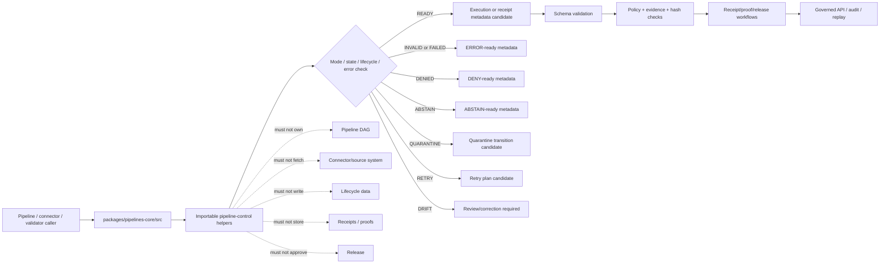

<!-- [KFM_META_BLOCK_V2]
doc_id: kfm://doc/NEEDS-VERIFICATION/packages-pipelines-core-src-readme
title: Pipelines Core Package Source README
type: readme
version: v1
status: draft
owners: OWNER_TBD
created: NEEDS VERIFICATION — target file existed before this repair but contained only placeholder text
updated: 2026-06-14
policy_label: public
related: [packages/pipelines-core/README.md, packages/hashing/README.md, packages/identity/README.md, packages/envelopes/README.md, packages/evidence/README.md, packages/README.md, docs/doctrine/directory-rules.md, docs/architecture/identity-and-spec-hash.md, docs/architecture/contract-schema-policy-split.md, contracts/, schemas/contracts/v1/, policy/, pipelines/, connectors/, data/receipts/, data/proofs/, release/]
tags: [kfm, packages, pipelines-core, src, pipeline, run-mode, run-state, run-receipt, error-semantics, lifecycle, replay]
notes: ["Source-directory guide for reusable pipeline execution primitives.", "This directory may contain source code for run-mode, run-state, receipt-metadata, retry, error, finite-outcome, lifecycle guardrail, idempotency, and replay helpers only.", "It must not own pipeline DAGs, connectors, lifecycle data, schemas, contracts, policy, receipts, proofs, release decisions, API routes, UI surfaces, credentials, source authority, or AI truth claims."]
[/KFM_META_BLOCK_V2] -->

<a id="top"></a>

# Pipelines Core Package Source

Source-code envelope for KFM pipeline execution primitives: run modes, run-state transitions, receipt metadata, retry and error semantics, lifecycle boundary checks, replay support, and finite pipeline outcomes.

<p>
  
  
  
  
  
  
</p>

> [!IMPORTANT]
> **Status:** PROPOSED source-directory README  
> **Path:** `packages/pipelines-core/src/README.md`  
> **Owning responsibility root:** `packages/`  
> **Package lane:** `packages/pipelines-core/`  
> **Import/package layout:** NEEDS VERIFICATION  
> **Pipeline implementation authority:** `pipelines/`, not this source tree  
> **Connector authority:** `connectors/`, not this source tree  
> **Lifecycle data authority:** `data/<phase>/`, not this source tree  
> **Receipt/proof authority:** `data/receipts/` and `data/proofs/`, not this source tree  
> **Release authority:** `release/`, not this source tree  
> **Repo implementation depth:** UNKNOWN for package metadata, import style, tests, CI workflows, pipeline bindings, emitted receipts, proof packs, release manifests, branch protections, and runtime behavior.

## Scope

`packages/pipelines-core/src/` is the proposed source-code root for the Pipelines Core package.

This directory is for importable deterministic helper code used by KFM pipelines, connectors, validators, receipts, proof builders, replay tools, release gates, governed API assemblers, and tests when they need consistent pipeline-control semantics.

This source tree may support helpers for:

- run-mode declarations such as dry-run, plan, ingest, transform, validate, promote-candidate, replay, backfill, repair, and audit-only modes;
- run-state and step-state helpers for pending, running, succeeded, failed, skipped, quarantined, denied, abstained, retried, superseded, and rolled-back states;
- legal transition checks between run and step states;
- receipt-ready metadata carriers for run id, spec hash, source refs, input refs, output refs, policy refs, evidence refs, validation refs, code version, config version, and replay refs;
- finite pipeline outcomes that can be mapped into runtime envelopes and receipt/proof workflows;
- typed error semantics for source failure, validation failure, policy denial, evidence unresolved, schema mismatch, hash mismatch, stale input, quarantine, timeout, retry exhaustion, and rollback mismatch;
- retry/backoff plans and idempotency keys from explicit inputs;
- lifecycle boundary checks that prevent RAW, WORK, QUARANTINE, or unpublished candidates from being exposed as public results;
- replay comparison metadata that coordinates with `packages/hashing/` and receipt/proof homes;
- synthetic fixtures for pipeline-state, run-mode, receipt-metadata, and error-path tests.

This source tree must not fetch sources, activate connectors, store data, run domain transformations as authority, decide policy, write receipts, write proofs, approve releases, publish artifacts, expose API routes, render UI, or generate truth claims.

```text
RAW -> WORK / QUARANTINE -> PROCESSED -> CATALOG / TRIPLET -> PUBLISHED
```

Pipelines-core source code may support governed transitions across that lifecycle. It does not own lifecycle state, source authority, data stores, proof state, receipt state, review state, release state, or public truth.

[⬆ Back to top](#top)

---

## Repo fit

```text
packages/pipelines-core/src/
```

`packages/` is the responsibility root for shared reusable code. `pipelines-core/` is the package segment. `src/` is the source-code envelope.

| Relationship | Expected home | Boundary rule |
| --- | --- | --- |
| Pipelines-core source code | `packages/pipelines-core/src/` | Run modes, run states, receipt metadata, retries, error semantics, replay, and lifecycle guardrails only. |
| Importable module | `packages/pipelines-core/src/pipelines_core/` or repo-confirmed namespace | Package namespace, subject to repo package convention verification. |
| Package entry README | `packages/pipelines-core/README.md` | Explains the package as a whole. |
| Pipeline implementations | `pipelines/` | Owns executable domain/source workflows and lifecycle writes. |
| Source connectors | `connectors/` | Owns source activation, credentials, fetch behavior, and source-system boundaries. |
| Lifecycle data | `data/<phase>/` | Owns RAW/WORK/QUARANTINE/PROCESSED/CATALOG/TRIPLET/PUBLISHED state. |
| Hash helpers | `packages/hashing/` | Computes and compares digest/spec-hash values. |
| Identity helpers | `packages/identity/` | Handles id grammar and stable object identifiers. |
| Runtime envelopes | `packages/envelopes/` | Provides finite public/governed response envelopes. |
| Evidence helpers | `packages/evidence/`, `packages/evidence-resolver/` | Evidence refs and closure validation remain separate. |
| Semantic contracts | `contracts/` | Defines meaning; source code references, not redefines. |
| Machine schemas | `schemas/contracts/v1/` | Defines run receipt, pipeline state, source descriptor, manifest, and envelope shapes. |
| Policy rules | `policy/` | Owns allow/deny/restrict/hold/abstain decisions. |
| Receipts and proofs | `data/receipts/`, `data/proofs/` | Stores run receipts and proof artifacts. |
| Release decisions | `release/` | Owns promotion, publication, correction, supersession, rollback. |
| Public API and UI | `apps/`, `ui/`, `web/`, or repo-confirmed equivalents | May read governed status; must not use source internals as authority. |
| Tests and fixtures | `tests/packages/pipelines-core/`, `fixtures/packages/pipelines-core/`, or repo-confirmed equivalents | Proves deterministic behavior with synthetic no-network fixtures. |

> [!WARNING]
> A source-code directory is not a pipeline implementation home, connector home, lifecycle data store, receipt store, proof store, release home, public API, or UI surface.

[⬆ Back to top](#top)

---

## Accepted inputs

Functions in this source tree should accept explicit values from governed callers. They should not fetch missing facts from source systems, raw stores, hidden globals, UI state, operator memory, or generated language.

| Input family | Accepted examples | Required handling |
| --- | --- | --- |
| Run context | run id, run mode, pipeline id, step id, code version, config version, actor, timestamp policy | Preserve explicit values and make replay possible. |
| Source context | SourceDescriptor ref, source role, rights posture, cadence, freshness, fetch receipt ref | Carry refs; do not fetch source data. |
| Input/output refs | RAW/WORK/QUARANTINE/PROCESSED/CATALOG/TRIPLET/PUBLISHED refs, artifact refs, candidate refs | Preserve lifecycle phase and block invalid public exposure. |
| Hash/identity context | spec hash, content hash, input hash, output hash, run id, object ids | Consume from hashing/identity helpers or explicit caller input. |
| Policy context | policy decision ref, sensitivity posture, rights posture, denied/restricted reason | Consume supplied policy posture; do not evaluate policy. |
| Evidence context | EvidenceRef, EvidenceBundle ref, citation-validation ref | Preserve refs; do not resolve or fabricate evidence. |
| Error context | exception class, stable reason code, step id, retry count, recovery hint | Return typed failure state and receipt-ready metadata. |
| Replay context | prior run receipt ref, expected outputs, expected hashes, drift policy | Compare explicit values; do not infer success from logs alone. |
| Fixture context | synthetic runs, invalid states, retry exhaustion, quarantine, denial, drift | Keep fixtures deterministic and public-safe. |

[⬆ Back to top](#top)

---

## Exclusions

| Do not put here | Correct home or owner | Reason |
| --- | --- | --- |
| Pipeline implementations and DAGs | `pipelines/` | Operational workflows belong under pipeline roots. |
| Connector fetchers and source credentials | `connectors/` plus secret-management infrastructure | Source activation and credentials are governed separately. |
| RAW, WORK, QUARANTINE, PROCESSED, CATALOG, TRIPLET, or PUBLISHED data | `data/<phase>/` | Lifecycle state must remain phase-visible. |
| Source descriptors and source registries | `data/registry/` or repo-confirmed registry homes | Source authority, rights, cadence, and limitations are governance data. |
| JSON Schemas | `schemas/contracts/v1/` | Schemas own machine shape. |
| Semantic contracts | `contracts/` | Contracts own meaning. |
| Policy rules | `policy/` | Policy owns decisions and obligations. |
| Receipts, proof packs, validation reports | `data/receipts/`, `data/proofs/` | Trust artifacts must remain separately auditable. |
| Release manifests, rollback cards, correction notices | `release/` | Publication is a governed state transition. |
| Public API routes or serializers | `apps/` or repo-confirmed API app | Public clients must use governed APIs. |
| UI components, dashboards, controls | `apps/`, `ui/`, `web/`, or observability roots | Presentation is downstream from governed status. |
| AI-generated claims or source interpretation | governed AI runtime plus evidence validation | AI output is interpretive and evidence-subordinate. |
| Secrets, source credentials, private source content, or sensitive-location fixtures | Nowhere in package fixtures | Fixtures must remain synthetic or public-safe. |

[⬆ Back to top](#top)

---

## Expected source layout

> [!NOTE]
> The tree below is PROPOSED. Confirm package metadata, language conventions, import namespace, test layout, and CI before committing code beyond README files.

```text
packages/pipelines-core/src/
├── README.md                # This file: source-code boundary and trust rules
└── pipelines_core/
    ├── README.md            # PROPOSED: importable namespace guide
    ├── __init__.py          # PROPOSED export boundary
    ├── run_modes.py         # PROPOSED run-mode helpers
    ├── run_state.py         # PROPOSED run/step-state helpers
    ├── receipt_metadata.py  # PROPOSED receipt-ready metadata carriers
    ├── errors.py            # PROPOSED typed error/reason-code helpers
    ├── retries.py           # PROPOSED retry/backoff/idempotency helpers
    ├── lifecycle.py         # PROPOSED lifecycle boundary checks
    ├── replay.py            # PROPOSED replay metadata helpers
    ├── validation.py        # PROPOSED transition validation helpers
    ├── fixtures.py          # PROPOSED synthetic fixtures
    └── py.typed             # PROPOSED if typed package convention is confirmed
```

Preferred import posture, subject to package verification:

```python
from pipelines_core.run_modes import RunMode
from pipelines_core.run_state import validate_step_transition
from pipelines_core.errors import pipeline_error_reason
```

[⬆ Back to top](#top)

---

## Pipeline helper outcomes

| Helper outcome | Use when | Runtime posture |
| --- | --- | --- |
| `READY` | Inputs, mode, and lifecycle state are locally consistent. | Candidate for execution, validation, or receipt generation. |
| `INVALID` | Mode, transition, input ref, output ref, or required metadata is malformed. | `ERROR` or invalid validation report depending on caller. |
| `DENIED` | Supplied policy posture blocks the action. | `DENY` with stable reason code. |
| `ABSTAIN` | Required evidence, policy, source, schema, or release support is missing. | `ABSTAIN` or hold/review state. |
| `QUARANTINE` | Input or output must be isolated for validation, rights, sensitivity, or integrity reasons. | Lifecycle transition to QUARANTINE through owning pipeline/data roots. |
| `RETRY` | Failure is retryable under explicit retry policy. | Retry plan candidate; no silent retry without receipt metadata. |
| `FAILED` | Failure is terminal under explicit policy. | Fail closed with receipt-ready error metadata. |
| `DRIFT` | Replay or recompute output differs from expected receipt/proof support. | Block promotion and require review/correction path. |

`READY` is not proof of truth, evidence closure, release, or public safety. It only means the local pipeline-control inputs are coherent enough for the next governed step.

[⬆ Back to top](#top)

---

## Trust-boundary flow



[⬆ Back to top](#top)

---

## Source anti-collapse rules

| Boundary | Preserve as | Never collapse into |
| --- | --- | --- |
| Run mode | Explicit finite mode | Implicit behavior from CLI flag text alone |
| Run state | Typed state and legal transition | Free-form log message |
| Receipt metadata | Receipt-ready carrier | Receipt storage or proof authority |
| Pipeline outcome | Finite local helper outcome | Truth, release, or public-safety decision |
| Lifecycle ref | Phase-visible input/output ref | Public URL or hidden path rewrite |
| Retry plan | Explicit policy-backed plan | Silent retry loop without receipt metadata |
| Error reason | Stable reason code and context | Warning-only prose |
| Replay result | Explicit comparison state | Assumed success from prior run label |
| Fixture run | Synthetic public-safe example | Production source or lifecycle record |

[⬆ Back to top](#top)

---

## Development rules

1. Prefer pure functions with explicit input objects.
2. Preserve run id, run mode, step id, source refs, input refs, output refs, evidence refs, policy refs, hash refs, release refs, rollback refs, and correction refs supplied by callers.
3. Do not make network calls from `src/` helpers.
4. Do not read directly from RAW, WORK, QUARANTINE, unpublished candidates, source systems, source credentials, canonical stores, or model runtimes.
5. Do not write lifecycle data, receipts, proofs, release manifests, source registries, catalog records, API responses, or UI components.
6. Do not evaluate policy, decide evidence sufficiency, approve release, or publish artifacts.
7. Do not create schemas, contracts, policy rules, source registries, pipeline DAGs, API routes, public answers, release decisions, or connector behavior from this source tree.
8. Do not store raw provider payloads, secrets, private source records, sensitive-location examples, or unrestricted sensitive context.
9. Return typed invalid/negative states instead of silent retries, hidden quarantine, warning-only drift, or public exposure of unreleased outputs.
10. Add deterministic tests for every behavior-changing helper and every negative path.
11. Keep fixtures synthetic, sanitized, and stable.
12. Preserve rollback and correction metadata supplied by callers when pipeline output can affect downstream publication candidates.

[⬆ Back to top](#top)

---

## Validation checklist

- [ ] Confirm `packages/pipelines-core/src/` exists in the mounted repo with this README as its source-directory guide.
- [ ] Confirm package manager and import convention (`pyproject.toml`, package.json, workspace config, or equivalent).
- [ ] Confirm whether this source tree is Python-only, TypeScript-only, or mixed-language.
- [ ] Confirm import namespace and whether it is `pipelines_core`, `pipelinesCore`, or repo-specific.
- [ ] Confirm owners and CODEOWNERS path coverage.
- [ ] Confirm schema homes for run receipts, pipeline state, error reason codes, source descriptors, and runtime envelopes.
- [ ] Confirm relationship with `pipelines/`, `connectors/`, `packages/hashing/`, `packages/identity/`, `packages/envelopes/`, and receipt/proof homes.
- [ ] Confirm validators and tests that exercise this source tree.
- [ ] Confirm tests for run modes, legal/illegal state transitions, lifecycle phase guards, retry exhaustion, quarantine, denial, abstain, hash mismatch, replay drift, rollback mismatch, and no-public-RAW/WORK/QUARANTINE exposure.
- [ ] Confirm helpers do not access lifecycle stores, source systems, credentials, model runtimes, or unpublished candidate stores.
- [ ] Confirm helpers do not write receipts, proofs, release manifests, catalog records, API responses, credentials, or permissions.

Suggested inspection commands:

```bash
find packages/pipelines-core/src -maxdepth 5 -type f | sort
git grep -n "RunReceipt\|run_receipt\|run_mode\|pipeline_state\|QUARANTINE\|retry\|replay\|rollback\|spec_hash" -- packages docs contracts schemas policy tests fixtures pipelines connectors tools apps 2>/dev/null || true
git grep -n "from pipelines_core\|import pipelines_core\|packages/pipelines-core/src" -- . 2>/dev/null || true
```

[⬆ Back to top](#top)

---

## Rollback

Rollback is required if this source tree:

- creates a parallel authority home for pipeline DAGs, connectors, schemas, contracts, policy, registries, lifecycle data, receipts, proofs, releases, API routes, UI surfaces, credentials, model runtimes, or source data;
- fetches source data, reads lifecycle stores, writes outputs, writes receipts/proofs, or approves release as a source helper;
- lets public clients or normal UI surfaces access RAW, WORK, QUARANTINE, unpublished candidates, source systems, or direct model outputs;
- treats run success as proof of truth, evidence closure, admissibility, public safety, or release;
- hides quarantine, denial, abstain, retry exhaustion, or replay drift behind warning-only logs;
- stores secrets, source credentials, private source records, or sensitive-location examples in fixtures.

Rollback target: revert the pipelines-core source PR, keep any generated audit notes as review evidence, and file the affected behavior in `docs/registers/DRIFT_REGISTER.md` or `docs/registers/VERIFICATION_BACKLOG.md` if the mounted repo uses those registers.

[⬆ Back to top](#top)

---

## Evidence boundary

| Source | Status | Supports | Limits |
| --- | --- | --- | --- |
| Current target file | CONFIRMED | `packages/pipelines-core/src/README.md` existed and required replacement from placeholder content. | Did not prove source implementation maturity. |
| Parent package README | CONFIRMED repo doc | `packages/pipelines-core/` is a shared helper-code package for pipeline run modes, run states, receipts metadata, retry/error semantics, lifecycle guardrails, and replay helpers. | Does not prove source files, package metadata, tests, or CI. |
| `packages/README.md` | CONFIRMED repo doc | `packages/` is for shared libraries used by apps, workers, pipelines, and tools. | Does not define this source namespace. |
| `docs/doctrine/directory-rules.md` | CONFIRMED repo doctrine | `packages/` is a shared-library root and lifecycle/trust roots remain separate. | Does not prove this source tree is implemented. |
| `docs/architecture/identity-and-spec-hash.md` | CONFIRMED repo doc | KFM trust records and run/receipt identity depend on deterministic hashes and recompute-and-compare gates. | Does not define this source implementation. |
| Current file-generation pass | CONFIRMED request | User-requested target path and README repair/replacement. | Does not inspect package metadata, tests, CI logs, dashboards, deployment posture, runtime behavior, or branch protection. |

[⬆ Back to top](#top)
