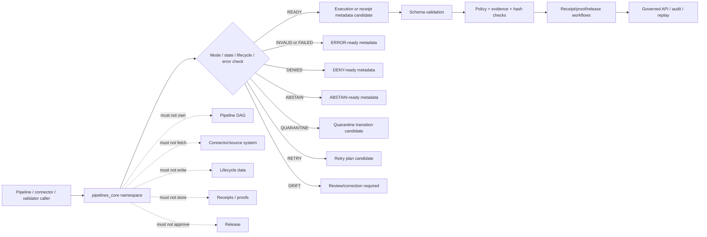

<!-- [KFM_META_BLOCK_V2]
doc_id: kfm://doc/NEEDS-VERIFICATION/packages-pipelines-core-src-pipelines-core-readme
title: Pipelines Core Import Namespace README
type: readme
version: v1
status: draft
owners: OWNER_TBD
created: NEEDS VERIFICATION — target file existed before this repair but contained only placeholder text
updated: 2026-06-14
policy_label: public
related: [packages/pipelines-core/README.md, packages/pipelines-core/src/README.md, packages/hashing/README.md, packages/identity/README.md, packages/envelopes/README.md, packages/evidence/README.md, packages/README.md, docs/doctrine/directory-rules.md, docs/architecture/identity-and-spec-hash.md, docs/architecture/contract-schema-policy-split.md, contracts/, schemas/contracts/v1/, policy/, pipelines/, connectors/, data/receipts/, data/proofs/, release/]
tags: [kfm, packages, pipelines-core, import-namespace, pipeline, run-mode, run-state, run-receipt, error-semantics, lifecycle, replay]
notes: ["Namespace guide for importable pipeline-control helper code.", "This namespace may expose run-mode, run-state, receipt-metadata, error, retry, idempotency, lifecycle, replay, validation, and synthetic fixture helpers only.", "It must not own pipeline DAGs, connectors, lifecycle data, schemas, contracts, policy, receipts, proofs, release decisions, API routes, UI surfaces, credentials, source authority, model runtimes, or AI truth claims."]
[/KFM_META_BLOCK_V2] -->

<a id="top"></a>

# `pipelines_core` Import Namespace

Importable helper namespace for KFM pipeline execution primitives: run modes, run-state transitions, receipt-ready metadata, retry and error semantics, lifecycle guardrails, replay comparison support, idempotency helpers, and finite pipeline outcomes.

<p>
  
  
  
  
  
</p>

> [!IMPORTANT]
> **Status:** PROPOSED import-namespace README  
> **Path:** `packages/pipelines-core/src/pipelines_core/README.md`  
> **Owning responsibility root:** `packages/`  
> **Package lane:** `packages/pipelines-core/`  
> **Source envelope:** `packages/pipelines-core/src/`  
> **Import namespace:** `pipelines_core` — NEEDS VERIFICATION against package metadata  
> **Pipeline implementation authority:** `pipelines/`, not this namespace  
> **Connector authority:** `connectors/`, not this namespace  
> **Lifecycle data authority:** `data/<phase>/`, not this namespace  
> **Receipt/proof authority:** `data/receipts/` and `data/proofs/`, not this namespace  
> **Release authority:** `release/`, not this namespace  
> **Repo implementation depth:** UNKNOWN for module files, exports, tests, package manager, CI workflows, pipeline bindings, receipts, proof packs, release manifests, branch protections, and runtime behavior.

## Scope

`packages/pipelines-core/src/pipelines_core/` is the proposed importable namespace for reusable pipeline-control helper code.

It may contain pure, deterministic helpers for:

- finite run-mode declarations, such as dry-run, plan, ingest, transform, validate, promote-candidate, replay, backfill, repair, and audit-only modes;
- finite run-state and step-state values, including pending, running, succeeded, failed, skipped, quarantined, denied, abstained, retried, superseded, and rolled-back;
- legal transition checks between run states and step states;
- receipt-ready metadata carriers for run id, spec hash, source refs, input refs, output refs, policy refs, evidence refs, validation refs, code version, config version, and replay refs;
- typed error semantics and stable reason-code helpers for validation failure, policy denial, evidence unresolved, schema mismatch, hash mismatch, stale input, quarantine, timeout, retry exhaustion, and rollback mismatch;
- retry, backoff, idempotency, and resume helpers from explicit inputs;
- lifecycle boundary checks that prevent RAW, WORK, QUARANTINE, or unpublished candidates from being exposed as public results;
- replay metadata helpers that coordinate with `packages/hashing/` and receipt/proof homes;
- synthetic no-network fixtures for run-mode, run-state, receipt-metadata, retry, quarantine, denial, drift, and error-path tests.

This namespace must not fetch sources, activate connectors, store data, run domain transformations as authority, decide policy, write receipts, write proofs, approve releases, publish artifacts, expose API routes, render UI, or generate truth claims.

## Namespace contract

The namespace is a helper boundary, not an operating authority boundary.

| Namespace concern | Expected behavior | Authority home |
| --- | --- | --- |
| Run modes | Define finite values and mode compatibility checks. | This namespace, schemas/contracts for persisted shape |
| Run states | Define finite values and legal transition helpers. | This namespace, pipeline implementations for actual execution |
| Receipt metadata | Build receipt-ready carriers from explicit inputs. | `data/receipts/` stores receipts; schemas/contracts define shape |
| Error semantics | Map explicit conditions into stable reason codes and retry posture. | Policy/contracts may define public meaning and disclosure |
| Retry/idempotency | Build deterministic retry plans and idempotency keys. | Calling pipeline owns execution and side effects |
| Lifecycle guardrails | Identify invalid phase exposure and quarantine candidates. | `data/<phase>/`, policy, and pipelines own state transitions |
| Replay support | Prepare recompute/compare metadata and drift states. | Receipt/proof/release workflows own replay authority |
| Fixtures | Produce synthetic stable examples for tests only. | `tests/` and `fixtures/`, not production runs |

## Expected modules

> [!NOTE]
> The tree below is PROPOSED. Confirm actual language, module names, package manager, and tests before treating these as implementation facts.

```text
packages/pipelines-core/src/pipelines_core/
├── README.md              # This file: namespace guide
├── __init__.py            # PROPOSED export boundary
├── run_modes.py           # PROPOSED run-mode helpers
├── run_state.py           # PROPOSED run/step-state helpers
├── receipt_metadata.py    # PROPOSED receipt-ready metadata carriers
├── errors.py              # PROPOSED typed error/reason-code helpers
├── retries.py             # PROPOSED retry/backoff/idempotency helpers
├── lifecycle.py           # PROPOSED lifecycle boundary checks
├── replay.py              # PROPOSED replay metadata helpers
├── validation.py          # PROPOSED transition validation helpers
├── fixtures.py            # PROPOSED synthetic fixtures
└── py.typed               # PROPOSED if typed package convention is confirmed
```

Keep implementation smaller than this until schemas, tests, and callers prove the need.

## Allowed exports

| Export family | Examples | Rule |
| --- | --- | --- |
| Run-mode helpers | `RunMode`, `parse_run_mode`, `is_mode_allowed` | Use finite values and explicit compatibility rules. |
| Run-state helpers | `RunState`, `StepState`, `validate_step_transition` | Return typed state outcomes; do not execute steps. |
| Receipt metadata helpers | `RunReceiptMetadata`, `build_receipt_metadata` | Prepare metadata only; do not write receipts. |
| Error helpers | `PipelineErrorReason`, `pipeline_error_reason` | Return stable reason codes and public-safe details. |
| Retry helpers | `RetryPlan`, `build_retry_plan`, `idempotency_key_for_run` | Require explicit retry policy and run inputs. |
| Lifecycle helpers | `check_lifecycle_boundary`, `public_exposure_guard` | Detect invalid phase exposure; do not move data. |
| Replay helpers | `ReplayExpectation`, `compare_replay_result` | Return drift/match states; do not certify release. |
| Validation helpers | `validate_run_context`, `validate_pipeline_state` | Local helper validation only. |
| Fixture helpers | `valid_run_fixture`, `quarantine_fixture`, `drift_fixture` | Synthetic and public-safe only. |

## Disallowed exports

Do not export functions or constants that turn this helper namespace into an authority surface.

| Disallowed export | Why |
| --- | --- |
| `run_pipeline`, `execute_dag`, `fetch_source`, `poll_connector` | Pipeline and connector execution belongs under `pipelines/` and `connectors/`. |
| `read_raw`, `write_processed`, `move_to_published`, `publish_artifact` | Lifecycle data and publication are governed outside this namespace. |
| `write_receipt`, `write_proof`, `store_evidence_bundle` | Receipts/proofs/evidence storage are separate trust homes. |
| `approve_release`, `promote`, `rollback_release` | Release authority belongs under `release/` and governed workflows. |
| `evaluate_policy`, `allow_public`, `deny_public` | Policy decisions belong to policy systems. |
| `create_schema`, `create_contract`, `register_source` | Schemas, contracts, and source registries have dedicated roots. |
| `call_model`, `generate_claim`, `summarize_truth` | AI output is interpretive and belongs behind governed AI placement. |
| `trust_run_success`, `bypass_validation`, `ignore_drift` | Run success is not proof of truth, release, or public safety. |

## Import posture

Preferred imports, subject to package metadata verification:

```python
from pipelines_core.run_modes import RunMode
from pipelines_core.run_state import validate_step_transition
from pipelines_core.errors import pipeline_error_reason
from pipelines_core.lifecycle import public_exposure_guard
```

Callers should treat pipeline-control output as a candidate for schema validation, policy gates, evidence checks, receipt/proof persistence, release review, and replay comparison. A successful run state is not public truth by itself.

## Pipeline helper outcomes

| Helper outcome | Use when | Runtime posture |
| --- | --- | --- |
| `READY` | Inputs, mode, and lifecycle state are locally consistent. | Candidate for execution, validation, or receipt generation. |
| `INVALID` | Mode, transition, input ref, output ref, or required metadata is malformed. | `ERROR` or invalid validation report depending on caller. |
| `DENIED` | Supplied policy posture blocks the action. | `DENY` with stable reason code. |
| `ABSTAIN` | Required evidence, policy, source, schema, or release support is missing. | `ABSTAIN` or hold/review state. |
| `QUARANTINE` | Input or output must be isolated for validation, rights, sensitivity, or integrity reasons. | Lifecycle transition to QUARANTINE through owning pipeline/data roots. |
| `RETRY` | Failure is retryable under explicit retry policy. | Retry plan candidate; no silent retry without receipt metadata. |
| `FAILED` | Failure is terminal under explicit policy. | Fail closed with receipt-ready error metadata. |
| `DRIFT` | Replay or recompute output differs from expected receipt/proof support. | Block promotion and require review/correction path. |

`READY` is not proof of truth, evidence closure, release, or public safety. It only means the local pipeline-control inputs are coherent enough for the next governed step.

## Trust-boundary flow



## Development rules

1. Keep the namespace no-network by default.
2. Prefer pure functions with explicit inputs and outputs.
3. Preserve run id, run mode, step id, source refs, input refs, output refs, evidence refs, policy refs, hash refs, release refs, rollback refs, and correction refs supplied by callers.
4. Do not read from RAW, WORK, QUARANTINE, unpublished candidates, source systems, source credentials, canonical stores, or model runtimes.
5. Do not write lifecycle data, receipts, proofs, release manifests, source registries, catalog records, API responses, or UI components.
6. Do not evaluate policy, decide evidence sufficiency, approve release, or publish artifacts.
7. Do not create schemas, contracts, policy rules, source registries, pipeline DAGs, API routes, public answers, release decisions, or connector behavior from this namespace.
8. Do not store raw provider payloads, secrets, private source records, sensitive-location examples, or unrestricted sensitive context.
9. Return typed invalid/negative states instead of silent retries, hidden quarantine, warning-only drift, or public exposure of unreleased outputs.
10. Add deterministic tests for every export and every negative path.
11. Keep fixtures synthetic, sanitized, and stable.
12. Preserve rollback and correction metadata supplied by callers when pipeline output can affect downstream publication candidates.

## Validation checklist

- [ ] Confirm this namespace exists in package metadata.
- [ ] Confirm the package import name is actually `pipelines_core`.
- [ ] Confirm `__init__` exports are intentional and minimal.
- [ ] Confirm tests cover `READY`, `INVALID`, `DENIED`, `ABSTAIN`, `QUARANTINE`, `RETRY`, `FAILED`, and `DRIFT` helper states if implemented.
- [ ] Confirm tests cover run modes, legal/illegal state transitions, lifecycle phase guards, retry exhaustion, quarantine, denial, abstain, hash mismatch, replay drift, rollback mismatch, and no-public-RAW/WORK/QUARANTINE exposure.
- [ ] Confirm helpers do not import connectors, data stores, policy engines, release writers, model providers, API routers, UI components, credential systems, or receipt/proof stores.
- [ ] Confirm helpers do not access RAW/WORK/QUARANTINE, source systems, credentials, model runtimes, or unpublished candidate stores.
- [ ] Confirm public-facing API routes serialize pipeline-derived status through governed envelopes and do not expose lifecycle internals.

Suggested inspection commands:

```bash
find packages/pipelines-core/src/pipelines_core -maxdepth 3 -type f | sort
git grep -n "from pipelines_core\|import pipelines_core" -- . 2>/dev/null || true
git grep -n "RunReceipt\|run_receipt\|run_mode\|pipeline_state\|QUARANTINE\|retry\|replay\|rollback\|spec_hash" -- packages/pipelines-core tests fixtures docs schemas contracts policy pipelines connectors tools 2>/dev/null || true
```

## Rollback

Rollback is required if this namespace:

- becomes a parallel pipeline DAG, connector, schema, contract, policy, source-registry, lifecycle-data, evidence/proof, receipt, release, API, UI, credential, model-runtime, or source-data authority;
- fetches source data, reads lifecycle stores, writes outputs, writes receipts/proofs, or approves release as a helper namespace;
- lets public clients or normal UI surfaces access RAW, WORK, QUARANTINE, unpublished candidates, source systems, or direct model outputs;
- treats run success as proof of truth, evidence closure, admissibility, public safety, or release;
- hides quarantine, denial, abstain, retry exhaustion, or replay drift behind warning-only logs;
- stores secrets, source credentials, private source records, or sensitive-location examples in fixtures.

Rollback target: revert the namespace-source PR, keep generated audit notes as review evidence, and file any authority drift in `docs/registers/DRIFT_REGISTER.md` or `docs/registers/VERIFICATION_BACKLOG.md` if the mounted repo uses those registers.

## Evidence boundary

| Source | Status | Supports | Limits |
| --- | --- | --- | --- |
| Current target file | CONFIRMED | `packages/pipelines-core/src/pipelines_core/README.md` existed and required replacement from placeholder content. | Did not prove namespace implementation maturity. |
| Parent source README | CONFIRMED repo doc | `packages/pipelines-core/src/` is bounded to pipeline-control helper source code. | Does not prove package metadata, imports, tests, or CI. |
| Parent package README | CONFIRMED repo doc | `packages/pipelines-core/` is a shared helper-code package for pipeline run modes, run states, receipt metadata, error semantics, lifecycle guardrails, and replay helpers. | Does not prove source files or runtime bindings. |
| `packages/README.md` | CONFIRMED repo doc | `packages/` is for shared libraries used by apps, workers, pipelines, and tools. | Does not define this namespace. |
| `docs/doctrine/directory-rules.md` | CONFIRMED repo doctrine | `packages/` is a shared-library root and lifecycle/trust roots remain separate. | Does not prove this namespace is implemented. |
| Current file-generation pass | CONFIRMED request | User-requested target path and README repair/replacement. | Does not inspect package metadata, tests, CI logs, dashboards, deployment posture, runtime behavior, or branch protection. |
