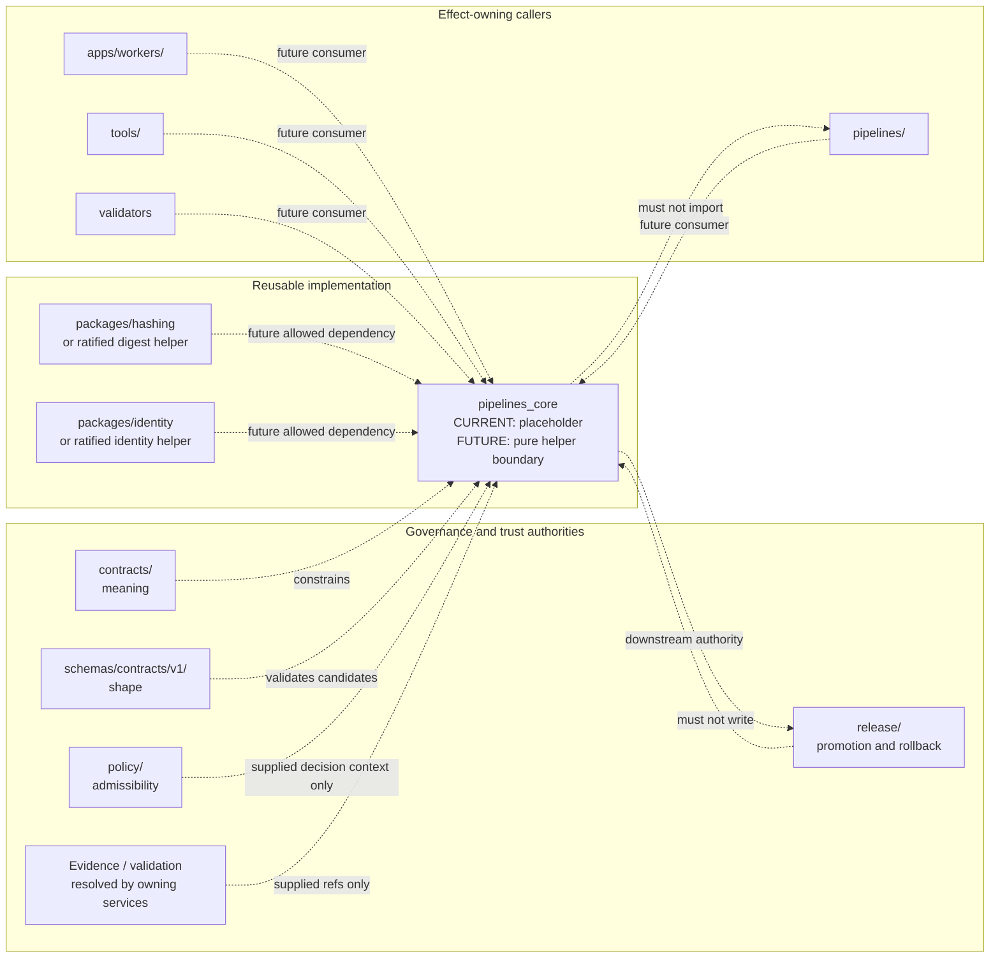

<!-- [KFM_META_BLOCK_V2]
doc_id: kfm://doc/packages-pipelines-core-src-pipelines-core-readme
title: packages/pipelines-core/src/pipelines_core/ — Python Namespace and Pipeline-Control Placeholder Boundary
type: readme
version: v1.1
status: draft
owners: OWNER_TBD — Package steward · Pipeline steward · Runtime steward · Contract steward · Schema steward · Policy steward · Evidence/receipt steward · Validation steward · Security steward · Release steward · CI steward · Docs steward
created: NEEDS VERIFICATION — target existed before this evidence-grounded revision
updated: 2026-07-15
policy_label: "public-doctrine; package-source-boundary; python-namespace; greenfield-placeholder; api-unratified; consumers-unverified; tests-unestablished; no-network-by-default; deterministic-helper-candidate; run-receipt-aware; lifecycle-subordinate; evidence-subordinate; policy-subordinate; release-subordinate; fail-closed; no-truth-authority; no-publication-authority; migration-required; rollback-aware"
current_path: packages/pipelines-core/src/pipelines_core/README.md
truth_posture: >
  CONFIRMED target README v1, package metadata name kfm-pipelines-core and version 0.0.0,
  repository-present pipelines_core namespace directory, empty __init__.py, comment-only core.py
  greenfield placeholder, root Python scaffold, packages responsibility-root doctrine, parent package
  and source READMEs, runtime RunReceipt semantic contract, paired proposed schema, executable schema
  validator wrapper, minimal valid/invalid schema fixtures, deny-by-default RunReceipt policy scaffold,
  common schema-fixture harness, and bounded absence of named functional modules, established public
  exports, repository consumers, package-local tests, package-specific CI, and verified runtime/pipeline
  wiring / PROPOSED a small deterministic pipeline-control helper boundary, explicit input/output value
  objects, run-context checks, transition checks, receipt-candidate assembly, idempotency/replay helpers,
  stable reason-code mapping, dependency direction, package test matrix, staged adoption, correction,
  deprecation, and rollback / CONFLICTED prior README examples that named modules, imports, and helper
  outcomes not present in implementation; adjacent package/source READMEs that still describe package
  metadata and namespace implementation as unknown despite now-inspected placeholders; distribution
  name kfm-pipelines-core versus unconfigured import-package discovery; proposed ADR-0001 wording versus
  current Directory Rules treating the schema home as canonical doctrine; prior helper-outcome vocabulary
  versus the schema-confirmed RunReceipt outcome enum SUCCESS|PARTIAL|FAIL / UNKNOWN accepted package
  API, build backend, package discovery, Python support policy for this subpackage, dependency set, type
  checking, semantic versioning, consumer set, runtime integration, receipt persistence, policy integration,
  CI enforcement, release use, deployment use, and operational health / NEEDS VERIFICATION owners,
  maintainer approval, package metadata completion, import-name decision, API contract, contract/schema
  bindings, test home, negative-state vocabulary, consumer migration, CI path coverage, distribution
  policy, correction process, deprecation window, and rollback automation
evidence_snapshot:
  repository: bartytime4life/Kansas-Frontier-Matrix
  repository_id: "1059091169"
  visibility: public
  base_ref: main
  base_commit: 1926d076eca443dfc64a8b43a5e532f1d67fcb9d
  prior_blob: 70bcb3d7c18d845c7b0a037cb46141885c9a077e
  package_readme_blob: b3a290bc37960a5b4cc2b019596200d68df866a9
  source_readme_blob: 7b531f2d9f952679b1ac20a892d013a0098f04dc
  package_metadata_blob: 09bedd096422d22ae0cc187bfd2469dbe0bdab13
  namespace_init_blob: e69de29bb2d1d6434b8b29ae775ad8c2e48c5391
  namespace_core_blob: 610692013a4ef98bc48d14508ffdc7ad2b96205b
  root_pyproject_blob: e3bd40e8e6ce14dfcde78ff5c09608095c3eca76
  packages_root_blob: fc18fb3334fefe992a551fe12aa98c812232cd17
  directory_rules_blob: 2affb080e6f0043867c64c7f06c1ca52030fbd55
  drift_register_blob: 97a775522dcd058299f752ac7862d0fc56c13280
  schema_home_adr_blob: ab0010a278d766356845c23055f882f328abb418
  run_receipt_contract_blob: 5592aa5e22bbdd0c668189f79b50c18f7d1b2479
  run_receipt_schema_blob: 80d13bcb750d56c769da2f8871242388f7f50a69
  run_receipt_validator_blob: 9b59481e90c021f0f92b74511c43fcefbbe3a057
  run_receipt_policy_blob: 5fa096c9d65183b0b3333e05434bbf6f2ab9c0b7
  run_receipt_fixtures_readme_blob: 2937d4665e217017fb7b28ae3a6273b76d85f980
  common_schema_test_blob: b04342cc034d7f1cc554e155fdd02d6e972976e6
  docs_build_workflow_blob: 3841ed36c0af0a41621992aff1d932cfca9ac082
  link_check_workflow_blob: 9326c5dce2fd99c70293ac61886d289e2fc15a0c
  docs_control_plane_workflow_blob: e50351863cce87a00df03356832b8deada56b325
  bounded_path_checks:
    - packages/pipelines-core/src/pipelines_core/README.md existed at version v1 before this revision
    - packages/pipelines-core/pyproject.toml exists with project name kfm-pipelines-core and version 0.0.0
    - package pyproject contains no build-system, Python requirement, dependencies, optional dependencies, scripts, entry points, or package-discovery configuration
    - packages/pipelines-core/src/pipelines_core/__init__.py exists and is empty
    - packages/pipelines-core/src/pipelines_core/core.py exists and contains only a greenfield-placeholder comment
    - packages/pipelines-core/src/pipelines_core/run_modes.py was not found
    - bounded repository search found no functional pipelines_core consumer import
    - packages/pipelines-core/tests/README.md was not found
    - tests/packages/pipelines-core/README.md was not found
    - tests/packages/pipelines_core/README.md was not found
    - bounded repository search found no package-specific workflow or pipelines-core implementation reference beyond documentation/scaffold files
    - contracts/runtime/run_receipt.md and schemas/contracts/v1/runtime/run_receipt.schema.json exist
    - tools/validators/validate_run_receipt.py exists as a thin schema-validator wrapper
    - fixtures/contracts/v1/runtime/run_receipt contains one documented valid fixture and one documented invalid missing-run-id fixture
    - policy/runtime/run_receipt.rego is a deny-by-default proposed scaffold
    - docs-build, link-check, and docs-control-plane workflows trigger on ordinary pull requests but currently run TODO echo stubs
related:
  - ../README.md
  - ../../README.md
  - ../../pyproject.toml
  - __init__.py
  - core.py
  - ../../../README.md
  - ../../../../pyproject.toml
  - ../../../../docs/doctrine/directory-rules.md
  - ../../../../docs/adr/ADR-0001-schema-home--schemas-contracts-v1-is-canonical.md
  - ../../../../docs/registers/DRIFT_REGISTER.md
  - ../../../../pipelines/README.md
  - ../../../../pipeline_specs/README.md
  - ../../../../contracts/runtime/run_receipt.md
  - ../../../../schemas/contracts/v1/runtime/run_receipt.schema.json
  - ../../../../policy/runtime/run_receipt.rego
  - ../../../../fixtures/contracts/v1/runtime/run_receipt/README.md
  - ../../../../tools/validators/validate_run_receipt.py
  - ../../../../tests/schemas/test_common_contracts.py
tags: [kfm, packages, pipelines-core, pipelines_core, python, namespace, scaffold, pipeline-control, run-receipt, lifecycle, replay, idempotency, negative-state, evidence, policy, validation, migration, rollback]
notes:
  - "This revision changes only packages/pipelines-core/src/pipelines_core/README.md."
  - "The namespace currently contains this README, an empty __init__.py, and a comment-only core.py placeholder."
  - "This README does not install the package, define an accepted API, create exports, approve dependencies, establish consumers, run pipelines, write receipts, accept an ADR, or prove CI/runtime behavior."
  - "Prior proposed module names and import examples are retained only as superseded documentation lineage; they are not current implementation facts or compatibility commitments."
[/KFM_META_BLOCK_V2] -->

<a id="top"></a>

# `pipelines_core` Python Namespace and Pipeline-Control Placeholder Boundary

`packages/pipelines-core/src/pipelines_core/`

> Repository-present Python namespace scaffold for a future reusable pipeline-control library. Current evidence establishes an empty package initializer and a comment-only `core.py` placeholder—not a functional API, installable subpackage, tested helper library, pipeline engine, receipt writer, policy evaluator, or release component.


**Quick links:** [Purpose](#purpose) · [Evidence](#status-and-evidence) · [Placement](#directory-rules-and-authority) · [Vocabulary](#bounded-context-and-ubiquitous-language) · [Inventory](#confirmed-namespace-inventory) · [Packaging](#packaging-import-and-api-status) · [Responsibilities](#proposed-responsibility-envelope) · [Trust membrane](#lifecycle-and-trust-membrane) · [RunReceipt](#runreceipt-integration-boundary) · [Outcomes](#outcome-vocabularies-and-non-collapse) · [Effects](#side-effects-network-and-determinism) · [Security](#security-rights-sensitivity-and-privacy) · [Testing](#testing-fixtures-and-ci) · [Implementation](#smallest-sound-implementation-sequence) · [Done](#definition-of-done) · [Open](#verification-register) · [Rollback](#rollback-correction-and-deprecation)

> [!IMPORTANT]
> **This README is not implementation evidence for a pipeline-control API.** It does not establish package installation, import success, exports, dependency approval, consumer adoption, runtime wiring, receipt persistence, policy integration, pipeline execution, test coverage, CI enforcement, or operational health.

> [!CAUTION]
> **A successful helper result or pipeline run is not public truth.** Evidence resolution, policy, validation, review, release state, correction lineage, and rollback remain separate governed authorities.

---

<a id="purpose"></a>

## Purpose

This README defines the responsibility and verification boundary for the Python namespace located at:

```text
packages/pipelines-core/src/pipelines_core/
```

The namespace is intended to become a **small reusable helper library** for pipeline-control semantics shared by more than one executable pipeline, worker, validator, or maintenance tool.

The current repository state is deliberately much narrower:

- `__init__.py` is empty;
- `core.py` contains only a greenfield-placeholder comment;
- no functional module or public export is established;
- no consuming import was found by bounded repository search;
- no package-local test lane was found at the checked paths;
- the package manifest is a minimal `0.0.0` scaffold without packaging/build configuration.

This README therefore has two jobs:

1. document the **CONFIRMED placeholder state** without inflating it into implementation; and
2. define a **PROPOSED governed boundary** that future code must satisfy before it can be treated as reusable pipeline infrastructure.

It must not become a substitute for code, contracts, schemas, policy, fixtures, validation, release records, or runtime proof.

[Back to top](#top)

---

<a id="status-and-evidence"></a>

## Status and evidence

### Evidence verdict

| Surface | Status | Safe conclusion |
|---|---:|---|
| Target README | **CONFIRMED v1 before revision** | A namespace-boundary document existed. |
| Package manifest | **CONFIRMED placeholder** | Distribution name is `kfm-pipelines-core`; version is `0.0.0`. |
| Package build metadata | **NOT ESTABLISHED** | The subpackage manifest does not declare a build backend, Python requirement, package discovery, dependencies, scripts, or entry points. |
| Namespace directory | **CONFIRMED present** | `packages/pipelines-core/src/pipelines_core/` exists. |
| `__init__.py` | **CONFIRMED empty** | No public import surface is defined. |
| `core.py` | **CONFIRMED comment-only placeholder** | No runtime behavior is defined. |
| Functional modules | **NOT FOUND by bounded checks** | Prior README names such as `run_modes.py`, `run_state.py`, and `replay.py` are not implementation facts. |
| Repository consumers | **NOT FOUND by bounded search** | No code import of `pipelines_core` was established. |
| Package-local tests | **NOT FOUND at checked paths** | No package test suite is established. |
| Package-specific CI | **NOT FOUND by bounded search** | No workflow was established as enforcing this package. |
| RunReceipt contract/schema | **CONFIRMED present; status PROPOSED** | Trust infrastructure exists outside this namespace. |
| RunReceipt validator | **CONFIRMED file present** | A thin schema-validation wrapper exists; this package is not wired to it. |
| RunReceipt fixtures | **CONFIRMED minimal fixture family** | One valid and one invalid case document schema shape only. |
| RunReceipt policy | **CONFIRMED deny-by-default scaffold** | Policy behavior is not implemented beyond a proposed default-deny stub. |
| Docs workflows | **CONFIRMED TODO stubs** | Ordinary PR automation exists but does not prove documentation quality. |

### Classification

**Current maturity:** `GREENFIELD PLACEHOLDER`

**Current API status:** `UNRATIFIED / EMPTY`

**Current consumer status:** `UNESTABLISHED`

**Current release status:** `NOT DISTRIBUTION-READY`

**Current trust posture:** documentation may define boundaries; code, tests, contracts, schemas, policy, receipts, proofs, and release evidence must establish behavior.

### What this README can confirm

This README can confirm repository paths, inspected file contents, adjacent governance boundaries, and the conditions future implementation must meet.

### What this README cannot confirm

This README cannot confirm that:

- `pip install` or editable installation works for this subpackage;
- `import pipelines_core` works outside an ad hoc source-path setup;
- any public symbol exists;
- any helper returns a documented result;
- any pipeline, worker, validator, CLI, or app consumes the package;
- any `RunReceipt` is constructed or persisted through this namespace;
- policy or evidence closure is enforced;
- tests or CI protect the namespace;
- the package is deployed, distributed, or operational.

[Back to top](#top)

---

<a id="directory-rules-and-authority"></a>

## Directory Rules and authority

### Placement determination

The existing path is appropriate for a reusable Python package namespace:

```text
packages/pipelines-core/src/pipelines_core/README.md
```

Directory Rules assign `packages/` to shared reusable implementation libraries. The target is a README inside an already-existing package source namespace. This revision:

- does not create a new root;
- does not move or rename a file;
- does not create a parallel schema, contract, policy, registry, receipt, proof, release, or pipeline home;
- does not require an ADR merely to improve the existing README.

### Responsibility split

| Responsibility | Owning home | Namespace rule |
|---|---|---|
| Reusable pipeline-control helper code | `packages/pipelines-core/src/pipelines_core/` | May live here after API and tests are ratified. |
| Executable pipeline workflows | `pipelines/` | Must not be implemented here. |
| Declarative pipeline definitions | `pipeline_specs/` | Must not be silently embedded here. |
| Source acquisition and source-system behavior | `connectors/` | Must not be implemented here. |
| Object meaning | `contracts/` | This namespace consumes meaning; it does not redefine it. |
| Machine-checkable shape | `schemas/contracts/v1/` | This namespace may validate against shape; it does not become schema authority. |
| Admissibility and exposure decisions | `policy/` | This namespace must not make authoritative policy decisions. |
| Lifecycle data | `data/` phase roots | This namespace must not become a data store or lifecycle authority. |
| Receipts and proofs | `data/receipts/`, `data/proofs/` or repo-confirmed homes | Candidate construction is not authoritative persistence. |
| Release, correction, and rollback decisions | `release/` | This namespace must not publish or approve release. |
| Public API and UI | `apps/` and governed interfaces | Public clients must not import package internals as a trust shortcut. |
| Repository-wide validators and CLIs | `tools/` | Package-local pure helpers may be reused; repository orchestration belongs outside. |
| Tests and fixtures | `tests/`, `fixtures/`, or a ratified package-local test lane | Proof must not be replaced by README claims. |

### Directory Rules basis

A package must be reusable. A one-off workflow step belongs in `tools/` or `pipelines/`. The namespace only earns its current path when code is:

- shared by multiple verified consumers, or intentionally built as a stable shared primitive;
- bounded enough to avoid owning execution, data, policy, evidence, or release;
- deterministic and independently testable;
- documented with a rollback and compatibility posture.

[Back to top](#top)

---

<a id="bounded-context-and-ubiquitous-language"></a>

## Bounded context and ubiquitous language

Use these terms consistently in code, contracts, tests, and review.

| Term | Meaning in this namespace | Must not be confused with |
|---|---|---|
| **Namespace scaffold** | Repository directory that can host Python modules but currently contains no functional API. | Implemented library. |
| **Distribution name** | Package metadata name `kfm-pipelines-core`. | Python import name or proof of installability. |
| **Import namespace** | Directory name `pipelines_core`; package discovery is not configured. | Guaranteed import path. |
| **Pipeline implementation** | Executable source/domain workflow that performs effects and lifecycle work. | Reusable helper code. |
| **Pipeline specification** | Declarative statement of what should run. | Python helper implementation. |
| **Run** | One bounded execution attempt with explicit identity and context. | Public truth or release. |
| **Stage** | A named step or lifecycle-related execution segment. | Lifecycle phase authority. |
| **Helper evaluation** | Pure local assessment of explicit inputs. | Policy decision, validation report, or release approval. |
| **RunReceipt** | Accountable receipt that records a run/stage summary and references inputs, outputs, code, spec, sources, and validation. | Execution engine, EvidenceBundle, PolicyDecision, or ReleaseManifest. |
| **Receipt candidate** | In-memory or serialized candidate prepared for validation and persistence by an owning workflow. | Authoritative stored receipt. |
| **Validation reference** | Reference to a validation record or report. | Proof that validation passed unless resolved and inspected. |
| **Lifecycle reference** | Reference that preserves a phase-qualified object or artifact identity. | Permission to move or expose data. |
| **Idempotency key** | Deterministic key derived from ratified inputs to recognize equivalent requests. | Evidence identity or release identity. |
| **Replay** | Re-execution or comparison against pinned inputs, code/spec identity, and expected outputs. | Automatic certification of truth. |
| **Drift** | Material mismatch between expected and observed replay/result state. | A warning that can be ignored. |
| **Negative state** | Explicit failure, denial, abstention, quarantine, invalidity, partiality, or drift condition. | Exception swallowing or warning-only continuation. |

### Anti-collapse rules

The namespace must preserve these distinctions:

```text
helper evaluation != pipeline execution
pipeline execution != validation
validation != evidence closure
evidence closure != policy approval
policy approval != review approval
review approval != release
release != public truth
receipt candidate != stored receipt
RunReceipt SUCCESS != publication permission
```

[Back to top](#top)

---

<a id="confirmed-namespace-inventory"></a>

## Confirmed namespace inventory

### Current tree

```text
packages/pipelines-core/
├── README.md
├── pyproject.toml
└── src/
    ├── README.md
    └── pipelines_core/
        ├── README.md
        ├── __init__.py
        └── core.py
```

### Current file roles

| File | Confirmed content | Current role |
|---|---|---|
| `README.md` | This namespace guide | Documentation boundary only. |
| `__init__.py` | Empty file | Marks a possible Python package; exports nothing. |
| `core.py` | One greenfield-placeholder comment | Placeholder only; defines no symbols. |
| `../../pyproject.toml` | Project name and `0.0.0` version only | Minimal metadata scaffold; not a complete build configuration. |

### Checked paths not found

The following checked paths were not present at the pinned base:

```text
packages/pipelines-core/src/pipelines_core/run_modes.py
packages/pipelines-core/tests/README.md
tests/packages/pipelines-core/README.md
tests/packages/pipelines_core/README.md
```

The absence of one proposed module does not prove every possible module is absent. The bounded inventory and repository search establish that no functional package API or consumer was found strongly enough to document as implemented.

### Prior proposed tree status

The v1 README listed a larger proposed module tree and concrete import examples. Those entries are now classified as:

```text
SUPERSEDED AS CURRENT-STATE DOCUMENTATION
RETAINED AS DESIGN LINEAGE ONLY
NOT AN API COMMITMENT
```

Future implementation must begin from a ratified minimal API rather than creating every previously listed file.

[Back to top](#top)

---

<a id="packaging-import-and-api-status"></a>

## Packaging, import, and API status

### Distribution metadata

The subpackage manifest currently contains only:

```toml
[project]
name = "kfm-pipelines-core"
version = "0.0.0"
```

### Missing package mechanics

| Mechanic | Current status | Consequence |
|---|---:|---|
| Build backend | **NOT DECLARED** | Wheel/sdist construction is not established. |
| Package discovery | **NOT DECLARED** | Mapping `src/pipelines_core` into a distribution is not established. |
| Python requirement | **NOT DECLARED for subpackage** | Root Python `>=3.11` does not automatically become this package’s ratified support policy. |
| Dependencies | **NOT DECLARED** | Standard-library-only behavior is not an accepted policy; external dependency needs are unknown. |
| Optional dependencies | **NOT DECLARED** | Test/type/dev extras are not established. |
| Scripts / entry points | **NOT DECLARED** | No CLI is established. |
| Build configuration | **NOT DECLARED** | Backend-specific packaging behavior is unknown. |
| Type marker | **NOT FOUND** | Typed-package distribution is not established. |
| Semantic version policy | **NOT DOCUMENTED** | `0.0.0` signals scaffold, not compatibility. |

### Distribution name versus import name

```text
distribution candidate: kfm-pipelines-core
directory/import candidate: pipelines_core
```

Hyphenated distribution names commonly map to underscore import names, but this repository has not configured or tested that mapping for this package. Treat it as **NEEDS VERIFICATION**, not a guaranteed interface.

### Current public API

There is no confirmed public API.

- `__init__.py` exports nothing.
- `core.py` defines no functions, classes, constants, protocols, or exceptions.
- no consumer import was found.
- no import test was found.
- no compatibility promise is established.

Do not copy the v1 README’s illustrative imports into application or pipeline code. They were proposals, not verified exports.

### API ratification requirement

Before the first public symbol is added, the implementing PR should include:

1. the intended consumer and use case;
2. the semantic contract or documented behavior;
3. explicit input and output types;
4. negative-state behavior;
5. side-effect and network posture;
6. dependency direction;
7. tests and fixtures;
8. versioning and compatibility impact;
9. rollback strategy;
10. confirmation that the helper is reusable enough for `packages/`.

[Back to top](#top)

---

<a id="proposed-responsibility-envelope"></a>

## Proposed responsibility envelope

Everything in this section is **PROPOSED** until implemented and tested.

### Candidate responsibilities

A mature but intentionally small namespace may provide pure helpers for:

- validating explicit run-context values;
- evaluating legal state-transition candidates without performing transitions;
- normalizing stable reason codes from already-classified local conditions;
- assembling `RunReceipt` candidates from explicit references and identifiers;
- deriving deterministic idempotency or replay keys from ratified canonical inputs;
- comparing expected and observed replay metadata;
- preserving lifecycle phase labels and rejecting invalid public-exposure candidates;
- building immutable value objects used by multiple executable pipelines;
- translating package-local outcomes into caller-owned contract objects without deciding policy or release.

### Responsibilities it must not own

| Forbidden responsibility | Why |
|---|---|
| Execute pipeline DAGs or workflow graphs | Executable workflow authority belongs in `pipelines/`. |
| Interpret pipeline specifications as an orchestration engine | Declarative definitions and orchestration remain separate. |
| Fetch source data or credentials | Source-system boundary belongs in `connectors/` and secret infrastructure. |
| Read or write lifecycle stores | Data state and phase transitions belong to governed pipelines/data roots. |
| Move files between lifecycle directories | Promotion is a governed state transition, not a file move. |
| Persist receipts, proofs, EvidenceBundles, or release records | Trust artifacts require owning stores, validation, and review. |
| Evaluate authoritative policy | Policy authority belongs in `policy/`. |
| Decide evidence sufficiency | Evidence resolution and review remain separate. |
| Approve promotion, publication, correction, or rollback | Release authority belongs in `release/`. |
| Expose public API routes or UI state | Public access must cross governed interfaces. |
| Call models or generate claims | AI is interpretive and evidence-subordinate. |
| Hide partial, failed, denied, abstained, quarantined, or drifted states | Negative states must remain explicit and auditable. |

### Smallness rule

The package should remain smaller than the collection of all possible pipeline concerns. Add a helper only when:

- at least one real consumer is identified;
- the helper’s meaning is stable enough to share;
- it can be tested independently;
- its dependency direction is safe;
- it avoids effectful workflow ownership;
- its removal or replacement has a clear migration path.

[Back to top](#top)

---

<a id="dependency-direction"></a>

## Dependency direction

### Proposed dependency graph



Dashed edges are design direction, not proof of current imports.

### Import rules

A future implementation should:

- prefer Python standard-library types where sufficient;
- depend only on ratified reusable packages with no reverse dependency;
- avoid importing deployable apps, connector implementations, domain pipeline implementations, lifecycle stores, policy evaluators, release writers, UI code, or model runtimes;
- avoid repository-root path manipulation as a hidden packaging substitute;
- expose a minimal intentional `__init__.py`, not wildcard re-exports;
- use `TYPE_CHECKING` and protocols carefully to avoid runtime cycles;
- keep contract/schema identifiers as references rather than duplicating schemas in Python constants.

### Cycle prohibition

A dependency cycle between `pipelines_core` and `pipelines/`, `apps/`, or `tools/` would collapse shared library and orchestration responsibilities. Such a cycle must block implementation review until resolved.

[Back to top](#top)

---

<a id="lifecycle-and-trust-membrane"></a>

## Lifecycle and trust membrane

KFM’s lifecycle invariant is:

```text
RAW -> WORK / QUARANTINE -> PROCESSED -> CATALOG / TRIPLET -> PUBLISHED
```

This namespace may eventually help callers **check** metadata associated with a proposed action. It must not own the transition itself.

### Permitted future posture

```text
explicit caller input
  -> pure local helper evaluation
  -> typed candidate/result
  -> caller-owned validation
  -> policy/evidence/review gates
  -> caller-owned receipt persistence
  -> governed promotion or rejection
```

### Forbidden shortcut

```text
helper returns success
  -> write directly to PUBLISHED
  -> expose through public API/UI
```

### Phase preservation

Any future helper accepting a lifecycle reference should preserve:

- phase;
- domain or lane;
- source or artifact identity;
- run identity;
- version/hash identity where applicable;
- sensitivity/rights posture supplied by the caller;
- correction/rollback references supplied by the caller.

It must not infer that a phase-qualified reference is safe for another phase.

### Public-exposure rule

No helper result may authorize a public client or normal UI surface to read:

```text
data/raw/
data/work/
data/quarantine/
unpublished processed candidates
canonical/internal stores
direct model output
```

Public exposure remains a governed API/released-artifact decision.

[Back to top](#top)

---

<a id="runreceipt-integration-boundary"></a>

## `RunReceipt` integration boundary

### Confirmed trust infrastructure

The repository contains a semantic `RunReceipt` contract and paired runtime schema outside this namespace.

The current schema requires:

| Field | Confirmed machine shape |
|---|---|
| `run_id` | string matching `^[a-z][a-z0-9_:.-]*$` |
| `stage` | string |
| `inputs` | array of strings |
| `outputs` | array of strings |
| `code_ref` | string |
| `spec_hash` | string matching `^sha256:[a-f0-9]{64}$` |
| `source_descriptor_refs` | array of strings |
| `validation_refs` | array of strings |
| `outcome` | `SUCCESS`, `PARTIAL`, or `FAIL` |
| additional properties | forbidden |

The repository also contains:

- a thin `tools/validators/validate_run_receipt.py` schema-validator wrapper;
- a fixture family with one valid case and one invalid missing-`run_id` case;
- a common schema-fixture pytest harness;
- a deny-by-default RunReceipt policy scaffold.

### Namespace relationship

A future `pipelines_core` helper may prepare an in-memory receipt candidate **only** when:

- field semantics come from the contract;
- shape comes from the schema;
- validation uses the owning validator/harness;
- source and validation refs remain resolvable;
- persistence is performed by the owning pipeline/workflow;
- policy and release decisions remain external;
- `SUCCESS` is never interpreted as truth or publication permission.

### Current non-binding status

No current namespace code:

- imports the RunReceipt schema;
- constructs a receipt;
- validates a receipt;
- persists a receipt;
- resolves a source descriptor or validation ref;
- integrates with the policy scaffold;
- emits a receipt from a pipeline;
- proves correction or rollback traceability.

The contract/schema pairing is relevant evidence for future design, not evidence that the package implements it.

### Candidate-construction rule

A future receipt-candidate helper should accept all required values explicitly. It must not:

- read Git state implicitly;
- scrape environment variables for identifiers;
- invent source refs;
- invent validation refs;
- generate a spec hash from an undocumented serialization;
- infer `SUCCESS` from absence of an exception;
- write the candidate to a trust-bearing store.

[Back to top](#top)

---

<a id="outcome-vocabularies-and-non-collapse"></a>

## Outcome vocabularies and non-collapse

### Confirmed persisted run outcomes

The current RunReceipt schema defines:

```text
SUCCESS | PARTIAL | FAIL
```

These values describe the immediate run completion state recorded by a receipt.

### Prior README helper outcomes

The v1 namespace README proposed:

```text
READY | INVALID | DENIED | ABSTAIN | QUARANTINE | RETRY | FAILED | DRIFT
```

No implementation, contract, schema, export, test, or consumer was found for that vocabulary. It is therefore:

```text
DESIGN LINEAGE
NOT CURRENT API
NOT CURRENT CONTRACT
NOT A COMPATIBILITY GUARANTEE
```

### Three outcome layers

Future design must keep three layers distinct.

| Layer | Example responsibility | Authority/status |
|---|---|---|
| Local helper evaluation | Is an explicit transition candidate locally coherent? | PROPOSED; package-local API must be ratified. |
| Execution receipt | Did the run finish as `SUCCESS`, `PARTIAL`, or `FAIL`? | Schema-confirmed; contract/schema remain draft/PROPOSED. |
| Policy/runtime/public response | Is the action allowed, denied, held, abstained, or errored for an audience? | Outside this namespace. |

### Mapping rule

No mapping between layers may be implicit.

Examples:

- local helper `valid` does not force RunReceipt `SUCCESS`;
- RunReceipt `SUCCESS` does not force policy `allow`;
- policy `allow` does not prove evidence closure;
- `PARTIAL` must not be silently upgraded to success;
- `FAIL` must not be transformed into retry without an explicit retry policy;
- drift must block promotion until reviewed.

A future outcome mapping needs a semantic contract, tests for every branch, and explicit preservation of original status.

[Back to top](#top)

---

<a id="accepted-inputs-and-output-boundary"></a>

## Accepted inputs and output boundary

Everything in this section describes **future implementation requirements**.

### Accepted input families

| Input family | Examples | Required posture |
|---|---|---|
| Run identity | run id, pipeline id, stage id, attempt number | Explicit, stable, non-secret. |
| Code/spec identity | code ref, config ref, spec hash | Pinned and caller-supplied or produced by a ratified identity/hash helper. |
| Lifecycle refs | phase-qualified input/output refs | Preserve phase; never fetch payloads. |
| Source refs | SourceDescriptor refs, source-role labels | Preserve; never invent or resolve as truth locally. |
| Validation refs | ValidationReport refs or validator result refs | Preserve; do not assume pass without inspection by owning workflow. |
| Policy context | supplied PolicyDecision ref or bounded decision summary | Treat as input context; do not evaluate authoritative policy. |
| Evidence context | EvidenceRef/EvidenceBundle refs | Carry refs only unless a separate resolver is explicitly injected. |
| Retry context | attempt count, retry class, maximum attempts, backoff policy id | Explicit and deterministic. |
| Replay context | prior receipt ref, expected refs/hashes, comparison policy id | Explicit and pinned. |
| Correction/rollback context | correction ref, supersession ref, rollback target | Preserve for traceability. |
| Clock/randomness | injected clock, seed, or nonce source | Never hidden global nondeterminism. |

### Output families

A future helper may return:

- immutable value objects;
- validation issues;
- transition candidates;
- stable reason codes;
- receipt candidates;
- idempotency/replay keys;
- comparison results;
- caller-action requirements.

It must not return or perform:

- published artifacts;
- authoritative policy decisions;
- EvidenceBundles asserted as resolved;
- persisted receipts/proofs;
- lifecycle file moves;
- release approvals;
- public API responses;
- raw source payloads;
- model-generated claims.

### Reference-not-payload rule

Trust-bearing inputs and outputs should use references rather than embedding:

- source payloads;
- restricted records;
- precise sensitive geometry;
- credentials;
- private prompts;
- raw model output;
- unpublished domain data.

[Back to top](#top)

---

<a id="side-effects-network-and-determinism"></a>

## Side effects, network, and determinism

### Current behavior

Current namespace code performs no known behavior because it contains no executable definitions.

### Future default

The namespace should be **pure and no-network by default**.

Pure helper behavior means:

- same ratified inputs produce the same result;
- no hidden filesystem reads or writes;
- no network calls;
- no credential access;
- no process execution;
- no environment-variable dependence for semantic decisions;
- no implicit current time;
- no implicit random values;
- no mutable module-level state;
- no logging of private payloads;
- no persistence.

### Effect ownership

| Effect | Correct owner |
|---|---|
| Source/network fetch | connector or effect-owning pipeline |
| Object-store/database read/write | owning data service or pipeline |
| Receipt/proof persistence | governed workflow and trust-artifact store |
| Policy evaluation | policy runtime |
| Evidence resolution | evidence resolver |
| Release mutation | release workflow |
| Clock/random value | injected by caller and recorded where relevant |
| Retry sleep/scheduling | orchestration layer |
| Telemetry emission | approved observability layer with redaction |

### Deterministic serialization

Any helper used for hashing, idempotency, or replay must use a ratified canonicalization profile. It must not rely on:

- unordered dictionary rendering;
- platform-dependent paths;
- locale-dependent formatting;
- naive timestamps;
- floating-point string behavior without a defined profile;
- Python object `repr`;
- undocumented JSON settings.

Until a canonicalization contract is accepted, hash/idempotency behavior remains **PROPOSED**.

[Back to top](#top)

---

<a id="identity-hashing-idempotency-and-replay"></a>

## Identity, hashing, idempotency, and replay

### Identity posture

This namespace must not create a parallel identity grammar. It should consume identifiers from ratified identity helpers or explicit caller inputs.

### `spec_hash`

The current RunReceipt schema requires:

```text
sha256:<64 lowercase hexadecimal characters>
```

That pattern verifies string shape only. It does not establish:

- what content was canonicalized;
- which fields were included;
- which serialization profile was used;
- whether the digest resolves to an accepted spec;
- whether the spec was reviewed.

### Idempotency

A future idempotency helper should derive keys only from an accepted tuple such as:

```text
pipeline identity
+ stage identity
+ canonical input refs
+ code/spec identity
+ material configuration identity
+ declared run mode
```

The tuple and canonicalization must be documented and tested. Secrets, timestamps used only for observation, and mutable display labels should not accidentally change semantic idempotency.

### Replay

A replay comparison should report:

- expected run/receipt identity;
- observed run/receipt identity;
- pinned code/spec/config refs;
- expected and observed input refs;
- expected and observed output refs/hashes;
- missing or extra artifacts;
- mismatch classification;
- review requirement.

Replay equality is not proof of source truth or publication correctness. It is one integrity signal.

### Drift posture

Material drift must produce an explicit non-success result and block promotion until an owning workflow reviews it. Warning-only drift is not acceptable for trust-bearing paths.

[Back to top](#top)

---

<a id="temporal-semantics"></a>

## Temporal semantics

No temporal API is currently implemented in this namespace.

Future run-control values should distinguish, where relevant:

- event/source time;
- valid time;
- transaction/ingest time;
- processing time;
- observation time;
- release time;
- correction/supersession time.

### Time rules

- timestamps should be timezone-aware and normalized by a ratified profile;
- the time kind should be explicit, not inferred from one generic `timestamp`;
- a caller should inject the clock for deterministic tests;
- retry scheduling time should remain orchestration metadata, not semantic evidence;
- backfills must preserve original valid/source time separately from processing time;
- replay should compare the correct time kind;
- time values must not encode exact sensitive activity/location information without policy review.

[Back to top](#top)

---

<a id="errors-retries-and-resume"></a>

## Errors, retries, and resume

### Error boundary

A future helper should convert known local validation conditions into stable, documented issue codes. It should not:

- swallow exceptions;
- expose raw stack traces through public surfaces;
- convert every exception into retry;
- hide invalid input behind defaults;
- downgrade policy denial to warning;
- continue after unresolved evidence when the caller requires closure.

### Retry boundary

The package may calculate a retry **candidate** from explicit policy inputs. It must not sleep, schedule, or rerun work.

A retry candidate should preserve:

- original run and stage identity;
- attempt number;
- stable failure/reason code;
- retryability classification;
- maximum attempts;
- selected policy id/version;
- proposed delay;
- idempotency key;
- prior receipt/error refs.

### Resume boundary

Resume requires an explicit checkpoint or prior run reference. A helper must not infer resumability from partial files or logs alone.

### Exhaustion

Retry exhaustion must become a first-class terminal state. It must not loop silently or be relabeled as success/partial without an explicit contract.

[Back to top](#top)

---

<a id="security-rights-sensitivity-and-privacy"></a>

## Security, rights, sensitivity, and privacy

### Data minimization

This namespace should operate on identifiers, bounded metadata, and public-safe synthetic fixtures whenever possible.

Do not place in package code, tests, examples, or documentation:

- credentials, tokens, private keys, or connection strings;
- raw provider payloads;
- living-person private records;
- DNA/genomic data;
- exact rare-species or archaeological locations;
- critical-infrastructure precision not approved for the audience;
- restricted land/person associations;
- private prompts or chain-of-thought;
- unrestricted quarantine content.

### Reason-code safety

Stable reason codes may be public-safe; raw exception messages may not be. A future implementation should separate:

```text
internal diagnostic detail
public-safe reason code
review-only context
```

### Logging

The package should not log by default. If caller-owned telemetry is supported later, values must be explicitly passed through redaction and sensitivity policy before emission.

### Dependency safety

Any external dependency requires:

- justification over standard library or existing package;
- version and compatibility policy;
- license review;
- vulnerability review;
- transitive dependency review;
- reproducible lock/resolution strategy;
- rollback/removal plan.

### Deserialization

Do not deserialize untrusted pickle or executable formats. Contract-shaped inputs should use safe parsers and schema validation.

[Back to top](#top)

---

<a id="consumer-and-interface-contract"></a>

## Consumer and interface contract

### Current consumers

No repository code consumer was established by bounded searches for:

```text
from pipelines_core
import pipelines_core
```

Search hits were documentation/scaffold references only.

### First-consumer requirement

The first implementation PR must name a real consumer and show why the logic belongs in a shared package rather than directly in that pipeline or tool.

The pilot consumer should:

- import only the ratified public API;
- avoid source-path hacks;
- pass explicit values;
- preserve negative states;
- validate receipt candidates externally;
- own side effects;
- provide tests at both package and integration layers;
- include rollback to the previous consumer path.

### No internal imports

Consumers must not import private modules or underscore-prefixed implementation details. If an API is not exported intentionally, it is not stable.

### No public-client dependency

Browser/public UI code and external clients must not depend directly on this namespace. They should receive governed, released, audience-safe envelopes from application boundaries.

[Back to top](#top)

---

<a id="testing-fixtures-and-ci"></a>

## Testing, fixtures, and CI

### Current package-test evidence

Checked package-test paths were not found:

```text
packages/pipelines-core/tests/README.md
tests/packages/pipelines-core/README.md
tests/packages/pipelines_core/README.md
```

This does not prove no related test exists anywhere; it establishes that no package-specific suite was found strongly enough to cite as current protection.

### Existing RunReceipt schema proof

The repository’s common schema harness discovers schemas and matching fixture families. The current RunReceipt fixture family provides:

- one valid minimal fixture;
- one invalid fixture missing `run_id`;
- one broad expected-error matcher.

That proves only schema-shape behavior when the harness is run. It does not test `pipelines_core`.

### Minimum package test matrix

Before the namespace is classified beyond placeholder, add tests for:

| Area | Required proof |
|---|---|
| Import | Installed/imported package resolves without repository-root path hacks. |
| API | Only intentional symbols are exported. |
| Determinism | Equal canonical inputs produce equal results. |
| Side effects | Import and pure calls perform no network/filesystem/process/credential access. |
| Input validation | Missing, malformed, and extra values produce explicit issues. |
| Transition logic | Every legal and illegal transition branch is covered. |
| RunReceipt candidate | Candidate validates against the paired schema. |
| Outcome separation | Helper result, RunReceipt outcome, and policy/runtime outcome cannot collapse. |
| Negative states | Partial, fail, invalid, denial context, abstention context, quarantine context, retry exhaustion, and drift remain explicit where applicable. |
| Hash/idempotency | Canonicalization and key composition are stable and versioned. |
| Replay | Match, mismatch, missing, and extra cases are covered. |
| Security | Secret/private/sensitive values are not logged or embedded. |
| Dependency boundary | Forbidden imports from apps/connectors/pipelines/data/release/policy engines are rejected. |
| Consumer integration | At least one real caller uses only the public API. |
| Rollback | Consumer can return to prior implementation without data or receipt corruption. |

### Proposed test placement

The test home is **NEEDS VERIFICATION**. Choose one consistent pattern and document it:

```text
tests/packages/pipelines_core/
```

or an accepted package-local test layout. Do not create competing homes without a placement decision.

### CI posture

The inspected documentation workflows trigger on ordinary pull requests but currently execute TODO echo commands. They do not enforce this README or package behavior.

A future package CI job should:

- watch `packages/pipelines-core/**`;
- install the package through its declared build configuration;
- run unit and integration tests;
- run type checking if adopted;
- run dependency and secret checks;
- validate RunReceipt candidates if that integration is implemented;
- enforce forbidden-import rules;
- fail on undocumented public API changes;
- produce reviewable logs without sensitive data.

### Inspection and validation commands

These commands are for a mounted checkout. They do not imply the package currently passes.

```bash
# Inventory
find packages/pipelines-core -maxdepth 5 -type f | sort

# Confirm package metadata and source state
sed -n '1,220p' packages/pipelines-core/pyproject.toml
sed -n '1,220p' packages/pipelines-core/src/pipelines_core/__init__.py
sed -n '1,220p' packages/pipelines-core/src/pipelines_core/core.py

# Find consumers
git grep -nE '(^|[[:space:]])(from[[:space:]]+pipelines_core|import[[:space:]]+pipelines_core)' -- . \
  ':(exclude)packages/pipelines-core/**/*.md' \
  ':(exclude)SKELETON_MAP.md' || true

# Inspect package tests and workflows
find tests packages/pipelines-core -type f 2>/dev/null | grep -E 'pipelines[-_]core|pipeline.*core' | sort
git grep -n 'pipelines-core\|pipelines_core' -- .github/workflows 2>/dev/null || true

# Existing RunReceipt shape checks
python tools/validators/validate_run_receipt.py
pytest -q tests/schemas/test_common_contracts.py
```

[Back to top](#top)

---

<a id="documentation-drift-and-conflicts"></a>

## Documentation drift and conflicts

### Conflict register for this namespace

| ID | Status | Conflict | Required resolution |
|---|---:|---|---|
| `PC-DRIFT-001` | **CONFIRMED** | v1 target README named modules and imports that are not present. | Treat as design lineage; ratify a minimal API before code. |
| `PC-DRIFT-002` | **CONFIRMED** | Parent package/source READMEs say metadata and namespace implementation are broadly unknown, while current inspection confirms a minimal manifest, empty initializer, and placeholder core. | Update parent docs in a separate scoped change if desired. |
| `PC-DRIFT-003` | **CONFLICTED** | Distribution name exists, but package discovery/build backend is absent. | Complete package metadata and prove installation/import mapping. |
| `PC-DRIFT-004` | **CONFLICTED** | v1 helper outcome vocabulary differs from the RunReceipt schema enum. | Define separate semantic layers; do not reuse names implicitly. |
| `PC-DRIFT-005` | **CONFLICTED** | ADR-0001 remains `proposed`, while Directory Rules present the schema-home rule as canonical doctrine. | Steward/ADR-status reconciliation; do not create parallel schema homes. |
| `PC-DRIFT-006` | **CONFIRMED** | RunReceipt policy file is default-deny scaffold only. | Do not claim policy integration or complete gate semantics. |
| `PC-DRIFT-007` | **CONFIRMED** | Documentation workflows are TODO stubs. | Do not claim automated Markdown/link/control-plane enforcement. |
| `PC-DRIFT-008` | **UNKNOWN** | Package test home and namespace naming convention are not frozen. | Decide before adding parallel test/import layouts. |

This README records drift locally for maintainers. It does not mutate the repository-wide Drift Register because the user’s requested change budget is one file.

### Precedence rule

Where this README conflicts with:

1. accepted doctrine or ADRs;
2. machine contracts/schemas;
3. executable tests;
4. current implementation;

the stronger current evidence wins. Correct this README rather than using prose to override behavior.

[Back to top](#top)

---

<a id="smallest-sound-implementation-sequence"></a>

## Smallest sound implementation sequence

Do not build the full v1 proposed module tree at once.

### Gate 0 — ownership and package decision

Required before code expansion:

- assign package and review owners;
- confirm `packages/` remains the correct responsibility root;
- identify the first real consumer;
- decide package test placement;
- decide whether this should be independently distributed or only workspace-installed;
- reconcile relevant ADR/status drift.

### Gate 1 — complete package mechanics

Add and validate:

- build backend;
- `src` package discovery;
- Python version policy;
- test/dev extras;
- type-checking posture if adopted;
- license metadata;
- reproducible dependency resolution;
- installed-package import test.

Do not add production dependencies without review.

### Gate 2 — ratify one minimal API slice

Choose one pure, reusable capability with a real consumer, such as explicit run-context validation or receipt-candidate construction.

The PR must include:

- semantic behavior documentation;
- input/output types;
- negative states;
- no-side-effect proof;
- package tests;
- consumer integration test;
- rollback.

### Gate 3 — bind to RunReceipt safely

Only if the first slice constructs receipt candidates:

- consume the existing semantic contract;
- validate against the paired schema;
- add positive and negative fixtures;
- preserve all required refs;
- keep persistence outside the package;
- prove `SUCCESS` does not imply release.

### Gate 4 — add identity/replay behavior

Only after canonicalization and identifier rules are ratified:

- deterministic idempotency key;
- replay comparison model;
- explicit drift state;
- property/golden tests;
- versioned compatibility behavior.

### Gate 5 — CI enforcement

Add package-path CI for installation, tests, type checks, forbidden imports, schema integration, and API drift.

### Gate 6 — broader adoption

Migrate additional consumers one at a time. Each consumer change must include:

- before/after behavior comparison;
- no-loss assessment;
- receipt/evidence/policy impact;
- rollback path;
- removal of duplicate logic only after parity is proven.

### Gate 7 — version and deprecation policy

Move beyond `0.0.0` only when:

- public API is intentional;
- consumers and tests are known;
- compatibility policy is documented;
- package build is reproducible;
- CI enforces the contract;
- correction and deprecation paths exist.

[Back to top](#top)

---

<a id="definition-of-done"></a>

## Definition of done

### README revision done

This documentation revision is complete when:

- the target path and responsibility root are correct;
- confirmed placeholder state is explicit;
- no proposed module/export is presented as current implementation;
- current package metadata, initializer, and core placeholder are documented;
- RunReceipt infrastructure is described without claiming package integration;
- trust boundaries and non-ownership are explicit;
- conflicts and unknowns are visible;
- validation and rollback instructions are present;
- Markdown structure, links, tables, fences, and Mermaid syntax pass local static checks.

### Namespace implementation done

The package is **not** implementation-complete until all applicable items are verified:

- [ ] named owners and reviewers;
- [ ] complete package/build metadata;
- [ ] installed-package import works;
- [ ] intentional minimal public API;
- [ ] real consumer inventory;
- [ ] deterministic pure behavior;
- [ ] explicit negative states;
- [ ] contract/schema alignment;
- [ ] package tests and integration tests;
- [ ] forbidden-import enforcement;
- [ ] no-network/no-secret proof;
- [ ] receipt-candidate validation where applicable;
- [ ] policy/evidence/release boundaries preserved;
- [ ] CI watches package paths;
- [ ] semantic version and deprecation policy;
- [ ] correction and rollback drill;
- [ ] operational evidence for any runtime claim.

Until then, the correct maturity label remains `PROPOSED`, `PLACEHOLDER`, or `NEEDS VERIFICATION` as appropriate.

[Back to top](#top)

---

<a id="maintenance-checklist"></a>

## Maintenance checklist

Before changing namespace code or this README:

- [ ] Re-read Directory Rules and relevant accepted ADRs.
- [ ] Re-read the current package manifest and public exports.
- [ ] Inspect consumers before changing names or behavior.
- [ ] Keep the change inside the requested file/package scope.
- [ ] Do not create a parallel pipeline, schema, contract, policy, receipt, proof, or release home.
- [ ] Mark proposals and unknowns explicitly.
- [ ] Add or update package tests for behavior changes.
- [ ] Add negative cases, not only happy paths.
- [ ] Validate receipt candidates against the owning schema where applicable.
- [ ] Preserve lifecycle phase, evidence, policy, source, release, correction, and rollback refs.
- [ ] Check forbidden imports and side effects.
- [ ] Review dependencies, licenses, and vulnerabilities.
- [ ] Update consumer migration notes for API changes.
- [ ] Keep rollback possible.
- [ ] Update related parent READMEs when scope or maturity materially changes.

[Back to top](#top)

---

<a id="verification-register"></a>

## Verification register

| ID | Question | Status | Evidence needed |
|---|---|---:|---|
| `PC-V-001` | Who owns the package? | **NEEDS VERIFICATION** | CODEOWNERS or steward assignment. |
| `PC-V-002` | Is `packages/pipelines-core/` the accepted long-term package path? | **NEEDS VERIFICATION** | Maintainer review against current package inventory. |
| `PC-V-003` | Is the import name `pipelines_core` ratified? | **NEEDS VERIFICATION** | Completed package discovery + installed import test. |
| `PC-V-004` | Which build backend is approved? | **UNKNOWN** | Updated `pyproject.toml` and build proof. |
| `PC-V-005` | Which Python versions are supported? | **UNKNOWN** | Package policy and CI matrix. |
| `PC-V-006` | Is the package independently distributable or repository-internal? | **UNKNOWN** | Distribution decision. |
| `PC-V-007` | Which dependencies are approved? | **UNKNOWN** | Dependency review and lock/resolution evidence. |
| `PC-V-008` | Is the package typed? | **UNKNOWN** | Type policy, annotations, marker, and CI. |
| `PC-V-009` | What is the first public API? | **UNKNOWN** | API contract and implementation PR. |
| `PC-V-010` | What is the first real consumer? | **UNKNOWN** | Consumer import and integration test. |
| `PC-V-011` | Where do package tests live? | **NEEDS VERIFICATION** | One accepted test-home decision. |
| `PC-V-012` | Are package imports free of repository path hacks? | **UNKNOWN** | Installed-package test. |
| `PC-V-013` | Are helpers pure/no-network? | **UNKNOWN** | Side-effect tests and import inspection. |
| `PC-V-014` | Is a local helper outcome contract needed? | **NEEDS VERIFICATION** | Semantic contract/ADR and test matrix. |
| `PC-V-015` | How do helper outcomes map to RunReceipt outcomes? | **NEEDS VERIFICATION** | Explicit mapping contract and negative tests. |
| `PC-V-016` | Does the package construct RunReceipt candidates? | **UNKNOWN** | Implementation and schema-validation integration. |
| `PC-V-017` | Where are RunReceipts persisted? | **UNKNOWN for package consumers** | Owning workflow/store evidence. |
| `PC-V-018` | Do source and validation refs resolve before promotion? | **UNKNOWN** | Resolver and gate evidence. |
| `PC-V-019` | Is RunReceipt policy more than default-deny scaffold? | **NO / scaffold only at base** | Reviewed policy bundle and tests. |
| `PC-V-020` | What canonicalization profile governs hashes/idempotency? | **UNKNOWN** | Accepted spec-normalization decision. |
| `PC-V-021` | What identity grammar governs run/stage ids? | **UNKNOWN beyond schema pattern** | Identity contract and tests. |
| `PC-V-022` | What temporal model governs run metadata? | **UNKNOWN** | Time-kind contract and fixtures. |
| `PC-V-023` | What retry policy and reason-code vocabulary are accepted? | **UNKNOWN** | Contract/policy and tests. |
| `PC-V-024` | How is replay drift classified and reviewed? | **UNKNOWN** | Replay contract, fixtures, and review flow. |
| `PC-V-025` | Does CI watch `packages/pipelines-core/**`? | **NOT ESTABLISHED** | Workflow path filter and passing run. |
| `PC-V-026` | Are docs links/anchors automatically checked? | **NOT ESTABLISHED** | Non-stub docs/link workflow evidence. |
| `PC-V-027` | Is semantic versioning enforced? | **NO evidence** | Version policy and release tooling. |
| `PC-V-028` | Is there a deprecation window? | **UNKNOWN** | Compatibility/deprecation policy. |
| `PC-V-029` | Has rollback been drilled for a consumer migration? | **UNKNOWN** | Drill receipt/log and restored behavior. |
| `PC-V-030` | Is the package deployed or operational? | **UNKNOWN** | Build artifact, deployment manifest, runtime logs, and health evidence. |
| `PC-V-031` | Are parent package/source READMEs synchronized with current placeholder evidence? | **NO at this revision boundary** | Separate documentation update. |
| `PC-V-032` | Is ADR-0001 formally accepted or still proposed? | **CONFLICTED across current docs** | Steward/ADR status reconciliation. |
| `PC-V-033` | Does any hidden/generated code depend on prior proposed export names? | **UNKNOWN** | Generated artifact and full consumer inventory. |
| `PC-V-034` | Are sensitive values excluded from diagnostics and fixtures? | **UNKNOWN for future code** | Security tests and review. |
| `PC-V-035` | Is package removal reversible without data/receipt loss? | **UNKNOWN** | Consumer migration/rollback plan and drill. |

[Back to top](#top)

---

<a id="rollback-correction-and-deprecation"></a>

## Rollback, correction, and deprecation

### Documentation rollback

This revision changes one README. Roll it back by reverting its commit or restoring the prior target blob:

```text
70bcb3d7c18d845c7b0a037cb46141885c9a077e
```

No package code, manifest, test, fixture, contract, schema, policy, pipeline, data, receipt, proof, release, or workflow state is changed by this documentation revision.

### Future code rollback

A future implementation PR must record:

- prior consumer implementation;
- new package version/commit;
- affected consumers;
- data/receipt compatibility;
- feature flag or switchback method where appropriate;
- expected and observed behavior;
- rollback trigger;
- validation after rollback.

### Correction

When this README overstates or understates implementation:

1. pin the current repository evidence;
2. correct the smallest affected section;
3. preserve the previous claim in the changelog when materially important;
4. label unresolved conflict;
5. update parent docs if the maturity boundary changed;
6. avoid rewriting history as though the incorrect claim never existed.

### Deprecation

A public package symbol may be deprecated only after:

- consumers are inventoried;
- replacement behavior is documented and tested;
- migration instructions exist;
- a deprecation window is stated;
- telemetry/logging does not expose sensitive data;
- rollback remains possible;
- removal is validated in CI.

### Namespace removal

If the namespace never gains a reusable API, the safer change may be removal or consolidation rather than preserving an empty authority-looking package. Any removal must check generated references, package manifests, docs links, and consumer imports first.

[Back to top](#top)

---

<a id="evidence-ledger"></a>

## Evidence ledger

| Evidence | Status | Supports | Does not prove |
|---|---:|---|---|
| Previous target README | **CONFIRMED** | Existing purpose, lifecycle guardrails, helper-only intent, prior proposed modules/outcomes. | Functional implementation or API. |
| `../../pyproject.toml` | **CONFIRMED placeholder** | Distribution name and `0.0.0` version. | Build/install/import/dependencies. |
| `__init__.py` | **CONFIRMED empty** | No exported namespace API. | Absence of all possible generated/runtime behavior elsewhere. |
| `core.py` | **CONFIRMED comment-only** | Greenfield placeholder state. | Future design. |
| `../README.md` | **CONFIRMED repo doc** | Source-envelope helper-only boundary. | Current functional source modules. |
| `../../README.md` | **CONFIRMED repo doc** | Package-level helper-only boundary. | Package build/runtime maturity. |
| `../../../README.md` | **CONFIRMED repo doc** | `packages/` owns shared reusable implementation code. | This package’s API or consumers. |
| Root `pyproject.toml` | **CONFIRMED** | Root project uses Hatchling, Python `>=3.11`, and pytest optional dependency. | Automatic inheritance by the subpackage. |
| Directory Rules | **CONFIRMED doctrine** | Packages/shared-library placement; pipelines/specs split; trust-root separation. | Package implementation. |
| Drift Register | **CONFIRMED** | Current repository-wide documented drift entries. | Absence of undocumented drift. |
| ADR-0001 file | **CONFIRMED present / proposed** | Proposed canonical schema-home decision and contracts/schemas/policy/fixtures split. | Formal accepted status. |
| RunReceipt contract | **CONFIRMED present / draft** | Semantic receipt boundary and fields. | Package integration or runtime persistence. |
| RunReceipt schema | **CONFIRMED present / proposed** | Required machine shape and `SUCCESS|PARTIAL|FAIL`. | Semantic truth, policy approval, or release. |
| RunReceipt validator wrapper | **CONFIRMED present** | Schema-validation entry point. | Passing runs or package use. |
| RunReceipt fixture README | **CONFIRMED** | Minimal valid/invalid fixture inventory. | Comprehensive fixture coverage. |
| RunReceipt policy file | **CONFIRMED scaffold** | Default deny posture. | Complete policy behavior. |
| Common schema test | **CONFIRMED present** | Fixture discovery and schema validation logic. | Current passing CI or package tests. |
| Repository consumer search | **BOUNDED / no code consumer found** | No established `pipelines_core` import in indexed results. | Absolute absence from generated, unindexed, or external consumers. |
| Package-test path checks | **BOUNDED / not found** | No test README at three likely package paths. | Absolute absence of all related tests. |
| Docs workflows | **CONFIRMED TODO stubs** | PR triggers exist. | Documentation validation enforcement. |
| Current README revision | **CONFIRMED requested** | One-file documentation update scope. | Any implementation change. |

[Back to top](#top)

---

<a id="change-log"></a>

## Change log and no-loss assessment

### v1.1 — 2026-07-15

- grounded the README in the current `0.0.0` package scaffold;
- documented the empty initializer and comment-only `core.py`;
- removed unsupported current-state claims about functional modules and imports;
- retained prior module/API ideas as non-normative design lineage;
- separated distribution name, import namespace, build mechanics, and public API;
- connected the namespace to the repository-present RunReceipt contract/schema/validator/fixture/policy surfaces without claiming integration;
- separated helper evaluation, execution receipt outcome, and policy/runtime outcome vocabularies;
- added explicit dependency direction, side-effect, network, determinism, identity, temporal, retry, security, privacy, and consumer boundaries;
- added package test/CI requirements, staged implementation gates, definition of done, verification register, correction, deprecation, and rollback;
- recorded adjacent-document and ADR-status conflicts instead of silently normalizing them.

### No-loss assessment

Strong v1 content preserved in substance:

- helper-only boundary;
- pipeline, connector, lifecycle-data, receipt/proof, policy, release, API, UI, and AI non-ownership;
- lifecycle invariant;
- deterministic/no-network intent;
- negative-state visibility;
- validation and rollback expectations.

Content reclassified rather than treated as current fact:

- proposed module tree;
- illustrative symbol names;
- illustrative import examples;
- helper-outcome vocabulary;
- claims that package metadata and namespace files had not been inspected.

No implementation, contract, schema, policy, fixture, workflow, or runtime behavior was deleted or changed.

[Back to top](#top)

---

## Maintainer summary

```text
CURRENT
  namespace exists
  __init__.py is empty
  core.py is comment-only
  package metadata is incomplete 0.0.0 scaffold
  no API, consumer, package tests, or package CI established

FUTURE, ONLY AFTER REVIEW
  small pure reusable pipeline-control helpers
  explicit inputs and typed candidates
  external contract/schema/policy/evidence/release authority
  deterministic tests and one real consumer
  reversible migration

NEVER
  pipeline engine
  connector
  lifecycle store
  policy authority
  evidence authority
  receipt/proof store
  release authority
  public truth source
```

[Back to top](#top)
