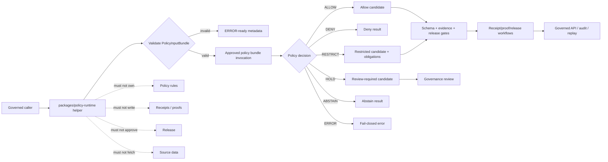

<!-- [KFM_META_BLOCK_V2]
doc_id: kfm://doc/NEEDS-VERIFICATION/packages-policy-runtime-readme
title: Policy Runtime Package README
type: readme
version: v1
status: draft
owners: OWNER_TBD
created: NEEDS VERIFICATION — target file existed before this revision as a short stub
updated: 2026-06-14
policy_label: public
related: [packages/README.md, packages/envelopes/README.md, packages/evidence/README.md, packages/evidence-resolver/README.md, packages/hashing/README.md, packages/identity/README.md, docs/doctrine/directory-rules.md, docs/architecture/contract-schema-policy-split.md, contracts/, schemas/contracts/v1/, policy/, data/receipts/, data/proofs/, release/]
tags: [kfm, packages, policy-runtime, opa, policy-input-bundle, policy-decision, allow, deny, restrict, hold, abstain, sensitivity]
notes: ["README-like package entrypoint for policy runtime helper code.", "This package may contain adapters that run approved policy bundles such as OPA or equivalent against explicit PolicyInputBundle values and return finite PolicyDecision-like results; it must not own policy source rules, schema definitions, contracts, lifecycle data, receipts, proofs, release decisions, API routes, UI surfaces, source data, or AI truth claims.", "Implementation files, package metadata, import namespace, tests, CI workflows, and runtime bindings remain NEEDS VERIFICATION until recursively inspected."]
[/KFM_META_BLOCK_V2] -->

<a id="top"></a>

# Policy Runtime Package

Shared helper-code package for running approved policy bundles against explicit `PolicyInputBundle` values and producing finite, receipt-ready policy decision results.

<p>
  
  
  
  
  
  
</p>

> [!IMPORTANT]
> **Status:** PROPOSED package README  
> **Path:** `packages/policy-runtime/README.md`  
> **Owning responsibility root:** `packages/` — shared reusable implementation libraries  
> **Package purpose:** policy-bundle execution adapters, input normalization helpers, finite decision carriers, and receipt-ready policy evaluation metadata  
> **Policy rule authority:** `policy/`, not this package  
> **Schema authority:** `schemas/contracts/v1/`, not this package  
> **Contract authority:** `contracts/`, not this package  
> **Receipt/proof authority:** `data/receipts/` and `data/proofs/`, not this package  
> **Release authority:** `release/`, not this package  
> **Repo implementation depth:** UNKNOWN for package metadata, import style, source files, tests, CI workflows, policy-engine bindings, emitted receipts, proof packs, release manifests, branch protections, and runtime behavior.

## Scope

`packages/policy-runtime/` is the shared implementation package lane for policy evaluation helper code used by governed APIs, pipelines, validators, map/runtime assemblers, AI adapters, release gates, receipts, proof builders, and tests.

This package may contain deterministic utilities for:

- loading or invoking approved policy bundles supplied by callers or repo-confirmed bundle paths;
- normalizing explicit `PolicyInputBundle` values for evaluation;
- invoking OPA or an equivalent approved engine without making this package the policy-rule authority;
- mapping policy engine output into finite decision results such as `ALLOW`, `DENY`, `RESTRICT`, `HOLD`, `ABSTAIN`, and `ERROR`;
- carrying policy bundle id, policy version, input hash, decision hash, evaluator version, reason codes, obligations, redaction/generalization instructions, and review flags;
- supporting fail-closed behavior for missing policy, invalid input, unsupported bundle, engine error, stale policy, unresolved evidence, missing rights, sensitive exact location, or release mismatch;
- producing receipt-ready metadata without writing receipts;
- synthetic no-network fixtures for allowed, denied, restricted, held, abstained, invalid, and evaluator-error paths.

This package must not author policy rules, define schemas, decide release, store lifecycle data, write receipts or proofs, resolve evidence as truth, fetch source data, expose public routes, render UI, or generate truth claims.

```text
RAW -> WORK / QUARANTINE -> PROCESSED -> CATALOG / TRIPLET -> PUBLISHED
```

Policy runtime helpers may evaluate whether a candidate can proceed through a governed step. They do not own lifecycle state, source authority, evidence authority, receipt state, proof state, review state, release state, or public truth.

[⬆ Back to top](#top)

---

## Repo fit

```text
packages/policy-runtime/
```

This path is appropriate for reusable policy execution helper code because `packages/` is the responsibility root for shared libraries used by apps, workers, pipelines, and tools.

| Relationship | Expected home | Boundary rule |
| --- | --- | --- |
| Policy runtime helper code | `packages/policy-runtime/` | Evaluator adapters, input normalization, finite decision carriers, and receipt metadata only. |
| Policy rules and bundles | `policy/` | Owns policy source, rule meaning, bundle promotion, and policy review. |
| Policy input/output schemas | `schemas/contracts/v1/` | Defines `PolicyInputBundle`, `PolicyDecision`, reason-code, and obligation shapes. |
| Policy contracts | `contracts/` | Defines semantic meaning and obligations. |
| Runtime envelopes | `packages/envelopes/` | Maps decisions into finite runtime/public outcomes. |
| Evidence helpers | `packages/evidence/`, `packages/evidence-resolver/` | Evidence refs and closure validation remain separate. |
| Hash helpers | `packages/hashing/` | Computes input, bundle, decision, and receipt-related hashes. |
| Identity helpers | `packages/identity/` | Handles id grammar and stable object identifiers. |
| Lifecycle data | `data/<phase>/` | Owns RAW/WORK/QUARANTINE/PROCESSED/CATALOG/TRIPLET/PUBLISHED state. |
| Receipts and proofs | `data/receipts/`, `data/proofs/` | Stores PolicyDecision receipts and proof artifacts. |
| Release decisions | `release/` | Owns promotion, publication, correction, supersession, rollback. |
| Public API and UI | `apps/`, `ui/`, `web/`, or repo-confirmed equivalents | May consume policy decisions through governed interfaces; package internals are not public authority. |
| Tests and fixtures | `tests/packages/policy-runtime/`, `fixtures/packages/policy-runtime/`, or repo-confirmed equivalents | Proves deterministic behavior with synthetic no-network fixtures. |

> [!WARNING]
> Do not put policy source rules, OPA bundles as governance artifacts, schemas, contracts, receipts, proofs, lifecycle records, release manifests, or public route handlers in this package. This package executes approved policy inputs; it does not own policy authority.

[⬆ Back to top](#top)

---

## Accepted inputs

Package helpers should accept explicit, inspectable values from governed callers. They should not fetch missing facts from source systems, raw stores, UI state, hidden globals, operator memory, or generated language.

| Input family | Accepted examples | Required handling |
| --- | --- | --- |
| Policy input | `PolicyInputBundle`, audience, operation, object refs, source role, rights posture, sensitivity posture | Validate shape and required context before evaluation. |
| Policy bundle context | bundle id, bundle ref, bundle hash, policy version, evaluator profile | Require explicit approved bundle context; fail closed if missing or stale. |
| Evidence context | EvidenceRef, EvidenceBundle ref, resolver outcome, citation validation ref | Consume evidence status; do not fabricate or resolve claims as truth. |
| Source context | SourceDescriptor ref, source role, rights, cadence, license, limitation flags | Carry refs and policy-relevant attributes; do not fetch source data. |
| Lifecycle context | input phase, output phase, release state, promotion stage, rollback ref | Block public exposure of invalid lifecycle phases. |
| Sensitivity context | living-person, DNA/genomic, archaeology, rare species, infrastructure, precise location, tribal/cultural flags | Prefer deny, restrict, generalize, hold, or abstain when support is unclear. |
| Identity/hash context | object id, spec hash, content hash, bundle hash, input hash, decision hash | Consume from identity/hashing helpers or explicit caller input. |
| Engine context | OPA path, WASM bundle ref, evaluator version, timeout, fail-closed policy | Treat engine error as deny/abstain/error according to contract. |
| Fixture context | synthetic allowed, denied, restricted, held, abstained, invalid, stale, and engine-error examples | Keep fixtures deterministic and public-safe. |

[⬆ Back to top](#top)

---

## Exclusions

| Do not put here | Correct home or owner | Reason |
| --- | --- | --- |
| Policy source rules, Rego files, policy bundles as governance artifacts | `policy/` | Policy authority belongs to policy roots. |
| JSON Schemas | `schemas/contracts/v1/` | Schemas own machine shape. |
| Semantic contracts | `contracts/` | Contracts own meaning and obligations. |
| RAW, WORK, QUARANTINE, PROCESSED, CATALOG, TRIPLET, or PUBLISHED data | `data/<phase>/` | Lifecycle state must remain phase-visible. |
| Source descriptors and source registries | `data/registry/` or repo-confirmed registry homes | Source authority, rights, cadence, and limitations are governance data. |
| Receipts, proof packs, validation reports | `data/receipts/`, `data/proofs/` | Trust artifacts must remain separately auditable. |
| Release manifests, rollback cards, correction notices | `release/` | Publication is a governed state transition. |
| EvidenceBundle storage or closure resolution authority | Evidence/proof/data homes and `packages/evidence-resolver/` | Policy may consume evidence status; it does not own evidence truth. |
| Public API routes or serializers | `apps/` or repo-confirmed API app | Public clients must use governed APIs. |
| UI components, dashboards, controls | `apps/`, `ui/`, `web/`, or observability roots | Presentation is downstream from governed decisions. |
| AI-generated claims or source interpretation | governed AI runtime plus evidence validation | AI output is interpretive and evidence-subordinate. |
| Secrets, source credentials, private source content, or sensitive fixtures | Nowhere in package fixtures | Fixtures must remain synthetic or public-safe. |

[⬆ Back to top](#top)

---

## Policy-runtime responsibilities

| Responsibility | Expected behavior |
| --- | --- |
| Input validation | Check that policy inputs include operation, audience, object refs, lifecycle phase, source role, rights/sensitivity context, and required hashes/refs. |
| Bundle invocation | Execute only explicitly supplied or repo-confirmed approved policy bundles. |
| Finite decisions | Return `ALLOW`, `DENY`, `RESTRICT`, `HOLD`, `ABSTAIN`, or `ERROR` with reason codes. |
| Obligations | Preserve redaction, generalization, delayed release, review-required, citation-required, or rollback-required obligations. |
| Fail-closed behavior | Missing policy, unsupported engine, stale bundle, invalid input, unresolved evidence, rights gap, or sensitive exact location must not become implicit allow. |
| Receipt metadata | Prepare receipt-ready evaluation metadata without storing receipts. |
| Replay support | Carry policy bundle hash, input hash, evaluator version, decision hash, and reason codes for replay. |
| Fixture support | Generate synthetic no-network fixtures for positive and negative policy paths. |

[⬆ Back to top](#top)

---

## Expected package layout

> [!NOTE]
> The tree below is PROPOSED. Confirm package metadata, language conventions, import namespace, test layout, and CI before committing code beyond README files.

```text
packages/policy-runtime/
├── README.md                       # This file: package boundary and trust rules
├── pyproject.toml / package.json    # NEEDS VERIFICATION
├── src/                             # NEEDS VERIFICATION
│   └── policy_runtime/              # PROPOSED namespace; confirm against repo convention
│       ├── README.md                # PROPOSED namespace guide
│       ├── __init__.py              # PROPOSED export boundary
│       ├── inputs.py                # PROPOSED PolicyInputBundle helpers
│       ├── engine.py                # PROPOSED OPA/equivalent invocation adapter
│       ├── decisions.py             # PROPOSED finite decision carriers
│       ├── obligations.py           # PROPOSED obligations/redaction/review helpers
│       ├── reason_codes.py          # PROPOSED stable reason-code helpers
│       ├── receipts.py              # PROPOSED receipt-ready metadata carriers only
│       ├── replay.py                # PROPOSED replay metadata helpers
│       ├── validation.py            # PROPOSED input/output validation helpers
│       ├── fixtures.py              # PROPOSED synthetic fixtures
│       └── py.typed                 # PROPOSED if typed package convention is confirmed
└── CHANGELOG.md                     # OPTIONAL / NEEDS VERIFICATION
```

Potential imports, subject to package verification:

```python
from policy_runtime.inputs import validate_policy_input_bundle
from policy_runtime.engine import evaluate_policy_bundle
from policy_runtime.decisions import PolicyDecisionOutcome
```

[⬆ Back to top](#top)

---

## Policy helper outcomes

| Helper outcome | Use when | Runtime posture |
| --- | --- | --- |
| `ALLOW` | Explicit policy bundle allows the action for the given input and audience. | Candidate only; downstream schema, evidence, release, and receipt gates may still block. |
| `DENY` | Policy blocks the action or sensitive/rights context requires denial. | Deny with stable reason code. |
| `RESTRICT` | Policy permits a transformed, reduced, generalized, redacted, delayed, or audience-limited output. | Apply obligations before any publication or rendering. |
| `HOLD` | Review, steward action, missing receipt/proof, or maturity gate is required. | Internal/governance state; not a public allow. |
| `ABSTAIN` | Required evidence, source, rights, policy support, or input context is missing or unresolved. | Fail safe; do not produce authoritative output. |
| `ERROR` | Input, engine, bundle, schema, timeout, or runtime failure prevents a valid decision. | Fail closed with receipt-ready error metadata. |

`ALLOW` is not proof of truth, evidence closure, release, publication, or public safety. It only means the policy bundle did not block the evaluated action under the supplied context.

[⬆ Back to top](#top)

---

## Trust-boundary flow



[⬆ Back to top](#top)

---

## Development rules

1. Treat this package as a policy execution helper layer, not the policy-rule authority.
2. Prefer pure normalization/validation functions and explicit engine adapters.
3. Preserve policy bundle id, version, bundle hash, input hash, object refs, source refs, evidence refs, audience, operation, lifecycle phase, rights posture, sensitivity posture, reason codes, obligations, release refs, rollback refs, and correction refs supplied by callers.
4. Do not make network calls from this package unless a future ADR explicitly permits a constrained policy-engine call path.
5. Do not read directly from RAW, WORK, QUARANTINE, unpublished candidates, source systems, source credentials, canonical stores, or model runtimes.
6. Do not write lifecycle data, policy source rules, receipts, proofs, release manifests, source registries, catalog records, API responses, or UI components.
7. Do not approve release, publish artifacts, resolve evidence as truth, or generate public claims.
8. Do not create schemas, contracts, policy source rules, source registries, pipeline DAGs, API routes, public answers, release decisions, or connector behavior from this package.
9. Do not store raw provider payloads, secrets, private source records, sensitive-location examples, living-person identifiers, DNA/genomic context, or unrestricted sensitive context.
10. Return typed finite outcomes instead of implicit allow, warning-only denial, silent redaction, or hidden policy failure.
11. Add deterministic tests for every behavior-changing helper and every negative path.
12. Keep fixtures synthetic, sanitized, and public-safe.
13. Preserve rollback and correction metadata supplied by callers when policy output can affect downstream publication candidates.

[⬆ Back to top](#top)

---

## Validation checklist

- [ ] Confirm `packages/policy-runtime/` package metadata and language/runtime convention.
- [ ] Confirm import namespace and whether it is `policy_runtime`, `policyRuntime`, or repo-specific.
- [ ] Confirm owners and CODEOWNERS path coverage.
- [ ] Confirm policy source and bundle homes under `policy/`.
- [ ] Confirm schema homes for `PolicyInputBundle`, `PolicyDecision`, obligations, reason codes, and policy receipts.
- [ ] Confirm relationship with `packages/envelopes/`, `packages/evidence-resolver/`, `packages/hashing/`, `packages/identity/`, and receipt/proof homes.
- [ ] Confirm tests for `ALLOW`, `DENY`, `RESTRICT`, `HOLD`, `ABSTAIN`, and `ERROR` paths.
- [ ] Confirm tests for missing policy, stale bundle, invalid input, unsupported engine, unresolved evidence, missing rights, sensitive exact location, release mismatch, and timeout.
- [ ] Confirm helpers do not access lifecycle stores, source systems, credentials, model runtimes, or unpublished candidate stores.
- [ ] Confirm helpers do not write policy source rules, receipts, proofs, release manifests, catalog records, API responses, credentials, or permissions.

Suggested inspection commands:

```bash
find packages/policy-runtime -maxdepth 5 -type f | sort
git grep -n "PolicyInputBundle\|PolicyDecision\|policy_runtime\|opa\|rego\|ALLOW\|DENY\|RESTRICT\|HOLD\|ABSTAIN" -- packages docs contracts schemas policy tests fixtures pipelines connectors tools apps 2>/dev/null || true
git grep -n "from policy_runtime\|import policy_runtime\|packages/policy-runtime" -- . 2>/dev/null || true
```

[⬆ Back to top](#top)

---

## Rollback

Rollback is required if this package:

- becomes a parallel policy-source, schema, contract, source-registry, lifecycle-data, evidence/proof, receipt, release, API, UI, credential, model-runtime, or source-data authority;
- treats missing policy, invalid input, stale bundle, unresolved evidence, sensitive exact location, or rights gaps as implicit allow;
- writes policy rules, lifecycle data, receipts, proofs, release manifests, catalog records, API responses, or public UI state;
- fetches source data or directly reads RAW/WORK/QUARANTINE/unpublished candidates/source systems;
- treats policy allow as proof of truth, evidence closure, admissibility, public safety, or release;
- stores secrets, source credentials, private source records, living-person identifiers, DNA/genomic context, or sensitive-location examples in fixtures.

Rollback target: revert the package README or policy-runtime source PR, preserve audit notes, and file any authority drift in `docs/registers/DRIFT_REGISTER.md` or the repo-confirmed drift register.

[⬆ Back to top](#top)

---

## Evidence boundary

| Source | Status | Supports | Limits |
| --- | --- | --- | --- |
| Current target file | CONFIRMED | `packages/policy-runtime/README.md` existed as a short stub naming OPA/equivalent policy-bundle execution against `PolicyInputBundle`. | Stub did not prove package implementation maturity. |
| `packages/README.md` | CONFIRMED repo doc | `packages/` is for shared libraries used by apps, workers, pipelines, and tools. | Does not define policy-runtime package behavior. |
| `docs/doctrine/directory-rules.md` | CONFIRMED repo doctrine | `packages/`, `policy/`, `schemas`, `contracts`, lifecycle data, receipt/proof, and release homes are separate responsibility roots. | Does not prove this package is implemented. |
| Current file-generation pass | CONFIRMED request | User-requested target path and README expansion. | Does not inspect package metadata, tests, CI logs, dashboards, deployment posture, runtime behavior, policy bundle promotion, or branch protection. |

[⬆ Back to top](#top)
