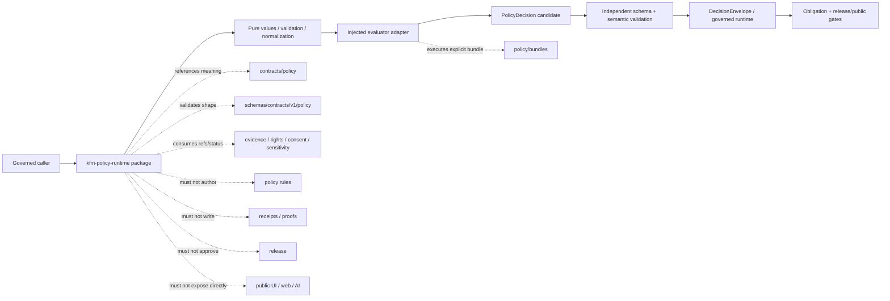

<!-- [KFM_META_BLOCK_V2]
doc_id: kfm://doc/packages-policy-runtime-readme
title: packages/policy-runtime/ — Package Boundary and Greenfield Policy-Evaluation Scaffold
type: readme
version: v1.1
status: draft
owners: OWNER_TBD — Policy steward · Policy-runtime steward · Contracts steward · Schema steward · Evidence steward · Rights/consent/sensitivity steward · Security steward · Validation steward · Runtime/API steward · Release steward · CI steward · Docs steward
created: NEEDS VERIFICATION — target existed before this evidence-grounded revision
updated: 2026-07-15
policy_label: "public-doctrine; package-boundary; python-package-scaffold; greenfield-placeholder; build-unconfigured; evaluator-unbound; bundle-selection-unratified; api-unratified; consumers-unverified; tests-unestablished; explicit-inputs; no-hidden-fetches; no-network-by-default; deterministic-core-candidate; fail-closed; policy-authority-external; evidence-subordinate; rights-aware; sensitivity-aware; release-subordinate; no-truth-authority; no-publication-authority; migration-required; rollback-aware"
current_path: packages/policy-runtime/README.md
truth_posture: >
  CONFIRMED target README v1, package metadata name kfm-policy-runtime and version 0.0.0,
  merged source-envelope README v1.1, merged policy_runtime namespace README v1.1, empty
  policy_runtime/__init__.py, comment-only policy_runtime/core.py greenfield placeholder,
  packages responsibility-root doctrine, PolicyInputBundle semantic contract and permissive
  PROPOSED schema requiring only id, PolicyDecision semantic contract and concrete PROPOSED
  schema using ANSWER|ABSTAIN|DENY|ERROR, DecisionEnvelope with the same primary outcome
  vocabulary, minimal PolicyDecision fixtures, absent dedicated validator files, README-only
  policy-bundle lane, TODO-only policy-test workflow, and bounded absence of functional package
  modules, exports, consumers, package tests, evaluator binding, receipt persistence, deployment,
  or runtime health / PROPOSED a small reusable Python package boundary for explicit policy-input
  validation, injected evaluator protocols, versioned native-result normalization, PolicyDecision
  candidate assembly, obligation/reason preservation, replay/freshness checks, synthetic test
  builders, staged adoption, compatibility, correction, deprecation, and rollback / CONFLICTED
  prior package README claims that imply implemented helpers, approved-bundle invocation, and
  usable imports; lower-level ALLOW|RESTRICT|HOLD vocabulary versus canonical
  ANSWER|ABSTAIN|DENY|ERROR; rich PolicyInputBundle semantics versus minimal schema;
  schema-declared validators versus absent files; bundle/evaluator intent versus no activation
  binding / UNKNOWN accepted API, build backend, Python support, discovery, dependencies,
  evaluator mode, bundle format, active selection, consumers, CI enforcement, deployment,
  release use, receipts/proofs, and health / NEEDS VERIFICATION owners, metadata completion,
  evaluator ADR, activation contract, schema strengthening, normalization mapping, source
  modules, tests, first consumer, security review, correction, deprecation, and rollback automation
evidence_snapshot:
  repository: bartytime4life/Kansas-Frontier-Matrix
  repository_id: "1059091169"
  visibility: public
  base_ref: main
  base_commit: d1a3d4ff7bdaa6ac79bbdb5b7495f5d2cbbf977e
  prior_blob: e70246ec4770399b41b6c07e3f97a4c66e17503d
  source_readme_blob: 8f4cfa63c94961fbc75f3888d3a8cdfcbee46feb
  namespace_readme_blob: f5b89067c4a88ed756626f03ac8254c10089c358
  package_metadata_blob: ebb6725ad9a00d77df06f779a603814027abe084
  namespace_init_blob: e69de29bb2d1d6434b8b29ae775ad8c2e48c5391
  namespace_core_blob: e7e14cf39ae6919fbbc80f1b471de6b907292edb
  root_pyproject_blob: e3bd40e8e6ce14dfcde78ff5c09608095c3eca76
  directory_rules_blob: 2affb080e6f0043867c64c7f06c1ca52030fbd55
  policy_input_contract_blob: 545c352681dd0db0cd4d169a5d2f9c364356457c
  policy_input_schema_blob: b89db4b1730c61258441e0eed037276b910b1990
  policy_decision_contract_blob: ebfe97f98263e6309db6d2772cb2c5e548819650
  policy_decision_schema_blob: 1472d26a42c73f17545b4464a275412ffa1d098e
  decision_envelope_contract_blob: b5120a208910f5e2907874b03af1fc8c7f43363d
  policy_decision_fixtures_blob: 0169614d568cfc32bc7fb257fb42f1e6b792bae3
  validator_index_blob: 56ef4bd527ddfc8d726662092ca589ab2340b401
  policy_bundles_readme_blob: 77f59c399fbce668c916cbbc385009121d6169f4
  policy_test_workflow_blob: 2bba88bb018600f54995d06b03cac02145b96fe7
  merged_namespace_pr: 1239
  merged_namespace_commit: faa68703a9b249f8f817a3214a7675acabb13e32
  merged_source_pr: 1243
  merged_source_commit: f13e14dc90dbc21d30cad35c5fb8ecb9f6d9dd8d
  bounded_path_checks:
    - packages/policy-runtime/README.md existed at version v1 before this revision
    - packages/policy-runtime/pyproject.toml declares kfm-policy-runtime version 0.0.0 only
    - package pyproject contains no build-system, Python requirement, description, license, authors, dependencies, optional dependencies, scripts, entry points, package-discovery configuration, or tool configuration
    - packages/policy-runtime/src/README.md exists at version v1.1 on main
    - packages/policy-runtime/src/policy_runtime/README.md exists at version v1.1 on main
    - packages/policy-runtime/src/policy_runtime/__init__.py is empty
    - packages/policy-runtime/src/policy_runtime/core.py is a comment-only greenfield placeholder
    - bounded search found no functional policy_runtime consumer import or package pytest reference
    - dedicated PolicyInputBundle and PolicyDecision validators were not found at schema-declared paths
    - policy/bundles is README-only in bounded evidence with no accepted bundle, selector, or evaluator binding
    - PolicyInputBundle schema is PROPOSED, requires only id, and allows additional properties
    - PolicyDecision schema is PROPOSED and uses ANSWER|ABSTAIN|DENY|ERROR
    - PolicyDecision fixtures document one valid and one missing-decision-id invalid example
    - policy-test workflow contains echo-only TODO steps
related:
  - ../README.md
  - pyproject.toml
  - src/README.md
  - src/policy_runtime/README.md
  - src/policy_runtime/__init__.py
  - src/policy_runtime/core.py
  - ../../pyproject.toml
  - ../../docs/doctrine/directory-rules.md
  - ../../docs/architecture/contract-schema-policy-split.md
  - ../../docs/doctrine/trust-membrane.md
  - ../../contracts/policy/policy_input_bundle.md
  - ../../contracts/policy/policy_decision.md
  - ../../contracts/runtime/decision_envelope.md
  - ../../schemas/contracts/v1/policy/policy_input_bundle.schema.json
  - ../../schemas/contracts/v1/policy/policy_decision.schema.json
  - ../../policy/README.md
  - ../../policy/bundles/README.md
  - ../../tools/validators/policy/README.md
  - ../../fixtures/contracts/v1/policy/policy_decision/README.md
  - ../../tests/schemas/test_common_contracts.py
  - ../../.github/workflows/policy-test.yml
tags: [kfm, packages, policy-runtime, python, package, scaffold, policy-evaluation, PolicyInputBundle, PolicyDecision, DecisionEnvelope, finite-outcomes, obligations, reason-codes, bundles, opa, fail-closed, evidence, rights, consent, sensitivity, validation, compatibility, migration, rollback]
notes:
  - "This revision changes only packages/policy-runtime/README.md."
  - "The package currently contains this README, a minimal pyproject.toml, and a source tree whose only Python implementation files are an empty __init__.py and a comment-only core.py."
  - "This README does not make the package installable, define an accepted API, approve an evaluator, activate a policy bundle, establish consumers, run policy, write receipts, accept an ADR, or prove CI/runtime behavior."
  - "Prior proposed module names, imports, helper outcomes, and broad consumer claims are retained only as superseded documentation lineage; they are not implementation facts or compatibility commitments."
[/KFM_META_BLOCK_V2] -->

<a id="top"></a>

# Policy Runtime Package Boundary and Greenfield Policy-Evaluation Scaffold

`packages/policy-runtime/`

> Package-level governance and implementation boundary for a future reusable Python policy-evaluation library. Current evidence establishes a `0.0.0` metadata stub, two evidence-grounded child READMEs, an empty package initializer, and a comment-only `core.py` placeholder—not an installable distribution, functional policy evaluator, OPA adapter, accepted API, active policy bundle, receipt writer, policy authority, evidence authority, or release component.


**Quick links:** [Purpose](#purpose) · [Impact](#impact-and-operating-posture) · [Evidence](#status-and-evidence) · [Placement](#directory-rules-and-authority) · [Inventory](#confirmed-package-inventory) · [Packaging](#packaging-build-import-and-api-status) · [Layers](#package-source-and-namespace-layers) · [Contracts](#contract-schema-and-policy-boundaries) · [Outcomes](#outcome-vocabularies-and-normalization) · [Bundles](#policy-bundle-and-evaluator-boundary) · [Inputs](#policyinputbundle-boundary) · [Decisions](#policydecision-candidate-boundary) · [Dependencies](#dependency-direction) · [Lifecycle](#lifecycle-and-trust-membrane) · [Effects](#inputs-outputs-and-side-effects) · [Reliability](#determinism-identity-replay-and-freshness) · [Security](#security-rights-consent-sensitivity-and-privacy) · [Consumers](#consumer-versioning-and-compatibility-boundary) · [Testing](#testing-fixtures-and-ci) · [Implementation](#smallest-sound-implementation-sequence) · [Done](#definition-of-done) · [Open](#verification-register) · [Drift](#drift-and-conflicts) · [Rollback](#rollback-correction-and-deprecation)

> [!IMPORTANT]
> **This README is not implementation evidence for a policy runtime.** It does not establish installation, import success, exports, OPA availability, bundle activation, evaluator integrity, policy execution, consumer adoption, receipt persistence, tests, CI enforcement, deployment, or operational health.

> [!CAUTION]
> **Policy evaluation is not truth or publication.** A policy result cannot create evidence, cure unresolved rights, infer consent, downgrade sensitivity, satisfy review, promote lifecycle state, authorize release, or make generated language authoritative.

---

<a id="purpose"></a>

## Purpose

This README defines the package-level responsibility, packaging, trust, compatibility, validation, correction, and rollback boundary for:

```text
packages/policy-runtime/
```

The package is intended to become a **small reusable library** of explicit-input, fail-closed policy-evaluation mechanics shared by more than one governed API, pipeline, worker, validator, release gate, map/runtime component, or maintenance tool.

The current repository state is narrower:

- `pyproject.toml` declares only `kfm-policy-runtime` version `0.0.0`;
- the package manifest does not define a build backend, Python requirement, package discovery, dependencies, scripts, entry points, or test configuration;
- `src/README.md` and `src/policy_runtime/README.md` are evidence-grounded v1.1 boundary documents;
- `src/policy_runtime/__init__.py` is empty;
- `src/policy_runtime/core.py` is a comment-only greenfield placeholder;
- no functional package module, export, consumer import, package test lane, evaluator binding, active policy bundle, or deployment is established;
- dedicated validator paths named by policy schemas were not found;
- the policy-test workflow contains echo-only TODO steps.

This README therefore has three jobs:

1. record the **CONFIRMED placeholder state** without turning design intent into implementation fact;
2. define a **PROPOSED reusable package boundary** for future policy-evaluation mechanics; and
3. make the packaging, contract, schema, policy, evidence, rights, consent, sensitivity, validation, compatibility, correction, and rollback burden explicit before adoption.

[Back to top](#top)

---

<a id="impact-and-operating-posture"></a>

## Impact and operating posture

| Surface | Current status | Package effect | Required posture |
|---|---:|---|---|
| Repository placement | **CONFIRMED** | Package exists under `packages/`. | Preserve shared-library responsibility. |
| Distribution metadata | **CONFIRMED placeholder** | Name and version exist. | Do not claim installability. |
| Source envelope | **CONFIRMED placeholder** | `src/` and one namespace exist. | Keep admission narrow and evidence-backed. |
| Functional behavior | **NOT ESTABLISHED** | No evaluator or helper behavior is implemented. | Treat examples as proposed only. |
| Public API | **NOT ESTABLISHED** | No exports or compatibility promise exists. | No consumer may rely on README-only imports. |
| PolicyInputBundle validation | **NOT ESTABLISHED** | Rich semantics are not machine-enforced. | Separate schema validity from semantic readiness. |
| PolicyDecision construction | **NOT ESTABLISHED** | Contract/schema exist separately. | Candidate-only design; no persistence authority. |
| Bundle activation | **NOT ESTABLISHED** | No accepted bundle instance or selector is proved. | File presence must never activate policy. |
| Evaluator integration | **NOT ESTABLISHED** | OPA/equivalent is mentioned but unbound. | Require explicit reviewed adapter and limits. |
| Consumers | **NOT FOUND by bounded search** | No migration burden is currently proved. | Re-run search before API changes. |
| Package tests | **NOT FOUND at checked paths** | No behavior is proved. | Add tests before first export. |
| Package-specific CI | **NOT ESTABLISHED** | Policy workflow is TODO-only. | Replace stubs before enforcement claims. |
| Truth/publication authority | **NONE** | Package cannot publish or approve claims. | Preserve trust membrane. |

### Documentation-only effect

This revision:

- aligns the package entrypoint with the merged source and namespace v1.1 documents;
- records actual package metadata and inventory;
- distinguishes the distribution boundary from the import namespace;
- makes the lower-level versus canonical outcome-vocabulary conflict explicit;
- defines future package admission, test, compatibility, correction, and rollback gates;
- does not change source code, package installation, dependencies, policy rules, schemas, contracts, validators, fixtures, workflows, receipts, release state, or runtime behavior.

[Back to top](#top)

---

<a id="status-and-evidence"></a>

## Status and evidence

### Evidence verdict

| Surface | Status | Safe conclusion |
|---|---:|---|
| Target README | **CONFIRMED v1 before revision** | Package documentation existed but over-described implementation. |
| Package manifest | **CONFIRMED placeholder** | Distribution name is `kfm-policy-runtime`; version is `0.0.0`. |
| Build backend | **NOT DECLARED** | The subpackage is not proved buildable. |
| Python requirement | **NOT DECLARED** | Root Python support does not automatically establish subpackage policy. |
| Package discovery | **NOT DECLARED** | `src/policy_runtime` is not mapped to an installable artifact. |
| Dependencies | **NOT DECLARED** | No evaluator/runtime dependency is approved here. |
| Source README | **CONFIRMED v1.1** | Source-envelope boundary is merged. |
| Namespace README | **CONFIRMED v1.1** | Namespace boundary is merged. |
| `__init__.py` | **CONFIRMED empty** | No exports. |
| `core.py` | **CONFIRMED comment-only** | No behavior. |
| Functional modules | **NOT FOUND by bounded checks** | Prior module names are not implementation facts. |
| Consumers/tests | **NOT FOUND by bounded search** | No adoption or behavior is proved. |
| PolicyInputBundle contract | **CONFIRMED draft/PROPOSED** | Rich semantic context is documented. |
| PolicyInputBundle schema | **CONFIRMED permissive PROPOSED stub** | Requires only `id`; allows extras. |
| PolicyDecision contract/schema | **CONFIRMED draft/PROPOSED** | Six required fields and closed outcome/family enums. |
| DecisionEnvelope contract | **CONFIRMED draft/PROPOSED** | Runtime transport uses the canonical finite outcome vocabulary. |
| PolicyDecision fixtures | **CONFIRMED minimal family** | One valid and one missing-id invalid fixture. |
| Dedicated validators | **NOT FOUND at declared paths** | No dedicated validation implementation is proved. |
| Policy bundles | **README-only by bounded evidence** | No accepted instance, selector, evaluator binding, or deployment. |
| Policy CI | **TODO-only** | Workflow success does not prove policy behavior. |
| Operational health | **UNKNOWN** | No runtime evaluator is proved. |

### Corrections from v1

| Prior implication | Current evidence | Correction |
|---|---|---|
| Package is an implemented shared helper library | Source contains empty/comment placeholders | Reclassify as greenfield scaffold. |
| Package metadata/import layout were unknown | Minimal metadata and source layout were inspected | Record exact state and missing build configuration. |
| Named modules and imports are usable | Named modules are absent | Keep only as superseded design lineage. |
| Approved bundles can be invoked | No accepted bundle or activation binding is proved | File presence is not activation. |
| Rich PolicyInputBundle values are validated | Schema requires only `id` | Separate shape validation from semantic profiles. |
| `ALLOW|RESTRICT|HOLD` are canonical package outcomes | PolicyDecision/DecisionEnvelope use `ANSWER|ABSTAIN|DENY|ERROR` | Require versioned normalization. |
| Dedicated validators exist | Declared scripts were not found | Do not claim validator execution. |
| Policy CI verifies behavior | Jobs echo TODO | Replace stubs before enforcement claims. |
| Broad consumers use the package | No functional import was found | Start with one evidence-backed consumer. |

[Back to top](#top)

---

<a id="directory-rules-and-authority"></a>

## Directory Rules and authority

`packages/` is the responsibility root for reusable shared libraries. A package must be reusable; one-off workflow behavior belongs in `tools/` or `pipelines/`.

The name “policy runtime” does not grant policy authority. Directory selection is by responsibility:

| Responsibility | Governing home | Package relationship |
|---|---|---|
| Distribution metadata | `packages/policy-runtime/pyproject.toml` | Package-level ownership; incomplete. |
| Source placement | `packages/policy-runtime/src/` | Source envelope; placeholder. |
| Python namespace | `packages/policy-runtime/src/policy_runtime/` | Candidate import namespace; API unratified. |
| Policy rules | `policy/` | Authoritative executable policy source. |
| Bundle packaging/manifest | `policy/bundles/` | Governed policy artifact boundary; activation unproved. |
| Input/decision semantics | `contracts/policy/` | Meaning authority. |
| Input/decision shape | `schemas/contracts/v1/policy/` | Machine-shape authority. |
| Runtime transport | runtime contracts/envelopes | Downstream transport; not policy execution. |
| Evidence | evidence contracts/packages/stores | Package consumes refs/status only. |
| Rights/consent/sensitivity | governing registries/contracts/policy | Package cannot discover or downgrade. |
| Lifecycle data | `data/<phase>/` | Package cannot read/write as authority. |
| Receipts/proofs | `data/receipts/`, `data/proofs/` | Candidate metadata only until owning workflow persists. |
| Review/release | governance and `release/` | Package cannot approve or publish. |
| Public clients | governed application/runtime interfaces | Package internals are not public authority. |

### Package authority statement

This package may eventually implement **evaluation mechanics**. It may not decide that:

- policy source is accepted merely because a file exists;
- a bundle is active because it is newest or parseable;
- missing evidence is sufficient;
- rights or consent permit release;
- sensitivity can be downgraded;
- a candidate is promoted;
- a release is published;
- a public answer is true;
- a correction or rollback is closed.

### No parallel authority

Do not create package-local substitutes for:

- PolicyInputBundle or PolicyDecision contracts;
- policy schemas;
- policy rule source;
- policy bundle manifests;
- reason-code or obligation registries;
- evidence bundles;
- consent or sensitivity records;
- release manifests;
- DecisionEnvelope or RuntimeResponseEnvelope contracts;
- receipt/proof stores.

Adapters and typed projections may exist only when they preserve upstream semantics, identify the exact authority/version, and avoid becoming a second canonical definition.

[Back to top](#top)

---

<a id="confirmed-package-inventory"></a>

## Confirmed package inventory

```text
packages/policy-runtime/
├── README.md
├── pyproject.toml
└── src/
    ├── README.md
    └── policy_runtime/
        ├── README.md
        ├── __init__.py
        └── core.py
```

| Path | Status | Current meaning |
|---|---:|---|
| `README.md` | **CONFIRMED** | Package boundary; revised here. |
| `pyproject.toml` | **CONFIRMED placeholder** | Declares name/version only. |
| `src/README.md` | **CONFIRMED v1.1** | Source-envelope boundary. |
| `src/policy_runtime/README.md` | **CONFIRMED v1.1** | Namespace boundary. |
| `src/policy_runtime/__init__.py` | **CONFIRMED empty** | Marker only; no exports. |
| `src/policy_runtime/core.py` | **CONFIRMED comment-only** | Greenfield placeholder. |

Not established:

- build backend;
- Python support declaration;
- package discovery;
- dependencies or optional dependencies;
- license/author metadata;
- scripts or entry points;
- typed marker;
- public API module;
- evaluator adapter;
- bundle selector or activation client;
- input/decision value models;
- normalization implementation;
- package tests or fixtures;
- package CI;
- artifact publication;
- consumer imports;
- runtime health.

### Superseded design lineage

Earlier docs named candidate modules such as:

```text
inputs.py
engine.py
decisions.py
obligations.py
reason_codes.py
receipts.py
replay.py
validation.py
fixtures.py
py.typed
```

Those names are not current implementation, approved architecture, reserved API, or compatibility commitments. Future source names should follow accepted contracts and the smallest first-consumer need.

[Back to top](#top)

---

<a id="packaging-build-import-and-api-status"></a>

## Packaging, build, import, and API status

### Confirmed metadata

```toml
[project]
name = "kfm-policy-runtime"
version = "0.0.0"
```

This proves only that a project table was started.

### Missing metadata and behavior

| Field or capability | Current status | Why it matters |
|---|---:|---|
| `[build-system]` | **Absent** | No approved build backend. |
| `requires-python` | **Absent** | Supported interpreter versions are not a package contract. |
| `description`, `readme`, `license` | **Absent** | Distribution identity and rights are incomplete. |
| authors/maintainers | **Absent** | Stewardship is not encoded. |
| dependencies | **Absent** | OPA client, WASM runtime, schema, or serialization dependencies are unapproved. |
| optional dependencies | **Absent** | Test/dev tooling is unconfigured. |
| package discovery | **Absent** | Namespace is not mapped into a build artifact. |
| scripts/entry points | **Absent** | No executable interface is defined. |
| type support | **Absent** | No typing compatibility promise. |
| version policy | **Absent** | Compatibility semantics are undefined. |
| tests/tool config | **Absent** | No package-scoped behavior is configured. |

The root project’s Hatchling configuration packages `src/kfm`; it does not prove that `packages/policy-runtime/src/policy_runtime` is built, installed, or supported.

### Distribution versus import name

Confirmed distribution name:

```text
kfm-policy-runtime
```

Repository-present namespace candidate:

```text
policy_runtime
```

Their relationship is conventional but not configured or tested.

Before treating the package as installable:

1. accept a build backend and Python support range;
2. configure `src/` package discovery;
3. declare dependencies and rights;
4. build and inspect the artifact;
5. install into a clean environment;
6. import the intended namespace;
7. verify metadata and dependency closure;
8. prove import has no network, policy selection, evaluator startup, secret reads, or writes.

### Public API status

**No public package API is established.**

- `__init__.py` exports nothing;
- `core.py` implements nothing;
- no symbols are accepted;
- no compatibility policy exists;
- no tests assert behavior;
- no consumer establishes a de facto interface.

Until an API is accepted, internal paths are unstable and README import examples are non-binding.

[Back to top](#top)

---

<a id="package-source-and-namespace-layers"></a>

## Package, source, and namespace layers

### Package layer

`packages/policy-runtime/` owns:

- distribution metadata;
- build/discovery configuration;
- package versioning;
- dependency and supply-chain policy;
- source/test layout;
- package-wide compatibility and deprecation policy;
- package-specific CI expectations;
- artifact publication policy, if ever approved.

### Source-envelope layer

`packages/policy-runtime/src/` owns:

- source admission;
- dependency direction;
- pure/effectful separation;
- no-network and no-hidden-fetch defaults;
- no-authority boundaries;
- source-level test requirements;
- staged implementation order.

### Namespace layer

`packages/policy-runtime/src/policy_runtime/` may eventually own:

- implementation modules;
- package initializer and exports;
- typed inputs/results;
- injected evaluator protocols;
- normalization functions;
- candidate builders;
- local validation;
- namespace-specific tests and API docs.

### Evidence required for common claims

| Claim | Required evidence |
|---|---|
| File exists | Repository path inspection. |
| Symbol exists | Source inspection. |
| Symbol is exported | `__init__.py`/API module plus import test. |
| Package installs | Build/discovery plus clean install. |
| Package supports Python X | Metadata plus CI matrix. |
| Evaluator is available | Dependency/config/runtime test. |
| Bundle is active | Governed activation binding and receipt/config evidence. |
| Package returns PolicyDecision | Source plus contract/schema tests. |
| PolicyDecision is persisted | Owning workflow evidence. |
| Public operation is allowed | Policy, evidence, rights, sensitivity, obligations, and release gates. |

[Back to top](#top)

---

<a id="contract-schema-and-policy-boundaries"></a>

## Contract, schema, and policy boundaries

| Surface | Owns | Package duty |
|---|---|---|
| Semantic contract | Meaning and obligations | Implement without redefining. |
| JSON Schema | Machine shape | Validate exact accepted version. |
| Policy source | Executable admissibility | Execute only through explicit approved binding. |
| Bundle manifest | Immutable composition and identity | Verify supplied id/version/digest/profile. |
| Package | Mechanical normalization/evaluation adapters | Remain subordinate. |
| Validator | Independent conformance checks | Produce inspectable results. |
| Receipt/proof | Audit and integrity | Preserve refs/candidates; do not self-authorize. |
| Release | Publication decision | Never bypass. |

### PolicyInputBundle maturity

The semantic contract describes operation, audience, object refs, evidence, source roles, rights, consent, sensitivity, lifecycle, release, review, and evaluator context.

The paired proposed schema currently:

- requires only `id`;
- permits optional string `spec_hash`;
- permits optional string `version`;
- allows additional properties.

A schema-valid PolicyInputBundle may therefore be semantically unusable. Package code must not invent missing context.

### PolicyDecision maturity

The paired proposed schema requires:

```text
decision_id
outcome
policy_family
reasons
obligations
evaluated_at
```

It disallows additional properties.

Outcomes:

```text
ANSWER | ABSTAIN | DENY | ERROR
```

Policy families:

```text
promotion | access | render | capability | consent | sensitivity
```

### Safe flow

```text
PolicyInputBundle
  -> explicit approved bundle + evaluator
  -> engine-native result
  -> versioned normalization
  -> PolicyDecision candidate
  -> schema + semantic validation
  -> DecisionEnvelope / RuntimeResponseEnvelope
  -> obligation enforcement
  -> release/public gate
```

Passing a schema is not proof that the correct policy ran. An `ANSWER` decision is not release approval or evidence truth.

[Back to top](#top)

---

<a id="outcome-vocabularies-and-normalization"></a>

## Outcome vocabularies and normalization

Earlier package documentation presented:

```text
ALLOW | DENY | RESTRICT | HOLD | ABSTAIN | ERROR
```

The canonical proposed PolicyDecision and primary DecisionEnvelope surfaces use:

```text
ANSWER | ABSTAIN | DENY | ERROR
```

These vocabularies are not interchangeable.

| Layer | Values | Status |
|---|---|---:|
| Engine-native/bundle-local | Evaluator-specific; prior docs name ALLOW/DENY/RESTRICT/HOLD/ABSTAIN/ERROR | **UNRATIFIED** |
| PolicyDecision | ANSWER/ABSTAIN/DENY/ERROR | **SCHEMA-CONFIRMED PROPOSED** |
| DecisionEnvelope | ANSWER/ABSTAIN/DENY/ERROR | **CONTRACT/SCHEMA-CONFIRMED PROPOSED** |
| Validator result | PASS/FAIL/DENY/RESTRICT/HOLD/ABSTAIN plus reason codes | **DOCUMENTED; IMPLEMENTATION UNPROVED** |
| Release state | Separate release vocabulary | **NEEDS VERIFICATION** |

A normalization adapter must specify:

- source and target versions;
- policy family and operation;
- treatment of restrictions and holds;
- obligation preservation;
- reason mapping;
- missing-context behavior;
- stale-bundle behavior;
- evaluator errors and timeouts;
- unsupported output behavior;
- deterministic ordering.

Illustrative questions—not accepted mappings:

| Native result | Possible canonical treatment | Required decision |
|---|---|---|
| `ALLOW` | `ANSWER` candidate | Confirm context and downstream gates. |
| `RESTRICT` | `ANSWER` with mandatory obligations, or a negative result | Define by policy family and surface. |
| `HOLD` | Internal review state, `ABSTAIN`, or `DENY` | Ratify explicitly. |
| `ABSTAIN` | `ABSTAIN` | Preserve missing support. |
| `DENY` | `DENY` | Preserve safe reason. |
| `ERROR` | `ERROR` | Never silently convert. |

Restrictions and obligations must not disappear during normalization. `ABSTAIN`, `DENY`, and `ERROR` remain distinct.

[Back to top](#top)

---

<a id="policy-bundle-and-evaluator-boundary"></a>

## Policy bundle and evaluator boundary

Current bounded evidence establishes no accepted:

- bundle instance;
- manifest instance;
- bundle registry;
- immutable selector;
- evaluator binding;
- active deployment;
- runtime receipt path.

### File presence is not activation

None of these may activate policy:

- directory presence;
- newest filename;
- mutable “latest” alias;
- symlink;
- environment fallback;
- successful parse;
- schema pass;
- OPA-compatible layout;
- matching digest without accepted manifest and activation record.

A future explicit binding should identify:

- bundle id/version/digest;
- manifest reference;
- policy family;
- evaluator profile/version;
- input/output contract versions;
- normalization version;
- timeout/resource posture;
- activation record;
- supersession/withdrawal state;
- rollback target.

### Evaluator requirements

A future evaluator adapter should provide:

- explicit immutable bundle input;
- digest/manifest verification;
- no mutable path discovery;
- timeout and resource limits;
- structured native result and diagnostics;
- evaluator version preservation;
- no hidden network calls;
- no arbitrary environment secret reads;
- no sensitive input logging;
- fail-closed handling for unsupported output;
- deterministic mock mode for tests;
- replay metadata.

OPA is mentioned in repository docs, but no subprocess, server, or WASM binding is accepted. Mode, version pinning, query contract, serialization, limits, network boundary, error mapping, supply chain, and ownership require review before implementation.

Public clients, UI state, query parameters, and AI prompts must not select the bundle, evaluator, policy version, or fail-open mode.

[Back to top](#top)

---

<a id="policyinputbundle-boundary"></a>

## PolicyInputBundle boundary

A PolicyInputBundle is explicit input—not:

- a PolicyDecision;
- evidence;
- source authority;
- rights or consent approval;
- sensitivity authority;
- release approval;
- runtime response;
- AI authority.

### Schema versus semantic readiness

The current schema confirms only:

- required `id`;
- optional string `spec_hash`;
- optional string `version`;
- additional properties allowed.

A future semantic profile may require operation, audience, object/domain refs, lifecycle/release state, evidence refs/resolver state, source roles, rights/consent, sensitivity, geometry precision, review refs, correction/rollback context, bundle/evaluator context, prior decisions, and freshness.

### No-hidden-fetch invariant

Do not fill missing fields from:

- source systems;
- RAW/WORK/QUARANTINE stores;
- implicit registries;
- current release or bundle;
- UI/browser state;
- operator memory;
- vector search;
- AI prompts or model output;
- mutable environment defaults.

Unknown context must remain explicit and fail closed under accepted policy rules.

After evaluation begins, the input should be immutable. Changes require a new id/version/hash. Sensitive values should be minimized, generalized, redacted, or referenced.

[Back to top](#top)

---

<a id="policydecision-candidate-boundary"></a>

## PolicyDecision candidate boundary

A future helper may assemble a **PolicyDecision candidate**. It must not persist authority, claim release approval, claim evidence closure, authorize public rendering, or mutate prior decisions.

Candidate rules:

1. accept every required field explicitly;
2. validate exact enums, id pattern, and date-time;
3. receive time from caller or injected clock;
4. preserve deterministic reason/obligation ordering or define order semantics;
5. reject unsupported extra fields;
6. avoid sensitive diagnostics;
7. return validation separately;
8. support schema validation before persistence;
9. preserve lineage in adjacent metadata when the closed schema has no field;
10. never equate construction with policy success.

`decision_id` must match:

```text
^[a-z][a-z0-9_:.-]*$
```

It must not contain credentials, raw prompts, protected locations, private identifiers, or mutable “latest” state.

A later decision supersedes through explicit lineage, not mutation.

### Reasons and obligations

Reasons should be:

- stable;
- policy-family scoped;
- audience-safe;
- separable into public/internal detail;
- free of raw sensitive facts;
- sufficient to distinguish missing support, denial, and process error.

Obligations are mandatory duties. Examples in current contracts include citations, coordinate redaction, geometry generalization, exact-location withholding, steward review, delayed publication, rights notices, export blocks, and rollback checks.

Unknown or unsupported obligations must block progress rather than be ignored.

[Back to top](#top)

---

<a id="dependency-direction"></a>

## Dependency direction



### Dependency rules

- Prefer the standard library by default.
- Add third-party dependencies only with necessity, version, license, vulnerability, reproducibility, and rollback review.
- Avoid import-time effects.
- Keep core value/validation/normalization functions pure.
- Isolate evaluator adapters behind injected protocols.
- Do not import executable policy source as mutable Python state.
- Do not import application, connector, release, UI, or public-runtime modules into core package code.
- Delegate repository-standard identity and hashing rather than inventing competing rules.
- Avoid package cycles.

Prohibited cycles include:

```text
policy-runtime -> governed-api -> policy-runtime
policy-runtime -> release -> policy-runtime
policy-runtime -> policy editor/selector -> policy-runtime
policy-runtime -> connector/source fetch -> policy-runtime
```

[Back to top](#top)

---

<a id="lifecycle-and-trust-membrane"></a>

## Lifecycle and trust membrane

```text
RAW -> WORK / QUARANTINE -> PROCESSED -> CATALOG / TRIPLET -> PUBLISHED
```

The package may evaluate explicit context at a gate. It does not own lifecycle reads, writes, promotion, release, correction, or rollback.

| Unsafe collapse | Required behavior |
|---|---|
| RAW ref -> public answer | Fail closed under accepted mapping. |
| WORK candidate -> published object | Require validation, evidence, policy, review, and release. |
| QUARANTINE -> normal response | Preserve quarantine and block exposure. |
| Schema-valid input -> policy-ready | Run semantic-profile validation. |
| Policy `ANSWER` -> release approved | Require obligations and release gates. |
| Evaluator success -> evidence truth | Preserve evidence separation. |
| Bundle digest -> active policy | Require activation binding. |
| Receipt candidate -> persisted receipt | Require owning workflow. |
| Merge -> KFM PUBLISHED | Preserve governed release state. |

When evidence required by an operation is missing or unresolved, the package must not manufacture support.

Public clients use governed APIs and finite envelopes. They must not import package internals or use them as truth or permission surfaces.

[Back to top](#top)

---

<a id="inputs-outputs-and-side-effects"></a>

## Inputs, outputs, and side effects

### Future explicit inputs

| Input family | Examples | Rule |
|---|---|---|
| Policy input | PolicyInputBundle candidate and semantic profile | Caller supplies; package validates. |
| Bundle binding | id/version/digest/manifest/profile | Explicit and immutable. |
| Evaluator | injected protocol and version | No discovery or hidden startup. |
| Contract/schema | exact ids/versions | No “latest” inference. |
| Evidence | refs and resolver/citation status | Consume; do not resolve truth. |
| Rights/consent/sensitivity | explicit posture and obligations | Unknown/stale fails closed. |
| Lifecycle/release | phase, candidate, review, release, rollback refs | Preserve; do not mutate. |
| Time/randomness | injected clock/seed | Required when relevant. |
| Replay | expected input/bundle/evaluator/decision lineage | Compare explicit values. |

### Prohibited hidden inputs

Package behavior must not silently depend on:

- current working directory;
- mutable environment defaults;
- user home contents;
- current wall-clock time;
- unseeded randomness;
- network availability;
- newest bundle path;
- global selector state;
- UI state;
- AI prompt context;
- operator memory;
- implicit current release.

### Side-effect default

The package default is **pure and offline**.

Core functions must not:

- perform network requests;
- start OPA or another evaluator;
- scan bundle directories;
- fetch source data;
- read lifecycle stores;
- write PolicyDecision records;
- write receipts or proofs;
- mutate policy or release state;
- read secrets;
- sleep/retry;
- invoke AI;
- emit public responses.

Effectful evaluator execution, if approved, must be isolated, explicit, injected, resource-limited, observable, and absent from import-time behavior.

Logs are diagnostics—not decisions, evidence, receipts, proofs, or release records.

[Back to top](#top)

---

<a id="determinism-identity-replay-and-freshness"></a>

## Determinism, identity, replay, and freshness

Given identical explicit input, semantic-profile version, bundle digest, evaluator version, normalization version, clock input, and dependency versions, deterministic paths should produce equivalent output.

Control:

- JSON canonicalization;
- list/object ordering;
- Unicode normalization;
- timestamp format;
- numeric representation;
- null/missing distinctions;
- timeout classification;
- environment path handling.

Keep separate identities for:

- PolicyInputBundle;
- policy bundle;
- manifest;
- evaluator profile;
- evaluation event;
- PolicyDecision;
- DecisionEnvelope;
- receipt/proof;
- release.

Replay should preserve and compare:

- input identity/hash;
- bundle/manifest identity/hash;
- evaluator profile/version;
- normalization version;
- expected and observed decision;
- reasons and obligations;
- time/freshness policy;
- contract/schema versions.

Replay outcomes should distinguish exact match, semantic match, approved migration difference, unexplained drift, missing support, evaluator error, and comparison error. Exact enum names remain proposed.

Policy decisions may become stale because of bundle supersession, rights/consent changes, sensitivity changes, evidence freshness, release correction, evaluator vulnerability, or contract migration. Never refresh a stale decision by rewriting its timestamp; re-evaluate and preserve supersession lineage.

[Back to top](#top)

---

<a id="security-rights-consent-sensitivity-and-privacy"></a>

## Security, rights, consent, sensitivity, and privacy

### Threats

- hidden context completion;
- arbitrary bundle paths or endpoints;
- mutable bundle directories;
- unreviewed bundle content;
- evaluator failure converted to allow;
- restrictions or obligations dropped during normalization;
- stale decisions reused;
- sensitive inputs logged;
- internal reasons exposed publicly;
- hidden fail-open configuration;
- public bundle selection;
- unreviewed dependencies.

### Data minimization

Prefer refs and bounded attributes over raw records. Avoid carrying:

- raw source payloads;
- credentials or private keys;
- living-person records;
- DNA/genomic data;
- exact rare-species, archaeological, cultural, or protected locations;
- sensitive infrastructure details;
- private parcel/person joins;
- unrestricted reviewer notes.

The package consumes supplied rights, consent, and sensitivity posture. It does not discover, approve, or downgrade those facts. Unknown or stale context must fail closed.

### Supply-chain review

Before adding evaluator or serialization dependencies, review:

- necessity and alternatives;
- license compatibility;
- release health;
- vulnerability posture;
- transitive dependencies;
- version pinning;
- reproducibility;
- offline behavior;
- import-time effects;
- parser and subprocess/WASM/server safety;
- rollback.

A package called “policy runtime” must not become a broad unreviewed execution surface.

[Back to top](#top)

---

<a id="consumer-versioning-and-compatibility-boundary"></a>

## Consumer, versioning, and compatibility boundary

### Current consumer status

No functional `policy_runtime` import was established by bounded search.

This means:

- no accepted consumer API is proved;
- no compatibility burden may be assumed absent forever;
- docs/scaffold references do not count as runtime adoption;
- consumer search must be repeated before renaming, moving, exporting, or deleting symbols.

### First-consumer rule

The first consumer should:

- have a narrow shared need;
- use the smallest reviewed symbol set;
- supply explicit bundle/evaluator context;
- include package and integration tests;
- preserve prior behavior;
- include transparent rollback;
- remain behind governed APIs;
- avoid exposing package internals publicly.

### Versioning

Version `0.0.0` is a scaffold, not a compatibility policy.

Before adoption, decide:

- whether semantic versioning applies;
- when `0.1.0` is appropriate;
- how package versions map to contract/schema/evaluator/normalization versions;
- how breaking changes are identified;
- how deprecations are announced;
- whether artifacts are published;
- who approves releases.

### Compatibility lanes

| Lane | Evidence |
|---|---|
| Source compatibility | Import tests. |
| Behavioral compatibility | Golden/property tests. |
| Serialization compatibility | Versioned fixtures. |
| Contract compatibility | Semantic review. |
| Schema compatibility | Validation matrix. |
| Policy compatibility | Rule/bundle/evaluator tests. |
| Consumer compatibility | Integration tests and rollback. |
| Obligation compatibility | Interpreter tests and downstream enforcement. |

A successful import or schema pass is not sufficient compatibility evidence.

[Back to top](#top)

---

<a id="testing-fixtures-and-ci"></a>

## Testing, fixtures, and CI

### Current status

No package-local tests, functional exports, accepted evaluator, active bundle, or package-specific meaningful CI are established.

The repository has:

- a common schema fixture harness;
- minimal PolicyDecision fixtures;
- a policy validator index;
- a policy-test workflow whose inspected steps are TODO echoes.

### Minimum test matrix

| Test family | Minimum proof |
|---|---|
| Package build | Reproducible artifact from subpackage manifest. |
| Clean install/import | No repository path leakage. |
| Import safety | No selection, evaluation, network, write, or secret read. |
| PolicyInputBundle schema | Exact current schema behavior. |
| Semantic profile | Missing operation/audience/evidence/rights/consent/sensitivity fails explicitly. |
| Bundle binding | Id/version/digest/manifest/profile checked. |
| Activation | File presence cannot activate policy. |
| Evaluator | Timeout, exit, malformed output, unsupported result, resource failure. |
| Normalization | Every accepted native result maps explicitly. |
| Vocabulary separation | RESTRICT/HOLD do not disappear. |
| PolicyDecision | Exact fields, enums, pattern, date-time, and no extras. |
| Reasons/obligations | Negative reasons; unknown obligations fail closed. |
| Evidence/rights/sensitivity | Missing, stale, revoked, unknown, contradictory cases. |
| Lifecycle | RAW/WORK/QUARANTINE never become public candidates. |
| Determinism/replay | Stable output; match/drift/migration/error distinct. |
| Security | Traversal, injection, oversized input, log leakage, arbitrary endpoint. |
| Consumer/public | Governed integration and bypass denial. |
| Compatibility | Previous accepted API and serialization lanes remain supported. |

Fixtures must be synthetic, deterministic, public-safe, versioned, and explicit about whether they prove shape or behavior.

### Meaningful CI requirements

A future package CI lane should run:

1. metadata/build validation;
2. clean install/import;
3. unit and property tests;
4. no-network/import-safety tests;
5. contract/schema fixtures;
6. deterministic mock evaluator tests;
7. normalization exhaustiveness;
8. dependency/license/security review;
9. first-consumer integration;
10. docs anchor/link validation;
11. artifact inspection;
12. compatibility and rollback tests.

Workflow presence alone is not enforcement proof. Required checks and branch protection must be verified separately.

[Back to top](#top)

---

<a id="smallest-sound-implementation-sequence"></a>

## Smallest sound implementation sequence

Each gate is **PROPOSED**.

### Gate 0 — ownership and architecture

- [ ] Assign package/code owners.
- [ ] Confirm first consumer and reusable need.
- [ ] Decide build backend and Python support.
- [ ] Decide evaluator mode and ADR need.
- [ ] Accept bundle format, manifest, and activation contract.
- [ ] Ratify engine-native vocabulary and normalization.
- [ ] Define reason/obligation governance and rollback.

### Gate 1 — installable inert package

- [ ] Complete metadata and `src/` discovery.
- [ ] Declare dependencies and license.
- [ ] Add build, artifact, clean-install, and import tests.
- [ ] Prove import has no effects.
- [ ] Keep exports empty or deliberately minimal.

### Gate 2 — explicit values and profiles

- [ ] Add one consumer-needed typed value/result surface.
- [ ] Bind exact contract/schema versions.
- [ ] Separate schema validation from semantic-profile validation.
- [ ] Preserve unknown/missing context.
- [ ] Add negative/security tests.

### Gate 3 — deterministic mock evaluator

- [ ] Define injected evaluator protocol.
- [ ] Implement deterministic mock only.
- [ ] Add timeout, malformed, unsupported, and resource-error tests.
- [ ] Prove no path-based activation.

### Gate 4 — versioned normalization

- [ ] Ratify native vocabulary.
- [ ] Define RESTRICT/HOLD treatment.
- [ ] Preserve ERROR/ABSTAIN/DENY distinctions.
- [ ] Preserve reasons and obligations.
- [ ] Add exhaustive mapping tests.

### Gate 5 — PolicyDecision candidate

- [ ] Assemble exact schema fields.
- [ ] Validate enums, id, time, and no extras.
- [ ] Expand fixtures.
- [ ] Prove no persistence side effect.
- [ ] Preserve lineage outside the closed schema where required.

### Gate 6 — first governed consumer

- [ ] Integrate one caller.
- [ ] Preserve prior behavior.
- [ ] Enforce obligations downstream.
- [ ] Keep public clients behind governed envelopes.
- [ ] Add rollback and runtime evidence.

### Gate 7 — approved evaluator

- [ ] Add OPA/WASM/server/subprocess adapter only after approval.
- [ ] Pin evaluator and verify bundle manifest/digest.
- [ ] Enforce limits, security, replay, and supply-chain checks.
- [ ] Preserve fail-closed behavior.

### Gate 8 — CI and operations

- [ ] Replace TODO workflows.
- [ ] Verify required checks and branch settings.
- [ ] Establish versioning, deprecation, compatibility, and changelog policy.
- [ ] Test correction and rollback.
- [ ] Define artifact publication policy or prohibit publication explicitly.

[Back to top](#top)

---

<a id="definition-of-done"></a>

## Definition of done

The package is not implemented until the applicable items below are evidenced.

### Placement and ownership

- [ ] Reusability is demonstrated.
- [ ] Package and code owners are assigned.
- [ ] First and subsequent consumers are inventoried.
- [ ] One-off workflow code remains outside the package.
- [ ] No parallel policy, schema, contract, evidence, receipt, or release authority exists.

### Packaging

- [ ] Build backend is declared.
- [ ] Supported Python versions are declared and tested.
- [ ] `src/` discovery is explicit.
- [ ] Distribution/import mapping is tested.
- [ ] Dependencies and license are approved.
- [ ] Clean build/install/import succeeds.
- [ ] Artifact contents are inspected.
- [ ] Version/release policy is documented.

### API and behavior

- [ ] Exports are intentional and minimal.
- [ ] Input/output/negative-state/side-effect contracts are explicit.
- [ ] Import-time effects are absent.
- [ ] PolicyInputBundle schema/profile strategy is accepted.
- [ ] Native-result contract and normalization are versioned and exhaustive.
- [ ] Bundle format/activation and evaluator profile are accepted and pinned.
- [ ] Reasons and obligations have governed vocabularies/interpreters.
- [ ] Compatibility and deprecation behavior are tested.

### Governance

- [ ] Policy rules remain under `policy/`.
- [ ] Contracts and schemas are referenced, not duplicated.
- [ ] Evidence, rights, consent, and sensitivity remain external authorities.
- [ ] Lifecycle writes and promotion remain external.
- [ ] Receipt/proof persistence remains external.
- [ ] Release/publication remains external.
- [ ] Public clients use governed envelopes.
- [ ] Unknown context fails closed.

### Testing and operations

- [ ] Unit, negative, property, security, and no-network tests exist.
- [ ] PolicyInputBundle and PolicyDecision fixtures are expanded.
- [ ] Deterministic mock evaluator tests exist.
- [ ] Consumer integration and rollback tests exist.
- [ ] Meaningful package CI replaces TODO echoes.
- [ ] Dependency/security/license checks exist.
- [ ] Required settings are verified.
- [ ] Runtime health is documented only when actual runtime exists.

### Documentation and correction

- [ ] Package/source/namespace READMEs agree.
- [ ] Evidence snapshots are refreshed after material changes.
- [ ] Unknowns/conflicts remain visible.
- [ ] Changelog/deprecation records exist after API adoption.
- [ ] Correction and rollback paths are current.

[Back to top](#top)

---

<a id="verification-register"></a>

## Verification register

| ID | Verification item | Status | Evidence required |
|---|---|---:|---|
| PRP-001 | Assign package owner | **NEEDS VERIFICATION** | Maintainer assignment. |
| PRP-002 | Confirm CODEOWNERS coverage | **UNKNOWN** | CODEOWNERS/settings inspection. |
| PRP-003 | Confirm package placement approval | **NEEDS VERIFICATION** | Directory Rules review. |
| PRP-004 | Confirm build backend | **UNKNOWN** | Completed manifest. |
| PRP-005 | Confirm supported Python versions | **UNKNOWN** | Metadata and CI. |
| PRP-006 | Confirm package discovery/import mapping | **UNKNOWN** | Artifact and clean import. |
| PRP-007 | Confirm license and dependencies | **UNKNOWN** | Approved metadata/review. |
| PRP-008 | Confirm accepted API/exports | **UNKNOWN** | Source/docs/tests/review. |
| PRP-009 | Confirm first consumer | **UNKNOWN** | Consumer integration. |
| PRP-010 | Confirm package tests/CI | **UNKNOWN** | Tests/workflow/settings. |
| PRP-011 | Strengthen PolicyInputBundle schema | **NEEDS VERIFICATION** | Schema/fixtures/migration. |
| PRP-012 | Define semantic input profile | **UNKNOWN** | Accepted contract/profile. |
| PRP-013 | Implement PolicyInputBundle validator | **UNKNOWN** | Source/tests. |
| PRP-014 | Resolve schema-declared validator paths | **CONFLICTED** | Add scripts or correct metadata. |
| PRP-015 | Accept bundle format and manifest | **UNKNOWN** | ADR/contracts/artifacts. |
| PRP-016 | Accept activation/selection contract | **UNKNOWN** | Governed binding. |
| PRP-017 | Confirm active bundle selection | **UNKNOWN** | Runtime/deployment evidence. |
| PRP-018 | Accept evaluator mode/version | **UNKNOWN** | ADR/security/config. |
| PRP-019 | Define native result vocabulary | **CONFLICTED** | Accepted contract. |
| PRP-020 | Define normalization mapping | **CONFLICTED** | Versioned mapping/tests. |
| PRP-021 | Define RESTRICT/HOLD handling | **UNKNOWN** | Policy-family decisions. |
| PRP-022 | Define reason-code registry | **UNKNOWN** | Accepted registry. |
| PRP-023 | Define obligation registry | **UNKNOWN** | Accepted registry/interpreters. |
| PRP-024 | Implement PolicyDecision candidate/validator | **UNKNOWN** | Source/schema tests. |
| PRP-025 | Expand PolicyDecision fixtures | **NEEDS VERIFICATION** | Enum/pattern/date/semantic cases. |
| PRP-026 | Establish mock evaluator protocol | **UNKNOWN** | Protocol/tests. |
| PRP-027 | Establish no-network/import-safety enforcement | **UNKNOWN** | Tests/CI. |
| PRP-028 | Define deterministic serialization/hashing | **UNKNOWN** | Versioned spec/tests. |
| PRP-029 | Define replay/freshness/supersession | **UNKNOWN** | Contract/integration tests. |
| PRP-030 | Confirm receipt/proof integration | **UNKNOWN** | Owning workflow evidence. |
| PRP-031 | Confirm DecisionEnvelope mapping | **UNKNOWN** | Explicit adapter/tests. |
| PRP-032 | Confirm rights/consent/sensitivity failure posture | **UNKNOWN** | Policy tests/fixtures. |
| PRP-033 | Confirm lifecycle/public exposure gates | **UNKNOWN** | Integration tests. |
| PRP-034 | Complete security/supply-chain review | **UNKNOWN** | Threat model/attestation. |
| PRP-035 | Replace policy-test TODO steps | **NEEDS VERIFICATION** | Meaningful workflow. |
| PRP-036 | Establish semantic versioning/deprecation/correction | **UNKNOWN** | Accepted policies/runbook. |
| PRP-037 | Define artifact publication policy | **UNKNOWN** | Release decision. |
| PRP-038 | Test software rollback | **UNKNOWN** | Drill/evidence. |
| PRP-039 | Confirm deployment/runtime health | **UNKNOWN** | Config/logs/telemetry. |
| PRP-040 | Confirm package/source/namespace docs stay aligned | **NEEDS VERIFICATION** | Maintainer review after this revision. |

Open items must not be upgraded by README edits alone.

[Back to top](#top)

---

<a id="drift-and-conflicts"></a>

## Drift and conflicts

| Topic | Observed state | Risk | Required handling |
|---|---|---|---|
| Package maturity | Broad v1 claims; placeholder code | False implementation assumptions | Record exact inventory. |
| Package metadata | Name/version only | False installability assumption | Complete and test metadata. |
| Child docs | Source/namespace are v1.1; package is v1 | Documentation inconsistency | Align package here. |
| PolicyInputBundle | Rich contract; minimal permissive schema | Shape pass mistaken for readiness | Separate schema/profile validation. |
| Native outcomes | Prior docs use ALLOW/RESTRICT/HOLD | Mapping incompatibility | Ratify normalization. |
| PolicyDecision outcomes | ANSWER/ABSTAIN/DENY/ERROR | Restrictions may be lost | Preserve obligations and mapping. |
| Validators | Schemas name absent files | Validation assumed | Add scripts or correct metadata. |
| Bundle lane | Design exists; no active instance | Presence mistaken for activation | Require explicit binding. |
| OPA | Mentioned; no accepted integration | Technology assumption ossifies | ADR/security/test decision. |
| Fixtures | Minimal coverage | Weak negative proof | Expand before adoption. |
| Policy CI | TODO echoes | Green check overread | Replace stubs. |
| Consumers | Broad callers named; no import found | Premature framework | Start with one consumer. |
| Public outcome | `ANSWER` misread as truth/release | Trust bypass | Keep evidence/release separate. |

When code, policy, contract, schema, fixture, validator, docs, or runtime disagree:

1. stop broad adoption;
2. identify exact versions and authority surfaces;
3. preserve the conflict explicitly;
4. resolve through the proper ADR/contract/policy/review path;
5. update code, tests, and docs together;
6. define migration and rollback;
7. never let package behavior silently become canonical.

[Back to top](#top)

---

<a id="maintenance-checklist"></a>

## Maintenance checklist

### Before change

- [ ] Pin base commit and target blobs.
- [ ] Inspect package/source/namespace and metadata.
- [ ] Inspect relevant contracts, schemas, policy bundles, and workflows.
- [ ] Search consumers and duplicate implementations.
- [ ] Check Directory Rules, ADRs, drift, and verification backlog.
- [ ] Identify rights, consent, sensitivity, and security impact.
- [ ] Define compatibility and rollback.

### During change

- [ ] Keep the smallest reusable mechanic.
- [ ] Preserve explicit inputs and vocabulary layers.
- [ ] Avoid hidden fetches, selection, and effects.
- [ ] Add tests with behavior.
- [ ] Keep policy rules outside package code.
- [ ] Keep package/source/namespace docs synchronized.
- [ ] Preserve unknowns and conflicts.

### Before review

- [ ] Build/install/import when applicable.
- [ ] Run unit, negative, property, security, no-network, schema, fixture, and mock tests.
- [ ] Inspect artifacts and dependencies.
- [ ] Check secrets and sensitive data.
- [ ] Read back remote blobs and confirm intended diff.
- [ ] Record exact validation limitations.

### Before merge or release

- [ ] Confirm owners and reviewers.
- [ ] Confirm meaningful required checks/settings.
- [ ] Resolve or carry blockers explicitly.
- [ ] Confirm migration, deprecation, and rollback.
- [ ] Do not treat merge as KFM publication.
- [ ] Do not activate a bundle through placement.
- [ ] If package artifacts are published, complete rights, security, provenance, integrity, and release review.

[Back to top](#top)

---

<a id="evidence-ledger"></a>

## Evidence ledger

| Evidence | Status | Supports | Does not support |
|---|---:|---|---|
| Prior package README | **CONFIRMED** | v1 documentation lineage. | Functional implementation. |
| Package pyproject | **CONFIRMED placeholder** | Name/version. | Build/import/dependencies. |
| Source README v1.1 | **CONFIRMED on main** | Source-envelope inventory and gates. | Functional behavior. |
| Namespace README v1.1 | **CONFIRMED on main** | Namespace inventory and boundaries. | API or evaluator. |
| Empty `__init__.py` / comment-only `core.py` | **CONFIRMED** | Placeholder state. | Exports/behavior. |
| Directory Rules | **CONFIRMED doctrine** | Reusable package placement. | Package maturity. |
| PolicyInputBundle contract/schema | **CONFIRMED draft/PROPOSED** | Meaning and minimal shape. | Rich machine enforcement. |
| PolicyDecision contract/schema | **CONFIRMED draft/PROPOSED** | Canonical fields/enums. | Correct policy execution or release. |
| DecisionEnvelope contract | **CONFIRMED draft/PROPOSED** | Runtime transport distinction. | Public permission. |
| PolicyDecision fixtures | **CONFIRMED minimal** | One valid/invalid shape pair. | Exhaustive behavior. |
| Validator index / missing scripts | **CONFIRMED** | Expectations and bounded absence. | Executable validation. |
| Policy bundle README | **CONFIRMED README-only bounded state** | Governance design. | Active bundle. |
| Policy-test workflow | **CONFIRMED TODO-only** | Job names and echo behavior. | Enforcement. |
| Consumer search | **CONFIRMED bounded** | No functional import surfaced. | Permanent absence. |
| This revision | **CONFIRMED docs-only** | One README update. | Code/runtime/release change. |

Refresh this ledger when package metadata, source, exports, contracts, schemas, policy bundles, evaluator binding, consumers, tests, CI, artifact publication, Directory Rules, correction, or rollback processes change.

[Back to top](#top)

---

<a id="rollback-correction-and-deprecation"></a>

## Rollback, correction, and deprecation

### Documentation rollback

For this README-only change:

1. revert the documentation or eventual merge commit;
2. restore prior blob `e70246ec4770399b41b6c07e3f97a4c66e17503d` if necessary;
3. preserve review history;
4. do not reset, force-push, or rewrite shared history;
5. record the reason;
6. re-run documentation validation.

### Software rollback expectations

Future behavior changes must identify:

- prior package version/commit;
- affected consumers;
- bundle/evaluator versions;
- contract/schema/normalization versions;
- decision/receipt consequences;
- safe restoration order;
- bundle-selection rollback;
- post-rollback validation;
- correction/withdrawal duties.

Rolling back package code does not automatically roll back PolicyDecision records, receipts, proofs, releases, or public artifacts.

### Correction

Correct wrong claims with explicit truth labels and current evidence. Preserve superseded history, update package/source/namespace docs together, record unresolved drift, and never use documentation to canonize unreviewed behavior.

### Deprecation

No API is currently established.

After adoption, deprecation must name:

- symbol and package version;
- replacement path;
- consumers;
- support window;
- warning behavior;
- old/new tests;
- normalization and serialization compatibility;
- migration record;
- rollback target.

### Immediate rollback triggers

Review and likely rollback are required if package code:

- authors policy source;
- activates bundles from file presence or mutable “latest” state;
- accepts arbitrary bundle paths or endpoints;
- fetches missing governed facts;
- converts evaluator errors into answer;
- discards restrictions, holds, reasons, or obligations;
- downgrades sensitivity or infers consent;
- writes authoritative decisions, receipts, proofs, or releases;
- exposes non-published lifecycle data;
- creates parallel contract/schema/outcome authority;
- logs secrets or sensitive data;
- lets AI/UI state imply approval.

[Back to top](#top)

---

<a id="final-status"></a>

## Final status

**CONFIRMED:** `packages/policy-runtime/` is a repository-present package scaffold containing this README, a minimal `0.0.0` project table, a source-envelope README v1.1, a namespace README v1.1, an empty `__init__.py`, and a comment-only `core.py`.

**PROPOSED:** evolve it into a small explicit-input, fail-closed, deterministic policy-evaluation mechanics library only after packaging, contract, schema, bundle, evaluator, normalization, test, consumer, security, CI, compatibility, correction, and rollback gates are satisfied.

**CONFLICTED:** lower-level `ALLOW|RESTRICT|HOLD` vocabulary versus canonical `ANSWER|ABSTAIN|DENY|ERROR`; rich PolicyInputBundle semantics versus minimal schema; schema-declared validators versus missing scripts; bundle/evaluator intent versus no accepted activation binding.

**UNKNOWN:** installability, accepted API, evaluator mode, bundle format, active policy, consumers, tests, CI enforcement, runtime integration, receipts/proofs, deployment, release use, and operational health.

**DO NOT CLAIM:** policy authority, evidence truth, rights/consent authority, sensitivity authority, release approval, publication, public safety, or production readiness.

[Back to top](#top)
