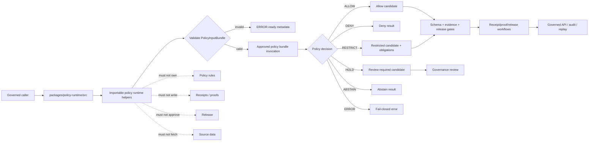

<!-- [KFM_META_BLOCK_V2]
doc_id: kfm://doc/NEEDS-VERIFICATION/packages-policy-runtime-src-readme
title: Policy Runtime Package Source README
type: readme
version: v1
status: draft
owners: OWNER_TBD
created: NEEDS VERIFICATION — target file existed before this repair but contained only placeholder text
updated: 2026-06-14
policy_label: public
related: [packages/policy-runtime/README.md, packages/envelopes/README.md, packages/evidence/README.md, packages/evidence-resolver/README.md, packages/hashing/README.md, packages/identity/README.md, packages/README.md, docs/doctrine/directory-rules.md, docs/architecture/contract-schema-policy-split.md, contracts/, schemas/contracts/v1/, policy/, data/receipts/, data/proofs/, release/]
tags: [kfm, packages, policy-runtime, src, opa, policy-input-bundle, policy-decision, allow, deny, restrict, hold, abstain, sensitivity]
notes: ["Source-directory guide for policy runtime helper code.", "This directory may contain source code for PolicyInputBundle validation, approved policy-bundle invocation, finite decision carriers, obligations, reason codes, receipt-ready metadata, replay metadata, and synthetic fixtures only.", "It must not own policy source rules, schemas, contracts, lifecycle data, receipts, proofs, release decisions, API routes, UI surfaces, source data, credentials, model runtimes, or AI truth claims."]
[/KFM_META_BLOCK_V2] -->

<a id="top"></a>

# Policy Runtime Package Source

Source-code envelope for KFM policy-runtime helpers: explicit `PolicyInputBundle` normalization, approved policy-bundle invocation, finite policy decisions, obligations, reason codes, fail-closed handling, receipt-ready metadata, and replay support.

<p>
  
  
  
  
  
  
</p>

> [!IMPORTANT]
> **Status:** PROPOSED source-directory README  
> **Path:** `packages/policy-runtime/src/README.md`  
> **Owning responsibility root:** `packages/`  
> **Package lane:** `packages/policy-runtime/`  
> **Import/package layout:** NEEDS VERIFICATION  
> **Policy rule authority:** `policy/`, not this source tree  
> **Schema authority:** `schemas/contracts/v1/`, not this source tree  
> **Contract authority:** `contracts/`, not this source tree  
> **Receipt/proof authority:** `data/receipts/` and `data/proofs/`, not this source tree  
> **Release authority:** `release/`, not this source tree  
> **Repo implementation depth:** UNKNOWN for package metadata, import style, tests, CI workflows, policy-engine bindings, emitted receipts, proof packs, release manifests, branch protections, and runtime behavior.

## Scope

`packages/policy-runtime/src/` is the proposed source-code root for the Policy Runtime package.

This directory is for importable helper code used by governed APIs, pipelines, validators, map/runtime assemblers, AI adapters, release gates, receipts, proof builders, replay tools, and tests when they need finite, inspectable policy evaluation semantics.

This source tree may support helpers for:

- validating and normalizing explicit `PolicyInputBundle` values;
- invoking approved policy bundles supplied by callers or repo-confirmed bundle paths;
- adapting OPA or an equivalent approved evaluator without making this source tree policy-rule authority;
- mapping evaluator output into finite decision results such as `ALLOW`, `DENY`, `RESTRICT`, `HOLD`, `ABSTAIN`, and `ERROR`;
- preserving bundle id, bundle hash, policy version, evaluator version, input hash, decision hash, reason codes, obligations, review flags, and replay refs;
- representing redaction, generalization, delayed-release, citation-required, review-required, rollback-required, and audience-restriction obligations;
- handling missing policy, invalid input, unsupported evaluator, stale bundle, unresolved evidence, missing rights, sensitive exact location, timeout, release mismatch, or engine failure with fail-closed posture;
- preparing receipt-ready metadata without writing receipts;
- building synthetic no-network fixtures for allowed, denied, restricted, held, abstained, invalid, stale, and evaluator-error paths.

This source tree must not author policy rules, define schemas, decide release, store lifecycle data, write receipts or proofs, resolve evidence as truth, fetch source data, expose public routes, render UI, or generate truth claims.

```text
RAW -> WORK / QUARANTINE -> PROCESSED -> CATALOG / TRIPLET -> PUBLISHED
```

Policy runtime source code may evaluate whether a candidate can proceed through a governed step. It does not own lifecycle state, source authority, evidence authority, receipt state, proof state, review state, release state, or public truth.

[⬆ Back to top](#top)

---

## Repo fit

```text
packages/policy-runtime/src/
```

`packages/` is the responsibility root for shared reusable code. `policy-runtime/` is the package segment. `src/` is the source-code envelope.

| Relationship | Expected home | Boundary rule |
| --- | --- | --- |
| Policy-runtime source code | `packages/policy-runtime/src/` | Evaluator adapters, input normalization, finite decision carriers, obligations, and receipt metadata only. |
| Importable module | `packages/policy-runtime/src/policy_runtime/` or repo-confirmed namespace | Package namespace, subject to repo package convention verification. |
| Package entry README | `packages/policy-runtime/README.md` | Explains the package as a whole. |
| Policy rules and bundles | `policy/` | Owns policy source, rule meaning, bundle promotion, and policy review. |
| Policy input/output schemas | `schemas/contracts/v1/` | Defines `PolicyInputBundle`, `PolicyDecision`, obligation, reason-code, and policy receipt shapes. |
| Policy contracts | `contracts/` | Defines semantic meaning and obligations. |
| Runtime envelopes | `packages/envelopes/` | Maps decisions into finite runtime/public outcomes. |
| Evidence helpers | `packages/evidence/`, `packages/evidence-resolver/` | Evidence refs and closure validation remain separate. |
| Hash helpers | `packages/hashing/` | Computes input, bundle, decision, and receipt-related hashes. |
| Identity helpers | `packages/identity/` | Handles id grammar and stable object identifiers. |
| Lifecycle data | `data/<phase>/` | Owns RAW/WORK/QUARANTINE/PROCESSED/CATALOG/TRIPLET/PUBLISHED state. |
| Receipts and proofs | `data/receipts/`, `data/proofs/` | Stores PolicyDecision receipts and proof artifacts. |
| Release decisions | `release/` | Owns promotion, publication, correction, supersession, rollback. |
| Public API and UI | `apps/`, `ui/`, `web/`, or repo-confirmed equivalents | May consume policy decisions through governed interfaces; source internals are not public authority. |
| Tests and fixtures | `tests/packages/policy-runtime/`, `fixtures/packages/policy-runtime/`, or repo-confirmed equivalents | Proves deterministic behavior with synthetic no-network fixtures. |

> [!WARNING]
> A source-code directory is not a policy source root, schema root, contract root, receipt store, proof store, lifecycle data store, release home, public API, or UI surface.

[⬆ Back to top](#top)

---

## Accepted inputs

Functions in this source tree should accept explicit values from governed callers. They should not fetch missing facts from source systems, raw stores, hidden globals, UI state, operator memory, or generated language.

| Input family | Accepted examples | Required handling |
| --- | --- | --- |
| Policy input | `PolicyInputBundle`, audience, operation, object refs, source role, rights posture, sensitivity posture | Validate shape and required context before evaluation. |
| Bundle context | bundle id, bundle ref, bundle hash, policy version, evaluator profile | Require explicit approved bundle context; fail closed if missing or stale. |
| Evidence context | EvidenceRef, EvidenceBundle ref, resolver outcome, citation validation ref | Consume evidence status; do not fabricate or resolve claims as truth. |
| Source context | SourceDescriptor ref, source role, rights, cadence, license, limitation flags | Carry refs and policy-relevant attributes; do not fetch source data. |
| Lifecycle context | input phase, output phase, release state, promotion stage, rollback ref | Block public exposure of invalid lifecycle phases. |
| Sensitivity context | living-person, DNA/genomic, archaeology, rare species, infrastructure, precise location, tribal/cultural flags | Prefer deny, restrict, generalize, hold, or abstain when support is unclear. |
| Identity/hash context | object id, spec hash, content hash, bundle hash, input hash, decision hash | Consume from identity/hashing helpers or explicit caller input. |
| Engine context | OPA path, WASM bundle ref, evaluator version, timeout, fail-closed policy | Treat engine error as deny, abstain, or error according to contract. |
| Fixture context | synthetic allowed, denied, restricted, held, abstained, invalid, stale, and engine-error examples | Keep fixtures deterministic and public-safe. |

[⬆ Back to top](#top)

---

## Exclusions

| Do not put here | Correct home or owner | Reason |
| --- | --- | --- |
| Policy source rules, Rego files, policy bundles as governance artifacts | `policy/` | Policy authority belongs to policy roots. |
| JSON Schemas | `schemas/contracts/v1/` | Schemas own machine shape. |
| Semantic contracts | `contracts/` | Contracts own meaning and obligations. |
| RAW, WORK, QUARANTINE, PROCESSED, CATALOG, TRIPLET, or PUBLISHED data | `data/<phase>/` | Lifecycle state must remain phase-visible. |
| Source descriptors and source registries | `data/registry/` or repo-confirmed registry homes | Source authority, rights, cadence, and limitations are governance data. |
| Receipts, proof packs, validation reports | `data/receipts/`, `data/proofs/` | Trust artifacts must remain separately auditable. |
| Release manifests, rollback cards, correction notices | `release/` | Publication is a governed state transition. |
| EvidenceBundle storage or closure resolution authority | Evidence/proof/data homes and `packages/evidence-resolver/` | Policy may consume evidence status; it does not own evidence truth. |
| Public API routes or serializers | `apps/` or repo-confirmed API app | Public clients must use governed APIs. |
| UI components, dashboards, controls | `apps/`, `ui/`, `web/`, or observability roots | Presentation is downstream from governed decisions. |
| AI-generated claims or source interpretation | governed AI runtime plus evidence validation | AI output is interpretive and evidence-subordinate. |
| Secrets, source credentials, private source content, living-person identifiers, DNA/genomic context, or sensitive fixtures | Nowhere in package fixtures | Fixtures must remain synthetic or public-safe. |

[⬆ Back to top](#top)

---

## Expected source layout

> [!NOTE]
> The tree below is PROPOSED. Confirm package metadata, language conventions, import namespace, test layout, and CI before committing code beyond README files.

```text
packages/policy-runtime/src/
├── README.md                # This file: source-code boundary and trust rules
└── policy_runtime/
    ├── README.md            # PROPOSED: importable namespace guide
    ├── __init__.py          # PROPOSED export boundary
    ├── inputs.py            # PROPOSED PolicyInputBundle helpers
    ├── engine.py            # PROPOSED OPA/equivalent invocation adapter
    ├── decisions.py         # PROPOSED finite decision carriers
    ├── obligations.py       # PROPOSED obligations/redaction/review helpers
    ├── reason_codes.py      # PROPOSED stable reason-code helpers
    ├── receipts.py          # PROPOSED receipt-ready metadata carriers only
    ├── replay.py            # PROPOSED replay metadata helpers
    ├── validation.py        # PROPOSED input/output validation helpers
    ├── fixtures.py          # PROPOSED synthetic fixtures
    └── py.typed             # PROPOSED if typed package convention is confirmed
```

Preferred import posture, subject to package verification:

```python
from policy_runtime.inputs import validate_policy_input_bundle
from policy_runtime.engine import evaluate_policy_bundle
from policy_runtime.decisions import PolicyDecisionOutcome
```

[⬆ Back to top](#top)

---

## Policy helper outcomes

| Helper outcome | Use when | Runtime posture |
| --- | --- | --- |
| `ALLOW` | Explicit policy bundle allows the action for the given input and audience. | Candidate only; downstream schema, evidence, release, and receipt gates may still block. |
| `DENY` | Policy blocks the action or sensitive/rights context requires denial. | Deny with stable reason code. |
| `RESTRICT` | Policy permits a transformed, reduced, generalized, redacted, delayed, or audience-limited output. | Apply obligations before publication or rendering. |
| `HOLD` | Review, steward action, missing receipt/proof, or maturity gate is required. | Internal/governance state; not a public allow. |
| `ABSTAIN` | Required evidence, source, rights, policy support, or input context is missing or unresolved. | Fail safe; do not produce authoritative output. |
| `ERROR` | Input, engine, bundle, schema, timeout, or runtime failure prevents a valid decision. | Fail closed with receipt-ready error metadata. |

`ALLOW` is not proof of truth, evidence closure, release, publication, or public safety. It only means the policy bundle did not block the evaluated action under the supplied context.

[⬆ Back to top](#top)

---

## Trust-boundary flow



[⬆ Back to top](#top)

---

## Source anti-collapse rules

| Boundary | Preserve as | Never collapse into |
| --- | --- | --- |
| Policy input | Explicit `PolicyInputBundle` candidate | Hidden caller context or generated prose |
| Policy bundle | Approved bundle ref and hash | Policy source authority inside package code |
| Policy decision | Finite outcome with reason codes | Truth, release, or publication approval |
| Obligation | Explicit redaction/generalization/review/delay requirement | Silent client-side behavior |
| Hold | Internal governance/review state | Public allow or public denial without context |
| Abstain | Missing support/fail-safe outcome | Fabricated answer or implicit allow |
| Receipt metadata | Receipt-ready carrier | Receipt store or proof authority |
| Fixture input | Synthetic public-safe example | Real sensitive source or person/private-location data |

[⬆ Back to top](#top)

---

## Development rules

1. Prefer pure normalization/validation functions and explicit engine adapters.
2. Preserve policy bundle id, version, bundle hash, input hash, object refs, source refs, evidence refs, audience, operation, lifecycle phase, rights posture, sensitivity posture, reason codes, obligations, release refs, rollback refs, and correction refs supplied by callers.
3. Do not make network calls from `src/` helpers unless a future ADR explicitly permits a constrained policy-engine call path.
4. Do not read directly from RAW, WORK, QUARANTINE, unpublished candidates, source systems, source credentials, canonical stores, or model runtimes.
5. Do not write lifecycle data, policy source rules, receipts, proofs, release manifests, source registries, catalog records, API responses, or UI components.
6. Do not approve release, publish artifacts, resolve evidence as truth, or generate public claims.
7. Do not create schemas, contracts, policy source rules, source registries, pipeline DAGs, API routes, public answers, release decisions, or connector behavior from this source tree.
8. Do not store raw provider payloads, secrets, private source records, sensitive-location examples, living-person identifiers, DNA/genomic context, or unrestricted sensitive context.
9. Return typed finite outcomes instead of implicit allow, warning-only denial, silent redaction, or hidden policy failure.
10. Add deterministic tests for every behavior-changing helper and every negative path.
11. Keep fixtures synthetic, sanitized, and public-safe.
12. Preserve rollback and correction metadata supplied by callers when policy output can affect downstream publication candidates.

[⬆ Back to top](#top)

---

## Validation checklist

- [ ] Confirm `packages/policy-runtime/src/` exists in the mounted repo with this README as its source-directory guide.
- [ ] Confirm package manager and import convention (`pyproject.toml`, package.json, workspace config, or equivalent).
- [ ] Confirm whether this source tree is Python-only, TypeScript-only, or mixed-language.
- [ ] Confirm import namespace and whether it is `policy_runtime`, `policyRuntime`, or repo-specific.
- [ ] Confirm owners and CODEOWNERS path coverage.
- [ ] Confirm policy source and bundle homes under `policy/`.
- [ ] Confirm schema homes for `PolicyInputBundle`, `PolicyDecision`, obligations, reason codes, and policy receipts.
- [ ] Confirm relationship with `packages/envelopes/`, `packages/evidence-resolver/`, `packages/hashing/`, `packages/identity/`, and receipt/proof homes.
- [ ] Confirm tests for `ALLOW`, `DENY`, `RESTRICT`, `HOLD`, `ABSTAIN`, and `ERROR` paths.
- [ ] Confirm tests for missing policy, stale bundle, invalid input, unsupported engine, unresolved evidence, missing rights, sensitive exact location, release mismatch, timeout, and no implicit allow.
- [ ] Confirm helpers do not access lifecycle stores, source systems, credentials, model runtimes, or unpublished candidate stores.
- [ ] Confirm helpers do not write policy source rules, receipts, proofs, release manifests, catalog records, API responses, credentials, or permissions.

Suggested inspection commands:

```bash
find packages/policy-runtime/src -maxdepth 5 -type f | sort
git grep -n "PolicyInputBundle\|PolicyDecision\|policy_runtime\|opa\|rego\|ALLOW\|DENY\|RESTRICT\|HOLD\|ABSTAIN" -- packages docs contracts schemas policy tests fixtures pipelines connectors tools apps 2>/dev/null || true
git grep -n "from policy_runtime\|import policy_runtime\|packages/policy-runtime/src" -- . 2>/dev/null || true
```

[⬆ Back to top](#top)

---

## Rollback

Rollback is required if this source tree:

- creates a parallel authority home for policy source rules, schemas, contracts, policy bundles, registries, lifecycle data, receipts, proofs, releases, API routes, UI surfaces, credentials, model runtimes, or source data;
- treats missing policy, invalid input, stale bundle, unresolved evidence, sensitive exact location, or rights gaps as implicit allow;
- writes policy rules, lifecycle data, receipts, proofs, release manifests, catalog records, API responses, or public UI state;
- fetches source data or directly reads RAW/WORK/QUARANTINE/unpublished candidates/source systems;
- treats policy allow as proof of truth, evidence closure, admissibility, public safety, or release;
- stores secrets, source credentials, private source records, living-person identifiers, DNA/genomic context, or sensitive-location examples in fixtures.

Rollback target: revert the policy-runtime source PR, keep any generated audit notes as review evidence, and file the affected behavior in `docs/registers/DRIFT_REGISTER.md` or `docs/registers/VERIFICATION_BACKLOG.md` if the mounted repo uses those registers.

[⬆ Back to top](#top)

---

## Evidence boundary

| Source | Status | Supports | Limits |
| --- | --- | --- | --- |
| Current target file | CONFIRMED | `packages/policy-runtime/src/README.md` existed and required replacement from placeholder content. | Did not prove source implementation maturity. |
| Parent package README | CONFIRMED repo doc | `packages/policy-runtime/` is a shared helper-code package for OPA/equivalent policy-bundle execution against `PolicyInputBundle`. | Does not prove source files, package metadata, tests, or CI. |
| `packages/README.md` | CONFIRMED repo doc | `packages/` is for shared libraries used by apps, workers, pipelines, and tools. | Does not define this source namespace. |
| `docs/doctrine/directory-rules.md` | CONFIRMED repo doctrine | `packages/`, `policy/`, `schemas`, `contracts`, lifecycle data, receipt/proof, and release homes are separate responsibility roots. | Does not prove this source tree is implemented. |
| Current file-generation pass | CONFIRMED request | User-requested target path and README repair/replacement. | Does not inspect package metadata, tests, CI logs, dashboards, deployment posture, runtime behavior, policy bundle promotion, or branch protection. |

[⬆ Back to top](#top)
