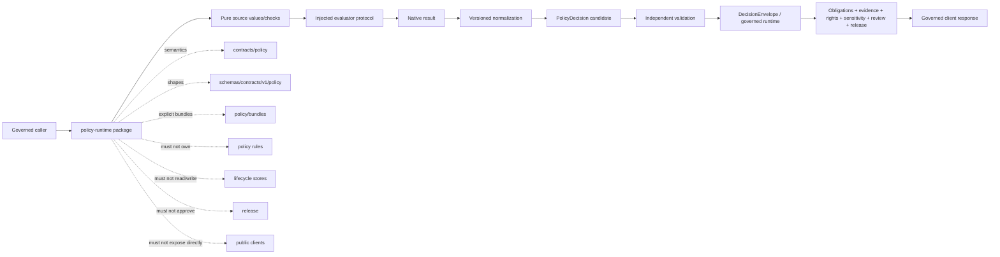

<!-- [KFM_META_BLOCK_V2]
doc_id: kfm://doc/packages-policy-runtime-src-readme
title: packages/policy-runtime/src/ — Python Source Envelope and Greenfield Policy-Evaluator Boundary
type: readme
version: v1.1
status: draft
owners: OWNER_TBD — Policy steward · Policy-runtime steward · Contracts steward · Schema steward · Evidence steward · Rights/consent/sensitivity steward · Security steward · Validation steward · Runtime/API steward · Release steward · CI steward · Docs steward
created: NEEDS VERIFICATION — target existed before this evidence-grounded revision
updated: 2026-07-15
policy_label: "public-doctrine; package-source-boundary; python-source-envelope; greenfield-placeholder; evaluator-unbound; bundle-selection-unratified; api-unratified; consumers-unverified; tests-unestablished; explicit-inputs; no-hidden-fetches; no-network-by-default; deterministic-core-candidate; fail-closed; policy-authority-external; evidence-subordinate; rights-aware; sensitivity-aware; release-subordinate; no-truth-authority; no-publication-authority; migration-required; rollback-aware"
current_path: packages/policy-runtime/src/README.md
truth_posture: >
  CONFIRMED target README v1, package metadata name kfm-policy-runtime and version 0.0.0,
  repository-present src directory and policy_runtime namespace, merged namespace README v1.1,
  empty policy_runtime/__init__.py, comment-only policy_runtime/core.py greenfield placeholder,
  packages responsibility-root doctrine, PolicyInputBundle contract and permissive PROPOSED schema
  requiring only id, PolicyDecision contract and concrete PROPOSED schema using
  ANSWER|ABSTAIN|DENY|ERROR, DecisionEnvelope with the same primary outcome vocabulary,
  minimal PolicyDecision fixtures, absent dedicated validator files, README-only policy-bundle lane,
  TODO-only policy-test workflow, and bounded absence of functional source modules, exports,
  consumers, package tests, evaluator binding, receipt persistence, deployment, or runtime health /
  PROPOSED a small reusable Python source envelope for explicit policy-input validation,
  injected evaluator protocols, versioned native-result normalization, PolicyDecision candidate
  assembly, obligation/reason preservation, replay/freshness checks, and synthetic test builders /
  CONFLICTED prior source and package README claims that imply implemented helpers and approved-bundle
  invocation; lower-level ALLOW|RESTRICT|HOLD vocabulary versus canonical
  ANSWER|ABSTAIN|DENY|ERROR; rich PolicyInputBundle semantics versus minimal schema;
  schema-declared validators versus absent files; bundle/evaluator intent versus no activation binding /
  UNKNOWN accepted API, build backend, Python support, discovery, dependencies, evaluator mode,
  bundle format, active selection, consumers, CI enforcement, deployment, release use, and health /
  NEEDS VERIFICATION owners, metadata completion, evaluator ADR, activation contract,
  schema strengthening, normalization mapping, source modules, tests, first consumer,
  security review, correction, deprecation, and rollback automation
evidence_snapshot:
  repository: bartytime4life/Kansas-Frontier-Matrix
  repository_id: "1059091169"
  visibility: public
  base_ref: main
  base_commit: 0f2333a34ffa25bc90a509c24b39d2a622cc0d3e
  prior_blob: 4d658ab4e68913a30fdd1456fc648260a356d71e
  package_readme_blob: e70246ec4770399b41b6c07e3f97a4c66e17503d
  namespace_readme_blob: f5b89067c4a88ed756626f03ac8254c10089c358
  package_metadata_blob: ebb6725ad9a00d77df06f779a603814027abe084
  namespace_init_blob: e69de29bb2d1d6434b8b29ae775ad8c2e48c5391
  namespace_core_blob: e7e14cf39ae6919fbbc80f1b471de6b907292edb
  directory_rules_blob: 2affb080e6f0043867c64c7f06c1ca52030fbd55
  policy_input_contract_blob: 545c352681dd0db0cd4d169a5d2f9c364356457c
  policy_input_schema_blob: b89db4b1730c61258441e0eed037276b910b1990
  policy_decision_contract_blob: ebfe97f98263e6309db6d2772cb2c5e548819650
  policy_decision_schema_blob: 1472d26a42c73f17545b4464a275412ffa1d098e
  decision_envelope_contract_blob: b5120a208910f5e2907874b03af1fc8c7f43363d
  policy_decision_fixtures_blob: 0169614d568cfc32bc7fb257fb42f1e6b792bae3
  validator_index_blob: 56ef4bd527ddfc8d726662092ca589ab2340b401
  policy_bundles_readme_blob: 77f59c399fbce668c916cbbc385009121d6169f4
  policy_test_workflow_blob: 2bba88bb018600f54995d06b03cac02145b96fe7
  merged_namespace_pr: 1239
  merged_namespace_commit: faa68703a9b249f8f817a3214a7675acabb13e32
  bounded_path_checks:
    - packages/policy-runtime/src/README.md existed at version v1 before this revision
    - packages/policy-runtime/pyproject.toml declares kfm-policy-runtime version 0.0.0 only
    - packages/policy-runtime/src/policy_runtime/README.md exists at version v1.1 on main
    - packages/policy-runtime/src/policy_runtime/__init__.py is empty
    - packages/policy-runtime/src/policy_runtime/core.py is a comment-only greenfield placeholder
    - bounded search found no functional policy_runtime consumer import or package pytest reference
    - dedicated PolicyInputBundle and PolicyDecision validators were not found at schema-declared paths
    - policy/bundles is README-only in bounded evidence with no accepted bundle, selector, or evaluator binding
    - PolicyInputBundle schema is PROPOSED, requires only id, and allows additional properties
    - PolicyDecision schema is PROPOSED and uses ANSWER|ABSTAIN|DENY|ERROR
    - PolicyDecision fixtures document one valid and one missing-decision-id invalid example
    - policy-test workflow contains echo-only TODO steps
related:
  - ../README.md
  - ../pyproject.toml
  - policy_runtime/README.md
  - policy_runtime/__init__.py
  - policy_runtime/core.py
  - ../../README.md
  - ../../../docs/doctrine/directory-rules.md
  - ../../../docs/architecture/contract-schema-policy-split.md
  - ../../../docs/doctrine/trust-membrane.md
  - ../../../contracts/policy/policy_input_bundle.md
  - ../../../contracts/policy/policy_decision.md
  - ../../../contracts/runtime/decision_envelope.md
  - ../../../schemas/contracts/v1/policy/policy_input_bundle.schema.json
  - ../../../schemas/contracts/v1/policy/policy_decision.schema.json
  - ../../../policy/README.md
  - ../../../policy/bundles/README.md
  - ../../../tools/validators/policy/README.md
  - ../../../fixtures/contracts/v1/policy/policy_decision/README.md
  - ../../../tests/schemas/test_common_contracts.py
  - ../../../.github/workflows/policy-test.yml
tags: [kfm, packages, policy-runtime, src, python, source-envelope, scaffold, policy-evaluation, PolicyInputBundle, PolicyDecision, DecisionEnvelope, finite-outcomes, obligations, reason-codes, bundles, opa, fail-closed, evidence, rights, consent, sensitivity, validation, compatibility, rollback]
notes:
  - "This revision changes only packages/policy-runtime/src/README.md."
  - "The source envelope contains this README and the policy_runtime namespace; the namespace has a v1.1 README, an empty __init__.py, and a comment-only core.py."
  - "This README does not install the package, create an API, approve an evaluator, activate policy, establish consumers, run policy, write receipts, or prove CI/runtime behavior."
[/KFM_META_BLOCK_V2] -->

<a id="top"></a>

# Policy Runtime Python Source Envelope and Greenfield Evaluator Boundary

`packages/policy-runtime/src/`

> Source-placement and governance boundary for a future reusable Python policy-evaluation package. Current evidence establishes one evidence-grounded namespace README, an empty `__init__.py`, and a comment-only `core.py`—not a functional evaluator, OPA adapter, PolicyInputBundle validator, PolicyDecision builder, accepted API, active policy bundle, receipt writer, policy authority, evidence authority, or release component.


**Quick links:** [Purpose](#purpose) · [Evidence](#status-and-evidence) · [Placement](#directory-rules-and-authority) · [Inventory](#confirmed-source-inventory) · [Layers](#package-source-and-namespace-layers) · [Admission](#source-admission-rules) · [Contracts](#contract-schema-and-policy-boundaries) · [Outcomes](#outcome-vocabularies-and-normalization) · [Bundles](#policy-bundle-and-evaluator-boundary) · [Inputs](#policyinputbundle-boundary) · [Decisions](#policydecision-candidate-boundary) · [Dependencies](#dependency-direction) · [Lifecycle](#lifecycle-and-trust-membrane) · [Effects](#side-effects-network-and-determinism) · [Security](#security-rights-consent-sensitivity-and-privacy) · [Testing](#testing-fixtures-and-ci) · [Implementation](#smallest-sound-implementation-sequence) · [Done](#definition-of-done) · [Open](#verification-register) · [Drift](#drift-and-conflicts) · [Rollback](#rollback-correction-and-deprecation)

> [!IMPORTANT]
> **This README is not implementation evidence.** It does not establish installation, imports, exports, evaluator availability, bundle activation, policy execution, receipt persistence, tests, CI enforcement, deployment, or operational health.

> [!CAUTION]
> **Policy evaluation is not truth or publication.** Source helpers cannot create evidence, cure unresolved rights, infer consent, downgrade sensitivity, satisfy review, promote lifecycle state, or approve release.

---

<a id="purpose"></a>

## Purpose

This README governs source placement under:

```text
packages/policy-runtime/src/
```

The intended future role is a **small reusable source envelope** for policy-evaluation mechanics shared by more than one governed caller.

The current state is narrower:

- `src/README.md` exists;
- `src/policy_runtime/README.md` is merged at v1.1;
- `src/policy_runtime/__init__.py` is empty;
- `src/policy_runtime/core.py` is a comment-only placeholder;
- no functional module, export, consumer, package test, evaluator binding, active bundle, or deployment is established;
- dedicated validator paths named by policy schemas were not found;
- policy CI currently contains TODO echoes.

This README records that placeholder state, defines future source-admission rules, and keeps contracts, schemas, policy, evidence, rights, consent, sensitivity, validation, receipts, release, correction, and rollback visible.

[Back to top](#top)

---

<a id="status-and-evidence"></a>

## Status and evidence

| Surface | Status | Safe conclusion |
|---|---:|---|
| Target README | **CONFIRMED v1 before revision** | Existing source guide over-described implementation. |
| Package metadata | **CONFIRMED placeholder** | `kfm-policy-runtime`, version `0.0.0`. |
| Build/discovery | **NOT DECLARED** | Build/install/import are unproved. |
| Namespace README | **CONFIRMED v1.1** | Child boundary is evidence-grounded. |
| `__init__.py` | **CONFIRMED empty** | No exports. |
| `core.py` | **CONFIRMED comment-only** | No behavior. |
| Functional modules | **NOT FOUND by bounded checks** | Prior module names are not facts. |
| Consumers/tests | **NOT FOUND by bounded search** | No adoption or behavior is proved. |
| PolicyInputBundle schema | **PERMISSIVE PROPOSED STUB** | Requires only `id`; allows extras. |
| PolicyDecision schema | **CONCRETE PROPOSED SHAPE** | Six required fields; closed enums. |
| DecisionEnvelope | **DRAFT/PROPOSED** | Uses canonical finite outcomes. |
| Dedicated validators | **NOT FOUND at checked paths** | No dedicated validation implementation. |
| Policy bundles | **README-only bounded state** | No accepted instance or activation. |
| Policy-test workflow | **TODO-only** | Green status cannot prove policy behavior. |
| Runtime health | **UNKNOWN** | No operational evaluator is proved. |

### Corrections from v1

| Prior implication | Current evidence | Correction |
|---|---|---|
| Importable helper code exists | Only empty/comment placeholders exist | Treat as greenfield source envelope. |
| Proposed modules/imports are usable | Modules are absent | Retain only as design lineage. |
| Broad governed callers consume the package | No functional import surfaced | Consumer set remains unknown. |
| Approved bundles can be invoked | No accepted bundle or evaluator binding | File presence is not activation. |
| `ALLOW|RESTRICT|HOLD` are canonical outcomes | Canonical schemas use `ANSWER|ABSTAIN|DENY|ERROR` | Require versioned normalization. |
| Rich PolicyInputBundle fields are enforced | Schema requires only `id` | Separate shape from semantic readiness. |
| Dedicated validators exist | Declared paths are absent | Do not claim validator execution. |
| Policy CI tests behavior | Jobs echo TODO | Replace stubs before enforcement claims. |

[Back to top](#top)

---

<a id="directory-rules-and-authority"></a>

## Directory Rules and authority

Directory Rules place reusable libraries under `packages/` and state that one-off workflow steps belong in `tools/` or `pipelines/`.

This source tree is appropriate only for reusable, bounded, testable mechanics.

| Responsibility | Governing home | Source-envelope relationship |
|---|---|---|
| Package metadata/build | `../pyproject.toml` | Outside `src/`; currently incomplete. |
| Source placement | This directory | Primary responsibility of this README. |
| Python namespace/API | `policy_runtime/` | Candidate implementation; API unratified. |
| Policy source rules | `policy/` | Authoritative; never authored here. |
| Policy bundles/manifests | `policy/bundles/` | Consumed only through explicit approved binding. |
| Semantic contracts | `contracts/policy/` | Define meaning; source implements, not redefines. |
| Machine schemas | `schemas/contracts/v1/policy/` | Define shape; source validates supported versions. |
| Runtime envelopes | runtime contracts/implementation | Downstream transport, not source authority. |
| Evidence | evidence roots | Consume status/refs only. |
| Rights/consent/sensitivity | governing policy/contracts/registries | Do not discover or downgrade. |
| Lifecycle state | `data/<phase>/` and workflows | Do not read/write as authority. |
| Receipts/proofs | `data/receipts/`, `data/proofs/` | Candidate metadata only after approval. |
| Review/release | governance and `release/` | Never approve or publish. |
| Public clients | governed apps/runtime | No direct source access. |
| Validators | `tools/validators/` | Independent checks, not policy authority. |

The source tree may implement mechanics. It must not become policy rule authority, evidence truth, source authority, consent authority, sensitivity authority, lifecycle promotion, receipt/proof authority, release approval, or public truth.

[Back to top](#top)

---

<a id="confirmed-source-inventory"></a>

## Confirmed source inventory

```text
packages/policy-runtime/src/
├── README.md
└── policy_runtime/
    ├── README.md
    ├── __init__.py
    └── core.py
```

| Path | Status | Current meaning |
|---|---:|---|
| `README.md` | **CONFIRMED** | Source-envelope guide; revised here. |
| `policy_runtime/README.md` | **CONFIRMED v1.1** | Namespace boundary. |
| `policy_runtime/__init__.py` | **CONFIRMED empty** | Namespace marker only. |
| `policy_runtime/core.py` | **CONFIRMED comment-only** | Greenfield placeholder. |

Not established: input, evaluator, decision, obligation, reason-code, receipt, replay, validation, fixture, typed-marker, bundle-selection, public API, test, consumer, CI, deployment, or telemetry modules.

Prior names such as `inputs.py`, `engine.py`, `decisions.py`, `obligations.py`, `reason_codes.py`, `receipts.py`, `replay.py`, and `validation.py` are design prompts only—not implementation, reserved API, or compatibility commitments.

[Back to top](#top)

---

<a id="package-source-and-namespace-layers"></a>

## Package, source, and namespace layers

| Layer | Owns | Does not own |
|---|---|---|
| Package root | Build, discovery, dependencies, versioning, license, package policy | Source behavior or policy authority. |
| `src/` | Source placement, dependency direction, admission, pure/effectful separation, test expectations | Distribution publication or release authority. |
| `policy_runtime/` | Future Python values, protocols, adapters, normalization, candidates | Policy rules, evidence, receipts, release, public truth. |

A claim is valid only when its evidence exists:

| Claim | Required evidence |
|---|---|
| File exists | Repository path inspection. |
| Symbol exists | Source inspection. |
| Symbol is public | Export declaration plus import tests. |
| Package imports | Build/discovery plus clean installation. |
| Evaluator works | Approved binding plus deterministic integration tests. |
| Bundle is active | Governed activation/configuration with digest binding. |
| Input is policy-ready | Schema and semantic-profile validation. |
| Decision candidate is valid | Contract/schema checks. |
| Decision is persisted | Owning workflow evidence. |
| Public response is allowed | Decision, obligations, evidence, rights, sensitivity, review, and release gates. |

[Back to top](#top)

---

<a id="source-admission-rules"></a>

## Source admission rules

Before adding source, reviewers must establish:

1. a reused or accepted first-consumer need;
2. governing semantic contract;
3. governing schema/version where shape matters;
4. explicit inputs without hidden retrieval;
5. finite negative and indeterminate states;
6. explicit policy bundle/evaluator selection;
7. synthetic public-safe tests;
8. no direct source/lifecycle/receipt/release/public authority;
9. minimal reviewed dependencies;
10. migration and rollback.

Good candidates after approval:

- pure PolicyInputBundle schema/profile checks;
- immutable bundle/evaluator reference values;
- injected evaluator protocols;
- deterministic native-result parsers;
- versioned normalization;
- PolicyDecision candidate assembly;
- reason/obligation validation;
- replay/freshness comparisons;
- synthetic test builders.

Poor candidates:

- one pipeline’s custom gate;
- Rego or policy source;
- mutable current-bundle discovery;
- OPA administration;
- data retrieval;
- lifecycle persistence;
- receipt/proof storage;
- release approval;
- public API/UI handlers;
- generated policy text treated as authority.

[Back to top](#top)

---

<a id="contract-schema-and-policy-boundaries"></a>

## Contract, schema, and policy boundaries

| Surface | Owns | Source duty |
|---|---|---|
| Contract | Meaning and obligations | Implement; do not redefine. |
| Schema | Shape, types, enums, required fields | Validate exact version. |
| Policy source | Executable admissibility | Execute only through explicit approved binding. |
| Bundle manifest | Immutable composition | Verify supplied identity/digest/profile. |
| Source code | Mechanical helpers | Remain subordinate. |
| Validator | Independent conformance result | Inspect, not approve. |
| Receipt/proof | Audit and integrity | Preserve refs/candidates only. |
| Release | Publication decision | Never bypass. |

### PolicyInputBundle

Current schema:

```text
required: id
optional strings: spec_hash, version
additionalProperties: true
status: PROPOSED
```

The semantic contract is much richer. Schema-valid does not mean policy-ready. Missing operation, audience, evidence, rights, consent, sensitivity, lifecycle, release, or evaluator context must not be invented.

### PolicyDecision

Required fields:

```text
decision_id
outcome
policy_family
reasons
obligations
evaluated_at
```

Outcomes:

```text
ANSWER | ABSTAIN | DENY | ERROR
```

Policy families:

```text
promotion | access | render | capability | consent | sensitivity
```

Additional properties are disallowed.

### Safe flow

```text
PolicyInputBundle candidate
  -> schema validation
  -> semantic-profile validation
  -> explicit bundle + evaluator binding
  -> engine-native result
  -> versioned normalization
  -> PolicyDecision candidate
  -> independent validation
  -> DecisionEnvelope
  -> obligations + evidence + rights + sensitivity + review + release gates
  -> governed response
```

[Back to top](#top)

---

<a id="outcome-vocabularies-and-normalization"></a>

## Outcome vocabularies and normalization

Prior docs used:

```text
ALLOW | DENY | RESTRICT | HOLD | ABSTAIN | ERROR
```

Canonical PolicyDecision and DecisionEnvelope use:

```text
ANSWER | ABSTAIN | DENY | ERROR
```

They are not interchangeable.

| Layer | Vocabulary | Status |
|---|---|---:|
| Engine-native | Evaluator-specific; prior docs mention `ALLOW`, `RESTRICT`, `HOLD` | **UNRATIFIED** |
| PolicyDecision | `ANSWER`, `ABSTAIN`, `DENY`, `ERROR` | **SCHEMA-CONFIRMED PROPOSED** |
| DecisionEnvelope | `ANSWER`, `ABSTAIN`, `DENY`, `ERROR` | **CONTRACT/SCHEMA-CONFIRMED PROPOSED** |
| Validator result | pass/fail/deny/restrict/hold/abstain | **DOCUMENTED; IMPLEMENTATION UNPROVED** |
| Review/release state | Separate vocabularies | **NEEDS VERIFICATION** |

A normalization contract must specify source and target versions, policy-family mappings, `RESTRICT` and `HOLD` treatment, obligation/reason propagation, missing/stale context, timeout/errors, unsupported output, deterministic behavior, and replay metadata.

Illustrative—not accepted:

| Native result | Possible treatment | Required decision |
|---|---|---|
| `ALLOW` | `ANSWER` candidate | Confirm downstream gates. |
| `RESTRICT` | constrained `ANSWER` or negative result | Define per family/surface. |
| `HOLD` | review state, `ABSTAIN`, or `DENY` | Ratify explicitly. |
| `ABSTAIN` | `ABSTAIN` | Preserve missing support. |
| `DENY` | `DENY` | Preserve safe reason. |
| `ERROR` | `ERROR` | Never silently convert. |

Restrictions, holds, reasons, and obligations must not disappear. `ABSTAIN`, `DENY`, and `ERROR` remain distinct.

[Back to top](#top)

---

<a id="policy-bundle-and-evaluator-boundary"></a>

## Policy bundle and evaluator boundary

No accepted bundle instance, manifest instance, selector, evaluator profile, OPA/WASM/server/subprocess binding, or deployment is established.

### File presence is not activation

Directory presence, newest file, lexical order, symlink, environment fallback, mutable `latest`, successful parse, schema pass, OPA-compatible layout, or digest alone must not activate policy.

A future binding should identify bundle id/version/digest, manifest, policy family, evaluator profile/version, input/output versions, normalization version, limits, failure posture, activation record, supersession state, and rollback target.

An evaluator adapter must:

- accept explicit immutable bundle/evaluator input;
- verify manifest/digest;
- reject mutable path selection;
- enforce limits;
- return structured native results;
- preserve evaluator version;
- avoid hidden network/secret reads;
- avoid sensitive logs;
- fail closed on malformed/unsupported output;
- distinguish process success from policy success;
- be replaceable with deterministic mocks.

OPA is mentioned in existing docs, but no mode is accepted. An OPA adapter requires architecture, security, versioning, query, serialization, process/network, resource, error, replay, supply-chain, ownership, and rollback review.

Public clients, UI state, query parameters, and AI prompts must not select bundles, evaluators, versions, or fail-open behavior.

[Back to top](#top)

---

<a id="policyinputbundle-boundary"></a>

## PolicyInputBundle boundary

A PolicyInputBundle is explicit input—not a decision, evidence, source authority, consent approval, sensitivity authority, review approval, release approval, runtime response, or AI authority.

A future semantic profile may require operation, audience, object/domain refs, lifecycle/release state, evidence refs, source roles, rights/license, consent/revocation, sensitivity, geometry precision, review refs, correction/rollback, bundle/evaluator context, prior decisions, and freshness.

### No-hidden-fetch invariant

Do not fill missing fields from:

- source systems;
- RAW, WORK, or QUARANTINE;
- implicit registries;
- UI/browser state;
- operator memory;
- vector search;
- AI prompts or output;
- mutable current release;
- mutable current bundle.

Missing required context must remain explicit and fail closed.

Input should become immutable when evaluation begins. Changes require a new id/version/hash. Sensitive values should be minimized or referenced.

[Back to top](#top)

---

<a id="policydecision-candidate-boundary"></a>

## PolicyDecision candidate boundary

A future helper may assemble a **candidate**, not an authoritative persisted decision.

Candidate rules:

1. accept all required fields explicitly;
2. validate exact enums, id pattern, date-time, and no-extra-fields;
3. receive time from caller or injected clock;
4. define deterministic reason/obligation ordering;
5. keep public-safe and internal diagnostics separate;
6. return validation separately;
7. support independent schema/semantic checks;
8. preserve lineage in adjacent metadata;
9. never equate construction with policy success.

`decision_id` must match:

```text
^[a-z][a-z0-9_:.-]*$
```

It must not contain credentials, prompts, protected coordinates, private identifiers, or mutable `latest` state.

A later decision supersedes through a new record and explicit lineage—not mutation of the old record.

[Back to top](#top)

---

<a id="dependency-direction"></a>

## Dependency direction



Source code should prefer standard library dependencies, keep schema loading explicit/versioned, inject evaluators, avoid import-time effects, avoid app/pipeline/connector/release dependencies, and delegate repository-standard identity/hashing rather than create competing rules.

Prohibited cycles include:

```text
policy-runtime -> governed-api -> policy-runtime
policy-runtime -> pipeline -> policy-runtime
policy-runtime -> connector -> policy-runtime
policy-runtime -> release -> policy-runtime
policy-runtime -> evaluator selector -> runtime config -> policy-runtime
```

[Back to top](#top)

---

<a id="lifecycle-and-trust-membrane"></a>

## Lifecycle and trust membrane

```text
RAW -> WORK / QUARANTINE -> PROCESSED -> CATALOG / TRIPLET -> PUBLISHED
```

This source tree may evaluate explicit context. It does not own lifecycle reads or writes.

| Unsafe collapse | Required behavior |
|---|---|
| RAW ref -> public answer | Fail closed. |
| WORK candidate -> published object | Require validation, evidence, policy, review, and release. |
| QUARANTINE -> normal response | Preserve quarantine and block exposure. |
| Schema-valid input -> policy-ready | Require semantic-profile validation. |
| Bundle file/digest -> active policy | Require activation binding. |
| Process success -> `ANSWER` | Parse and normalize under contract. |
| `ANSWER` -> release approved | Require obligations and release gates. |
| Policy decision -> evidence truth | Preserve evidence separation. |
| Candidate -> persisted receipt/decision | Require owning workflow. |
| Git merge -> KFM PUBLISHED | Preserve release state. |

When evidence is required and unresolved, do not manufacture support. Preserve the deficiency and map it only through accepted policy rules.

Public clients must use governed runtime/API envelopes, not source internals or direct evaluators.

[Back to top](#top)

---

<a id="side-effects-network-and-determinism"></a>

## Side effects, network, and determinism

Pure/offline candidates include parsing, schema/profile validation, bundle-ref validation, native-result parsing, normalization, candidate assembly, reason/obligation checks, replay/freshness comparisons, and synthetic builders.

Core source must not fetch data, query lifecycle stores, discover bundles by filesystem order, contact remote OPA by default, open sockets or read credentials at import, write decisions/receipts/proofs/releases, modify policy, sleep/retry internally, invoke AI, or emit public responses.

Effectful evaluator execution must be isolated behind an injected protocol, separately named, absent from import-time behavior, explicit about effects, resource-limited, observable without sensitive logs, and mockable.

Given identical explicit input, semantic profile, bundle digest, evaluator version, normalization version, clock, and dependencies, deterministic paths should produce equivalent output.

Control canonical JSON, ordering, Unicode, date-time, path representation, timeout semantics, and reason/obligation order.

Logs are diagnostics—not decisions, receipts, evidence, or release proof.

[Back to top](#top)

---

<a id="security-rights-consent-sensitivity-and-privacy"></a>

## Security, rights, consent, sensitivity, and privacy

Threats include hidden context filling, arbitrary bundle paths, mutable directories, unreviewed policy content, evaluator failure converted to allow, dropped restrictions/obligations, sensitive logs, stale decisions, public bundle selection, fail-open flags, path traversal, unsafe archives, and unreviewed dependencies.

Prefer refs and bounded attributes over raw records. Avoid credentials, private keys, living-person data, DNA/genomic data, exact rare-species/archaeological/cultural locations, sensitive infrastructure, private joins, unrestricted review notes, and raw evidence not needed for the gate.

Source code consumes supplied rights, consent, and sensitivity posture. It does not discover, approve, infer, or downgrade them. Unknown, stale, revoked, contradictory, or missing posture must fail closed.

Reasons should be stable, policy-family scoped, audience-safe, separable into public/internal detail, and free of raw sensitive facts.

Obligations are mandatory. Unknown or unsupported obligations block progress rather than disappear.

Evaluator/bundle supply-chain review must cover provenance, version pinning, licensing, dependencies, vulnerabilities, deterministic builds, parser safety, process/server/WASM constraints, network exposure, digest/signature verification, incident response, and rollback.

[Back to top](#top)

---

<a id="testing-fixtures-and-ci"></a>

## Testing, fixtures, and CI

Current evidence: no functional modules or exports, no package-local test lane at checked paths, no functional consumers, absent dedicated validators, minimal PolicyDecision fixtures, no established rich PolicyInputBundle fixtures, and TODO-only policy workflow steps.

### Minimum test matrix

| Family | Minimum proof |
|---|---|
| Build/install/import | Isolated artifact and import. |
| Import safety | No selection, evaluation, network, write, secret read, or mutation. |
| PolicyInputBundle shape/profile | Exact schema plus explicit semantic failures. |
| Bundle binding/activation | Id/version/digest/manifest checked; file presence cannot activate. |
| Evaluator protocol | Deterministic mock and failure paths. |
| Normalization | Exhaustive accepted mapping; restrictions/holds preserved. |
| PolicyDecision | Exact fields/enums/id/date/no extras. |
| Reasons/obligations | Safe negative reasons; unknown obligations fail closed. |
| Evidence/rights/consent/sensitivity | Missing, stale, revoked, unknown, contradictory cases. |
| Lifecycle/public | RAW/WORK/QUARANTINE cannot become public candidates. |
| Determinism/replay | Match, migration, drift, missing support, evaluator error. |
| Security | Traversal, injection, oversized input, log leakage, arbitrary endpoint. |
| Consumer/rollback | Governed integration and reversible migration. |

Fixtures must be synthetic, deterministic, public-safe, versioned, and explicit about shape versus behavior.

Expand PolicyDecision cases across outcomes/families, invalid enums/id/date/extras, constrained answers, sensitive reasons, staleness, and replay.

Expand PolicyInputBundle cases for minimal shape, missing id, missing operation/audience/evidence/rights/consent/sensitivity, protected location, stale bundle, hidden fetch, release gap, and invalid evaluator profile.

Meaningful CI must replace TODO echoes and run build/import, unit/negative/property/security/no-network tests, schema fixtures, mock evaluator tests, dependency review, consumer integration, rollback, and docs validation.

[Back to top](#top)

---

<a id="smallest-sound-implementation-sequence"></a>

## Smallest sound implementation sequence

### Gate 0 — ownership and architecture

- [ ] Assign owners and first consumer.
- [ ] Decide build/Python support.
- [ ] Accept bundle format, manifest, and activation.
- [ ] Decide evaluator mode and ADR need.
- [ ] Ratify native vocabulary, normalization, reasons, obligations, and rollback.

### Gate 1 — installable inert source

- [ ] Complete metadata/discovery.
- [ ] Build, inspect, clean-install, and import.
- [ ] Prove import has no effects.
- [ ] Keep exports empty or minimal.

### Gate 2 — explicit input values

- [ ] Add one consumer-needed typed surface.
- [ ] Bind contract/schema/profile versions.
- [ ] Separate shape from semantic-profile validation.
- [ ] Preserve unknown/missing context.
- [ ] Add fixtures/tests.

### Gate 3 — deterministic evaluator protocol

- [ ] Define injected protocol.
- [ ] Implement mock only.
- [ ] Test timeout/error/malformed/unsupported output.
- [ ] Prove no path activation, network, or secret reads.

### Gate 4 — normalization

- [ ] Ratify native vocabulary.
- [ ] Define `RESTRICT` and `HOLD`.
- [ ] Preserve `ERROR`, `ABSTAIN`, `DENY`, reasons, and obligations.
- [ ] Add exhaustive mapping tests.

### Gate 5 — PolicyDecision candidate

- [ ] Assemble exact schema fields.
- [ ] Validate enums/id/time/no extras.
- [ ] Expand fixtures.
- [ ] Prove no persistence or release effect.

### Gate 6 — first governed consumer

- [ ] Integrate one caller.
- [ ] Preserve previous behavior.
- [ ] Enforce obligations downstream.
- [ ] Add integration and rollback tests.
- [ ] Keep public clients behind governed envelopes.

### Gate 7 — approved evaluator

- [ ] Add OPA/WASM/server/subprocess adapter only after approval.
- [ ] Pin evaluator and verify bundle manifest/digest.
- [ ] Enforce resource/network/security/replay/supply-chain controls.

### Gate 8 — CI and operations

- [ ] Replace TODO workflows.
- [ ] Verify required checks/settings.
- [ ] Establish versioning, deprecation, correction, and rollback.
- [ ] Claim health only after deployment evidence.

[Back to top](#top)

---

<a id="definition-of-done"></a>

## Definition of done

- [ ] Reuse, owners, CODEOWNERS, and consumers are evidenced.
- [ ] Build backend, Python support, discovery, dependencies, license, and artifact inspection are complete.
- [ ] Import is effect-free and API exports are intentional/minimal.
- [ ] PolicyInputBundle schema/profile strategy is accepted.
- [ ] Bundle format/manifest/activation and evaluator profile are accepted.
- [ ] Native result contract and normalization are versioned/exhaustive.
- [ ] Reasons/obligations have governance.
- [ ] PolicyDecision candidate matches contract/schema.
- [ ] Policy rules, evidence, rights, consent, sensitivity, lifecycle, receipts, review, and release remain external authorities.
- [ ] Public clients use governed envelopes.
- [ ] Unit, negative, property, security, no-network, mock, schema, fixture, consumer, and rollback tests exist.
- [ ] Meaningful CI replaces TODO echoes and enforcement settings are verified.
- [ ] Package/source/namespace docs agree.
- [ ] Correction, deprecation, and rollback are current.

[Back to top](#top)

---

<a id="verification-register"></a>

## Verification register

| ID | Verification item | Status | Evidence required |
|---|---|---:|---|
| PRS-001 | Owners and CODEOWNERS | **NEEDS VERIFICATION** | Assignment/settings. |
| PRS-002 | Reusable placement and first consumer | **NEEDS VERIFICATION** | Review/integration plan. |
| PRS-003 | Build backend, Python support, discovery | **UNKNOWN** | Completed manifest and CI. |
| PRS-004 | License, dependencies, typing | **UNKNOWN** | Metadata/security review. |
| PRS-005 | Accepted API/exports | **UNKNOWN** | Source/docs/tests/review. |
| PRS-006 | Test home and package CI | **UNKNOWN** | Tests/workflow/settings. |
| PRS-007 | Strengthened PolicyInputBundle schema/profile | **NEEDS VERIFICATION** | Schema/fixtures/migration. |
| PRS-008 | Dedicated input/decision validators | **CONFLICTED** | Add files or correct schema metadata. |
| PRS-009 | Bundle format/manifest/lock | **UNKNOWN** | ADR/contracts/artifacts. |
| PRS-010 | Activation/selection contract | **UNKNOWN** | Governed binding/config. |
| PRS-011 | Active bundle selection | **UNKNOWN** | Runtime/deployment evidence. |
| PRS-012 | Evaluator mode/version/protocol | **UNKNOWN** | ADR/security/mock tests. |
| PRS-013 | Native result vocabulary | **CONFLICTED** | Accepted contract. |
| PRS-014 | Versioned normalization mapping | **CONFLICTED** | Mapping/tests. |
| PRS-015 | `RESTRICT` and `HOLD` handling | **UNKNOWN** | Family/surface decision. |
| PRS-016 | Reason-code and obligation registries | **UNKNOWN** | Accepted registries/interpreters. |
| PRS-017 | PolicyDecision candidate and fixtures | **NEEDS VERIFICATION** | Source/schema tests. |
| PRS-018 | No-hidden-fetch/no-network/import safety | **UNKNOWN** | Tests/CI. |
| PRS-019 | Canonicalization, hashing, replay, freshness | **UNKNOWN** | Versioned specs/tests. |
| PRS-020 | DecisionEnvelope mapping | **UNKNOWN** | Adapter/integration tests. |
| PRS-021 | Evidence/rights/consent/sensitivity posture | **UNKNOWN** | Policy tests/fixtures. |
| PRS-022 | Lifecycle/public exposure gates | **UNKNOWN** | Integration tests. |
| PRS-023 | Receipt/proof integration | **UNKNOWN** | Owning workflow. |
| PRS-024 | Evaluator/bundle security review | **UNKNOWN** | Threat model/attestation. |
| PRS-025 | Meaningful policy-test workflow | **NEEDS VERIFICATION** | Real checks. |
| PRS-026 | Versioning/deprecation/correction/rollback | **UNKNOWN** | Policy/runbook/drill. |
| PRS-027 | Deployment/runtime/health | **UNKNOWN** | Config/logs/telemetry. |

Open items must not be upgraded by README edits alone.

[Back to top](#top)

---

<a id="drift-and-conflicts"></a>

## Drift and conflicts

| Topic | Observed state | Risk | Required handling |
|---|---|---|---|
| Source maturity | Broad v1 guide; placeholder code | False implementation assumptions | Record exact inventory. |
| Package README | Still v1 and overstates evaluator behavior | Adjacent docs disagree | Reconcile separately. |
| Namespace README | v1.1 evidence-grounded | Parent/child drift | Align this source README. |
| Importability | Path exists; discovery absent | Source-tree import masks package gap | Require clean artifact/import. |
| PolicyInputBundle | Rich contract; minimal schema | Shape pass mistaken for readiness | Separate schema/profile validation. |
| Native outcomes | `ALLOW|RESTRICT|HOLD` in prior docs | Mapping ambiguity | Ratify normalization. |
| Canonical outcomes | `ANSWER|ABSTAIN|DENY|ERROR` | Restrictions/holds may vanish | Preserve mappings/obligations. |
| Validators | Schemas name absent files | Validation falsely assumed | Add files or correct metadata. |
| Bundle/evaluator | Design exists; no active binding | File presence mistaken for activation | Require explicit binding. |
| OPA | Mentioned; no accepted mode | Technology ossification | ADR/security/test decision. |
| Fixtures | Minimal coverage | Weak negative proof | Expand before adoption. |
| Policy CI | TODO echoes | Green check overread | Replace stubs. |
| Consumers | Broad callers named; no import found | Premature framework | Start with one consumer. |
| `ANSWER` | Can be misread as truth/release | Trust bypass | Keep evidence/release separate. |

When source, policy, contract, schema, fixture, validator, test, or runtime disagree: stop adoption, identify exact versions and authorities, preserve the conflict, resolve through the correct review path, update source/tests/docs together, and define migration/rollback.

[Back to top](#top)

---

<a id="evidence-ledger"></a>

## Evidence ledger

| Evidence | Status | Supports | Does not support |
|---|---:|---|---|
| Prior target README | **CONFIRMED** | Documentation lineage. | Functional implementation. |
| Package README v1 | **CONFIRMED / DRIFTED** | Prior intent. | Current maturity. |
| Package pyproject | **CONFIRMED placeholder** | Name/version. | Build/import. |
| Namespace README v1.1 | **CONFIRMED on main** | Placeholder inventory/gates. | Functional API. |
| Empty `__init__.py` / comment-only `core.py` | **CONFIRMED** | Greenfield state. | Behavior. |
| Directory Rules | **CONFIRMED doctrine** | Reusable placement and authority split. | Source maturity. |
| PolicyInputBundle contract/schema | **CONFIRMED draft/PROPOSED** | Meaning and minimal shape. | Rich enforcement. |
| PolicyDecision contract/schema | **CONFIRMED draft/PROPOSED** | Fields/enums. | Correct execution/release. |
| DecisionEnvelope | **CONFIRMED draft/PROPOSED** | Runtime transport distinction. | Public permission. |
| PolicyDecision fixtures | **CONFIRMED minimal** | One valid/invalid pair. | Exhaustive behavior. |
| Validator index/missing scripts | **CONFIRMED** | Expectations and bounded absence. | Executable validation. |
| Policy-bundle README | **CONFIRMED README-only bounded state** | Governance design. | Active bundle. |
| Policy-test workflow | **CONFIRMED TODO-only** | Job names/echo behavior. | Enforcement. |
| Consumer search | **CONFIRMED bounded** | No functional import surfaced. | Permanent absence. |
| This revision | **CONFIRMED docs-only** | One README update. | Runtime/release change. |

[Back to top](#top)

---

<a id="rollback-correction-and-deprecation"></a>

## Rollback, correction, and deprecation

### Documentation rollback

Revert the documentation or eventual merge commit, or restore prior blob `4d658ab4e68913a30fdd1456fc648260a356d71e`. Preserve history; do not reset, force-push, or rewrite shared history. Record the reason and rerun documentation checks.

### Software rollback expectations

Future changes must identify prior package version/commit, consumers, bundle/evaluator and contract/schema/normalization versions, receipt/proof/release consequences, restoration order, bundle-selection rollback, compatibility fallback, post-rollback validation, and correction/withdrawal duties.

Rolling back code does not automatically roll back decisions, receipts, proofs, releases, or public artifacts.

### Correction and deprecation

Correct unsupported claims with explicit truth labels and current evidence. Preserve superseded history and update package/source/namespace docs together when needed.

No API is currently established. Future deprecation must name the symbol/version, replacement, consumers, support window, warnings, old/new tests, normalization compatibility, migration record, and rollback.

### Immediate rollback triggers

Review and likely rollback are required if source code:

- authors policy;
- activates bundles from file presence;
- accepts arbitrary paths/endpoints;
- fetches missing governed facts;
- converts errors to `ANSWER`;
- drops restrictions, holds, reasons, or obligations;
- ignores consent revocation or downgrades sensitivity;
- writes authoritative decisions, receipts, proofs, or releases;
- exposes non-published lifecycle data;
- creates parallel contract/schema/outcome authority;
- logs secrets or sensitive data;
- lets AI/UI state imply approval.

[Back to top](#top)

---

<a id="final-status"></a>

## Final status

**CONFIRMED:** `packages/policy-runtime/src/` contains this README and a `policy_runtime` namespace whose implementation is an empty `__init__.py` and comment-only `core.py` under a `0.0.0` package scaffold.

**PROPOSED:** evolve it into a small explicit-input, fail-closed, deterministic policy-evaluation source tree only after contract, schema, bundle, evaluator, normalization, tests, consumer, security, CI, compatibility, correction, and rollback gates are satisfied.

**CONFLICTED:** lower-level `ALLOW|RESTRICT|HOLD` versus canonical `ANSWER|ABSTAIN|DENY|ERROR`; rich PolicyInputBundle semantics versus minimal schema; schema-declared validators versus missing scripts; bundle/evaluator intent versus no activation binding; package README v1 versus evidence-grounded child state.

**UNKNOWN:** installability, API, evaluator mode, bundle format, active policy, consumers, tests, CI enforcement, runtime integration, receipts/proofs, deployment, release use, and operational health.

**DO NOT CLAIM:** policy authority, evidence truth, rights/consent authority, sensitivity authority, release approval, publication, public safety, or production readiness.

[Back to top](#top)
