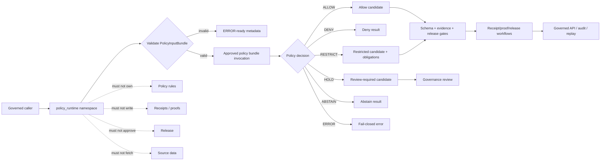

<!-- [KFM_META_BLOCK_V2]
doc_id: kfm://doc/NEEDS-VERIFICATION/packages-policy-runtime-src-policy-runtime-readme
title: Policy Runtime Import Namespace README
type: readme
version: v1
status: draft
owners: OWNER_TBD
created: NEEDS VERIFICATION — target file existed before this repair but contained only placeholder text
updated: 2026-06-14
policy_label: public
related: [packages/policy-runtime/README.md, packages/policy-runtime/src/README.md, packages/envelopes/README.md, packages/evidence/README.md, packages/evidence-resolver/README.md, packages/hashing/README.md, packages/identity/README.md, packages/README.md, docs/doctrine/directory-rules.md, docs/architecture/contract-schema-policy-split.md, contracts/, schemas/contracts/v1/, policy/, data/receipts/, data/proofs/, release/]
tags: [kfm, packages, policy-runtime, import-namespace, opa, policy-input-bundle, policy-decision, allow, deny, restrict, hold, abstain, obligations]
notes: ["Namespace guide for importable policy-runtime helper code.", "This namespace may expose PolicyInputBundle validation, approved policy-bundle invocation, finite decision, obligation, reason-code, receipt-metadata, replay, validation, and synthetic fixture helpers only.", "It must not own policy source rules, schemas, contracts, lifecycle data, receipts, proofs, release decisions, API routes, UI surfaces, source data, credentials, model runtimes, or AI truth claims."]
[/KFM_META_BLOCK_V2] -->

<a id="top"></a>

# `policy_runtime` Import Namespace

Importable helper namespace for KFM policy-runtime primitives: explicit `PolicyInputBundle` validation, approved policy-bundle invocation, finite policy decisions, obligations, reason codes, fail-closed metadata, and replay support.

<p>
  
  
  
  
  
</p>

> [!IMPORTANT]
> **Status:** PROPOSED import-namespace README  
> **Path:** `packages/policy-runtime/src/policy_runtime/README.md`  
> **Owning responsibility root:** `packages/`  
> **Package lane:** `packages/policy-runtime/`  
> **Source envelope:** `packages/policy-runtime/src/`  
> **Import namespace:** `policy_runtime` — NEEDS VERIFICATION against package metadata  
> **Policy rule authority:** `policy/`, not this namespace  
> **Schema authority:** `schemas/contracts/v1/`, not this namespace  
> **Contract authority:** `contracts/`, not this namespace  
> **Receipt/proof authority:** `data/receipts/` and `data/proofs/`, not this namespace  
> **Release authority:** `release/`, not this namespace  
> **Repo implementation depth:** UNKNOWN for module files, exports, tests, package manager, CI workflows, policy-engine bindings, receipts, proof packs, release manifests, branch protections, and runtime behavior.

## Scope

`packages/policy-runtime/src/policy_runtime/` is the proposed importable namespace for reusable policy-evaluation helper code.

It may contain pure, deterministic helpers and constrained evaluator adapters for:

- validating and normalizing explicit `PolicyInputBundle` values;
- invoking approved policy bundles supplied by callers or repo-confirmed bundle paths;
- adapting OPA or an equivalent approved evaluator without making this namespace policy-rule authority;
- mapping evaluator output into finite decision results such as `ALLOW`, `DENY`, `RESTRICT`, `HOLD`, `ABSTAIN`, and `ERROR`;
- preserving bundle id, bundle hash, policy version, evaluator version, input hash, decision hash, reason codes, obligations, review flags, and replay refs;
- representing redaction, generalization, delayed-release, citation-required, review-required, rollback-required, and audience-restriction obligations;
- handling missing policy, invalid input, unsupported evaluator, stale bundle, unresolved evidence, missing rights, sensitive exact location, timeout, release mismatch, or engine failure with fail-closed posture;
- preparing receipt-ready metadata without writing receipts;
- building synthetic no-network fixtures for allowed, denied, restricted, held, abstained, invalid, stale, timeout, and evaluator-error paths.

This namespace must not author policy rules, define schemas, decide release, store lifecycle data, write receipts or proofs, resolve evidence as truth, fetch source data, expose public routes, render UI, or generate truth claims.

## Namespace contract

The namespace is a policy execution helper boundary, not a policy authority boundary.

| Namespace concern | Expected behavior | Authority home |
| --- | --- | --- |
| Policy inputs | Validate and normalize explicit `PolicyInputBundle` candidates. | Schemas and contracts define persisted shape and meaning. |
| Bundle invocation | Execute approved bundle refs and hashes supplied by callers. | `policy/` owns policy source, rule meaning, and bundle promotion. |
| Decisions | Return finite outcomes with reason codes. | Contracts/schemas define meaning; callers enforce gates. |
| Obligations | Preserve redaction, generalization, delay, citation, review, and rollback requirements. | Policy contracts and downstream workflows enforce obligations. |
| Fail-closed behavior | Treat missing support as deny, hold, abstain, or error according to contract. | Policy contracts and governed API envelopes define public behavior. |
| Receipt metadata | Build receipt-ready carriers from explicit inputs. | `data/receipts/` stores receipts; proof homes store proof artifacts. |
| Replay support | Carry bundle hash, input hash, evaluator version, decision hash, and reason codes. | Receipt/proof/release workflows own replay authority. |
| Fixtures | Produce synthetic stable examples for tests only. | `tests/` and `fixtures/`, not production policy decisions. |

## Expected modules

> [!NOTE]
> The tree below is PROPOSED. Confirm actual language, module names, package manager, and tests before treating these as implementation facts.

```text
packages/policy-runtime/src/policy_runtime/
├── README.md              # This file: namespace guide
├── __init__.py            # PROPOSED export boundary
├── inputs.py              # PROPOSED PolicyInputBundle helpers
├── engine.py              # PROPOSED OPA/equivalent invocation adapter
├── decisions.py           # PROPOSED finite decision carriers
├── obligations.py         # PROPOSED obligations/redaction/review helpers
├── reason_codes.py        # PROPOSED stable reason-code helpers
├── receipts.py            # PROPOSED receipt-ready metadata carriers only
├── replay.py              # PROPOSED replay metadata helpers
├── validation.py          # PROPOSED input/output validation helpers
├── fixtures.py            # PROPOSED synthetic fixtures
└── py.typed               # PROPOSED if typed package convention is confirmed
```

Keep implementation smaller than this until schemas, tests, and callers prove the need.

## Allowed exports

| Export family | Examples | Rule |
| --- | --- | --- |
| Input helpers | `PolicyInputBundleCandidate`, `validate_policy_input_bundle`, `normalize_policy_input` | Validate explicit inputs; do not fetch missing context. |
| Engine helpers | `evaluate_policy_bundle`, `PolicyEvaluatorProfile`, `PolicyEngineError` | Invoke approved bundle refs only; fail closed on evaluator failure. |
| Decision helpers | `PolicyDecisionOutcome`, `build_policy_decision`, `decision_to_runtime_outcome` | Return finite decisions; do not approve release. |
| Obligation helpers | `PolicyObligation`, `redaction_obligation`, `review_required_obligation` | Preserve obligations for downstream enforcement. |
| Reason-code helpers | `PolicyReasonCode`, `reason_for_missing_rights`, `reason_for_sensitive_exact_location` | Keep reason codes stable and public-safe. |
| Receipt metadata helpers | `PolicyDecisionMetadata`, `build_policy_receipt_metadata` | Prepare metadata only; do not write receipts. |
| Replay helpers | `PolicyReplayExpectation`, `compare_policy_replay` | Return drift/match states; do not certify release. |
| Validation helpers | `validate_policy_decision`, `check_required_obligations` | Local helper validation only. |
| Fixture helpers | `allow_fixture`, `deny_fixture`, `restrict_fixture`, `engine_error_fixture` | Synthetic and public-safe only. |

## Disallowed exports

Do not export functions or constants that turn this helper namespace into an authority surface.

| Disallowed export | Why |
| --- | --- |
| `write_policy`, `edit_rego`, `promote_policy_bundle` | Policy source and bundle promotion belong under `policy/` and governed workflows. |
| `create_schema`, `create_contract` | Schemas and contracts have dedicated roots. |
| `read_raw`, `fetch_source`, `poll_connector` | Source and lifecycle access belongs to connectors, pipelines, and data roots. |
| `write_receipt`, `write_proof`, `store_evidence_bundle` | Receipts/proofs/evidence storage are separate trust homes. |
| `approve_release`, `publish`, `promote`, `rollback_release` | Release authority belongs under `release/` and governed workflows. |
| `allow_public_without_policy`, `ignore_missing_rights`, `trust_unresolved_evidence` | Missing support must not become implicit allow. |
| `call_model`, `generate_claim`, `summarize_truth` | AI output is interpretive and belongs behind governed AI placement. |
| `bypass_policy`, `force_allow`, `skip_obligations` | Policy bypass violates the trust membrane. |

## Import posture

Preferred imports, subject to package metadata verification:

```python
from policy_runtime.inputs import validate_policy_input_bundle
from policy_runtime.engine import evaluate_policy_bundle
from policy_runtime.decisions import PolicyDecisionOutcome
from policy_runtime.obligations import review_required_obligation
```

Callers should treat policy-runtime output as a candidate for schema validation, evidence checks, receipt/proof persistence, release review, governed API envelope construction, and replay comparison. A policy `ALLOW` is not public truth by itself.

## Policy helper outcomes

| Helper outcome | Use when | Runtime posture |
| --- | --- | --- |
| `ALLOW` | Explicit policy bundle allows the action for the given input and audience. | Candidate only; downstream schema, evidence, release, and receipt gates may still block. |
| `DENY` | Policy blocks the action or sensitive/rights context requires denial. | Deny with stable reason code. |
| `RESTRICT` | Policy permits a transformed, reduced, generalized, redacted, delayed, or audience-limited output. | Apply obligations before publication or rendering. |
| `HOLD` | Review, steward action, missing receipt/proof, or maturity gate is required. | Internal/governance state; not a public allow. |
| `ABSTAIN` | Required evidence, source, rights, policy support, or input context is missing or unresolved. | Fail safe; do not produce authoritative output. |
| `ERROR` | Input, engine, bundle, schema, timeout, or runtime failure prevents a valid decision. | Fail closed with receipt-ready error metadata. |

`ALLOW` is not proof of truth, evidence closure, release, publication, or public safety. It only means the evaluated policy bundle did not block the action under the supplied context.

## Trust-boundary flow



## Development rules

1. Keep the namespace no-network by default, except for ADR-approved local evaluator invocation if added later.
2. Prefer pure normalization/validation functions and explicit engine adapters.
3. Preserve policy bundle id, version, bundle hash, input hash, object refs, source refs, evidence refs, audience, operation, lifecycle phase, rights posture, sensitivity posture, reason codes, obligations, release refs, rollback refs, and correction refs supplied by callers.
4. Do not read from RAW, WORK, QUARANTINE, unpublished candidates, source systems, source credentials, canonical stores, or model runtimes.
5. Do not write lifecycle data, policy source rules, receipts, proofs, release manifests, source registries, catalog records, API responses, or UI components.
6. Do not approve release, publish artifacts, resolve evidence as truth, or generate public claims.
7. Do not create schemas, contracts, policy source rules, source registries, pipeline DAGs, API routes, public answers, release decisions, or connector behavior from this namespace.
8. Do not store raw provider payloads, secrets, private source records, sensitive-location examples, living-person identifiers, DNA/genomic context, or unrestricted sensitive context.
9. Return typed finite outcomes instead of implicit allow, warning-only denial, silent redaction, hidden policy failure, or skipped obligations.
10. Add deterministic tests for every export and every negative path.
11. Keep fixtures synthetic, sanitized, and public-safe.
12. Preserve rollback and correction metadata supplied by callers when policy output can affect downstream publication candidates.

## Validation checklist

- [ ] Confirm this namespace exists in package metadata.
- [ ] Confirm the package import name is actually `policy_runtime`.
- [ ] Confirm `__init__` exports are intentional and minimal.
- [ ] Confirm tests cover `ALLOW`, `DENY`, `RESTRICT`, `HOLD`, `ABSTAIN`, and `ERROR` helper states if implemented.
- [ ] Confirm tests cover missing policy, stale bundle, invalid input, unsupported engine, unresolved evidence, missing rights, sensitive exact location, release mismatch, timeout, and no implicit allow.
- [ ] Confirm helpers do not import connectors, data stores, release writers, model providers, API routers, UI components, credential systems, or receipt/proof stores.
- [ ] Confirm helpers do not access RAW/WORK/QUARANTINE, source systems, credentials, model runtimes, or unpublished candidate stores.
- [ ] Confirm public-facing API routes serialize policy-derived status through governed envelopes and do not expose lifecycle internals.

Suggested inspection commands:

```bash
find packages/policy-runtime/src/policy_runtime -maxdepth 3 -type f | sort
git grep -n "from policy_runtime\|import policy_runtime" -- . 2>/dev/null || true
git grep -n "PolicyInputBundle\|PolicyDecision\|opa\|rego\|ALLOW\|DENY\|RESTRICT\|HOLD\|ABSTAIN\|ERROR" -- packages/policy-runtime tests fixtures docs schemas contracts policy pipelines connectors tools 2>/dev/null || true
```

## Rollback

Rollback is required if this namespace:

- becomes a parallel policy source, schema, contract, policy bundle, source-registry, lifecycle-data, evidence/proof, receipt, release, API, UI, credential, model-runtime, or source-data authority;
- treats missing policy, invalid input, stale bundle, unresolved evidence, sensitive exact location, or rights gaps as implicit allow;
- writes policy rules, lifecycle data, receipts, proofs, release manifests, catalog records, API responses, or public UI state;
- fetches source data or directly reads RAW/WORK/QUARANTINE/unpublished candidates/source systems;
- treats policy allow as proof of truth, evidence closure, admissibility, public safety, or release;
- stores secrets, source credentials, private source records, living-person identifiers, DNA/genomic context, or sensitive-location examples in fixtures.

Rollback target: revert the namespace-source PR, keep generated audit notes as review evidence, and file any authority drift in `docs/registers/DRIFT_REGISTER.md` or `docs/registers/VERIFICATION_BACKLOG.md` if the mounted repo uses those registers.

## Evidence boundary

| Source | Status | Supports | Limits |
| --- | --- | --- | --- |
| Current target file | CONFIRMED | `packages/policy-runtime/src/policy_runtime/README.md` existed and required replacement from placeholder content. | Did not prove namespace implementation maturity. |
| Parent source README | CONFIRMED repo doc | `packages/policy-runtime/src/` is bounded to policy-runtime helper source code. | Does not prove package metadata, imports, tests, or CI. |
| Parent package README | CONFIRMED repo doc | `packages/policy-runtime/` is a shared helper-code package for OPA/equivalent policy-bundle execution against `PolicyInputBundle`. | Does not prove source files or runtime bindings. |
| `packages/README.md` | CONFIRMED repo doc | `packages/` is for shared libraries used by apps, workers, pipelines, and tools. | Does not define this namespace. |
| `docs/doctrine/directory-rules.md` | CONFIRMED repo doctrine | `packages/`, `policy/`, `schemas`, `contracts`, lifecycle data, receipt/proof, and release homes are separate responsibility roots. | Does not prove this namespace is implemented. |
| Current file-generation pass | CONFIRMED request | User-requested target path and README repair/replacement. | Does not inspect package metadata, tests, CI logs, dashboards, deployment posture, runtime behavior, policy bundle promotion, or branch protection. |
