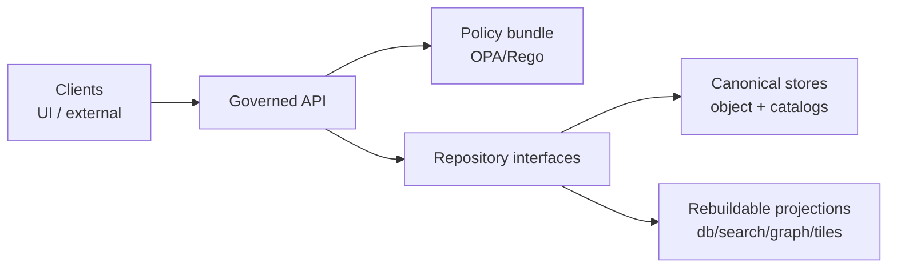
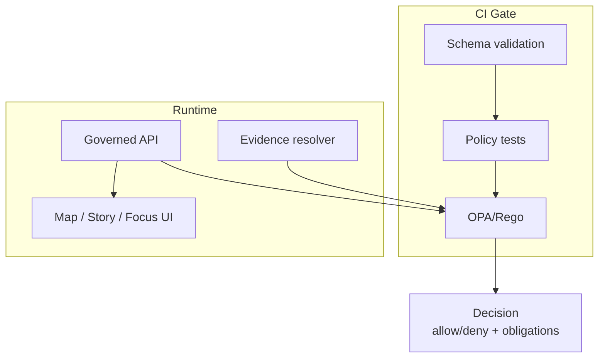

<!-- [KFM_META_BLOCK_V2]
doc_id: kfm://doc/21774c38-08eb-4aa5-bbd9-98475bb96b6f
title: packages/policy — Policy-as-code (OPA/Rego) for KFM
type: standard
version: v1
status: draft
owners: kfm-core (TBD)
created: 2026-02-22
updated: 2026-02-22
policy_label: public
related:
  - kfm://doc/definitive-design-governance-guide-vnext
tags: [kfm, policy, opa, rego, governance, trust-membrane]
notes:
  - This README defines the intended contract for the policy package. Paths marked "(not confirmed in repo)" are placeholders until the repo layout is verified.
[/KFM_META_BLOCK_V2] -->

<a id="top"></a>
# `packages/policy`
**KFM policy bundle + fixtures: the trust-membrane “decision brain” used in CI and runtime.**  
Status: **draft** • Owners: **kfm-core (TBD)**


---

## Quick navigation
- [What this package is for](#what-this-package-is-for)
- [System invariants this package enforces](#system-invariants-this-package-enforces)
- [Directory layout](#directory-layout)
- [Policy labels and obligations](#policy-labels-and-obligations)
- [Roles and actions](#roles-and-actions)
- [Policy decision contract](#policy-decision-contract)
- [How to change policy safely](#how-to-change-policy-safely)
- [Run policy tests locally](#run-policy-tests-locally)
- [Integration points](#integration-points)
- [Governance checklists](#governance-checklists)
- [Glossary](#glossary)

---

## What this package is for

`packages/policy` is the **policy-as-code** bundle for Kansas Frontier Matrix (KFM). It is the single place we encode and test:

- **Authorization decisions** (who can do what to which resource).
- **Promotion Contract gates** (what can be promoted from Raw/Work → Processed/Catalog → Published).
- **Sensitivity & redaction obligations** (what must be generalized, hidden, or “metadata-only”).
- **Licensing & rights enforcement** (what can be mirrored, displayed, exported, or included in stories).
- **Focus Mode guardrails** (cite-or-abstain; block leakage; verify citations).

This package is “small” in code but “large” in impact: it defines **enforceable governance behavior**.

> [!IMPORTANT]
> **Truth discipline:** This README documents the intended policy contract. If your local repo already has a different layout, treat the “Directory layout” section as **proposed** and update it to match reality.

---

## System invariants this package enforces

These are KFM system invariants. Policy is one of the mechanisms that makes them enforceable.

### Trust membrane
Clients (UI / external users) **never** access databases or object stores directly. All access is mediated by a governed API + evidence resolver + policy boundary.



### Same semantics in CI and runtime
Policy must evaluate the **same way** in CI as it does in runtime. At minimum, we reuse the **same fixtures** and expect the **same outcomes** (otherwise CI guarantees are meaningless).

### Fail-closed defaults
- Default is **deny** for restricted and sensitive-location resources.
- If public representation is allowed, publish a separate **`public_generalized`** dataset version.
- Never leak restricted existence via error differences or “ghost metadata”.

### Evidence-first + cite-or-abstain
Where outputs are user-facing (Map / Story / Focus Mode), policy must support:
- Evidence resolution with allow/deny + obligations.
- Focus Mode that must **cite resolvable evidence** or **abstain**.

---

## Directory layout

> **NOTE:** Layout below is **not confirmed in repo**. It is the recommended, buildable structure.

```text
packages/policy/
├─ README.md
├─ rego/                           # OPA/Rego policies (PDP bundle)
│  ├─ authz.rego                   # runtime authorization (API + evidence)
│  ├─ promotion.rego               # promotion gates (Promotion Contract)
│  ├─ licensing.rego               # rights + licensing checks
│  ├─ sensitivity.rego             # sensitive location + generalization rules
│  └─ focus.rego                   # Focus Mode: cite-or-abstain checks
├─ tests/
│  ├─ authz_test.rego
│  ├─ promotion_test.rego
│  └─ fixtures/
│     ├─ allow_public.json
│     ├─ deny_restricted.json
│     └─ public_generalized_obligation.json
├─ vocab/                          # controlled vocabularies (versioned)
│  ├─ policy_label.json
│  ├─ obligation_type.json
│  └─ reason_code.json
├─ rubrics/                        # human-readable guidance used by stewards
│  ├─ licensing.md
│  ├─ sensitivity.md
│  └─ generalization.md
└─ conftest/                       # (optional) CI wiring for Conftest
   └─ policy/                      # symlink or copy of rego bundle
```

---

## Policy labels and obligations

### `policy_label` vocabulary (starter)

The policy label is assigned at promotion time and is surfaced in catalogs and governed API responses.

| policy_label | Meaning | Default posture |
|---|---|---|
| `public` | OK to show in all runtime surfaces | allow read |
| `public_generalized` | Public derivative with generalization/redaction applied | allow read + **obligation notice** |
| `internal` | Visible to authenticated internal roles | deny to public |
| `restricted` | Restricted to stewards/authorized roles | deny-by-default |
| `restricted_sensitive_location` | Restricted; location precision is the risk | deny-by-default + strict “no coords” |
| `embargoed` | Temporarily non-public until date/review | deny-by-default |
| `quarantine` | Failed validation / unclear license / unresolved sensitivity | **must not promote** |

> [!WARNING]
> `quarantine` is a “stop label”: do not serve it from runtime surfaces.

### Obligations

Policy is more than allow/deny. It can return **obligations** the caller must apply (UI notices, field redactions, generalization requirements, etc.).

Common obligation shapes (examples; extend as needed):
- `{"type":"show_notice","message":"Geometry generalized due to policy."}`
- `{"type":"redact_fields","fields":["owner_name","exact_location"]}`
- `{"type":"force_generalization","scheme":"h3","resolution":7}`
- `{"type":"metadata_only"}`

Obligations must be:
- **machine-readable** (API can apply them deterministically),
- **auditable** (logged alongside allow/deny),
- **visible** in UX (without leaking restricted details).

---

## Roles and actions

> This is a **baseline** roles model intended to keep the system buildable. Expand only when required (e.g., partner datasets, ABAC).

Baseline roles (proposed):
- **public**: may read `public` and `public_generalized`.
- **contributor**: may draft dataset specs and stories; cannot publish/promote.
- **steward**: may approve promotion and story publishing; owns policy labels + redaction rules.
- **operator**: may run pipelines and deployments; cannot override policy gates.
- **governance_council**: authority over culturally sensitive materials and any “restricted collection” rules.

Common actions (recommended to standardize early):
- `read`, `list`, `download`, `query`, `tile`, `resolve_evidence`
- `draft_story`, `publish_story`
- `propose_dataset`, `promote_dataset`
- `admin` (restricted; avoid overloading this)

If you add a role or action, you **must**:
1) add/extend fixtures,
2) add tests that cover allow/deny + obligations,
3) ensure callers don’t encode role logic themselves (always ask the PDP).

---

## Policy decision contract

This package is easiest to maintain if we treat policy evaluation as a stable contract.

### Minimal input shape (recommended)
```json
{
  "user": { "role": "public", "groups": [] },
  "action": "read",
  "resource": {
    "kind": "dataset_version",
    "dataset_version_id": "2026-02.abcd1234",
    "policy_label": "public"
  },
  "context": {
    "purpose": "browse",
    "view_state": { "bbox": [ -102.0, 36.9, -94.6, 40.0 ], "time": ["1900-01-01","1901-01-01"] }
  }
}
```

### Minimal output shape (recommended)
```json
{
  "decision": "deny",
  "policy_label": "restricted",
  "obligations": [],
  "reason_codes": ["DEFAULT_DENY"],
  "decision_id": "kfm://policy_decision/xyz"
}
```

### Coding rules
- **Default deny** at the package root (`default allow = false`).
- Provide at least one “golden test” per rule path.
- Never emit obligations that require the UI to infer hidden metadata.

<details>
<summary><strong>Example: minimal authz policy + tests</strong></summary>

```rego
package kfm.authz

default allow = false

# Input shape:
# input.user.role
# input.resource.policy_label
# input.action

allow {
  input.user.role == "steward"
}

allow {
  input.user.role == "public"
  input.action == "read"
  input.resource.policy_label == "public"
}

# Obligation example: public_generalized must show a notice
obligations[o] {
  input.resource.policy_label == "public_generalized"
  o := {"type": "show_notice", "message": "Geometry generalized due to policy."}
}
```

```rego
package kfm.authz_test

import data.kfm.authz

test_public_can_read_public {
  authz.allow with input as {
    "user": {"role": "public"},
    "action": "read",
    "resource": {"policy_label": "public"}
  }
}

test_public_cannot_read_restricted {
  not authz.allow with input as {
    "user": {"role": "public"},
    "action": "read",
    "resource": {"policy_label": "restricted"}
  }
}
```

</details>

---

## How to change policy safely

Policy changes are production changes. Treat them like API changes.

### Definition of done for policy changes
- [ ] A Rego change is paired with **fixtures** and **tests** (allow/deny + obligations).
- [ ] CI runs `opa test` (or equivalent) and **blocks merges** on failures.
- [ ] For any runtime-facing change, there is a **policy-safe error message** plan (no leaked existence).
- [ ] Vocabulary changes (`policy_label`, obligation types, reason codes) are **versioned**.
- [ ] Steward review completed when policy impacts restricted/sensitive collections.

### Promotion Contract impacts
If your change affects promotion, ensure the promotion gate remains fail-closed. Typical checks:
- identity/version IDs present
- processed artifacts exist + digests recorded
- catalogs validate (DCAT/STAC/PROV) + cross-links resolve
- policy label assigned + obligations recorded
- run receipt emitted + approval captured (where required)

---

## Run policy tests locally

> Commands below are examples. Adjust to match your toolchain.

### OPA tests (Rego unit tests)
```bash
opa test -v ./rego ./tests
```

### Conftest checks (CI-style)
```bash
conftest test ./some/artifacts-or-contracts --policy ./rego
```

### Troubleshooting
- If tests are flaky: your fixtures are probably not deterministic.
- If a policy denies unexpectedly: print the evaluated input and add a minimal repro fixture.

---

## Integration points

Policy is evaluated in multiple places; callers must not “re-implement” policy logic.



### Policy enforcement points (PEPs)
- **CI**: blocks merges on invalid contracts / failing policy tests.
- **Governed API**: checks policy before serving datasets, tiles, story content, exports.
- **Evidence resolver**: checks policy before resolving EvidenceRefs into EvidenceBundles.
- **UI**: renders badges and notices; **never** makes decisions.

---

## Governance checklists

### Pre-release governance review
- [ ] Policy reviewed for CARE/consent fields and data sovereignty flags (if applicable).
- [ ] Trust membrane preserved (no direct client → DB/object store paths).
- [ ] Licensing enforcement present for downloads/exports/story publishing.
- [ ] Sensitive location protections tested (no coordinate leakage, no reverse-engineering).
- [ ] Audit expectations met (policy decision logged with allow/deny + obligations + reason codes).

### “Fail closed” checklist (must always hold)
- [ ] Unknown `policy_label` → deny
- [ ] Missing license metadata → quarantine / deny promotion
- [ ] Unclear rights for media → block story publishing
- [ ] EvidenceRef cannot be resolved → deny/abstain (depending on surface)
- [ ] Restricted existence must not be inferable via response differences

---

## Glossary
- **OPA/Rego**: Open Policy Agent and its policy language.
- **PDP**: Policy Decision Point (where policies are evaluated).
- **PEP**: Policy Enforcement Point (where decisions are applied).
- **Obligation**: a required transform or UX notice returned alongside a decision.
- **Policy label**: coarse classification of a dataset/version for access + handling.
- **Promotion Contract**: the fail-closed gates required before serving a dataset in runtime surfaces.

---

**Back to top:** [Quick navigation](#quick-navigation)
