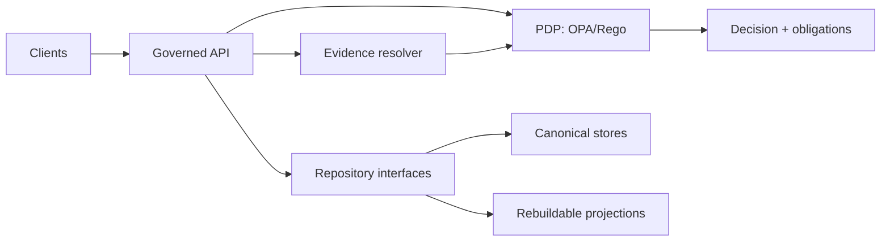

<!-- [KFM_META_BLOCK_V2]
doc_id: kfm://doc/21774c38-08eb-4aa5-bbd9-98475bb96b6f
title: packages/policy — Policy-as-code (OPA/Rego) for KFM
type: standard
version: v2
status: draft
owners: kfm-core (TBD)
created: 2026-02-22
updated: 2026-02-26
policy_label: public
related:
  - kfm://doc/definitive-design-governance-guide-vnext
tags: [kfm, policy, opa, rego, governance, trust-membrane]
notes:
  - Upgraded to align with KFM vNext governance posture (shared CI/runtime semantics; Promotion Contract; Focus Mode cite-or-abstain).
  - Paths marked "(not confirmed in repo)" are placeholders until repo layout is verified.
[/KFM_META_BLOCK_V2] -->

<a id="top"></a>

# `packages/policy`
**KFM policy bundle + fixtures: the trust-membrane “decision brain” used in CI and runtime.**  
Status: **draft** • Owners: **kfm-core (TBD)** • Posture: **fail-closed**


> [!IMPORTANT]
> This directory is **production**. Policy changes alter what can be promoted, served, exported, and cited.

---

## Quick navigation
- [Purpose](#purpose)
- [Where this fits](#where-this-fits)
- [Acceptable inputs](#acceptable-inputs)
- [Exclusions](#exclusions)
- [Non-goals](#non-goals)
- [System invariants enforced](#system-invariants-enforced)
- [Policy domains](#policy-domains)
- [Directory layout](#directory-layout)
- [Controlled vocabularies](#controlled-vocabularies)
- [Policy decision contract](#policy-decision-contract)
- [Policy entry points (stable queries)](#policy-entry-points-stable-queries)
- [CI gates + local testing](#ci-gates--local-testing)
- [Runtime integration (PDP/PEP)](#runtime-integration-pdppep)
- [Change management](#change-management)
- [Governance checklists](#governance-checklists)
- [Glossary](#glossary)

---

## Purpose

`packages/policy` is the **policy-as-code** bundle for Kansas Frontier Matrix (KFM). It is the single place we encode and test:

- **Authorization decisions** (who can do what to which governed resource).
- **Promotion Contract gates** (what can move Raw/Work → Processed/Catalog → Published).
- **Sensitivity & redaction obligations** (what must be generalized, hidden, or “metadata-only”).
- **Licensing & rights enforcement** (what can be mirrored, displayed, exported, or included in stories).
- **Focus Mode guardrails** (cite-or-abstain; block leakage; verify citations).

> [!IMPORTANT]
> **Truth discipline:** this README documents the *intended* contract. If the repo layout differs, treat “Directory layout” as **PROPOSED** and update it to match reality.

---

## Where this fits

This package is a shared contract surface for:
- **CI**: validates schemas/contracts; runs policy tests; blocks merges on deny.
- **Runtime API**: authorizes read/list/query/tile/download/export; returns obligations the API must apply.
- **Evidence resolver**: enforces policy before turning EvidenceRefs into EvidenceBundles.
- **UI surfaces**: show badges + notices only; **UI never decides**.



---

## Acceptable inputs

This directory may contain:

- Rego modules (`.rego`) and policy bundle metadata
- Test fixtures (JSON inputs + expected allow/deny + obligations)
- Versioned controlled vocabularies (policy labels, obligation types, reason codes, actions, roles)
- Human-readable rubrics for stewards (sensitivity, licensing, generalization)
- CI wiring (Conftest policy paths, helper scripts)

---

## Exclusions

**Do NOT** put the following here:

- Secrets, credentials, or private keys
- Dataset content (raw/processed files) or sensitive coordinates
- Application/business logic (belongs in service modules; call the PDP instead)
- “Soft” policy in docs that isn’t enforceable by tests (docs are welcome, but policy must be codified)

---

## Non-goals

- This package does **not** implement auth (OIDC/JWT validation) — it consumes an identity context.
- This package does **not** fetch or resolve evidence — it governs whether evidence may be resolved.
- This package does **not** store or serve data — it returns decisions + obligations callers must apply.

---

## System invariants enforced

### Trust membrane
Clients never access stores directly. All access is mediated by a governed API + evidence resolver + policy boundary.

### Same semantics in CI and runtime
The same policy bundle (or an identical, version-pinned build) must evaluate the same way in CI and runtime. CI guarantees are meaningless if runtime diverges.

### Fail-closed defaults
- Default is **deny** at the policy root.
- Unknown `policy_label` → deny.
- Restricted existence must not be inferable via response differences.
- If any public representation is allowed for a sensitive resource, create a separate `public_generalized` dataset version.

### Evidence-first + cite-or-abstain
User-facing outputs (Map / Story / Focus Mode) must be backed by resolvable evidence. If citations cannot be verified for the requesting role, the system must abstain or reduce scope.

---

## Policy domains

Recommended modules (logical domains; file names are illustrative):

- `authz`: runtime authorization for API + evidence resolver
- `promotion`: Promotion Contract gates (block promotion when required artifacts/metadata are missing)
- `licensing`: rights metadata required for distribution/export/story publishing
- `sensitivity`: sensitive location + redaction/generalization obligations
- `focus`: Focus Mode pre-check + citation verification constraints

---

## Directory layout

> **NOTE:** Layout below is **not confirmed in repo**. It is a recommended, buildable structure.

```text
packages/policy/
├─ README.md
├─ rego/                                  # OPA/Rego policies (policy bundle)
│  ├─ kfm/
│  │  ├─ decision.rego                    # common output shaping (decision + obligations + reason codes)
│  │  ├─ authz.rego                       # runtime authorization
│  │  ├─ promotion.rego                   # Promotion Contract gates
│  │  ├─ licensing.rego                   # licensing + rights enforcement
│  │  ├─ sensitivity.rego                 # sensitive location + generalization rules
│  │  └─ focus.rego                       # Focus Mode cite-or-abstain rules
│  └─ data/                               # OPA "data" docs (static inputs)
│     └─ vocab/                           # versioned vocabularies
│        ├─ policy_label.v1.json
│        ├─ obligation_type.v1.json
│        ├─ reason_code.v1.json
│        ├─ role.v1.json
│        └─ action.v1.json
├─ fixtures/
│  ├─ decisions/                          # input → expected decision fixtures
│  │  ├─ allow_public_read.json
│  │  ├─ deny_restricted_read.json
│  │  ├─ obligations_public_generalized.json
│  │  └─ deny_unknown_policy_label.json
│  └─ promotion/                          # promotion gate fixtures
│     ├─ promote_ok_minimal.json
│     ├─ block_missing_license.json
│     └─ block_missing_catalog_triplet.json
├─ tests/
│  ├─ authz_test.rego
│  ├─ promotion_test.rego
│  ├─ licensing_test.rego
│  ├─ sensitivity_test.rego
│  └─ focus_test.rego
├─ rubrics/                               # human-readable steward guidance (non-executable)
│  ├─ licensing.md
│  ├─ sensitivity.md
│  └─ generalization.md
└─ conftest/                              # CI wiring (optional)
   └─ policy/                             # symlink/copy of rego bundle for conftest
```

---

## Controlled vocabularies

Controlled vocabularies are **versioned inputs** to policy evaluation. They must be:
- deterministic
- human-reviewable
- enforced (unknown value → deny)

### `policy_label` vocabulary (starter)

| policy_label | Meaning | Default posture |
|---|---|---|
| `public` | OK to show in all runtime surfaces | allow read |
| `public_generalized` | Public derivative with generalization/redaction applied | allow read + **obligation notice** |
| `internal` | Visible to authenticated internal roles | deny to public |
| `restricted` | Restricted to authorized roles | deny-by-default |
| `restricted_sensitive_location` | Restricted; location precision is the risk | deny-by-default + strict “no coords” |
| `embargoed` | Temporarily non-public until date/review | deny-by-default |
| `quarantine` | Failed validation / unclear license / unresolved sensitivity | **must not promote** |

> [!WARNING]
> `quarantine` is a “stop label”: it must not be served from runtime surfaces.

### Obligations

Policy is more than allow/deny. It returns **obligations** callers must apply (UI notices, field redactions, generalization requirements, metadata-only mode, etc.).

Common obligation shapes:
- `{"type":"show_notice","message":"Generalized due to policy."}`
- `{"type":"redact_fields","fields":["owner_name","exact_location"]}`
- `{"type":"force_generalization","scheme":"h3","resolution":7}`
- `{"type":"metadata_only"}`

Obligations must be:
- **machine-readable** (API can apply deterministically),
- **auditable** (logged alongside allow/deny),
- **visible** in UX (without leaking restricted details).

---

## Policy decision contract

Treat policy evaluation like a stable API contract.

### Minimal input shape (recommended)
```json
{
  "user": { "role": "public", "groups": [] },
  "action": "read",
  "resource": {
    "kind": "dataset_version",
    "dataset_version_id": "2026-02.abcd1234",
    "policy_label": "public"
  },
  "context": {
    "purpose": "browse",
    "view_state": { "bbox": [-102.0, 36.9, -94.6, 40.0], "time": ["1900-01-01","1901-01-01"] }
  }
}
```

### Minimal output shape (recommended)
```json
{
  "decision": "deny",
  "policy_label": "restricted",
  "obligations": [],
  "reason_codes": ["DEFAULT_DENY"],
  "decision_id": "kfm://policy_decision/xyz"
}
```

### Coding rules (hard requirements)
- `default allow = false` (or equivalent) at every policy root.
- Unknown vocab value → deny with an explicit reason code.
- Never emit obligations that require the UI to infer hidden metadata.
- Prefer **one** canonical “decision object” entry point per domain.

---

## Policy entry points (stable queries)

> This is a **recommendation** to keep policy evaluation stable across callers.

Suggested entry points:
- `data.kfm.authz.decision` → `{"decision":"allow|deny", "obligations":[...], ...}`
- `data.kfm.promotion.decision` → allow/deny promotion + reason codes
- `data.kfm.focus.precheck` → allow/deny query (topic/role constraints) + obligations
- `data.kfm.focus.citation_gate` → verify citations resolve + are allowed for role

Callers should **never** introspect raw rule internals; only consume the stable decision object.

---

## CI gates + local testing

Policy changes must be testable and must block merges when violated.

### Local Rego unit tests
```bash
opa test -v ./rego ./tests
```

### Conftest checks (CI-style)
```bash
conftest test ./path/to/contracts-or-artifacts --policy ./rego
```

### Troubleshooting
- Flaky tests usually mean fixtures aren’t deterministic.
- If a decision surprises you, shrink the fixture until it’s a minimal repro and add it to `fixtures/decisions/`.

---

## Runtime integration (PDP/PEP)

### PDP options
- OPA in-process (library / WASM)
- OPA sidecar

### PEPs (where enforcement happens)
- **CI**: schema validation + policy tests block merges.
- **Runtime API**: policy checks before serving data, tiles, exports, story content.
- **Evidence resolver**: policy checks before resolving EvidenceRefs into bundles.
- **UI**: shows badges/notices only; does not decide.

> [!TIP]
> Log `decision_id`, `policy_label`, `obligations`, and the policy bundle digest for every enforced decision.

---

## Change management

Policy changes are production changes. Treat them like API changes.

### Definition of done for policy changes
- [ ] Rego change paired with fixtures + tests (allow/deny + obligations).
- [ ] CI runs `opa test` (or equivalent) and blocks merges on failures.
- [ ] Vocabulary change is versioned and does not break older data without a migration plan.
- [ ] For runtime-facing changes, error messaging is “policy-safe” (no leaked existence).
- [ ] Steward review completed when change touches restricted/sensitive/rights behavior.

### Rollback posture
- Policy bundle must be version-pinned (by commit or digest).
- A rollback is “swap bundle version and redeploy”; no data rewrites required.

---

## Governance checklists

### Pre-release governance review
- [ ] Same semantics in CI and runtime (fixtures match expected outcomes).
- [ ] Trust membrane preserved (no client → store bypass).
- [ ] Licensing enforcement present for downloads/exports/story publishing.
- [ ] Sensitive location protections tested (no coordinate leakage, no reverse engineering).
- [ ] Audit expectations met (decision logged with allow/deny + obligations + reason codes).

### Fail-closed checklist (must always hold)
- [ ] Unknown `policy_label` → deny
- [ ] Missing license metadata → quarantine / deny promotion
- [ ] Unclear rights for media → block story publishing
- [ ] EvidenceRef cannot be resolved → deny/abstain (depending on surface)
- [ ] Restricted existence not inferable via response differences

---

## Glossary
- **OPA/Rego**: Open Policy Agent and its policy language.
- **PDP**: Policy Decision Point (where policies are evaluated).
- **PEP**: Policy Enforcement Point (where decisions are applied).
- **Obligation**: a required transform or UX notice returned alongside a decision.
- **Policy label**: coarse classification of a dataset/version for access + handling.
- **Promotion Contract**: fail-closed gates required before serving a dataset in runtime surfaces.

---

**Back to top:** [↑](#top)