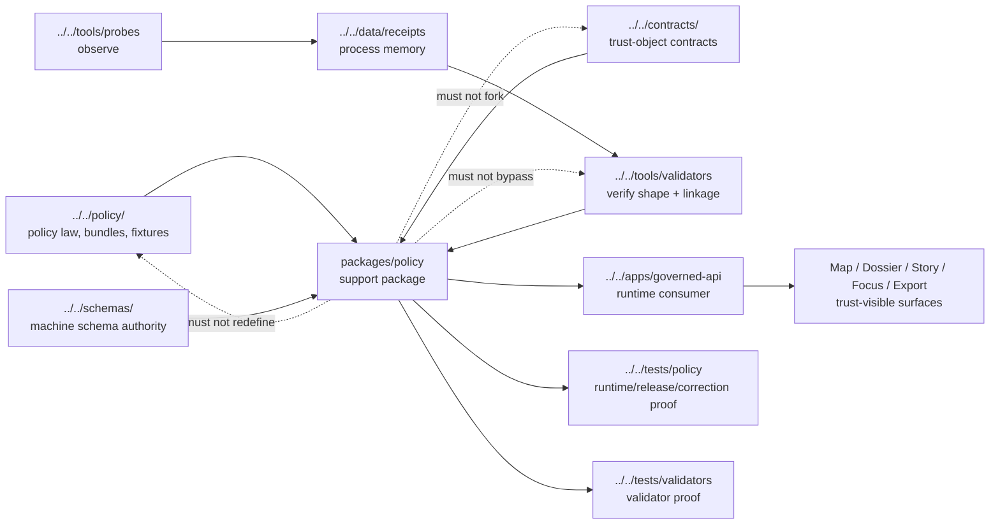

<!-- [KFM_META_BLOCK_V2]
doc_id: kfm://doc/NEEDS_VERIFICATION__packages_policy_readme
title: packages/policy
type: standard
version: v1
status: draft
owners: NEEDS_VERIFICATION__CODEOWNERS_or_package_owners
created: NEEDS_VERIFICATION__file_history
updated: 2026-04-23
policy_label: NEEDS_VERIFICATION__likely_public_doc
related: ["../../README.md", "../README.md", "../../policy/README.md", "../../contracts/README.md", "../../schemas/README.md", "../../tools/validators/README.md", "../../tests/policy/README.md", "../../tests/validators/README.md", "../../data/receipts/README.md", "../../apps/governed-api/README.md", "../../.github/workflows/README.md"]
tags: [kfm, policy, package, governance, runtime-boundary]
notes: ["doc_id, owners, created date, policy_label, package manager, and active-branch inventory need verification before merge", "packages/policy is documented here as shared internal policy-support code, not as repo-authoritative policy law", "Relative links follow documented KFM lane topology and must be rechecked against the active branch"]
[/KFM_META_BLOCK_V2] -->

<a id="top"></a>

# packages/policy

Shared internal policy-support package for loading, adapting, and applying KFM policy decisions without becoming the policy authority.

> [!IMPORTANT]
> **Status:** `experimental`  
> **Owners:** `NEEDS_VERIFICATION`  
> **Path:** `packages/policy/README.md`  
>       
> **Repo fit:** child of [`../README.md`](../README.md); downstream support seam for [`../../policy/README.md`](../../policy/README.md); contract and schema boundaries at [`../../contracts/README.md`](../../contracts/README.md) and [`../../schemas/README.md`](../../schemas/README.md); proof lanes at [`../../tests/policy/README.md`](../../tests/policy/README.md) and [`../../tests/validators/README.md`](../../tests/validators/README.md).  
> **Quick jumps:** [Scope](#scope) · [Repo fit](#repo-fit) · [Inputs](#accepted-inputs) · [Exclusions](#exclusions) · [Directory tree](#directory-tree) · [Diagram](#diagram) · [Usage](#usage) · [Gates](#gates-and-definition-of-done) · [FAQ](#faq)

> [!WARNING]
> This package may help runtimes consume policy consistently. It must not quietly become a second policy home, schema registry, validator lane, or hidden workflow engine.

---

## Scope

`packages/policy` is the **shared internal support boundary** for KFM policy consumption.

It may contain code that helps governed services load policy artifacts, normalize policy inputs, adapt policy engines, assemble decision results, and apply obligations. It should make policy easier to use correctly across runtime seams, not redefine what policy means.

### Evidence posture used here

| Label | Meaning in this README |
|---|---|
| **CONFIRMED** | Supported by attached KFM doctrine or adjacent repo-facing documentation surfaced in this session |
| **INFERRED** | Strongly implied by KFM doctrine and adjacent documentation, but not proven as mounted implementation |
| **PROPOSED** | A commit-ready structure or practice that fits KFM doctrine but is not asserted as current branch reality |
| **UNKNOWN** | Not verified because the active package tree, tests, workflows, runtime logs, or package manager were not mounted |
| **NEEDS VERIFICATION** | Branch-specific detail that must be checked before merge |

### Boundary commitments

| Commitment | Practical consequence |
|---|---|
| Policy law stays upstream | Rule packs, checked-in policy data, decision vocabularies, and policy fixtures belong under [`../../policy/`](../../policy/) unless the active branch documents a narrower exception |
| Contracts and schemas stay singular | Shared trust-object shapes belong under [`../../contracts/`](../../contracts/) and [`../../schemas/`](../../schemas/); this package consumes them |
| Validators verify before policy decides | This package should receive shaped, validated inputs; it should not compensate for malformed upstream artifacts |
| Runtime outcomes stay finite | Claim-bearing runtime behavior should preserve explicit outcomes such as `ANSWER`, `ABSTAIN`, `DENY`, and `ERROR` where those contracts apply |
| Obligations are not optional side effects | Obligation handling should be visible, testable, and traceable to the policy result that required it |
| No raw trust bypass | This package must not create normal paths from public/runtime surfaces to RAW, WORK, QUARANTINE, or unpublished candidate stores |

[Back to top](#top)

---

## Repo fit

This package sits between **policy authority** and **runtime consumption**.

| Direction | Surface | Relationship |
|---|---|---|
| Upstream | [`../../README.md`](../../README.md) | Root KFM identity and repo-wide orientation |
| Upstream | [`../README.md`](../README.md) | Parent package index and package-boundary expectations |
| Authority source | [`../../policy/README.md`](../../policy/README.md) | Policy law, policy data, bundles, fixtures, tests, and runtime-policy coordination remain upstream |
| Authority source | [`../../contracts/README.md`](../../contracts/README.md) | Trust-object contracts such as decision, runtime, evidence, review, release, and correction envelopes |
| Authority source | [`../../schemas/README.md`](../../schemas/README.md) | Machine-schema authority and schema-home boundary guidance |
| Input-adjacent | [`../../tools/probes/README.md`](../../tools/probes/README.md) | Probes observe and emit process memory; they do not decide policy |
| Input-adjacent | [`../../tools/validators/README.md`](../../tools/validators/README.md) | Validators shape-check and link-check before policy consumption |
| Process memory | [`../../data/receipts/README.md`](../../data/receipts/README.md) | Receipts record process memory consumed by validation and policy chains |
| Runtime consumer | [`../../apps/governed-api/README.md`](../../apps/governed-api/README.md) | Governed API may consume this package for policy decision support; route behavior remains app-owned |
| Proof lane | [`../../tests/policy/README.md`](../../tests/policy/README.md) | Repo-facing proof that policy behavior survives runtime, release, and correction pressure |
| Proof lane | [`../../tests/validators/README.md`](../../tests/validators/README.md) | Validator-facing proof that checked-in policy inputs remain machine-valid and fail closed |
| Guardrail | [`../../.github/workflows/README.md`](../../.github/workflows/README.md) | Workflow documentation and future gate burden; not proof of checked-in merge-blocking YAML by itself |

> [!NOTE]
> Active-branch presence of these linked files remains **NEEDS VERIFICATION** in this session. Keep links relative, then run a link check in the real checkout before merge.

[Back to top](#top)

---

## Accepted inputs

`packages/policy` should stay narrow: support code, adapters, helpers, and package-local tests only.

| Input class | What belongs here | Examples |
|---|---|---|
| Policy engine adapters | Code that invokes a policy engine without relocating rule authority | OPA/Rego adapter, in-process evaluator wrapper, subprocess adapter |
| Bundle loaders | Code that locates and loads upstream policy bundles or policy data | manifest loader, bundle reference resolver, policy path resolver |
| Policy input builders | Helpers that assemble already-validated input envelopes for evaluation | `DecisionEnvelope` input mapper, receipt-to-policy input mapper |
| Result normalizers | Code that normalizes engine-specific output into repo contracts | decision result normalization, reason/obligation sorting |
| Obligation helpers | Code that applies or routes obligations after policy decision | audit requirement helper, citation requirement helper, redaction obligation router |
| Runtime mediation helpers | Small utilities that make governed API/runtime policy consumption consistent | policy precheck helper, postcheck helper, denial result factory |
| Package-local tests | Tests for package helpers, not proof that repo-wide policy enforcement is complete | adapter unit tests, fixture-based normalizer tests |
| Minimal package docs | Boundary and integration notes for maintainers | adapter rationale, dependency notes, migration notes |

### Working placement rule

If the change defines **what policy means**, put it in [`../../policy/`](../../policy/).  
If the change defines **shared object shape**, put it in [`../../contracts/`](../../contracts/) or [`../../schemas/`](../../schemas/).  
If the change defines **how app/runtime code consumes a policy result consistently**, this package may be the right home.

[Back to top](#top)

---

## Exclusions

| Does **not** belong in `packages/policy` | Put it instead | Why |
|---|---|---|
| Authoritative rule packs or bundle law | [`../../policy/bundles/`](../../policy/bundles/) | Package code should not hide policy law inside helpers |
| Policy fixtures that prove allow/deny semantics | [`../../policy/fixtures/`](../../policy/fixtures/) | Fixture visibility belongs with the policy lane |
| Bundle-local assertions | [`../../policy/tests/`](../../policy/tests/) | Seam-local policy proof should stay near policy law |
| Repo-facing policy proof | [`../../tests/policy/`](../../tests/policy/) | Runtime, release, and correction pressure tests need repo-level scope |
| Validator or promotion-gate proof | [`../../tests/validators/`](../../tests/validators/) | Validator proof is not package implementation |
| Canonical JSON Schema or OpenAPI definitions | [`../../contracts/`](../../contracts/) and [`../../schemas/`](../../schemas/) | Object shape should not drift into a support package |
| Probe freshness or drift logic | [`../../tools/probes/`](../../tools/probes/) | Probes observe; they should not become package-local side effects |
| Validator shape/linkage logic | [`../../tools/validators/`](../../tools/validators/) | Validators verify; policy decides |
| API route handlers or middleware ownership | `../../apps/` surfaces | Enforcement entrypoints are app-owned even when they call this package |
| UI trust cues or Evidence Drawer rendering | UI/app surfaces | The interface reflects trust state; this package does not render it |
| RAW, WORK, QUARANTINE, PROCESSED, CATALOG, or PUBLISHED artifacts | [`../../data/`](../../data/) | Policy support code is not a data lifecycle zone |
| Secrets, tokens, `.env` files, or live credentials | Secret manager / host config | Sensitive operational material must not live in a shared package |

[Back to top](#top)

---

## Directory tree

### Current target

```text
packages/
└── policy/
    └── README.md
```

### Possible implementation shape (**PROPOSED — adapt after active-branch inspection**)

```text
packages/
└── policy/
    ├── README.md
    ├── decision_engine/
    │   └── README.md
    ├── opa/
    │   └── README.md
    ├── adapters/
    │   └── README.md
    ├── obligations/
    │   └── README.md
    ├── inputs/
    │   └── README.md
    ├── results/
    │   └── README.md
    └── tests/
        └── README.md
```

> [!CAUTION]
> The tree above is a starter map, not a branch inventory claim. Do not create subdirectories merely to match this README; create them only when paired with contracts, tests, and a concrete consumer.

[Back to top](#top)

---

## Diagram


```mermaid
flowchart LR
  Policy["../../policy/<br/>policy law, bundles, fixtures"] --> Package["packages/policy<br/>support package"]
  Contracts["../../contracts/<br/>trust-object contracts"] --> Package
  Schemas["../../schemas/<br/>machine schema authority"] --> Package

  Probes["../../tools/probes<br/>observe"] --> Receipts["../../data/receipts<br/>process memory"]
  Receipts --> Validators["../../tools/validators<br/>verify shape + linkage"]
  Validators --> Package

  Package --> Apps["../../apps/governed-api<br/>runtime consumer"]
  Apps --> UI["Map / Dossier / Story / Focus / Export<br/>trust-visible surfaces"]

  Package --> TestsPolicy["../../tests/policy<br/>runtime/release/correction proof"]
  Package --> TestsValidators["../../tests/validators<br/>validator proof"]

  Package -. "must not redefine" .-> Policy
  Package -. "must not fork" .-> Contracts
  Package -. "must not bypass" .-> Validators
```

The package belongs in the middle: after validation, below policy authority, and before governed runtime consumption.

[Back to top](#top)

---

## Usage

### Add or change a policy-support helper

1. Identify the upstream authority first: policy bundle, checked-in policy data, contract, schema, or validator output.
2. Confirm the helper does not introduce a new allow/deny meaning, outcome, reason code, obligation code, or schema shape.
3. Add package-local tests for helper behavior.
4. Add repo-facing tests if runtime, release, or correction behavior changes.
5. Update this README or the relevant child README when the package boundary changes.
6. Link the change to the affected policy, contract, schema, validator, and consuming app surface.

### Evaluate policy through the package

Illustrative flow only:

```text
validated_input
  -> resolve policy artifact or bundle reference
  -> evaluate through package adapter
  -> normalize reasons and obligations
  -> emit contract-shaped decision result
  -> route obligations to governed runtime consumer
  -> record audit/receipt effects through the owning surface
```

The package may implement the adapter and normalization portions. It should not own the upstream policy artifact, the schema, the app route, or the receipt store.

### Safe inspection commands

Run from the repository root after the active branch is mounted:

```bash
git status --short
test -f packages/policy/README.md
find packages/policy -maxdepth 3 -type f | sort
find policy contracts schemas tools tests apps data -maxdepth 3 -type f | sort | sed -n '1,160p'
```

These commands inspect state only. They do not prove policy enforcement, workflow gating, or runtime behavior.

[Back to top](#top)

---

## Interfaces this package should respect

| Object or surface | Package responsibility | What remains outside this package |
|---|---|---|
| `DecisionEnvelope` / policy decision result | Normalize or adapt results into the expected shape | Authoritative contract/schema definition |
| `RuntimeResponseEnvelope` | Preserve finite outward runtime result semantics when used by runtime consumers | API route ownership and public response release |
| `EvidenceBundle` / `EvidenceRef` | Carry policy-relevant references without resolving raw truth directly | Evidence resolution and canonical evidence storage |
| `ReviewRecord` / review posture | Carry review requirements and obligations | Human/steward review workflow authority |
| `ReleaseManifest` / proof pack | Preserve release decision requirements | Promotion gate, proof pack creation, release action |
| `CorrectionNotice` | Preserve withdrawal/supersession obligations | Correction workflow and published-state mutation |
| Receipts | Consume receipt-shaped inputs after validation, or route obligation effects | Receipt storage, receipt schema, and receipt proof |

[Back to top](#top)

---

## Gates and definition of done

A change to `packages/policy` is ready for review only when the relevant checks below are true.

- [ ] The change names the upstream policy, contract, schema, or validator surface it depends on.
- [ ] No new policy law is hidden inside package helper code.
- [ ] No second authoritative reason-code, obligation-code, rights, sensitivity, review, or release vocabulary is created here.
- [ ] Package-local tests cover success and failure behavior.
- [ ] Runtime, release, or correction changes add or update repo-facing proof in [`../../tests/policy/`](../../tests/policy/).
- [ ] Validator or shape/linkage changes add or update proof in [`../../tests/validators/`](../../tests/validators/).
- [ ] Missing evidence, unresolved rights, unresolved sensitivity, malformed input, and policy-engine failure fail closed.
- [ ] Public/runtime code still receives finite, contract-shaped outcomes.
- [ ] No helper reads RAW, WORK, QUARANTINE, or unpublished candidate stores as a normal path.
- [ ] Obligations remain visible enough for audit, review, and correction.
- [ ] Relative links and package-manager commands were verified in the active branch.

[Back to top](#top)

---

## FAQ

### Is `packages/policy` the authoritative policy home?

No. It is a support package. Policy law and reviewable rule/data surfaces belong under [`../../policy/`](../../policy/) unless a later ADR documents a narrower exception.

### Can this package contain OPA/Rego-related code?

Yes, if it is adapter or integration code. Authoritative rule bundles, fixtures, and policy tests should remain in the policy and proof lanes.

### What wins if package behavior and `policy/` disagree?

Treat it as a package defect or contract drift. Fix the adapter, normalizer, tests, or contract reference. Do not patch runtime behavior to silently override policy authority.

### Is current package implementation confirmed?

UNKNOWN. This README is repo-ready boundary documentation for `packages/policy/README.md`. Active files, package manager, exports, tests, and consumers require branch inspection before merge.

### Where should a new denial reason or obligation code go?

Not here by default. Add or version the authoritative vocabulary in the appropriate policy, contract, or schema home, then update this package to consume it.

[Back to top](#top)

---

## Appendix

<details>
<summary><strong>First useful implementation increments (PROPOSED)</strong></summary>

| Increment | Why it is small and useful | Proof expected |
|---|---|---|
| Policy-result normalizer | Prevents app/runtime consumers from hand-rolling decision parsing | Package-local positive/negative tests |
| Bundle reference resolver | Keeps rule lookup consistent without moving rule authority | Tests with valid and invalid references |
| OPA/Rego adapter wrapper | Makes the policy engine replaceable behind a stable package seam | Adapter tests plus fail-closed engine-unavailable case |
| Obligation router helper | Keeps follow-up obligations explicit and testable | Tests for citation, audit, redaction, and review obligations |
| Runtime precheck/postcheck helper | Gives governed API a consistent policy touchpoint | Repo-facing proof in `tests/policy` once an app consumer exists |

</details>

<details>
<summary><strong>Maintainer review prompts</strong></summary>

- Does this change make policy easier to consume, or does it redefine policy?
- Is the upstream policy/contract/schema link explicit?
- Is failure handled as `DENY`, `ABSTAIN`, or `ERROR` rather than implicit allow?
- Are obligations visible outside the package?
- Could a future maintainer remove this helper without losing policy authority?
- Are tests local enough to prove helper behavior and broad enough to prove runtime pressure?

</details>

[Back to top](#top)
