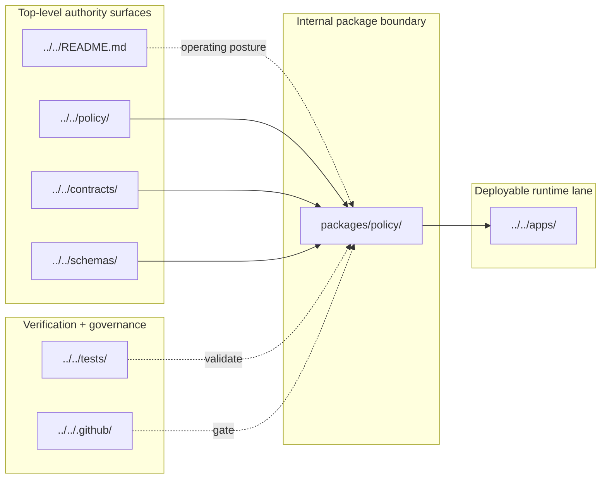

<a id="top"></a>

# `packages/policy/`
Shared internal policy-support boundary for KFM package code that helps governed runtimes consume policy consistently without relocating the repo-authoritative policy surface.


| Field | Value |
|---|---|
| Status | `experimental` package surface · `review` README revision |
| Owners | [`@bartytime4life`](../../.github/CODEOWNERS) *(fallback owner verified in `CODEOWNERS`)* |
| Path | [`packages/policy/README.md`](./README.md) |
| Baseline | [`../README.md`](../README.md) for package-boundary law, plus [`../../policy/README.md`](../../policy/README.md) for the repo-authoritative policy lane |
| Repo fit | child package boundary inside [`../`](../) that should remain subordinate to [`../../policy/`](../../policy/), [`../../contracts/`](../../contracts/), [`../../schemas/`](../../schemas/), and deployable runtime surfaces under [`../../apps/`](../../apps/) |
| Current repo evidence | `packages/policy/` resolves on `main`; current visible content is scaffold-level README text only |
| Truth posture | `CONFIRMED` current path + neighboring docs · `INFERRED` package-local role · `PROPOSED` deeper growth shape |
| Quick jump | [Scope](#scope) · [Evidence posture](#evidence-posture-used-in-this-readme) · [Repo fit](#repo-fit) · [Accepted inputs](#accepted-inputs) · [Exclusions](#exclusions) · [Current package surface](#current-package-surface) · [Directory tree](#directory-tree) · [Quickstart](#quickstart) · [Usage](#usage) · [Diagram](#diagram) · [Boundary matrix](#boundary-matrix) · [Task list](#task-list) · [FAQ](#faq) · [Appendix](#appendix) |

---

> [!IMPORTANT]
> `packages/policy/` is **not** the repo’s authoritative policy home. In the current repo, that role stays with [`../../policy/`](../../policy/). This package is for shared internal policy-support logic, not for a second policy source of truth.

> [!WARNING]
> Do **not** use this directory as a side door around the trust membrane. No package-local code here should create a hidden client-to-store path, a shadow policy path, or public route behavior that bypasses governed app surfaces in [`../../apps/`](../../apps/).

> [!NOTE]
> Current public repo inspection has **not** yet confirmed a package manifest, `src/`, tests, fixtures, or real consumer imports beneath this directory. Keep all such claims at `UNKNOWN` or `NEEDS VERIFICATION` until the mounted tree proves them.

## Scope

`packages/policy/` should hold **shared internal policy adapters, obligation helpers, and policy-support logic** used by governed KFM runtimes.

Its job is to keep reusable policy-aware behavior bounded, inspectable, and reviewable without smearing that behavior across deployable apps or quietly relocating authority away from top-level policy, contracts, schemas, and governed data surfaces.

A healthy package here stays:

- **internal** rather than route-facing
- **shared** rather than one-off app glue
- **policy-aware** rather than policy-sovereign
- **bounded** rather than trust-mixing

## Evidence posture used in this README

| Label | Meaning here |
|---|---|
| `CONFIRMED` | directly supported by current public repo paths or neighboring repo docs inspected for this revision |
| `INFERRED` | strongly suggested by neighboring repo docs or attached KFM doctrine, but not re-proven beneath this directory |
| `PROPOSED` | recommended future shape or reviewable boundary rule, not current-tree fact |
| `UNKNOWN` | not established strongly enough in the current inspection to present as settled reality |
| `NEEDS VERIFICATION` | important enough that this README should not upgrade it without another tree check |

## Repo fit

### Relationship map

| Direction | Path | Role | Current certainty |
|---|---|---|---|
| Parent package contract | [`../README.md`](../README.md) | package-family boundary law and child-package expectations | `CONFIRMED` |
| Repo root posture | [`../../README.md`](../../README.md) | repo-wide verification-first operating frame | `CONFIRMED` |
| Policy authority | [`../../policy/README.md`](../../policy/README.md) | repo-authoritative policy surface | `CONFIRMED` |
| Contract neighbors | [`../../contracts/README.md`](../../contracts/README.md) · [`../../schemas/README.md`](../../schemas/README.md) | canonical machine-contract and schema-adjacent lanes | `CONFIRMED` |
| Runtime lane | [`../../apps/README.md`](../../apps/README.md) | deployable runtime surfaces that may consume shared helpers from packages | path `CONFIRMED` · actual imports `UNKNOWN` |
| Verification + governance | [`../../tests/README.md`](../../tests/README.md) · [`../../.github/README.md`](../../.github/README.md) | tests, fixtures, and merge-gate context | `CONFIRMED` |

### Naming note

The mounted repo path is **`packages/policy/`**.

The attached KFM design corpus also uses a package-local policy-runtime seam as a doctrinal reference point. This README documents the current mounted path, keeps terminology stable, and treats any mapping to a doctrinal `policy-runtime` label as **`INFERRED`**, not as a silent rename.

[Back to top](#top)

## Accepted inputs

The following belong here when they are real, shared, and package-scoped:

- internal adapters that translate authoritative policy outputs into package-local types or helpers
- reusable decision, reason, and obligation normalization logic
- shared helpers for finite policy outcomes and policy-safe error shaping
- import-safe wrappers that help governed runtimes consume top-level policy or contract surfaces
- package-local fixtures, examples, and tests that prove this package’s own contract
- export maps and local docs that explain the package boundary clearly

## Exclusions

| Do **not** put this here | Put it here instead | Why |
|---|---|---|
| repo-authoritative policy bundles, rule files, fixtures, or canonical policy docs | [`../../policy/`](../../policy/) | keeps one visible policy authority surface |
| canonical schemas, vocabularies, or contract families | [`../../contracts/`](../../contracts/) · [`../../schemas/`](../../schemas/) | avoids parallel schema or vocabulary universes |
| public or internal API routes, app entrypoints, workers, or CLI runtime boundaries | [`../../apps/`](../../apps/) | deployable runtime surfaces belong in app lanes |
| repo-wide policy gates, workflow wiring, or merge controls | [`../../tests/`](../../tests/) · [`../../.github/`](../../.github/) | verification and CI/CD should stay visible and centralized |
| release artifacts, receipts, evidence bundles, catalogs, or published data | [`../../data/`](../../data/) | package code is not the release-bearing artifact home |
| environment-specific wiring, secrets, or infrastructure overlays | [`../../infra/`](../../infra/) or external secret management | package code must remain portable and auditable |

## Current package surface

| Item | Present on `main` | Current visible state | Reading rule |
|---|---|---|---|
| [`./README.md`](./README.md) | Yes | scaffold title plus a one-sentence directory contract | safe to deepen into a real package README |
| package manifest (`package.json`, `pyproject.toml`, etc.) | `NEEDS VERIFICATION` | not visible in the current public inspection | do not document install/build commands as current reality |
| `src/`, `tests/`, `fixtures/`, or `examples/` | `NEEDS VERIFICATION` | not visible in the current public inspection | keep deeper layout claims labeled `PROPOSED` |
| real consumer imports from `apps/` or other packages | `UNKNOWN` | not proven in the current inspection | link consumers as adjacent surfaces, not as confirmed imports |

## Directory tree

### Current repo-visible tree

```text
packages/policy/
└── README.md
```

<details>
<summary><strong>Doctrine-aligned growth shape (PROPOSED, not current-tree fact)</strong></summary>

```text
packages/policy/
├── README.md
├── package.json
├── src/
│   ├── decision/
│   ├── obligations/
│   ├── adapters/
│   ├── runtime/
│   └── index.ts
├── tests/
│   ├── unit/
│   └── fixtures/
└── examples/
```

Use this only as a reviewable direction for future growth. Do not treat it as current implementation evidence.

</details>

## Quickstart

From the repo root, inspect first and upgrade claims second.

There is intentionally **no package-specific install, build, or test command here yet**, because a package manifest and runnable local inventory have not been confirmed for this directory.

```bash
# inspect what this package actually contains today
find packages/policy -maxdepth 4 -type f | sort

# read the local and neighboring boundary docs
sed -n '1,220p' packages/policy/README.md
sed -n '1,260p' packages/README.md
sed -n '1,220p' policy/README.md
sed -n '1,220p' apps/README.md
sed -n '1,220p' contracts/README.md
sed -n '1,220p' schemas/README.md
sed -n '1,220p' tests/README.md
sed -n '1,120p' .github/CODEOWNERS

# verify whether deeper implementation exists before documenting it
find packages/policy -maxdepth 4 \
  \( -name package.json -o -name pyproject.toml -o -name Cargo.toml -o -name go.mod -o -name tsconfig.json \) \
  | sort

# trace policy-facing vocabulary across the repo
grep -RIn \
  'DecisionEnvelope\|RuntimeResponseEnvelope\|EvidenceBundle\|reason_codes\|obligation_codes\|policy_bundle_version' \
  packages policy contracts schemas apps tests docs 2>/dev/null || true
```

[Back to top](#top)

## Usage

### What good package-local code looks like

Good code in `packages/policy/` is usually:

- small enough to review as an internal boundary
- shared across more than one governed surface
- subordinate to stronger top-level policy and contract authority
- explicit about negative outcomes, reasons, and obligations

### Boundary rules

1. **Consume authoritative policy; do not redefine it.**  
   This package may help interpret or apply policy outputs, but it should not become a shadow source of truth.

2. **Preserve visible reasons and obligations.**  
   If a caller needs to know *why* something was denied, generalized, restricted, or sent to review, package code should help carry that information through rather than swallowing it.

3. **Keep exports narrow.**  
   A healthy package surface is small, typed, and obviously internal.

4. **Keep public behavior in app surfaces.**  
   Routes, review flows, and runtime entrypoints belong in `apps/`, even when they reuse helpers from this directory.

5. **Document boundary shifts before they spread.**  
   If this package starts owning bundle loading, public-contract consequences, or runtime-policy orchestration, update neighboring docs and raise an ADR.

### Illustrative helper shape

The example below is **illustrative only**. It shows the kind of narrow helper surface that fits this directory without claiming that the repo already implements it.

```ts
export interface PolicyDecisionLike {
  result: "allow" | "deny" | "generalize" | "restrict" | "review_required";
  reason_codes: string[];
  obligation_codes: string[];
  policy_bundle_version: string;
}

export function requireVisibleOutcome(decision: PolicyDecisionLike) {
  if (decision.reason_codes.length === 0) {
    throw new Error("missing reason_codes");
  }

  if (decision.result !== "allow" && decision.obligation_codes.length === 0) {
    throw new Error("missing obligation_codes for non-allow result");
  }

  return decision;
}
```

### Change discipline

When this package changes in a non-trivial way, the surrounding evidence should usually change with it:

- package-local tests or fixtures
- neighboring README updates when the boundary changes
- contract or schema updates when types become externally significant
- ADRs when the package begins to own architecture-significant policy behavior
- rollback notes when public or review consequences change

## Diagram


```mermaid
flowchart LR
  subgraph Authority["Top-level authority surfaces"]
    Root["../../README.md"]
    Policy["../../policy/"]
    Contracts["../../contracts/"]
    Schemas["../../schemas/"]
  end

  subgraph Package["Internal package boundary"]
    Pkg["packages/policy/"]
  end

  subgraph Runtime["Deployable runtime lane"]
    Apps["../../apps/"]
  end

  subgraph Verify["Verification + governance"]
    Tests["../../tests/"]
    GitHub["../../.github/"]
  end

  Root -. operating posture .-> Pkg
  Policy --> Pkg
  Contracts --> Pkg
  Schemas --> Pkg
  Pkg --> Apps
  Tests -. validate .-> Pkg
  GitHub -. gate .-> Pkg
```

Diagram note: the arrows show the **intended boundary direction** for this README. They do **not** claim a currently verified import graph.

## Boundary matrix

| Responsibility | Fits here? | Notes |
|---|---|---|
| shared policy adapters and helper functions | Yes | keep them internal and reusable |
| decision / reason / obligation normalization | Yes | helper logic only; do not redefine canonical registries silently |
| package-local tests and fixtures | Yes | especially for negative paths and fail-closed behavior |
| bundle-loading wrappers | Maybe | only if they stay subordinate to top-level policy authority and stay well-documented |
| `.rego` bundles or canonical rule files | Usually no | top-level `policy/` remains the authoritative policy lane unless the repo boundary changes explicitly |
| public route handlers or runtime entrypoints | No | deployable surfaces belong in `apps/` |
| release artifacts, evidence bundles, receipts, or manifests | No | those are trust-bearing outputs, not package internals |

[Back to top](#top)

## Task list

### Definition of done for real package expansion

| Gate | Done when |
|---|---|
| Truth | no second policy source of truth has been introduced |
| Surface | package exports are narrow, documented, and obviously internal |
| Tests | allow / deny / generalize / restrict / review-required cases are covered |
| Consumers | at least one real consumer path is documented and reviewable |
| Docs | neighboring READMEs are updated if this boundary changes |
| Rollback | previous behavior or import path can be restored without guesswork |

### Review checklist

- [ ] Reinspect the directory contents before claiming implementation depth.
- [ ] Keep top-level [`../../policy/`](../../policy/) as the authoritative policy surface.
- [ ] Add package-local tests and fixtures before broadening package responsibility.
- [ ] Document real consumers once imports exist.
- [ ] Update [`../README.md`](../README.md) if this package’s role changes materially.
- [ ] Update [`../../policy/README.md`](../../policy/README.md) if authority boundaries move.
- [ ] Raise an ADR if this package starts owning bundle loading, public-contract behavior, or runtime-policy orchestration.

## FAQ

### Why not store policy bundles here?

Because the repo already keeps policy authority visible at the top level. This package may support that authority, but it should not hide it or split it.

### Is this the same thing as `policy-runtime` in the manuals?

It is the closest doctrinal analogue, not a silent rename. The mounted repo path is `packages/policy/`, and this README documents that path as-is.

### Can this package own public request behavior?

No. Public and steward-facing request families belong in governed app surfaces. This package may supply helpers, adapters, or shared types, but not the public runtime boundary itself.

### What would count as real implementation proof here?

A visible package manifest, source files, tests or fixtures, and at least one reviewable consumer import path in the mounted tree.

## Appendix

<details>
<summary><strong>Truth labels used in this README</strong></summary>

| Label | Meaning in this file |
|---|---|
| `CONFIRMED` | visible in the current public repo tree or neighboring repo docs |
| `INFERRED` | strongly suggested by neighboring docs or attached doctrine, but not directly proven under this directory |
| `PROPOSED` | a future shape or rule recommended for review, not a current-tree fact |
| `UNKNOWN` | not proven in the current inspection |
| `NEEDS VERIFICATION` | likely important enough that this README should not upgrade it without another tree check |

</details>

<details>
<summary><strong>Open verification backlog</strong></summary>

- confirm whether the mounted working tree contains package code beyond `README.md`
- confirm whether any real imports target `packages/policy/`
- reconcile the current directory name `policy` with the doctrinal `policy-runtime` seam before any rename
- add package-specific execution or test commands only after a real package manifest appears
- narrow ownership beyond the repo-wide fallback if a more specific `CODEOWNERS` rule is introduced

</details>

[Back to top](#top)
