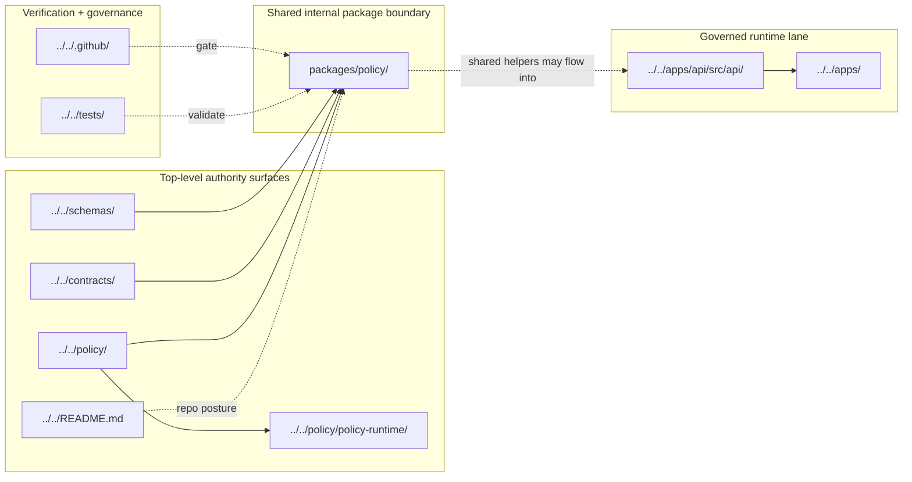

<!-- [KFM_META_BLOCK_V2]
doc_id: kfm://doc/<uuid-NEEDS-VERIFICATION>
title: packages/policy/
type: standard
version: v1
status: review
owners: @bartytime4life (CODEOWNERS fallback)
created: YYYY-MM-DD
updated: YYYY-MM-DD
policy_label: public
related: [packages/README.md, policy/README.md, policy/policy-runtime/README.md, apps/api/src/api/README.md, tests/README.md, .github/README.md]
tags: [kfm, packages, policy, internal-boundary]
notes: [doc_id and date fields need repo-backed values; owners use current public CODEOWNERS fallback]
[/KFM_META_BLOCK_V2] -->

<a id="top"></a>

# `packages/policy/`

Shared internal policy-support boundary for KFM package code that helps governed runtimes consume policy consistently without relocating the repo-authoritative policy surface.


| Field | Value |
|---|---|
| Status | `experimental` package surface · `review` README revision |
| Owners | [`@bartytime4life`](../../.github/CODEOWNERS) *(fallback owner verified in `CODEOWNERS`)* |
| Path | [`packages/policy/README.md`](./README.md) |
| Baseline | [`../README.md`](../README.md) for package-boundary law, plus [`../../policy/README.md`](../../policy/README.md) for the repo-authoritative policy lane |
| Adjacent seams | [`../../policy/policy-runtime/README.md`](../../policy/policy-runtime/README.md) for current runtime-policy documentation under top-level `policy/`; [`../../apps/api/src/api/README.md`](../../apps/api/src/api/README.md) for the governed API boundary |
| Repo fit | child package boundary inside [`../`](../) that should remain subordinate to [`../../policy/`](../../policy/), [`../../contracts/`](../../contracts/), [`../../schemas/`](../../schemas/), and governed runtime surfaces under [`../../apps/`](../../apps/) |
| Current repo evidence | `packages/policy/` resolves on current public `main` and currently contains `README.md` only; package-local manifests, source files, fixtures, tests, examples, and consumer imports are not yet confirmed |
| Truth posture | `CONFIRMED` current path + adjacent docs · `INFERRED` package-local role · `PROPOSED` deeper growth shape |
| Quick jump | [Scope](#scope) · [Evidence posture](#evidence-posture-used-in-this-readme) · [Repo fit](#repo-fit) · [Accepted inputs](#accepted-inputs) · [Exclusions](#exclusions) · [Current package surface](#current-package-surface) · [Directory tree](#directory-tree) · [Quickstart](#quickstart) · [Usage](#usage) · [Diagram](#diagram) · [Boundary matrix](#boundary-matrix) · [Task list](#task-list) · [FAQ](#faq) · [Appendix](#appendix) |

---

> [!IMPORTANT]
> `packages/policy/` is **not** the repo’s authoritative policy home. In the current repo, that role stays with [`../../policy/`](../../policy/). This package is for shared internal policy-support logic, not for a second policy source of truth.

> [!WARNING]
> Do **not** use this directory as a side door around the trust membrane. No package-local code here should create a hidden client-to-store path, a shadow policy path, or public route behavior that bypasses the governed API boundary documented under [`../../apps/api/src/api/`](../../apps/api/src/api/README.md) or other governed app surfaces under [`../../apps/`](../../apps/).

> [!NOTE]
> Current public branch inspection confirms adjacent documentation seams at [`../../policy/policy-runtime/README.md`](../../policy/policy-runtime/README.md) and [`../../apps/api/src/api/README.md`](../../apps/api/src/api/README.md), but it still does **not** confirm a package manifest, `src/`, tests, fixtures, examples, or consumer imports beneath this directory. Keep package-internal implementation claims at `UNKNOWN` or `NEEDS VERIFICATION` until the active branch proves them.

## Scope

`packages/policy/` should hold **shared internal policy adapters, obligation helpers, decision normalizers, and other policy-support logic** used by governed KFM runtimes.

Its job is to keep reusable policy-aware behavior bounded, inspectable, and reviewable without smearing that behavior across deployable apps or quietly relocating authority away from top-level policy, contracts, schemas, and governed data surfaces.

A healthy package here stays:

- **internal** rather than route-facing
- **shared** rather than one-off app glue
- **policy-aware** rather than policy-sovereign
- **bounded** rather than trust-mixing

## Evidence posture used in this README

| Label | Meaning here |
|---|---|
| `CONFIRMED` | directly supported by current public repo paths or neighboring repo docs inspected for this revision |
| `INFERRED` | strongly suggested by neighboring repo docs or attached KFM doctrine, but not re-proven beneath this directory |
| `PROPOSED` | recommended future shape or reviewable boundary rule, not current-tree fact |
| `UNKNOWN` | not established strongly enough in the current inspection to present as settled reality |
| `NEEDS VERIFICATION` | important enough that this README should not upgrade it without another tree check |

## Repo fit

### Relationship map

| Direction | Path | Role | Current certainty |
|---|---|---|---|
| Parent package contract | [`../README.md`](../README.md) | package-family boundary law and child-package expectations | `CONFIRMED` |
| Repo root posture | [`../../README.md`](../../README.md) | repo-wide verification-first operating frame | `CONFIRMED` |
| Policy authority | [`../../policy/README.md`](../../policy/README.md) | repo-authoritative policy surface | `CONFIRMED` |
| Runtime-policy documentation seam | [`../../policy/policy-runtime/README.md`](../../policy/policy-runtime/README.md) | current repo-visible documentation and coordination seam for request-time policy semantics under top-level `policy/` | `CONFIRMED` |
| Contract neighbors | [`../../contracts/`](../../contracts/) · [`../../schemas/`](../../schemas/) | canonical machine-contract and schema-adjacent lanes | `CONFIRMED` |
| Governed API boundary | [`../../apps/api/src/api/README.md`](../../apps/api/src/api/README.md) | runtime-facing enforcement boundary that documents policy evaluation, evidence resolution, and audit behavior | path + role `CONFIRMED` · imports `UNKNOWN` |
| Verification + governance | [`../../tests/README.md`](../../tests/README.md) · [`../../.github/README.md`](../../.github/README.md) | tests, review, ownership, and merge-gate context | `CONFIRMED` |

### Naming note

The current repo-visible package path is **`packages/policy/`**.

The current public `main` tree also exposes **`policy/policy-runtime/`** as a top-level documentation and coordination seam under `policy/`. That path is **not** the same thing as this package.

Some KFM doctrine and policy-adjacent materials also imply a future implementation seam named **`packages/policy-runtime/`** for request-time adapters or loaders. On the current public branch, that package path remains **`PROPOSED`** or **`NEEDS VERIFICATION`**, not confirmed implementation reality.

This README therefore documents `packages/policy/` as the current child package boundary, while keeping any mapping to doctrinal or future `policy-runtime` packaging explicit rather than silently renaming paths.

[Back to top](#top)

## Accepted inputs

The following belong here when they are real, shared, and package-scoped:

- internal adapters that translate authoritative policy outputs into package-local types or helpers
- reusable decision, reason, and obligation normalization logic
- shared helpers for finite policy outcomes and policy-safe error shaping
- import-safe wrappers that help governed runtimes consume top-level policy or contract surfaces
- narrow shared types that preserve visible `reason_codes`, `obligation_codes`, and outcome state without relocating authority
- package-local fixtures, examples, and tests that prove this package’s own contract
- export maps and local docs that explain the package boundary clearly

## Exclusions

| Do **not** put this here | Put it here instead | Why |
|---|---|---|
| repo-authoritative policy bundles, rule files, fixtures, or canonical policy docs | [`../../policy/`](../../policy/) | keeps one visible policy authority surface |
| runtime-policy documentation or coordination seams | [`../../policy/policy-runtime/`](../../policy/policy-runtime/) and related top-level policy docs | keeps request-time policy semantics visible at the top level rather than buried in a package |
| canonical schemas, vocabularies, or contract families | [`../../contracts/`](../../contracts/) · [`../../schemas/`](../../schemas/) | avoids parallel schema or vocabulary universes |
| public or internal API routes, app entrypoints, workers, or CLI runtime boundaries | [`../../apps/`](../../apps/) | deployable runtime surfaces belong in app lanes |
| repo-wide policy gates, workflow wiring, or merge controls | [`../../tests/`](../../tests/) · [`../../.github/`](../../.github/) | verification and CI/CD should stay visible and centralized |
| release artifacts, receipts, evidence bundles, catalogs, or published data | [`../../data/`](../../data/) | package code is not the release-bearing artifact home |
| environment-specific wiring, secrets, or infrastructure overlays | [`../../infra/`](../../infra/) or external secret management | package code must remain portable and auditable |

## Current package surface

| Item | Present on `main` | Current visible state | Reading rule |
|---|---|---|---|
| [`./README.md`](./README.md) | Yes | substantive boundary README; directory otherwise appears README-only on current public `main` | safe to refine as a boundary doc, but do not imply package internals that are not present |
| package manifest (`package.json`, `pyproject.toml`, etc.) | `NEEDS VERIFICATION` | not visible in the current public inspection | do not document install/build commands as current reality |
| `src/`, `tests/`, `fixtures/`, or `examples/` | `NEEDS VERIFICATION` | not visible in the current public inspection | keep deeper layout claims labeled `PROPOSED` |
| real consumer imports from `apps/` or other packages | `UNKNOWN` | not proven in the current inspection | link adjacent consumers as plausible surfaces, not as a confirmed import graph |

## Directory tree

### Current repo-visible tree

```text
packages/policy/
└── README.md
```

<details>
<summary><strong>Doctrine-aligned growth shape (PROPOSED, not current-tree fact)</strong></summary>

```text
packages/policy/
├── README.md
├── package.json
├── src/
│   ├── decision/
│   ├── obligations/
│   ├── adapters/
│   ├── runtime/
│   └── index.ts
├── tests/
│   ├── unit/
│   └── fixtures/
└── examples/
```

Use this only as a reviewable direction for future growth. Do not treat it as current implementation evidence.

If a future `packages/policy-runtime/` seam ever appears, it should be documented as a separate boundary decision rather than folded silently into this package.

</details>

## Quickstart

From the repo root, inspect first and upgrade claims second.

There is intentionally **no package-specific install, build, or test command here yet**, because a package manifest and runnable local inventory have not been confirmed for this directory.

```bash
# inspect what this package actually contains today
find packages/policy -maxdepth 4 -type f | sort

# read the local and neighboring boundary docs
sed -n '1,260p' packages/policy/README.md
sed -n '1,320p' packages/README.md
sed -n '1,260p' policy/README.md
sed -n '1,220p' policy/policy-runtime/README.md
sed -n '1,260p' apps/api/src/api/README.md
sed -n '1,260p' tests/README.md
sed -n '1,120p' .github/CODEOWNERS

# verify whether deeper implementation exists before documenting it
find packages/policy -maxdepth 4 \
  \( -name package.json -o -name pyproject.toml -o -name Cargo.toml -o -name go.mod -o -name tsconfig.json \) \
  | sort

# inspect neighboring contract and schema surfaces without assuming filenames
find contracts -maxdepth 2 -type f | sort
find schemas -maxdepth 2 -type f | sort

# trace policy-facing vocabulary across the repo
grep -RIn \
  'DecisionEnvelope\|RuntimeResponseEnvelope\|EvidenceBundle\|reason_codes\|obligation_codes\|policy-runtime' \
  packages policy contracts schemas apps tests docs 2>/dev/null || true
```

[Back to top](#top)

## Usage

### What good package-local code looks like

Good code in `packages/policy/` is usually:

- small enough to review as an internal boundary
- shared across more than one governed surface
- subordinate to stronger top-level policy and contract authority
- explicit about negative outcomes, reasons, and obligations

### Boundary rules

1. **Consume authoritative policy; do not redefine it.**  
   This package may help interpret or apply policy outputs, but it should not become a shadow source of truth.

2. **Preserve visible reasons and obligations.**  
   If a caller needs to know *why* something was denied, generalized, restricted, or sent to review, package code should help carry that information through rather than swallowing it.

3. **Keep exports narrow.**  
   A healthy package surface is small, typed, and obviously internal.

4. **Keep public behavior in app surfaces.**  
   Routes, review flows, and runtime entrypoints belong in `apps/`, even when they reuse helpers from this directory.

5. **Keep `policy/policy-runtime/` and `packages/policy/` distinct.**  
   The former is currently a top-level documentation and coordination seam under `policy/`; this package remains the child package boundary for shared internal helpers.

6. **Document boundary shifts before they spread.**  
   If this package starts owning bundle loading, public-contract consequences, or runtime-policy orchestration, update neighboring docs and raise an ADR.

### Illustrative helper shape

The example below is **illustrative only**. It shows the kind of narrow helper surface that fits this directory without claiming that the repo already implements it.

```ts
export interface PolicyDecisionLike {
  result: "allow" | "deny" | "generalize" | "restrict" | "review_required";
  reason_codes: string[];
  obligation_codes: string[];
  policy_bundle_version: string;
}

export function requireVisibleOutcome(decision: PolicyDecisionLike) {
  if (decision.reason_codes.length === 0) {
    throw new Error("missing reason_codes");
  }

  if (decision.result !== "allow" && decision.obligation_codes.length === 0) {
    throw new Error("missing obligation_codes for non-allow result");
  }

  return decision;
}
```

### Change discipline

When this package changes in a non-trivial way, the surrounding evidence should usually change with it:

- package-local tests or fixtures
- neighboring README updates when the boundary changes
- contract or schema updates when types become externally significant
- ADRs when the package begins to own architecture-significant policy behavior
- rollback notes when public or review consequences change

## Diagram


```mermaid
flowchart LR
  subgraph Authority["Top-level authority surfaces"]
    Root["../../README.md"]
    Policy["../../policy/"]
    RuntimeDoc["../../policy/policy-runtime/"]
    Contracts["../../contracts/"]
    Schemas["../../schemas/"]
  end

  subgraph Package["Shared internal package boundary"]
    Pkg["packages/policy/"]
  end

  subgraph Runtime["Governed runtime lane"]
    API["../../apps/api/src/api/"]
    Apps["../../apps/"]
  end

  subgraph Verify["Verification + governance"]
    Tests["../../tests/"]
    GitHub["../../.github/"]
  end

  Root -. repo posture .-> Pkg
  Policy --> Pkg
  Policy --> RuntimeDoc
  Contracts --> Pkg
  Schemas --> Pkg
  Pkg -. shared helpers may flow into .-> API
  API --> Apps
  Tests -. validate .-> Pkg
  GitHub -. gate .-> Pkg
```

Diagram note: the arrows show the **intended boundary direction** for this README. They do **not** claim a currently verified import graph.

## Boundary matrix

| Responsibility | Fits here? | Notes |
|---|---|---|
| shared policy adapters and helper functions | Yes | keep them internal and reusable |
| decision / reason / obligation normalization | Yes | helper logic only; do not redefine canonical registries silently |
| package-local tests and fixtures | Yes | especially for negative paths and fail-closed behavior |
| thin wrappers that expose top-level policy outputs to package consumers | Maybe | only if they stay subordinate to top-level policy authority and keep imports obvious |
| runtime-policy documentation seam or authoritative bundle coordination | No | current repo keeps that visibility under [`../../policy/policy-runtime/`](../../policy/policy-runtime/) and broader [`../../policy/`](../../policy/) |
| `.rego` bundles, canonical rule files, or authoritative fixtures | No | top-level `policy/` remains the authoritative lane |
| public route handlers or runtime entrypoints | No | deployable surfaces belong in `apps/` |
| release artifacts, evidence bundles, receipts, or manifests | No | those are trust-bearing outputs, not package internals |

[Back to top](#top)

## Task list

### Definition of done for real package expansion

| Gate | Done when |
|---|---|
| Truth | no second policy source of truth has been introduced |
| Surface | package exports are narrow, documented, and obviously internal |
| Tests | allow / deny / generalize / restrict / review-required cases are covered |
| Consumers | at least one real consumer path is documented and reviewable |
| Docs | neighboring READMEs are updated if this boundary changes materially |
| Rollback | previous behavior or import path can be restored without guesswork |

### Review checklist

- [ ] Reinspect the directory contents before claiming implementation depth.
- [ ] Keep top-level [`../../policy/`](../../policy/) as the authoritative policy surface.
- [ ] Keep [`../../policy/policy-runtime/`](../../policy/policy-runtime/) and `packages/policy/` distinct unless an explicit boundary change is reviewed.
- [ ] Add package-local tests and fixtures before broadening package responsibility.
- [ ] Document real consumers once imports exist.
- [ ] Update [`../README.md`](../README.md) if this package’s role changes materially.
- [ ] Update [`../../policy/README.md`](../../policy/README.md) and [`../../policy/policy-runtime/README.md`](../../policy/policy-runtime/README.md) if authority or runtime seams move.
- [ ] Raise an ADR if this package starts owning bundle loading, public-contract behavior, or runtime-policy orchestration.
- [ ] Replace the KFM meta-block placeholders with repo-backed values before publishing.

## FAQ

### Why not store policy bundles here?

Because the repo already keeps policy authority visible at the top level. This package may support that authority, but it should not hide it, split it, or dilute it.

### Is this the same thing as `policy-runtime`?

No. The current repo has **`packages/policy/`** as the child package path and **`policy/policy-runtime/`** as a separate top-level documentation seam under `policy/`. Any future **`packages/policy-runtime/`** implementation seam remains `PROPOSED` until the branch proves it.

### Can this package own public request behavior?

No. Public and steward-facing request families belong in governed app surfaces. This package may supply helpers, adapters, or shared types, but not the public runtime boundary itself.

### What would count as real implementation proof here?

A visible package manifest, source files, tests or fixtures, and at least one reviewable consumer import path in the active branch.

## Appendix

<details>
<summary><strong>Truth labels used in this README</strong></summary>

| Label | Meaning in this file |
|---|---|
| `CONFIRMED` | visible in the current public repo tree or neighboring repo docs |
| `INFERRED` | strongly suggested by neighboring docs or attached doctrine, but not directly proven under this directory |
| `PROPOSED` | a future shape or rule recommended for review, not a current-tree fact |
| `UNKNOWN` | not proven in the current inspection |
| `NEEDS VERIFICATION` | likely important enough that this README should not upgrade it without another tree check |

</details>

<details>
<summary><strong>Open verification backlog</strong></summary>

- confirm whether the mounted working tree contains package code beyond `README.md`
- confirm whether any real imports target `packages/policy/`
- decide whether a future `packages/policy-runtime/` seam is needed now that `policy/policy-runtime/` exists as a current documentation lane
- add package-specific execution or test commands only after a real package manifest appears
- replace KFM meta-block placeholders with repo-backed `doc_id`, `created`, and `updated` values
- narrow ownership beyond the repo-wide fallback if a more specific `CODEOWNERS` rule is introduced

</details>

[Back to top](#top)
