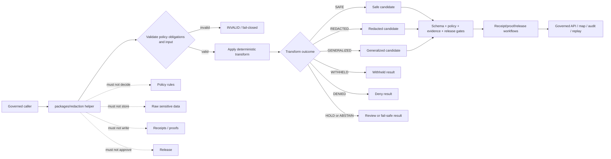

<!-- [KFM_META_BLOCK_V2]
doc_id: kfm://doc/NEEDS-VERIFICATION/packages-redaction-readme
title: Redaction Package README
type: readme
version: v1
status: draft
owners: OWNER_TBD
created: NEEDS VERIFICATION — target file existed before this revision as a short stub
updated: 2026-06-15
policy_label: public
related: [packages/README.md, packages/policy-runtime/README.md, packages/geo/README.md, packages/hashing/README.md, packages/identity/README.md, packages/envelopes/README.md, docs/doctrine/directory-rules.md, docs/doctrine/sensitivity.md, docs/architecture/sensitivity.md, docs/architecture/sensitive-domain-fail-closed.md, docs/standards/REDACTION_DETERMINISM.md, docs/standards/SENSITIVITY_RUBRIC.md, docs/security/DATA_CLASSIFICATION.md, policy/, contracts/, schemas/contracts/v1/, data/receipts/, data/proofs/, release/]
tags: [kfm, packages, redaction, privacy, sensitivity, geoprivacy, dna, living-person, location-generalization, redaction-receipt]
notes: ["README-like package entrypoint for deterministic redaction and generalization helper code.", "This package may contain helpers for redaction transforms, location generalization, geometry withholding, living-person suppression, DNA/genomic masking, sensitive-domain output shaping, and receipt-ready transform metadata.", "It must not own policy rules, schemas, contracts, lifecycle data, source records, receipts, proofs, release decisions, API routes, UI surfaces, or AI truth claims."]
[/KFM_META_BLOCK_V2] -->

<a id="top"></a>

# Redaction Package

Shared helper-code package for deterministic redaction, masking, withholding, aggregation, and generalization transforms used by KFM policy-aware workflows.

<p>
  
  
  
  
  
</p>

> [!IMPORTANT]
> **Status:** PROPOSED package README  
> **Path:** `packages/redaction/README.md`  
> **Owning responsibility root:** `packages/` — shared reusable implementation libraries  
> **Package purpose:** deterministic redaction/generalization helpers and receipt-ready transform metadata  
> **Policy authority:** `policy/`, not this package  
> **Schema authority:** `schemas/contracts/v1/`, not this package  
> **Receipt/proof authority:** `data/receipts/` and `data/proofs/`, not this package  
> **Release authority:** `release/`, not this package  
> **Repo implementation depth:** UNKNOWN for package metadata, import style, source files, tests, CI workflows, emitted receipts, proof packs, release manifests, branch protections, and runtime behavior.

## Scope

`packages/redaction/` is the shared implementation package lane for deterministic redaction and generalization helpers used by policy-runtime, pipelines, map/tile builders, governed APIs, Evidence Drawer assemblers, receipts, proofs, release gates, and tests.

This package may contain deterministic utilities for:

- applying policy-supplied redaction obligations to text, attributes, geometry, tabular fields, graph edges, and map feature properties;
- masking or removing living-person identifiers, contact details, household/private-property context, and other restricted personal fields;
- masking, suppressing, or refusing DNA/genomic and genealogy-sensitive fields according to explicit policy decisions;
- generalizing, aggregating, jittering, binning, withholding, or denying precise locations for rare species, archaeology, infrastructure, sacred/cultural places, living-person records, and other sensitive exact-location contexts;
- preparing public-safe feature/property candidates after policy and evidence gates have supplied obligations;
- producing receipt-ready transform metadata such as transform id, policy decision ref, input hash, output hash, method id, parameter profile, sensitivity reason, review flag, and rollback ref;
- supporting deterministic replay of redaction decisions without exposing raw sensitive inputs;
- building synthetic no-network fixtures for allowed, redacted, generalized, withheld, denied, and invalid transform paths.

This package must not decide policy, classify sensitivity as authority, fetch sources, store raw sensitive data, write receipts, write proofs, approve releases, publish artifacts, expose public routes, render UI, or generate truth claims.

```text
RAW -> WORK / QUARANTINE -> PROCESSED -> CATALOG / TRIPLET -> PUBLISHED
```

Redaction helpers may transform candidates before downstream release or rendering. They do not own lifecycle state, source authority, sensitivity policy, evidence authority, receipt state, proof state, review state, release state, or public truth.

[⬆ Back to top](#top)

---

## Repo fit

```text
packages/redaction/
```

This path is appropriate for reusable redaction helper code because `packages/` is the responsibility root for shared libraries used by apps, workers, pipelines, and tools.

| Relationship | Expected home | Boundary rule |
| --- | --- | --- |
| Redaction helper code | `packages/redaction/` | Deterministic transform helpers and receipt-ready metadata only. |
| Policy decisions and obligations | `policy/` plus `packages/policy-runtime/` | Policy decides whether to redact, restrict, hold, abstain, or deny. |
| Geometry primitives | `packages/geo/` | CRS, geometry validity, scale, and uncertainty helpers. |
| Hash helpers | `packages/hashing/` | Computes input/output/spec/artifact hashes for replay. |
| Identity helpers | `packages/identity/` | Handles deterministic ids and refs. |
| Runtime envelopes | `packages/envelopes/` | Maps redaction-related outcomes into finite runtime/public envelopes. |
| Semantic contracts | `contracts/` | Defines transform meaning and obligations. |
| Machine schemas | `schemas/contracts/v1/` | Defines redaction receipt, policy decision, transform, and feature shapes. |
| Lifecycle data | `data/<phase>/` | Owns raw/intermediate/processed/published records and artifacts. |
| Receipts and proofs | `data/receipts/`, `data/proofs/` | Stores RedactionReceipt and proof artifacts. |
| Release decisions | `release/` | Owns promotion, publication, correction, rollback, and supersession. |
| Public API and UI | `apps/`, `ui/`, `web/`, or repo-confirmed equivalents | Consume already-governed transformed outputs; package internals are not public authority. |
| Tests and fixtures | `tests/packages/redaction/`, `fixtures/packages/redaction/`, or repo-confirmed equivalents | Proves deterministic behavior with synthetic public-safe fixtures. |

> [!WARNING]
> Client-side hiding is not redaction. Sensitive geometry or attributes must be transformed, withheld, generalized, aggregated, delayed, or denied before publication/rendering, with transform metadata preserved for audit.

[⬆ Back to top](#top)

---

## Accepted inputs

Package helpers should accept explicit, inspectable values from governed callers. They should not fetch missing facts from source systems, raw stores, UI state, hidden globals, operator memory, or generated language.

| Input family | Accepted examples | Required handling |
| --- | --- | --- |
| Policy context | PolicyDecision ref, obligations, audience, sensitivity posture, reason codes | Apply supplied obligations; do not decide policy. |
| Transform context | transform id, method id, parameter profile, deterministic seed, version | Preserve replayability and method identity. |
| Field context | property path, field class, personal/sensitive flag, allowed output class | Redact, mask, omit, or preserve according to explicit obligations. |
| Geometry context | geometry ref, CRS, scale, uncertainty, precision, generalization rule, tile/profile context | Transform before render/public output; never rely on style filters. |
| Evidence context | EvidenceRef, EvidenceBundle ref, citation-validation ref | Preserve refs; do not fabricate evidence. |
| Identity/hash context | object id, input hash, output hash, spec hash, transform hash | Consume from identity/hashing helpers or explicit caller input. |
| Lifecycle context | input phase, output phase, release state, rollback ref, correction ref | Prevent invalid public exposure. |
| Fixture context | synthetic people/DNA/location/archaeology/rare-species/infrastructure examples | Keep fixtures fake, minimized, and public-safe. |

[⬆ Back to top](#top)

---

## Exclusions

| Do not put here | Correct home or owner | Reason |
| --- | --- | --- |
| Policy rules and sensitivity classification authority | `policy/` | Policy owns decisions and obligations. |
| JSON Schemas | `schemas/contracts/v1/` | Schemas own machine shape. |
| Semantic contracts | `contracts/` | Contracts own meaning. |
| RAW, WORK, QUARANTINE, PROCESSED, CATALOG, TRIPLET, or PUBLISHED data | `data/<phase>/` | Lifecycle state must remain phase-visible. |
| Source descriptors and source registries | `data/registry/` or repo-confirmed registry homes | Source authority, rights, cadence, and limitations are governance data. |
| Receipts, proof packs, validation reports | `data/receipts/`, `data/proofs/` | Trust artifacts must remain separately auditable. |
| Release manifests, rollback cards, correction notices | `release/` | Publication is a governed state transition. |
| Public API routes or serializers | `apps/` or repo-confirmed API app | Public clients must use governed APIs. |
| UI components, dashboards, map style filters | `apps/`, `ui/`, `web/`, or observability roots | Presentation is downstream from transformed outputs. |
| AI-generated sensitivity guesses or claims | governed AI runtime plus policy/evidence validation | AI output is interpretive and evidence-subordinate. |
| Secrets, source credentials, real DNA/genomic data, real living-person identifiers, protected-location examples | Nowhere in package fixtures | Fixtures must be synthetic and public-safe. |

[⬆ Back to top](#top)

---

## Redaction responsibilities

| Responsibility | Expected behavior |
| --- | --- |
| Deterministic transforms | Same input, policy obligation, method profile, and version should produce the same public-safe candidate. |
| Obligation execution | Apply supplied redaction/generalization/withholding/denial obligations without silently changing policy meaning. |
| Location protection | Generalize, aggregate, jitter, bin, omit, delay, or deny exact geometry before public output when required. |
| Attribute protection | Mask, omit, bucket, or suppress restricted fields before public output. |
| Receipt metadata | Prepare RedactionReceipt-ready metadata without storing receipts. |
| Replay support | Preserve input hash, output hash, method id, parameter profile, policy ref, and transform version. |
| Negative states | Return explicit deny, abstain, hold, invalid, or unsafe states rather than producing unsafe partial output. |
| Fixture support | Provide synthetic fixtures covering safe, redacted, generalized, withheld, denied, invalid, and replay-drift paths. |

[⬆ Back to top](#top)

---

## Expected package layout

> [!NOTE]
> The tree below is PROPOSED. Confirm package metadata, language conventions, import namespace, test layout, and CI before committing code beyond README files.

```text
packages/redaction/
├── README.md                       # This file: package boundary and trust rules
├── pyproject.toml / package.json    # NEEDS VERIFICATION
├── src/                             # NEEDS VERIFICATION
│   └── redaction/                   # PROPOSED namespace; confirm against repo convention
│       ├── README.md                # PROPOSED namespace guide
│       ├── __init__.py              # PROPOSED export boundary
│       ├── obligations.py           # PROPOSED policy obligation carriers
│       ├── fields.py                # PROPOSED text/attribute redaction helpers
│       ├── geometry.py              # PROPOSED location generalization helpers
│       ├── dna.py                   # PROPOSED DNA/genomic masking helpers
│       ├── living_person.py         # PROPOSED living-person suppression helpers
│       ├── receipts.py              # PROPOSED RedactionReceipt metadata carriers only
│       ├── replay.py                # PROPOSED replay metadata helpers
│       ├── validation.py            # PROPOSED transform validation helpers
│       ├── fixtures.py              # PROPOSED synthetic fixtures
│       └── py.typed                 # PROPOSED if typed package convention is confirmed
└── CHANGELOG.md                     # OPTIONAL / NEEDS VERIFICATION
```

Potential imports, subject to package verification:

```python
from redaction.fields import redact_properties
from redaction.geometry import generalize_location
from redaction.validation import validate_redaction_result
```

[⬆ Back to top](#top)

---

## Redaction helper outcomes

| Helper outcome | Use when | Runtime posture |
| --- | --- | --- |
| `SAFE` | Candidate is already safe under supplied policy obligations. | Candidate only; downstream release gates may still block. |
| `REDACTED` | Restricted attributes were masked, removed, bucketed, or suppressed. | Preserve transform metadata. |
| `GENERALIZED` | Location, geometry, time, or detail was generalized/aggregated/jittered/binned. | Preserve method/profile and uncertainty metadata. |
| `WITHHELD` | Output is suppressed from public/semi-public surfaces but may continue internally. | Preserve reason code and review path. |
| `DENIED` | Policy or sensitivity posture blocks output. | Deny with stable reason code. |
| `HOLD` | Steward review, rights review, cultural review, or maturity gate is required. | Internal governance state; not public allow. |
| `ABSTAIN` | Required policy, evidence, rights, or transform support is missing. | Fail safe; do not produce authoritative output. |
| `INVALID` | Input, obligation, method, or output validation fails. | Fail closed with receipt-ready error metadata. |

`SAFE` is not proof of truth, evidence closure, publication, or release. It only means the redaction helper found no additional transform required under the supplied policy context.

[⬆ Back to top](#top)

---

## Trust-boundary flow



[⬆ Back to top](#top)

---

## Development rules

1. Treat this package as a deterministic transform helper layer, not policy authority.
2. Prefer pure functions with explicit inputs and outputs.
3. Preserve policy ref, evidence refs, object ids, input hash, output hash, transform method id, parameter profile, sensitivity reason, obligations, release refs, rollback refs, and correction refs supplied by callers.
4. Do not make network calls from this package.
5. Do not read directly from RAW, WORK, QUARANTINE, unpublished candidates, source systems, source credentials, canonical stores, or model runtimes.
6. Do not write lifecycle data, policy rules, receipts, proofs, release manifests, source registries, catalog records, API responses, UI components, or map styles.
7. Do not approve release, publish artifacts, resolve evidence as truth, decide sensitivity as authority, or generate public claims.
8. Do not create schemas, contracts, policy source rules, source registries, pipeline DAGs, API routes, public answers, release decisions, or connector behavior from this package.
9. Do not store raw provider payloads, secrets, private source records, real living-person identifiers, DNA/genomic data, protected-location examples, or unrestricted sensitive context.
10. Return typed finite outcomes instead of implicit allow, warning-only redaction failure, hidden client-side suppression, or unsafe partial output.
11. Add deterministic tests for every behavior-changing helper and every negative path.
12. Keep fixtures synthetic, sanitized, minimized, and public-safe.
13. Preserve rollback and correction metadata supplied by callers when transformed output can affect downstream publication candidates.

[⬆ Back to top](#top)

---

## Validation checklist

- [ ] Confirm `packages/redaction/` package metadata and language/runtime convention.
- [ ] Confirm import namespace and whether it is `redaction`, `kfm_redaction`, or repo-specific.
- [ ] Confirm owners and CODEOWNERS path coverage.
- [ ] Confirm policy homes for redaction, sensitivity, geoprivacy, living-person, DNA/genomic, archaeology, rare species, infrastructure, cultural/tribal, rights, and release obligations.
- [ ] Confirm schema homes for redaction transforms, obligations, transform outcomes, RedactionReceipt, PolicyDecision, and public-safe feature outputs.
- [ ] Confirm relationship with `packages/policy-runtime/`, `packages/geo/`, `packages/hashing/`, `packages/identity/`, and receipt/proof homes.
- [ ] Confirm tests for `SAFE`, `REDACTED`, `GENERALIZED`, `WITHHELD`, `DENIED`, `HOLD`, `ABSTAIN`, and `INVALID` paths.
- [ ] Confirm tests for missing policy, invalid obligation, sensitive exact location, living-person suppression, DNA/genomic masking, protected-site withholding, replay drift, rollback mismatch, and no client-side-only hiding.
- [ ] Confirm helpers do not access lifecycle stores, source systems, credentials, model runtimes, or unpublished candidate stores.
- [ ] Confirm helpers do not write policy rules, receipts, proofs, release manifests, catalog records, API responses, credentials, permissions, UI state, or map styles.

Suggested inspection commands:

```bash
find packages/redaction -maxdepth 5 -type f | sort
git grep -n "RedactionReceipt\|redaction\|generalization\|geoprivacy\|living-person\|DNA\|genomic\|sensitive exact location\|WITHHELD\|GENERALIZED" -- packages docs contracts schemas policy tests fixtures pipelines connectors tools apps 2>/dev/null || true
git grep -n "from redaction\|import redaction\|packages/redaction" -- . 2>/dev/null || true
```

[⬆ Back to top](#top)

---

## Rollback

Rollback is required if this package:

- becomes a parallel policy, schema, contract, source-registry, lifecycle-data, evidence/proof, receipt, release, API, UI, model-runtime, or source-data authority;
- treats missing policy, invalid obligation, sensitive exact location, living-person risk, DNA/genomic context, archaeology/cultural sensitivity, rare-species location, infrastructure risk, or rights gaps as implicit allow;
- writes lifecycle data, policy rules, receipts, proofs, release manifests, catalog records, API responses, or public UI state;
- fetches source data or directly reads RAW/WORK/QUARANTINE/unpublished candidates/source systems;
- hides sensitive disclosure only in client-side UI/style instead of transforming or withholding upstream;
- treats redacted output as proof of truth, evidence closure, admissibility, public safety, or release;
- stores secrets, source credentials, private source records, real living-person identifiers, DNA/genomic context, or protected-location examples in fixtures.

Rollback target: revert the package README or redaction-source PR, preserve audit notes, and file any authority drift in `docs/registers/DRIFT_REGISTER.md` or the repo-confirmed drift register.

[⬆ Back to top](#top)

---

## Evidence boundary

| Source | Status | Supports | Limits |
| --- | --- | --- | --- |
| Current target file | CONFIRMED | `packages/redaction/README.md` existed as a short stub naming DNA, location generalization, and living-person redaction transforms. | Stub did not prove package implementation maturity. |
| `packages/README.md` | CONFIRMED repo doc | `packages/` is for shared libraries used by apps, workers, pipelines, and tools. | Does not define redaction package behavior. |
| `docs/architecture/sensitive-domain-fail-closed.md` | CONFIRMED repo search result | Sensitive-domain fail-closed architecture exists as a repo doc. | Content was not re-read in full for this README pass. |
| `docs/standards/REDACTION_DETERMINISM.md` | CONFIRMED repo search result | Redaction determinism standard exists as a repo doc. | Content was not re-read in full for this README pass. |
| `docs/standards/SENSITIVITY_RUBRIC.md` and `docs/security/DATA_CLASSIFICATION.md` | CONFIRMED repo search results | Sensitivity and data-classification guidance exists. | Content was not re-read in full for this README pass. |
| Current file-generation pass | CONFIRMED request | User-requested target path and README expansion. | Does not inspect package metadata, tests, CI logs, dashboards, deployment posture, runtime behavior, or branch protection. |

[⬆ Back to top](#top)
